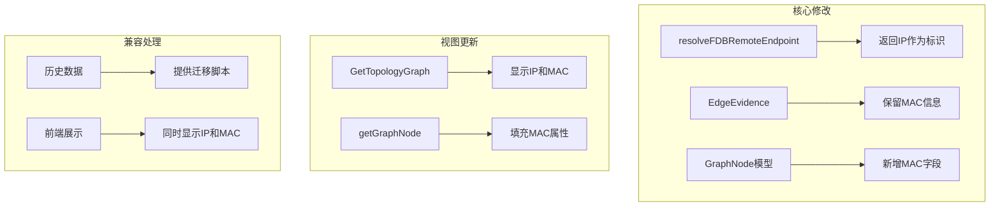

# 混合标识方案实施方案：推断节点使用IP为主、MAC为辅

## 一、方案概述

### 1.1 目标

将推断节点（server/terminal）的标识从MAC地址改为IP地址，同时保留MAC信息用于追溯和物理定位。

### 1.2 变更前后对比

| 项目 | 变更前 | 变更后 |
|------|--------|--------|
| 节点标识 | `server:0050-56c0-0002` | `server:192.168.58.1` |
| 节点标签 | MAC地址 | IP地址 |
| MAC信息 | 作为标识 | 存储在节点属性中 |

### 1.3 影响范围



## 二、详细实施方案

### 2.1 数据模型修改

#### 2.1.1 GraphNode 模型扩展

**文件**：[`internal/models/topology.go`](internal/models/topology.go:52)

```go
// GraphNode 图节点
// 阶段3架构演进：支持NodeUUID和NodeType，区分设备类型
type GraphNode struct {
    ID           string   `json:"id"`       // 兼容旧版：通常为DeviceIP
    NodeUUID     string   `json:"nodeUuid"` // 阶段3新增：全局唯一节点标识
    Label        string   `json:"label"`
    IP           string   `json:"ip"`
    AllIPs       []string `json:"allIps"` // 阶段3新增：设备所有IP地址
    Vendor       string   `json:"vendor"`
    Model        string   `json:"model"`
    Role         string   `json:"role"`
    Site         string   `json:"site"`
    SerialNumber string   `json:"serialNumber"`
    NodeType     NodeType `json:"nodeType"`  // 阶段3新增：节点类型
    ChassisID    string   `json:"chassisId"` // 阶段3新增：硬件标识
    // === 新增字段 ===
    MACAddress   string   `json:"macAddress"` // 推断节点的MAC地址
    MACAddresses []string `json:"macAddresses"` // 多MAC情况（服务器多网卡）
}
```

#### 2.1.2 EdgeEvidence 模型（已有，无需修改）

**文件**：[`internal/models/topology.go`](internal/models/topology.go:6)

```go
type EdgeEvidence struct {
    Type       string `json:"type"`
    DeviceID   string `json:"deviceId"`
    Command    string `json:"command"`
    RawRefID   string `json:"rawRefId"`
    Summary    string `json:"summary"`
    Source     string `json:"source"`
    LocalIf    string `json:"localIf"`
    RemoteName string `json:"remoteName"`
    RemoteIf   string `json:"remoteIf"`
    RemoteMAC  string `json:"remoteMac"` // 已有字段，保留MAC信息
    RemoteIP   string `json:"remoteIp"`
    Timestamp  string `json:"timestamp,omitempty"`
}
```

#### 2.1.3 TopologyEdgeCandidate 模型扩展

**文件**：[`internal/taskexec/topology_build_models.go`](internal/taskexec/topology_build_models.go)

**修改后**：
```go
type TopologyEdgeCandidate struct {
    CandidateID    string         `json:"candidateId"`
    ADeviceID      string         `json:"aDeviceId"`
    AIf            string         `json:"aIf"`
    LogicalAIf     string         `json:"logicalAIf"`
    BDeviceID      string         `json:"bDeviceId"`
    BIf            string         `json:"bIf"`
    LogicalBIf     string         `json:"logicalBIf"`
    EdgeType       string         `json:"edgeType"`
    Source         string         `json:"source"`
    Status         string         `json:"status"`
    TotalScore     float64        `json:"totalScore"`
    ScoreBreakdown string         `json:"scoreBreakdown"`
    Features       []string       `json:"features"`
    EvidenceRefs   []EdgeEvidence `json:"evidenceRefs"`
    DecisionReason string         `json:"decisionReason"`
    // === 新增字段 ===
    BDeviceMACs    []string       `json:"bDeviceMacs"` // B端设备的所有MAC地址
}
```

### 2.2 核心逻辑修改

#### 2.2.1 修改 resolveFDBRemoteEndpoint

**文件**：[`internal/taskexec/topology_builder.go`](internal/taskexec/topology_builder.go:790)

**修改前**：
```go
// resolveFDBRemoteEndpoint 解析 FDB 远端端点
func (b *TopologyBuilder) resolveFDBRemoteEndpoint(deviceIP, mac string, n *NormalizedFacts) (string, string, string) {
    // 检查 MAC 是否属于已知设备
    if deviceIP, ok := n.ARPMACToDevice[mac]; ok {
        return deviceIP, "device", ""
    }

    // 检查 MAC 是否有 ARP 记录
    if ip, ok := n.ARPMACToIP[mac]; ok {
        // 根据特征判断类型
        kind := "terminal"
        if strings.HasPrefix(ip, "192.168.") || strings.HasPrefix(ip, "10.") {
            kind = "server"
        }
        return kind + ":" + mac, kind, ip  // ⚠️ 使用MAC作为标识
    }

    // 未知 MAC
    return "unknown:" + mac, "unknown", ""
}
```

**修改后**：
```go
// resolveFDBRemoteEndpoint 解析 FDB 远端端点
// 返回值: (节点标识, 节点类型, IP地址, MAC地址)
func (b *TopologyBuilder) resolveFDBRemoteEndpoint(deviceIP, mac string, n *NormalizedFacts) (nodeID, kind, ip, resolvedMAC string) {
    // 检查 MAC 是否属于已知设备
    if deviceIP, ok := n.ARPMACToDevice[mac]; ok {
        return deviceIP, "device", "", mac
    }

    // 检查 MAC 是否有 ARP 记录
    if ip, ok := n.ARPMACToIP[mac]; ok {
        // 根据特征判断类型
        kind := "terminal"
        if strings.HasPrefix(ip, "192.168.") || strings.HasPrefix(ip, "10.") {
            kind = "server"
        }
        // 使用IP作为标识，同时返回MAC用于追溯
        return kind + ":" + ip, kind, ip, mac
    }

    // 未知 MAC - 仍使用MAC作为标识（因为没有IP）
    return "unknown:" + mac, "unknown", "", mac
}
```

#### 2.2.2 修改 buildFDBARPCandidates

**文件**：[`internal/taskexec/topology_builder.go`](internal/taskexec/topology_builder.go:687-780)

**修改前**：
```go
// 统计候选对端
candidatePeers := make(map[string]int) // remoteDevice -> count
for _, mac := range g.macs {
    remoteDevice, _, _ := b.resolveFDBRemoteEndpoint(deviceIP, mac, n)
    if remoteDevice != "" && remoteDevice != deviceIP {
        candidatePeers[remoteDevice]++
    }
}

// ...

// 构建证据
evidence := EdgeEvidence{
    Type:       "fdb_arp",
    Source:     "fdb",
    DeviceID:   deviceIP,
    Command:    chooseValue(g.commandKey, "mac_address"),
    RawRefID:   strings.Join(g.rawRefIDs, ","),
    LocalIf:    localIf,
    RemoteName: remoteDevice,
    RemoteIf:   remoteIf,
    RemoteIP:   remoteIP,
    Summary:    fmt.Sprintf("FDB/ARP 推断 %s -> %s via %s, macs=%d, kind=%s", deviceIP, remoteDevice, chooseValue(localLogicalIf, localIf), macCount, remoteKind),
}
```

**修改后**：
```go
// 统计候选对端（同时收集MAC信息）
candidatePeers := make(map[string]int)           // remoteDevice -> count
candidatePeerMACs := make(map[string][]string)   // remoteDevice -> []mac
for _, mac := range g.macs {
    remoteDevice, _, remoteIP, resolvedMAC := b.resolveFDBRemoteEndpoint(deviceIP, mac, n)
    if remoteDevice != "" && remoteDevice != deviceIP {
        candidatePeers[remoteDevice]++
        if resolvedMAC != "" {
            candidatePeerMACs[remoteDevice] = append(candidatePeerMACs[remoteDevice], resolvedMAC)
        }
    }
}

// ...

// 构建证据（保留MAC信息）
macList := candidatePeerMACs[remoteDevice]
evidence := EdgeEvidence{
    Type:       "fdb_arp",
    Source:     "fdb",
    DeviceID:   deviceIP,
    Command:    chooseValue(g.commandKey, "mac_address"),
    RawRefID:   strings.Join(g.rawRefIDs, ","),
    LocalIf:    localIf,
    RemoteName: remoteDevice,
    RemoteIf:   remoteIf,
    RemoteMAC:  strings.Join(macList, ","), // 保留所有MAC
    RemoteIP:   remoteIP,
    Summary:    fmt.Sprintf("FDB/ARP 推断 %s -> %s via %s, macs=%d, kind=%s", deviceIP, remoteDevice, chooseValue(localLogicalIf, localIf), macCount, remoteKind),
}
```

#### 2.2.3 修改 TaskTopologyEdge 模型

**文件**：[`internal/taskexec/topology_models.go`](internal/taskexec/topology_models.go:221)

**修改后**：
```go
type TaskTopologyEdge struct {
    ID               string         `gorm:"primaryKey" json:"id"`
    TaskRunID        string         `gorm:"index;not null" json:"taskRunId"`
    ADeviceID        string         `gorm:"index" json:"aDeviceId"`
    AIf              string         `json:"aIf"`
    BDeviceID        string         `gorm:"index" json:"bDeviceId"`
    BIf              string         `json:"bIf"`
    LogicalAIf       string         `json:"logicalAIf"`
    LogicalBIf       string         `json:"logicalBIf"`
    EdgeType         string         `json:"edgeType"`
    Status           string         `json:"status"`
    Confidence       float64        `json:"confidence"`
    DiscoveryMethods []string       `gorm:"serializer:json" json:"discoveryMethods"`
    Evidence         []EdgeEvidence `gorm:"serializer:json" json:"evidence"`
    ConfidenceBreakdown string     `gorm:"type:text" json:"confidenceBreakdown"`
    DecisionReason   string         `json:"decisionReason"`
    EvidenceRefs     []string       `gorm:"serializer:json" json:"evidenceRefs"`
    CandidateID      string         `json:"candidateId"`
    TraceID          string         `json:"traceId"`
    // === 新增字段 ===
    BDeviceMAC       string         `json:"bDeviceMac"`                   // B端设备的主MAC地址
    BDeviceMACs      string         `gorm:"type:text" json:"bDeviceMacs"` // B端设备的多MAC（JSON数组）
    CreatedAt        time.Time      `json:"createdAt"`
    UpdatedAt        time.Time      `json:"updatedAt"`
}
```

#### 2.2.4 修改 materializeEdges（关键：填充MAC字段）

**文件**：[`internal/taskexec/topology_builder.go`](internal/taskexec/topology_builder.go:1069)

**修改后**：
```go
// materializeEdges 生成最终边
func (b *TopologyBuilder) materializeEdges(candidates []*TopologyEdgeCandidate, runID string) []TaskTopologyEdge {
    edges := make([]TaskTopologyEdge, 0, len(candidates))

    for _, c := range candidates {
        if c.Status == "rejected" {
            continue
        }

        // 确定边状态
        status := "inferred"
        confidence := c.TotalScore / 100.0
        if confidence > b.config.ConfidenceThresholds.Confirmed {
            status = "confirmed"
        } else if confidence > b.config.ConfidenceThresholds.SemiConfirmed {
            status = "semi_confirmed"
        }

        if c.Status == "conflict" {
            status = "conflict"
        }

        // 提取B端设备MAC信息
        bDeviceMAC := ""
        bDeviceMACsJSON := ""
        if len(c.BDeviceMACs) > 0 {
            bDeviceMAC = c.BDeviceMACs[0] // 主MAC
            if len(c.BDeviceMACs) > 1 {
                // 多MAC序列化为JSON数组
                macsJSON, _ := json.Marshal(c.BDeviceMACs)
                bDeviceMACsJSON = string(macsJSON)
            }
        } else {
            // 从Evidence中提取MAC（兼容旧逻辑）
            for _, ev := range c.EvidenceRefs {
                if ev.RemoteMAC != "" {
                    bDeviceMAC = ev.RemoteMAC
                    break
                }
            }
        }

        edge := TaskTopologyEdge{
            ID:                  makeTaskEdgeID(),
            TaskRunID:           runID,
            ADeviceID:           c.ADeviceID,
            AIf:                 c.AIf,
            BDeviceID:           c.BDeviceID,
            BIf:                 c.BIf,
            BDeviceMAC:          bDeviceMAC,       // 填充B端MAC
            BDeviceMACs:         bDeviceMACsJSON,  // 填充多MAC
            LogicalAIf:          c.LogicalAIf,
            LogicalBIf:          c.LogicalBIf,
            EdgeType:            c.EdgeType,
            Status:              status,
            Confidence:          confidence,
            DiscoveryMethods:    c.Features,
            Evidence:            c.EvidenceRefs,
            ConfidenceBreakdown: c.ScoreBreakdown,
            DecisionReason:      c.DecisionReason,
            CandidateID:         c.CandidateID,
        }

        edges = append(edges, edge)
    }

    return edges
}
```

### 2.3 视图层修改

#### 2.3.1 修改 GetTopologyGraph

**文件**：[`internal/taskexec/topology_query.go`](internal/taskexec/topology_query.go:55-83)

**修改后**：
```go
nodes := make([]models.GraphNode, 0, len(nodeSet))
for id := range nodeSet {
    node := models.GraphNode{ID: id, Label: id}
    if d, ok := deviceMap[id]; ok {
        node.Label = chooseValue(d.DisplayName, d.Hostname, d.Model, d.DeviceIP)
        node.IP = d.DeviceIP
        node.Vendor = d.Vendor
        node.Model = d.Model
        node.Role = d.Role
        node.Site = d.Site
        node.SerialNumber = d.SerialNumber
        node.ChassisID = d.ChassisID
        node.NodeType = models.NodeTypeManaged
    } else if strings.HasPrefix(id, "server:") {
        ip := strings.TrimPrefix(id, "server:")
        node.Label = ip
        node.IP = ip
        node.Role = "server-inferred"
        node.Vendor = "endpoint"
        node.NodeType = models.NodeTypeInferred
        // 从边信息中提取MAC（优先从BDeviceMAC字段）
        mac, macs := extractMACFromEdges(edges, id)
        node.MACAddress = mac
        node.MACAddresses = macs
    } else if strings.HasPrefix(id, "terminal:") {
        ipOrMAC := strings.TrimPrefix(id, "terminal:")
        // 判断是IP还是MAC（检查是否包含冒号，MAC通常包含冒号或连字符）
        if isValidIP(ipOrMAC) {
            node.Label = ipOrMAC
            node.IP = ipOrMAC
        } else {
            node.Label = ipOrMAC
            node.MACAddress = ipOrMAC
        }
        node.Role = "terminal-inferred"
        node.Vendor = "endpoint"
        node.NodeType = models.NodeTypeInferred
        // 从边信息中提取MAC
        mac, macs := extractMACFromEdges(edges, id)
        if node.MACAddress == "" {
            node.MACAddress = mac
        }
        node.MACAddresses = macs
    } else if strings.HasPrefix(id, "unknown:") {
        // 处理未知MAC节点
        mac := strings.TrimPrefix(id, "unknown:")
        node.Label = mac
        node.MACAddress = mac
        node.Role = "unknown-inferred"
        node.Vendor = "unknown"
        node.NodeType = models.NodeTypeUnknown
    } else if strings.HasPrefix(id, "unmanaged:") {
        unmanagedID := strings.TrimPrefix(id, "unmanaged:")
        node.Label = unmanagedID
        node.IP = unmanagedID
        node.Role = "unmanaged"
        node.Vendor = "unknown"
        node.NodeType = models.NodeTypeUnmanaged
    }
    nodes = append(nodes, node)
}
```

#### 2.3.2 新增辅助函数

**文件**：[`internal/taskexec/topology_query.go`](internal/taskexec/topology_query.go)

```go
// extractMACFromEdges 从边信息中提取指定设备的MAC地址
// 返回: (主MAC, 所有MAC列表)
func extractMACFromEdges(edges []TaskTopologyEdge, deviceID string) (string, []string) {
    for _, e := range edges {
        if e.BDeviceID == deviceID {
            // 优先从BDeviceMAC字段读取
            if e.BDeviceMAC != "" {
                var macs []string
                if e.BDeviceMACs != "" {
                    json.Unmarshal([]byte(e.BDeviceMACs), &macs)
                }
                if len(macs) == 0 && e.BDeviceMAC != "" {
                    macs = []string{e.BDeviceMAC}
                }
                return e.BDeviceMAC, macs
            }
            // 降级：从Evidence中提取
            for _, ev := range e.Evidence {
                if ev.RemoteMAC != "" {
                    return ev.RemoteMAC, nil
                }
            }
        }
    }
    return "", nil
}

// isValidIP 检查字符串是否为有效IP地址（支持IPv4和IPv6）
func isValidIP(s string) bool {
    // 检查IPv4: x.x.x.x 格式
    if strings.Count(s, ".") == 3 {
        return net.ParseIP(s) != nil
    }
    // 检查IPv6格式
    if strings.Contains(s, ":") {
        return net.ParseIP(s) != nil
    }
    return false
}
```

#### 2.3.3 修改 getGraphNode

**文件**：[`internal/taskexec/topology_query.go`](internal/taskexec/topology_query.go:417-465)

```go
func (s *TaskExecutionService) getGraphNode(runID, deviceID string, macAddress ...string) models.GraphNode {
    if strings.TrimSpace(deviceID) == "" {
        return models.GraphNode{ID: "unknown", Label: "unknown"}
    }
    if strings.HasPrefix(deviceID, "server:") {
        ip := strings.TrimPrefix(deviceID, "server:")
        node := models.GraphNode{
            ID:        deviceID,
            Label:     ip,
            IP:        ip,
            Role:      "server-inferred",
            Vendor:    "endpoint",
            NodeType:  models.NodeTypeInferred,
        }
        if len(macAddress) > 0 && macAddress[0] != "" {
            node.MACAddress = macAddress[0]
        }
        return node
    }
    if strings.HasPrefix(deviceID, "terminal:") {
        ipOrMAC := strings.TrimPrefix(deviceID, "terminal:")
        node := models.GraphNode{
            ID:        deviceID,
            Role:      "terminal-inferred",
            Vendor:    "endpoint",
            NodeType:  models.NodeTypeInferred,
        }
        // 判断是IP还是MAC
        if isValidIP(ipOrMAC) {
            node.Label = ipOrMAC
            node.IP = ipOrMAC
        } else {
            node.Label = ipOrMAC
            node.MACAddress = ipOrMAC
        }
        if len(macAddress) > 0 && macAddress[0] != "" {
            node.MACAddress = macAddress[0]
        }
        return node
    }
    if strings.HasPrefix(deviceID, "unknown:") {
        mac := strings.TrimPrefix(deviceID, "unknown:")
        return models.GraphNode{
            ID:         deviceID,
            Label:      mac,
            MACAddress: mac,
            Role:       "unknown-inferred",
            Vendor:     "unknown",
            NodeType:   models.NodeTypeUnknown,
        }
    }
    var dev TaskRunDevice
    if err := s.db.Where("task_run_id = ? AND device_ip = ?", runID, deviceID).First(&dev).Error; err != nil {
        return models.GraphNode{ID: deviceID, Label: deviceID}
    }
    return models.GraphNode{
        ID:           deviceID,
        Label:        chooseValue(dev.DisplayName, dev.Hostname, dev.Model, dev.DeviceIP),
        IP:           dev.DeviceIP,
        Vendor:       dev.Vendor,
        Model:        dev.Model,
        Role:         dev.Role,
        Site:         dev.Site,
        SerialNumber: dev.SerialNumber,
        NodeType:     models.NodeTypeManaged,
    }
}
```

### 2.4 数据库迁移

#### 2.4.1 自动迁移

项目使用GORM框架，通过AutoMigrate自动处理字段新增：

```go
// 在 persistence.go 的 autoMigrate 函数中
func autoMigrate(db *gorm.DB) error {
    return db.AutoMigrate(
        // ... 其他表
        &TaskTopologyEdge{},
        // ... 其他表
    )
}
```

GORM会自动添加新字段 `b_device_mac` 和 `b_device_macs`。

#### 2.4.2 手动迁移脚本（可选）

**文件**：`scripts/migrate_inferred_nodes.sql`

用于历史数据更新（从MAC标识迁移到IP标识）：

```sql
-- 迁移脚本：将推断节点标识从MAC改为IP
-- 执行前请备份数据

-- 1. 添加新字段（如使用非GORM迁移）
-- ALTER TABLE task_topology_edges ADD COLUMN b_device_mac VARCHAR(64);
-- ALTER TABLE task_topology_edges ADD COLUMN b_device_macs TEXT;

-- 2. 更新现有数据（从Evidence中提取MAC到BDeviceMAC字段）
-- SQLite示例：
UPDATE task_topology_edges 
SET b_device_mac = json_extract(evidence, '$[0].remoteMac')
WHERE b_device_id LIKE 'server:%' OR b_device_id LIKE 'terminal:%'
AND (b_device_mac IS NULL OR b_device_mac = '');

-- 3. 更新节点标识（从MAC格式改为IP格式）
-- 创建临时映射表
CREATE TEMP TABLE IF NOT EXISTS mac_ip_mapping AS
SELECT DISTINCT mac_address, ip_address 
FROM task_parsed_arp_entries
WHERE mac_address IS NOT NULL AND ip_address IS NOT NULL;

-- 更新server:前缀的节点标识
UPDATE task_topology_edges 
SET b_device_id = 'server:' || (
    SELECT ip_address FROM mac_ip_mapping 
    WHERE mac_address = REPLACE(b_device_id, 'server:', '')
)
WHERE b_device_id LIKE 'server:%'
AND EXISTS (
    SELECT 1 FROM mac_ip_mapping 
    WHERE mac_address = REPLACE(b_device_id, 'server:', '')
);

-- 更新terminal:前缀的节点标识
UPDATE task_topology_edges 
SET b_device_id = 'terminal:' || (
    SELECT ip_address FROM mac_ip_mapping 
    WHERE mac_address = REPLACE(b_device_id, 'terminal:', '')
)
WHERE b_device_id LIKE 'terminal:%'
AND EXISTS (
    SELECT 1 FROM mac_ip_mapping 
    WHERE mac_address = REPLACE(b_device_id, 'terminal:', '')
);

-- 清理临时表
DROP TABLE IF EXISTS mac_ip_mapping;
```

### 2.5 前端适配

#### 2.5.1 节点显示逻辑

**文件**：`frontend/src/views/Topology.vue`

```typescript
import { parseIP } from '@/utils/ip'

// 节点标签显示逻辑
function getNodeLabel(node: GraphNode): string {
    if (node.label && node.label !== node.id) return node.label
    if (node.ip) return node.ip
    if (node.macAddress) return node.macAddress
    return node.id
}

// 节点详情显示
function getNodeDetails(node: GraphNode): string {
    const parts: string[] = []
    if (node.ip) parts.push(`IP: ${node.ip}`)
    if (node.macAddress) parts.push(`MAC: ${node.macAddress}`)
    if (node.macAddresses && node.macAddresses.length > 1) {
        parts.push(`多MAC: ${node.macAddresses.join(', ')}`)
    }
    if (node.role) parts.push(`角色: ${node.role}`)
    return parts.join(' | ')
}

// 判断是否为推断节点
function isInferredNode(node: GraphNode): boolean {
    return node.nodeType === 'inferred' || node.nodeType === 'unknown'
}

// 在模板中使用
// <span :title="getNodeDetails(node)">{{ getNodeLabel(node) }}</span>
```

#### 2.5.2 节点详情弹窗适配

**修改** `openDeviceDetail` 函数：

```typescript
async function openDeviceDetail(deviceID: string) {
    selectedDeviceID.value = deviceID
    loadingDeviceDetail.value = true
    try {
        // 推断节点特殊处理
        if (deviceID.startsWith("server:") || 
            deviceID.startsWith("terminal:") ||
            deviceID.startsWith("unknown:")) {
            const node = nodeByID.value.get(deviceID)
            deviceDetail.value = {
                taskId: selectedRunId.value,
                deviceIp: node?.ip || deviceID,
                parsedAt: new Date() as any,
                identity: {
                    vendor: node?.vendor || "inferred",
                    hostname: getNodeLabel(node!),
                    macAddress: node?.macAddress,
                } as any,
                interfaces: [],
                lldpNeighbors: [],
                fdbEntries: [],
                arpEntries: [],
                aggregates: [],
                // 添加推断节点标识
                isInferred: true,
                nodeType: node?.nodeType,
                macAddresses: node?.macAddresses,
            } as ParsedResult
            return
        }
        // ... 原有逻辑
    } finally {
        loadingDeviceDetail.value = false
    }
}
```

#### 2.5.3 新增IP工具函数

**文件**：`frontend/src/utils/ip.ts`

```typescript
// 简单IP验证（支持IPv4和IPv6）
export function isValidIP(ip: string): boolean {
    if (!ip || typeof ip !== 'string') return false
    
    // IPv4检查
    if (ip.includes('.') && !ip.includes(':')) {
        const parts = ip.split('.')
        if (parts.length !== 4) return false
        return parts.every(p => {
            const num = parseInt(p, 10)
            return !isNaN(num) && num >= 0 && num <= 255 && p === String(num)
        })
    }
    
    // IPv6检查（简化版）
    if (ip.includes(':')) {
        const parts = ip.split(':')
        return parts.length >= 2 && parts.length <= 8
    }
    
    return false
}

export function parseIP(ip: string): { type: 'ipv4' | 'ipv6' | 'invalid', formatted: string } {
    if (isValidIP(ip)) {
        return { 
            type: ip.includes(':') ? 'ipv6' : 'ipv4', 
            formatted: ip 
        }
    }
    return { type: 'invalid', formatted: ip }
}
```

## 三、测试计划

### 3.1 单元测试

**文件**：[`internal/taskexec/topology_builder_test.go`](internal/taskexec/topology_builder_test.go)

```go
func TestResolveFDBRemoteEndpoint_WithIP(t *testing.T) {
    n := &NormalizedFacts{
        ARPMACToDevice: make(map[string]string),
        ARPMACToIP: map[string]string{
            "0050-56c0-0002": "192.168.58.1",
        },
    }
    
    builder := NewTopologyBuilder(nil, DefaultTopologyBuildConfig())
    
    nodeID, kind, ip, mac := builder.resolveFDBRemoteEndpoint("10.0.0.1", "0050-56c0-0002", n)
    
    assert.Equal(t, "server:192.168.58.1", nodeID, "应使用IP作为标识")
    assert.Equal(t, "server", kind)
    assert.Equal(t, "192.168.58.1", ip)
    assert.Equal(t, "0050-56c0-0002", mac, "应返回MAC用于追溯")
}

func TestResolveFDBRemoteEndpoint_UnknownMAC(t *testing.T) {
    n := &NormalizedFacts{
        ARPMACToDevice: make(map[string]string),
        ARPMACToIP:     make(map[string]string),
    }
    
    builder := NewTopologyBuilder(nil, DefaultTopologyBuildConfig())
    
    nodeID, kind, ip, mac := builder.resolveFDBRemoteEndpoint("10.0.0.1", "unknown-mac", n)
    
    assert.Equal(t, "unknown:unknown-mac", nodeID, "未知MAC仍使用MAC作为标识")
    assert.Equal(t, "unknown", kind)
    assert.Equal(t, "", ip)
    assert.Equal(t, "unknown-mac", mac)
}

func TestResolveFDBRemoteEndpoint_IPv6(t *testing.T) {
    n := &NormalizedFacts{
        ARPMACToDevice: make(map[string]string),
        ARPMACToIP: map[string]string{
            "0050-56c0-0003": "2001:db8::1",
        },
    }
    
    builder := NewTopologyBuilder(nil, DefaultTopologyBuildConfig())
    
    nodeID, kind, ip, mac := builder.resolveFDBRemoteEndpoint("10.0.0.1", "0050-56c0-0003", n)
    
    assert.Equal(t, "server:2001:db8::1", nodeID, "应支持IPv6地址作为标识")
    assert.Equal(t, "server", kind)
    assert.Equal(t, "2001:db8::1", ip)
}

func TestMaterializeEdges_WithMAC(t *testing.T) {
    cfg := DefaultTopologyBuildConfig()
    builder := NewTopologyBuilder(nil, cfg)
    
    candidates := []*TopologyEdgeCandidate{
        {
            CandidateID:  "cand-1",
            ADeviceID:    "192.168.1.1",
            BDeviceID:    "server:192.168.1.100",
            BDeviceMACs:  []string{"00:50:56:c0:00:01", "00:50:56:c0:00:02"},
            Status:       "retained",
            TotalScore:   85.0,
            EdgeType:     "physical",
            EvidenceRefs: []EdgeEvidence{{RemoteMAC: "00:50:56:c0:00:01"}},
        },
    }
    
    edges := builder.materializeEdges(candidates, "test-run")
    
    require.Len(t, edges, 1)
    assert.Equal(t, "00:50:56:c0:00:01", edges[0].BDeviceMAC, "应填充主MAC")
    assert.Contains(t, edges[0].BDeviceMACs, "00:50:56:c0:00:01", "应填充多MAC JSON")
    assert.Contains(t, edges[0].BDeviceMACs, "00:50:56:c0:00:02", "应填充多MAC JSON")
}
```

### 3.2 集成测试

```go
func TestBuildFDBARPCandidates_IPBasedIdentification(t *testing.T) {
    // 准备测试数据
    input := &TopologyBuildInput{
        RunID: "test-run",
        Devices: []TaskRunDevice{
            {DeviceIP: "192.168.58.200", NormalizedName: "switch-1"},
        },
        FDBEntries: []TaskParsedFDBEntry{
            {DeviceIP: "192.168.58.200", MACAddress: "0050-56c0-0002", Interface: "GE1/0/2", VLAN: 100},
            {DeviceIP: "192.168.58.200", MACAddress: "0050-56c0-0003", Interface: "GE1/0/2", VLAN: 100},
        },
        ARPEntries: []TaskParsedARPEntry{
            {DeviceIP: "192.168.58.200", IPAddress: "192.168.58.1", MACAddress: "0050-56c0-0002", Interface: "GE1/0/2"},
            {DeviceIP: "192.168.58.200", IPAddress: "192.168.58.1", MACAddress: "0050-56c0-0003", Interface: "GE1/0/2"},
        },
    }
    
    builder := NewTopologyBuilder(testDB, DefaultTopologyBuildConfig())
    n := builder.normalizeFacts(input)
    candidates := builder.buildFDBARPCandidates(n)
    
    require.Len(t, candidates, 1)
    assert.Equal(t, "server:192.168.58.1", candidates[0].BDeviceID, "应使用IP作为节点标识")
    assert.Len(t, candidates[0].BDeviceMACs, 2, "应收集所有MAC地址")
    assert.Contains(t, candidates[0].EvidenceRefs[0].RemoteMAC, "0050-56c0", "Evidence中应保留MAC")
}

func TestGetTopologyGraph_InferredNodes(t *testing.T) {
    // 测试推断节点在图视图中的显示
    runID := "test-run-inferred"
    
    // 准备测试数据...
    
    svc := NewTaskExecutionService(testDB, nil, nil, nil)
    graph, err := svc.GetTopologyGraph(runID)
    
    require.NoError(t, err)
    
    // 验证server节点
    for _, node := range graph.Nodes {
        if strings.HasPrefix(node.ID, "server:") {
            assert.NotEmpty(t, node.IP, "server节点应有IP")
            assert.NotEmpty(t, node.MACAddress, "server节点应有MAC")
            assert.Equal(t, models.NodeTypeInferred, node.NodeType)
        }
    }
}
```

### 3.3 回归测试

| 测试场景 | 预期结果 |
|---------|---------|
| 单MAC单IP | 节点标识为 `server:IP`，BDeviceMAC填充MAC |
| 多MAC同一IP | 节点标识为 `server:IP`，BDeviceMACs包含所有MAC |
| 无ARP记录的MAC | 节点标识为 `unknown:MAC` |
| IPv6地址 | 节点标识为 `server:IPv6`，正确处理冒号 |
| DHCP环境IP变化 | 新节点标识，但可通过MAC关联历史 |
| 历史数据兼容 | 迁移后节点标识更新，MAC信息保留 |
| 前端显示 | 推断节点同时显示IP和MAC |

## 四、实施步骤

### 4.1 实施顺序

1. **Phase 1：数据模型扩展**（无破坏性）
   - 扩展 `GraphNode` 模型（添加MACAddress/MACAddresses）
   - 扩展 `TaskTopologyEdge` 模型（添加BDeviceMAC/BDeviceMACs）
   - 扩展 `TopologyEdgeCandidate` 模型（添加BDeviceMACs）
   - 运行数据库AutoMigrate自动迁移

2. **Phase 2：核心逻辑修改**
   - 修改 `resolveFDBRemoteEndpoint` 返回4个值
   - 修改 `buildFDBARPCandidates` 收集MAC信息到候选
   - 修改 `materializeEdges` 填充BDeviceMAC/BDeviceMACs字段（关键）
   - 更新单元测试

3. **Phase 3：视图层适配**
   - 修改 `GetTopologyGraph` 处理unknown:前缀节点
   - 更新 `extractMACFromEdges` 优先从BDeviceMAC读取
   - 添加 `isValidIP` 函数支持IPv6
   - 更新集成测试

4. **Phase 4：前端适配**
   - 新增IP工具函数 `isValidIP`/`parseIP`
   - 更新节点显示逻辑 `getNodeLabel`/`getNodeDetails`
   - 更新 `openDeviceDetail` 显示MAC信息

5. **Phase 5：数据迁移（可选）**
   - 执行迁移脚本更新历史数据（从MAC标识迁移到IP标识）
   - 验证迁移结果

### 4.2 回滚方案

如需回滚，执行以下步骤：

1. 恢复 `resolveFDBRemoteEndpoint` 返回MAC标识
2. 恢复 `buildFDBARPCandidates` 逻辑（移除MAC收集）
3. 恢复 `materializeEdges` 逻辑（移除MAC填充）
4. 前端恢复原有显示逻辑
5. 数据库字段可保留（向后兼容）

## 五、风险评估

| 风险项 | 风险等级 | 缓解措施 |
|--------|---------|---------|
| materializeEdges未填充MAC | 高 | 确保修改materializeEdges函数，从候选提取MAC填充到边 |
| 同一IP多MAC导致信息丢失 | 中 | 在BDeviceMACs字段保留所有MAC |
| DHCP环境节点标识不稳定 | 中 | 通过MAC关联历史数据（未来增强） |
| IPv6地址处理错误 | 中 | 使用net.ParseIP进行严格验证 |
| 历史数据迁移失败 | 低 | 提供手动迁移脚本和验证工具 |
| 前端显示异常 | 低 | 充分测试，保留降级显示逻辑 |

## 六、验收标准

1. ✅ 推断节点标识使用IP而非MAC
2. ✅ Evidence中保留MAC信息
3. ✅ materializeEdges正确填充BDeviceMAC/BDeviceMACs字段
4. ✅ 节点视图中同时显示IP和MAC
5. ✅ 支持IPv6地址格式
6. ✅ 正确处理unknown:前缀节点
7. ✅ 单元测试覆盖率 > 80%
8. ✅ 集成测试通过
9. ✅ 前端正确显示推断节点信息

---

*文档版本：v1.1*  
*更新时间：2026-04-14*  
*更新说明：补充materializeEdges MAC填充逻辑、unknown节点处理、IPv6支持、前端适配细节*
