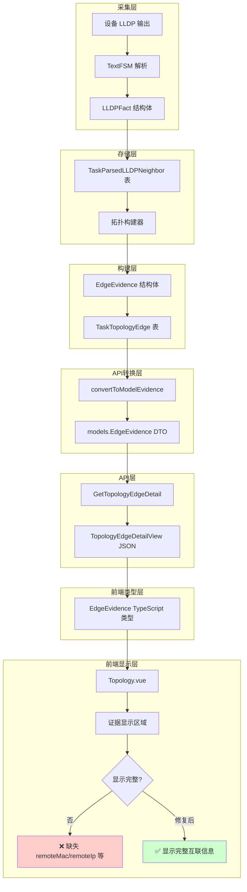

# 拓扑还原功能互联信息缺失问题分析报告

## 问题描述

用户反馈：拓扑还原功能的互联信息只展示了接口，没有展示 MAC 地址等其他详细信息。

## 问题定位

经过对代码的详细分析，发现问题出在**前端显示层**，而非后端数据层。后端已经正确采集、存储并返回了完整的互联信息，但前端在渲染时未展示这些字段。

## 数据流分析

### 1. 数据采集层（完整）

LLDP 邻居信息从设备采集后，解析器正确提取了以下字段：

**文件**: [`internal/parser/models.go:37-47`](internal/parser/models.go:37)

```go
// LLDPFact LLDP邻居信息
type LLDPFact struct {
    LocalInterface  string `json:"localInterface"`  // 本地接口
    NeighborName    string `json:"neighborName"`    // 邻居设备名
    NeighborChassis string `json:"neighborChassis"` // 邻居机箱ID
    NeighborPort    string `json:"neighborPort"`    // 邻居端口
    NeighborIP      string `json:"neighborIp"`      // 邻居管理IP
    NeighborDesc    string `json:"neighborDesc"`    // 邻居描述
    CommandKey      string `json:"commandKey"`      // 来源命令
    RawRefID        string `json:"rawRefId"`        // 原始输出引用ID
}
```

### 2. 数据存储层（完整）

LLDP 事实存储到数据库时，包含完整字段：

**文件**: [`internal/taskexec/topology_models.go:128-147`](internal/taskexec/topology_models.go:128)

```go
type TaskParsedLLDPNeighbor struct {
    ID              uint      `gorm:"primaryKey;autoIncrement" json:"id"`
    TaskRunID       string    `gorm:"index;not null" json:"taskRunId"`
    DeviceIP        string    `gorm:"index;not null" json:"deviceIp"`
    LocalInterface  string    `gorm:"index" json:"localInterface"`
    NeighborName    string    `json:"neighborName"`
    NeighborChassis string    `json:"neighborChassis"`
    NeighborPort    string    `json:"neighborPort"`
    NeighborIP      string    `json:"neighborIp"`
    NeighborDesc    string    `json:"neighborDesc"`
    CommandKey      string    `json:"commandKey"`
    RawRefID        string    `json:"rawRefId"`
    CreatedAt       time.Time `json:"createdAt"`
    UpdatedAt       time.Time `json:"updatedAt"`
}
```

### 3. 拓扑构建层（完整）

拓扑构建器在生成边证据时，正确填充了所有字段：

**文件**: [`internal/taskexec/topology_builder.go:459-472`](internal/taskexec/topology_builder.go:459)

```go
// 构建证据
evidence := EdgeEvidence{
    Type:       "lldp",
    Source:     "lldp",
    DeviceID:   lldp.DeviceIP,
    Command:    chooseValue(lldp.CommandKey, "lldp_neighbor"),
    RawRefID:   lldp.RawRefID,
    LocalIf:    lldp.LocalIf,
    RemoteName: lldp.NeighborName,    // ✅ 邻居名称
    RemoteIf:   remoteIf,              // ✅ 远端接口
    RemoteMAC:  lldp.NeighborChassis,  // ✅ MAC 地址
    RemoteIP:   lldp.NeighborIP,       // ✅ IP 地址
    Summary:    fmt.Sprintf("LLDP %s -> %s(%s)", chooseValue(localLogicalIf, lldp.LocalIf), lldp.NeighborName, chooseValue(remoteLogicalIf, remoteIf)),
}
```

### 4. 数据模型层（完整）

边证据模型在 DTO 层和运行时模型层都有完整定义：

**DTO 层**: [`internal/models/topology.go:6-21`](internal/models/topology.go:6)

```go
// EdgeEvidence 链路证据
// 仅作为统一运行时拓扑详情视图的嵌套 DTO。
type EdgeEvidence struct {
    Type       string `json:"type"`
    DeviceID   string `json:"deviceId"`
    Command    string `json:"command"`
    RawRefID   string `json:"rawRefId"`
    Summary    string `json:"summary"`
    Source     string `json:"source"`
    LocalIf    string `json:"localIf"`
    RemoteName string `json:"remoteName"`  // ✅ 已定义
    RemoteIf   string `json:"remoteIf"`    // ✅ 已定义
    RemoteMAC  string `json:"remoteMac"`   // ✅ 已定义
    RemoteIP   string `json:"remoteIp"`    // ✅ 已定义
    Timestamp  string `json:"timestamp,omitempty"`
}
```

**运行时模型层**: [`internal/taskexec/topology_models.go:250-263`](internal/taskexec/topology_models.go:250)

```go
type EdgeEvidence struct {
    Type       string `json:"type"`
    DeviceID   string `json:"deviceId"`
    Command    string `json:"command"`
    RawRefID   string `json:"rawRefId"`
    Summary    string `json:"summary"`
    Source     string `json:"source"`
    LocalIf    string `json:"localIf"`
    RemoteName string `json:"remoteName"`  // ✅ 已定义
    RemoteIf   string `json:"remoteIf"`    // ✅ 已定义
    RemoteMAC  string `json:"remoteMac"`   // ✅ 已定义
    RemoteIP   string `json:"remoteIp"`    // ✅ 已定义
    Timestamp  string `json:"timestamp,omitempty"`
}
```

### 5. API 转换层（完整）

运行时模型转换为 DTO 模型时，完整保留所有字段：

**文件**: [`internal/taskexec/topology_query.go:452-471`](internal/taskexec/topology_query.go:452)

```go
func convertToModelEvidence(items []EdgeEvidence) []models.EdgeEvidence {
    result := make([]models.EdgeEvidence, 0, len(items))
    for _, e := range items {
        result = append(result, models.EdgeEvidence{
            Type:       e.Type,
            DeviceID:   e.DeviceID,
            Command:    e.Command,
            RawRefID:   e.RawRefID,
            Summary:    e.Summary,
            Source:     e.Source,
            LocalIf:    e.LocalIf,
            RemoteName: e.RemoteName,  // ✅ 完整转换
            RemoteIf:   e.RemoteIf,    // ✅ 完整转换
            RemoteMAC:  e.RemoteMAC,   // ✅ 完整转换
            RemoteIP:   e.RemoteIP,    // ✅ 完整转换
            Timestamp:  e.Timestamp,
        })
    }
    return result
}
```

### 6. API 返回层（完整）

查询接口正确返回边详情：

**文件**: [`internal/taskexec/topology_query.go:121-145`](internal/taskexec/topology_query.go:121)

```go
func (s *TaskExecutionService) GetTopologyEdgeDetail(runID, edgeID string) (*models.TopologyEdgeDetailView, error) {
    var edge TaskTopologyEdge
    if err := s.db.Where("task_run_id = ? AND id = ?", runID, edgeID).First(&edge).Error; err != nil {
        return nil, err
    }

    return &models.TopologyEdgeDetailView{
        ID:                  edge.ID,
        ADevice:             s.getGraphNode(runID, edge.ADeviceID),
        AIf:                 edge.AIf,
        LogicalAIf:          edge.LogicalAIf,
        BDevice:             s.getGraphNode(runID, edge.BDeviceID),
        BIf:                 edge.BIf,
        LogicalBIf:          edge.LogicalBIf,
        EdgeType:            edge.EdgeType,
        Status:              edge.Status,
        Confidence:          edge.Confidence,
        DiscoveryMethods:    append([]string(nil), edge.DiscoveryMethods...),
        Evidence:            convertToModelEvidence(edge.Evidence),  // ✅ 包含完整证据
        ConfidenceBreakdown: edge.ConfidenceBreakdown,
        DecisionReason:      edge.DecisionReason,
        CandidateID:         edge.CandidateID,
        TraceID:             edge.TraceID,
    }, nil
}
```

### 7. 前端类型定义层（完整）

前端 TypeScript 绑定文件已正确定义了完整的 `EdgeEvidence` 类型：

**文件**: [`frontend/src/bindings/github.com/NetWeaverGo/core/internal/models/models.ts:570-634`](frontend/src/bindings/github.com/NetWeaverGo/core/internal/models/models.ts:570)

```typescript
/**
 * EdgeEvidence 链路证据
 * 仅作为统一运行时拓扑详情视图的嵌套 DTO。
 */
export class EdgeEvidence {
  "type": string;
  "deviceId": string;
  "command": string;
  "rawRefId": string;
  "summary": string;
  "source": string;
  "localIf": string;
  "remoteName": string; // ✅ 已定义
  "remoteIf": string; // ✅ 已定义
  "remoteMac": string; // ✅ 已定义
  "remoteIp": string; // ✅ 已定义
  "timestamp"?: string;

  /** Creates a new EdgeEvidence instance. */
  constructor($$source: Partial<EdgeEvidence> = {}) {
    // ... 构造函数实现
  }
}
```

### 8. 前端显示层（问题所在）

**文件**: [`frontend/src/views/Topology.vue:322-336`](frontend/src/views/Topology.vue:322)

前端在显示证据时，只展示了部分字段：

```vue
<div class="space-y-1 max-h-[220px] overflow-auto scrollbar-custom">
  <div
    v-for="(ev, idx) in edgeDetail.evidence"
    :key="idx"
    class="text-xs bg-bg-panel border border-border rounded px-2 py-1"
  >
    <div class="text-text-primary">
      {{ ev.type }} | {{ ev.summary || "-" }}
    </div>
    <div class="text-text-muted font-mono">
      device={{ ev.deviceId }} cmd={{ ev.command }} raw={{
        ev.rawRefId
      }}
    </div>
  </div>
</div>
```

**缺失显示的字段**：

- `remoteName` - 邻居设备名称
- `remoteIf` - 远端接口
- `remoteMac` - 远端 MAC 地址
- `remoteIp` - 远端 IP 地址

## 根本原因

前端 `Topology.vue` 在渲染证据列表时，仅展示了 `type`、`summary`、`deviceId`、`command`、`rawRefId`，未展示 `remoteName`、`remoteIf`、`remoteMac`、`remoteIp` 等关键互联信息。

## 修复方案

### 方案一：增强前端证据显示（推荐）

修改 [`frontend/src/views/Topology.vue`](frontend/src/views/Topology.vue:322) 的证据显示区域，增加互联详情展示：

```vue
<div class="space-y-1 max-h-[220px] overflow-auto scrollbar-custom">
  <div
    v-for="(ev, idx) in edgeDetail.evidence"
    :key="idx"
    class="text-xs bg-bg-panel border border-border rounded px-2 py-1"
  >
    <div class="text-text-primary">
      {{ ev.type }} | {{ ev.summary || "-" }}
    </div>
    <div class="text-text-muted font-mono">
      device={{ ev.deviceId }} cmd={{ ev.command }} raw={{ ev.rawRefId }}
    </div>
    <!-- 新增：互联详情 -->
    <div v-if="ev.remoteName || ev.remoteIf || ev.remoteMac || ev.remoteIp" class="text-text-muted font-mono mt-1 pt-1 border-t border-border">
      <span v-if="ev.remoteName">远端设备: {{ ev.remoteName }}</span>
      <span v-if="ev.remoteIf"> | 接口: {{ ev.remoteIf }}</span>
      <span v-if="ev.remoteMac"> | MAC: {{ ev.remoteMac }}</span>
      <span v-if="ev.remoteIp"> | IP: {{ ev.remoteIp }}</span>
    </div>
  </div>
</div>
```

### 方案二：增加专门的互联信息卡片

在链路证据区域下方增加一个"互联详情"卡片，以更直观的方式展示：

```vue
<div v-if="edgeDetail" class="p-4 space-y-2 text-sm">
  <!-- 现有内容 -->

  <!-- 新增：互联详情卡片 -->
  <div v-if="hasInterconnectionDetails" class="mt-3 pt-3 border-t border-border">
    <div class="text-xs text-text-muted mb-2">互联详情</div>
    <div class="grid grid-cols-2 gap-2 text-xs">
      <div v-if="getRemoteInfo('remoteName')">
        <span class="text-text-muted">远端设备:</span>
        <span class="text-text-primary ml-1">{{ getRemoteInfo('remoteName') }}</span>
      </div>
      <div v-if="getRemoteInfo('remoteIf')">
        <span class="text-text-muted">远端接口:</span>
        <span class="text-text-primary font-mono ml-1">{{ getRemoteInfo('remoteIf') }}</span>
      </div>
      <div v-if="getRemoteInfo('remoteMac')">
        <span class="text-text-muted">远端MAC:</span>
        <span class="text-text-primary font-mono ml-1">{{ getRemoteInfo('remoteMac') }}</span>
      </div>
      <div v-if="getRemoteInfo('remoteIp')">
        <span class="text-text-muted">远端IP:</span>
        <span class="text-text-primary font-mono ml-1">{{ getRemoteInfo('remoteIp') }}</span>
      </div>
    </div>
  </div>
</div>
```

## 数据流图



## 影响范围

| 层级 | 文件                              | 修改内容                       |
| ---- | --------------------------------- | ------------------------------ |
| 前端 | `frontend/src/views/Topology.vue` | 增强证据显示，添加互联详情字段 |

后端无需修改，数据已完整。前端类型定义也已完整，仅需修改显示组件。

## 验证方法

1. 执行拓扑采集任务
2. 查看拓扑图，点击任意链路
3. 确认"链路证据"区域显示：
   - 远端设备名称
   - 远端接口
   - 远端 MAC 地址
   - 远端 IP 地址

## 补充说明：数据链路完整性验证

### LLDP 数据流转完整路径

| 层级       | 文件/位置                                   | 数据结构               | remoteName | remoteIf | remoteMac | remoteIp |
| ---------- | ------------------------------------------- | ---------------------- | :--------: | :------: | :-------: | :------: |
| 采集解析   | `internal/parser/models.go:37`              | LLDPFact               |     ✅     |    ✅    |    ✅     |    ✅    |
| 数据存储   | `internal/taskexec/topology_models.go:128`  | TaskParsedLLDPNeighbor |     ✅     |    ✅    |    ✅     |    ✅    |
| 拓扑构建   | `internal/taskexec/topology_builder.go:459` | EdgeEvidence           |     ✅     |    ✅    |    ✅     |    ✅    |
| 运行时模型 | `internal/taskexec/topology_models.go:250`  | EdgeEvidence           |     ✅     |    ✅    |    ✅     |    ✅    |
| DTO模型    | `internal/models/topology.go:6`             | EdgeEvidence           |     ✅     |    ✅    |    ✅     |    ✅    |
| API转换    | `internal/taskexec/topology_query.go:452`   | convertToModelEvidence |     ✅     |    ✅    |    ✅     |    ✅    |
| 前端绑定   | `frontend/src/bindings/.../models.ts:570`   | EdgeEvidence           |     ✅     |    ✅    |    ✅     |    ✅    |
| 前端显示   | `frontend/src/views/Topology.vue:322`       | 模板渲染               |     ❌     |    ❌    |    ❌     |    ❌    |

### 问题定位确认

通过全链路代码审查确认：

1. **后端数据链路 100% 完整**：从 LLDP 解析到 API 返回，所有字段均被正确传递
2. **前端类型定义完整**：TypeScript 绑定文件包含所有字段
3. **唯一缺失点**：`Topology.vue` 第 328-336 行的模板渲染仅显示部分字段

## 总结

| 项目         | 状态            |
| ------------ | --------------- |
| 数据采集     | ✅ 完整         |
| 数据存储     | ✅ 完整         |
| 数据模型     | ✅ 完整         |
| API转换层    | ✅ 完整         |
| API 返回     | ✅ 完整         |
| 前端类型定义 | ✅ 完整         |
| 前端显示     | ❌ 缺失关键字段 |

**结论**：问题出在前端显示层，后端数据链路完整，前端类型定义也已完整。只需修改前端 `Topology.vue` 的显示逻辑即可解决问题。
