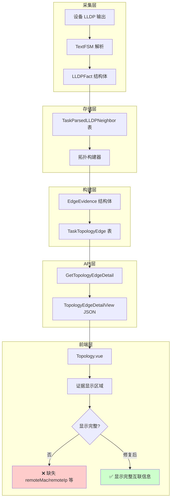

# 拓扑还原功能互联信息缺失问题分析报告

## 问题描述

用户反馈：拓扑还原功能的互联信息只展示了接口，没有展示 MAC 地址等其他详细信息。

## 问题定位

经过对代码的详细分析，发现问题出在**前端显示层**，而非后端数据层。后端已经正确采集、存储并返回了完整的互联信息，但前端在渲染时未展示这些字段。

## 数据流分析

### 1. 数据采集层（完整）

LLDP 邻居信息从设备采集后，解析器正确提取了以下字段：

**文件**: [`internal/parser/models.go:40-42`](internal/parser/models.go:40)

```go
type LLDPFact struct {
    LocalInterface  string `json:"localInterface"`  // 本地接口
    NeighborName    string `json:"neighborName"`    // 邻居设备名
    NeighborChassis string `json:"neighborChassis"` // 邻居机箱ID (MAC)
    NeighborPort    string `json:"neighborPort"`    // 邻居端口
    NeighborIP      string `json:"neighborIp"`      // 邻居IP
    NeighborDesc    string `json:"neighborDesc"`    // 邻居描述
}
```

### 2. 数据存储层（完整）

LLDP 事实存储到数据库时，包含完整字段：

**文件**: [`internal/taskexec/topology_models.go:128-143`](internal/taskexec/topology_models.go:128)

```go
type TaskParsedLLDPNeighbor struct {
    LocalInterface  string `json:"localInterface"`
    NeighborName    string `json:"neighborName"`
    NeighborChassis string `json:"neighborChassis"`  // MAC 地址
    NeighborPort    string `json:"neighborPort"`
    NeighborIP      string `json:"neighborIp"`
    NeighborDesc    string `json:"neighborDesc"`
    // ...
}
```

### 3. 拓扑构建层（完整）

拓扑构建器在生成边证据时，正确填充了所有字段：

**文件**: [`internal/taskexec/topology_builder.go:459-472`](internal/taskexec/topology_builder.go:459)

```go
evidence := EdgeEvidence{
    Type:       "lldp",
    Source:     "lldp",
    DeviceID:   lldp.DeviceIP,
    Command:    chooseValue(lldp.CommandKey, "lldp_neighbor"),
    RawRefID:   lldp.RawRefID,
    LocalIf:    lldp.LocalIf,
    RemoteName: lldp.NeighborName,    // ✅ 邻居名称
    RemoteIf:   remoteIf,              // ✅ 远端接口
    RemoteMAC:  lldp.NeighborChassis,  // ✅ MAC 地址
    RemoteIP:   lldp.NeighborIP,       // ✅ IP 地址
    Summary:    fmt.Sprintf("..."),
}
```

### 4. 数据模型层（完整）

边证据模型定义了完整字段：

**文件**: [`internal/taskexec/topology_models.go:250-263`](internal/taskexec/topology_models.go:250)

```go
type EdgeEvidence struct {
    Type       string `json:"type"`
    DeviceID   string `json:"deviceId"`
    Command    string `json:"command"`
    RawRefID   string `json:"rawRefId"`
    Summary    string `json:"summary"`
    Source     string `json:"source"`
    LocalIf    string `json:"localIf"`
    RemoteName string `json:"remoteName"`  // ✅ 已定义
    RemoteIf   string `json:"remoteIf"`    // ✅ 已定义
    RemoteMAC  string `json:"remoteMac"`   // ✅ 已定义
    RemoteIP   string `json:"remoteIp"`    // ✅ 已定义
    Timestamp  string `json:"timestamp,omitempty"`
}
```

### 5. API 返回层（完整）

查询接口正确返回边详情：

**文件**: [`internal/taskexec/topology_query.go:121-144`](internal/taskexec/topology_query.go:121)

```go
func (s *TaskExecutionService) GetTopologyEdgeDetail(runID, edgeID string) (*models.TopologyEdgeDetailView, error) {
    // ...
    return &models.TopologyEdgeDetailView{
        // ...
        Evidence: convertToModelEvidence(edge.Evidence),  // ✅ 包含完整证据
        // ...
    }, nil
}
```

### 6. 前端显示层（问题所在）

**文件**: [`frontend/src/views/Topology.vue:311-326`](frontend/src/views/Topology.vue:311)

前端在显示证据时，只展示了部分字段：

```vue
<div v-for="(ev, idx) in edgeDetail.evidence" :key="idx" class="text-xs bg-bg-panel border border-border rounded px-2 py-1">
  <div class="text-text-primary">
    {{ ev.type }} | {{ ev.summary || "-" }}
  </div>
  <div class="text-text-muted font-mono">
    device={{ ev.deviceId }} cmd={{ ev.command }} raw={{ ev.rawRefId }}
  </div>
</div>
```

**缺失显示的字段**：

- `remoteName` - 邻居设备名称
- `remoteIf` - 远端接口
- `remoteMac` - 远端 MAC 地址
- `remoteIp` - 远端 IP 地址

## 根本原因

前端 `Topology.vue` 在渲染证据列表时，仅展示了 `type`、`summary`、`deviceId`、`command`、`rawRefId`，未展示 `remoteName`、`remoteIf`、`remoteMac`、`remoteIp` 等关键互联信息。

## 修复方案

### 方案一：增强前端证据显示（推荐）

修改 [`frontend/src/views/Topology.vue`](frontend/src/views/Topology.vue:311) 的证据显示区域，增加互联详情展示：

```vue
<div v-for="(ev, idx) in edgeDetail.evidence" :key="idx" class="text-xs bg-bg-panel border border-border rounded px-2 py-1">
  <div class="text-text-primary">
    {{ ev.type }} | {{ ev.summary || "-" }}
  </div>
  <div class="text-text-muted font-mono">
    device={{ ev.deviceId }} cmd={{ ev.command }} raw={{ ev.rawRefId }}
  </div>
  <!-- 新增：互联详情 -->
  <div v-if="ev.remoteName || ev.remoteIf || ev.remoteMac || ev.remoteIp" class="text-text-muted font-mono mt-1 pt-1 border-t border-border">
    <span v-if="ev.remoteName">远端设备: {{ ev.remoteName }}</span>
    <span v-if="ev.remoteIf"> | 接口: {{ ev.remoteIf }}</span>
    <span v-if="ev.remoteMac"> | MAC: {{ ev.remoteMac }}</span>
    <span v-if="ev.remoteIp"> | IP: {{ ev.remoteIp }}</span>
  </div>
</div>
```

### 方案二：增加专门的互联信息卡片

在链路证据区域下方增加一个"互联详情"卡片，以更直观的方式展示：

```vue
<div v-if="edgeDetail" class="p-4 space-y-2 text-sm">
  <!-- 现有内容 -->

  <!-- 新增：互联详情卡片 -->
  <div v-if="hasInterconnectionDetails" class="mt-3 pt-3 border-t border-border">
    <div class="text-xs text-text-muted mb-2">互联详情</div>
    <div class="grid grid-cols-2 gap-2 text-xs">
      <div v-if="getRemoteInfo('remoteName')">
        <span class="text-text-muted">远端设备:</span>
        <span class="text-text-primary ml-1">{{ getRemoteInfo('remoteName') }}</span>
      </div>
      <div v-if="getRemoteInfo('remoteIf')">
        <span class="text-text-muted">远端接口:</span>
        <span class="text-text-primary font-mono ml-1">{{ getRemoteInfo('remoteIf') }}</span>
      </div>
      <div v-if="getRemoteInfo('remoteMac')">
        <span class="text-text-muted">远端MAC:</span>
        <span class="text-text-primary font-mono ml-1">{{ getRemoteInfo('remoteMac') }}</span>
      </div>
      <div v-if="getRemoteInfo('remoteIp')">
        <span class="text-text-muted">远端IP:</span>
        <span class="text-text-primary font-mono ml-1">{{ getRemoteInfo('remoteIp') }}</span>
      </div>
    </div>
  </div>
</div>
```

## 数据流图



## 影响范围

| 层级 | 文件                              | 修改内容                       |
| ---- | --------------------------------- | ------------------------------ |
| 前端 | `frontend/src/views/Topology.vue` | 增强证据显示，添加互联详情字段 |

后端无需修改，数据已完整。

## 验证方法

1. 执行拓扑采集任务
2. 查看拓扑图，点击任意链路
3. 确认"链路证据"区域显示：
   - 远端设备名称
   - 远端接口
   - 远端 MAC 地址
   - 远端 IP 地址

## 总结

| 项目     | 状态            |
| -------- | --------------- |
| 数据采集 | ✅ 完整         |
| 数据存储 | ✅ 完整         |
| 数据模型 | ✅ 完整         |
| API 返回 | ✅ 完整         |
| 前端显示 | ❌ 缺失关键字段 |

**结论**：问题出在前端显示层，后端数据链路完整。只需修改前端 `Topology.vue` 即可解决问题。
