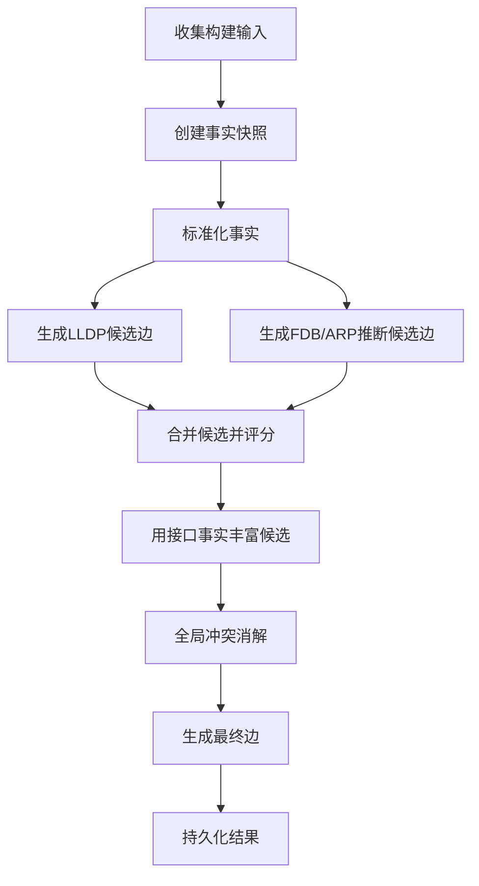
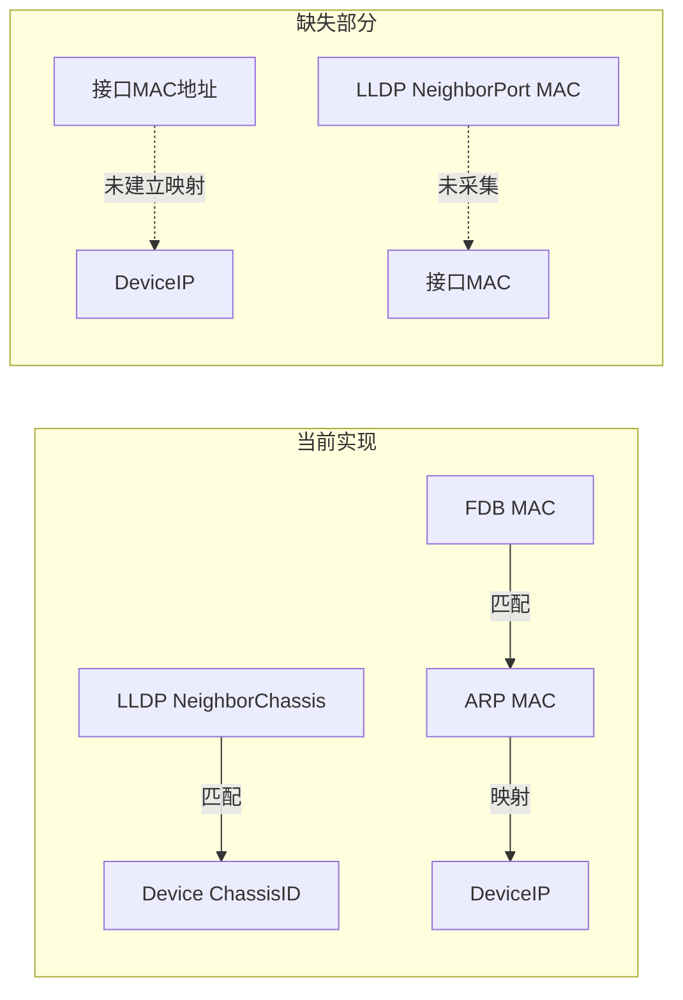
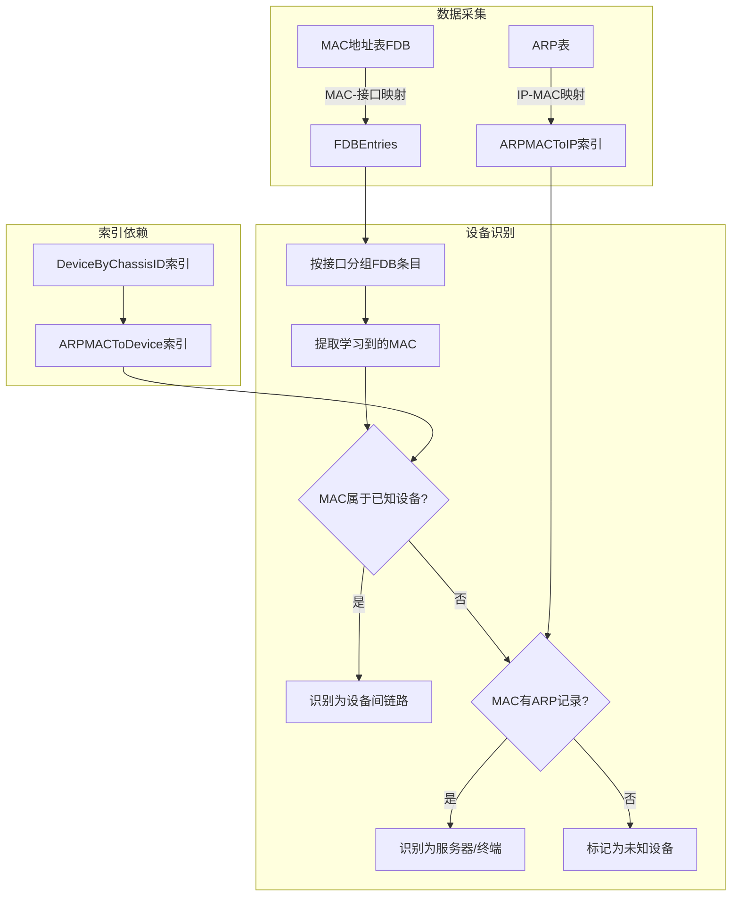
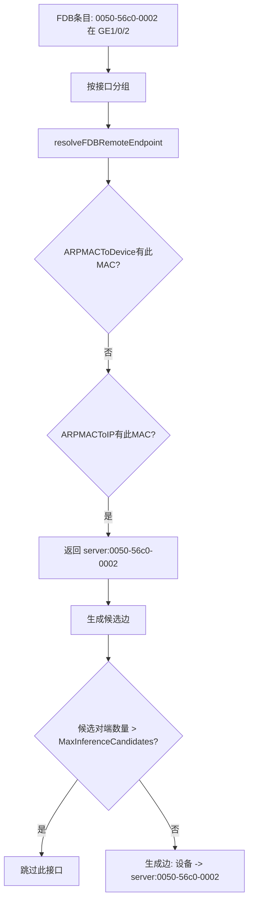

# 拓扑还原功能分析报告：接口MAC地址与ARP/MAC地址表的作用

## 一、概述

本报告详细分析了当前NetWeaverGo项目的拓扑还原功能，重点回答"是否能通过接口MAC地址还原拓扑"这一问题。

## 二、当前拓扑还原核心流程

拓扑构建器 [`TopologyBuilder`](internal/taskexec/topology_builder.go:26) 实现了分层构建流程：



### 2.1 数据收集阶段

从数据库收集以下事实数据：

| 数据类型 | 模型 | 说明 |
|---------|------|------|
| 设备信息 | [`TaskRunDevice`](internal/taskexec/topology_models.go:17) | 包含ChassisID、MgmtIP等 |
| LLDP邻居 | [`TaskParsedLLDPNeighbor`](internal/taskexec/topology_models.go:128) | 包含NeighborChassis、NeighborPort等 |
| FDB条目 | [`TaskParsedFDBEntry`](internal/taskexec/topology_models.go:149) | MAC地址学习表 |
| ARP条目 | [`TaskParsedARPEntry`](internal/taskexec/topology_models.go:168) | IP-MAC映射表 |
| 接口信息 | [`TaskParsedInterface`](internal/taskexec/topology_models.go:106) | **包含接口MAC地址** |
| 聚合组/成员 | [`TaskParsedAggregateGroup`](internal/taskexec/topology_models.go:187) | Eth-Trunk信息 |

### 2.2 标准化阶段

[`normalizeFacts`](internal/taskexec/topology_builder.go:265) 方法建立多个索引：

```go
type NormalizedFacts struct {
    Devices           map[string]*DeviceInfo // key: DeviceIP
    DeviceByName      map[string]string      // key: NormalizedName -> DeviceIP
    DeviceByMgmtIP    map[string]string      // key: MgmtIP -> DeviceIP
    DeviceByChassisID map[string]string      // key: ChassisID -> DeviceIP
    AllDeviceIPs      map[string]string      // key: 任意IP -> DeviceIP
    ARPMACToDevice    map[string]string      // key: MAC -> DeviceIP
    ARPMACToIP        map[string]string      // key: MAC -> IP
    Interfaces        map[string]*InterfaceInfo // key: DeviceIP|InterfaceName
}
```

## 三、设备识别机制分析

### 3.1 当前支持的识别方式

| 识别方式 | 索引 | 用途 | 优先级 |
|---------|------|------|--------|
| 管理IP | `DeviceByMgmtIP` | LLDP NeighborIP匹配 | 1（最高） |
| ChassisID | `DeviceByChassisID` | LLDP ChassisID匹配 | 2 |
| 设备名称 | `DeviceByName` | LLDP NeighborName匹配 | 3 |

### 3.2 LLDP对端解析逻辑

[`resolveLLDPPeer`](internal/taskexec/topology_builder.go:537) 实现穿透式匹配：

```go
// 1. 优先尝试 NeighborIP 匹配
if lldp.NeighborIP != "" {
    if deviceIP, ok := n.DeviceByMgmtIP[lldp.NeighborIP]; ok {
        return deviceIP, "neighbor_ip"
    }
    // ⚠ 不中断，继续尝试其他维度
}

// 2. 其次尝试 ChassisID 匹配（硬件MAC比设备名更可靠）
if lldp.NeighborChassis != "" {
    if deviceIP, ok := n.DeviceByChassisID[lldp.NeighborChassis]; ok {
        return deviceIP, "chassis_id"
    }
}

// 3. 最后尝试 NeighborName 匹配
if lldp.NeighborName != "" {
    normalizedName := strings.ToLower(strings.TrimSpace(lldp.NeighborName))
    if deviceIP, ok := n.DeviceByName[normalizedName]; ok {
        return deviceIP, "neighbor_name"
    }
}

// 4. 全部失败 → 标记为未管理设备
return "unmanaged:" + fallbackID, "unknown_peer"
```

### 3.3 FDB/ARP推断逻辑

[`resolveFDBRemoteEndpoint`](internal/taskexec/topology_builder.go:790) 方法：

```go
// 1. 检查MAC是否属于已知设备（通过ARPMACToDevice索引）
if deviceIP, ok := n.ARPMACToDevice[mac]; ok {
    return deviceIP, "device", ""
}

// 2. 检查MAC是否有ARP记录
if ip, ok := n.ARPMACToIP[mac]; ok {
    // 根据IP特征判断类型
    kind := "terminal"
    if strings.HasPrefix(ip, "192.168.") || strings.HasPrefix(ip, "10.") {
        kind = "server"
    }
    return kind + ":" + mac, kind, ip
}

// 3. 未知MAC
return "unknown:" + mac, "unknown", ""
```

## 四、接口MAC地址使用情况分析

### 4.1 接口MAC地址的采集与存储

接口MAC地址通过 `display interface` 命令采集，解析模板定义在 [`huawei.json`](internal/parser/templates/builtin/huawei.json:50)：

```json
{
    "pattern": "^\\s*Hardware\\s+address\\s+is\\s+(?P<mac>[0-9A-Fa-f:\\.-]+)",
    "mode": "set"
}
```

存储在 [`TaskParsedInterface.MACAddress`](internal/taskexec/topology_models.go:116) 字段。

### 4.2 实际数据示例

从采集数据 [`interface_detail_raw.txt`](Dist/netWeaverGoData/topology/raw/run_3e9e280b-c587-4789-80a2-3a2671ec8993/192.168.58.211/interface_detail_raw.txt:8) 可见：

```
GE0/0/0 current state : UP (ifindex: 6)
...
IP Sending Frames' Format is PKTFMT_ETHNT_2, Hardware address is facd-a44e-0051
```

### 4.3 ⚠️ 关键发现：接口MAC地址未被用于拓扑还原

经过代码分析，**接口MAC地址当前没有被用于设备识别或拓扑还原**：

1. **LLDP场景**：LLDP邻居信息中的 `NeighborChassis` 是设备的ChassisID（设备级MAC），不是接口MAC
2. **FDB场景**：FDB表中学习到的MAC是终端设备MAC或对端设备的ChassisID
3. **索引缺失**：没有建立 `InterfaceMAC -> DeviceIP` 的映射索引

当前接口MAC地址仅用于：
- 存储在数据库中供查询展示
- 在 [`enrichCandidatesWithInterfaceFacts`](internal/taskexec/topology_builder.go:893) 中检查接口状态（up/down）

## 五、问题回答：是否能通过接口MAC地址还原拓扑？

### 5.1 结论

**理论上可行，但当前实现不支持。**

### 5.2 原因分析



### 5.3 技术可行性分析

| 场景 | 可行性 | 说明 |
|------|--------|------|
| LLDP携带接口MAC | ✅ 可行 | 部分厂商LLDP报文携带Port ID MAC，可用于匹配对端接口MAC |
| FDB学习到接口MAC | ⚠️ 有限 | FDB学习的是源MAC，通常是终端设备MAC，而非交换机接口MAC |
| 跨厂商设备 | ⚠️ 复杂 | 不同厂商接口MAC命名规则不同，需要规范化处理 |

### 5.4 实现建议

如需支持通过接口MAC地址还原拓扑，需要进行以下改造：

#### 5.4.1 新增索引

```go
// 在 NormalizedFacts 中新增
InterfaceMACToDevice map[string]string // key: InterfaceMAC -> DeviceIP
InterfaceMACToPort    map[string]string // key: InterfaceMAC -> DeviceIP|InterfaceName
```

#### 5.4.2 建立索引逻辑

```go
// 在 normalizeFacts 方法中新增
for _, i := range input.Interfaces {
    if i.MACAddress != "" {
        mac := normalizeMACAddress(i.MACAddress)
        n.InterfaceMACToDevice[mac] = i.DeviceIP
        n.InterfaceMACToPort[mac] = i.DeviceIP + "|" + i.InterfaceName
    }
}
```

#### 5.4.3 修改LLDP解析逻辑

```go
// 在 resolveLLDPPeer 中新增接口MAC匹配
// 注意：需要确认LLDP报文是否携带接口MAC
if lldp.NeighborPortMAC != "" {
    if deviceIP, ok := n.InterfaceMACToDevice[lldp.NeighborPortMAC]; ok {
        return deviceIP, "interface_mac"
    }
}
```

#### 5.4.4 修改FDB解析逻辑

```go
// 在 resolveFDBRemoteEndpoint 中新增接口MAC匹配
if portInfo, ok := n.InterfaceMACToPort[mac]; ok {
    parts := strings.SplitN(portInfo, "|", 2)
    return parts[0], "device_interface", parts[1]
}
```

## 六、总结

### 6.1 当前状态

| 功能 | 支持情况 |
|------|---------|
| 通过管理IP识别设备 | ✅ 支持 |
| 通过ChassisID识别设备 | ✅ 支持 |
| 通过设备名称识别设备 | ✅ 支持 |
| 通过接口MAC识别设备 | ❌ 不支持 |

### 6.2 改造优先级建议

1. **高优先级**：完善ChassisID匹配（当前已支持，但需确保采集完整性）
2. **中优先级**：新增接口MAC索引，支持更精确的端口级拓扑还原
3. **低优先级**：支持LLDP Port ID MAC匹配（需确认厂商支持情况）

### 6.3 风险提示

1. 接口MAC可能因硬件更换而变化，稳定性不如ChassisID
2. 部分设备接口可能没有独立MAC（使用ChassisID）
3. 虚拟接口（VLAN、Loopback）通常没有物理MAC

---

## 七、深入分析：基于ARP和MAC地址表的拓扑还原

### 7.1 当前实现状态

**✅ 已支持基于ARP+MAC的拓扑推断**，但存在局限性。

### 7.2 工作原理



### 7.3 实际数据分析

以采集数据为例，展示ARP+MAC拓扑还原的实际效果：

#### 7.3.1 设备192.168.58.210（FW-1）的数据

**ARP表**：
| IP Address | MAC Address | Interface | Type |
|------------|-------------|-----------|------|
| 10.0.101.1 | facd-a44e-0014 | GE0/0/0 | Dynamic |
| 10.0.101.4 | facd-a44e-0054 | GE0/0/0 | Dynamic |
| 10.0.102.1 | facd-a44e-0015 | GE0/0/0 | Dynamic |
| 10.0.102.4 | facd-a44e-0055 | GE0/0/0 | Dynamic |

**MAC地址表**：
| MAC Address | VLAN | Learned-From | Type |
|-------------|------|--------------|------|
| facd-a44e-0011 | 100 | GE0/0/0 | dynamic |
| facd-a44e-0014 | 100 | GE0/0/0 | dynamic |
| facd-a44e-0054 | 100 | GE0/0/0 | dynamic |
| facd-a44e-0011 | 101 | GE0/0/0 | dynamic |
| facd-a44e-0015 | 101 | GE0/0/0 | dynamic |
| facd-a44e-0055 | 101 | GE0/0/0 | dynamic |

#### 7.3.2 拓扑推断过程

1. **FDB分组**：GE0/0/0接口学习到多个MAC
2. **MAC解析**：
   - `facd-a44e-0011` → 通过LLDP可知是CoreSw的ChassisID
   - `facd-a44e-0014` → ARP表显示IP为10.0.101.1
   - `facd-a44e-0054` → ARP表显示IP为10.0.101.4

3. **设备识别**：
   - 如果 `facd-a44e-0011` 匹配到已知设备的ChassisID → 识别为设备间链路
   - 如果MAC有ARP记录但无设备匹配 → 识别为服务器/终端

### 7.4 ⚠️ 关键局限性

#### 7.4.1 ARPMACToDevice索引建立不完整

当前 [`normalizeFacts`](internal/taskexec/topology_builder.go:421) 中建立索引的逻辑：

```go
// 建立 ARP MAC -> Device 映射
for _, a := range n.ARPEntries {
    // 检查 MAC 是否属于已知设备
    for deviceIP, dev := range n.Devices {
        if normalizeMACAddress(dev.ChassisID) == a.MACAddress {
            n.ARPMACToDevice[a.MACAddress] = deviceIP
            break
        }
    }
    n.ARPMACToIP[a.MACAddress] = a.IPAddress
}
```

**问题**：
- 仅通过ChassisID匹配，**未使用接口MAC进行匹配**
- 如果设备的ChassisID未采集或为空，则无法建立映射

#### 7.4.2 无法识别交换机间链路的具体端口

FDB学习到的MAC通常是：
- 终端设备MAC（服务器、PC）
- 对端交换机的ChassisID（用于设备级识别）

**无法确定**：
- 对端交换机的具体连接端口
- 只能推断"某端口连接到某设备"，无法确定对端端口

#### 7.4.3 多设备共享同一端口的问题

从数据可见，GE0/0/0学习到多个MAC：
- `facd-a44e-0011`（CoreSw）
- `facd-a44e-0014`、`facd-a44e-0054`等

**问题**：无法区分是：
- 直连CoreSw，其他MAC通过CoreSw到达
- 还是连接到下游交换机，所有MAC都通过下游交换机

### 7.5 改进建议

#### 7.5.1 增强ARPMACToDevice索引

```go
// 改进：同时使用ChassisID和接口MAC建立映射
for _, a := range n.ARPEntries {
    mac := normalizeMACAddress(a.MACAddress)
    
    // 1. 检查ChassisID匹配
    for deviceIP, dev := range n.Devices {
        if normalizeMACAddress(dev.ChassisID) == mac {
            n.ARPMACToDevice[mac] = deviceIP
            break
        }
    }
    
    // 2. 检查接口MAC匹配（新增）
    if _, ok := n.ARPMACToDevice[mac]; !ok {
        for key, iface := range n.Interfaces {
            if normalizeMACAddress(iface.MACAddress) == mac {
                parts := strings.SplitN(key, "|", 2)
                if len(parts) == 2 {
                    n.ARPMACToDevice[mac] = parts[0] // DeviceIP
                    break
                }
            }
        }
    }
    
    n.ARPMACToIP[mac] = a.IPAddress
}
```

#### 7.5.2 新增接口MAC索引

```go
// 在 NormalizedFacts 中新增
InterfaceMACToDevice map[string]string // key: InterfaceMAC -> DeviceIP
InterfaceMACToPort    map[string]string // key: InterfaceMAC -> DeviceIP|InterfaceName

// 在 normalizeFacts 中建立索引
for _, i := range input.Interfaces {
    if i.MACAddress != "" {
        mac := normalizeMACAddress(i.MACAddress)
        n.InterfaceMACToDevice[mac] = i.DeviceIP
        n.InterfaceMACToPort[mac] = i.DeviceIP + "|" + i.InterfaceName
    }
}
```

#### 7.5.3 改进FDB远端解析

```go
func (b *TopologyBuilder) resolveFDBRemoteEndpoint(deviceIP, mac string, n *NormalizedFacts) (string, string, string) {
    // 1. 检查MAC是否属于已知设备（通过ChassisID）
    if deviceIP, ok := n.ARPMACToDevice[mac]; ok {
        return deviceIP, "device", ""
    }
    
    // 2. 检查MAC是否属于已知设备的接口（新增）
    if portInfo, ok := n.InterfaceMACToPort[mac]; ok {
        parts := strings.SplitN(portInfo, "|", 2)
        if len(parts) == 2 {
            return parts[0], "device_interface", parts[1] // 返回设备IP和接口名
        }
    }
    
    // 3. 检查MAC是否有ARP记录
    if ip, ok := n.ARPMACToIP[mac]; ok {
        kind := "terminal"
        if strings.HasPrefix(ip, "192.168.") || strings.HasPrefix(ip, "10.") {
            kind = "server"
        }
        return kind + ":" + mac, kind, ip
    }
    
    // 4. 未知MAC
    return "unknown:" + mac, "unknown", ""
}
```

### 7.6 总结：ARP+MAC拓扑还原能力评估

| 能力 | 当前状态 | 改进后 |
|------|---------|--------|
| 识别终端设备（服务器/PC） | ✅ 支持 | ✅ 支持 |
| 识别交换机间链路（设备级） | ⚠️ 部分支持 | ✅ 完整支持 |
| 识别交换机间链路（端口级） | ❌ 不支持 | ⚠️ 部分支持 |
| 区分直连/透传设备 | ❌ 不支持 | ⚠️ 需要额外算法 |
| 无LLDP场景的拓扑还原 | ⚠️ 有限支持 | ✅ 增强支持 |

### 7.7 与LLDP的对比

| 特性 | LLDP | ARP+MAC |
|------|------|---------|
| 端口级精度 | ✅ 精确 | ❌ 无法确定对端端口 |
| 设备级精度 | ✅ 精确 | ⚠️ 依赖ChassisID/接口MAC |
| 终端设备发现 | ❌ 仅网络设备 | ✅ 可发现服务器/终端 |
| 配置依赖 | 需启用LLDP | 无需额外配置 |
| 跨厂商兼容 | ✅ 标准协议 | ⚠️ MAC格式差异 |

## 八、问题诊断：终端设备未显示在拓扑中

### 8.1 问题描述

用户反馈：ARP表中的终端设备 `192.168.58.1 (MAC: 0050-56c0-0002)` 没有显示在拓扑中。

**ARP表数据**：
```
192.168.58.1    0050-56c0-0002   20   D/100           GE1/0/2
```

**MAC地址表数据**：
```
0050-56c0-0002 100/-/-       GE1/0/2             dynamic                 81
```

### 8.2 根因分析

#### 8.2.1 FDB推断流程



#### 8.2.2 问题1：推断节点标识使用MAC而非IP

在 [`resolveFDBRemoteEndpoint`](internal/taskexec/topology_builder.go:798-804) 中：

```go
if ip, ok := n.ARPMACToIP[mac]; ok {
    kind := "terminal"
    if strings.HasPrefix(ip, "192.168.") || strings.HasPrefix(ip, "10.") {
        kind = "server"
    }
    return kind + ":" + mac, kind, ip  // ⚠️ 返回的是 MAC，不是 IP
}
```

**问题**：返回的设备ID是 `server:0050-56c0-0002`（MAC），而不是 `server:192.168.58.1`（IP）。

#### 8.2.3 问题2：推断边的置信度较低

FDB/ARP推断的评分计算：

| 评分项 | 值 |
|--------|-----|
| BaseScore | 20.0 |
| MACCountScore | 2 * 2.0 = 4.0 |
| EndpointScore (server) | 15.0 |
| RemoteIPScore | 5.0 |
| **总分** | **44.0** |
| **置信度** | **0.44** |

置信度阈值：Inferred = 0.35，所以边状态应该是 `inferred`，理论上应该会显示。

#### 8.2.4 ⚠️ 核心问题：可能的原因

| 可能原因 | 可能性 | 说明 |
|---------|--------|------|
| FDB/ARP数据未正确解析入库 | 高 | 需检查数据库中是否有对应的 FDB/ARP 条目 |
| 候选边被冲突消解淘汰 | 中 | 需检查候选边状态 |
| 边生成但未持久化 | 中 | 需检查 `task_topology_edges` 表 |
| 前端过滤了推断节点 | 低 | 需检查前端代码 |

### 8.3 诊断建议

1. **检查数据库**：
   ```sql
   -- 检查 FDB 条目
   SELECT * FROM task_parsed_fdb_entries
   WHERE task_run_id = 'run_xxx' AND mac_address = '0050-56c0-0002';
   
   -- 检查 ARP 条目
   SELECT * FROM task_parsed_arp_entries
   WHERE task_run_id = 'run_xxx' AND mac_address = '0050-56c0-0002';
   
   -- 检查拓扑边
   SELECT * FROM task_topology_edges
   WHERE task_run_id = 'run_xxx' AND b_device_id LIKE '%0050-56c0-0002%';
   ```

2. **检查日志**：查看拓扑构建日志，确认 FDB/ARP 推断是否执行

### 8.4 改进建议

#### 8.4.1 使用IP作为推断节点标识

```go
// 改进 resolveFDBRemoteEndpoint
if ip, ok := n.ARPMACToIP[mac]; ok {
    kind := "terminal"
    if strings.HasPrefix(ip, "192.168.") || strings.HasPrefix(ip, "10.") {
        kind = "server"
    }
    // 使用 IP 作为标识，更易识别
    return kind + ":" + ip, kind, ip
}
```

#### 8.4.2 增加诊断日志

```go
logger.Info("TopologyBuilder", runID,
    "FDB/ARP推断: device=%s, interface=%s, mac=%s, resolved=%s, kind=%s",
    deviceIP, localIf, mac, remoteDevice, remoteKind)
```

---

*报告生成时间：2026-04-14*
