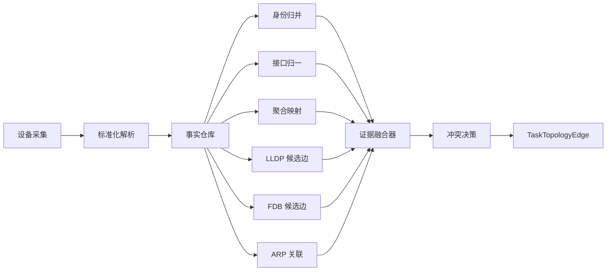

# 拓扑多源信息纳入构图逻辑方案规划

## 1. 目标

将当前仅依赖 [`lldp_neighbor`](../internal/taskexec/executor_impl.go#L1069) 的构图流程，升级为面向 **设备身份、接口、LLDP、FDB、ARP、聚合** 的多源融合构图引擎，使 [`buildRunTopology()`](../internal/taskexec/executor_impl.go#L1294) 不再是单一 LLDP 构边，而是形成完整的 `采集 -> 解析 -> 归一化 -> 候选边生成 -> 证据融合 -> 冲突决策 -> 拓扑输出` 闭环。

本规划面向新建项目，不考虑历史兼容包袱，按照整体架构重构，不做局部补丁式修修补补。

---

## 2. 当前问题归纳

当前架构里：

- 采集阶段已经获取 [`version`](../internal/config/device_profile.go#L148)、[`sysname`](../internal/config/device_profile.go#L149)、[`esn`](../internal/config/device_profile.go#L150)、[`lldp_neighbor`](../internal/config/device_profile.go#L152)、[`interface_brief`](../internal/config/device_profile.go#L153)、[`interface_detail`](../internal/config/device_profile.go#L154)、[`mac_address`](../internal/config/device_profile.go#L155)、[`eth_trunk`](../internal/config/device_profile.go#L156)、[`arp_all`](../internal/config/device_profile.go#L157)、[`device_info`](../internal/config/device_profile.go#L158)
- 解析阶段也已落库到 [`TaskParsedInterface`](../internal/taskexec/topology_models.go#L57)、[`TaskParsedLLDPNeighbor`](../internal/taskexec/topology_models.go#L79)、[`TaskParsedFDBEntry`](../internal/taskexec/topology_models.go#L100)、[`TaskParsedARPEntry`](../internal/taskexec/topology_models.go#L119)、[`TaskParsedAggregateGroup`](../internal/taskexec/topology_models.go#L138)、[`TaskParsedAggregateMember`](../internal/taskexec/topology_models.go#L155)
- 但构图阶段 [`buildRunTopology()`](../internal/taskexec/executor_impl.go#L1294) 只读取 [`TaskParsedLLDPNeighbor`](../internal/taskexec/executor_impl.go#L1301)

因此现状不是采集能力不够，而是 **多源数据没有进入统一构图引擎**。

---

## 3. 目标架构

### 3.1 核心分层

建议将构图逻辑拆成以下层次：

1. **事实层**
   - 直接消费 [`TaskParsedLLDPNeighbor`](../internal/taskexec/topology_models.go#L79)
   - 直接消费 [`TaskParsedFDBEntry`](../internal/taskexec/topology_models.go#L100)
   - 直接消费 [`TaskParsedARPEntry`](../internal/taskexec/topology_models.go#L119)
   - 直接消费 [`TaskParsedInterface`](../internal/taskexec/topology_models.go#L57)
   - 直接消费 [`TaskParsedAggregateGroup`](../internal/taskexec/topology_models.go#L138) 与 [`TaskParsedAggregateMember`](../internal/taskexec/topology_models.go#L155)

2. **归一化层**
   - 统一设备身份
   - 统一接口命名
   - 建立物理口到逻辑聚合口映射
   - 建立 `MAC -> 设备`、`IP -> 设备`、`名称 -> 设备` 索引

3. **候选边生成层**
   - LLDP 直连候选
   - FDB 二层推断候选
   - ARP 身份补全候选
   - 聚合链路候选
   - 服务器或终端挂载候选

4. **证据融合层**
   - 为每条候选边累积证据
   - 计算置信度
   - 标记发现方式
   - 标记逻辑接口与物理接口

5. **决策输出层**
   - 输出 [`TaskTopologyEdge`](../internal/taskexec/topology_models.go#L172)
   - 输出 `confirmed`、`semi_confirmed`、`inferred`、`conflict`
   - 输出完整 [`Evidence`](../internal/taskexec/topology_models.go#L186)

---

## 4. 各类信息如何纳入构图

## 4.1 设备身份信息

涉及来源：

- [`version`](../internal/taskexec/executor_impl.go#L1031)
- 后续建议补齐 [`sysname`](../internal/config/device_profile.go#L149)
- 后续建议补齐 [`esn`](../internal/config/device_profile.go#L150)
- 后续建议补齐 [`device_info`](../internal/config/device_profile.go#L158)

### 作用

设备身份信息不直接构边，但它是所有多源融合的基础：

- 统一设备主键
- 对齐 LLDP 邻居名
- 对齐 ARP 中管理 IP
- 对齐 FDB 中 MAC 所属设备
- 降低 unknown 节点比例

### 规划

建立统一 `IdentityResolver`，输出以下索引：

- `byDeviceIP`
- `byMgmtIP`
- `byNormalizedName`
- `byChassisID`
- `bySerialNumber`
- `byMACAddress` `后续可选`

### 预期收益

- 提升 [`NeighborName`](../internal/taskexec/topology_models.go#L85) 到设备实体的命中率
- 降低当前 [`unknown`](../internal/taskexec/executor_impl.go#L1357) 远端占位节点数量

---

## 4.2 接口信息

涉及来源：

- [`interface_brief`](../internal/taskexec/executor_impl.go#L1061)
- [`interface_detail`](../internal/taskexec/executor_impl.go#L1061)
- 入库目标 [`TaskParsedInterface`](../internal/taskexec/topology_models.go#L57)

### 作用

接口事实应承担以下职责：

- 统一接口命名
- 标记接口 up/down
- 标记接口速率与双工
- 标记接口是否聚合成员
- 为 FDB 候选边提供端口有效性校验

### 规划

建立 `InterfaceResolver`：

- 输出 `device + interface -> interfaceFact`
- 建立接口状态过滤器
- 过滤明显无效的 down 口候选边
- 为候选边补充接口属性，如速率、描述、是否 trunk 成员

### 预期收益

- 避免把临时学习到的无效端口直接当成链路
- 为聚合映射和物理逻辑口转换打基础

---

## 4.3 聚合信息

涉及来源：

- [`eth_trunk`](../internal/taskexec/executor_impl.go#L1108)
- 入库目标 [`TaskParsedAggregateGroup`](../internal/taskexec/topology_models.go#L138)
- 入库目标 [`TaskParsedAggregateMember`](../internal/taskexec/topology_models.go#L155)
- 输出字段 [`LogicalAIf`](../internal/taskexec/topology_models.go#L180)
- 输出字段 [`LogicalBIf`](../internal/taskexec/topology_models.go#L181)

### 作用

聚合信息负责把：

- 物理成员口
- 逻辑聚合口
- 端口模式

统一到一条拓扑语义上。

### 规划

建立 `AggregateResolver`：

- 生成 `device + memberPort -> aggregateName`
- 生成 `device + aggregateName -> memberPorts`
- 构图时同时保存：
  - 物理口到 [`AIf`](../internal/taskexec/topology_models.go#L177) / [`BIf`](../internal/taskexec/topology_models.go#L179)
  - 逻辑聚合口到 [`LogicalAIf`](../internal/taskexec/topology_models.go#L180) / [`LogicalBIf`](../internal/taskexec/topology_models.go#L181)

### 规则

- 如果 LLDP 报的是成员口，但成员口属于聚合，则边输出时同时补齐逻辑聚合口
- 如果 FDB 学习发生在聚合口，则优先以逻辑口构边，再回填成员口证据

### 预期收益

- 解决多条成员口边被误判成多条独立链路的问题
- 让规划比对和图形展示更符合真实网络语义

---

## 4.4 LLDP 信息

涉及来源：

- [`ToLLDP`](../internal/parser/mapper.go#L85)
- 入库目标 [`TaskParsedLLDPNeighbor`](../internal/taskexec/topology_models.go#L79)
- 当前构图主入口 [`buildRunTopology()`](../internal/taskexec/executor_impl.go#L1294)

### 作用

LLDP 仍然应当是 **最高优先级证据**，因为它是显式邻居声明。

### 规划

保留 LLDP 作为一级证据源，但升级处理规则：

- 双向 LLDP -> `confirmed`
- 单向 LLDP -> `semi_confirmed`
- LLDP 远端可识别设备但接口缺失 -> `semi_confirmed`
- LLDP 与 FDB 或聚合结论冲突 -> `conflict`

### 扩展

- 支持通过 `neighbor_ip`、`neighbor_name`、`neighbor_chassis` 三种维度做设备归并
- 将 LLDP 结果作为其他推断的“锚点”

---

## 4.5 FDB 信息

涉及来源：

- 华为采集命令 [`display mac-address`](../internal/config/device_profile.go#L155)
- 入库目标 [`TaskParsedFDBEntry`](../internal/taskexec/topology_models.go#L100)
- 运行时配置 [`MaxInferenceCandidates`](../internal/config/runtime_config.go#L55)

### 作用

FDB 是二层转发表，适合在缺失 LLDP 时做拓扑推断：

- 识别上联口
- 识别下联交换机聚集口
- 识别服务器或终端挂载口

### 规划

建立 `FDBInferenceEngine`：

1. 以设备端口为单位统计 MAC 学习分布
2. 借助 `MAC -> 设备` 索引识别对端设备
3. 借助聚合解析将成员口收敛到逻辑口
4. 使用 [`MaxInferenceCandidates`](../internal/config/runtime_config.go#L55) 控制候选数量
5. 对推断边输出低于 LLDP 的基础置信度

### 推断规则

- 某端口学习到大量属于另一台已知交换机的 MAC，且候选集中，则生成交换机间 `inferred` 候选边
- 某端口学习到单个服务器或终端 MAC 集，结合 ARP 可生成服务器挂载边
- 如果 FDB 只看到零散终端 MAC，不能直接推断交换机互联

### 预期收益

- 在没有 LLDP 的接入口、汇聚口场景下仍可恢复部分链路
- 支持发现 server leaf 或终端接入口

---

## 4.6 ARP 信息

涉及来源：

- 华为采集命令 [`display arp`](../internal/config/device_profile.go#L157)
- 入库目标 [`TaskParsedARPEntry`](../internal/taskexec/topology_models.go#L119)

### 作用

ARP 本身不适合直接做交换机互联构边，但非常适合做 **身份补全**：

- 把 FDB 里的 MAC 关联到 IP
- 把 IP 再映射到已采集设备或服务器节点
- 辅助区分交换机、网关、服务器、普通终端

### 规划

建立 `ARPResolver`：

- 输出 `MAC -> IP`
- 输出 `IP -> device`
- 作为 FDB 推断结果的补强证据
- 对 unknown 节点做身份升级

### 规则

- FDB 推断出端口后，如果该 MAC 还能在 ARP 中映射到已采集设备管理地址，则提升置信度
- 如果 MAC 只能映射到业务主机 IP，则输出 server 节点而非交换机节点

### 预期收益

- 降低 FDB 推断中的误判率
- 把二层证据升级成带身份的三层对象

---

## 5. 构图器重构方案

## 5.1 现有函数调整方向

当前 [`buildRunTopology()`](../internal/taskexec/executor_impl.go#L1294) 过于集中，建议拆分为以下流程：

1. `loadTopologyFacts`
2. `buildIdentityIndex`
3. `buildInterfaceIndex`
4. `buildAggregateIndex`
5. `buildLLDPCandidates`
6. `buildFDBCandidates`
7. `enrichCandidatesByARP`
8. `mergeCandidates`
9. `resolveConflicts`
10. `persistTopologyEdges`

### 目标

把当前单函数串行逻辑，升级成清晰的多阶段引擎，便于测试和扩展。

---

## 5.2 候选边统一模型

建议在构图阶段引入中间模型，例如：

- `TopologyCandidateEdge`
- `TopologyEvidenceBundle`
- `TopologyFactContext`

候选边应包含：

- 本端设备
- 本端物理口
- 本端逻辑口
- 对端设备
- 对端物理口
- 对端逻辑口
- 证据列表
- 基础置信度
- 证据来源集合
- 冲突标志

这样最终写入 [`TaskTopologyEdge`](../internal/taskexec/topology_models.go#L172) 时，不会再丢失中间判定语义。

---

## 5.3 证据打分机制

建议采用规则化评分，而不是简单 if else。

### 建议权重

- 双向 LLDP: 最高
- 单向 LLDP: 高
- FDB + 聚合映射 + ARP 命中设备: 中高
- FDB + 聚合映射: 中
- FDB 单独推断: 低
- 纯 ARP: 不直接构边，只做补强

### 状态映射

- 高置信度且无冲突 -> `confirmed`
- 中置信度 -> `semi_confirmed`
- 低置信度推断 -> `inferred`
- 多来源矛盾 -> `conflict`

---

## 5.4 冲突决策规则

建议引入显式冲突判定：

- 同一本端接口指向多个对端交换机
- LLDP 与 FDB 推断对端不一致
- 物理口与逻辑口归属矛盾
- 同一对设备存在多条互斥主链路

冲突边不直接丢弃，而应：

- 写入 [`TaskTopologyEdge`](../internal/taskexec/topology_models.go#L172)
- 状态置为 `conflict`
- 在 [`Evidence`](../internal/taskexec/topology_models.go#L186) 中保留全部证据

这样前端和报告层才能解释为什么图不确定。

---

## 6. 数据模型规划

## 6.1 现有模型尽量复用

优先复用：

- [`TaskParsedInterface`](../internal/taskexec/topology_models.go#L57)
- [`TaskParsedLLDPNeighbor`](../internal/taskexec/topology_models.go#L79)
- [`TaskParsedFDBEntry`](../internal/taskexec/topology_models.go#L100)
- [`TaskParsedARPEntry`](../internal/taskexec/topology_models.go#L119)
- [`TaskParsedAggregateGroup`](../internal/taskexec/topology_models.go#L138)
- [`TaskParsedAggregateMember`](../internal/taskexec/topology_models.go#L155)
- [`TaskTopologyEdge`](../internal/taskexec/topology_models.go#L172)

## 6.2 建议新增或增强

建议增强 [`EdgeEvidence`](../internal/taskexec/topology_models.go#L195) 字段语义，至少支持：

- `confidenceContribution`
- `resolver`
- `localLogicalIf`
- `remoteLogicalIf`
- `vlan`
- `macCount`
- `conflictReason`

如当前模型不便扩展，可在保持主表不变的前提下，新增 `topology_candidate_edges` 或 `topology_fact_snapshots` 作为中间分析表。

---

## 7. 解析阶段补齐规划

当前 [`ParseExecutor.parseAndSaveRunDevice()`](../internal/taskexec/executor_impl.go#L961) 对 [`sysname`](../internal/config/device_profile.go#L149)、[`esn`](../internal/config/device_profile.go#L150)、[`device_info`](../internal/config/device_profile.go#L158) 没有进入统一身份汇总。

建议：

1. 为这三类命令补齐 TextFSM 与 mapper 汇总路径
2. 在身份层做多命令合并，而不是只靠 [`version`](../internal/taskexec/executor_impl.go#L1031)
3. 建立设备身份优先级规则，避免不同命令字段互相覆盖失真

---

## 8. 前后端联动规划

## 8.1 后端输出

构图输出仍走 [`TaskTopologyEdge`](../internal/taskexec/topology_models.go#L172)，但要让以下字段真正有意义：

- [`LogicalAIf`](../internal/taskexec/topology_models.go#L180)
- [`LogicalBIf`](../internal/taskexec/topology_models.go#L181)
- [`DiscoveryMethods`](../internal/taskexec/topology_models.go#L185)
- [`Evidence`](../internal/taskexec/topology_models.go#L186)

## 8.2 查询层

在 [`GetTopologyGraph()`](../internal/taskexec/topology_query.go#L40) 与 [`GetTopologyEdgeDetail()`](../internal/taskexec/topology_query.go#L126) 中，把：

- 物理接口
- 逻辑接口
- 证据来源
- 置信度
- 冲突说明

完整暴露给前端。

## 8.3 前端展示

后续前端应支持：

- 边状态筛选
- 物理口与逻辑口双视图
- 证据明细弹层
- conflict 边醒目标记
- inferred 边可解释化展示

---

## 9. 分阶段实施建议

## 第一阶段：统一身份与接口语义

- 补齐 [`sysname`](../internal/config/device_profile.go#L149)、[`esn`](../internal/config/device_profile.go#L150)、[`device_info`](../internal/config/device_profile.go#L158) 汇总
- 建立设备 identity index
- 建立接口 index
- 建立聚合映射 index

## 第二阶段：重构 LLDP 构图器

- 从单函数改为多阶段函数
- 支持物理口与逻辑口双输出
- 支持更完整证据记录
- 保持 LLDP 结果稳定不回退

## 第三阶段：接入 FDB 推断

- 构建端口级 MAC 聚集分析
- 建立 FDB 候选边
- 接入 [`MaxInferenceCandidates`](../internal/config/runtime_config.go#L55)
- 输出 `inferred` 状态

## 第四阶段：接入 ARP 补强

- 建立 MAC IP 设备映射
- 对 unknown 节点做身份升级
- 对 FDB 推断边提升或降低置信度

## 第五阶段：冲突与回归体系

- 增加 conflict 规则
- 增加单元测试、回归样例与真实设备 golden
- 对典型场景输出预期边集合

---

## 10. 验证方案

建议验证覆盖以下场景：

1. **纯 LLDP 双向互联**
2. **单向 LLDP**
3. **无 LLDP 但有明显 FDB 聚集**
4. **聚合口互联**
5. **交换机连接服务器**
6. **ARP 能识别设备但 LLDP 缺失**
7. **LLDP 与 FDB 冲突**
8. **unknown 节点被身份升级**

测试层建议覆盖：

- mapper 层
- resolver 层
- candidate merge 层
- buildRunTopology 集成层
- topology query 输出层

---

## 11. 风险与约束

### 11.1 误判风险

FDB 本质是学习结果，不是显式邻居声明，因此不能与 LLDP 同权处理。

### 11.2 数据时效风险

ARP 与 FDB 都有时效性，老化数据会影响推断，需要在证据中保留采集时间与来源。

### 11.3 聚合口复杂性

不同厂商聚合输出格式不同，必须先统一接口和聚合命名，否则后续逻辑口映射会失真。

### 11.4 unknown 节点管理

允许 unknown 节点存在，但必须可解释、可升级、可追溯，不能直接吞掉证据。

---

## 12. 最终方案结论

推荐采用 **多源事实仓库 + 分层 Resolver + 候选边融合器 + 冲突决策器** 的整体改造方案。

核心原则如下：

- **LLDP 继续作为最高优先级直连证据**
- **FDB 负责缺失 LLDP 场景下的二层推断**
- **ARP 负责身份补全，不单独强行构边**
- **接口与聚合负责语义归一，不再只是展示数据**
- **设备身份负责所有证据源的统一锚定**
- **最终输出必须同时保留 物理口、逻辑口、证据、置信度、冲突原因**

这样改造后，系统才算真正把当前已经采集到的大量信息，全部纳入拓扑构图逻辑，而不是继续停留在 `只采集、只入库、不参与构图` 的状态。
