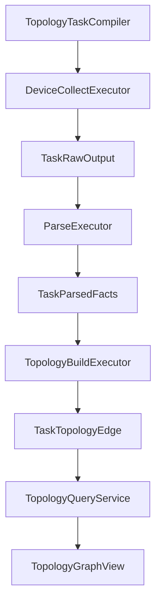
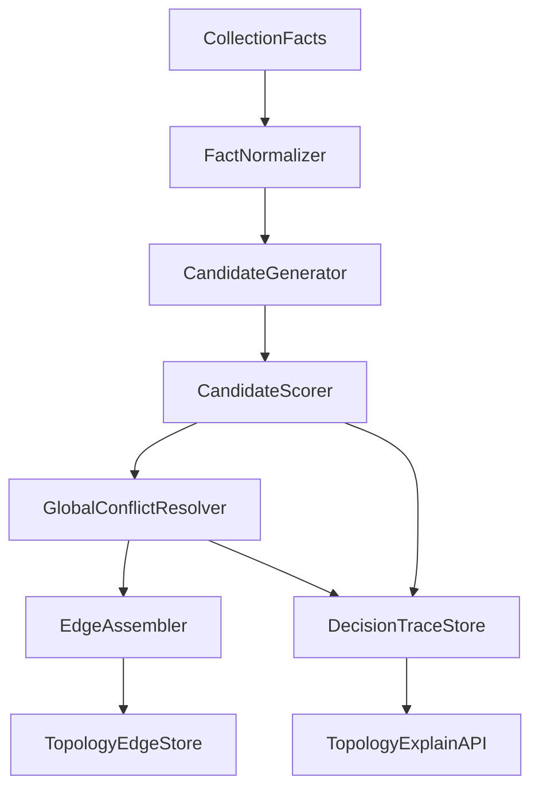

# 拓扑还原模块全量实施方案

## 1. 目标与范围

本方案面向当前拓扑任务链路的全局优化，覆盖以下四个维度并分阶段实施：

- 准确性：提升链路确认、推断、冲突裁决的正确率与稳定性
- 数据模型：补齐事实层与证据层建模，消除已采集未利用的数据断层
- 性能：降低构图阶段复杂度和数据库往返次数，提升大规模设备场景下吞吐
- 测试：建立从函数级到任务级的完整回归体系，保证迭代可控

> 约束基线：项目按新建项目治理，不做历史兼容包袱；改造必须面向整体架构而非局部补丁。

---

## 2. 现状链路梳理

当前拓扑任务的主链路可概括为：

1. 拓扑任务编译：生成 collect -> parse -> topology_build 三阶段计划
2. 设备采集：按厂商与字段计划下发命令并落盘原始输出
3. 解析持久化：将输出映射为 LLDP/FDB/ARP/聚合等事实表
4. 构图还原：融合事实生成拓扑边、冲突判定、置信度写回
5. 查询呈现：将边/节点组装为图视图与详情视图

### 2.1 关键代码入口

- 编译与阶段编排：`internal/taskexec/topology_compiler.go`
- 采集阶段执行：`internal/taskexec/executor_impl.go`（DeviceCollectExecutor）
- 解析与事实入库：`internal/taskexec/executor_impl.go`（ParseExecutor相关逻辑）
- 拓扑构建核心：`internal/taskexec/executor_impl.go`（buildRunTopology 与冲突处理）
- 图查询输出：`internal/taskexec/topology_query.go`
- 字段目录与命令解析：
  - `internal/models/topology_command.go`
  - `internal/taskexec/topology_command_resolver.go`

### 2.2 当前流程图

---

## 3. 数据使用盘点与缺口

## 3.1 已采集事实

- 设备身份与接口：TaskRunDevice、TaskParsedInterface
- 邻居与二层三层线索：TaskParsedLLDPNeighbor、TaskParsedFDBEntry、TaskParsedARPEntry
- 聚合信息：TaskParsedAggregateGroup、TaskParsedAggregateMember
- 采集计划快照：TopologyCollectionPlanArtifact

## 3.2 构图阶段实际使用

`buildRunTopology` 直接使用：

- TaskRunDevice：设备名映射、管理IP映射
- TaskParsedLLDPNeighbor：主事实
- TaskParsedFDBEntry + TaskParsedARPEntry：推断事实
- TaskParsedAggregateMember：物理口到逻辑口映射

## 3.3 已采集但未被构图利用的关键信息

1. TaskParsedInterface 基本未参与推断：
   - 接口 up/down、三层地址、是否聚合口、描述 等未进入评分
2. TaskParsedAggregateGroup 未直接进入构图：
   - 仅成员表参与，聚合模式信息未纳入可信度
3. FDB 维度利用不足：
   - VLAN、Type 字段未进入候选评分
4. LLDP 维度利用不足：
   - NeighborChassis、NeighborDesc 未用于跨源一致性校验
5. 采集计划元数据未反哺构图：
   - 未按字段启用状态和采集完整性动态调权

### 3.4 结论

当前实现是可运行的最小闭环，但并未充分利用已采集数据，导致：

- 准确性上限受限
- 冲突场景解释力不足
- 难以区分数据缺失与算法误判

---

## 4. 判断逻辑准确性评估

## 4.1 LLDP 构边

现状：

- 优先用 NeighborIP 映射远端设备，其次 NeighborName，失败则 unknown
- 双向 LLDP 视为 confirmed

风险：

- 未利用 chassis_id 交叉验证，名称漂移会引入误配
- remoteIf 缺失时直接 unknown，后续很难与其它证据闭环

## 4.2 FDB + ARP 推断

现状：

- FDB MAC 通过 ARP 映射到 device/server/terminal
- 按 mac 数量与端点类型评分，超阈值端口直接跳过

风险：

- 未纳入 VLAN、接口状态、聚合角色等关键约束
- 候选裁剪依赖固定阈值，对不同网络拓扑不自适应

## 4.3 冲突裁决

现状：

- endpoint 分组后按 score 排序
- 分差小于窗口则全冲突，否则保留第一候选

风险：

- 属于局部贪心，不保证全局最优匹配
- 当多端口同时竞争时，可能出现整体最优被误伤

## 4.4 可观测性

现状：

- 有日志计数与错误摘要
- 缺少结构化候选轨迹与被淘汰原因明细

风险：

- 线上问题复盘依赖日志文本，调试成本高

---

## 5. 全量改造总体设计

## 5.1 目标架构

## 5.2 设计原则

- 分层：事实标准化、候选生成、评分、冲突消解、落边分离
- 可解释：每条边必须可追溯候选来源与裁决原因
- 可调优：阈值与权重配置化，支持运行时配置
- 可回归：每个阶段可单测与快照对比

---

## 6. 分阶段实施计划

## Phase A 数据模型与流水线重构

### A.1 数据模型升级

新增或扩展模型：

1. TopologyFactSnapshot
   - 固化每次构图输入摘要，支持复现
2. TopologyEdgeCandidate
   - 保存候选边、来源、特征、评分明细
3. TopologyDecisionTrace
   - 保存冲突分组、淘汰原因、最终决策
4. TaskTopologyEdge 扩展字段
   - confidence_breakdown
   - decision_reason
   - evidence_refs

### A.2 执行器重构

在 `TopologyBuildExecutor` 中拆分子流程：

- collectBuildInputs
- normalizeFacts
- buildLLDPCandidates
- buildFDBARPCandidates
- enrichCandidatesWithInterfaceFacts
- resolveCandidatesGlobal
- materializeEdges
- persistDecisionTraces

### A.3 交付物

- 新旧构图逻辑并行开关（runtime config）
- 基础候选与轨迹表可落库

---

## Phase B 准确性算法升级

### B.1 LLDP 规则增强

- 增加 chassis_id 一致性评分项
- NeighborName 与 NormalizedName 采用标准化与相似度兜底
- remoteIf 缺失时引入延迟绑定机制，待 FDB/接口事实补齐

### B.2 FDB+ARP 规则增强

引入特征：

- VLAN 一致性
- FDB Type 权重
- 接口状态约束（来自 TaskParsedInterface）
- 聚合组与成员一致性（TaskParsedAggregateGroup + Member）
- MAC 多样性与重复学习惩罚

### B.3 冲突消解升级

- 从局部贪心改为全局匹配策略
- 目标函数最大化全图置信总分
- 冲突输出必须给出 retained 与 rejected 的量化理由

### B.4 交付物

- 新评分器与冲突求解器
- 可解释的边级评分拆解

---

## Phase C 性能与稳定性优化

### C.1 复杂度优化

- 构图前批量加载并建立内存索引
- 消除按边线性扫描查找，改为多键索引映射
- 避免重复 normalize 调用，增加局部缓存

### C.2 DB 写入优化

- 候选与轨迹采用批量写入
- edge 按 runID 分批 upsert

### C.3 运行时参数配置化

通过 runtime config 扩展：

- 最大候选数
- 冲突窗口
- 各特征权重
- 端点分类阈值

### C.4 交付物

- 大规模场景下构图耗时下降
- 参数热调整能力

---

## Phase D 测试与质量门禁

### D.1 单元测试

新增测试集：

- 候选生成器
- 评分器特征权重
- 全局冲突求解
- 解释轨迹序列化

### D.2 集成测试

扩展 `internal/taskexec/taskexec_test.go`：

- 双向 LLDP + 聚合映射
- FDB/ARP 推断 server 与 terminal 区分
- 多候选冲突全局最优案例
- 数据缺失降级与告警

### D.3 回归数据集

在 `testdata/topology` 下新增：

- 多厂商混合拓扑样例
- 异常样例（名称漂移、单边 LLDP、脏 ARP、端口震荡）

### D.4 质量门禁

- 新增构图快照对比测试
- 关键算法包覆盖率门槛
- build 脚本统一使用根目录 `build.bat`

---

## 7. 模块改造清单

后端重点文件：

- `internal/taskexec/executor_impl.go`
  - 构图主流程拆分
  - 候选与轨迹落库
- `internal/taskexec/topology_models.go`
  - 新增候选/轨迹结构与表映射
- `internal/taskexec/topology_query.go`
  - 增加 explain 查询接口
- `internal/config/runtime_config.go`
  - 新增拓扑评分与冲突参数项
- `internal/taskexec/taskexec_test.go`
  - 扩展场景测试

UI/API 重点文件：

- `internal/ui/taskexec_ui_service.go`
- `frontend/src/services/api.ts`
- `frontend/src/views/TaskExecution.vue`

目标：在现有拓扑详情页展示边级决策解释和候选淘汰原因。

---

## 8. 验收标准

1. 数据利用率
   - 接口事实、聚合组事实、LLDP chassis、FDB VLAN/Type 进入评分与裁决链路
2. 准确性
   - 现有样例不退化
   - 冲突样例中错误保留率下降
3. 可解释性
   - 任意边可追溯候选来源、得分拆解、冲突结论
4. 性能
   - 同规模样例构图耗时下降
5. 可维护性
   - 构图核心函数拆分后职责单一
   - 新增测试覆盖候选/评分/冲突三层

---

## 9. 实施顺序与协作方式

建议严格按 Phase A -> B -> C -> D 执行，每阶段完成后做一次回归与评审，再进入下一阶段。

为避免大爆炸式改动，采用以下策略：

- 主路径保留 feature flag
- 每阶段独立提交
- 每阶段附带测试与回归数据

---

## 10. 风险与对策

- 风险：评分参数不合理导致误判迁移
  - 对策：参数配置化 + 回放数据集校准
- 风险：全局冲突求解引入性能压力
  - 对策：分组求解 + 候选裁剪 + 批处理
- 风险：解释数据膨胀
  - 对策：轨迹分级存储与按需查询

---

## 11. 结论

该方案将拓扑还原从当前可运行闭环升级为可解释、可调优、可回归的工程化体系。通过分阶段推进，在保证整体架构一致性的前提下，同时完成准确性、数据模型、性能与测试四条主线改造，满足全量推进目标。
