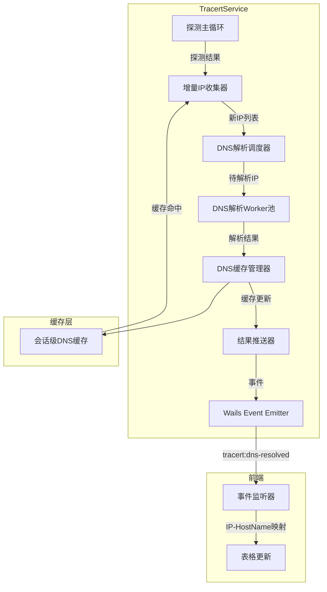
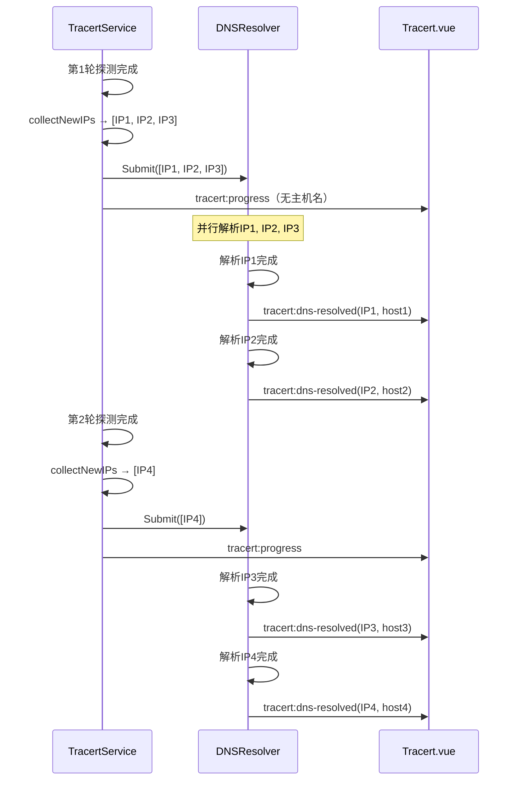
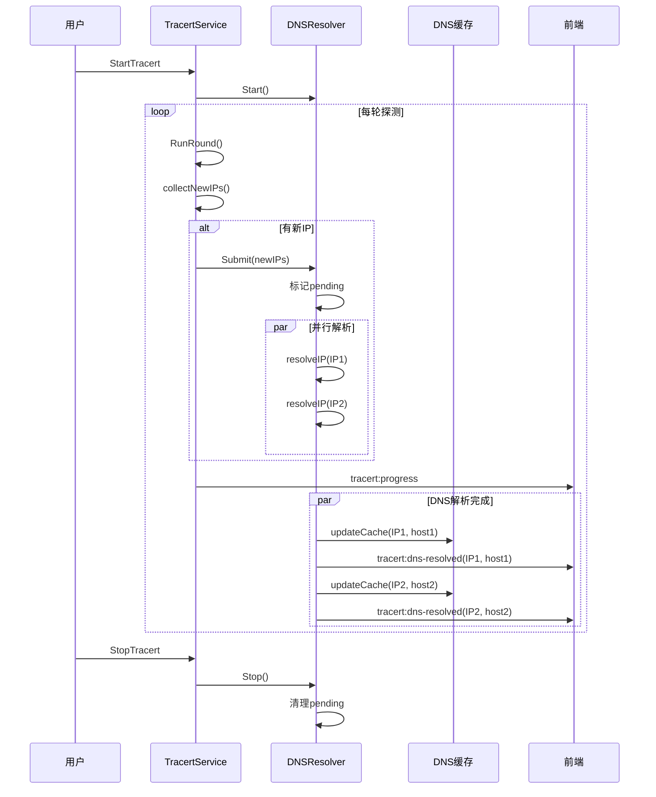

# Tracert 异步DNS解析设计方案

> 文档版本：v1.0  
> 创建日期：2026-05-19  
> 状态：待评审

---

## 目录

1. [需求分析](#1-需求分析)
2. [现状分析](#2-现状分析)
3. [架构设计](#3-架构设计)
4. [详细设计](#4-详细设计)
5. [数据结构定义](#5-数据结构定义)
6. [前后端通信协议](#6-前后端通信协议)
7. [错误处理机制](#7-错误处理机制)
8. [性能优化考虑](#8-性能优化考虑)
9. [风险评估与缓解措施](#9-风险评估与缓解措施)
10. [实施步骤](#10-实施步骤)
11. [验收标准](#11-验收标准)

---

## 1. 需求分析

### 1.1 核心需求

| 编号 | 需求描述 | 优先级 |
|------|----------|--------|
| R-01 | DNS解析异步执行，不阻塞路径探测过程 | P0 |
| R-02 | 增量解析：只在发现新IP时启动DNS解析 | P0 |
| R-03 | 避免重复解析：已解析过的IP不再重复请求 | P0 |
| R-04 | 解析完成后实时推送到前端 | P0 |
| R-05 | 与现有持久化Socket设计兼容 | P1 |

### 1.2 工作流程示例

```
第1轮探测:
  ├── 探测到 5 个IP: 192.168.1.1, 192.168.1.2, 192.168.1.3, 10.0.0.1, 10.0.0.2
  ├── 异步启动DNS解析这5个IP
  ├── 立即推送探测结果（不含主机名）
  └── DNS解析完成后 → 推送主机名更新

第2轮探测:
  ├── 探测到 3 个新IP: 192.168.1.4, 10.0.0.3, 172.16.0.1
  ├── 第1轮的5个IP已在缓存，跳过
  ├── 异步启动DNS解析这3个新IP
  └── DNS解析完成后 → 推送主机名更新

后续轮次以此类推...
```

### 1.3 非功能性需求

| 编号 | 需求描述 |
|------|----------|
| NFR-01 | DNS解析超时可配置（默认2秒） |
| NFR-02 | DNS缓存有效期可配置（默认5分钟） |
| NFR-03 | 并发DNS解析数可配置（默认无限制） |
| NFR-04 | 内存占用可控，无goroutine泄漏 |

---

## 2. 现状分析

### 2.1 现有DNS解析机制

当前 [`TracertService`](internal/ui/tracert_service.go:44) 已实现基础的DNS缓存和异步解析：

```go
// 现有DNS缓存结构
type dnsCacheEntry struct {
    hostName  string
    timestamp time.Time
}

// 现有缓存字段
dnsCache   map[string]dnsCacheEntry
dnsCacheMu sync.RWMutex
```

**现有解析流程：**

```
runContinuous() / runSingle()
  ├── 探测完成 → 深拷贝hops快照
  ├── 启动异步DNS解析 goroutine
  │   └── resolveHopHostNames(ctx, hops, timeout)
  │       ├── 遍历hops，收集需要解析的IP
  │       ├── 检查缓存，跳过已解析IP
  │       └── 并行解析未缓存的IP
  └── 等待DNS完成或interval到期
```

### 2.2 现有问题分析

| 问题 | 影响 | 根因 |
|------|------|------|
| DNS解析阻塞下一轮探测 | 持续模式下，如果DNS解析慢，会影响下一轮探测的启动时机 | DNS解析在探测完成后同步等待 |
| 重复检查缓存 | 每轮都遍历所有hops检查缓存，效率低 | 缺乏增量IP收集机制 |
| 解析结果延迟推送 | DNS结果需等到下一轮progress事件才推送 | 缺乏独立的DNS结果推送通道 |
| 状态管理复杂 | `IsResolvingDNS` 状态需在多处同步 | DNS解析与探测流程耦合 |

### 2.3 现有事件协议

| 事件名 | 用途 | 数据结构 |
|--------|------|----------|
| `tracert:progress` | 整体进度更新 | `TracertProgress` |
| `tracert:hop-update` | 单跳实时更新 | `TracertHopUpdate` |
| `tracert:heartbeat` | 心跳事件 | `TracertHeartbeat` |

---

## 3. 架构设计

### 3.1 整体架构



### 3.2 组件职责

| 组件 | 职责 | 文件位置 |
|------|------|----------|
| **增量IP收集器** | 收集本轮探测发现的新IP，与缓存对比过滤 | `tracert_service.go` |
| **DNS解析调度器** | 管理DNS解析请求队列，控制并发数 | `tracert_dns_resolver.go`（新增） |
| **DNS解析Worker池** | 执行实际的DNS反向解析 | `tracert_dns_resolver.go`（新增） |
| **DNS缓存管理器** | 管理DNS缓存的生命周期，提供查询接口 | `tracert_service.go`（现有） |
| **结果推送器** | 将DNS解析结果推送到前端 | `tracert_service.go` |

### 3.3 设计原则

1. **解耦原则**：DNS解析与探测流程完全解耦，互不阻塞
2. **增量原则**：只处理新发现的IP，避免重复工作
3. **实时原则**：DNS解析完成立即推送，不等待下一轮
4. **容错原则**：DNS解析失败不影响探测流程

---

## 4. 详细设计

### 4.1 DNS解析管理器设计

新增独立的DNS解析管理器，封装解析逻辑：

```go
// TracertDNSResolver DNS解析管理器
type TracertDNSResolver struct {
    wailsApp      *application.App
    cache         map[string]dnsCacheEntry
    cacheMu       sync.RWMutex
    pending       map[string]struct{}      // 正在解析中的IP
    pendingMu     sync.Mutex
    requestCh     chan dnsResolveRequest   // 解析请求通道
    resultCh      chan dnsResolveResult     // 解析结果通道
    stopCh        chan struct{}
    config        DNSResolverConfig
}

// DNSResolverConfig DNS解析器配置
type DNSResolverConfig struct {
    Timeout         time.Duration // 单次解析超时（默认2秒）
    CacheTTL        time.Duration // 缓存有效期（默认5分钟）
    MaxConcurrent   int           // 最大并发解析数（默认0=无限制）
    ResolveOnPanic  bool          // 解析失败时是否重试
}

// dnsResolveRequest DNS解析请求
type dnsResolveRequest struct {
    ip        string
    timestamp time.Time
}

// dnsResolveResult DNS解析结果
type dnsResolveResult struct {
    ip        string
    hostName  string
    err       error
    timestamp time.Time
}
```

### 4.2 增量IP收集流程

```go
// collectNewIPs 收集本轮探测发现的新IP
func (s *TracertService) collectNewIPs(hops []icmp.TracertHopResult) []string {
    var newIPs []string
    seen := make(map[string]bool)
    
    for _, hop := range hops {
        // 跳过无效IP
        if hop.IP == "" || hop.IP == "*" || hop.Status == "pending" || hop.Status == "cancelled" {
            continue
        }
        
        // 去重
        if seen[hop.IP] {
            continue
        }
        seen[hop.IP] = true
        
        // 检查缓存
        if s.dnsResolver.IsCached(hop.IP) {
            continue
        }
        
        // 检查是否正在解析
        if s.dnsResolver.IsPending(hop.IP) {
            continue
        }
        
        newIPs = append(newIPs, hop.IP)
    }
    
    return newIPs
}
```

### 4.3 异步DNS解析流程

```go
// StartDNSResolver 启动DNS解析管理器
func (r *TracertDNSResolver) Start() {
    go r.processRequests()
    go r.processResults()
}

// processRequests 处理解析请求
func (r *TracertDNSResolver) processRequests() {
    for {
        select {
        case req := <-r.requestCh:
            // 标记为正在解析
            r.markPending(req.ip)
            
            // 启动解析goroutine
            go r.resolveIP(req)
            
        case <-r.stopCh:
            return
        }
    }
}

// resolveIP 解析单个IP
func (r *TracertDNSResolver) resolveIP(req dnsResolveRequest) {
    ctx, cancel := context.WithTimeout(context.Background(), r.config.Timeout)
    defer cancel()
    
    resolver := &net.Resolver{}
    names, err := resolver.LookupAddr(ctx, req.ip)
    
    var hostName string
    if err == nil && len(names) > 0 {
        hostName = strings.TrimSuffix(names[0], ".")
    }
    
    // 发送结果
    select {
    case r.resultCh <- dnsResolveResult{
        ip:        req.ip,
        hostName:  hostName,
        err:       err,
        timestamp: time.Now(),
    }:
    case <-r.stopCh:
    }
}

// processResults 处理解析结果
func (r *TracertDNSResolver) processResults() {
    for {
        select {
        case result := <-r.resultCh:
            // 更新缓存
            if result.hostName != "" {
                r.updateCache(result.ip, result.hostName)
            }
            
            // 清除pending状态
            r.clearPending(result.ip)
            
            // 推送到前端
            r.emitDNSResult(result)
            
        case <-r.stopCh:
            return
        }
    }
}
```

### 4.4 探测流程集成

修改 [`runContinuous()`](internal/ui/tracert_service.go:464) 方法：

```go
func (s *TracertService) runContinuous(ctx context.Context, target string, config icmp.TracertConfig, interval time.Duration) {
    // ... 现有初始化逻辑 ...
    
    // 启动DNS解析器
    s.dnsResolver.Start()
    defer s.dnsResolver.Stop()
    
    for {
        select {
        case <-ctx.Done():
            return
        default:
        }
        
        round++
        
        // 排空Socket缓冲区
        s.engine.DrainAllSockets()
        
        // 执行探测
        roundProgress := s.engine.RunRound(ctx, target, resolvedIP, opts)
        
        // ★ 增量收集新IP
        newIPs := s.collectNewIPs(roundProgress.Hops)
        
        // ★ 异步提交DNS解析请求
        if len(newIPs) > 0 {
            s.dnsResolver.Submit(newIPs)
        }
        
        // 立即推送进度（不等待DNS）
        s.emitProgress(s.progress.CloneForDisplay(reachedTTL))
        
        // 等待interval
        select {
        case <-ctx.Done():
            return
        case <-time.After(interval):
        }
    }
}
```

---

## 5. 数据结构定义

### 5.1 新增数据结构

```go
// ==================== internal/ui/tracert_dns_resolver.go ====================

// DNSResolverConfig DNS解析器配置
type DNSResolverConfig struct {
    Timeout        time.Duration `json:"timeout"`        // 单次解析超时
    CacheTTL       time.Duration `json:"cacheTtl"`       // 缓存有效期
    MaxConcurrent  int           `json:"maxConcurrent"`  // 最大并发数
}

// DefaultDNSResolverConfig 默认配置
func DefaultDNSResolverConfig() DNSResolverConfig {
    return DNSResolverConfig{
        Timeout:       2 * time.Second,
        CacheTTL:      5 * time.Minute,
        MaxConcurrent: 0, // 0 = 无限制
    }
}

// TracertDNSResolvedEvent DNS解析完成事件
type TracertDNSResolvedEvent struct {
    IP        string `json:"ip"`        // 解析的IP
    HostName  string `json:"hostName"`  // 解析结果（空表示解析失败）
    Timestamp int64  `json:"timestamp"` // 解析完成时间戳（Unix毫秒）
    Error     string `json:"error"`     // 错误信息（可选）
}
```

### 5.2 现有数据结构变更

```go
// ==================== internal/icmp/types.go ====================

// TracertProgress 新增字段（可选，用于调试）
type TracertProgress struct {
    // ... 现有字段 ...
    
    // DNS解析统计（新增）
    DNSResolvedCount  int   `json:"dnsResolvedCount"`  // 已解析IP数量
    DNSPendingCount   int   `json:"dnsPendingCount"`   // 待解析IP数量
}
```

### 5.3 缓存数据结构

```go
// dnsCacheEntry 缓存条目（现有，保持不变）
type dnsCacheEntry struct {
    hostName  string
    timestamp time.Time
}

// 扩展：支持解析状态追踪
type dnsCacheEntryExt struct {
    hostName    string
    timestamp   time.Time
    status      dnsCacheStatus // cached, pending, failed
    retryCount  int            // 重试次数
}

type dnsCacheStatus int

const (
    dnsStatusCached dnsCacheStatus = iota
    dnsStatusPending
    dnsStatusFailed
)
```

---

## 6. 前后端通信协议

### 6.1 新增事件

| 事件名 | 方向 | 数据结构 | 说明 |
|--------|------|----------|------|
| `tracert:dns-resolved` | 后端→前端 | `TracertDNSResolvedEvent` | 单个IP解析完成时推送 |

### 6.2 事件数据结构

```typescript
// frontend/src/bindings/github.com/NetWeaverGo/core/internal/ui/models.ts

export interface TracertDNSResolvedEvent {
  ip: string;          // 解析的IP地址
  hostName: string;    // 解析结果（空表示解析失败）
  timestamp: number;   // 解析完成时间戳（Unix毫秒）
  error?: string;      // 错误信息（可选）
}
```

### 6.3 前端事件处理

```typescript
// frontend/src/views/Tools/Tracert.vue

// 新增DNS解析事件监听
let unlistenDNSResolved: (() => void) | null = null

const handleDNSResolvedEvent = (data: TracertDNSResolvedEvent) => {
  if (!progress.value?.hops) return
  
  // 按IP匹配更新对应跳的主机名
  for (const hop of progress.value.hops) {
    if (hop.ip === data.ip && !hop.hostName) {
      hop.hostName = data.hostName || '-'
    }
  }
  
  // 触发响应式更新
  triggerRef(progress)
}

onMounted(() => {
  // ... 现有事件监听 ...
  
  // 新增DNS解析事件监听
  unlistenDNSResolved = Events.On('tracert:dns-resolved', handleDNSResolvedEvent)
})

onUnmounted(() => {
  // ... 现有清理 ...
  
  if (unlistenDNSResolved) {
    unlistenDNSResolved()
    unlistenDNSResolved = null
  }
})
```

### 6.4 事件时序图



---

## 7. 错误处理机制

### 7.1 错误类型定义

```go
// DNSError DNS解析错误类型
type DNSError struct {
    IP      string
    Op      string      // 操作类型：lookup, timeout, network
    Err     error       // 原始错误
    Retry   int         // 重试次数
}

func (e *DNSError) Error() string {
    return fmt.Sprintf("DNS解析失败 [%s]: %s (重试%d次)", e.IP, e.Err, e.Retry)
}

func (e *DNSError) Unwrap() error {
    return e.Err
}
```

### 7.2 错误处理策略

| 错误类型 | 处理策略 | 用户感知 |
|----------|----------|----------|
| 超时错误 | 记录日志，不重试 | 主机名显示为 `-` |
| 网络错误 | 记录日志，不重试 | 主机名显示为 `-` |
| DNS服务器错误 | 记录日志，不重试 | 主机名显示为 `-` |
| 无PTR记录 | 正常情况，非错误 | 主机名显示为 `-` |

### 7.3 错误恢复机制

```go
// resolveIP 带错误处理的解析
func (r *TracertDNSResolver) resolveIP(req dnsResolveRequest) {
    ctx, cancel := context.WithTimeout(context.Background(), r.config.Timeout)
    defer cancel()
    
    resolver := &net.Resolver{}
    names, err := resolver.LookupAddr(ctx, req.ip)
    
    var hostName string
    var errMsg string
    
    if err != nil {
        // 判断错误类型
        if isTimeoutError(err) {
            logger.Debug("TracertDNS", req.ip, "DNS解析超时")
            errMsg = "timeout"
        } else if isNetworkError(err) {
            logger.Debug("TracertDNS", req.ip, "网络错误: %v", err)
            errMsg = "network error"
        } else {
            logger.Debug("TracertDNS", req.ip, "DNS解析失败: %v", err)
            errMsg = err.Error()
        }
    } else if len(names) > 0 {
        hostName = strings.TrimSuffix(names[0], ".")
    }
    
    // 发送结果（即使失败也发送，清除pending状态）
    select {
    case r.resultCh <- dnsResolveResult{
        ip:        req.ip,
        hostName:  hostName,
        err:       err,
        errMsg:    errMsg,
        timestamp: time.Now(),
    }:
    case <-r.stopCh:
    }
}
```

---

## 8. 性能优化考虑

### 8.1 并发控制

```go
// 带并发控制的解析请求处理
func (r *TracertDNSResolver) processRequests() {
    sem := make(chan struct{}, r.config.MaxConcurrent)
    if r.config.MaxConcurrent == 0 {
        sem = make(chan struct{}, 1000) // 无限制时使用大缓冲
    }
    
    for {
        select {
        case req := <-r.requestCh:
            r.markPending(req.ip)
            
            sem <- struct{}{} // 获取信号量
            go func(ip string) {
                defer func() { <-sem }() // 释放信号量
                r.resolveIP(dnsResolveRequest{ip: ip, timestamp: time.Now()})
            }(req.ip)
            
        case <-r.stopCh:
            return
        }
    }
}
```

### 8.2 批量提交优化

```go
// Submit 批量提交解析请求
func (r *TracertDNSResolver) Submit(ips []string) {
    for _, ip := range ips {
        select {
        case r.requestCh <- dnsResolveRequest{ip: ip, timestamp: time.Now()}:
        case <-r.stopCh:
            return
        default:
            // 通道满，记录警告
            logger.Warn("TracertDNS", ip, "DNS解析请求队列已满，跳过")
            return
        }
    }
}
```

### 8.3 缓存预热

```go
// 在探测开始前，可以预热已知IP的缓存
func (s *TracertService) warmupDNSCache(knownIPs []string) {
    for _, ip := range knownIPs {
        if s.dnsResolver.IsCached(ip) {
            continue
        }
        s.dnsResolver.Submit([]string{ip})
    }
}
```

### 8.4 内存优化

| 优化点 | 措施 |
|--------|------|
| 缓存大小限制 | 设置最大缓存条目数（如1000），LRU淘汰 |
| Pending集合清理 | 解析完成立即清理，避免内存泄漏 |
| Channel缓冲 | 使用带缓冲的channel，避免阻塞 |

---

## 9. 风险评估与缓解措施

### 9.1 风险矩阵

| 风险 | 等级 | 影响 | 缓解措施 |
|------|------|------|----------|
| DNS解析goroutine泄漏 | 中 | 内存泄漏 | 使用context取消机制，stopCh统一清理 |
| 缓存无限增长 | 低 | 内存占用 | 实现LRU淘汰策略，定期清理过期条目 |
| DNS服务器不可用 | 低 | 解析失败 | 超时机制，失败不影响探测流程 |
| 前端事件风暴 | 低 | UI卡顿 | 节流推送，合并短时间内的多个结果 |
| 并发竞争 | 中 | 数据不一致 | 使用sync.Map或加锁保护共享数据 |

### 9.2 缓解措施详细设计

#### 9.2.1 Goroutine泄漏防护

```go
// Stop 优雅停止DNS解析器
func (r *TracertDNSResolver) Stop() {
    close(r.stopCh) // 关闭停止信号
    
    // 等待所有pending解析完成（最多等待5秒）
    timeout := time.After(5 * time.Second)
    ticker := time.NewTicker(100 * time.Millisecond)
    defer ticker.Stop()
    
    for {
        select {
        case <-ticker.C:
            r.pendingMu.Lock()
            pending := len(r.pending)
            r.pendingMu.Unlock()
            if pending == 0 {
                return
            }
        case <-timeout:
            logger.Warn("TracertDNS", "-", "DNS解析器停止超时，强制退出")
            return
        }
    }
}
```

#### 9.2.2 缓存LRU淘汰

```go
// 带LRU淘汰的缓存
type dnsCacheLRU struct {
    entries    map[string]*list.Element
    lruList    *list.List
    maxSize    int
    mu         sync.RWMutex
}

type cacheEntry struct {
    ip        string
    hostName  string
    timestamp time.Time
}

func (c *dnsCacheLRU) Set(ip, hostName string) {
    c.mu.Lock()
    defer c.mu.Unlock()
    
    // 检查是否需要淘汰
    if len(c.entries) >= c.maxSize {
        oldest := c.lruList.Back()
        if oldest != nil {
            c.lruList.Remove(oldest)
            delete(c.entries, oldest.Value.(*cacheEntry).ip)
        }
    }
    
    entry := &cacheEntry{ip: ip, hostName: hostName, timestamp: time.Now()}
    elem := c.lruList.PushFront(entry)
    c.entries[ip] = elem
}
```

#### 9.2.3 前端事件节流

```typescript
// 前端事件节流处理
const pendingDNSUpdates = new Map<string, TracertDNSResolvedEvent>()
let dnsFlushScheduled = false

const scheduleDNSFlush = () => {
  if (dnsFlushScheduled) return
  dnsFlushScheduled = true
  
  // 使用requestAnimationFrame合并更新
  requestAnimationFrame(() => {
    pendingDNSUpdates.forEach((event) => {
      applyDNSUpdate(event)
    })
    pendingDNSUpdates.clear()
    dnsFlushScheduled = false
  })
}

const handleDNSResolvedEvent = (data: TracertDNSResolvedEvent) => {
  pendingDNSUpdates.set(data.ip, data)
  scheduleDNSFlush()
}
```

---

## 10. 实施步骤

### 步骤 1：创建DNS解析管理器

**目标**：实现独立的DNS解析管理器组件

**具体变更**：

1. 新建文件 `internal/ui/tracert_dns_resolver.go`
2. 实现 `TracertDNSResolver` 结构体
3. 实现 `Start()`, `Stop()`, `Submit()` 方法
4. 实现缓存管理方法 `IsCached()`, `IsPending()`, `updateCache()`
5. 实现结果推送方法 `emitDNSResult()`

**验证**：单元测试通过

### 步骤 2：集成到TracertService

**目标**：将DNS解析管理器集成到现有服务

**具体变更**：

1. 在 `TracertService` 中添加 `dnsResolver *TracertDNSResolver` 字段
2. 在 `NewTracertService()` 中初始化DNS解析器
3. 在 `ServiceShutdown()` 中停止DNS解析器
4. 实现 `collectNewIPs()` 方法

**验证**：现有测试通过

### 步骤 3：修改探测流程

**目标**：修改 `runContinuous()` 和 `runSingle()` 使用新的DNS解析机制

**具体变更**：

1. 移除现有的 `resolveHopHostNames()` 调用
2. 在探测完成后调用 `collectNewIPs()` 收集新IP
3. 调用 `dnsResolver.Submit()` 提交解析请求
4. 移除 `IsResolvingDNS` 状态管理（可选保留用于调试）

**验证**：端到端测试通过

### 步骤 4：前端事件处理

**目标**：前端监听并处理DNS解析事件

**具体变更**：

1. 在 `Tracert.vue` 中添加 `tracert:dns-resolved` 事件监听
2. 实现 `handleDNSResolvedEvent()` 处理函数
3. 按IP匹配更新对应跳的主机名

**验证**：前端显示正确

### 步骤 5：清理与文档

**目标**：清理废弃代码，更新文档

**具体变更**：

1. 移除废弃的 `resolveHopHostNamesAsync()` 方法（如果确认无外部调用）
2. 更新代码注释
3. 更新设计文档

**验证**：全量回归测试

---

## 11. 验收标准

### 11.1 功能验收

| 编号 | 验收项 | 验证方法 |
|------|--------|----------|
| F-01 | DNS解析不阻塞探测 | 持续模式下，DNS解析慢不影响探测轮次间隔 |
| F-02 | 增量解析正确 | 第1轮解析5个IP，第2轮只解析新发现的IP |
| F-03 | 缓存命中正确 | 已解析IP不重复请求 |
| F-04 | 前端实时更新 | DNS解析完成后，前端表格主机名立即更新 |
| F-05 | 单轮模式正常 | 单轮探测DNS解析正常工作 |
| F-06 | 持续模式正常 | 持续探测DNS解析正常工作 |

### 11.2 性能验收

| 编号 | 验收项 | 验证方法 |
|------|--------|----------|
| P-01 | DNS解析并发正确 | 监控goroutine数量，符合配置 |
| P-02 | 缓存命中率 | 统计缓存命中/未命中比例 |
| P-03 | 内存无泄漏 | 长时间运行（1小时），内存稳定 |

### 11.3 稳定性验收

| 编号 | 验收项 | 验证方法 |
|------|--------|----------|
| S-01 | DNS服务器不可用时不崩溃 | 模拟DNS服务器不可用，验证探测正常 |
| S-02 | 无goroutine泄漏 | 使用runtime监控，停止后goroutine归零 |
| S-03 | 快速启停无异常 | 快速连续启动/停止探测，无错误 |

### 11.4 代码质量验收

| 编号 | 验收项 | 验证方法 |
|------|--------|----------|
| Q-01 | 无竞态条件 | `go test -race` 通过 |
| Q-02 | 单元测试覆盖 | 新增方法有对应单元测试 |
| Q-03 | 代码风格一致 | 符合项目现有代码风格 |

---

## 附录 A：关键代码路径索引

| 路径 | 文件 | 说明 |
|------|------|------|
| DNS解析管理器 | `internal/ui/tracert_dns_resolver.go` | 新增 |
| DNS缓存管理 | `internal/ui/tracert_service.go:56-58` | 现有 |
| 持续探测模式 | `internal/ui/tracert_service.go:464-660` | 修改 |
| 单轮探测模式 | `internal/ui/tracert_service.go:365-461` | 修改 |
| 前端事件处理 | `frontend/src/views/Tools/Tracert.vue:471-507` | 修改 |
| 类型定义 | `internal/icmp/types.go:258-434` | 扩展 |

---

## 附录 B：Mermaid 序列图 — 完整流程



---

## 附录 C：配置参数说明

| 参数 | 类型 | 默认值 | 说明 |
|------|------|--------|------|
| `Timeout` | Duration | 2s | 单次DNS解析超时时间 |
| `CacheTTL` | Duration | 5m | DNS缓存有效期 |
| `MaxConcurrent` | int | 0 | 最大并发解析数（0=无限制） |
| `MaxCacheSize` | int | 1000 | 最大缓存条目数 |

---

## 附录 D：与持久化Socket设计的兼容性

本设计与现有的持久化Socket设计完全兼容：

| 持久化Socket设计 | 异步DNS设计 | 兼容性 |
|------------------|-------------|--------|
| `InitSockets()` 会话级初始化 | `DNSResolver.Start()` 会话级启动 | ✅ 独立生命周期 |
| `RunRound()` 单轮探测 | `collectNewIPs()` + `Submit()` | ✅ 探测后触发 |
| `Close()` 会话级销毁 | `DNSResolver.Stop()` 会话级停止 | ✅ 独立清理 |

两者互不干扰，可以并行工作。
