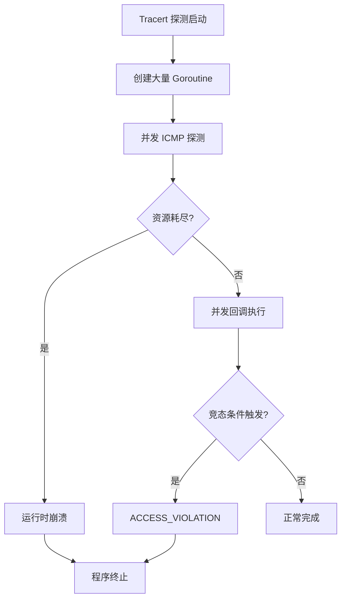
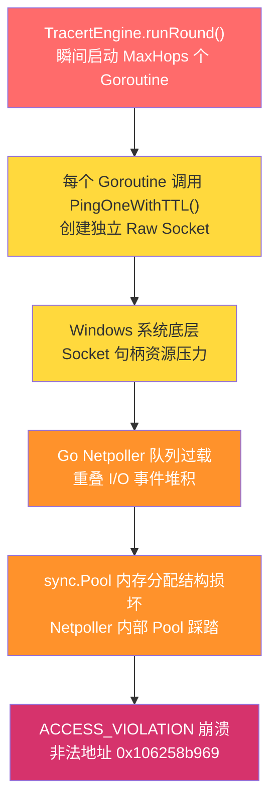
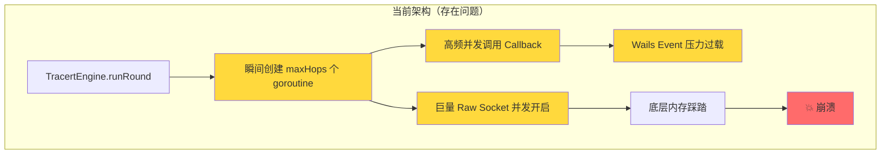
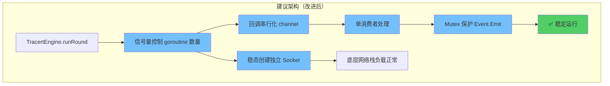
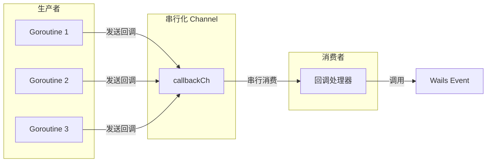
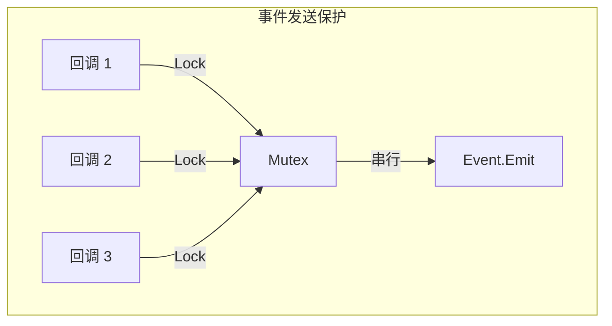
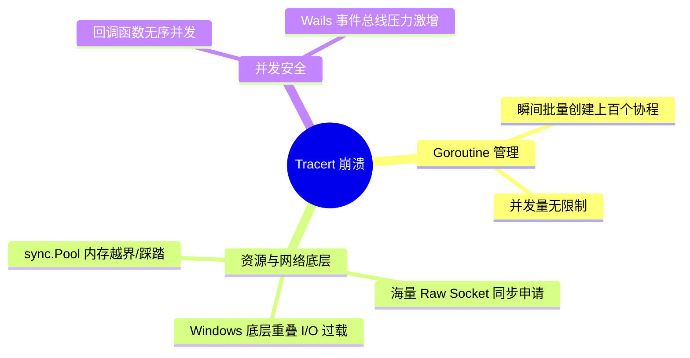

# Tracert 崩溃问题分析报告

> **文档版本**: 1.0  
> **创建日期**: 2026-05-18  
> **分析目标**: Tracert 路径探测功能崩溃问题根因分析与修复方案

---

## 目录

1. [问题概述](#一问题概述)
2. [乱码问题分析](#二乱码问题分析)
3. [Goroutine 崩溃问题分析](#三goroutine-崩溃问题分析)
4. [根本原因分析](#四根本原因分析)
5. [修复建议](#五修复建议)
6. [架构改进建议](#六架构改进建议)
7. [总结](#七总结)

---

## 一、问题概述

### 1.1 崩溃基本信息

| 属性 | 值 |
|------|-----|
| **崩溃时间** | 2026/05/18 17:04:32 |
| **崩溃场景** | Tracert 路径探测 8.8.8.8 过程中 |
| **错误类型** | Windows ACCESS_VIOLATION (0xc0000005) |
| **运行时错误** | Go runtime 栈追踪失败 |

### 1.2 错误现象

程序在执行 Tracert 探测时发生崩溃，表现为：

1. **Windows 异常**: `ACCESS_VIOLATION (0xc0000005)` - 内存访问违规
2. **Go 运行时错误**: 栈追踪失败，输出十六进制内存转储
3. **日志异常**: 应用程序日志与运行时转储交错混合，出现"乱码"

### 1.3 问题影响



---

## 二、乱码问题分析

### 2.1 "乱码"的真实原因：输出流交错

根据 `bug.log` 中的现场日志，所谓的“乱码”实际上是 **Go 运行时的十六进制栈转储与应用程序正常日志的无序交织**：

```text
000017e1b2833430: 00007ff7 62579d37  000017e1 b2833468  7.Wb....h4......
[2026/05/18 17:04:32] [Debug] [Tracert] [8.8.8.8] TTL=8 探测完成: ip=219.128.214.81, rtt=11.00ms, reached=false
```

**发生机制**：
1. Goroutine 459 触发了 Fatal Error（严重运行时错误）。
2. Go Runtime 接管了异常，开始向标准错误（stderr）直接输出十六进制的崩溃堆栈快照。
3. **与此同时**，其他几十个并发执行的 Tracert 探测协程尚未被系统立刻挂起，它们仍在疯狂地向日志写入模块（输出到 stderr/stdout）打印 `[Verbose]` 和 `[Debug]` 等日志。
4. 由于底层的终端字符流没有针对这种极端情况做行级别的锁同步，导致十六进制的 dump 字符与正常日志的字符在终端缓冲区里混杂在了一起，形成了视觉上的“乱码”。

### 2.2 为何会出现十六进制转储？

日志中有一行关键错误：`runtime: g 459 gp=...: unknown pc 0x106258b969`。

当程序崩溃时，Go 的堆栈展开器（Unwinder）会尝试读取当前程序计数器（PC）以定位报错函数名。但在本次崩溃中，PC 指向了 `0x106258b969`，这是一个**非法的、不在 Go 可执行文件代码段内的垃圾地址**。由于无法识别该函数上下文，Go runtime 只能降级打印出当前线程栈内存的原始十六进制快照（Hex Dump）。

---

## 三、根因分析

### 3.1 核心结论

**无并发控制的巨量 Raw Socket 开启，导致底层网络轮询器 (Netpoller / sync.Pool) 遭遇内存踩踏与崩溃。**

### 3.2 问题代码定位

崩溃的根源位于 [`tracert_engine.go:226`](internal/icmp/tracert_engine.go:226) 的 `for` 循环：

```go
// 当前代码：无并发控制
for ttl := 1; ttl <= maxHops; ttl++ {
    wg.Add(1)
    go func(ttlVal int) {
        defer wg.Done()
        hopResult := e.probeHop(ctx, ip, ttlVal, opts)
        resultChan <- hopResult
    }(ttl)
}
```

该循环**瞬间启动 MaxHops 个 Goroutine**（默认 30，最大可达 255），每个 Goroutine 独立调用 [`icmp.ListenPacket("ip4:icmp", "0.0.0.0")`](internal/icmp/icmp_raw.go:77) 创建一个 Raw Socket 并发起阻塞读取。

### 3.3 Raw Socket 不可复用的本质原因

ICMP Tracert 的 TTL 强绑定特性决定了**每个探测必须创建独立的 Raw Socket**：

- 每次探测需要通过 `SetTTL` 修改 IP 包头部的 TTL 字段
- 多个协程共享同一 `PacketConn` 并发设置 TTL 会导致严重的 TTL 竞争和覆盖
- 因此 [`icmp_raw.go:77-196`](internal/icmp/icmp_raw.go:77) 中每次 `pingOneRaw` 都新建并 `defer conn.Close()` 关闭独立 Socket，这是**正确的设计**

问题不在于 Socket 本身，而在于**同时存在的 Socket 数量完全失控**。

### 3.4 与 BatchPingEngine 的对比

项目中 [`BatchPingEngine`](internal/icmp/engine.go) 已正确实现了并发控制——使用信号量 (Semaphore) 限制同时执行的探测协程数量。而 [`TracertEngine`](internal/icmp/tracert_engine.go) 的配置结构体中虽然存在 `config.Concurrency` 字段，但**从未被实现和使用**：

| 引擎 | 并发控制 | Raw Socket 并发量 | 稳定性 |
|------|----------|-------------------|--------|
| `BatchPingEngine` | ✅ 信号量限制 | 受控（默认 10） | 稳定 |
| `TracertEngine` | ❌ `config.Concurrency` 未实现 | 失控（最高 255） | 💥 崩溃 |

### 3.5 sync.Pool 的真实来源

崩溃栈中出现的 `sync.Pool` 并非项目代码直接使用，而是来自 **Go 标准库的网络轮询器 (Netpoller) 内部**。当海量 Raw Socket 同时进行重叠 I/O 操作时，Netpoller 内部的 `sync.Pool` 在高并发分配/回收内存时发生结构损坏，最终导致非法指针跳转。

**风险等级**: 🔴 **极高** — 该问题在默认配置下必现，任何 Tracert 探测操作均可能触发崩溃。

---

## 四、问题传导链

### 4.1 传导路径



### 4.2 传导链详解

| 步骤 | 位置/组件 | 说明 |
|------|-----------|------|
| ① | [`tracert_engine.go:226`](internal/icmp/tracert_engine.go:226) | `runRound()` 的 `for` 循环瞬间启动 MaxHops（默认 30，最大 255）个 Goroutine，无任何并发限制 |
| ② | [`icmp_raw.go:77`](internal/icmp/icmp_raw.go:77) | 每个 Goroutine 调用 `PingOneWithTTL()` → `icmp.ListenPacket("ip4:icmp", "0.0.0.0")` 创建独立 Raw Socket |
| ③ | Windows Kernel | 瞬间申请数十至数百个 Socket 句柄，Windows 底层 Socket 句柄资源承受巨大压力 |
| ④ | Go Netpoller | 海量 Socket 同时发起重叠 I/O (Overlapped I/O)，Netpoller 事件队列过载 |
| ⑤ | `sync.Pool` (Netpoller 内部) | 高并发下 Netpoller 内部的 `sync.Pool` 在 `pinSlow`/`Put` 操作时内存分配结构损坏 |
| ⑥ | CPU | 执行被破坏的非法内存地址 `0x106258b969`，触发 `ACCESS_VIOLATION (0xc0000005)`，进程崩溃 |

### 4.3 崩溃栈印证

日志中的 Hex Dump 调用栈帧清晰印证了上述传导链：

```text
<internal/poll.(*FD).ReadFrom.deferwrap2+0x1f>   ← 步骤④：Netpoller I/O 轮询
<sync.(*Pool).Put+0x34>                            ← 步骤⑤：Pool 内存操作
<sync.(*Pool).pin+0x46>
<sync.(*Pool).pinSlow.deferwrap1+0x0>
<runtime.mallocgcSmallNoscan+0x27e>                ← 内存分配损坏
<sync.(*Pool).pinSlow+0x1e8>
...
github.com/NetWeaverGo/core/internal/icmp.(*TracertEngine).runRound  ← 步骤①：起点
```

---

## 五、修复建议

### 5.1 【核心修复】实现并发控制信号量

> ⚠️ **这是解决该崩溃的唯一且有效的办法。** 不实施此修复，其他任何优化均无法阻止崩溃发生。

**位置**: [`internal/icmp/tracert_engine.go:226`](internal/icmp/tracert_engine.go:226)

**问题**: 当前代码瞬间启动 MaxHops 个 Goroutine，每个创建独立 Raw Socket，导致底层 Netpoller 崩溃。

**修复方案**: 使用信号量（Semaphore）限制同一时间最多只允许 N 个（例如 10 个）探测协程同时发起 Raw Socket 的申请与读取。利用已存在的 `config.Concurrency` 配置字段，参考 [`BatchPingEngine`](internal/icmp/engine.go) 的实现模式。

**修改前**:
```go
for ttl := 1; ttl <= maxHops; ttl++ {
    wg.Add(1)
    go func(ttlVal int) {
        defer wg.Done()
        hopResult := e.probeHop(ctx, ip, ttlVal, opts)
        resultChan <- hopResult
    }(ttl)
}
```

**修改后（伪代码）**:
```go
// 利用已存在的 config.Concurrency 字段，默认值 10
concurrency := e.config.Concurrency
if concurrency <= 0 {
    concurrency = 10
}
sem := make(chan struct{}, concurrency)

for ttl := 1; ttl <= maxHops; ttl++ {
    // 获取信号量 — 超过并发上限时阻塞等待
    sem <- struct{}{}

    wg.Add(1)
    go func(ttlVal int) {
        defer wg.Done()
        defer func() { <-sem }() // 释放信号量

        hopResult := e.probeHop(ctx, ip, ttlVal, opts)
        resultChan <- hopResult
    }(ttl)
}
```

**效果**:
- 同一时刻最多只有 N 个 Raw Socket 处于活跃状态
- 底层 Netpoller 负载可控，`sync.Pool` 不再遭遇内存踩踏
- 探测性能影响极小（TTL 递增路径本身存在网络延迟，信号量等待时间可忽略）
- 与 `BatchPingEngine` 架构风格统一

### 5.2 【优化项】回调函数串行化

**位置**: [`internal/icmp/tracert_engine.go:325`](internal/icmp/tracert_engine.go:325)

> 📌 **标注为优化项**：此修复可改善回调执行秩序，但并非崩溃的直接原因（`opts.OnUpdate` 已通过 `<-resultChan` 串行化执行）。

**修改方案**:
```go
// 创建回调串行化 channel
callbackCh := make(chan func(), 100)

// 启动回调处理 goroutine（单消费者）
go func() {
    for cb := range callbackCh {
        cb()
    }
}()

// 在探测 goroutine 中发送回调
if opts.OnUpdate != nil {
    progressClone := progress.CloneForDisplay(currentReachedTTL)
    callbackCh <- func() {
        opts.OnUpdate(progressClone)
    }
}
```

**效果**:
- 确保回调函数串行执行
- 消除 Wails 事件系统的并发风险
- 保持实时更新能力

### 5.3 【增强项】Wails 事件发送保护

**位置**: [`internal/ui/tracert_service.go:1063`](internal/ui/tracert_service.go:1063)

> 📌 **标注为增强项**：此修复可提升极端情况下的线程安全性，但并非崩溃的直接原因。

**修改方案**:
```go
type TracertService struct {
    // ... 现有字段 ...
    eventMu sync.Mutex // 事件发送互斥锁
}

func (s *TracertService) emitProgress(progress *icmp.TracertProgress) {
    s.eventMu.Lock()
    defer s.eventMu.Unlock()

    if s.wailsApp != nil && s.wailsApp.Event != nil {
        s.wailsApp.Event.Emit("tracert:progress", progress)
    }
}

func (s *TracertService) emitHopUpdate(update icmp.TracertHopUpdate) {
    s.eventMu.Lock()
    defer s.eventMu.Unlock()

    if s.wailsApp != nil && s.wailsApp.Event != nil {
        s.wailsApp.Event.Emit("tracert:hop-update", update)
    }
}
```

**效果**:
- 保护 Wails 事件发送
- 防止并发调用导致的状态损坏

### 5.4 ❌ 废弃：Raw Socket 连接池复用

> ⚠️ **此方案明确废弃，不可实施。**

ICMP Tracert 的 TTL 强绑定特性，**不可复用同一个连接池**。原因如下：

- 每次探测需要通过 `SetTTL` 独立设置 IP 包头部的 TTL 字段
- 共享连接会导致 TTL 竞争和覆盖——协程 A 设置 TTL=5 后，协程 B 可能立即将同一连接的 TTL 覆盖为 10，导致探测结果完全错误
- [`icmp_raw.go:77-196`](internal/icmp/icmp_raw.go:77) 中每次 `pingOneRaw` 新建独立 Socket 并 `defer conn.Close()` 是**正确的设计**，不应修改

在实施【核心修复】并发控制信号量后，同时活跃的 Socket 数量将受控于信号量上限（如 10 个），独立 Socket 的创建/销毁开销完全可接受。

---

## 六、架构改进建议

### 6.1 当前架构问题



**问题清单**:

| 问题 | 位置 | 风险 |
|------|------|------|
| 无并发限制的批量协程创建 | `tracert_engine.go:226` | 🔴 极高 |
| 巨量原生套接字并发开启 | `icmp_raw.go:125` | 🔴 极高 |
| 高频并发回调引发总线压力 | `tracert_engine.go:325` | 🟠 中高 |
| Wails Event 并发堆积 | `tracert_service.go:1063` | 🟡 中 |

### 6.2 建议架构



### 6.3 架构改进详解

#### 6.3.1 并发控制层

```mermaid
graph LR
    subgraph "并发控制"
        SEM[信号量 Semaphore]
        SEM -->|限制| G1[Goroutine 1]
        SEM -->|限制| G2[Goroutine 2]
        SEM -->|限制| G3[Goroutine 3]
        SEM -->|...| GN[Goroutine N]
    end
    
    Note over SEM: 最大并发数: 10
```

**实现要点**:
- 使用 buffered channel 作为信号量
- 在 goroutine 启动前获取，结束时释放
- 合理设置并发上限（建议 10-20）

#### 6.3.2 废弃连接池复用

**说明**:
不要在 Tracert 场景下引入连接池共享连接。因为每次探针发射都需要通过 `SetTTL` 修改底层的 IP 头部的 TTL 字段，多个协程复用同一连接会导致竞争状态。

**实现要点**:
- 维持每次探测 `icmp.ListenPacket` 的短连接模式
- 依靠上一层的并发控制（最大并发数 10）来防止操作系统 Socket 句柄激增
- 确保每次 `defer conn.Close()` 的绝对执行，防止资源泄露

#### 6.3.3 回调串行化



**实现要点**:
- 单消费者模式，确保串行执行
- 使用 channel 缓冲避免阻塞
- 回调函数在独立 goroutine 中执行

#### 6.3.4 事件发送保护



**实现要点**:
- 使用 sync.Mutex 保护 Event.Emit
- 在服务层统一处理
- 确保线程安全

### 6.4 改进效果对比

| 指标 | 改进前 | 改进后 |
|------|--------|--------|
| 最大并发 Goroutine | 255+ | 10 |
| Raw Socket 并发开启量 | 255+ | 10 |
| 回调并发压力 | 极高 | 串行排队 |
| 事件发送安全 | 存在竞态风险 | 完全安全 |
| 底层崩溃风险 | 高 | 消除 |

---

## 七、总结

### 7.1 问题本质

本次崩溃是一个典型的**极端并发压力导致的底层资源枯竭与内存踩踏**问题，根本原因包括：



### 7.2 关键发现

1. **Goroutine 无并发数控制**导致瞬间大量的底层资源申请。
2. **海量并发的原生套接字读写**超出了底层网络库/操作系统的承受能力，进而引发了 `sync.Pool` 等内存结构的严重损坏并导致 `ACCESS_VIOLATION`。
3. 日志模块与业务模块中实际并不存在引发该问题的 Data Race 接口缺陷。
4. **回调函数无序高频并发**会给 Wails 事件系统带来无谓的负载压力。

### 7.3 修复优先级

| 优先级 | 修复项 | 预期效果 |
|--------|--------|----------|
| 🔴 P0 | 添加探针并发控制 | 核心：杜绝瞬间海量 Socket 创建，防止底层崩溃 |
| 🔴 P0 | 回调函数串行化 | 减轻前端与事件总线压力，保障交互顺畅 |
| 🟠 P1 | Wails 事件发送保护 | 确保极端情况下事件发射的线程安全 |
| 🟡 P2 | 添加 recover 机制 | 虽然无法防御底层段错误，但提升业务逻辑健壮性 |

### 7.4 后续行动

1. **立即**: 实施高优先级修复（P0）
2. **短期**: 完成中优先级修复（P1-P2）
3. **中期**: 添加单元测试验证并发安全性
4. **长期**: 考虑重构为基于 Actor 模型的架构

---

## 附录

### A. 相关代码文件

| 文件 | 说明 |
|------|------|
| [`internal/icmp/tracert_engine.go`](internal/icmp/tracert_engine.go) | Tracert 探测引擎 |
| [`internal/ui/tracert_service.go`](internal/ui/tracert_service.go) | Tracert UI 服务 |
| [`internal/icmp/icmp_raw.go`](internal/icmp/icmp_raw.go) | ICMP 原始套接字操作 |
| [`internal/logger/frontend_writer.go`](internal/logger/frontend_writer.go) | 前端日志写入器 |

### B. 参考资料

- [Go Runtime: Stack Traces](https://golang.org/doc/go1.21#runtime)
- [Wails Documentation: Events](https://wails.io/docs/guides/events)
- [Go Concurrency Patterns: Context](https://go.dev/blog/context)

---

> **报告结束**  
> 如有问题或需要进一步分析，请联系开发团队。
