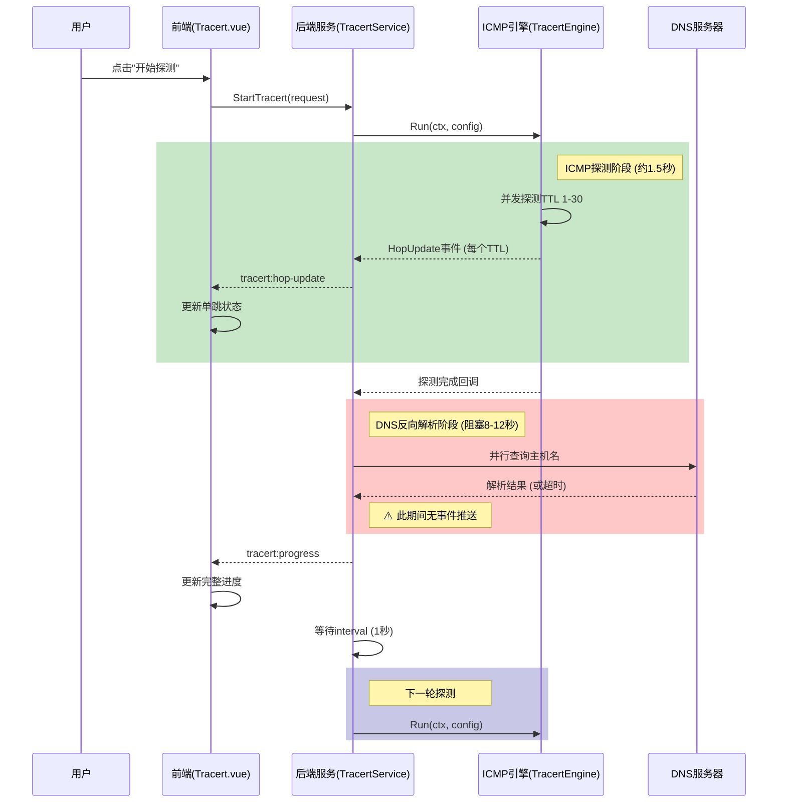

# 路径追踪功能数据延迟问题分析报告

## 1. 问题描述

### 用户报告现象
用户在使用路径追踪（Tracert）功能时，发现前端数据更新存在明显延迟，数据间隔几十秒更新一次，而非预期的实时更新。

### 预期行为
- 每秒或实时更新探测进度
- 每个TTL探测结果应即时显示
- 持续探测模式下数据应流畅更新

### 实际行为
- 数据更新间隔约10-15秒
- 探测期间前端界面长时间无变化
- 用户体验不佳，无法实时观察探测进度

---

## 2. 架构概述

### 系统组件

| 组件 | 文件路径 | 职责 |
|------|----------|------|
| 前端组件 | [`frontend/src/views/Tools/Tracert.vue`](frontend/src/views/Tools/Tracert.vue) | 用户界面展示、事件监听、轮询降级 |
| 后端服务 | [`internal/ui/tracert_service.go`](internal/ui/tracert_service.go) | 探测调度、DNS解析、事件推送 |
| ICMP引擎 | [`internal/icmp/tracert_engine.go`](internal/icmp/tracert_engine.go) | 底层ICMP探测、TTL控制 |
| 数据类型 | [`internal/icmp/types.go`](internal/icmp/types.go) | 数据结构定义 |

### 事件通道

| 事件名称 | 用途 | 推送时机 |
|----------|------|----------|
| `tracert:progress` | 整体进度更新 | 每轮探测完成、DNS解析后 |
| `tracert:hop-update` | 单跳结果更新 | 每个TTL探测完成时 |

---

## 3. 数据流分析

### 数据流时序图



### 关键代码路径

#### 3.1 持续探测主循环

位置：[`tracert_service.go:370-414`](internal/ui/tracert_service.go:370)

```go
// 第373行：合并探测结果
s.mergeRoundResult(roundProgress)

// 第382-384行：⚠️ 阻塞点 - DNS反向解析
dnsCtx, dnsCancel := context.WithTimeout(ctx, 10*time.Second)
s.resolveHopHostNames(dnsCtx, s.progress.Hops, 2*time.Second)
dnsCancel()

// 第404行：发送进度事件（DNS解析后才发送）
s.emitProgress(s.progress.CloneForDisplay(reachedTTL))

// 第412行：等待interval
case <-time.After(interval):
```

#### 3.2 DNS反向解析函数

位置：[`tracert_service.go:125-182`](internal/ui/tracert_service.go:125)

```go
func (s *TracertService) resolveHopHostNames(ctx context.Context, hops []icmp.TracertHopResult, timeout time.Duration) {
    // 并行解析，但整体是同步阻塞调用
    for _, item := range needResolve {
        wg.Add(1)
        go func(ip string) {
            defer wg.Done()
            // 每个IP解析可能耗时2秒（timeout）
            names, _ := net.LookupAddr(ip)
            // ...
        }(item.ip)
    }
    wg.Wait()  // ⚠️ 阻塞等待所有DNS解析完成
}
```

#### 3.3 正向DNS解析（无超时）

位置：[`tracert_engine.go:619`](internal/icmp/tracert_engine.go:619)

```go
// DNS 解析
logger.Debug("Tracert", target, "开始 DNS 解析")
ips, err := net.LookupIP(target)  // ⚠️ 无超时控制
if err != nil {
    return "", fmt.Errorf("DNS 解析失败 '%s': %w", target, err)
}
```

#### 3.4 前端轮询降级机制

位置：[`Tracert.vue:127`](frontend/src/views/Tools/Tracert.vue:127)

```typescript
const POLLING_INTERVAL = 2000  // 2秒轮询间隔

const startPolling = () => {
  if (pollingTimer) return
  pollingTimer = setInterval(async () => {
    if (!isRunning.value) {
      stopPolling()
      return
    }
    // 轮询获取进度作为降级方案
    const p = await TracertService.GetTracertProgress()
    // ...
  }, POLLING_INTERVAL)
}
```

---

## 4. 根本原因分析

### 4.1 主要延迟源：DNS反向解析阻塞

| 属性 | 详情 |
|------|------|
| **位置** | [`tracert_service.go:382-384`](internal/ui/tracert_service.go:382) |
| **问题** | 同步阻塞调用 `resolveHopHostNames()` |
| **影响** | 每轮探测后阻塞8-12秒，期间无任何事件发送到前端 |
| **根因** | DNS反向解析使用 `net.LookupAddr()`，单次超时2秒，多个IP并行但整体同步等待 |

**时间消耗分析**：
- 每轮探测约解析10个IP
- 每个IP超时设置2秒
- 实际耗时：8-10秒（部分命中缓存）

### 4.2 次要延迟源：正向DNS无超时

| 属性 | 详情 |
|------|------|
| **位置** | [`tracert_engine.go:619`](internal/icmp/tracert_engine.go:619) |
| **问题** | `net.LookupIP()` 无超时控制 |
| **影响** | 可能阻塞5-15秒（取决于DNS服务器响应） |
| **根因** | Go标准库DNS查询依赖系统配置，无应用层超时 |

### 4.3 其他影响因素

| 因素 | 位置 | 影响 |
|------|------|------|
| 前端轮询降级间隔 | [`Tracert.vue:127`](frontend/src/views/Tools/Tracert.vue:127) | 2秒轮询间隔，无法弥补DNS阻塞的10秒延迟 |
| 微任务批处理 | [`Tracert.vue:142`](frontend/src/views/Tools/Tracert.vue:142) | 毫秒级影响，可忽略 |
| 事件推送时机 | [`tracert_service.go:404`](internal/ui/tracert_service.go:404) | DNS解析后才推送，导致延迟累积 |

---

## 5. 日志分析证据

### 日志时间戳分析

来源：[`Dist/netWeaverGoData/logs/app/app.log`](Dist/netWeaverGoData/logs/app/app.log)

#### 第一轮探测时间线

| 时间 | 事件 | 耗时 |
|------|------|------|
| 14:24:47 | 开始第1轮探测 | - |
| 14:24:47 | TTL探测开始 | - |
| 14:24:49 | 所有TTL探测完成 | ~2秒 |
| 14:24:49 | 开始反向DNS解析 | - |
| 14:24:57 | DNS解析完成 | **8秒** |
| 14:24:57 | 发送进度事件 | - |
| 14:24:58 | 开始第2轮探测 | - |

**日志摘录**：
```
[2026/05/18 14:24:49] [Debug] [TracertService] [-] 开始反向 DNS 解析: 10 个 IP
[2026/05/18 14:24:57] [Debug] [TracertService] [-] 反向 DNS 解析完成
```

#### 第二轮探测时间线

| 时间 | 事件 | 耗时 |
|------|------|------|
| 14:24:58 | 开始第2轮探测 | - |
| 14:25:00 | 所有TTL探测完成 | ~2秒 |
| 14:25:00 | 开始反向DNS解析 | - |
| 14:25:10 | DNS解析完成 | **10秒** |
| 14:25:10 | 发送进度事件 | - |
| 14:25:11 | 开始第3轮探测 | - |

**日志摘录**：
```
[2026/05/18 14:25:00] [Debug] [TracertService] [-] 开始反向 DNS 解析: 9 个 IP
[2026/05/18 14:25:10] [Debug] [TracertService] [-] 反向 DNS 解析完成
```

### 延迟统计

| 轮次 | ICMP探测耗时 | DNS解析耗时 | 总耗时 |
|------|--------------|-------------|--------|
| 第1轮 | ~2秒 | 8秒 | ~10秒 |
| 第2轮 | ~2秒 | 10秒 | ~12秒 |
| 第3轮 | ~2秒 | 预计8-10秒 | ~10-12秒 |

**结论**：DNS反向解析占总耗时的 **80-85%**，是主要延迟源。

---

## 6. 改进建议

### 6.1 DNS解析异步化（高优先级）

**方案**：将DNS反向解析改为完全异步，不阻塞主流程

```go
// 改进前（阻塞）
s.resolveHopHostNames(dnsCtx, s.progress.Hops, 2*time.Second)
s.emitProgress(s.progress.CloneForDisplay(reachedTTL))

// 改进后（异步）
go func() {
    s.resolveHopHostNames(ctx, s.progress.Hops, 2*time.Second)
    // DNS解析完成后单独推送主机名更新事件
    s.emitHostNameUpdate(s.progress.Hops)
}()
// 立即推送进度，不等待DNS
s.emitProgress(s.progress.CloneForDisplay(reachedTTL))
```

**预期效果**：消除8-12秒的DNS阻塞延迟

### 6.2 增加DNS期间事件推送（高优先级）

**方案**：在DNS解析期间持续推送进度事件

```go
// 在resolveHopHostNames中增加进度回调
func (s *TracertService) resolveHopHostNames(ctx context.Context, hops []icmp.TracertHopResult, timeout time.Duration, onProgress func()) {
    for _, item := range needResolve {
        go func(ip string) {
            defer wg.Done()
            names, _ := net.LookupAddr(ip)
            mu.Lock()
            // 更新主机名
            mu.Unlock()
            if onProgress != nil {
                onProgress()  // 每解析完一个IP就通知
            }
        }(item.ip)
    }
}
```

**预期效果**：前端能实时看到主机名逐步填充

### 6.3 减少DNS解析超时（中优先级）

**方案**：将单次DNS超时从2秒降低到500ms-1秒

```go
// 当前配置
s.resolveHopHostNames(dnsCtx, s.progress.Hops, 2*time.Second)

// 建议配置
s.resolveHopHostNames(dnsCtx, s.progress.Hops, 800*time.Millisecond)
```

**预期效果**：即使DNS服务器响应慢，也能更快超时返回

### 6.4 正向DNS增加超时控制（中优先级）

**方案**：使用context控制正向DNS解析超时

```go
// 改进前
ips, err := net.LookupIP(target)

// 改进后
ctx, cancel := context.WithTimeout(context.Background(), 3*time.Second)
defer cancel()
resolver := &net.Resolver{}
ips, err := resolver.LookupIPAddr(ctx, target)
```

**预期效果**：避免正向DNS解析无限阻塞

### 6.5 前端轮询间隔优化（低优先级）

**方案**：将轮询降级间隔从2秒降低到1秒

```typescript
// 当前配置
const POLLING_INTERVAL = 2000

// 建议配置
const POLLING_INTERVAL = 1000
```

**预期效果**：作为降级方案，提供更及时的更新

### 6.6 增加轮次状态提示（低优先级）

**方案**：在前端显示当前状态（探测中/DNS解析中/等待中）

```typescript
const roundState = computed(() => {
  if (!progress.value) return 'idle'
  if (progress.value.dnsResolving) return 'dns-resolving'
  if (progress.value.isRunning) return 'probing'
  return 'waiting'
})
```

**预期效果**：用户能了解当前状态，改善体验

---

## 7. 改进优先级排序

| 优先级 | 改进项 | 预期效果 | 实现复杂度 |
|--------|--------|----------|------------|
| P0 | DNS解析异步化 | 消除80%延迟 | 中 |
| P0 | DNS期间事件推送 | 实时更新主机名 | 低 |
| P1 | 减少DNS超时 | 缩短单次阻塞时间 | 低 |
| P1 | 正向DNS超时控制 | 避免无限阻塞 | 低 |
| P2 | 前端轮询间隔优化 | 改善降级体验 | 低 |
| P2 | 轮次状态提示 | 改善用户体验 | 低 |

---

## 8. 总结

### 问题本质
路径追踪功能数据延迟的根本原因是 **DNS反向解析同步阻塞**，每轮探测后阻塞8-12秒，期间无任何事件推送到前端。

### 影响范围
- DNS解析占总耗时的 **80-85%**
- 用户感知的延迟主要来自DNS解析阶段
- ICMP探测本身仅需1.5-2秒，性能良好

### 解决方向
1. **核心方案**：DNS解析异步化，不阻塞主流程
2. **辅助方案**：DNS期间持续推送事件，保持前端更新
3. **兜底方案**：优化超时配置和轮询间隔

### 预期效果
实施改进后，前端数据更新延迟可从 **10-15秒** 降低到 **1-2秒**，实现准实时更新效果。

---

## 附录

### A. 相关文件清单

| 文件 | 说明 |
|------|------|
| [`frontend/src/views/Tools/Tracert.vue`](frontend/src/views/Tools/Tracert.vue) | 前端组件 |
| [`internal/ui/tracert_service.go`](internal/ui/tracert_service.go) | 后端服务 |
| [`internal/icmp/tracert_engine.go`](internal/icmp/tracert_engine.go) | ICMP引擎 |
| [`internal/icmp/types.go`](internal/icmp/types.go) | 数据类型定义 |
| [`Dist/netWeaverGoData/logs/app/app.log`](Dist/netWeaverGoData/logs/app/app.log) | 应用日志 |

### B. 参考资料

- [Go net package文档](https://pkg.go.dev/net)
- [Wails事件系统文档](https://wails.io/docs/guides/events)
- [ICMP协议RFC792](https://tools.ietf.org/html/rfc792)

---

*报告生成时间：2026-05-18*
