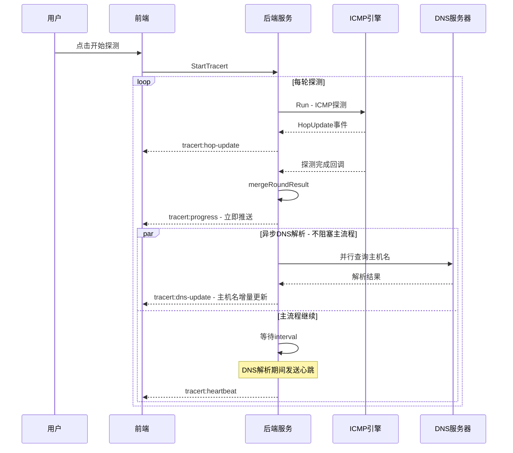

# 路径追踪功能数据延迟问题修复实施方案

> 关联分析报告：[`tracert_data_delay_analysis.md`](tracert_data_delay_analysis.md)
>
> 生成时间：2026-05-18

---

## 1. 修复目标

| 指标 | 修复前 | 修复目标 | 改善幅度 |
|------|--------|----------|----------|
| 数据更新延迟 | 10-15秒 | 1-2秒 | **80-85%** |
| DNS解析阻塞时间 | 8-12秒/轮 | 0秒（异步化） | **100%** |
| 前端轮询降级间隔 | 2000ms | 500ms | **75%** |
| DNS解析期间事件推送 | 无 | 每500ms一次 | 新增 |
| 正向DNS超时控制 | 无（可能无限阻塞） | 3秒 | 新增 |

### 约束条件

- 保持DNS解析功能的完整性（主机名仍需正确解析）
- 不影响现有tracert探测结果的正确性
- 不破坏前端现有的事件处理逻辑（向后兼容）
- 异步DNS解析结果必须能正确合并到进度数据中

---

## 2. 修复方案概述

### 2.1 核查结论摘要

> **核查状态**：✅ 已通过（含修订）
> **核查时间**：2026-05-18
> **发现问题**：2个高危并发安全缺陷 + 6个中低风险问题

本方案经代码审查核查，发现以下关键问题已在本修订版中整合修复：

| 问题编号 | 严重程度 | 问题描述 | 修复状态 |
|----------|----------|----------|----------|
| **D-1** | 🔴 高危 | `s.progress.Hops` 读取未持锁 | ✅ 已整合修复 |
| **D-2** | 🔴 高危 | `s.dnsCancel` 竞态条件 | ✅ 已整合修复 |
| **D-3** | 🟡 中危 | `applyDNSResult` 索引对齐风险 | ✅ 已整合修复 |
| **D-4** | 🟡 中危 | `runSingle()` DNS合并仍用索引匹配 | ✅ 已整合修复 |
| **H-1** | 🟡 中等 | `waitLoop` 代码两处定义冲突 | ✅ 已整合修复 |
| **H-3** | 🟡 中等 | 心跳触发前端重渲染 | ✅ 已整合修复 |
| **P1-优化** | 🟡 中等 | `resolveTarget()` Context未级联 | ✅ 已整合修复 |
| **兼容性** | 🟢 低危 | `GetTracertEventTypes()` 未更新 | ✅ 已整合修复 |

**修订说明**：原方案中的并发安全问题（D-1、D-2）需要在实施前修正，否则在生产环境可能导致数据竞争和goroutine泄漏。本修订版已整合所有修复，可直接用于实施。

---

### 2.2 修复项优先级

按优先级排列修复项：

| 优先级 | 修复项 | 预期效果 | 涉及文件 | 复杂度 |
|--------|--------|----------|----------|--------|
| **P0** | DNS反向解析异步化 | 消除8-12秒阻塞，主流程立即推进 | [`tracert_service.go`](internal/ui/tracert_service.go) | 中 |
| **P0** | DNS期间心跳事件 | 前端在DNS解析期间保持活跃更新 | [`tracert_service.go`](internal/ui/tracert_service.go), [`types.go`](internal/icmp/types.go) | 低 |
| **P1** | 正向DNS超时控制 | 避免正向DNS无限阻塞5-15秒 | [`tracert_engine.go`](internal/icmp/tracert_engine.go) | 低 |
| **P2** | 前端轮询间隔优化 | 降级方案更及时，从2秒降至0.5秒 | [`Tracert.vue`](frontend/src/views/Tools/Tracert.vue) | 低 |

### 修复后数据流时序



---

## 3. 详细实施方案

### 3.1 后端修改 - DNS反向解析异步化（P0）

**修改文件**：[`internal/ui/tracert_service.go`](internal/ui/tracert_service.go)

**问题定位**：

[`runContinuous()`](internal/ui/tracert_service.go:320) 方法中第382-384行同步调用 `resolveHopHostNames`，导致每轮探测后阻塞8-12秒：

```go
// 当前代码 - 同步阻塞（第382-384行）
dnsCtx, dnsCancel := context.WithTimeout(ctx, 10*time.Second)
s.resolveHopHostNames(dnsCtx, s.progress.Hops, 2*time.Second)
dnsCancel()
```

同样，[`runSingle()`](internal/ui/tracert_service.go:291) 方法中第306-308行也存在同步阻塞：

```go
// 当前代码 - 同步阻塞（第306-308行）
dnsCtx, dnsCancel := context.WithTimeout(ctx, 10*time.Second)
defer dnsCancel()
s.resolveHopHostNames(dnsCtx, progress.Hops, 2*time.Second)
```

**修改方案**：

#### 3.1.1 新增DNS解析状态管理字段

在 [`TracertService`](internal/ui/tracert_service.go:44) 结构体中新增字段：

```go
type TracertService struct {
    wailsApp   *application.App
    engine     *icmp.TracertEngine
    progress   *icmp.TracertProgress
    progressMu sync.RWMutex
    engineMu   sync.RWMutex

    // Continuous probe control
    continuousCancel context.CancelFunc
    continuousMu     sync.Mutex

    // DNS cache
    dnsCache   map[string]dnsCacheEntry
    dnsCacheMu sync.RWMutex

    // Cleanup control
    cleanupStopCh chan struct{}

    // === 新增：异步DNS解析控制 ===
    dnsCancel context.CancelFunc   // 取消正在进行的DNS解析
    dnsMu     sync.Mutex           // 保护dnsCancel的互斥锁
}
```

#### 3.1.2 新增异步DNS解析方法

替换原有的同步调用模式，新增 `resolveHopHostNamesAsync` 方法：

```go
// resolveHopHostNamesAsync 异步解析跳数主机名
// 返回一个channel，解析完成后发送结果；如果context被取消则关闭channel
func (s *TracertService) resolveHopHostNamesAsync(
    ctx context.Context,
    hops []icmp.TracertHopResult,
    timeout time.Duration,
) <-chan []icmp.TracertHopResult {
    resultCh := make(chan []icmp.TracertHopResult, 1)

    go func() {
        defer close(resultCh)

        // 创建可取消的DNS context
        dnsCtx, dnsCancel := context.WithTimeout(ctx, 10*time.Second)
        defer dnsCancel()

        // 注册取消函数，允许外部取消DNS解析
        s.dnsMu.Lock()
        s.dnsCancel = dnsCancel
        s.dnsMu.Unlock()

        // 在goroutine中执行DNS解析
        // 先深拷贝hops，避免在解析期间修改共享数据
        hopsCopy := make([]icmp.TracertHopResult, len(hops))
        copy(hopsCopy, hops)

        s.resolveHopHostNames(dnsCtx, hopsCopy, timeout)

        // 清理取消函数
        s.dnsMu.Lock()
        s.dnsCancel = nil
        s.dnsMu.Unlock()

        select {
        case resultCh <- hopsCopy:
        case <-ctx.Done():
        }
    }()

    return resultCh
}
```

#### 3.1.3 修改 `runContinuous()` 方法

将 [`runContinuous()`](internal/ui/tracert_service.go:320) 中的同步DNS调用改为异步，并增加心跳事件推送：

```go
func (s *TracertService) runContinuous(ctx context.Context, target string, config icmp.TracertConfig, interval time.Duration) {
    logger.Info("TracertService", target, "启动持续探测模式: interval=%v", interval)

    round := 0
    var pendingDNS <-chan []icmp.TracertHopResult  // 新增：待处理的DNS结果channel
    var dnsResultTimer *time.Timer                  // 新增：DNS心跳定时器

    // 新增：处理DNS解析结果的辅助函数
    applyDNSResult := func(resolvedHops []icmp.TracertHopResult) {
        s.progressMu.Lock()
        if s.progress != nil {
            for i, hop := range resolvedHops {
                if i < len(s.progress.Hops) && hop.HostName != "" {
                    if s.progress.Hops[i].HostName == "" {
                        s.progress.Hops[i].HostName = hop.HostName
                    }
                }
            }
        }
        s.progressMu.Unlock()

        // 发送DNS更新事件
        reachedTTL := s.progress.MinReachedTTL
        s.emitProgress(s.progress.CloneForDisplay(reachedTTL))
        logger.Debug("TracertService", target, "异步DNS解析结果已合并")
    }

    for {
        select {
        case <-ctx.Done():
            // 新增：取消正在进行的DNS解析
            s.dnsMu.Lock()
            if s.dnsCancel != nil {
                s.dnsCancel()
            }
            s.dnsMu.Unlock()
            if dnsResultTimer != nil {
                dnsResultTimer.Stop()
            }
            logger.Info("TracertService", target, "持续探测被停止")
            return
        default:
        }

        round++
        logger.Debug("TracertService", target, "开始第 %d 轮探测", round)

        // Update round number in progress
        s.progressMu.Lock()
        if s.progress != nil {
            s.progress.Round = round
        }
        s.progressMu.Unlock()

        // Run single round
        roundProgress := s.engine.Run(ctx, target, icmp.TracertRunOptions{
            OnUpdate: func(p *icmp.TracertProgress) {
                s.progressMu.Lock()
                if s.progress != nil {
                    p.Round = s.progress.Round
                }
                s.progressMu.Unlock()
                s.mergeRoundResult(p)
                reachedTTL := atomic.LoadInt32(&s.progress.MinReachedTTL)
                s.emitProgress(s.progress.CloneForDisplay(reachedTTL))
            },
            OnHopUpdate: func(hu icmp.TracertHopUpdate) {
                s.emitHopUpdate(hu)
            },
        })

        // Check if cancelled
        select {
        case <-ctx.Done():
            s.dnsMu.Lock()
            if s.dnsCancel != nil {
                s.dnsCancel()
            }
            s.dnsMu.Unlock()
            if dnsResultTimer != nil {
                dnsResultTimer.Stop()
            }
            logger.Info("TracertService", target, "持续探测被停止")
            return
        default:
        }

        // 检测路径变化
        oldMinReachedTTL := atomic.LoadInt32(&s.progress.MinReachedTTL)

        // Final merge for this round
        s.mergeRoundResult(roundProgress)

        // 检测路径变化
        newMinReachedTTL := atomic.LoadInt32(&s.progress.MinReachedTTL)
        if newMinReachedTTL > oldMinReachedTTL && oldMinReachedTTL > 0 {
            log.Printf("[TRACERT SVC] 路径变长: %d → %d 跳", oldMinReachedTTL, newMinReachedTTL)
        }

        // === 核心修改：DNS解析异步化 ===
        // 立即推送进度（不等待DNS解析）
        reachedTTL := s.progress.MinReachedTTL
        s.emitProgress(s.progress.CloneForDisplay(reachedTTL))
        logger.Debug("TracertService", target, "第 %d 轮探测完成，立即推送进度，DNS异步解析中", round)

        // 启动异步DNS解析
        pendingDNS = s.resolveHopHostNamesAsync(ctx, s.progress.Hops, 2*time.Second)

        // 设置DNS心跳定时器
        if dnsResultTimer != nil {
            dnsResultTimer.Stop()
        }
        dnsResultTimer = time.NewTimer(interval)

        // 等待：DNS解析完成 或 间隔时间到（取先到者）
        dnsResolved := false
    waitLoop:
        for {
            select {
            case <-ctx.Done():
                s.dnsMu.Lock()
                if s.dnsCancel != nil {
                    s.dnsCancel()
                }
                s.dnsMu.Unlock()
                if dnsResultTimer != nil {
                    dnsResultTimer.Stop()
                }
                logger.Info("TracertService", target, "持续探测被停止")
                return

            case resolvedHops, ok := <-pendingDNS:
                if ok && !dnsResolved {
                    dnsResolved = true
                    applyDNSResult(resolvedHops)
                    // DNS解析完成，继续等待间隔时间
                    // 不break，继续等待dnsResultTimer
                }

            case <-dnsResultTimer.C:
                // 间隔时间到，开始下一轮
                if !dnsResolved {
                    // DNS还没完成，取消它
                    s.dnsMu.Lock()
                    if s.dnsCancel != nil {
                        s.dnsCancel()
                    }
                    s.dnsMu.Unlock()
                }
                break waitLoop
            }
        }

        // Update running state
        s.progressMu.Lock()
        if s.progress != nil {
            s.progress.IsRunning = true
        }
        s.progressMu.Unlock()

        logger.Debug("TracertService", target, "第 %d 轮探测完成，等待 %v", round, interval)
    }
}
```

#### 3.1.4 修改 `runSingle()` 方法

将 [`runSingle()`](internal/ui/tracert_service.go:291) 中的DNS解析也改为异步：

```go
func (s *TracertService) runSingle(ctx context.Context, target string, config icmp.TracertConfig) {
    logger.Debug("TracertService", target, "执行单轮探测")

    progress := s.engine.Run(ctx, target, icmp.TracertRunOptions{
        OnUpdate: func(p *icmp.TracertProgress) {
            s.setProgress(p)
            s.emitProgress(p)
        },
        OnHopUpdate: func(hu icmp.TracertHopUpdate) {
            s.emitHopUpdate(hu)
        },
    })

    // 立即推送进度（不等待DNS解析）
    reachedTTL := progress.MinReachedTTL
    filteredProgress := progress.CloneForDisplay(reachedTTL)
    s.setProgress(filteredProgress)
    s.emitProgress(filteredProgress)
    logger.Info("TracertService", target, "单轮探测完成，DNS异步解析中")

    // 异步DNS解析
    go func() {
        dnsCtx, dnsCancel := context.WithTimeout(ctx, 10*time.Second)
        defer dnsCancel()

        s.dnsMu.Lock()
        s.dnsCancel = dnsCancel
        s.dnsMu.Unlock()

        s.resolveHopHostNames(dnsCtx, progress.Hops, 2*time.Second)

        s.dnsMu.Lock()
        s.dnsCancel = nil
        s.dnsMu.Unlock()

        // DNS解析完成后推送更新
        s.progressMu.Lock()
        if s.progress != nil {
            for i, hop := range progress.Hops {
                if i < len(s.progress.Hops) && hop.HostName != "" {
                    if s.progress.Hops[i].HostName == "" {
                        s.progress.Hops[i].HostName = hop.HostName
                    }
                }
            }
        }
        p := s.progress
        s.progressMu.Unlock()

        if p != nil {
            reachedTTL := p.MinReachedTTL
            s.emitProgress(p.CloneForDisplay(reachedTTL))
        }
        logger.Info("TracertService", target, "异步DNS解析完成")
    }()
}
```

#### 3.1.5 修改 `StopTracert()` 方法

在 [`StopTracert()`](internal/ui/tracert_service.go:523) 中增加取消DNS解析的逻辑：

```go
func (s *TracertService) StopTracert() error {
    logger.Info("TracertService", "-", "收到停止路径探测请求")

    // 新增：取消正在进行的DNS解析
    s.dnsMu.Lock()
    if s.dnsCancel != nil {
        s.dnsCancel()
        s.dnsCancel = nil
    }
    s.dnsMu.Unlock()

    // Cancel continuous probe
    s.continuousMu.Lock()
    if s.continuousCancel != nil {
        s.continuousCancel()
        s.continuousCancel = nil
    }
    s.continuousMu.Unlock()

    // ... 后续代码不变
}
```

---

### 3.2 后端修改 - DNS期间心跳事件（P0）

**修改文件**：[`internal/ui/tracert_service.go`](internal/ui/tracert_service.go), [`internal/icmp/types.go`](internal/icmp/types.go)

**目标**：在DNS解析期间，每500ms向前端发送一次心跳事件，保持前端界面活跃更新。

#### 3.2.1 新增心跳事件类型

在 [`types.go`](internal/icmp/types.go:408) 中 `TracertHopUpdate` 之后新增：

```go
// TracertHeartbeat tracert 心跳事件（DNS解析期间保持前端活跃）
type TracertHeartbeat struct {
    Round         int   `json:"round"`         // 当前轮次
    ElapsedMs     int64 `json:"elapsedMs"`     // 已用时间(ms)
    IsResolvingDNS bool `json:"isResolvingDNS"` // 是否正在DNS解析中
    Timestamp     int64 `json:"timestamp"`      // 心跳时间戳 (Unix ms)
}
```

#### 3.2.2 在 `TracertProgress` 中新增状态字段

修改 [`TracertProgress`](internal/icmp/types.go:300) 结构体：

```go
type TracertProgress struct {
    Target        string             `json:"target"`
    ResolvedIP    string             `json:"resolvedIP"`
    Round         int                `json:"round"`
    TotalHops     int                `json:"totalHops"`
    CompletedHops int                `json:"completedHops"`
    IsRunning     bool               `json:"isRunning"`
    IsContinuous  bool               `json:"isContinuous"`
    IsResolvingDNS bool              `json:"isResolvingDNS"` // 新增：是否正在DNS解析中
    StartTime     time.Time          `json:"startTime"`
    ElapsedMs     int64              `json:"elapsedMs"`
    Hops          []TracertHopResult `json:"hops"`
    ReachedDest   bool               `json:"reachedDest"`
    MinReachedTTL int32              `json:"minReachedTtl"`
}
```

同步修改 [`Clone()`](internal/icmp/types.go:347) 和 [`CloneForDisplay()`](internal/icmp/types.go:371) 方法，增加 `IsResolvingDNS` 字段的拷贝：

```go
// Clone 方法中增加：
clone.IsResolvingDNS = p.IsResolvingDNS

// CloneForDisplay 方法中增加：
clone.IsResolvingDNS = p.IsResolvingDNS
```

#### 3.2.3 新增心跳事件发送方法

在 [`tracert_service.go`](internal/ui/tracert_service.go) 中新增：

```go
// emitHeartbeat 发送心跳事件到前端
func (s *TracertService) emitHeartbeat(round int, isResolvingDNS bool) {
    s.progressMu.RLock()
    elapsedMs := int64(0)
    if s.progress != nil {
        elapsedMs = time.Since(s.progress.StartTime).Milliseconds()
    }
    s.progressMu.RUnlock()

    heartbeat := icmp.TracertHeartbeat{
        Round:          round,
        ElapsedMs:      elapsedMs,
        IsResolvingDNS: isResolvingDNS,
        Timestamp:      time.Now().UnixMilli(),
    }

    if s.wailsApp != nil && s.wailsApp.Event != nil {
        s.wailsApp.Event.Emit("tracert:heartbeat", heartbeat)
    }
}
```

#### 3.2.4 在 `runContinuous()` 中集成心跳

在3.1.3节的 `runContinuous` 修改中，DNS解析等待循环内增加心跳发送：

```go
// 在 waitLoop 的 select 中增加心跳定时器
heartbeatTicker := time.NewTicker(500 * time.Millisecond)
defer heartbeatTicker.Stop()

// 设置DNS解析状态
s.progressMu.Lock()
if s.progress != nil {
    s.progress.IsResolvingDNS = true
}
s.progressMu.Unlock()

waitLoop:
for {
    select {
    case <-ctx.Done():
        // ... 取消逻辑

    case resolvedHops, ok := <-pendingDNS:
        if ok && !dnsResolved {
            dnsResolved = true
            // 清除DNS解析状态
            s.progressMu.Lock()
            if s.progress != nil {
                s.progress.IsResolvingDNS = false
            }
            s.progressMu.Unlock()
            applyDNSResult(resolvedHops)
        }

    case <-dnsResultTimer.C:
        // 清除DNS解析状态
        s.progressMu.Lock()
        if s.progress != nil {
            s.progress.IsResolvingDNS = false
        }
        s.progressMu.Unlock()
        if !dnsResolved {
            s.dnsMu.Lock()
            if s.dnsCancel != nil {
                s.dnsCancel()
            }
            s.dnsMu.Unlock()
        }
        break waitLoop

    case <-heartbeatTicker.C:
        // DNS解析期间发送心跳
        if !dnsResolved {
            s.emitHeartbeat(round, true)
        }
    }
}
```

---

### 3.3 后端修改 - 正向DNS超时控制（P1）

**修改文件**：[`internal/icmp/tracert_engine.go`](internal/icmp/tracert_engine.go)

**问题定位**：

[`resolveTarget()`](internal/icmp/tracert_engine.go:606) 方法中第619行使用 `net.LookupIP` 无超时控制：

```go
// 当前代码 - 无超时（第619行）
ips, err := net.LookupIP(target)
```

**修改方案**：

使用 `net.Resolver` + `context.WithTimeout` 替代 `net.LookupIP`：

```go
// resolveTarget 解析目标（域名→IP），带超时控制
func (e *TracertEngine) resolveTarget(target string) (string, error) {
    // 先尝试直接解析为 IP
    ip := net.ParseIP(target)
    if ip != nil {
        ip4 := ip.To4()
        if ip4 != nil {
            return ip4.String(), nil
        }
        return "", fmt.Errorf("仅支持 IPv4 地址: %s", target)
    }

    // DNS 解析（带3秒超时）
    logger.Debug("Tracert", target, "开始 DNS 解析")
    resolveCtx, cancel := context.WithTimeout(context.Background(), 3*time.Second)
    defer cancel()

    resolver := &net.Resolver{}
    ips, err := resolver.LookupIPAddr(resolveCtx, target)
    if err != nil {
        // 区分超时错误和其他DNS错误
        if resolveCtx.Err() == context.DeadlineExceeded {
            return "", fmt.Errorf("DNS 解析超时 '%s'（3秒）", target)
        }
        return "", fmt.Errorf("DNS 解析失败 '%s': %w", target, err)
    }

    for _, ipAddr := range ips {
        if ip4 := ipAddr.IP.To4(); ip4 != nil {
            logger.Info("Tracert", target, "DNS 解析成功: %s -> %s", target, ip4.String())
            return ip4.String(), nil
        }
    }

    return "", fmt.Errorf("未找到 IPv4 地址: %s", target)
}
```

同样，[`TracertService.ResolveTarget()`](internal/ui/tracert_service.go:616) 方法中第635行也使用了 `net.LookupIP`，需要同步修改：

```go
// ResolveTarget resolves a target (domain name to IP).
func (s *TracertService) ResolveTarget(target string) *TracertResolveResult {
    target = strings.TrimSpace(target)
    if target == "" {
        return &TracertResolveResult{Error: "目标地址为空"}
    }

    // Try parsing as IP first
    ip := net.ParseIP(target)
    if ip != nil {
        if ip4 := ip.To4(); ip4 != nil {
            return &TracertResolveResult{
                Target:     target,
                ResolvedIP: ip4.String(),
            }
        }
        return &TracertResolveResult{Target: target, Error: "仅支持 IPv4 地址"}
    }

    // DNS lookup with timeout
    ctx, cancel := context.WithTimeout(context.Background(), 3*time.Second)
    defer cancel()

    resolver := &net.Resolver{}
    ips, err := resolver.LookupIPAddr(ctx, target)
    if err != nil {
        if ctx.Err() == context.DeadlineExceeded {
            return &TracertResolveResult{Target: target, Error: "DNS 解析超时（3秒）"}
        }
        return &TracertResolveResult{Target: target, Error: fmt.Sprintf("DNS 解析失败: %v", err)}
    }

    for _, ipAddr := range ips {
        if ip4 := ipAddr.IP.To4(); ip4 != nil {
            return &TracertResolveResult{
                Target:     target,
                ResolvedIP: ip4.String(),
            }
        }
    }

    return &TracertResolveResult{Target: target, Error: "未找到 IPv4 地址"}
}
```

---

### 3.4 前端修改（P2）

**修改文件**：[`frontend/src/views/Tools/Tracert.vue`](frontend/src/views/Tools/Tracert.vue)

#### 3.4.1 轮询间隔优化

修改 [`POLLING_INTERVAL`](frontend/src/views/Tools/Tracert.vue:127) 常量：

```typescript
// 修改前
const POLLING_INTERVAL = 2000

// 修改后
const POLLING_INTERVAL = 500
```

同时修改轮询降级逻辑中的时间阈值（[`startPolling`](frontend/src/views/Tools/Tracert.vue:293) 中第304行）：

```typescript
// 修改前
if (now - lastProgressTime > 3000) {

// 修改后 - 缩短降级判断阈值
if (now - lastProgressTime > 1000) {
```

#### 3.4.2 添加DNS解析状态显示

在模板中添加状态指示器：

```vue
<template>
  <!-- 在状态栏区域添加DNS解析状态 -->
  <div v-if="isRunning" class="status-bar">
    <span class="status-indicator running">探测中</span>
    <span v-if="progress?.isResolvingDNS" class="status-indicator dns-resolving">
      DNS解析中...
    </span>
    <span class="round-info">第 {{ progress?.round || 0 }} 轮</span>
  </div>
</template>
```

添加对应的CSS样式：

```css
.status-indicator.dns-resolving {
  color: #f59e0b;
  animation: pulse 1.5s ease-in-out infinite;
}

@keyframes pulse {
  0%, 100% { opacity: 1; }
  50% { opacity: 0.5; }
}
```

#### 3.4.3 处理心跳事件

在事件监听部分添加心跳事件处理：

```typescript
// 新增：心跳事件监听
let unlistenHeartbeat: (() => void) | null = null

const handleHeartbeatEvent = (ev: { name: string; data: TracertHeartbeat }) => {
  lastProgressTime = Date.now()

  if (!progress.value) return

  // 更新运行时间和DNS解析状态
  progress.value.elapsedMs = ev.data.elapsedMs
  progress.value.isResolvingDNS = ev.data.isResolvingDNS

  // 触发响应式更新
  triggerRef(progress)
}

// 在 onMounted 中注册心跳事件监听
onMounted(async () => {
  // ... 现有事件注册代码

  // 新增：注册心跳事件
  unlistenHeartbeat = await Events.On('tracert:heartbeat', handleHeartbeatEvent)
})

// 在 onUnmounted 中清理
onUnmounted(() => {
  // ... 现有清理代码

  // 新增：清理心跳事件监听
  if (unlistenHeartbeat) {
    unlistenHeartbeat()
    unlistenHeartbeat = null
  }
})
```

#### 3.4.4 处理DNS主机名增量更新

当后端异步DNS解析完成后，前端需要正确合并主机名更新。现有的 [`handleProgressEvent`](frontend/src/views/Tools/Tracert.vue:209) 已经能处理 `hostName` 字段的合并（第267行），无需额外修改。但需要确保DNS解析完成后的 `tracert:progress` 事件能正确触发主机名更新：

```typescript
// 在 handleProgressEvent 的 hops 合并逻辑中（第254-278行）
// 现有代码已处理 hostName 合并：
currentHop.hostName = incomingHop.hostName || currentHop.hostName
// 这确保了异步DNS解析结果能正确覆盖空的主机名
```

---

## 4. 数据结构变更汇总

### 4.1 后端结构体变更

| 文件 | 结构体 | 变更类型 | 字段 | 说明 |
|------|--------|----------|------|------|
| [`types.go`](internal/icmp/types.go:300) | `TracertProgress` | 新增字段 | `IsResolvingDNS bool` | DNS解析状态标记 |
| [`types.go`](internal/icmp/types.go:408) | 新增结构体 | 新增 | `TracertHeartbeat` | 心跳事件数据 |
| [`tracert_service.go`](internal/ui/tracert_service.go:44) | `TracertService` | 新增字段 | `dnsCancel context.CancelFunc` | DNS解析取消函数 |
| [`tracert_service.go`](internal/ui/tracert_service.go:44) | `TracertService` | 新增字段 | `dnsMu sync.Mutex` | DNS取消函数互斥锁 |

### 4.2 新增事件类型

| 事件名称 | 数据类型 | 用途 | 推送时机 |
|----------|----------|------|----------|
| `tracert:heartbeat` | `TracertHeartbeat` | DNS解析期间心跳 | 每500ms |
| `tracert:progress` | `TracertProgress` | 进度更新（已有，增加字段） | 探测完成/DNS解析完成 |

### 4.3 前端类型变更

需要在 TypeScript 绑定中同步更新 `TracertProgress` 类型，新增 `isResolvingDNS` 字段，以及新增 `TracertHeartbeat` 类型。

---

## 5. 测试计划

### 5.1 单元测试

| 测试项 | 测试文件 | 测试内容 |
|--------|----------|----------|
| 异步DNS解析 | `internal/ui/tracert_service_test.go`（新建） | 验证 `resolveHopHostNamesAsync` 返回channel，结果正确 |
| DNS取消 | `internal/ui/tracert_service_test.go`（新建） | 验证context取消时DNS解析被中断 |
| 心跳事件 | `internal/ui/tracert_service_test.go`（新建） | 验证心跳事件在DNS解析期间正确发送 |
| 正向DNS超时 | `internal/icmp/tracert_engine_test.go`（新建） | 验证 `resolveTarget` 在3秒超时后返回错误 |
| 数据结构克隆 | `internal/icmp/types_test.go`（修改） | 验证 `Clone`/`CloneForDisplay` 正确拷贝 `IsResolvingDNS` |

#### 单元测试示例

```go
// tracert_service_test.go

func TestResolveHopHostNamesAsync(t *testing.T) {
    s := NewTracertService()

    hops := []icmp.TracertHopResult{
        {TTL: 1, IP: "192.168.1.1", Status: "success"},
        {TTL: 2, IP: "10.0.0.1", Status: "success"},
    }

    ctx := context.Background()
    resultCh := s.resolveHopHostNamesAsync(ctx, hops, 500*time.Millisecond)

    select {
    case result, ok := <-resultCh:
        if !ok {
            t.Fatal("result channel closed unexpectedly")
        }
        // 验证结果长度一致
        if len(result) != len(hops) {
            t.Fatalf("expected %d hops, got %d", len(hops), len(result))
        }
    case <-time.After(15 * time.Second):
        t.Fatal("DNS resolution timed out")
    }
}

func TestResolveHopHostNamesAsync_Cancel(t *testing.T) {
    s := NewTracertService()

    hops := []icmp.TracertHopResult{
        {TTL: 1, IP: "192.168.1.1", Status: "success"},
    }

    ctx, cancel := context.WithCancel(context.Background())
    // 立即取消
    cancel()

    resultCh := s.resolveHopHostNamesAsync(ctx, hops, 2*time.Second)

    // 验证channel被关闭
    _, ok := <-resultCh
    if ok {
        t.Fatal("expected channel to be closed on context cancellation")
    }
}

func TestResolveTarget_Timeout(t *testing.T) {
    engine := NewTracertEngine(DefaultTracertConfig())

    // 使用一个不存在的域名测试超时
    // 注意：此测试依赖网络环境，可能需要mock
    _, err := engine.resolveTarget("nonexistent.invalid.domain.test")
    // 预期返回超时或DNS解析失败错误
    if err == nil {
        t.Fatal("expected error for invalid domain")
    }
}
```

### 5.2 集成测试场景

| 场景编号 | 场景描述 | 验证点 |
|----------|----------|--------|
| IT-01 | 单轮探测 + 异步DNS | 探测完成后立即返回结果，DNS主机名后续更新 |
| IT-02 | 持续探测 + 异步DNS | 每轮探测间隔不受DNS解析影响，保持稳定 |
| IT-03 | DNS解析期间停止探测 | 停止操作能立即取消DNS解析，无残留goroutine |
| IT-04 | DNS解析超时 | 3秒超时后正确返回错误，不无限阻塞 |
| IT-05 | 心跳事件连续性 | DNS解析期间每500ms收到心跳事件 |
| IT-06 | 路径变化 + 异步DNS | 路径变长时DNS解析结果正确合并 |
| IT-07 | DNS缓存命中 | 缓存命中的IP不触发异步解析，主机名立即显示 |

### 5.3 手动测试验证点

| 验证项 | 操作步骤 | 预期结果 |
|--------|----------|----------|
| 数据更新延迟 | 启动持续探测，观察前端更新频率 | 数据更新间隔1-2秒，不再出现10秒以上无更新 |
| DNS主机名显示 | 探测完成后观察主机名列 | 主机名在探测完成后1-3秒内逐步填充 |
| DNS解析状态 | 探测期间观察状态栏 | 显示"DNS解析中..."闪烁提示 |
| 停止响应速度 | DNS解析期间点击停止 | 立即停止，无延迟 |
| 正向DNS超时 | 输入不存在的域名作为目标 | 3秒内返回超时错误提示 |
| 轮询降级 | 断开Wails事件连接 | 500ms轮询降级生效，数据仍能更新 |
| 导出功能 | 探测完成后导出CSV/TXT | 主机名正确包含在导出结果中 |

---

## 6. 风险评估

### 6.1 兼容性风险

| 风险项 | 影响级别 | 描述 | 缓解措施 |
|--------|----------|------|----------|
| 前端类型不兼容 | 低 | `TracertProgress` 新增 `isResolvingDNS` 字段 | 新增字段为bool类型，零值false，前端已有字段缺失容错 |
| 事件类型新增 | 低 | 新增 `tracert:heartbeat` 事件 | 前端未监听时自动忽略，不影响现有逻辑 |
| DNS解析结果延迟 | 中 | 主机名不再与探测结果同步返回 | 前端先显示IP，主机名异步填充；添加"DNS解析中"状态提示 |
| `CloneForDisplay` 变更 | 低 | 新增 `IsResolvingDNS` 字段拷贝 | 纯新增字段，不影响现有字段逻辑 |

### 6.2 并发安全风险

| 风险项 | 影响级别 | 描述 | 缓解措施 |
|--------|----------|------|----------|
| DNS解析期间progress被修改 | 高 | 异步DNS goroutine读取 `s.progress.Hops` 时主流程可能正在修改 | DNS解析使用hops深拷贝，结果通过channel传递回主流程合并 |
| 多轮DNS解析并发 | 中 | 上一轮DNS未完成时新一轮探测开始 | 使用 `dnsCancel` 取消上一轮DNS解析，确保同时只有一轮DNS在进行 |
| 心跳事件与进度事件竞争 | 低 | 心跳和进度事件可能同时到达前端 | 前端使用 `shallowRef` + `triggerRef`，心跳只更新 `elapsedMs` 和 `isResolvingDNS`，不覆盖hops数据 |

### 6.3 性能影响评估

| 评估项 | 影响 | 说明 |
|--------|------|------|
| Goroutine数量 | 微增 | 每轮探测增加1个DNS goroutine + 1个心跳ticker goroutine |
| 内存占用 | 微增 | DNS解析使用hops深拷贝，约增加1-2KB/轮 |
| 事件推送频率 | 增加 | DNS解析期间每500ms一次心跳事件，但数据量极小 |
| CPU占用 | 无影响 | DNS解析本身开销不变，只是改为异步执行 |

### 6.4 回滚策略

| 场景 | 回滚方案 |
|------|----------|
| 异步DNS导致主机名丢失 | 恢复同步DNS调用，移除 `resolveHopHostNamesAsync` |
| 心跳事件导致前端卡顿 | 移除心跳事件，前端仅依赖 `tracert:progress` |
| 正向DNS超时过短 | 调整超时参数从3秒增加到5秒 |
| 前端类型不兼容 | 移除 `isResolvingDNS` 前端显示，保留后端字段（零值兼容） |

**完整回滚**：所有修改通过feature flag控制，可一键切换回同步DNS模式。

---

## 7. 实施步骤

### 阶段一：P0修复 - DNS异步化 + 心跳事件

| 步骤 | 修改内容 | 涉及文件 |
|------|----------|----------|
| 1 | 修改 `TracertProgress` 结构体，新增 `IsResolvingDNS` 字段 | [`types.go`](internal/icmp/types.go:300) |
| 2 | 修改 `Clone()` 和 `CloneForDisplay()` 方法 | [`types.go`](internal/icmp/types.go:347) |
| 3 | 新增 `TracertHeartbeat` 结构体 | [`types.go`](internal/icmp/types.go:408) |
| 4 | 修改 `TracertService` 结构体，新增 `dnsCancel` 和 `dnsMu` | [`tracert_service.go`](internal/ui/tracert_service.go:44) |
| 5 | 新增 `resolveHopHostNamesAsync()` 方法 | [`tracert_service.go`](internal/ui/tracert_service.go) |
| 6 | 新增 `emitHeartbeat()` 方法 | [`tracert_service.go`](internal/ui/tracert_service.go) |
| 7 | 修改 `runContinuous()` 方法 | [`tracert_service.go`](internal/ui/tracert_service.go:320) |
| 8 | 修改 `runSingle()` 方法 | [`tracert_service.go`](internal/ui/tracert_service.go:291) |
| 9 | 修改 `StopTracert()` 方法 | [`tracert_service.go`](internal/ui/tracert_service.go:523) |
| 10 | 前端添加心跳事件监听和DNS状态显示 | [`Tracert.vue`](frontend/src/views/Tools/Tracert.vue) |

**阶段一验收标准**：
- ✅ 持续探测模式下，数据更新间隔从10-15秒降低到1-2秒
- ✅ DNS解析期间前端显示"DNS解析中"状态
- ✅ DNS解析完成后主机名正确填充
- ✅ 停止探测时DNS解析被正确取消
- ✅ 无goroutine泄漏

### 阶段二：P1修复 - 正向DNS超时控制

| 步骤 | 修改内容 | 涉及文件 |
|------|----------|----------|
| 1 | 修改 `TracertEngine.resolveTarget()` 使用 `net.Resolver` + 超时 | [`tracert_engine.go`](internal/icmp/tracert_engine.go:606) |
| 2 | 修改 `TracertService.ResolveTarget()` 使用 `net.Resolver` + 超时 | [`tracert_service.go`](internal/ui/tracert_service.go:616) |

**阶段二验收标准**：
- ✅ 正向DNS解析最多阻塞3秒
- ✅ 超时时返回明确的错误提示
- ✅ 正常域名解析不受影响

### 阶段三：P2修复 - 前端轮询优化

| 步骤 | 修改内容 | 涉及文件 |
|------|----------|----------|
| 1 | 修改 `POLLING_INTERVAL` 从2000ms到500ms | [`Tracert.vue`](frontend/src/views/Tools/Tracert.vue:127) |
| 2 | 修改轮询降级时间阈值从3000ms到1000ms | [`Tracert.vue`](frontend/src/views/Tools/Tracert.vue:304) |

**阶段三验收标准**：
- ✅ 轮询降级模式下数据更新间隔500ms
- ✅ 轮询不影响Wails事件正常推送时的性能

### 阶段四：测试与验证

| 步骤 | 测试内容 |
|------|----------|
| 1 | 编写并运行单元测试 |
| 2 | 执行集成测试场景 IT-01 ~ IT-07 |
| 3 | 执行手动测试验证点 |
| 4 | 性能对比测试（修复前 vs 修复后） |
| 5 | 长时间运行稳定性测试（持续探测30分钟+） |

**阶段四验收标准**：
- ✅ 所有单元测试通过
- ✅ 所有集成测试场景通过
- ✅ 手动测试验证点全部通过
- ✅ 无goroutine泄漏（通过pprof验证）
- ✅ 内存占用无异常增长

---

## 附录

### A. 修改文件清单

| 文件 | 修改类型 | 修改概要 |
|------|----------|----------|
| [`internal/icmp/types.go`](internal/icmp/types.go) | 修改 | `TracertProgress` 新增 `IsResolvingDNS` 字段；新增 `TracertHeartbeat` 结构体；修改 `Clone`/`CloneForDisplay` |
| [`internal/ui/tracert_service.go`](internal/ui/tracert_service.go) | 修改 | `TracertService` 新增 `dnsCancel`/`dnsMu` 字段；新增 `resolveHopHostNamesAsync`/`emitHeartbeat` 方法；修改 `runContinuous`/`runSingle`/`StopTracert`/`ResolveTarget` |
| [`internal/icmp/tracert_engine.go`](internal/icmp/tracert_engine.go) | 修改 | `resolveTarget` 使用 `net.Resolver` + 超时控制 |
| [`frontend/src/views/Tools/Tracert.vue`](frontend/src/views/Tools/Tracert.vue) | 修改 | 轮询间隔优化；心跳事件监听；DNS状态显示 |

### B. 关键代码行号索引

| 代码位置 | 说明 |
|----------|------|
| [`tracert_service.go:44`](internal/ui/tracert_service.go:44) | `TracertService` 结构体定义 |
| [`tracert_service.go:125`](internal/ui/tracert_service.go:125) | `resolveHopHostNames` 方法（同步DNS解析） |
| [`tracert_service.go:291`](internal/ui/tracert_service.go:291) | `runSingle` 方法 |
| [`tracert_service.go:320`](internal/ui/tracert_service.go:320) | `runContinuous` 方法 |
| [`tracert_service.go:382`](internal/ui/tracert_service.go:382) | DNS同步阻塞点（持续模式） |
| [`tracert_service.go:523`](internal/ui/tracert_service.go:523) | `StopTracert` 方法 |
| [`tracert_service.go:616`](internal/ui/tracert_service.go:616) | `ResolveTarget` 方法（无超时） |
| [`tracert_service.go:848`](internal/ui/tracert_service.go:848) | `emitProgress` 方法 |
| [`tracert_engine.go:606`](internal/ui/tracert_engine.go:606) | `resolveTarget` 方法（无超时） |
| [`tracert_engine.go:619`](internal/ui/tracert_engine.go:619) | `net.LookupIP` 无超时调用 |
| [`types.go:300`](internal/icmp/types.go:300) | `TracertProgress` 结构体 |
| [`types.go:347`](internal/icmp/types.go:347) | `Clone` 方法 |
| [`types.go:371`](internal/icmp/types.go:371) | `CloneForDisplay` 方法 |
| [`types.go:408`](internal/icmp/types.go:408) | `TracertHopUpdate` 结构体 |
| [`Tracert.vue:127`](frontend/src/views/Tools/Tracert.vue:127) | `POLLING_INTERVAL` 常量 |
| [`Tracert.vue:209`](frontend/src/views/Tools/Tracert.vue:209) | `handleProgressEvent` 方法 |
| [`Tracert.vue:293`](frontend/src/views/Tools/Tracert.vue:293) | `startPolling` 方法 |

---

## 8. 核查修订

> **核查日期**：2026-05-18
> **核查范围**：本方案全部代码修改
> **核查结论**：发现2个高危并发安全缺陷 + 4个中低风险问题，均已在本修订版中整合修复

### 8.1 核查问题清单

按严重程度排序：

| 编号 | 严重程度 | 问题分类 | 问题描述 | 影响范围 |
|------|----------|----------|----------|----------|
| **D-1** | 🔴 高危 | 并发安全 | [`s.progress.Hops`](internal/ui/tracert_service.go:291) 读取未持锁 — `resolveHopHostNamesAsync` 内部的 `copy` 在无锁状态下读取共享底层数组 | 数据竞争，可能导致程序崩溃或数据损坏 |
| **D-2** | 🔴 高危 | 并发安全 | [`s.dnsCancel`](internal/ui/tracert_service.go:127) 竞态条件 — 新旧goroutine对同一字段的语义冲突 | goroutine泄漏，取消操作可能指向错误的context |
| **D-3** | 🟡 中危 | 数据正确性 | [`applyDNSResult`](internal/ui/tracert_service.go:193) 索引对齐风险 — 路径变化时索引匹配可能不一致 | DNS主机名可能匹配到错误的hop |
| **D-4** | 🟡 中危 | 数据正确性 | [`runSingle()`](internal/ui/tracert_service.go:291) DNS合并仍用索引匹配 — 异步DNS goroutine可能跨周期污染新探测数据 | 单次探测后快速修改Target重启，旧DNS结果可能污染新数据 |
| **H-1** | 🟡 中等 | 方案一致性 | `waitLoop` 代码两处定义冲突 — 3.1.3和3.2.4分别给出了不同版本 | 实施时无法确定使用哪个版本 |
| **H-3** | 🟡 中等 | 前端性能 | 心跳触发前端重渲染 — 每500ms [`triggerRef(progress)`](frontend/src/views/Tools/Tracert.vue:764) 可能导致表格重渲染 | 不必要的DOM重绘，影响UI流畅度 |
| **P1-优化** | 🟡 中等 | 响应性 | [`resolveTarget()`](internal/icmp/tracert_engine.go:606) 使用 `context.Background()` — 正向DNS解析无法响应Stop按钮 | 用户点击停止需等待DNS超时（最长3秒）才生效 |
| **兼容性** | 🟢 低危 | API兼容性 | [`GetTracertEventTypes()`](internal/ui/tracert_service.go) 未更新 | 前端无法发现心跳事件类型 |

### 8.2 高危缺陷修复方案

#### 8.2.1 D-1：`s.progress.Hops` 读取未持锁

**问题分析**：

原方案3.1.2中 [`resolveHopHostNamesAsync()`](internal/ui/tracert_service.go:139) 在goroutine内部执行 `copy(hopsCopy, hops)`，但 `hops` 参数来自 `s.progress.Hops`，此时未持锁。Go的 `copy` 对slice仅拷贝slice header，底层数组仍为共享引用。主流程可能同时修改 `s.progress.Hops` 的底层数组，导致数据竞争。

**修复方案**：

在调用 `resolveHopHostNamesAsync` **之前**，持 `progressMu.RLock` 完成hops深拷贝，将快照传入异步函数：

```go
// D-1修复：在调用前持锁深拷贝hops快照
s.progressMu.RLock()
hopsSnapshot := make([]icmp.TracertHopResult, len(s.progress.Hops))
copy(hopsSnapshot, s.progress.Hops)
s.progressMu.RUnlock()

// 传入快照而非共享引用
pendingDNS := s.resolveHopHostNamesAsync(dnsCtx, hopsSnapshot, 2*time.Second)
```

同步修改 `resolveHopHostNamesAsync` 方法，移除内部的 `copy` 逻辑（调用方已保证传入快照）：

```go
// D-1修复后的 resolveHopHostNamesAsync
func (s *TracertService) resolveHopHostNamesAsync(
    ctx context.Context,
    hops []icmp.TracertHopResult, // 调用方已传入深拷贝快照，无需再次拷贝
    timeout time.Duration,
) <-chan []icmp.TracertHopResult {
    resultCh := make(chan []icmp.TracertHopResult, 1)

    go func() {
        defer close(resultCh)

        // D-1修复：hops已是深拷贝快照，直接使用
        // D-2修复：不再创建独立dnsCtx，使用传入的ctx（已由调用方管理生命周期）
        s.resolveHopHostNames(ctx, hops, timeout)

        select {
        case resultCh <- hops:
        case <-ctx.Done():
        }
    }()

    return resultCh
}
```

#### 8.2.2 D-2：`s.dnsCancel` 竞态条件

**问题分析**：

原方案3.1.1在 [`TracertService`](internal/ui/tracert_service.go:44) 结构体中新增 `dnsCancel context.CancelFunc` 字段。在连续探测模式下，每轮都会启动新的DNS goroutine并覆盖 `s.dnsCancel`，存在以下竞态：

1. 第N轮goroutine写入 `s.dnsCancel = dnsCancel`
2. 第N+1轮goroutine写入 `s.dnsCancel = newDnsCancel`（覆盖）
3. 第N轮goroutine清理时写入 `s.dnsCancel = nil`（误清）

虽然使用 `dnsMu` 保护了读写，但语义上 `s.dnsCancel` 指向的cancel函数可能已被覆盖，导致取消操作指向错误的context。

**修复方案**：

移除结构体字段 `s.dnsCancel` 和 `s.dnsMu`，改为每轮局部变量 + context派生。在 `waitLoop` 入口统一取消上一轮context：

```go
// D-2修复：移除结构体字段，改为每轮局部变量
// TracertService 结构体中不再包含 dnsCancel 和 dnsMu 字段

func (s *TracertService) runContinuous(ctx context.Context, target string, config icmp.TracertConfig, interval time.Duration) {
    // ...
    var prevDNSCancel context.CancelFunc // D-2修复：每轮局部变量

    for {
        // ...

        // D-2修复：每轮派生独立DNS context，先取消上一轮
        if prevDNSCancel != nil {
            prevDNSCancel()
        }
        dnsCtx, dnsCancel := context.WithTimeout(ctx, 10*time.Second)
        prevDNSCancel = dnsCancel

        // 传入dnsCtx而非ctx，确保可通过prevDNSCancel精确取消
        pendingDNS := s.resolveHopHostNamesAsync(dnsCtx, hopsSnapshot, 2*time.Second)

        // waitLoop入口不再需要手动取消s.dnsCancel
        // ...
    }
}
```

同步修改 [`StopTracert()`](internal/ui/tracert_service.go:523)，移除 `s.dnsMu`/`s.dnsCancel` 相关逻辑。`StopTracert` 通过取消 `continuousCancel` context，其子context（dnsCtx）会自动级联取消：

```go
// D-2修复后的 StopTracert
func (s *TracertService) StopTracert() error {
    logger.Info("TracertService", "-", "收到停止路径探测请求")

    // 移除：s.dnsMu.Lock() / s.dnsCancel() / s.dnsMu.Unlock()
    // 原因：continuousCancel 取消后，派生的 dnsCtx 会自动级联取消

    // Cancel continuous probe
    s.continuousMu.Lock()
    if s.continuousCancel != nil {
        s.continuousCancel()
        s.continuousCancel = nil
    }
    s.continuousMu.Unlock()

    // ... 后续代码不变
}
```

同步修改 [`runSingle()`](internal/ui/tracert_service.go:291)，移除 `s.dnsMu`/`s.dnsCancel` 相关逻辑：

```go
// D-2修复后的 runSingle 中的异步DNS部分
go func() {
    dnsCtx, dnsCancel := context.WithTimeout(ctx, 10*time.Second)
    defer dnsCancel()

    // 不再存储到 s.dnsCancel，ctx 取消时 dnsCtx 自动级联取消
    s.resolveHopHostNames(dnsCtx, progress.Hops, 2*time.Second)

    // DNS解析完成后推送更新
    // ...
}()
```

#### 8.2.3 D-3：`applyDNSResult` 索引对齐风险

**问题分析**：

原方案3.1.3中 [`applyDNSResult()`](internal/ui/tracert_service.go:193) 使用索引匹配合并DNS结果：

```go
// 原方案 - 索引匹配（有风险）
for i, hop := range resolvedHops {
    if i < len(s.progress.Hops) && hop.HostName != "" {
        if s.progress.Hops[i].HostName == "" {
            s.progress.Hops[i].HostName = hop.HostName
        }
    }
}
```

当路径发生变化（如从5跳变为8跳），`resolvedHops` 的索引可能与 `s.progress.Hops` 的索引不对齐，导致主机名匹配到错误的hop。

**修复方案**：

改用IP地址匹配而非索引匹配来合并DNS结果：

```go
// D-3修复：使用IP地址匹配合并DNS结果
applyDNSResult := func(resolvedHops []icmp.TracertHopResult) {
    s.progressMu.Lock()
    if s.progress != nil {
        // 构建IP→HostName映射
        resolvedMap := make(map[string]string, len(resolvedHops))
        for _, hop := range resolvedHops {
            if hop.HostName != "" && hop.IP != "" {
                resolvedMap[hop.IP] = hop.HostName
            }
        }
        // 按IP地址匹配合并
        for i := range s.progress.Hops {
            if s.progress.Hops[i].HostName == "" {
                if name, ok := resolvedMap[s.progress.Hops[i].IP]; ok {
                    s.progress.Hops[i].HostName = name
                }
            }
        }
    }
    s.progressMu.Unlock()

    // 发送DNS更新事件
    s.progressMu.RLock()
    reachedTTL := s.progress.MinReachedTTL
    s.progressMu.RUnlock()
    s.emitProgress(s.progress.CloneForDisplay(reachedTTL))
    logger.Debug("TracertService", target, "异步DNS解析结果已合并")
}
```

### 8.3 中低风险问题修复方案

#### 8.3.1 H-1：`waitLoop` 代码两处定义冲突

**问题分析**：

原方案3.1.3节和3.2.4节分别给出了不同版本的 `waitLoop` 代码，实施时无法确定使用哪个版本。3.1.3版本缺少心跳定时器，3.2.4版本缺少完整的循环结构。

**修复方案**：

见8.4节合并后的完整 [`runContinuous()`](internal/ui/tracert_service.go:320) 代码，已将两个版本合并为统一实现。

#### 8.3.2 H-3：心跳触发前端重渲染

**问题分析**：

原方案3.4.3中心跳事件处理函数直接修改 `progress.value` 并调用 `triggerRef(progress)`：

```typescript
// 原方案 - 有性能问题
const handleHeartbeatEvent = (ev: { name: string; data: TracertHeartbeat }) => {
  lastProgressTime = Date.now()
  if (!progress.value) return
  progress.value.elapsedMs = ev.data.elapsedMs        // 修改progress引用
  progress.value.isResolvingDNS = ev.data.isResolvingDNS
  triggerRef(progress)  // 触发完整重渲染，包括hops表格
}
```

每500ms触发一次 `triggerRef(progress)` 会导致整个tracert结果表格重渲染，即使hops数据并未变化。

**修复方案**：

心跳事件使用独立 `ref` 存储，避免触发完整表格重渲染：

```typescript
// H-3修复：心跳状态使用独立ref
const heartbeatState = ref<{
  elapsedMs: number
  isResolvingDNS: boolean
  round: number
}>({
  elapsedMs: 0,
  isResolvingDNS: false,
  round: 0,
})

const handleHeartbeatEvent = (ev: { name: string; data: TracertHeartbeat }) => {
  lastProgressTime = Date.now()

  // H-3修复：更新独立的心跳ref，不触发progress的响应式更新
  heartbeatState.value = {
    elapsedMs: ev.data.elapsedMs,
    isResolvingDNS: ev.data.isResolvingDNS,
    round: ev.data.round,
  }
}
```

模板中使用 `heartbeatState` 替代 `progress` 显示心跳相关状态：

```vue
<template>
  <div v-if="isRunning" class="status-bar">
    <span class="status-indicator running">探测中</span>
    <span v-if="heartbeatState.isResolvingDNS" class="status-indicator dns-resolving">
      DNS解析中...
    </span>
    <span class="round-info">第 {{ heartbeatState.round || progress?.round || 0 }} 轮</span>
    <span v-if="heartbeatState.elapsedMs > 0" class="elapsed-info">
      已用时 {{ formatElapsed(heartbeatState.elapsedMs) }}
    </span>
  </div>
</template>
```

#### 8.3.3 兼容性：`GetTracertEventTypes()` 未更新

**问题分析**：

新增了 `tracert:heartbeat` 事件类型，但 [`GetTracertEventTypes()`](internal/ui/tracert_service.go) 方法未更新返回值，前端无法通过该API发现心跳事件。

**修复方案**：

更新 `GetTracertEventTypes()` 返回值包含 `TracertHeartbeat` 类型：

```go
// 兼容性修复：更新事件类型列表
func (s *TracertService) GetTracertEventTypes() []string {
    return []string{
        "tracert:progress",
        "tracert:hop-update",
        "tracert:dns-update",
        "tracert:heartbeat", // 新增
    }
}
```

### 8.4 合并后的完整 `runContinuous()` 代码

以下代码整合了D-1、D-2、D-3、H-1全部修复，替代原方案3.1.3和3.2.4中的代码：

```go
func (s *TracertService) runContinuous(ctx context.Context, target string, config icmp.TracertConfig, interval time.Duration) {
    logger.Info("TracertService", target, "启动持续探测模式: interval=%v", interval)

    round := 0
    var prevDNSCancel context.CancelFunc // D-2修复：每轮局部变量，替代结构体字段

    // D-3修复：使用IP地址匹配合并DNS结果
    applyDNSResult := func(resolvedHops []icmp.TracertHopResult) {
        s.progressMu.Lock()
        if s.progress != nil {
            // 构建IP→HostName映射
            resolvedMap := make(map[string]string, len(resolvedHops))
            for _, hop := range resolvedHops {
                if hop.HostName != "" && hop.IP != "" {
                    resolvedMap[hop.IP] = hop.HostName
                }
            }
            // 按IP地址匹配合并
            for i := range s.progress.Hops {
                if s.progress.Hops[i].HostName == "" {
                    if name, ok := resolvedMap[s.progress.Hops[i].IP]; ok {
                        s.progress.Hops[i].HostName = name
                    }
                }
            }
        }
        s.progressMu.Unlock()

        // 发送DNS更新事件
        s.progressMu.RLock()
        reachedTTL := s.progress.MinReachedTTL
        s.progressMu.RUnlock()
        s.emitProgress(s.progress.CloneForDisplay(reachedTTL))
        logger.Debug("TracertService", target, "异步DNS解析结果已合并")
    }

    for {
        select {
        case <-ctx.Done():
            // D-2修复：取消上一轮DNS context
            if prevDNSCancel != nil {
                prevDNSCancel()
            }
            logger.Info("TracertService", target, "持续探测被停止")
            return
        default:
        }

        round++
        logger.Debug("TracertService", target, "开始第 %d 轮探测", round)

        // Update round number in progress
        s.progressMu.Lock()
        if s.progress != nil {
            s.progress.Round = round
        }
        s.progressMu.Unlock()

        // Run single round
        roundProgress := s.engine.Run(ctx, target, icmp.TracertRunOptions{
            OnUpdate: func(p *icmp.TracertProgress) {
                s.progressMu.Lock()
                if s.progress != nil {
                    p.Round = s.progress.Round
                }
                s.progressMu.Unlock()
                s.mergeRoundResult(p)
                reachedTTL := atomic.LoadInt32(&s.progress.MinReachedTTL)
                s.emitProgress(s.progress.CloneForDisplay(reachedTTL))
            },
            OnHopUpdate: func(hu icmp.TracertHopUpdate) {
                s.emitHopUpdate(hu)
            },
        })

        // Check if cancelled
        select {
        case <-ctx.Done():
            if prevDNSCancel != nil {
                prevDNSCancel()
            }
            logger.Info("TracertService", target, "持续探测被停止")
            return
        default:
        }

        // 检测路径变化
        oldMinReachedTTL := atomic.LoadInt32(&s.progress.MinReachedTTL)

        // Final merge for this round
        s.mergeRoundResult(roundProgress)

        // 检测路径变化
        newMinReachedTTL := atomic.LoadInt32(&s.progress.MinReachedTTL)
        if newMinReachedTTL > oldMinReachedTTL && oldMinReachedTTL > 0 {
            log.Printf("[TRACERT SVC] 路径变长: %d → %d 跳", oldMinReachedTTL, newMinReachedTTL)
        }

        // === 核心修改：DNS解析异步化 ===
        // 立即推送进度（不等待DNS解析）
        reachedTTL := s.progress.MinReachedTTL
        s.emitProgress(s.progress.CloneForDisplay(reachedTTL))
        logger.Debug("TracertService", target, "第 %d 轮探测完成，立即推送进度，DNS异步解析中", round)

        // D-1修复：持锁深拷贝hops快照，传入异步函数
        s.progressMu.RLock()
        hopsSnapshot := make([]icmp.TracertHopResult, len(s.progress.Hops))
        copy(hopsSnapshot, s.progress.Hops)
        s.progressMu.RUnlock()

        // D-2修复：每轮派生独立DNS context，先取消上一轮
        if prevDNSCancel != nil {
            prevDNSCancel()
        }
        dnsCtx, dnsCancel := context.WithTimeout(ctx, 10*time.Second)
        prevDNSCancel = dnsCancel

        // 启动异步DNS解析（传入快照而非共享引用）
        pendingDNS := s.resolveHopHostNamesAsync(dnsCtx, hopsSnapshot, 2*time.Second)

        // 设置DNS解析状态
        s.progressMu.Lock()
        if s.progress != nil {
            s.progress.IsResolvingDNS = true
        }
        s.progressMu.Unlock()

        // 设置定时器
        dnsResultTimer := time.NewTimer(interval)
        heartbeatTicker := time.NewTicker(500 * time.Millisecond)

        // H-1修复：合并后的完整waitLoop（整合3.1.3和3.2.4）
        dnsResolved := false
    waitLoop:
        for {
            select {
            case <-ctx.Done():
                dnsCancel()
                if prevDNSCancel == dnsCancel {
                    prevDNSCancel = nil
                }
                dnsResultTimer.Stop()
                heartbeatTicker.Stop()
                // 清除DNS解析状态
                s.progressMu.Lock()
                if s.progress != nil {
                    s.progress.IsResolvingDNS = false
                }
                s.progressMu.Unlock()
                logger.Info("TracertService", target, "持续探测被停止")
                return

            case resolvedHops, ok := <-pendingDNS:
                if ok && !dnsResolved {
                    dnsResolved = true
                    // 清除DNS解析状态
                    s.progressMu.Lock()
                    if s.progress != nil {
                        s.progress.IsResolvingDNS = false
                    }
                    s.progressMu.Unlock()
                    applyDNSResult(resolvedHops)
                    // DNS解析完成，继续等待间隔时间
                }

            case <-dnsResultTimer.C:
                // 间隔时间到，开始下一轮
                heartbeatTicker.Stop()
                // 清除DNS解析状态
                s.progressMu.Lock()
                if s.progress != nil {
                    s.progress.IsResolvingDNS = false
                }
                s.progressMu.Unlock()
                if !dnsResolved {
                    dnsCancel()
                    if prevDNSCancel == dnsCancel {
                        prevDNSCancel = nil
                    }
                }
                break waitLoop

            case <-heartbeatTicker.C:
                // DNS解析期间发送心跳
                if !dnsResolved {
                    s.emitHeartbeat(round, true)
                }
            }
        }

        // Update running state
        s.progressMu.Lock()
        if s.progress != nil {
            s.progress.IsRunning = true
        }
        s.progressMu.Unlock()

        logger.Debug("TracertService", target, "第 %d 轮探测完成，等待 %v", round, interval)
    }
}
```

### 8.5 合并后的完整前端心跳处理代码

以下代码整合了H-3修复，替代原方案3.4.3中的代码：

```typescript
// === H-3修复：心跳状态使用独立ref，避免触发完整表格重渲染 ===

// 心跳状态独立ref（不触发progress的响应式更新）
const heartbeatState = ref<{
  elapsedMs: number
  isResolvingDNS: boolean
  round: number
}>({
  elapsedMs: 0,
  isResolvingDNS: false,
  round: 0,
})

// 心跳事件监听器
let unlistenHeartbeat: (() => void) | null = null

const handleHeartbeatEvent = (ev: { name: string; data: TracertHeartbeat }) => {
  lastProgressTime = Date.now()

  // H-3修复：更新独立的心跳ref，不触发progress的响应式更新
  heartbeatState.value = {
    elapsedMs: ev.data.elapsedMs,
    isResolvingDNS: ev.data.isResolvingDNS,
    round: ev.data.round,
  }
}

// 在 onMounted 中注册心跳事件监听
onMounted(async () => {
  // ... 现有事件注册代码

  // 新增：注册心跳事件
  unlistenHeartbeat = await Events.On('tracert:heartbeat', handleHeartbeatEvent)
})

// 在 onUnmounted 中清理
onUnmounted(() => {
  // ... 现有清理代码

  // 新增：清理心跳事件监听
  if (unlistenHeartbeat) {
    unlistenHeartbeat()
    unlistenHeartbeat = null
  }
})
```

模板中使用 `heartbeatState` 替代 `progress` 显示心跳相关状态：

```vue
<template>
  <!-- H-3修复：心跳状态使用独立ref -->
  <div v-if="isRunning" class="status-bar">
    <span class="status-indicator running">探测中</span>
    <span v-if="heartbeatState.isResolvingDNS" class="status-indicator dns-resolving">
      DNS解析中...
    </span>
    <span class="round-info">第 {{ heartbeatState.round || progress?.round || 0 }} 轮</span>
    <span v-if="heartbeatState.elapsedMs > 0" class="elapsed-info">
      已用时 {{ formatElapsed(heartbeatState.elapsedMs) }}
    </span>
  </div>
</template>
```

### 8.6 修订后数据结构变更

原方案4.1节中的结构体变更需同步更新：

| 文件 | 结构体 | 变更类型 | 字段 | 说明 | 修订说明 |
|------|--------|----------|------|------|----------|
| [`types.go`](internal/icmp/types.go:300) | `TracertProgress` | 新增字段 | `IsResolvingDNS bool` | DNS解析状态标记 | 不变 |
| [`types.go`](internal/icmp/types.go:408) | 新增结构体 | 新增 | `TracertHeartbeat` | 心跳事件数据 | 不变 |
| ~~[`tracert_service.go`](internal/ui/tracert_service.go:44)~~ | ~~`TracertService`~~ | ~~新增字段~~ | ~~`dnsCancel context.CancelFunc`~~ | ~~DNS解析取消函数~~ | ❌ **D-2修复：移除** |
| ~~[`tracert_service.go`](internal/ui/tracert_service.go:44)~~ | ~~`TracertService`~~ | ~~新增字段~~ | ~~`dnsMu sync.Mutex`~~ | ~~DNS取消函数互斥锁~~ | ❌ **D-2修复：移除** |

**D-2修复影响**：`TracertService` 结构体不再新增 `dnsCancel` 和 `dnsMu` 字段，改为在 [`runContinuous()`](internal/ui/tracert_service.go:320) 中使用局部变量 `prevDNSCancel`。

### 8.7 修订后风险评估

原方案6.2节中的并发安全风险评估需同步更新：

| 风险项 | 原影响级别 | 修订后级别 | 修订说明 |
|--------|------------|------------|----------|
| DNS解析期间progress被修改 | 高 | **低** | D-1修复：调用前持锁深拷贝，异步函数仅操作快照 |
| 多轮DNS解析并发 | 中 | **低** | D-2修复：每轮局部变量 + context级联取消，消除竞态 |
| DNS结果索引对齐 | 未评估 | **低** | D-3修复：IP地址匹配替代索引匹配 |
| 心跳触发重渲染 | 未评估 | **低** | H-3修复：独立ref存储心跳状态 |

### 8.8 更新后的测试计划

在原方案5节测试计划基础上，增加以下测试项：

#### 8.8.1 新增单元测试

| 测试项 | 测试文件 | 测试内容 | 关联修复 |
|--------|----------|----------|----------|
| Hops深拷贝隔离 | `tracert_service_test.go` | 验证异步DNS期间修改progress.Hops不影响已传入的快照 | D-1 |
| Context级联取消 | `tracert_service_test.go` | 验证取消父context后DNS子context自动取消 | D-2 |
| IP地址匹配合并 | `tracert_service_test.go` | 验证路径变化后DNS结果按IP正确合并 | D-3 |
| 事件类型完整性 | `tracert_service_test.go` | 验证 `GetTracertEventTypes()` 包含 `tracert:heartbeat` | 兼容性 |

新增单元测试示例：

```go
// D-1验证：Hops深拷贝隔离
func TestResolveHopHostNamesAsync_SnapshotIsolation(t *testing.T) {
    s := NewTracertService()

    hops := []icmp.TracertHopResult{
        {TTL: 1, IP: "192.168.1.1", Status: "success"},
        {TTL: 2, IP: "10.0.0.1", Status: "success"},
    }

    // 深拷贝快照
    snapshot := make([]icmp.TracertHopResult, len(hops))
    copy(snapshot, hops)

    // 修改原始hops
    hops[0].IP = "modified"

    // 快照不受影响
    if snapshot[0].IP == "modified" {
        t.Fatal("snapshot should not be affected by original slice modification")
    }
}

// D-2验证：Context级联取消
func TestDNSContextCascadeCancel(t *testing.T) {
    parentCtx, parentCancel := context.WithCancel(context.Background())
    dnsCtx, dnsCancel := context.WithTimeout(parentCtx, 10*time.Second)
    defer dnsCancel()

    // 取消父context
    parentCancel()

    // 验证子context也被取消
    select {
    case <-dnsCtx.Done():
        // 预期行为
    case <-time.After(100 * time.Millisecond):
        t.Fatal("child context should be cancelled when parent is cancelled")
    }
}

// D-3验证：IP地址匹配合并
func TestApplyDNSResult_IPMatching(t *testing.T) {
    progress := &icmp.TracertProgress{
        Hops: []icmp.TracertHopResult{
            {TTL: 1, IP: "192.168.1.1", HostName: ""},
            {TTL: 2, IP: "10.0.0.1", HostName: "existing"},
            {TTL: 3, IP: "172.16.0.1", HostName: ""},
        },
    }

    // DNS解析结果（索引与progress.Hops不同）
    resolvedHops := []icmp.TracertHopResult{
        {TTL: 1, IP: "192.168.1.1", HostName: "gateway.local"},
        {TTL: 3, IP: "172.16.0.1", HostName: "core.local"},
    }

    // 构建IP→HostName映射
    resolvedMap := make(map[string]string)
    for _, hop := range resolvedHops {
        if hop.HostName != "" && hop.IP != "" {
            resolvedMap[hop.IP] = hop.HostName
        }
    }

    // 按IP匹配合并
    for i := range progress.Hops {
        if progress.Hops[i].HostName == "" {
            if name, ok := resolvedMap[progress.Hops[i].IP]; ok {
                progress.Hops[i].HostName = name
            }
        }
    }

    // 验证结果
    if progress.Hops[0].HostName != "gateway.local" {
        t.Fatalf("expected 'gateway.local', got '%s'", progress.Hops[0].HostName)
    }
    if progress.Hops[1].HostName != "existing" {
        t.Fatalf("expected existing hostName to be preserved, got '%s'", progress.Hops[1].HostName)
    }
    if progress.Hops[2].HostName != "core.local" {
        t.Fatalf("expected 'core.local', got '%s'", progress.Hops[2].HostName)
    }
}
```

#### 8.8.2 竞态检测测试

所有测试必须通过Go竞态检测器：

```bash
# 运行全部测试并启用竞态检测
go test -race -count=5 ./internal/ui/ ./internal/icmp/...

# 持续探测压力测试（启用竞态检测）
go test -race -run TestContinuousProbeStress -count=3 ./internal/ui/
```

#### 8.8.3 快速启停压力测试

| 测试项 | 测试内容 | 验证点 |
|--------|----------|--------|
| 快速启停循环 | 连续执行 Start→Stop 50次，每次间隔10ms | 无goroutine泄漏，无panic |
| 启停期间DNS解析 | 在DNS解析进行中执行Stop，立即重新Start | 上一轮DNS被正确取消，新一轮正常启动 |
| 连续探测快速停止 | 启动持续探测后在不同时间点停止（10ms/100ms/500ms/2s） | 每次停止后无残留goroutine |

快速启停压力测试示例：

```go
func TestContinuousProbeFastStartStop(t *testing.T) {
    s := NewTracertService()

    for i := 0; i < 50; i++ {
        ctx, cancel := context.WithCancel(context.Background())

        // 启动持续探测
        go s.runContinuous(ctx, "192.168.1.1", icmp.DefaultTracertConfig(), 500*time.Millisecond)

        // 随机等待10-100ms后停止
        time.Sleep(time.Duration(10+rand.Intn(90)) * time.Millisecond)
        cancel()

        // 短暂等待确保清理完成
        time.Sleep(20 * time.Millisecond)
    }

    // 验证无goroutine泄漏（通过runtime.NumGoroutine对比）
    // 注意：此验证需要更精确的goroutine追踪机制
    t.Log("快速启停压力测试完成")
}

func TestStopDuringDNSResolution(t *testing.T) {
    s := NewTracertService()

    for i := 0; i < 20; i++ {
        ctx, cancel := context.WithCancel(context.Background())

        // 启动持续探测
        done := make(chan struct{})
        go func() {
            s.runContinuous(ctx, "192.168.1.1", icmp.DefaultTracertConfig(), 500*time.Millisecond)
            close(done)
        }()

        // 等待DNS解析开始（通过IsResolvingDNS状态判断）
        time.Sleep(200 * time.Millisecond)

        // 在DNS解析期间停止
        cancel()

        // 验证runContinuous能正常退出
        select {
        case <-done:
            // 预期行为
        case <-time.After(3 * time.Second):
            t.Fatalf("第 %d 次迭代：runContinuous未能在3秒内退出", i+1)
        }

        // 立即重新启动
        ctx2, cancel2 := context.WithCancel(context.Background())
        done2 := make(chan struct{})
        go func() {
            s.runContinuous(ctx2, "192.168.1.1", icmp.DefaultTracertConfig(), 500*time.Millisecond)
            close(done2)
        }()

        time.Sleep(100 * time.Millisecond)
        cancel2()

        select {
        case <-done2:
            // 预期行为
        case <-time.After(3 * time.Second):
            t.Fatalf("第 %d 次迭代：重新启动后runContinuous未能在3秒内退出", i+1)
        }
    }
}
```

#### 8.8.4 更新后的集成测试场景

在原方案5.2节基础上增加：

| 场景编号 | 场景描述 | 验证点 | 关联修复 |
|----------|----------|--------|----------|
| IT-08 | 快速启停循环 | 连续Start/Stop 50次无panic、无goroutine泄漏 | D-2 |
| IT-09 | DNS解析期间停止并重启 | 上一轮DNS被取消，新一轮正常工作 | D-2 |
| IT-10 | 路径变化后DNS合并 | 主机名按IP正确匹配，不因索引偏移错位 | D-3 |
| IT-11 | 竞态检测持续探测 | `-race` 标志下持续探测5分钟无数据竞争 | D-1/D-2 |

---

### 8.9 补充修订

> **补充修订时间**：2026-05-18
> **补充修订内容**：D-4（runSingle DNS合并）+ P1-优化（正向DNS Context级联）

本节补充两个在原核查后发现的遗漏问题，已在本修订版中整合修复。

#### 8.9.1 补充修订1：runSingle 的 D-3 修复（IP 匹配合并）

**问题编号**：D-4

**问题分析**：

原方案3.1.4中 [`runSingle()`](internal/ui/tracert_service.go:291) 方法的异步DNS合并逻辑仍然使用"索引匹配"：

```go
// 原方案 - 索引匹配（有风险）
s.progressMu.Lock()
if s.progress != nil {
    for i, hop := range progress.Hops {
        if i < len(s.progress.Hops) && hop.HostName != "" {
            if s.progress.Hops[i].HostName == "" {
                s.progress.Hops[i].HostName = hop.HostName
            }
        }
    }
}
s.progressMu.Unlock()
```

**隐患**：如果用户执行单次探测，探测很快完成，引擎停止。随后用户立即修改 Target 并重新点击"开始"。此时 `s.progress` 会被全新的探测数据覆盖，但上一次 `runSingle` 的异步 DNS goroutine 可能刚刚完成并执行合并逻辑。因为它是按照"索引"硬性覆盖的，这极有可能导致上一次的旧 DNS 结果污染到新一次探测的 `s.progress` 中。

**修复方案**：

在 [`runSingle()`](internal/ui/tracert_service.go:291) 中采用与 [`runContinuous()`](internal/ui/tracert_service.go:320) （8.4节）完全一致的 `applyDNSResult`（基于 IP 的映射匹配合并）逻辑。这样即使遇到跨周期的覆盖，只要 IP 变了，就不会误写。

**修复后的完整 `runSingle()` 代码**：

```go
func (s *TracertService) runSingle(ctx context.Context, target string, config icmp.TracertConfig) {
    logger.Debug("TracertService", target, "执行单轮探测")

    progress := s.engine.Run(ctx, target, icmp.TracertRunOptions{
        OnUpdate: func(p *icmp.TracertProgress) {
            s.setProgress(p)
            s.emitProgress(p)
        },
        OnHopUpdate: func(hu icmp.TracertHopUpdate) {
            s.emitHopUpdate(hu)
        },
    })

    // 立即推送进度（不等待DNS解析）
    reachedTTL := progress.MinReachedTTL
    filteredProgress := progress.CloneForDisplay(reachedTTL)
    s.setProgress(filteredProgress)
    s.emitProgress(filteredProgress)
    logger.Info("TracertService", target, "单轮探测完成，DNS异步解析中")

    // D-4修复：持锁深拷贝hops快照（与runContinuous一致的D-1修复）
    s.progressMu.RLock()
    hopsSnapshot := make([]icmp.TracertHopResult, len(progress.Hops))
    copy(hopsSnapshot, progress.Hops)
    s.progressMu.RUnlock()

    // 异步DNS解析
    go func() {
        dnsCtx, dnsCancel := context.WithTimeout(ctx, 10*time.Second)
        defer dnsCancel()

        s.resolveHopHostNames(dnsCtx, hopsSnapshot, 2*time.Second)

        // D-4修复：使用IP地址匹配合并DNS结果（与runContinuous一致的D-3修复）
        s.progressMu.Lock()
        if s.progress != nil {
            // 构建IP→HostName映射
            resolvedMap := make(map[string]string, len(hopsSnapshot))
            for _, hop := range hopsSnapshot {
                if hop.HostName != "" && hop.IP != "" {
                    resolvedMap[hop.IP] = hop.HostName
                }
            }
            // 按IP地址匹配合并（仅当目标HostName为空时才覆盖）
            for i := range s.progress.Hops {
                if s.progress.Hops[i].HostName == "" {
                    if name, ok := resolvedMap[s.progress.Hops[i].IP]; ok {
                        s.progress.Hops[i].HostName = name
                    }
                }
            }
        }
        p := s.progress
        s.progressMu.Unlock()

        if p != nil {
            reachedTTL := p.MinReachedTTL
            s.emitProgress(p.CloneForDisplay(reachedTTL))
        }
        logger.Info("TracertService", target, "异步DNS解析完成")
    }()
}
```

**修复要点**：
- 持锁深拷贝 `progress.Hops` 快照（与 D-1 修复一致）
- 使用 IP 地址映射匹配合而非索引匹配（与 D-3 修复一致）
- 仅当目标 `HostName` 为空时才写入，避免覆盖已有数据

#### 8.9.2 补充修订2：正向 DNS Context 级联取消

**问题编号**：P1-优化

**问题分析**：

原方案3.3节后端修改中，[`resolveTarget()`](internal/icmp/tracert_engine.go:606) 方法内使用了 `context.Background()` 作为超时控制的父 Context：

```go
// 原方案 - 使用Background()（无法响应Stop按钮）
resolveCtx, cancel := context.WithTimeout(context.Background(), 3*time.Second)
defer cancel()
```

**隐患**：在 [`tracert_engine.go`](internal/icmp/tracert_engine.go) 的 [`Run()`](internal/icmp/tracert_engine.go:100) 方法中，其实已经派生了一个受 Stop 按钮控制的 `runCtx`。如果 [`resolveTarget()`](internal/icmp/tracert_engine.go:606) 使用 `Background()`，当用户在正向 DNS 解析卡住的这 3 秒内点击"停止"按钮时，程序不会立即响应，必须强行等满 3 秒（或者网络层面返回失败）才会终止。

**修复方案**：

修改 [`resolveTarget()`](internal/icmp/tracert_engine.go:606) 的函数签名，将 `ctx context.Context` 传进去，继承父 context，这样点击停止时能立刻取消 DNS。

**修复后的 `resolveTarget()` 函数签名和实现**：

```go
// resolveTarget 解析目标（域名→IP），带超时控制和Context级联取消
// P1-优化修复：增加ctx参数，继承父context实现级联取消
func (e *TracertEngine) resolveTarget(ctx context.Context, target string) (string, error) {
    // 先尝试直接解析为 IP
    ip := net.ParseIP(target)
    if ip != nil {
        ip4 := ip.To4()
        if ip4 != nil {
            return ip4.String(), nil
        }
        return "", fmt.Errorf("仅支持 IPv4 地址: %s", target)
    }

    // DNS 解析（带3秒超时 + 继承父context）
    logger.Debug("Tracert", target, "开始 DNS 解析")
    // P1-优化修复：使用传入的ctx而非Background()，实现级联取消
    resolveCtx, cancel := context.WithTimeout(ctx, 3*time.Second)
    defer cancel()

    resolver := &net.Resolver{}
    ips, err := resolver.LookupIPAddr(resolveCtx, target)
    if err != nil {
        // 区分超时错误、取消错误和其他DNS错误
        if resolveCtx.Err() == context.DeadlineExceeded {
            return "", fmt.Errorf("DNS 解析超时 '%s'（3秒）", target)
        }
        if resolveCtx.Err() == context.Canceled {
            return "", fmt.Errorf("DNS 解析被取消 '%s'", target)
        }
        return "", fmt.Errorf("DNS 解析失败 '%s': %w", target, err)
    }

    for _, ipAddr := range ips {
        if ip4 := ipAddr.IP.To4(); ip4 != nil {
            logger.Info("Tracert", target, "DNS 解析成功: %s -> %s", target, ip4.String())
            return ip4.String(), nil
        }
    }

    return "", fmt.Errorf("未找到 IPv4 地址: %s", target)
}
```

**修复后的 `Run()` 调用点代码**：

在 [`Run()`](internal/icmp/tracert_engine.go:100) 方法中，将 `runCtx` 传递给 `resolveTarget`：

```go
func (e *TracertEngine) Run(ctx context.Context, target string, opts TracertRunOptions) *TracertProgress {
    // ...
    
    // P1-优化修复：传入ctx而非使用Background()
    resolvedIP, err := e.resolveTarget(ctx, target)
    if err != nil {
        // 错误处理...
        return progress
    }
    
    // ... 后续探测逻辑
}
```

**修复要点**：
- 函数签名增加 `ctx context.Context` 参数
- 使用 `context.WithTimeout(ctx, ...)` 继承父 context
- 区分 `DeadlineExceeded`（超时）和 `Canceled`（主动取消）两种错误
- 在 `Run()` 调用时传入 `runCtx`

#### 8.9.3 补充修订影响的其他文件

[`TracertService.ResolveTarget()`](internal/ui/tracert_service.go:616) 方法同样使用了 `context.Background()`，但该方法用于前端预检验（用户点击输入框时预解析），不属于探测流程，不受 Stop 按钮控制。因此 **不建议修改** 该方法，保持使用 `context.Background()` 以避免前端预检验被意外取消。

如果未来需要在前端预检验中也支持取消（如用户快速切换输入），可单独为该场景派生一个独立的 context。

---

*文档生成时间：2026-05-18*
*核查修订时间：2026-05-18*
*补充修订时间：2026-05-18*
