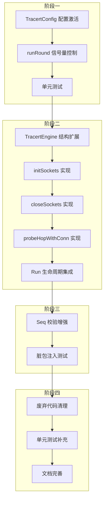

# Tracert 专用 Socket 分阶段实施方案

> **文档版本**: 1.0  
> **创建日期**: 2026-05-18  
> **基于文档**: 崩溃分析报告 + 专属 Socket 设计方案  
> **实施目标**: 解决 Tracert 崩溃问题并优化性能

---

## 一、方案概述

### 1.1 目标

本方案旨在分阶段解决 Tracert 路径探测功能的两个核心问题：

1. **生存问题（P0）**：无并发控制导致的底层 Netpoller 崩溃（ACCESS_VIOLATION）
2. **性能问题（P1）**：短连接模式导致的内核态开销过大

### 1.2 实施原则

| 原则 | 说明 |
|------|------|
| **先止血后优化** | 阶段一必须首先完成，解决崩溃问题 |
| **渐进式交付** | 每个阶段独立可测试、可验收、可回滚 |
| **架构一致性** | 与现有 `BatchPingEngine` 风格保持统一 |
| **零破坏性变更** | 公共 API 保持向后兼容 |

### 1.3 分阶段总览


| 阶段 | 优先级 | 目标 | 依赖 |
|------|--------|------|------|
| 阶段一 | 🔴 P0 | 并发控制与稳定性修复 | 无 |
| 阶段二 | 🟠 P1 | 专属 Socket 组实现 | 阶段一 |
| 阶段三 | 🟠 P1 | 脏包防护机制 | 阶段二 |
| 阶段四 | 🟢 P2 | 代码清理与优化 | 阶段三 |

---

## 二、阶段一：并发控制与稳定性修复（P0）

### 2.1 目标

**核心目标**：解决 Tracert 探测时因无并发控制导致的底层 Netpoller 崩溃问题。

**预期成果**：
- 同一时刻最多只有 N 个 Raw Socket 处于活跃状态
- 底层 Netpoller 负载可控，`sync.Pool` 不再遭遇内存踩踏
- 与 `BatchPingEngine` 架构风格统一

### 2.2 修改清单

#### 2.2.1 TracertConfig 配置激活

| 文件 | 函数/组件 | 修改类型 | 修改内容 |
|------|----------|----------|----------|
| `internal/icmp/types.go` | `TracertConfig` | 修改 | 激活 `Concurrency` 字段，添加默认值逻辑 |
| `internal/icmp/tracert_engine.go` | `NewTracertEngine()` | 修改 | 添加 Concurrency 默认值校验 |

**代码示例 - types.go 修改**：

```go
// DefaultTracertConfig 返回默认 tracert 配置
func DefaultTracertConfig() TracertConfig {
    return TracertConfig{
        MaxHops:     30,
        Timeout:     1500,
        DataSize:    32,
        Count:       1,
        Interval:    1000,
        Concurrency: 10, // 修改：默认并发数从 0 改为 10
    }
}
```

**代码示例 - tracert_engine.go 修改**：

```go
func NewTracertEngine(config TracertConfig) *TracertEngine {
    // ... 现有校验逻辑 ...
    
    // 新增：Concurrency 默认值校验
    if config.Concurrency <= 0 {
        config.Concurrency = 10 // 默认并发数
    }
    if config.Concurrency > 64 {
        config.Concurrency = 64 // 最大并发数上限
    }
    // Concurrency 不应超过 MaxHops
    if config.Concurrency > config.MaxHops {
        config.Concurrency = config.MaxHops
    }
    
    return &TracertEngine{
        config: config,
    }
}
```

#### 2.2.2 runRound() 信号量控制

| 文件 | 函数/组件 | 修改类型 | 修改内容 |
|------|----------|----------|----------|
| `internal/icmp/tracert_engine.go` | `runRound()` | 修改 | 添加信号量控制，限制并发 Goroutine 数量 |

**代码示例**：

```go
// runRound 执行单轮 tracert 探测（并发探测模式）
func (e *TracertEngine) runRound(ctx context.Context, targetIP string, progress *TracertProgress, opts TracertRunOptions) {
    ip := net.ParseIP(targetIP)
    if ip == nil {
        logger.Error("Tracert", targetIP, "无效的 IP 地址")
        return
    }

    maxHops := e.config.MaxHops
    concurrency := e.config.Concurrency

    logger.Debug("Tracert", targetIP, "开始并发 TTL 探测: maxHops=%d, concurrency=%d", maxHops, concurrency)

    // === 新增：信号量控制 ===
    sem := make(chan struct{}, concurrency)
    
    // 用于标记是否已到达目标（原子操作）
    var reachedDest int32 = 0
    var reachedTTL int32 = int32(maxHops + 1)

    // 结果通道
    resultChan := make(chan TracertHopResult, maxHops)

    // 并发控制
    var wg sync.WaitGroup

    // 启动并发探测（全量探测，不提前停止）
    for ttl := 1; ttl <= maxHops; ttl++ {
        // 检查取消（仅响应外部取消请求）
        select {
        case <-ctx.Done():
            logger.Debug("Tracert", targetIP, "检测到取消信号，停止启动新探测")
            // 发送 cancelled 结果到 channel（串行化处理）
            for t := ttl; t <= maxHops; t++ {
                resultChan <- TracertHopResult{
                    TTL:    t,
                    Status: "cancelled",
                    MinRtt: -1,
                }
            }
            break
        default:
        }

        // === 新增：获取信号量 ===
        sem <- struct{}{}

        wg.Add(1)
        go func(ttlVal int) {
            defer wg.Done()
            defer func() { <-sem }() // === 新增：释放信号量 ===

            // 检查取消（仅响应外部取消请求）
            select {
            case <-ctx.Done():
                resultChan <- TracertHopResult{
                    TTL:    ttlVal,
                    Status: "cancelled",
                    MinRtt: -1,
                }
                return
            default:
            }

            // 探测当前 TTL
            hopResult := e.probeHop(ctx, ip, ttlVal, opts)

            // 如果到达目标，记录最小 TTL（用于前端显示过滤）
            if hopResult.Reached {
                for {
                    oldReachedTTL := atomic.LoadInt32(&reachedTTL)
                    if int32(ttlVal) >= oldReachedTTL {
                        break
                    }
                    if atomic.CompareAndSwapInt32(&reachedTTL, oldReachedTTL, int32(ttlVal)) {
                        atomic.StoreInt32(&reachedDest, 1)
                        logger.Debug("Tracert", targetIP, "TTL=%d 到达目标（记录最小 TTL，之前=%d）", ttlVal, oldReachedTTL)
                        break
                    }
                }
            }

            resultChan <- hopResult
        }(ttl)
    }

    // ... 后续结果收集逻辑保持不变 ...
}
```

#### 2.2.3 日志输出增强

| 文件 | 函数/组件 | 修改类型 | 修改内容 |
|------|----------|----------|----------|
| `internal/icmp/tracert_engine.go` | `Run()` | 修改 | 日志中输出实际并发数 |

**代码示例**：

```go
func (e *TracertEngine) Run(ctx context.Context, target string, opts TracertRunOptions) *TracertProgress {
    logger.Info("Tracert", target, "路径探测开始: maxHops=%d, count=%d, timeout=%dms, interval=%dms, concurrency=%d",
        e.config.MaxHops, e.config.Count, e.config.Timeout, e.config.Interval, e.config.Concurrency)
    // ... 其余逻辑不变 ...
}
```

### 2.3 测试验证

#### 2.3.1 单元测试

| 测试用例 | 验证内容 |
|----------|----------|
| `TestTracertConcurrencyLimit` | 验证并发数不超过配置值 |
| `TestTracertConcurrencyDefault` | 验证默认并发数为 10 |
| `TestTracertConcurrencyZero` | 验证 Concurrency=0 时使用默认值 |
| `TestTracertConcurrencyExceedMaxHops` | 验证并发数不超过 MaxHops |

**测试代码示例**：

```go
func TestTracertConcurrencyLimit(t *testing.T) {
    config := TracertConfig{
        MaxHops:     30,
        Timeout:     1000,
        Concurrency: 5,
    }
    engine := NewTracertEngine(config)
    
    // 验证并发数配置正确
    if engine.config.Concurrency != 5 {
        t.Errorf("expected concurrency 5, got %d", engine.config.Concurrency)
    }
}

func TestTracertConcurrencyDefault(t *testing.T) {
    config := TracertConfig{
        MaxHops: 30,
        // Concurrency 未设置，应使用默认值
    }
    engine := NewTracertEngine(config)
    
    if engine.config.Concurrency != 10 {
        t.Errorf("expected default concurrency 10, got %d", engine.config.Concurrency)
    }
}
```

#### 2.3.2 集成测试

| 测试场景 | 验证方法 |
|----------|----------|
| 正常探测 | 执行 Tracert 8.8.8.8，验证无崩溃 |
| 高并发压力 | MaxHops=255，验证信号量控制生效 |
| 取消操作 | 探测中途取消，验证资源正确释放 |

#### 2.3.3 手动验证

```powershell
# 1. 构建项目
go build -o netweaver.exe ./cmd/netweaver

# 2. 执行 Tracert 探测（之前会崩溃的场景）
# 启动应用后，在 UI 中执行 Tracert 8.8.8.8

# 3. 验证日志输出
# 检查日志中是否输出 concurrency=10（或配置值）
```

### 2.4 预期交付物

| 交付物 | 文件路径 |
|--------|----------|
| 修改后的类型定义 | `internal/icmp/types.go` |
| 修改后的引擎实现 | `internal/icmp/tracert_engine.go` |
| 单元测试文件 | `internal/icmp/tracert_engine_test.go`（新增） |

---

## 三、阶段二：专属 Socket 组实现（P1）

### 3.1 目标

**核心目标**：实现 TTL-Dedicated Sockets 架构，减少内核态 Socket 创建/销毁开销。

**预期成果**：
- 任务启动时批量创建 MaxHops 个专属 Socket
- 每个 Socket 的 TTL 固化，不再动态修改
- 任务结束时批量销毁，零动态分配

### 3.2 新增组件

#### 3.2.1 TracertEngine 结构扩展

| 文件 | 组件 | 说明 |
|------|------|------|
| `internal/icmp/tracert_engine.go` | `sockets []*icmp.PacketConn` | 专属 Socket 组，索引为 TTL |
| `internal/icmp/tracert_engine.go` | `socketsMu sync.RWMutex` | Socket 组读写锁 |

**代码示例**：

```go
// TracertEngine tracert 路径探测引擎
type TracertEngine struct {
    config    TracertConfig
    cancel    context.CancelFunc
    running   bool
    runningMu sync.RWMutex
    
    // 新增：专属 Socket 组
    sockets   []*icmp.PacketConn // 索引为 TTL，大小为 maxHops + 1（0 号元素不用）
    socketsMu sync.RWMutex       // 保护 sockets 的并发访问
}
```

#### 3.2.2 initSockets() 初始化函数

**代码示例**：

```go
// initSockets 初始化专属 Socket 组
// 在任务开始时调用，创建 maxHops 个 Raw Socket 并固化 TTL
func (e *TracertEngine) initSockets() error {
    e.socketsMu.Lock()
    defer e.socketsMu.Unlock()
    
    // 防止重复初始化
    if e.sockets != nil {
        return nil
    }
    
    maxHops := e.config.MaxHops
    e.sockets = make([]*icmp.PacketConn, maxHops+1) // 索引 0 不使用
    
    for ttl := 1; ttl <= maxHops; ttl++ {
        conn, err := icmp.ListenPacket("ip4:icmp", "0.0.0.0")
        if err != nil {
            // 创建失败，回滚已创建的 Socket
            e.closeSocketsInternal()
            return fmt.Errorf("创建 TTL=%d 的 Socket 失败（需要管理员权限）: %w", ttl, err)
        }
        
        // 提前固化 TTL
        pconn := conn.IPv4PacketConn()
        if err := pconn.SetTTL(ttl); err != nil {
            e.closeSocketsInternal()
            return fmt.Errorf("设置 TTL=%d 失败: %w", ttl, err)
        }
        
        e.sockets[ttl] = conn
        logger.Verbose("Tracert", "-", "Socket 初始化: TTL=%d", ttl)
    }
    
    logger.Info("Tracert", "-", "专属 Socket 组初始化完成: 共 %d 个", maxHops)
    return nil
}
```

#### 3.2.3 closeSockets() 销毁函数

**代码示例**：

```go
// closeSockets 关闭所有专属 Socket
// 在任务结束时调用，批量销毁所有 Socket
func (e *TracertEngine) closeSockets() {
    e.socketsMu.Lock()
    defer e.socketsMu.Unlock()
    e.closeSocketsInternal()
}

// closeSocketsInternal 内部销毁函数（调用前已持有锁）
func (e *TracertEngine) closeSocketsInternal() {
    if e.sockets == nil {
        return
    }
    
    closedCount := 0
    for ttl := 1; ttl < len(e.sockets); ttl++ {
        if e.sockets[ttl] != nil {
            e.sockets[ttl].Close()
            e.sockets[ttl] = nil
            closedCount++
        }
    }
    
    e.sockets = nil
    logger.Info("Tracert", "-", "专属 Socket 组已关闭: 共 %d 个", closedCount)
}
```

#### 3.2.4 probeHopWithConn() 探测函数

**代码示例**：

```go
// probeHopWithConn 使用专属 Socket 探测单跳
// 与 probeHop 的区别：复用已存在的连接，不创建新 Socket
func (e *TracertEngine) probeHopWithConn(ctx context.Context, destIP net.IP, ttl int, seq int, opts TracertRunOptions) TracertHopResult {
    ipStr := destIP.String()
    logger.Verbose("Tracert", ipStr, "开始探测 TTL=%d (专属Socket, seq=%d)", ttl, seq)

    hop := TracertHopResult{
        TTL:    ttl,
        Status: "pending",
        MinRtt: -1,
    }

    // 检查取消
    select {
    case <-ctx.Done():
        logger.Debug("Tracert", ipStr, "TTL=%d 探测被取消", ttl)
        hop.Status = "error"
        hop.ErrorMsg = "Cancelled"
        return hop
    default:
    }

    // 获取专属 Socket
    e.socketsMu.RLock()
    conn := e.sockets[ttl]
    e.socketsMu.RUnlock()

    if conn == nil {
        hop.Status = "error"
        hop.ErrorMsg = "Socket 未初始化"
        return hop
    }

    // 构建 ICMP Echo Request
    msg := icmp.Message{
        Type: ipv4.ICMPTypeEcho,
        Code: 0,
        Body: &icmp.Echo{
            ID:   icmpID(),
            Seq:  seq,
            Data: prepareSendDataRaw(e.config.DataSize),
        },
    }
    
    wb, err := msg.Marshal(nil)
    if err != nil {
        hop.Status = "error"
        hop.ErrorMsg = fmt.Sprintf("序列化失败: %v", err)
        return hop
    }

    dst := &net.IPAddr{IP: destIP}
    sendTime := time.Now()

    // 发送
    if _, err := conn.WriteTo(wb, dst); err != nil {
        hop.Status = "error"
        hop.ErrorMsg = fmt.Sprintf("发送失败: %v", err)
        return hop
    }

    // 设置读取超时
    deadline := sendTime.Add(time.Duration(e.config.Timeout) * time.Millisecond)
    conn.SetReadDeadline(deadline)

    // 接收响应
    rb := make([]byte, maxMessageSize)
    for {
        n, peer, err := conn.ReadFrom(rb)
        if err != nil {
            if netErr, ok := err.(net.Error); ok && netErr.Timeout() {
                hop.Status = "timeout"
                hop.IP = "*"
                return hop
            }
            hop.Status = "error"
            hop.ErrorMsg = err.Error()
            return hop
        }

        rm, err := icmp.ParseMessage(protocolICMP, rb[:n])
        if err != nil {
            continue
        }

        switch rm.Type {
        case ipv4.ICMPTypeEchoReply:
            reply, ok := rm.Body.(*icmp.Echo)
            if !ok || reply.ID != icmpID() || reply.Seq != seq {
                continue // 脏包，继续读取
            }
            rtt := time.Since(sendTime).Milliseconds()
            replyIP := extractIP(peer)
            
            hop.RecvCount = 1
            hop.LossRate = 0
            hop.LastRtt = float64(rtt)
            hop.AvgRtt = float64(rtt)
            hop.MinRtt = float64(rtt)
            hop.MaxRtt = float64(rtt)
            hop.IP = replyIP
            hop.Status = "success"
            
            if replyIP == ipStr {
                hop.Reached = true
            }
            return hop

        case ipv4.ICMPTypeTimeExceeded:
            if !matchTimeExceeded(rm, icmpID(), seq) {
                continue // 脏包
            }
            rtt := time.Since(sendTime).Milliseconds()
            replyIP := extractIP(peer)
            
            hop.RecvCount = 1
            hop.LossRate = 0
            hop.LastRtt = float64(rtt)
            hop.AvgRtt = float64(rtt)
            hop.MinRtt = float64(rtt)
            hop.MaxRtt = float64(rtt)
            hop.IP = replyIP
            hop.Status = "success"
            return hop

        case ipv4.ICMPTypeDestinationUnreachable:
            if !matchDestUnreachable(rm, icmpID(), seq) {
                continue
            }
            hop.Status = "error"
            hop.IP = "*"
            hop.ErrorMsg = "Destination Unreachable"
            return hop

        default:
            continue
        }
    }
}
```

### 3.3 修改清单

#### 3.3.1 Run() 生命周期集成

| 文件 | 函数/组件 | 修改类型 | 修改内容 |
|------|----------|----------|----------|
| `internal/icmp/tracert_engine.go` | `Run()` | 修改 | 在探测循环前调用 `initSockets()`，结束后调用 `closeSockets()` |

**代码示例**：

```go
func (e *TracertEngine) Run(ctx context.Context, target string, opts TracertRunOptions) *TracertProgress {
    // ... DNS 解析等前置逻辑 ...

    progress := NewTracertProgress(target, e.config.MaxHops)
    progress.ResolvedIP = resolvedIP

    // === 新增：初始化专属 Socket 组 ===
    if err := e.initSockets(); err != nil {
        logger.Error("Tracert", target, "Socket 初始化失败: %v", err)
        progress.IsRunning = false
        progress.ErrorMsg = err.Error()
        return progress
    }
    
    // === 新增：确保任务结束时关闭所有 Socket ===
    defer e.closeSockets()

    // 统一清理逻辑
    defer func() {
        // ... 现有清理逻辑 ...
    }()

    // ... 执行多轮探测的 for 循环 ...
}
```

#### 3.3.2 runRound() 切换到专属 Socket

| 文件 | 函数/组件 | 修改类型 | 修改内容 |
|------|----------|----------|----------|
| `internal/icmp/tracert_engine.go` | `runRound()` | 修改 | 使用 `probeHopWithConn()` 替代 `probeHop()` |

**代码示例**：

```go
// 在 runRound 的 goroutine 中：
go func(ttlVal int) {
    defer wg.Done()
    defer func() { <-sem }()

    // === 修改：使用专属 Socket 探测 ===
    seq := nextSeq() // 全局递增序列号
    hopResult := e.probeHopWithConn(ctx, ip, ttlVal, seq, opts)
    
    // ... 后续逻辑不变 ...
}(ttl)
```

### 3.4 测试验证

#### 3.4.1 单元测试

| 测试用例 | 验证内容 |
|----------|----------|
| `TestInitSockets` | 验证 Socket 组正确初始化 |
| `TestInitSocketsFailure` | 验证初始化失败时的回滚 |
| `TestCloseSockets` | 验证 Socket 组正确关闭 |
| `TestProbeHopWithConn` | 验证使用专属 Socket 的探测逻辑 |

#### 3.4.2 集成测试

| 测试场景 | 验证方法 |
|----------|----------|
| 多轮探测 | 执行 Count=3 的探测，验证 Socket 复用 |
| 取消操作 | 探测中途取消，验证 Socket 正确关闭 |
| 并发任务 | 同时启动多个 Tracert 任务，验证独立性 |

#### 3.4.3 性能测试

```powershell
# 对比测试：短连接 vs 专属 Socket
# 1. 测量 CPU 使用率
# 2. 测量内存分配次数
# 3. 测量探测耗时
```

### 3.5 预期交付物

| 交付物 | 文件路径 |
|--------|----------|
| 修改后的引擎实现 | `internal/icmp/tracert_engine.go` |
| 单元测试补充 | `internal/icmp/tracert_engine_test.go` |

---

## 四、阶段三：脏包防护机制（P1）

### 4.1 目标

**核心目标**：防止跨轮次的"幽灵报文"污染探测结果。

**预期成果**：
- 每个探测包使用全局唯一序列号
- 严格的 Seq 校验逻辑
- TimeExceeded 报文的内嵌原始包校验

### 4.2 Seq 校验增强

#### 4.2.1 全局序列号生成器

**现有实现**：[`icmp_raw.go:26-30`](internal/icmp/icmp_raw.go:26) 已有 `globalSeq` 和 `nextSeq()`。

**增强内容**：确保每轮探测使用唯一序列号。

```go
// icmp_raw.go 中已有的实现
var globalSeq atomic.Uint32

func nextSeq() int {
    return int(globalSeq.Add(1))
}
```

#### 4.2.2 探测序列号传递

| 文件 | 函数/组件 | 修改类型 | 修改内容 |
|------|----------|----------|----------|
| `internal/icmp/tracert_engine.go` | `runRound()` | 修改 | 在调用探测前生成唯一 Seq |
| `internal/icmp/tracert_engine.go` | `probeHopWithConn()` | 修改 | 接收 seq 参数并用于校验 |

**代码示例**（已在阶段二实现）：

```go
// runRound 中
seq := nextSeq() // 每次探测生成唯一序列号
hopResult := e.probeHopWithConn(ctx, ip, ttlVal, seq, opts)
```

#### 4.2.3 TimeExceeded 校验增强

**现有实现**：[`icmp_raw.go:206-217`](internal/icmp/icmp_raw.go:206) 已有 `matchTimeExceeded()`。

**增强内容**：确保在 `probeHopWithConn()` 中正确调用。

```go
// probeHopWithConn 中的校验逻辑
case ipv4.ICMPTypeTimeExceeded:
    if !matchTimeExceeded(rm, icmpID(), seq) {
        continue // 脏包，继续读取
    }
    // ... 处理有效响应 ...
```

### 4.3 修改清单

| 文件 | 函数/组件 | 修改类型 | 修改内容 |
|------|----------|----------|----------|
| `internal/icmp/tracert_engine.go` | `runRound()` | 修改 | 生成并传递唯一 Seq |
| `internal/icmp/tracert_engine.go` | `probeHopWithConn()` | 修改 | 接收 seq 参数，严格校验 |
| `internal/icmp/icmp_raw.go` | `matchTimeExceeded()` | 验证 | 确认校验逻辑正确 |
| `internal/icmp/icmp_raw.go` | `matchDestUnreachable()` | 验证 | 确认校验逻辑正确 |

### 4.4 测试验证

#### 4.4.1 脏包注入测试

| 测试场景 | 验证方法 |
|----------|----------|
| 延迟响应 | 使用网络损伤工具注入延迟，验证旧包被丢弃 |
| 序列号冲突 | 模拟相同 ID 不同 Seq 的响应，验证被过滤 |
| ID 冲突 | 模拟不同进程的响应，验证被过滤 |

#### 4.4.2 边界条件测试

```go
func TestSeqValidation(t *testing.T) {
    // 测试序列号回绕
    // 测试最大序列号
    // 测试序列号为 0 的情况
}
```

### 4.5 预期交付物

| 交付物 | 文件路径 |
|--------|----------|
| 增强后的探测逻辑 | `internal/icmp/tracert_engine.go` |
| 校验函数测试 | `internal/icmp/icmp_raw_test.go` |

---

## 五、阶段四：代码清理与优化（P2）

### 5.1 目标

**核心目标**：清理废弃代码，补充单元测试，优化代码结构。

**预期成果**：
- 移除不再使用的短连接探测逻辑
- 补充完整的单元测试覆盖
- 代码注释和文档完善

### 5.2 废弃代码清理

| 文件 | 组件 | 操作 | 说明 |
|------|------|------|------|
| `internal/icmp/tracert_engine.go` | `probeHop()` | 评估 | 如果不再使用，标记废弃或移除 |
| `internal/icmp/icmp_raw.go` | `pingOneRaw()` | 保留 | BatchPing 仍在使用 |

**决策**：`probeHop()` 可保留作为备用实现，添加注释说明。

```go
// probeHop 探测单跳：发送 1 个 ICMP 包并返回结果
// 注意：此方法使用短连接模式，每次探测创建新 Socket
// 推荐使用 probeHopWithConn() 以获得更好的性能
// Deprecated: 使用 probeHopWithConn() 替代
func (e *TracertEngine) probeHop(ctx context.Context, destIP net.IP, ttl int, opts TracertRunOptions) TracertHopResult {
    // ... 现有实现 ...
}
```

### 5.3 单元测试补充

| 测试文件 | 测试内容 |
|----------|----------|
| `tracert_engine_test.go` | 引擎生命周期测试 |
| `tracert_socket_test.go` | Socket 组管理测试 |
| `tracert_seq_test.go` | 序列号校验测试 |

### 5.4 预期交付物

| 交付物 | 文件路径 |
|--------|----------|
| 清理后的引擎代码 | `internal/icmp/tracert_engine.go` |
| 完整的单元测试 | `internal/icmp/tracert_engine_test.go` |
| 更新的文档 | `docs/tracert_implementation_plan.md` |

---

## 六、实施时间线

### 6.1 各阶段预估工时

| 阶段 | 内容 | 预估工时 | 依赖 |
|------|------|----------|------|
| 阶段一 | 并发控制与稳定性修复 | 中等 | 无 |
| 阶段二 | 专属 Socket 组实现 | 中等 | 阶段一 |
| 阶段三 | 脏包防护机制 | 较低 | 阶段二 |
| 阶段四 | 代码清理与优化 | 较低 | 阶段三 |

### 6.2 依赖关系图



---

## 七、风险与缓解措施

### 7.1 技术风险

| 风险 | 影响 | 概率 | 缓解措施 |
|------|------|------|----------|
| Socket 创建失败（权限不足） | 高 | 中 | 友好错误提示，引导用户提权 |
| Socket 创建失败（资源枯竭） | 高 | 低 | 部分失败回滚机制 |
| 脏包导致结果错误 | 中 | 中 | 严格 Seq 校验 |
| 内存泄漏 | 高 | 低 | defer 确保 Close 执行 |

### 7.2 兼容性风险

| 风险 | 影响 | 概率 | 缓解措施 |
|------|------|------|----------|
| Windows 防火墙拦截 | 中 | 中 | 文档说明，引导用户配置 |
| 跨平台差异 | 中 | 低 | 平台编译标签隔离 |
| Go 版本兼容性 | 低 | 低 | 使用标准库 API |

### 7.3 回滚策略

| 阶段 | 回滚方案 |
|------|----------|
| 阶段一 | 移除信号量控制，恢复全量并发（不推荐，会恢复崩溃） |
| 阶段二 | 切换回 `probeHop()` 短连接模式 |
| 阶段三 | 无需回滚，仅增强校验 |
| 阶段四 | Git revert 清理提交 |

**回滚代码示例**：

```go
// 在 runRound 中添加开关
const useDedicatedSockets = false // 设为 false 回滚到短连接模式

if useDedicatedSockets {
    hopResult := e.probeHopWithConn(ctx, ip, ttlVal, seq, opts)
} else {
    hopResult := e.probeHop(ctx, ip, ttlVal, opts)
}
```

---

## 八、验收标准

### 8.1 功能验收

| 验收项 | 验收标准 | 验证方法 |
|--------|----------|----------|
| 基本探测 | Tracert 8.8.8.8 正常完成 | 手动测试 |
| 多轮探测 | Count=3 时正确累积结果 | 自动化测试 |
| 取消操作 | 取消后资源正确释放 | 手动测试 |
| 错误处理 | 权限不足时友好提示 | 手动测试 |

### 8.2 性能验收

| 验收项 | 验收标准 | 验证方法 |
|--------|----------|----------|
| CPU 使用率 | 探测期间 CPU < 30% | 任务管理器 |
| 内存稳定 | 内存不持续增长 | 内存分析工具 |
| 响应时间 | 单跳探测耗时符合预期 | 日志分析 |

### 8.3 稳定性验收

| 验收项 | 验收标准 | 验证方法 |
|--------|----------|----------|
| 无崩溃 | 连续探测 100 次无崩溃 | 自动化测试 |
| 无内存泄漏 | 探测结束后内存释放 | 内存分析工具 |
| 无竞态条件 | go race detector 无警告 | `go test -race` |

---

## 附录

### A. 相关代码文件

| 文件 | 说明 |
|------|------|
| [`internal/icmp/tracert_engine.go`](internal/icmp/tracert_engine.go) | Tracert 探测引擎 |
| [`internal/icmp/types.go`](internal/icmp/types.go) | 类型定义 |
| [`internal/icmp/icmp_raw.go`](internal/icmp/icmp_raw.go) | ICMP 原始套接字操作 |
| [`internal/ui/tracert_service.go`](internal/ui/tracert_service.go) | Tracert UI 服务 |

### B. 参考资料

- [Go Concurrency Patterns: Context](https://go.dev/blog/context)
- [golang.org/x/net/icmp Package](https://pkg.go.dev/golang.org/x/net/icmp)
- [Windows Raw Socket Requirements](https://docs.microsoft.com/en-us/windows/win32/winsock/raw-sockets-2)

---

> **文档结束**  
> 如有问题或需要进一步讨论，请联系开发团队。
