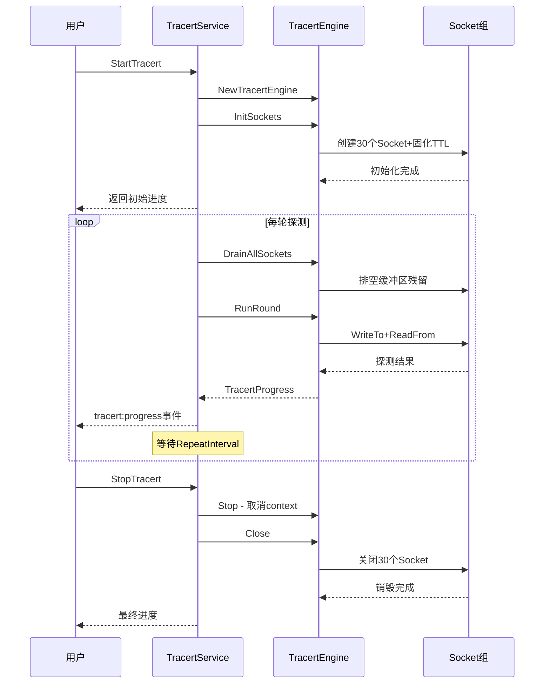

# Tracert Socket 持久化改造 — 可行性评估与设计方案

> 文档版本：v1.0  
> 创建日期：2026-05-19  
> 状态：待评审

---

## 目录

1. [现状分析](#1-现状分析)
2. [可行性评估](#2-可行性评估)
3. [改造方案设计](#3-改造方案设计)
4. [风险评估与缓解措施](#4-风险评估与缓解措施)
5. [实施步骤](#5-实施步骤)
6. [验收标准](#6-验收标准)

---

## 1. 现状分析

### 1.1 当前 Socket 生命周期

当前 `TracertEngine` 的专属 Socket 组生命周期严格绑定在 `Run()` 方法内部：

```
Run() 开始
  ├── initSockets(maxHops)     // 创建 30 个 Raw Socket，各自固化 TTL
  ├── defer closeSockets()     // Run() 退出时销毁全部 Socket
  ├── for round := 1; round <= Count; round++ {
  │     └── runRound()         // 使用 Socket 组并发探测
  │           └── probeHopWithConn()  // 单 Socket 读写
  │                 ├── conn.WriteTo()    // 发送 ICMP Echo
  │                 ├── conn.SetReadDeadline()
  │                 └── conn.ReadFrom()   // 读取响应（含脏包过滤）
  │   }
  └── return progress          // defer closeSockets() 执行
```

**关键代码位置：**

| 功能 | 文件 | 行号 | 说明 |
|------|------|------|------|
| `initSockets()` | [`tracert_engine.go`](internal/icmp/tracert_engine.go:89) | 89-132 | 创建 Socket 组并固化 TTL |
| `closeSockets()` | [`tracert_engine.go`](internal/icmp/tracert_engine.go:135) | 135-154 | 销毁 Socket 组 |
| `Run()` 中的生命周期 | [`tracert_engine.go`](internal/icmp/tracert_engine.go:471) | 471-486 | `initSockets()` + `defer closeSockets()` |
| `probeHopWithConn()` | [`tracert_engine.go`](internal/icmp/tracert_engine.go:176) | 176-427 | Socket 读写逻辑 |
| `runContinuous()` | [`tracert_service.go`](internal/ui/tracert_service.go:440) | 440-623 | 持续模式循环调用 `engine.Run()` |

### 1.2 持续模式下的 Socket 重建问题

在持续探测模式中，`TracertService.runContinuous()` 通过循环调用 `s.engine.Run()` 实现多轮探测：

```go
// tracert_service.go:451-487
for {
    round++
    roundProgress := s.engine.Run(ctx, target, opts)  // 每轮都重建 Socket
    // ...
}
```

每轮 `Run()` 调用都会执行完整的 Socket 生命周期：

```
第1轮: initSockets(30) → 探测 → closeSockets(30)
第2轮: initSockets(30) → 探测 → closeSockets(30)
第3轮: initSockets(30) → 探测 → closeSockets(30)
...
```

**每轮探测的 Socket 开销：**

| 操作 | 次数 | 单次开销 | 说明 |
|------|------|----------|------|
| `icmp.ListenPacket()` | 30 | ~1-5ms | 系统调用创建 Raw Socket |
| `pconn.SetTTL()` | 30 | ~0.1ms | 设置 IP_TTL 选项 |
| `conn.Close()` | 30 | ~0.5-2ms | 系统调用关闭 Socket |
| **合计** | — | **~50-200ms** | 每轮额外开销 |

以默认 `MaxHops=30` 计算，每轮探测额外消耗 50-200ms 在 Socket 创建/销毁上。当 `RepeatInterval=1000ms` 时，这意味着 5%-20% 的时间浪费在 Socket 管理上。

### 1.3 当前设计的其他问题

1. **资源抖动**：30 个 Socket 的批量创建/销毁造成系统资源（文件描述符、内核缓冲区）周期性抖动
2. **启动延迟**：每轮探测开始前需等待 30 个 Socket 全部创建完成，增加了首包延迟
3. **Windows 特有开销**：Windows 上 Raw Socket 创建涉及 `SIO_RCVALL` 设置，开销比 Linux 更大

---

## 2. 可行性评估

### 2.1 技术可行性

#### 2.1.1 TTL 固化后是否可复用？

**结论：✅ 完全可行**

当前设计中，每个 Socket 在创建时通过 `pconn.SetTTL(ttl)` 固化 TTL 值，且此后不再修改。这意味着：

- Socket[TTL=1] 永远发送 TTL=1 的包
- Socket[TTL=2] 永远发送 TTL=2 的包
- ...

多轮探测中，同一 TTL 的探测需求完全一致，Socket 的 TTL 属性无需任何变更，天然支持跨轮次复用。

#### 2.1.2 读取缓冲区是否会积累脏数据？

**结论：✅ 可控，已有防护机制**

分析 `probeHopWithConn()` 的读取逻辑：

```go
// tracert_engine.go:262-263
deadline := sendTime.Add(time.Duration(e.config.Timeout) * time.Millisecond)
conn.SetReadDeadline(deadline)
```

每次探测前都会重新设置 `ReadDeadline`，超时后 `ReadFrom()` 返回超时错误，不会残留数据到下一轮。

**潜在风险**：在两轮探测间隔期间（`RepeatInterval`），可能有迟到的 ICMP 响应到达 Socket 缓冲区。但当前已有完善的脏包过滤机制：

1. **ICMP Echo ID 过滤**：`reply.ID != echoID`（基于 PID，跨轮次稳定）
2. **Seq 过滤**：`reply.Seq != seq`（全局原子递增，跨轮次唯一）
3. **TimeExceeded 内嵌报文校验**：`matchTimeExceeded(rm, echoID, seq)`

因此，即使缓冲区中残留上一轮的迟到响应，也会被脏包过滤逻辑正确丢弃。

**额外保障措施**：在每轮探测开始前，可主动排空 Socket 缓冲区中的残留数据（见 3.3 节）。

#### 2.1.3 并发安全：多轮探测间 Socket 状态是否需要重置？

**结论：✅ 无需重置，天然安全**

分析 Socket 在 `probeHopWithConn()` 中的使用方式：

| 操作 | 是否修改 Socket 状态 | 跨轮次影响 |
|------|---------------------|-----------|
| `conn.WriteTo(wb, dst)` | 无状态修改 | 无 |
| `conn.SetReadDeadline()` | 修改读取截止时间 | 每次探测前重新设置，无影响 |
| `conn.ReadFrom(rb)` | 无状态修改（消耗缓冲区数据） | 无 |

Socket 的核心状态（TTL、绑定地址）在创建后不再变化，读写操作是无状态的。`ReadDeadline` 虽然是状态性的，但每次探测前都会重新设置。

#### 2.1.4 Windows 平台 Raw Socket 长期持有的可行性

**结论：✅ 可行，需注意边界情况**

Windows 上 Raw Socket 的行为特点：

1. **Socket 有效性**：Raw Socket 在创建后保持有效，除非网络子系统发生重大变化（如适配器禁用/启用）
2. **管理员权限**：Raw Socket 需要管理员权限创建，创建后权限不变
3. **缓冲区行为**：Windows ICMP Socket 的接收缓冲区由内核管理，应用层通过 `ReadFrom` 消费

**潜在问题**：网络适配器变化（如 VPN 连接/断开、网卡禁用）可能导致 Socket 失效。需要错误检测和恢复机制（见 4.2 节）。

### 2.2 合理性分析

#### 2.2.1 性能收益

| 指标 | 改造前（每轮重建） | 改造后（持久化） | 收益 |
|------|-------------------|-----------------|------|
| Socket 创建时间 | ~50-200ms/轮 | 仅首次 | 每轮节省 50-200ms |
| 系统调用次数 | 90次/轮（30创建+30设置+30关闭） | 60次/会话 | 大幅减少 |
| 资源抖动 | 周期性 | 平稳 | 系统更稳定 |
| 首包延迟 | 增加 50-200ms | 无额外延迟 | 探测更及时 |

**量化估算**（默认配置 MaxHops=30, RepeatInterval=1000ms）：

- 每轮节省 ~100ms（取中间值）
- 每小时 3600 轮，节省 ~360s = 6 分钟的 CPU/系统调用开销
- 这 6 分钟完全可用于更有意义的工作或降低系统负载

#### 2.2.2 资源占用

| 资源 | 每个 Socket | 30 个 Socket | 说明 |
|------|------------|-------------|------|
| 文件描述符 | 1 | 30 | Windows 上为 HANDLE |
| 内核接收缓冲区 | ~8KB（默认） | ~240KB | 可忽略 |
| 用户态内存 | ~0 | ~0 | 按需分配 |

**结论**：30 个 Raw Socket 的资源占用极小（<1MB），长时间持有对系统几乎无影响。

#### 2.2.3 与 BatchPingEngine 的风格一致性

当前 `BatchPingEngine` 使用 Windows IcmpSendEcho API（通过 `icmpBackend` 接口），不涉及 Raw Socket 持久化问题。但 `TracertEngine` 使用专属 Socket 组的设计已经是独立的架构决策，持久化改造不会引入风格不一致。

相反，持久化 Socket 使 `TracertEngine` 的生命周期更接近"会话级资源"的模式，与 `TracertService` 的会话管理更匹配。

---

## 3. 改造方案设计

### 3.1 架构变更概览


### 3.2 TracertEngine API 变更

#### 3.2.1 新增方法

```go
// InitSockets 初始化专属 Socket 组（会话级别）
// 在 StartTracert 时调用一次，Socket 在整个会话期间保持
func (e *TracertEngine) InitSockets() error

// Close 销毁专属 Socket 组并清理资源（会话级别）
// 在 StopTracert 时调用一次
func (e *TracertEngine) Close()

// RunRound 执行单轮 tracert 探测
// 替代原来的 Run()，不再管理 Socket 生命周期
func (e *TracertEngine) RunRound(ctx context.Context, targetIP string, opts TracertRunOptions) *TracertProgress
```

#### 3.2.2 废弃方法

```go
// Run() 方法废弃，其职责被拆分为：
// - InitSockets()：Socket 初始化（从 Run 中提取）
// - RunRound()：单轮探测（原 Run 的核心逻辑）
// - Close()：Socket 销毁（从 Run 的 defer 中提取）
```

#### 3.2.3 方法签名详细设计

**`InitSockets()`**：

```go
// InitSockets 初始化专属 Socket 组
// 幂等操作：重复调用返回 nil（Socket 已存在）
// 返回 error：Socket 创建失败（需管理员权限等）
func (e *TracertEngine) InitSockets() error {
    e.socketsMu.Lock()
    defer e.socketsMu.Unlock()

    if e.sockets != nil {
        return nil // 已初始化，幂等
    }

    maxHops := e.config.MaxHops
    e.sockets = make([]*icmp.PacketConn, maxHops)

    for ttl := 1; ttl <= maxHops; ttl++ {
        conn, err := icmp.ListenPacket("ip4:icmp", "0.0.0.0")
        if err != nil {
            // 回滚已创建的 Socket
            for i := 0; i < ttl-1; i++ {
                if e.sockets[i] != nil {
                    e.sockets[i].Close()
                }
            }
            e.sockets = nil
            return fmt.Errorf("创建 TTL=%d 的 Socket 失败: %w", ttl, err)
        }

        pconn := conn.IPv4PacketConn()
        if err := pconn.SetTTL(ttl); err != nil {
            conn.Close()
            for i := 0; i < ttl-1; i++ {
                if e.sockets[i] != nil {
                    e.sockets[i].Close()
                }
            }
            e.sockets = nil
            return fmt.Errorf("设置 TTL=%d 失败: %w", ttl, err)
        }

        e.sockets[ttl-1] = conn
    }

    logger.Info("Tracert", "-", "专属 Socket 组初始化完成: %d 个 Socket", maxHops)
    return nil
}
```

**`Close()`**：

```go
// Close 销毁专属 Socket 组并清理资源
// 幂等操作：重复调用无副作用
func (e *TracertEngine) Close() {
    e.socketsMu.Lock()
    defer e.socketsMu.Unlock()

    if e.sockets == nil {
        return
    }

    closedCount := 0
    for i, conn := range e.sockets {
        if conn != nil {
            conn.Close()
            e.sockets[i] = nil
            closedCount++
        }
    }
    e.sockets = nil

    logger.Info("Tracert", "-", "专属 Socket 组已关闭: %d 个 Socket", closedCount)
}
```

**`RunRound()`**：

```go
// RunRound 执行单轮 tracert 探测
// 前置条件：InitSockets() 已成功调用
// 不管理 Socket 生命周期，仅执行探测逻辑
func (e *TracertEngine) RunRound(ctx context.Context, targetIP string, opts TracertRunOptions) *TracertProgress {
    // 检查 Socket 是否已初始化
    if !e.socketsInitialized() {
        progress := NewTracertProgress(targetIP, e.config.MaxHops)
        progress.IsRunning = false
        progress.Error = "Socket 未初始化，请先调用 InitSockets()"
        return progress
    }

    progress := NewTracertProgress(targetIP, e.config.MaxHops)
    progress.ResolvedIP = targetIP

    // 执行单轮探测（复用现有 runRound 逻辑）
    e.runRound(ctx, targetIP, progress, opts)

    // 后处理（复用现有逻辑）
    // ... 标记 cancelled/timeout 状态等

    return progress
}
```

#### 3.2.4 辅助方法

```go
// socketsInitialized 检查 Socket 组是否已初始化
func (e *TracertEngine) socketsInitialized() bool {
    e.socketsMu.RLock()
    defer e.socketsMu.RUnlock()
    return e.sockets != nil
}

// drainSocket 排空 Socket 缓冲区中的残留数据
// 在每轮探测开始前调用，防止脏数据干扰
func (e *TracertEngine) drainSocket(conn *icmp.PacketConn) {
    // 设置极短超时，非阻塞读取
    conn.SetReadDeadline(time.Now().Add(1 * time.Millisecond))
    buf := make([]byte, maxMessageSize)
    for {
        _, _, err := conn.ReadFrom(buf)
        if err != nil {
            break // 超时或错误，缓冲区已空
        }
    }
    // 重置 deadline
    conn.SetReadDeadline(time.Time{})
}

// drainAllSockets 排空所有 Socket 缓冲区
func (e *TracertEngine) drainAllSockets() {
    e.socketsMu.RLock()
    defer e.socketsMu.RUnlock()

    if e.sockets == nil {
        return
    }
    for _, conn := range e.sockets {
        if conn != nil {
            e.drainSocket(conn)
        }
    }
}
```

### 3.3 TracertService 生命周期调整

#### 3.3.1 StartTracert 变更

```go
func (s *TracertService) StartTracert(req TracertRequest) (*icmp.TracertProgress, error) {
    // ... 现有验证逻辑不变 ...

    s.engineMu.Lock()
    if s.isRunningLocked() {
        s.engineMu.Unlock()
        return nil, fmt.Errorf("路径探测正在运行中，请先停止当前任务")
    }

    // 创建引擎
    s.engine = icmp.NewTracertEngine(config)

    // ★ 新增：会话级 Socket 初始化
    if err := s.engine.InitSockets(); err != nil {
        s.engine = nil
        s.engineMu.Unlock()
        return nil, fmt.Errorf("Socket 初始化失败: %v", err)
    }

    // 初始化进度
    initialProgress := icmp.NewTracertProgress(target, config.MaxHops)
    initialProgress.IsContinuous = req.Continuous
    s.setProgress(initialProgress)
    s.engineMu.Unlock()

    // ... 后台执行逻辑 ...
}
```

#### 3.3.2 StopTracert 变更

```go
func (s *TracertService) StopTracert() error {
    // ... 现有取消逻辑 ...

    // 停止引擎
    engine.Stop()

    // ★ 新增：会话级 Socket 销毁
    engine.Close()  // 替代原来 Run() 中的 defer closeSockets()

    // ... 等待引擎停止的逻辑不变 ...
}
```

#### 3.3.3 runContinuous 变更

```go
func (s *TracertService) runContinuous(ctx context.Context, target string, config icmp.TracertConfig, interval time.Duration) {
    // ★ 不再循环调用 engine.Run()，改为循环调用 engine.RunRound()

    // DNS 解析（仅一次）
    resolvedIP, err := s.engine.ResolveTarget(ctx, target)
    if err != nil {
        // ... 错误处理 ...
        return
    }

    round := 0
    for {
        select {
        case <-ctx.Done():
            return
        default:
        }

        round++

        // ★ 每轮探测前排空 Socket 缓冲区
        s.engine.DrainAllSockets()

        // ★ 使用 RunRound 替代 Run
        roundProgress := s.engine.RunRound(ctx, resolvedIP, opts)

        // ... 合并结果、DNS 解析等逻辑不变 ...
    }
}
```

#### 3.3.4 runSingle 变更

```go
func (s *TracertService) runSingle(ctx context.Context, target string, config icmp.TracertConfig) {
    // ★ 使用 RunRound 替代 Run
    // DNS 解析
    resolvedIP, err := s.engine.ResolveTarget(ctx, target)
    if err != nil {
        // ... 错误处理 ...
        return
    }

    // 排空 Socket 缓冲区
    s.engine.DrainAllSockets()

    // 执行单轮探测
    progress := s.engine.RunRound(ctx, resolvedIP, opts)

    // ... 后续 DNS 解析等逻辑不变 ...
}
```

### 3.4 ResolveTarget 方法提取

当前 DNS 解析逻辑在 `Run()` 内部（`tracert_engine.go:453`），改造后需要提取为公开方法，供 `TracertService` 在会话级别调用一次：

```go
// ResolveTarget 解析目标地址（域名→IP）
// 公开方法，供 TracertService 在会话开始时调用
func (e *TracertEngine) ResolveTarget(ctx context.Context, target string) (string, error) {
    return e.resolveTarget(ctx, target)  // 复用现有私有方法
}
```

### 3.5 前端交互变更

**无需变更**。改造仅涉及后端 Socket 生命周期管理，前端 API 接口（`StartTracert`、`StopTracert`、`GetTracertProgress`）保持不变，事件协议（`tracert:progress`、`tracert:hop-update`、`tracert:heartbeat`）也完全兼容。

### 3.6 完整调用流程对比

#### 改造前

```
用户点击"开始"
  └── StartTracert()
        └── go func() {
              if continuous {
                runContinuous() {
                  for {
                    engine.Run() {        // 每轮
                      initSockets(30)     // 创建 30 个 Socket
                      runRound()          // 探测
                      closeSockets()      // 销毁 30 个 Socket
                    }
                  }
                }
              } else {
                runSingle() {
                  engine.Run() {          // 单轮
                    initSockets(30)       // 创建 30 个 Socket
                    runRound()            // 探测
                    closeSockets()        // 销毁 30 个 Socket
                  }
                }
              }
            }()

用户点击"停止"
  └── StopTracert()
        └── engine.Stop()  // 取消 context
            // Socket 在 Run() 的 defer 中关闭
```

#### 改造后

```
用户点击"开始"
  └── StartTracert()
        ├── engine.InitSockets()     // ★ 会话级创建 30 个 Socket（仅一次）
        └── go func() {
              if continuous {
                runContinuous() {
                  resolvedIP = engine.ResolveTarget()  // ★ DNS 解析一次
                  for {
                    engine.DrainAllSockets()  // ★ 排空缓冲区
                    engine.RunRound()         // ★ 复用 Socket 探测
                  }
                }
              } else {
                runSingle() {
                  resolvedIP = engine.ResolveTarget()
                  engine.DrainAllSockets()
                  engine.RunRound()           // ★ 复用 Socket 探测
                }
              }
            }()

用户点击"停止"
  └── StopTracert()
        ├── engine.Stop()   // 取消 context
        └── engine.Close()  // ★ 会话级销毁 30 个 Socket
```

---

## 4. 风险评估与缓解措施

### 4.1 Socket 泄漏风险

| 风险等级 | 场景 | 缓解措施 |
|---------|------|---------|
| **中** | `StartTracert()` 成功但 goroutine panic，`Close()` 未被调用 | `TracertService.ServiceShutdown()` 中确保调用 `Close()`；在 `runContinuous`/`runSingle` 的 defer 中也调用 `Close()` |
| **低** | `InitSockets()` 部分成功后失败，已创建的 Socket 未清理 | `InitSockets()` 内部已有回滚逻辑，失败时关闭已创建的 Socket |
| **低** | 多次调用 `StartTracert()` 未调用 `StopTracert()` | `StartTracert()` 开头的 `isRunningLocked()` 检查阻止重复启动 |

**缓解方案**：在 `TracertService` 中增加防御性清理：

```go
func (s *TracertService) StartTracert(req TracertRequest) (*icmp.TracertProgress, error) {
    s.engineMu.Lock()
    if s.isRunningLocked() {
        s.engineMu.Unlock()
        return nil, fmt.Errorf("路径探测正在运行中")
    }

    // ★ 防御性清理：如果旧引擎存在且未正确关闭
    if s.engine != nil {
        s.engine.Close()
        s.engine = nil
    }

    s.engine = icmp.NewTracertEngine(config)
    // ...
}
```

### 4.2 网络环境变化

| 场景 | 影响 | 检测方式 | 恢复策略 |
|------|------|---------|---------|
| 网络适配器禁用/启用 | Socket 失效，WriteTo/ReadFrom 返回错误 | `probeHopWithConn()` 中的发送/读取错误 | 自动重建 Socket 组 |
| VPN 连接/断开 | 路由表变化，Socket 可能失效 | 探测结果异常（全部超时） | 用户提供"重启探测"功能 |
| IP 地址变化 | 源 IP 变化，不影响 Raw Socket 绑定 | 无直接影响 | 无需处理 |
| 默认网关变化 | 路由变化，但 Socket 不绑定网关 | 无直接影响 | 无需处理 |

**Socket 自动恢复机制**：

```go
// probeHopWithConn 中增加 Socket 错误检测
func (e *TracertEngine) probeHopWithConn(...) TracertHopResult {
    // ... 发送探测 ...
    if _, err := conn.WriteTo(wb, dst); err != nil {
        // ★ 检测是否为 Socket 失效错误
        if isSocketInvalidError(err) {
            logger.Warn("Tracert", ipStr, "TTL=%d Socket 可能失效，尝试重建", ttl)
            e.rebuildSocket(ttl)  // 重建单个 Socket
        }
        // ... 错误处理 ...
    }
    // ...
}

// isSocketInvalidError 判断错误是否表示 Socket 已失效
func isSocketInvalidError(err error) bool {
    if err == nil {
        return false
    }
    // Windows WSACANCELLED, WSAENOTSOCK 等错误
    errStr := err.Error()
    return strings.Contains(errStr, "use of closed") ||
           strings.Contains(errStr, "bad file descriptor") ||
           strings.Contains(errStr, "not a socket") ||
           strings.Contains(errStr, "WSAENOTSOCK") ||
           strings.Contains(errStr, "WSAECANCELLED")
}

// rebuildSocket 重建指定 TTL 的 Socket
func (e *TracertEngine) rebuildSocket(ttl int) error {
    e.socketsMu.Lock()
    defer e.socketsMu.Unlock()

    if e.sockets == nil || ttl < 1 || ttl > len(e.sockets) {
        return fmt.Errorf("无法重建 Socket: Socket 组未初始化或 TTL 越界")
    }

    // 关闭旧 Socket
    if e.sockets[ttl-1] != nil {
        e.sockets[ttl-1].Close()
    }

    // 创建新 Socket
    conn, err := icmp.ListenPacket("ip4:icmp", "0.0.0.0")
    if err != nil {
        return fmt.Errorf("重建 TTL=%d Socket 失败: %w", ttl, err)
    }

    pconn := conn.IPv4PacketConn()
    if err := pconn.SetTTL(ttl); err != nil {
        conn.Close()
        return fmt.Errorf("重建 TTL=%d 设置失败: %w", ttl, err)
    }

    e.sockets[ttl-1] = conn
    logger.Info("Tracert", "-", "Socket 重建成功: TTL=%d", ttl)
    return nil
}
```

### 4.3 长时间运行后的资源累积

| 资源 | 累积风险 | 监控方式 | 缓解措施 |
|------|---------|---------|---------|
| Socket 缓冲区 | 低（每次 ReadFrom 消费） | 无需监控 | `DrainAllSockets()` 定期排空 |
| 内存 | 极低（无动态分配累积） | 无需监控 | 无需处理 |
| Seq 计数器溢出 | 极低（int64，需 2^63 次探测） | 无需监控 | 无需处理 |
| goroutine 泄漏 | 低（已有 context 取消机制） | 运行时监控 | 确保所有 goroutine 都有 context 取消路径 |

### 4.4 Windows 平台特有风险

| 风险 | 说明 | 缓解措施 |
|------|------|---------|
| Raw Socket 权限 | 管理员权限在运行期间被撤销（极罕见） | `InitSockets()` 在启动时验证权限，运行期间权限不变 |
| Windows 防火墙 | 防火墙规则变化可能阻断 ICMP | 用户需自行确保防火墙配置；探测失败时给出提示 |
| Windows Update 重启 | 系统重启导致所有 Socket 失效 | 重启后需重新启动探测，无需特殊处理 |
| Socket 句柄泄漏 | Windows 上 HANDLE 泄漏 | `Close()` 确保所有 Socket 被关闭；`ServiceShutdown()` 兜底 |

---

## 5. 实施步骤

### 步骤 1：TracertEngine API 拆分

**目标**：将 `Run()` 拆分为 `InitSockets()` + `RunRound()` + `Close()`

**具体变更**：

1. 将现有 `initSockets()` 重命名为 `InitSockets()`（公开），移除 `maxHops` 参数（使用 `e.config.MaxHops`）
2. 将现有 `closeSockets()` 重命名为 `Close()`（公开）
3. 新增 `RunRound()` 方法，提取 `Run()` 中的单轮探测逻辑
4. 新增 `socketsInitialized()` 辅助方法
5. 新增 `ResolveTarget()` 公开方法
6. 保留 `Run()` 方法但标记为 `Deprecated`，内部改为调用新 API（向后兼容）

**验证**：现有单元测试通过

### 步骤 2：Socket 缓冲区排空机制

**目标**：防止轮次间脏数据干扰

**具体变更**：

1. 新增 `drainSocket()` 方法
2. 新增 `DrainAllSockets()` 公开方法
3. 在 `RunRound()` 开始前自动调用 `DrainAllSockets()`

**验证**：在测试中验证排空逻辑不会影响正常探测

### 步骤 3：Socket 错误恢复机制

**目标**：网络环境变化时自动恢复

**具体变更**：

1. 新增 `isSocketInvalidError()` 错误判断函数
2. 新增 `rebuildSocket()` 单 Socket 重建方法
3. 在 `probeHopWithConn()` 的发送错误路径中增加 Socket 失效检测和自动重建

**验证**：模拟 Socket 失效场景，验证自动重建逻辑

### 步骤 4：TracertService 适配

**目标**：调整服务层以使用新的 Engine API

**具体变更**：

1. `StartTracert()` 中增加 `engine.InitSockets()` 调用
2. `StopTracert()` 中增加 `engine.Close()` 调用
3. `runContinuous()` 改为循环调用 `engine.RunRound()`
4. `runSingle()` 改为调用 `engine.RunRound()`
5. DNS 解析提取到循环外（仅调用一次 `engine.ResolveTarget()`）
6. 增加防御性清理逻辑

**验证**：端到端测试，验证单轮和持续模式均正常工作

### 步骤 5：清理与文档

**目标**：移除废弃代码，更新文档

**具体变更**：

1. 移除 `Run()` 方法（如果确认无外部调用者）
2. 移除 `runSingle()` / `runContinuous()` 中对 `Run()` 的引用
3. 更新代码注释
4. 更新相关设计文档

**验证**：全量回归测试

---

## 6. 验收标准

### 6.1 功能验收

| 编号 | 验收项 | 验证方法 |
|------|--------|---------|
| F-01 | 单轮探测功能正常 | 启动单轮 tracert，验证结果与改造前一致 |
| F-02 | 持续探测功能正常 | 启动持续 tracert，验证多轮结果累积正确 |
| F-03 | 停止探测功能正常 | 持续模式下点击停止，验证 Socket 被正确关闭 |
| F-04 | 重复启动/停止无异常 | 连续多次启动/停止 tracert，无 Socket 泄漏 |
| F-05 | DNS 解析正常 | 域名目标探测正常，IP 目标探测正常 |
| F-06 | 前端显示无变化 | 对比改造前后前端显示，无功能回退 |

### 6.2 性能验收

| 编号 | 验收项 | 验证方法 |
|------|--------|---------|
| P-01 | 持续模式每轮间隔稳定 | 监控轮次间隔，无因 Socket 创建导致的额外延迟 |
| P-02 | Socket 创建次数正确 | 单轮模式：1 次 InitSockets；持续模式 N 轮：1 次 InitSockets |
| P-03 | 无 Socket 句柄泄漏 | 使用 Process Explorer 监控，停止探测后句柄数回落 |

### 6.3 稳定性验收

| 编号 | 验收项 | 验证方法 |
|------|--------|---------|
| S-01 | 长时间运行稳定 | 持续探测运行 1 小时以上，无崩溃或内存泄漏 |
| S-02 | 网络中断恢复 | 探测期间断开/恢复网络，验证探测能继续或优雅失败 |
| S-03 | 脏包过滤有效 | 在高 ICMP 流量环境下探测，验证结果无脏包污染 |
| S-04 | 并发安全 | 快速连续启动/停止探测，无数据竞争或死锁 |

### 6.4 代码质量验收

| 编号 | 验收项 | 验证方法 |
|------|--------|---------|
| Q-01 | 无竞态条件 | `go test -race` 通过 |
| Q-02 | 单元测试覆盖 | 新增方法有对应单元测试 |
| Q-03 | 向后兼容 | 如保留 `Run()` 方法，现有调用者无需修改 |
| Q-04 | 代码风格一致 | 与项目现有代码风格保持一致 |

---

## 附录 A：关键代码路径索引

| 路径 | 文件 | 行号 |
|------|------|------|
| Socket 创建 | [`tracert_engine.go`](internal/icmp/tracert_engine.go:89) | 89-132 |
| Socket 销毁 | [`tracert_engine.go`](internal/icmp/tracert_engine.go:135) | 135-154 |
| Run 生命周期 | [`tracert_engine.go`](internal/icmp/tracert_engine.go:433) | 433-584 |
| 单轮探测 | [`tracert_engine.go`](internal/icmp/tracert_engine.go:587) | 587-800 |
| Socket 读写 | [`tracert_engine.go`](internal/icmp/tracert_engine.go:176) | 176-427 |
| 结果合并 | [`tracert_engine.go`](internal/icmp/tracert_engine.go:803) | 803-864 |
| 服务启动 | [`tracert_service.go`](internal/ui/tracert_service.go:285) | 285-350 |
| 服务停止 | [`tracert_service.go`](internal/ui/tracert_service.go:733) | 733-793 |
| 持续模式 | [`tracert_service.go`](internal/ui/tracert_service.go:440) | 440-623 |
| 单轮模式 | [`tracert_service.go`](internal/ui/tracert_service.go:353) | 353-437 |
| 类型定义 | [`types.go`](internal/icmp/types.go:260) | 260-437 |

## 附录 B：Mermaid 序列图 — 改造后持续模式流程


