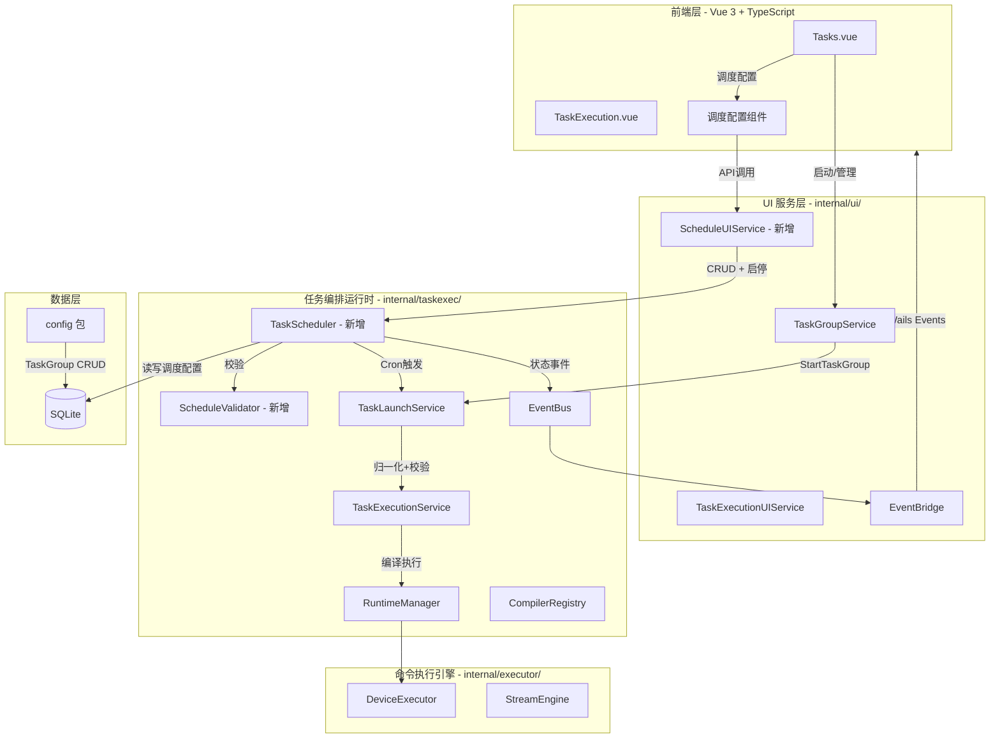
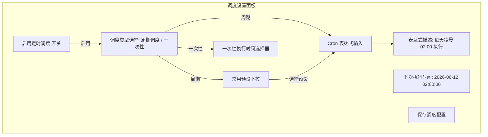

# 任务定时执行功能设计文档

## 目录

- [1. 功能概述与需求分析](#1-功能概述与需求分析)
  - [1.1 业务场景](#11-业务场景)
  - [1.2 功能需求列表](#12-功能需求列表)
  - [1.3 非功能需求](#13-非功能需求)
- [2. 整体架构设计](#2-整体架构设计)
  - [2.1 架构总览](#21-架构总览)
  - [2.2 新增组件与现有组件关系](#22-新增组件与现有组件关系)
  - [2.3 TaskScheduler 定位与职责](#23-taskscheduler-定位与职责)
  - [2.4 集成方式](#24-集成方式)
- [3. 数据模型设计](#3-数据模型设计)
  - [3.1 TaskGroup 模型扩展](#31-taskgroup-模型扩展)
  - [3.2 TaskScheduleLog 模型](#32-taskschedulelog-模型)
  - [3.3 数据库迁移方案](#33-数据库迁移方案)
- [4. 核心组件详细设计](#4-核心组件详细设计)
  - [4.1 TaskScheduler 调度引擎](#41-taskscheduler-调度引擎)
  - [4.2 ScheduleValidator 调度校验器](#42-schedulevalidator-调度校验器)
  - [4.3 ScheduleEventNotifier 调度事件通知器](#43-scheduleeventnotifier-调度事件通知器)
- [5. API 接口设计](#5-api-接口设计)
  - [5.1 Wails 绑定后端服务接口](#51-wails-绑定后端服务接口)
  - [5.2 前端 TypeScript API 接口](#52-前端-typescript-api-接口)
  - [5.3 事件推送协议](#53-事件推送协议)
- [6. 前端 UI 设计](#6-前端-ui-设计)
  - [6.1 调度配置界面](#61-调度配置界面)
  - [6.2 调度状态展示](#62-调度状态展示)
  - [6.3 与现有页面集成方案](#63-与现有页面集成方案)
- [7. 文件变更清单](#7-文件变更清单)
  - [7.1 新增文件](#71-新增文件)
  - [7.2 修改文件](#72-修改文件)
- [8. 实现路线图](#8-实现路线图)
  - [8.1 Phase 1：核心调度引擎](#81-phase-1核心调度引擎)
  - [8.2 Phase 2：前端集成与事件推送](#82-phase-2前端集成与事件推送)
  - [8.3 Phase 3：高级特性](#83-phase-3高级特性)
- [9. 风险与对策](#9-风险与对策)

---

## 1. 功能概述与需求分析

### 1.1 业务场景

任务定时执行功能服务于以下核心业务场景：

| 场景 | 说明 | 典型示例 |
|------|------|----------|
| **周期性巡检** | 按固定时间间隔自动执行网络设备巡检任务 | 每天凌晨2:00执行全网设备健康检查 |
| **定时备份** | 按计划自动备份设备配置文件 | 每周六23:00执行配置备份 |
| **定时配置下发** | 在指定时间窗口批量下发配置变更 | 工作日凌晨5:00下发ACL策略变更 |
| **一次性定时执行** | 在未来某个时间点执行一次任务 | 明天凌晨3:00执行割接前备份 |
| **拓扑定时采集** | 定期采集网络拓扑数据用于变更对比 | 每天8:00和18:00各采集一次拓扑快照 |

### 1.2 功能需求列表

| 需求编号 | 需求名称 | 优先级 | 描述 |
|----------|----------|--------|------|
| SCH-001 | Cron 表达式调度 | P0 | 支持标准5字段Cron表达式（分 时 日 月 周），驱动 TaskGroup 按计划自动执行 |
| SCH-002 | 一次性定时执行 | P0 | 支持指定未来某个时间点执行一次任务，执行后自动禁用调度 |
| SCH-003 | 调度启停控制 | P0 | 支持启用/禁用单个 TaskGroup 的调度，支持全局启停调度器 |
| SCH-004 | 常用调度预设 | P1 | 提供常用调度模板（每小时/每天/每周/每月等），降低用户配置门槛 |
| SCH-005 | 调度执行日志 | P1 | 记录每次调度触发的执行记录（触发时间、关联 RunID、执行结果） |
| SCH-006 | 错过调度处理 | P1 | 应用重启时自动恢复已注册的调度任务；支持 skip 策略（跳过已错过的调度） |
| SCH-007 | 并发冲突检测 | P1 | 同一 TaskGroup 若有活跃运行，调度触发时跳过本次执行并记录日志 |
| SCH-008 | Cron 表达式校验 | P0 | 后端校验 Cron 表达式合法性，返回人类可读的描述信息 |
| SCH-009 | 调度状态事件推送 | P1 | 通过现有 EventBus 机制推送调度状态变更事件到前端 |
| SCH-010 | 调度历史查看 | P2 | 前端展示指定 TaskGroup 的调度执行历史记录 |

### 1.3 非功能需求

| 需求 | 描述 |
|------|------|
| **可靠性** | 调度器在应用重启后自动恢复所有已注册的调度任务，不丢失调度配置 |
| **并发安全** | 调度器的动态增删操作必须线程安全，支持运行时热更新调度配置 |
| **性能** | 调度引擎本身不应成为性能瓶颈，调度触发延迟不超过1秒 |
| **可观测性** | 调度器运行状态、调度触发、执行结果均可通过日志和事件系统观测 |

---

## 2. 整体架构设计

### 2.1 架构总览

任务定时执行功能在现有四层架构中新增 `TaskScheduler` 组件，位于任务编排运行时层（`internal/taskexec/`），与 `TaskLaunchService` 紧密协作：



### 2.2 新增组件与现有组件关系

| 新增组件 | 位置 | 交互关系 |
|----------|------|----------|
| **TaskScheduler** | `internal/taskexec/scheduler.go` | 调用 `TaskLaunchService.StartTaskGroup()` 触发任务执行；使用 `EventBus` 发布调度事件；读写 `task_groups` 表的调度字段；启动时从数据库加载所有已启用调度 |
| **ScheduleValidator** | `internal/taskexec/schedule_validator.go` | 被 `TaskScheduler` 调用，校验 Cron 表达式合法性；与 `LaunchValidator` 协作检测活跃运行冲突 |
| **ScheduleUIService** | `internal/ui/schedule_service.go` | Wails 绑定服务，暴露调度管理 API 给前端；封装 `TaskScheduler` 操作 |
| **ScheduleEventBridge** | 内嵌于现有 `TaskExecutionEventBridge` | 扩展现有事件桥接器，转发调度相关事件到前端 |

### 2.3 TaskScheduler 定位与职责

`TaskScheduler` 是任务定时执行的核心引擎，其职责边界如下：

**核心职责：**

1. **调度注册管理**：维护 `TaskGroupID → cron.EntryID` 的映射关系，支持动态增删改
2. **Cron 触发执行**：基于 `robfig/cron/v3` 实现定时触发，触发时调用 `TaskLaunchService.StartTaskGroup()`
3. **生命周期管理**：与 `TaskExecutionService` 生命周期绑定，随应用启停
4. **错过调度恢复**：应用重启时自动从数据库恢复所有已启用的调度任务
5. **调度日志记录**：每次触发均记录 `TaskScheduleLog`，包含触发时间、执行结果

**不涉及的职责：**

- 任务编排与执行（由 `TaskExecutionService` / `RuntimeManager` 负责）
- 任务组的 CRUD（由 `config` 包和 `TaskGroupService` 负责）
- 设备级并发控制（由 `LaunchValidator` 和 `RuntimeManager` 负责）

### 2.4 集成方式

#### 2.4.1 与 TaskLaunchService 的集成

`TaskScheduler` 通过组合持有 `TaskLaunchService` 实例，在 Cron 触发时直接调用其 `StartTaskGroup()` 方法。这复用了完整的启动管道（归一化 → 校验 → 编译 → 执行），无需重复实现：

```go
// 伪代码示意
func (s *TaskScheduler) executeScheduledTask(taskGroupID uint) {
    runID, err := s.launchService.StartTaskGroup(context.Background(), taskGroupID)
    // 记录调度日志...
}
```

#### 2.4.2 与 TaskExecutionService 生命周期的集成

`TaskScheduler` 的生命周期与 `TaskExecutionService` 对齐：

```go
// service.go 中的集成点
func (s *TaskExecutionService) Start() {
    // ... 现有逻辑 ...
    // 调度器随服务启动
    if s.scheduler != nil {
        s.scheduler.Start()
    }
}

func (s *TaskExecutionService) Stop() {
    // ... 现有逻辑 ...
    // 调度器随服务停止
    if s.scheduler != nil {
        s.scheduler.Stop()
    }
}
```

#### 2.4.3 与 EventBus 的集成

调度器通过现有 `EventBus` 发布调度状态事件，事件类型扩展如下：

```go
// 新增事件类型
const (
    EventTypeScheduleTriggered EventType = "schedule_triggered" // 调度已触发
    EventTypeScheduleSkipped   EventType = "schedule_skipped"   // 调度被跳过
    EventTypeScheduleFailed    EventType = "schedule_failed"    // 调度执行失败
)
```

这些事件通过现有的 `TaskExecutionEventBridge` → Wails Events 通道推送到前端。

---

## 3. 数据模型设计

### 3.1 TaskGroup 模型扩展

在现有 `TaskGroup` 模型（`internal/models/models.go`）中新增调度相关字段：

```go
// 文件: internal/models/models.go
type TaskGroup struct {
    // ... 现有字段保持不变 ...

    // ===== 调度相关字段（新增）=====
    ScheduleEnabled    bool       `json:"scheduleEnabled"`              // 是否启用定时调度
    CronExpression     string     `json:"cronExpression"`               // Cron 表达式（5字段：分 时 日 月 周）
    ScheduleType       string     `json:"scheduleType"`                 // 调度类型: "cron" | "once" | ""
    OnceScheduledAt    *time.Time `json:"onceScheduledAt,omitempty"`    // 一次性执行的计划时间
    NextRunAt          *time.Time `json:"nextRunAt,omitempty"`          // 下次计划执行时间（由调度器计算维护）
    LastScheduledRunID string     `json:"lastScheduledRunId,omitempty"` // 最近一次调度触发生成的 RunID
    LastScheduledAt    *time.Time `json:"lastScheduledAt,omitempty"`    // 最近一次调度触发时间
    ScheduleError      string     `json:"scheduleError,omitempty"`      // 最近一次调度错误信息
}
```

**字段详解：**

| 字段 | 类型 | 说明 | 约束 |
|------|------|------|------|
| `ScheduleEnabled` | bool | 是否启用定时调度 | 默认 false |
| `CronExpression` | string | Cron 表达式 | 5字段格式（分 时 日 月 周），为空表示未配置 |
| `ScheduleType` | string | 调度类型 | `"cron"` 表示周期调度，`"once"` 表示一次性调度，空字符串表示未调度 |
| `OnceScheduledAt` | *time.Time | 一次性执行的计划时间 | 仅 `ScheduleType="once"` 时有效 |
| `NextRunAt` | *time.Time | 下次计划执行时间 | 由调度器自动维护，前端只读展示 |
| `LastScheduledRunID` | string | 最近一次调度触发的 RunID | 用于前端快速关联到执行记录 |
| `LastScheduledAt` | *time.Time | 最近一次调度触发时间 | 记录上次调度时间 |
| `ScheduleError` | string | 最近一次调度错误 | 调度失败时记录错误信息 |

### 3.2 TaskScheduleLog 模型

新增调度执行日志表，记录每次调度触发的详细信息：

```go
// 文件: internal/taskexec/schedule_models.go
type TaskScheduleLog struct {
    ID            uint       `json:"id" gorm:"primaryKey;autoIncrement"`
    TaskGroupID   uint       `json:"taskGroupId" gorm:"index;not null"`
    TaskGroupName string     `json:"taskGroupName"`                       // 快照，避免关联查询
    CronExpression string    `json:"cronExpression"`                      // 触发时的 Cron 表达式快照
    TriggeredAt   time.Time  `json:"triggeredAt"`                         // 计划触发时间
    ActualRunAt   *time.Time `json:"actualRunAt,omitempty"`               // 实际执行时间
    RunID         string     `json:"runId,omitempty"`                     // 关联的 TaskRun ID
    Status        string     `json:"status"`                              // "triggered" | "skipped" | "failed"
    SkipReason    string     `json:"skipReason,omitempty"`               // 跳过原因（如存在活跃运行）
    Error         string     `json:"error,omitempty"`                    // 执行失败时的错误信息
    CreatedAt     time.Time  `json:"createdAt"`
}

// TableName 指定表名
func (TaskScheduleLog) TableName() string {
    return "task_schedule_logs"
}
```

**Status 枚举值：**

| 状态 | 说明 |
|------|------|
| `triggered` | 调度已成功触发，任务已提交执行 |
| `skipped` | 调度被跳过（如存在活跃运行冲突、调度已被禁用等） |
| `failed` | 调度触发失败（如 TaskGroup 不存在、启动管道错误等） |

### 3.3 数据库迁移方案

#### 3.3.1 TaskGroup 表扩展

采用 GORM AutoMigrate 自动迁移方案。新增的字段均为零值兼容（`bool` 默认 `false`，`string` 默认空，`*time.Time` 默认 `nil`），不影响现有数据：

```go
// 文件: internal/config/db.go - autoMigrateAll 函数
func autoMigrateAll(db *gorm.DB) error {
    return db.AutoMigrate(
        // ... 现有表 ...
        &models.TaskGroup{}, // 包含新增的调度字段，GORM 自动迁移
        // ...
    )
}
```

#### 3.3.2 TaskScheduleLog 表创建

在 `taskexec.AutoMigrate()` 中新增 `TaskScheduleLog` 表：

```go
// 文件: internal/taskexec/persistence.go - AutoMigrate 函数
func AutoMigrate(db *gorm.DB) error {
    return db.AutoMigrate(
        // ... 现有表 ...
        &TaskScheduleLog{}, // 新增
    )
}
```

#### 3.3.3 索引策略

```go
// 在 createIndexes 中新增
"CREATE INDEX IF NOT EXISTS idx_task_schedule_logs_group_id ON task_schedule_logs(task_group_id)",
"CREATE INDEX IF NOT EXISTS idx_task_schedule_logs_triggered_at ON task_schedule_logs(triggered_at)",
"CREATE INDEX IF NOT EXISTS idx_task_schedule_logs_status ON task_schedule_logs(status)",
"CREATE INDEX IF NOT EXISTS idx_task_groups_schedule_enabled ON task_groups(schedule_enabled)",
```

---

## 4. 核心组件详细设计

### 4.1 TaskScheduler 调度引擎

#### 4.1.1 数据结构定义

```go
// 文件: internal/taskexec/scheduler.go
package taskexec

import (
    "context"
    "fmt"
    "sync"
    "sync/atomic"
    "time"

    "github.com/robfig/cron/v3"

    "github.com/NetWeaverGo/core/internal/config"
    "github.com/NetWeaverGo/core/internal/logger"
    "github.com/NetWeaverGo/core/internal/models"
)

// TaskSchedulerStatus 调度器状态
type TaskSchedulerStatus struct {
    IsRunning       bool      `json:"isRunning"`       // 是否运行中
    ScheduledCount  int       `json:"scheduledCount"`  // 已调度任务组数
    TotalTriggers   int64     `json:"totalTriggers"`   // 总触发次数
    LastTriggerTime time.Time `json:"lastTriggerTime"` // 最后触发时间
    StartTime       time.Time `json:"startTime"`       // 调度器启动时间
}

// scheduledTaskGroup 调度任务信息
type scheduledTaskGroup struct {
    TaskGroupID   uint         // 任务组 ID
    CronID        cron.EntryID // Cron 任务 ID
    TaskGroupName string       // 任务组名称快照
    CronExpr      string       // Cron 表达式快照
    ScheduleType  string       // 调度类型
}

// TaskScheduler 任务调度引擎
// 基于 robfig/cron/v3 实现，管理 TaskGroup 的定时执行
type TaskScheduler struct {
    launchService *TaskLaunchService
    eventBus      *EventBus
    scheduler     *cron.Cron

    // 已调度任务映射: taskGroupID -> scheduledTaskGroup
    jobs map[uint]*scheduledTaskGroup

    // 状态
    running      bool
    startTime    time.Time
    totalTriggers int64

    // 并发控制
    mu sync.RWMutex
}
```

#### 4.1.2 构造与生命周期

```go
// NewTaskScheduler 创建任务调度器实例
func NewTaskScheduler(launchService *TaskLaunchService, eventBus *EventBus) *TaskScheduler {
    // 使用标准5字段Cron格式（分 时 日 月 周），使用本地时区
    scheduler := cron.New(cron.WithLocation(time.Local))

    s := &TaskScheduler{
        launchService: launchService,
        eventBus:      eventBus,
        scheduler:     scheduler,
        jobs:          make(map[uint]*scheduledTaskGroup),
    }

    logger.Info("TaskScheduler", "-", "任务调度器已创建")
    return s
}

// Start 启动调度器
// 从数据库加载所有已启用调度的 TaskGroup 并注册 Cron 任务
func (s *TaskScheduler) Start() error {
    s.mu.Lock()
    defer s.mu.Unlock()

    if s.running {
        logger.Warn("TaskScheduler", "-", "调度器已在运行中")
        return nil
    }

    logger.Info("TaskScheduler", "-", "正在启动任务调度器...")

    // 从数据库加载已启用调度的任务组
    groups, err := config.ListTaskGroups()
    if err != nil {
        logger.Error("TaskScheduler", "-", "加载任务组失败: %v", err)
        return fmt.Errorf("加载任务组失败: %w", err)
    }

    successCount := 0
    failCount := 0
    for _, group := range groups {
        if !group.ScheduleEnabled {
            continue
        }
        if err := s.addJobUnsafe(&group); err != nil {
            logger.Error("TaskScheduler", "-", "注册调度任务失败: ID=%d, Name=%s, %v",
                group.ID, group.Name, err)
            failCount++
            continue
        }
        successCount++
    }

    // 启动 cron 调度器
    s.scheduler.Start()
    s.running = true
    s.startTime = time.Now()

    logger.Info("TaskScheduler", "-", "任务调度器已启动: 注册成功=%d, 注册失败=%d",
        successCount, failCount)
    return nil
}

// Stop 停止调度器
func (s *TaskScheduler) Stop() error {
    s.mu.Lock()
    defer s.mu.Unlock()

    if !s.running {
        logger.Debug("TaskScheduler", "-", "调度器未运行，无需停止")
        return nil
    }

    logger.Info("TaskScheduler", "-", "正在停止任务调度器...")

    targetCount := len(s.jobs)
    totalTriggers := atomic.LoadInt64(&s.totalTriggers)
    uptime := time.Since(s.startTime)

    // 停止 cron 调度器，等待正在执行的任务完成
    ctx := s.scheduler.Stop()
    <-ctx.Done()

    // 清空任务映射
    s.jobs = make(map[uint]*scheduledTaskGroup)
    s.running = false

    logger.Info("TaskScheduler", "-", "任务调度器已停止: 原调度任务=%d, 总触发次数=%d, 运行时长=%v",
        targetCount, totalTriggers, uptime)
    return nil
}
```

#### 4.1.3 动态增删调度任务

```go
// AddSchedule 为指定 TaskGroup 添加调度
func (s *TaskScheduler) AddSchedule(taskGroupID uint) error {
    s.mu.Lock()
    defer s.mu.Unlock()

    group, err := config.GetTaskGroup(taskGroupID)
    if err != nil {
        return fmt.Errorf("获取任务组失败: %w", err)
    }

    return s.addJobUnsafe(group)
}

// RemoveSchedule 移除指定 TaskGroup 的调度
func (s *TaskScheduler) RemoveSchedule(taskGroupID uint) error {
    s.mu.Lock()
    defer s.mu.Unlock()

    return s.removeJobUnsafe(taskGroupID)
}

// UpdateSchedule 更新指定 TaskGroup 的调度（先移除再添加）
func (s *TaskScheduler) UpdateSchedule(taskGroupID uint) error {
    s.mu.Lock()
    defer s.mu.Unlock()

    // 移除旧任务
    if _, exists := s.jobs[taskGroupID]; exists {
        if err := s.removeJobUnsafe(taskGroupID); err != nil {
            logger.Warn("TaskScheduler", "-", "移除旧调度失败: ID=%d, %v", taskGroupID, err)
        }
    }

    group, err := config.GetTaskGroup(taskGroupID)
    if err != nil {
        return fmt.Errorf("获取任务组失败: %w", err)
    }

    return s.addJobUnsafe(group)
}

// addJobUnsafe 添加调度任务（需在锁内调用）
func (s *TaskScheduler) addJobUnsafe(group *models.TaskGroup) error {
    if !group.ScheduleEnabled {
        logger.Debug("TaskScheduler", "-", "任务组未启用调度，跳过: ID=%d", group.ID)
        return nil
    }

    var cronSpec string
    var scheduleType string

    switch group.ScheduleType {
    case "once":
        // 一次性调度：计算延迟后注册为一次性 Cron
        if group.OnceScheduledAt == nil {
            return fmt.Errorf("一次性调度缺少计划时间: ID=%d", group.ID)
        }
        delay := time.Until(*group.OnceScheduledAt)
        if delay <= 0 {
            logger.Info("TaskScheduler", "-", "一次性调度时间已过，跳过: ID=%d, ScheduledAt=%v",
                group.ID, group.OnceScheduledAt)
            return nil
        }
        // 使用 @every 延迟触发，然后在回调中自动禁用
        cronSpec = fmt.Sprintf("@every %s", delay.Truncate(time.Second).String())
        scheduleType = "once"

    case "cron":
        cronSpec = group.CronExpression
        scheduleType = "cron"
        if cronSpec == "" {
            return fmt.Errorf("Cron 表达式为空: ID=%d", group.ID)
        }

    default:
        return fmt.Errorf("不支持的调度类型: %s", group.ScheduleType)
    }

    job := &scheduledTaskGroup{
        TaskGroupID:   group.ID,
        TaskGroupName: group.Name,
        CronExpr:      cronSpec,
        ScheduleType:  scheduleType,
    }

    cronID, err := s.scheduler.AddFunc(cronSpec, s.createExecuteFunc(job))
    if err != nil {
        return fmt.Errorf("注册 cron 任务失败: %w", err)
    }

    job.CronID = cronID
    s.jobs[group.ID] = job

    // 更新 NextRunAt
    nextRun := s.scheduler.Entry(cronID).Next
    s.updateNextRunAt(group.ID, &nextRun)

    logger.Info("TaskScheduler", "-", "已注册调度任务: ID=%d, Name=%s, Type=%s, Cron=%s, NextRun=%v",
        group.ID, group.Name, scheduleType, cronSpec, nextRun)
    return nil
}

// removeJobUnsafe 移除调度任务（需在锁内调用）
func (s *TaskScheduler) removeJobUnsafe(taskGroupID uint) error {
    job, exists := s.jobs[taskGroupID]
    if !exists {
        return nil
    }

    s.scheduler.Remove(job.CronID)
    delete(s.jobs, taskGroupID)

    // 清除 NextRunAt
    s.updateNextRunAt(taskGroupID, nil)

    logger.Info("TaskScheduler", "-", "已移除调度任务: ID=%d", taskGroupID)
    return nil
}
```

#### 4.1.4 Cron 触发执行函数

```go
// createExecuteFunc 创建调度执行函数
func (s *TaskScheduler) createExecuteFunc(job *scheduledTaskGroup) func() {
    return func() {
        triggerTime := time.Now()
        logger.Info("TaskScheduler", "-", "调度触发: TaskGroupID=%d, Name=%s, TriggerTime=%v",
            job.TaskGroupID, job.TaskGroupName, triggerTime)

        // 一次性调度触发后自动禁用
        if job.ScheduleType == "once" {
            defer s.disableOnceSchedule(job.TaskGroupID)
        }

        // 检查是否存在活跃运行
        if s.hasActiveRun(job.TaskGroupID) {
            reason := "存在活跃运行，跳过本次调度"
            logger.Warn("TaskScheduler", "-", "调度跳过: ID=%d, 原因=%s", job.TaskGroupID, reason)
            s.recordScheduleLog(job, triggerTime, "skipped", "", "", reason)
            s.emitScheduleEvent(job, EventTypeScheduleSkipped, reason)
            return
        }

        // 调用 TaskLaunchService 启动任务
        runID, err := s.launchService.StartTaskGroup(context.Background(), job.TaskGroupID)
        if err != nil {
            logger.Error("TaskScheduler", "-", "调度执行失败: ID=%d, %v", job.TaskGroupID, err)
            s.recordScheduleLog(job, triggerTime, "failed", "", "", err.Error())
            s.updateScheduleError(job.TaskGroupID, err.Error())
            s.emitScheduleEvent(job, EventTypeScheduleFailed, err.Error())
            return
        }

        logger.Info("TaskScheduler", "-", "调度执行成功: ID=%d, RunID=%s", job.TaskGroupID, runID)
        s.recordScheduleLog(job, triggerTime, "triggered", runID, "", "")
        s.updateLastScheduledRun(job.TaskGroupID, runID, triggerTime)
        s.emitScheduleEvent(job, EventTypeScheduleTriggered, "")

        atomic.AddInt64(&s.totalTriggers, 1)
    }
}
```

#### 4.1.5 错过调度的处理策略

采用 **Skip 策略**：应用重启时恢复调度，但不补发错过的执行。

```go
// 设计决策：采用 Skip 策略而非 Catch-up
// 理由：
// 1. 网络运维任务通常对时间窗口敏感，补发过时的执行可能产生副作用
// 2. 补发可能导致短时间内批量执行，对设备造成压力
// 3. 与 SNMP PollerScheduler 的 WithSkipIfBusy(true) 策略保持一致
//
// 实现：调度器重启时重新从数据库加载所有已启用调度的 TaskGroup，
// cron 库会计算下一个未来的触发时间，自动跳过已错过的调度。
```

#### 4.1.6 辅助方法

```go
// hasActiveRun 检查指定 TaskGroup 是否有活跃运行
func (s *TaskScheduler) hasActiveRun(taskGroupID uint) bool {
    if s.launchService == nil || s.launchService.taskexec == nil {
        return false
    }
    runs, err := s.launchService.taskexec.ListRuns(100)
    if err != nil {
        return false
    }
    for _, run := range runs {
        if run.TaskGroupID == taskGroupID && IsActiveRunStatus(run.Status) {
            return true
        }
    }
    return false
}

// disableOnceSchedule 一次性调度触发后自动禁用
func (s *TaskScheduler) disableOnceSchedule(taskGroupID uint) {
    s.mu.Lock()
    defer s.mu.Unlock()

    // 从调度器移除
    if _, exists := s.jobs[taskGroupID]; exists {
        s.removeJobUnsafe(taskGroupID)
    }

    // 更新数据库
    group, err := config.GetTaskGroup(taskGroupID)
    if err != nil {
        logger.Error("TaskScheduler", "-", "获取任务组失败: ID=%d, %v", taskGroupID, err)
        return
    }
    group.ScheduleEnabled = false
    group.ScheduleType = ""
    group.OnceScheduledAt = nil
    if _, err := config.UpdateTaskGroup(taskGroupID, *group); err != nil {
        logger.Error("TaskScheduler", "-", "禁用一次性调度失败: ID=%d, %v", taskGroupID, err)
    }

    logger.Info("TaskScheduler", "-", "一次性调度已自动禁用: ID=%d", taskGroupID)
}

// updateNextRunAt 更新下次执行时间
func (s *TaskScheduler) updateNextRunAt(taskGroupID uint, nextRun *time.Time) {
    group, err := config.GetTaskGroup(taskGroupID)
    if err != nil {
        return
    }
    group.NextRunAt = nextRun
    config.UpdateTaskGroup(taskGroupID, *group)
}

// updateLastScheduledRun 更新最近调度执行信息
func (s *TaskScheduler) updateLastScheduledRun(taskGroupID uint, runID string, triggerTime time.Time) {
    group, err := config.GetTaskGroup(taskGroupID)
    if err != nil {
        return
    }
    group.LastScheduledRunID = runID
    group.LastScheduledAt = &triggerTime
    group.ScheduleError = ""
    config.UpdateTaskGroup(taskGroupID, *group)
}

// updateScheduleError 更新调度错误信息
func (s *TaskScheduler) updateScheduleError(taskGroupID uint, errMsg string) {
    group, err := config.GetTaskGroup(taskGroupID)
    if err != nil {
        return
    }
    group.ScheduleError = errMsg
    config.UpdateTaskGroup(taskGroupID, *group)
}
```

#### 4.1.7 查询方法

```go
// GetStatus 获取调度器状态
func (s *TaskScheduler) GetStatus() *TaskSchedulerStatus {
    s.mu.RLock()
    defer s.mu.RUnlock()

    status := &TaskSchedulerStatus{
        IsRunning:      s.running,
        ScheduledCount: len(s.jobs),
        TotalTriggers:  atomic.LoadInt64(&s.totalTriggers),
    }

    if s.running {
        status.StartTime = s.startTime
    }

    return status
}

// GetScheduledTaskGroups 获取已调度的任务组 ID 列表
func (s *TaskScheduler) GetScheduledTaskGroups() []uint {
    s.mu.RLock()
    defer s.mu.RUnlock()

    ids := make([]uint, 0, len(s.jobs))
    for id := range s.jobs {
        ids = append(ids, id)
    }
    return ids
}

// GetScheduleInfo 获取指定任务组的调度信息
func (s *TaskScheduler) GetScheduleInfo(taskGroupID uint) (*scheduledTaskGroup, bool) {
    s.mu.RLock()
    defer s.mu.RUnlock()

    job, exists := s.jobs[taskGroupID]
    return job, exists
}
```

#### 4.1.8 调度日志记录

```go
// recordScheduleLog 记录调度执行日志
func (s *TaskScheduler) recordScheduleLog(
    job *scheduledTaskGroup,
    triggerTime time.Time,
    status string,
    runID string,
    actualRunAt string,
    reason string,
) {
    log := &TaskScheduleLog{
        TaskGroupID:    job.TaskGroupID,
        TaskGroupName:  job.TaskGroupName,
        CronExpression: job.CronExpr,
        TriggeredAt:    triggerTime,
        RunID:          runID,
        Status:         status,
        SkipReason:     reason,
        CreatedAt:      time.Now(),
    }

    if status == "triggered" && runID != "" {
        now := time.Now()
        log.ActualRunAt = &now
    }

    if status == "failed" {
        log.Error = reason
    }

    if err := s.saveScheduleLog(log); err != nil {
        logger.Error("TaskScheduler", "-", "保存调度日志失败: %v", err)
    }
}

// saveScheduleLog 保存调度日志到数据库
func (s *TaskScheduler) saveScheduleLog(log *TaskScheduleLog) error {
    db := config.GetDB()
    if db == nil {
        return fmt.Errorf("数据库未初始化")
    }
    return db.Create(log).Error
}

// ListScheduleLogs 查询指定任务组的调度日志
func (s *TaskScheduler) ListScheduleLogs(taskGroupID uint, limit int) ([]TaskScheduleLog, error) {
    db := config.GetDB()
    if db == nil {
        return nil, fmt.Errorf("数据库未初始化")
    }

    var logs []TaskScheduleLog
    query := db.Where("task_group_id = ?", taskGroupID).Order("triggered_at DESC")
    if limit > 0 {
        query = query.Limit(limit)
    }
    if err := query.Find(&logs).Error; err != nil {
        return nil, err
    }
    return logs, nil
}
```

### 4.2 ScheduleValidator 调度校验器

```go
// 文件: internal/taskexec/schedule_validator.go
package taskexec

import (
    "fmt"
    "strings"

    "github.com/robfig/cron/v3"

    "github.com/NetWeaverGo/core/internal/config"
    "github.com/NetWeaverGo/core/internal/logger"
    "github.com/NetWeaverGo/core/internal/models"
)

// ScheduleValidator 调度校验器
type ScheduleValidator struct{}

// NewScheduleValidator 创建调度校验器
func NewScheduleValidator() *ScheduleValidator {
    return &ScheduleValidator{}
}

// ValidateScheduleConfig 校验调度配置的合法性
func (v *ScheduleValidator) ValidateScheduleConfig(group *models.TaskGroup) error {
    if group == nil {
        return fmt.Errorf("任务组不能为空")
    }

    if !group.ScheduleEnabled {
        // 未启用调度，不需要校验
        return nil
    }

    switch group.ScheduleType {
    case "cron":
        return v.validateCronSchedule(group)
    case "once":
        return v.validateOnceSchedule(group)
    case "":
        return fmt.Errorf("调度类型不能为空")
    default:
        return fmt.Errorf("不支持的调度类型: %s", group.ScheduleType)
    }
}

// validateCronSchedule 校验 Cron 调度配置
func (v *ScheduleValidator) validateCronSchedule(group *models.TaskGroup) error {
    expr := strings.TrimSpace(group.CronExpression)
    if expr == "" {
        return fmt.Errorf("Cron 表达式不能为空")
    }

    // 使用 cron.Parser 校验表达式合法性
    parser := cron.NewParser(cron.Minute | cron.Hour | cron.Dom | cron.Month | cron.Dow)
    _, err := parser.Parse(expr)
    if err != nil {
        return fmt.Errorf("Cron 表达式格式错误: %w", err)
    }

    return nil
}

// validateOnceSchedule 校验一次性调度配置
func (v *ScheduleValidator) validateOnceSchedule(group *models.TaskGroup) error {
    if group.OnceScheduledAt == nil {
        return fmt.Errorf("一次性调度必须指定计划执行时间")
    }

    // 允许过去的时间（用户可能在配置后延迟确认），
    // 但调度器注册时会跳过已过期的一次性调度
    return nil
}

// DescribeCronExpression 将 Cron 表达式转换为人类可读的中文描述
// 供前端展示使用
func (v *ScheduleValidator) DescribeCronExpression(expr string) string {
    // 此方法返回简单的中文描述，前端也可使用更复杂的描述库
    expr = strings.TrimSpace(expr)
    if expr == "" {
        return "未配置"
    }

    parts := strings.Fields(expr)
    if len(parts) != 5 {
        return expr
    }

    // 常见模式的快速匹配
    minute, hour, dom, month, dow := parts[0], parts[1], parts[2], parts[3], parts[4]

    // 每天固定时间
    if dom == "*" && month == "*" && dow == "*" && !strings.Contains(minute, "/") {
        return fmt.Sprintf("每天 %s:%s", padZero(hour), padZero(minute))
    }

    // 每小时
    if hour == "*" && dom == "*" && month == "*" && dow == "*" && minute == "0" {
        return "每小时整点"
    }

    // 每N分钟
    if strings.HasPrefix(minute, "*/") && hour == "*" {
        return fmt.Sprintf("每 %s 分钟", minute[2:])
    }

    // 每周一到五
    if dow == "1-5" && dom == "*" && month == "*" {
        return fmt.Sprintf("工作日 %s:%s", padZero(hour), padZero(minute))
    }

    // 默认返回原始表达式
    return fmt.Sprintf("Cron: %s", expr)
}

func padZero(s string) string {
    if len(s) == 1 {
        return "0" + s
    }
    return s
}

// CheckScheduleConflict 检查调度冲突
// 检查同一 TaskGroup 是否已存在活跃运行
func (v *ScheduleValidator) CheckScheduleConflict(launchService *TaskLaunchService, taskGroupID uint) (bool, string) {
    if launchService == nil || launchService.taskexec == nil {
        return false, ""
    }

    runs, err := launchService.taskexec.ListRuns(100)
    if err != nil {
        return false, ""
    }

    for _, run := range runs {
        if run.TaskGroupID == taskGroupID && IsActiveRunStatus(run.Status) {
            return true, fmt.Sprintf("任务组 %d 存在活跃运行 (RunID: %s)", taskGroupID, run.ID)
        }
    }

    return false, ""
}
```

### 4.3 ScheduleEventNotifier 调度事件通知器

调度事件通过现有的 `EventBus` 发布，复用 `TaskExecutionEventBridge` 的通道推送到前端：

```go
// scheduler.go 中的事件发布方法

// emitScheduleEvent 发布调度事件到 EventBus
func (s *TaskScheduler) emitScheduleEvent(job *scheduledTaskGroup, eventType EventType, message string) {
    if s.eventBus == nil {
        return
    }

    event := &TaskEvent{
        ID:        newEventID(),
        RunID:     "", // 调度事件不关联具体 RunID
        Type:      eventType,
        Level:     EventLevelInfo,
        Message:   message,
        Timestamp: time.Now(),
        Payload: map[string]interface{}{
            "taskGroupId":    job.TaskGroupID,
            "taskGroupName":  job.TaskGroupName,
            "cronExpression": job.CronExpr,
            "scheduleType":   job.ScheduleType,
        },
    }

    if eventType == EventTypeScheduleFailed {
        event.Level = EventLevelError
    }

    s.eventBus.Emit(event)
}
```

---

## 5. API 接口设计

### 5.1 Wails 绑定后端服务接口

新增 `ScheduleUIService`（`internal/ui/schedule_service.go`），作为 Wails 绑定服务暴露给前端：

```go
// 文件: internal/ui/schedule_service.go
package ui

import (
    "context"

    "github.com/NetWeaverGo/core/internal/config"
    "github.com/NetWeaverGo/core/internal/logger"
    "github.com/NetWeaverGo/core/internal/models"
    "github.com/NetWeaverGo/core/internal/taskexec"
    "github.com/wailsapp/wails/v3/pkg/application"
)

// ScheduleUIService 调度管理 UI 服务
// 提供任务定时调度的配置、查询和控制接口
type ScheduleUIService struct {
    scheduler  *taskexec.TaskScheduler
    validator  *taskexec.ScheduleValidator
    wailsApp   *application.App
}

// NewScheduleUIService 创建调度管理 UI 服务
func NewScheduleUIService(scheduler *taskexec.TaskScheduler) *ScheduleUIService {
    return &ScheduleUIService{
        scheduler: scheduler,
        validator: taskexec.NewScheduleValidator(),
    }
}

// ServiceStartup Wails 服务启动生命周期钩子
func (s *ScheduleUIService) ServiceStartup(ctx context.Context, options application.ServiceOptions) error {
    s.wailsApp = application.Get()
    return nil
}

// ========== 调度配置 API ==========

// UpdateScheduleConfig 更新指定任务组的调度配置
// 前端调用此方法设置/修改/取消调度
func (s *ScheduleUIService) UpdateScheduleConfig(taskGroupID uint, req ScheduleConfigRequest) (*ScheduleConfigResponse, error) {
    logger.Debug("ScheduleUIService", "-", "收到更新调度配置请求: TaskGroupID=%d, Enabled=%t, Type=%s",
        taskGroupID, req.ScheduleEnabled, req.ScheduleType)

    group, err := config.GetTaskGroup(taskGroupID)
    if err != nil {
        return nil, err
    }

    // 更新调度字段
    group.ScheduleEnabled = req.ScheduleEnabled
    group.ScheduleType = req.ScheduleType
    group.CronExpression = req.CronExpression
    group.OnceScheduledAt = req.OnceScheduledAt

    // 校验配置
    if err := s.validator.ValidateScheduleConfig(group); err != nil {
        return nil, err
    }

    // 更新数据库
    updated, err := config.UpdateTaskGroup(taskGroupID, *group)
    if err != nil {
        return nil, err
    }

    // 更新调度器
    if updated.ScheduleEnabled {
        if err := s.scheduler.UpdateSchedule(taskGroupID); err != nil {
            logger.Error("ScheduleUIService", "-", "更新调度器失败: %v", err)
            // 回滚数据库状态
            group.ScheduleEnabled = false
            config.UpdateTaskGroup(taskGroupID, *group)
            return nil, err
        }
    } else {
        s.scheduler.RemoveSchedule(taskGroupID)
    }

    // 构建响应
    resp := &ScheduleConfigResponse{
        TaskGroupID:    taskGroupID,
        ScheduleEnabled: updated.ScheduleEnabled,
        ScheduleType:   updated.ScheduleType,
        CronExpression: updated.CronExpression,
        Description:    s.validator.DescribeCronExpression(updated.CronExpression),
    }

    // 填充 NextRunAt
    if info, exists := s.scheduler.GetScheduleInfo(taskGroupID); exists {
        entry := s.scheduler.GetCronEntry(info.CronID)
        if entry != nil {
            nextRun := entry.Next
            resp.NextRunAt = &nextRun
        }
    }

    logger.Info("ScheduleUIService", "-", "调度配置已更新: TaskGroupID=%d, Enabled=%t",
        taskGroupID, updated.ScheduleEnabled)
    return resp, nil
}

// GetScheduleConfig 获取指定任务组的调度配置
func (s *ScheduleUIService) GetScheduleConfig(taskGroupID uint) (*ScheduleConfigResponse, error) {
    group, err := config.GetTaskGroup(taskGroupID)
    if err != nil {
        return nil, err
    }

    resp := &ScheduleConfigResponse{
        TaskGroupID:     taskGroupID,
        ScheduleEnabled: group.ScheduleEnabled,
        ScheduleType:    group.ScheduleType,
        CronExpression:  group.CronExpression,
        OnceScheduledAt: group.OnceScheduledAt,
        NextRunAt:       group.NextRunAt,
        LastScheduledAt: group.LastScheduledAt,
        LastScheduledRunID: group.LastScheduledRunID,
        ScheduleError:   group.ScheduleError,
        Description:     s.validator.DescribeCronExpression(group.CronExpression),
    }

    return resp, nil
}

// ValidateCronExpression 校验 Cron 表达式并返回描述
func (s *ScheduleUIService) ValidateCronExpression(expr string) (*CronValidationResult, error) {
    group := &models.TaskGroup{
        ScheduleEnabled: true,
        ScheduleType:    "cron",
        CronExpression:  expr,
    }

    err := s.validator.ValidateScheduleConfig(group)
    if err != nil {
        return &CronValidationResult{
            Valid:       false,
            Error:       err.Error(),
            Description: "",
        }, nil
    }

    return &CronValidationResult{
        Valid:       true,
        Error:       "",
        Description: s.validator.DescribeCronExpression(expr),
    }, nil
}

// ========== 调度控制 API ==========

// EnableSchedule 启用指定任务组的调度
func (s *ScheduleUIService) EnableSchedule(taskGroupID uint) error {
    group, err := config.GetTaskGroup(taskGroupID)
    if err != nil {
        return err
    }

    group.ScheduleEnabled = true
    if _, err := config.UpdateTaskGroup(taskGroupID, *group); err != nil {
        return err
    }

    return s.scheduler.AddSchedule(taskGroupID)
}

// DisableSchedule 禁用指定任务组的调度
func (s *ScheduleUIService) DisableSchedule(taskGroupID uint) error {
    group, err := config.GetTaskGroup(taskGroupID)
    if err != nil {
        return err
    }

    group.ScheduleEnabled = false
    if _, err := config.UpdateTaskGroup(taskGroupID, *group); err != nil {
        return err
    }

    return s.scheduler.RemoveSchedule(taskGroupID)
}

// ========== 查询 API ==========

// GetSchedulerStatus 获取调度器全局状态
func (s *ScheduleUIService) GetSchedulerStatus() *taskexec.TaskSchedulerStatus {
    return s.scheduler.GetStatus()
}

// GetSchedulePresets 获取常用调度预设列表
func (s *ScheduleUIService) GetSchedulePresets() []SchedulePreset {
    return []SchedulePreset{
        {Label: "每小时", CronExpression: "0 * * * *", Description: "每小时整点执行"},
        {Label: "每天凌晨2点", CronExpression: "0 2 * * *", Description: "每天凌晨 02:00 执行"},
        {Label: "每天早上8点", CronExpression: "0 8 * * *", Description: "每天早上 08:00 执行"},
        {Label: "工作日凌晨2点", CronExpression: "0 2 * * 1-5", Description: "周一至周五凌晨 02:00 执行"},
        {Label: "每周一凌晨2点", CronExpression: "0 2 * * 1", Description: "每周一凌晨 02:00 执行"},
        {Label: "每月1号凌晨2点", CronExpression: "0 2 1 * *", Description: "每月1号凌晨 02:00 执行"},
        {Label: "每5分钟", CronExpression: "*/5 * * * *", Description: "每5分钟执行一次"},
        {Label: "每30分钟", CronExpression: "*/30 * * * *", Description: "每30分钟执行一次"},
        {Label: "每天8点和18点", CronExpression: "0 8,18 * * *", Description: "每天 08:00 和 18:00 执行"},
    }
}

// ListScheduleLogs 获取指定任务组的调度日志
func (s *ScheduleUIService) ListScheduleLogs(taskGroupID uint, limit int) ([]taskexec.TaskScheduleLog, error) {
    return s.scheduler.ListScheduleLogs(taskGroupID, limit)
}
```

**请求/响应 DTO 定义：**

```go
// 文件: internal/ui/schedule_models.go
package ui

import "time"

// ScheduleConfigRequest 调度配置请求
type ScheduleConfigRequest struct {
    ScheduleEnabled bool       `json:"scheduleEnabled"`          // 是否启用调度
    ScheduleType    string     `json:"scheduleType"`             // "cron" | "once"
    CronExpression  string     `json:"cronExpression,omitempty"` // Cron 表达式
    OnceScheduledAt *time.Time `json:"onceScheduledAt,omitempty"` // 一次性执行时间
}

// ScheduleConfigResponse 调度配置响应
type ScheduleConfigResponse struct {
    TaskGroupID        uint       `json:"taskGroupId"`
    ScheduleEnabled    bool       `json:"scheduleEnabled"`
    ScheduleType       string     `json:"scheduleType"`
    CronExpression     string     `json:"cronExpression,omitempty"`
    OnceScheduledAt    *time.Time `json:"onceScheduledAt,omitempty"`
    NextRunAt          *time.Time `json:"nextRunAt,omitempty"`
    LastScheduledAt    *time.Time `json:"lastScheduledAt,omitempty"`
    LastScheduledRunID string     `json:"lastScheduledRunId,omitempty"`
    ScheduleError      string     `json:"scheduleError,omitempty"`
    Description        string     `json:"description"` // Cron 表达式的中文描述
}

// CronValidationResult Cron 表达式校验结果
type CronValidationResult struct {
    Valid       bool   `json:"valid"`
    Error       string `json:"error,omitempty"`
    Description string `json:"description"`
}

// SchedulePreset 调度预设
type SchedulePreset struct {
    Label          string `json:"label"`          // 显示标签
    CronExpression string `json:"cronExpression"` // Cron 表达式
    Description    string `json:"description"`    // 描述
}
```

### 5.2 前端 TypeScript API 接口

在 `frontend/src/services/api.ts` 中新增 `ScheduleAPI` 命名空间：

```typescript
// 文件: frontend/src/services/api.ts (新增部分)
import * as ScheduleServiceBinding from '../bindings/github.com/NetWeaverGo/core/internal/ui/scheduleservice'

// ==================== 调度管理 API ====================
/**
 * 调度管理 API
 * @description 提供任务定时调度的配置、查询和控制功能
 */
export const ScheduleAPI = {
  /** 更新指定任务组的调度配置 */
  updateScheduleConfig: ScheduleServiceBinding.UpdateScheduleConfig,
  /** 获取指定任务组的调度配置 */
  getScheduleConfig: ScheduleServiceBinding.GetScheduleConfig,
  /** 校验 Cron 表达式 */
  validateCronExpression: ScheduleServiceBinding.ValidateCronExpression,
  /** 启用指定任务组的调度 */
  enableSchedule: ScheduleServiceBinding.EnableSchedule,
  /** 禁用指定任务组的调度 */
  disableSchedule: ScheduleServiceBinding.DisableSchedule,
  /** 获取调度器全局状态 */
  getSchedulerStatus: ScheduleServiceBinding.GetSchedulerStatus,
  /** 获取常用调度预设列表 */
  getSchedulePresets: ScheduleServiceBinding.GetSchedulePresets,
  /** 获取指定任务组的调度日志 */
  listScheduleLogs: ScheduleServiceBinding.ListScheduleLogs,
} as const
```

### 5.3 事件推送协议

扩展现有事件类型，通过 `TaskExecutionEventBridge` 推送调度事件到前端：

| 事件类型 | 说明 | Payload 字段 |
|----------|------|-------------|
| `schedule_triggered` | 调度已触发，任务已提交执行 | `taskGroupId`, `taskGroupName`, `cronExpression`, `scheduleType` |
| `schedule_skipped` | 调度被跳过 | `taskGroupId`, `taskGroupName`, `cronExpression`, `scheduleType`, `reason`（跳过原因） |
| `schedule_failed` | 调度执行失败 | `taskGroupId`, `taskGroupName`, `cronExpression`, `scheduleType`, `error`（错误信息） |

前端监听方式：

```typescript
// 前端事件监听示例
import { Events } from '@wailsio/runtime'

Events.On('task:event', (event) => {
  const data = event.data
  if (['schedule_triggered', 'schedule_skipped', 'schedule_failed'].includes(data.type)) {
    // 处理调度事件
    handleScheduleEvent(data)
  }
})
```

---

## 6. 前端 UI 设计

### 6.1 调度配置界面

在现有任务组编辑弹窗或详情面板中新增「调度设置」区域：



**交互流程：**

1. 用户打开任务组编辑/详情面板，看到「调度设置」折叠区域
2. 开启「启用定时调度」开关后，显示调度类型选择
3. 选择「周期调度」→ 显示 Cron 输入框 + 常用预设下拉
4. 选择「一次性调度」→ 显示日期时间选择器
5. 输入 Cron 表达式后实时调用 `validateCronExpression` 校验并显示描述
6. 点击保存后调用 `updateScheduleConfig` 提交配置
7. 保存成功后显示下次执行时间

### 6.2 调度状态展示

在任务组列表（`Tasks.vue`）中为已启用调度的任务组显示调度状态标识：

**列表项新增字段展示：**

| 字段 | 展示位置 | 说明 |
|------|----------|------|
| 调度图标 | 任务组名称旁 | 已启用调度的任务组显示时钟图标 |
| 调度描述 | 任务组描述下方 | 如「每天 02:00 执行」 |
| 下次执行时间 | 调度描述下方 | 如「下次: 2026-06-12 02:00」 |
| 调度错误 | 错误状态标识 | 如调度失败显示红色警告图标 |

**详情面板新增区域：**

- **调度历史**：展示最近 20 条调度执行日志（触发时间、状态、关联 RunID）
- **调度器状态**：显示全局调度器运行状态、已调度任务数

### 6.3 与现有页面集成方案

#### 6.3.1 Tasks.vue 集成

在任务组列表中：

1. 为每个任务组卡片增加调度状态区域（时钟图标 + 调度描述）
2. 右键菜单或操作列新增「调度设置」快捷入口
3. 列表顶部新增调度器状态栏（已调度 X 个任务，下次触发时间）

#### 6.3.2 TaskExecution.vue 集成

在任务执行详情页：

1. 若该 Run 由调度触发，显示「由定时调度触发」标记
2. 通过 `RunMetadata` 中的 `TriggerSource` 字段区分手动/调度触发

#### 6.3.3 调度日志弹窗

新增独立的调度日志查看弹窗，从任务组详情面板的「调度历史」区域打开：

- 展示表格：触发时间 | 状态 | RunID（可点击跳转） | 错误信息
- 支持按时间范围筛选

---

## 7. 文件变更清单

### 7.1 新增文件

| 文件路径 | 职责说明 |
|----------|----------|
| `internal/taskexec/scheduler.go` | **TaskScheduler** 调度引擎核心实现，包含调度器生命周期管理、动态增删调度、Cron 触发执行、调度日志记录 |
| `internal/taskexec/schedule_validator.go` | **ScheduleValidator** 调度校验器，包含 Cron 表达式校验、一次性调度校验、冲突检测、表达式描述 |
| `internal/taskexec/schedule_models.go` | **TaskScheduleLog** 数据模型定义 |
| `internal/ui/schedule_service.go` | **ScheduleUIService** Wails 绑定服务，暴露调度管理 API |
| `internal/ui/schedule_models.go` | 调度相关的请求/响应 DTO 定义 |
| `docs/功能模块说明书/任务定时执行功能设计文档.md` | 本文档 |

### 7.2 修改文件

| 文件路径 | 修改点说明 |
|----------|-----------|
| `internal/models/models.go` | **TaskGroup** 模型新增 7 个调度相关字段（`ScheduleEnabled`, `CronExpression`, `ScheduleType`, `OnceScheduledAt`, `NextRunAt`, `LastScheduledRunID`, `LastScheduledAt`, `ScheduleError`） |
| `internal/config/db.go` | `createIndexes` 函数新增调度相关索引；`autoMigrateAll` 无需修改（GORM AutoMigrate 自动识别新字段） |
| `internal/taskexec/persistence.go` | `AutoMigrate` 函数新增 `&TaskScheduleLog{}` 表迁移 |
| `internal/taskexec/service.go` | `TaskExecutionService` 新增 `scheduler` 字段；`Start()` 方法中启动调度器；`Stop()` 方法中停止调度器；构造函数中初始化调度器 |
| `internal/taskexec/status.go` | 新增 3 个调度事件类型常量（`EventTypeScheduleTriggered`, `EventTypeScheduleSkipped`, `EventTypeScheduleFailed`） |
| `internal/ui/task_group_service.go` | `SetTaskExecutionService` 方法中获取调度器引用并传递给 `ScheduleUIService` |
| `internal/ui/taskexec_event_bridge.go` | `handleEvent` 方法中新增调度事件类型的处理分支，转发到前端 |
| `internal/ui/view_models.go` | `TaskGroupListView` 新增调度状态字段（`ScheduleEnabled`, `ScheduleDescription`, `NextRunAt`） |
| `cmd/netweaver/main.go` | 创建 `ScheduleUIService` 实例并注册为 Wails Service |
| `frontend/src/services/api.ts` | 新增 `ScheduleAPI` 命名空间，导入 `ScheduleServiceBinding` |
| `frontend/src/views/Tasks.vue` | 任务组列表新增调度状态展示、调度设置入口 |
| `frontend/src/views/TaskExecution.vue` | 任务执行详情页新增「由调度触发」标记 |

---

## 8. 实现路线图

### 8.1 Phase 1：核心调度引擎

**目标：** 实现后端调度引擎核心能力，支持 Cron 调度配置和自动执行。

**交付物：**

1. `internal/taskexec/scheduler.go` — TaskScheduler 核心实现
2. `internal/taskexec/schedule_validator.go` — ScheduleValidator 校验器
3. `internal/taskexec/schedule_models.go` — TaskScheduleLog 模型
4. `internal/models/models.go` — TaskGroup 模型扩展
5. `internal/config/db.go` — 数据库索引更新
6. `internal/taskexec/persistence.go` — TaskScheduleLog 表迁移
7. `internal/taskexec/service.go` — 调度器生命周期集成
8. `internal/taskexec/status.go` — 新增事件类型

**验收标准：**

- [x] TaskGroup 模型扩展字段可正常读写
- [x] TaskScheduleLog 表自动创建成功
- [x] TaskScheduler 可正常 Start/Stop
- [x] 通过数据库直接设置 Cron 表达式后，调度器可自动触发任务执行
- [x] 调度日志正确记录（triggered/skipped/failed）
- [x] 应用重启后调度器自动恢复已注册的调度任务
- [x] 存在活跃运行时调度自动跳过
- [x] 单元测试覆盖核心逻辑

### 8.2 Phase 2：前端集成与事件推送

**目标：** 实现 Wails API 层和前端 UI 集成，用户可通过界面配置和管理调度。

**交付物：**

1. `internal/ui/schedule_service.go` — ScheduleUIService
2. `internal/ui/schedule_models.go` — DTO 定义
3. `internal/ui/taskexec_event_bridge.go` — 调度事件桥接扩展
4. `internal/ui/view_models.go` — TaskGroupListView 扩展
5. `cmd/netweaver/main.go` — 服务注册
6. `frontend/src/services/api.ts` — ScheduleAPI
7. `frontend/src/views/Tasks.vue` — 调度状态展示
8. 前端调度配置组件

**验收标准：**

- [x] 前端可通过 ScheduleAPI 完成调度的 CRUD 操作
- [x] Cron 表达式校验接口正常返回校验结果和描述
- [x] 常用预设接口返回预设列表
- [x] 调度事件（triggered/skipped/failed）正确推送到前端
- [x] 任务组列表正确显示调度状态标识
- [x] 调度配置弹窗功能完整（Cron 输入、预设选择、启停开关）
- [x] 调度日志查看功能正常

### 8.3 Phase 3：高级特性

**目标：** 补充高级特性和体验优化。

**交付物：**

1. 一次性定时执行支持
2. 调度历史查看增强（分页、筛选）
3. 调度器全局状态监控面板
4. 前端 Cron 表达式可视化编辑器（可选）
5. 调度触发来源标记（手动/调度触发区分）

**验收标准：**

- [x] 一次性调度在触发后自动禁用
- [x] 调度历史支持分页查询
- [x] 任务执行详情页正确标识调度触发来源
- [x] 调度器状态面板实时更新

---

## 9. 风险与对策

| 风险编号 | 风险描述 | 影响等级 | 应对策略 |
|----------|----------|----------|----------|
| RISK-001 | **Cron 表达式错误导致任务不执行或频繁执行** | 中 | 后端严格校验 Cron 表达式合法性；前端提供常用预设降低手动输入出错概率；调度日志记录每次触发便于排查 |
| RISK-002 | **调度触发时目标设备不可达** | 高 | 复用现有 `TaskLaunchService` 的校验管道，设备不可达时在执行层报错；调度器记录调度日志状态为 triggered，执行结果由 TaskRun 状态机追踪 |
| RISK-003 | **同一 TaskGroup 并发执行** | 高 | 调度触发前检查是否存在活跃运行，存在则跳过并记录日志；前端明确提示调度与手动执行的互斥关系 |
| RISK-004 | **应用重启导致调度丢失** | 高 | 调度配置持久化在 `task_groups` 表中；`TaskScheduler.Start()` 启动时从数据库加载所有已启用调度；采用 Skip 策略，不补发错过的调度 |
| RISK-005 | **大量调度任务导致性能问题** | 低 | `robfig/cron/v3` 库经过生产验证，支持数万级调度任务；调度触发本身仅是调用 `TaskLaunchService.StartTaskGroup()`，开销极小；实际执行由 `RuntimeManager` 管理并发 |
| RISK-006 | **调度器与 TaskExecutionService 生命周期不同步** | 中 | 调度器生命周期嵌入 `TaskExecutionService.Start()/Stop()` 中，确保同步；调度器持有 `TaskLaunchService` 引用，避免循环依赖 |
| RISK-007 | **数据库并发写入冲突** | 低 | SQLite WAL 模式支持读写并发；调度日志写入使用独立事务，不阻塞任务执行；更新 `NextRunAt` 等状态字段采用乐观更新策略 |
| RISK-008 | **GORM AutoMigrate 新字段与现有数据不兼容** | 低 | 新增字段均为零值兼容（bool 默认 false，string 默认空，指针默认 nil）；不改变现有字段语义；迁移前备份数据库 |

---

## 附录

### A. 关键设计决策记录

| 决策编号 | 决策 | 理由 |
|----------|------|------|
| DEC-001 | **复用 `robfig/cron/v3` 库** | 项目已依赖该库（go.mod 第14行），SNMP 模块的 `PollerScheduler` 已验证其可靠性，避免引入新依赖 |
| DEC-002 | **调度器嵌入 `TaskExecutionService` 生命周期** | 调度器是任务执行的上层驱动，与 `TaskExecutionService` 共享生命周期更合理；参考 SNMP `PollerScheduler` 在 `main.go` 中独立管理的模式，但任务调度与任务执行的耦合度更高 |
| DEC-003 | **通过 `TaskLaunchService` 触发执行** | 复用完整的启动管道（归一化 → 校验 → 编译 → 执行），避免重复实现；确保调度触发与手动触发走同一条代码路径，行为一致 |
| DEC-004 | **Skip 策略而非 Catch-up** | 网络运维任务对时间窗口敏感，补发过时执行可能产生副作用；与 SNMP `PollerScheduler` 的 `WithSkipIfBusy(true)` 策略保持一致 |
| DEC-005 | **调度配置存储在 `task_groups` 表** | 调度是任务组的属性，与任务组一一对应，无需独立表；减少数据冗余和查询复杂度 |
| DEC-006 | **调度日志独立表 `task_schedule_logs`** | 调度日志增长较快，与 `task_groups` 分离避免主表膨胀；支持独立的查询和清理策略 |
| DEC-007 | **Cron 使用标准5字段格式** | 5字段格式（分 时 日 月 周）是业界标准，用户熟悉度高；不使用秒级精度，任务调度不需要秒级精度 |
| DEC-008 | **新增独立 `ScheduleUIService`** | 遵循项目现有的服务职责单一原则（参考 `TaskGroupService` / `TaskExecutionUIService` 的分工）；调度管理逻辑复杂度足够独立成服务 |

### B. Cron 表达式参考

| 表达式 | 含义 |
|--------|------|
| `0 * * * *` | 每小时整点 |
| `0 2 * * *` | 每天凌晨 02:00 |
| `0 8 * * 1-5` | 工作日早上 08:00 |
| `0 2 * * 1` | 每周一凌晨 02:00 |
| `0 2 1 * *` | 每月1号凌晨 02:00 |
| `*/5 * * * *` | 每5分钟 |
| `*/30 * * * *` | 每30分钟 |
| `0 8,18 * * *` | 每天 08:00 和 18:00 |
| `0 0 * * 0` | 每周日 00:00 |
