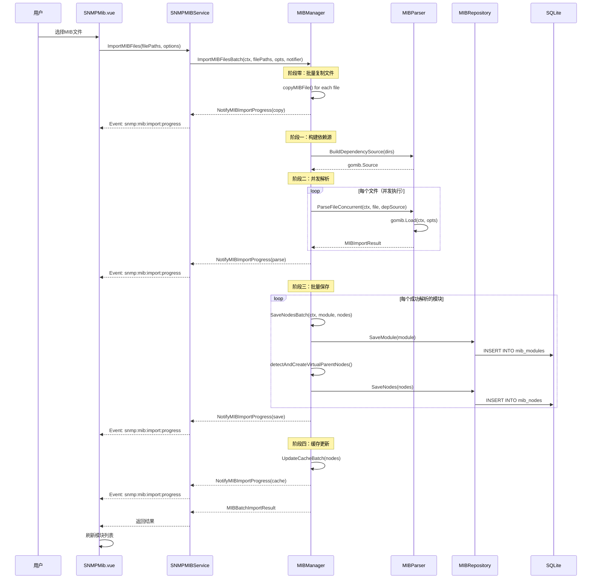
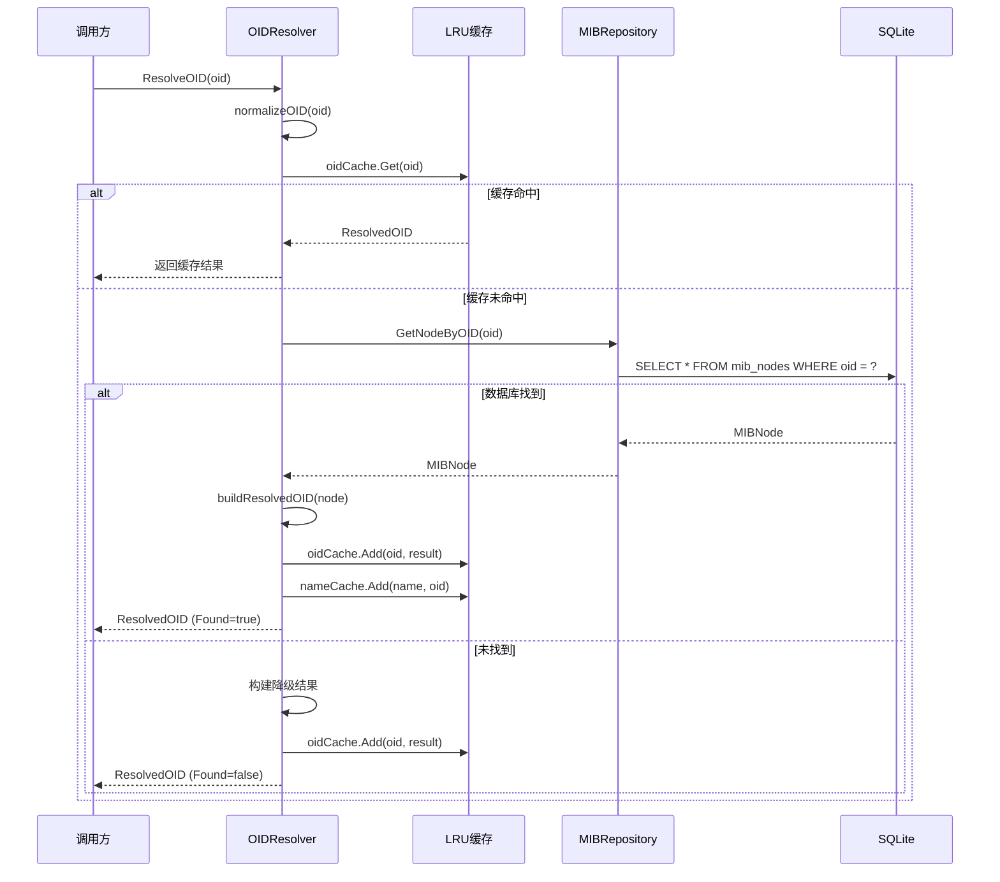
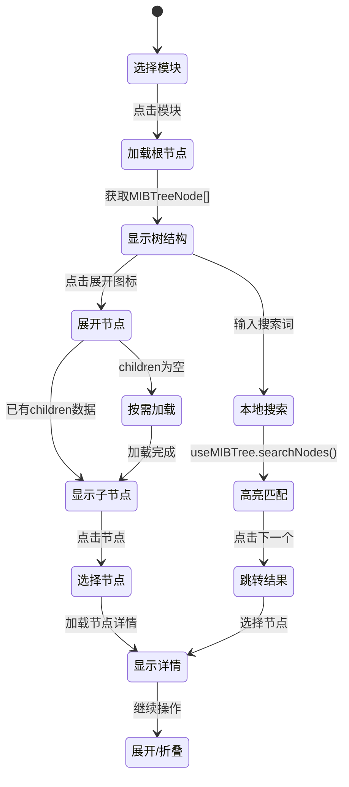
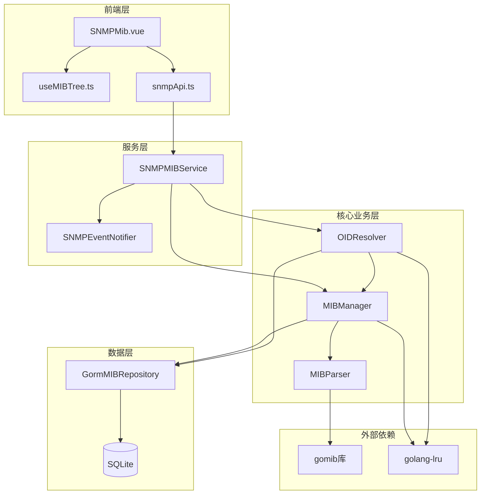

# MIB管理模块功能和逻辑说明书

## 1. 模块概述

### 1.1 整体架构

MIB管理模块采用分层架构设计，负责SNMP MIB文件的导入、解析、存储和查询功能：

```
┌─────────────────────────────────────────────────────────────────────┐
│                      UI Layer (frontend/src)                         │
│  ┌───────────────────────────────────────────────────────────────┐  │
│  │ SNMPMib.vue (主视图)                                           │  │
│  │ - 三栏布局：模块列表 | MIB树 | 节点详情                          │  │
│  │ - 导入进度实时显示                                              │  │
│  │ - OID搜索和树形导航                                             │  │
│  └───────────────────────────────────────────────────────────────┘  │
│                              │                                       │
│        ┌─────────────────────┼─────────────────────┐                │
│        ▼                     ▼                     ▼                │
│  ┌───────────┐    ┌───────────────────┐    ┌───────────────┐        │
│  │ Components│    │ Composables        │    │ Services/API  │        │
│  │ (子组件)   │    │ useMIBTree         │    │ snmpApi       │        │
│  └───────────┘    └───────────────────┘    └───────────────┘        │
└─────────────────────────────────────────────────────────────────────┘
                               │
                               ▼
┌─────────────────────────────────────────────────────────────────────┐
│                 Service Layer (internal/ui)                          │
│  ┌───────────────────────────────────────────────────────────────┐  │
│  │ SNMPMIBService                                                 │  │
│  │ - MIB 模块 CRUD 操作                                          │  │
│  │ - 文件夹管理                                                   │  │
│  │ - 批量导入协调                                                 │  │
│  │ - 实时进度推送 (Wails Events)                                  │  │
│  └───────────────────────────────────────────────────────────────┘  │
└─────────────────────────────────────────────────────────────────────┘
                               │
                               ▼
┌─────────────────────────────────────────────────────────────────────┐
│               Core Business Layer (internal/snmp)                    │
│  ┌─────────────────┐  ┌─────────────────┐  ┌─────────────────────┐ │
│  │ MIBManager      │  │ MIBParser       │  │ OIDResolver         │ │
│  │ - 生命周期管理   │  │ - gomib解析     │  │ - OID↔名称双向解析  │ │
│  │ - LRU缓存       │  │ - 依赖处理      │  │ - 缓存优化          │ │
│  │ - 批量导入      │  │ - 并发解析      │  │ - 模糊匹配          │ │
│  └─────────────────┘  └─────────────────┘  └─────────────────────┘ │
└─────────────────────────────────────────────────────────────────────┘
                               │
                               ▼
┌─────────────────────────────────────────────────────────────────────┐
│              Repository Layer (internal/repository)                  │
│  ┌───────────────────────────────────────────────────────────────┐  │
│  │ GormMIBRepository                                              │  │
│  │ - 模块/节点/文件夹 CRUD                                        │  │
│  │ - 批量操作优化                                                  │  │
│  │ - 级联删除                                                      │  │
│  └───────────────────────────────────────────────────────────────┘  │
└─────────────────────────────────────────────────────────────────────┘
                               │
                               ▼
┌─────────────────────────────────────────────────────────────────────┐
│                 Model Layer (internal/models)                        │
│  ┌───────────────────────────────────────────────────────────────┐  │
│  │ MIBFolder / MIBModule / MIBNode                                │  │
│  └───────────────────────────────────────────────────────────────┘  │
└─────────────────────────────────────────────────────────────────────┘
```

### 1.2 核心数据流说明

MIB管理模块的数据流遵循以下原则：

1. **导入流程**：用户选择文件 → 前端调用API → 后端复制文件 → 并发解析 → 批量保存 → 缓存更新 → 实时进度推送
2. **查询流程**：用户选择模块 → 加载树形结构 → 按需展开节点 → 显示详情
3. **解析流程**：接收OID → LRU缓存查询 → 数据库查询 → 返回结果（支持优雅降级）
4. **删除流程**：用户确认 → 级联删除节点 → 删除模块记录 → 清理缓存

### 1.3 模块职责划分

| 模块 | 路径 | 主要职责 |
|------|------|----------|
| **主视图** | `frontend/src/views/SNMP/SNMPMib.vue` | 三栏布局、状态管理、事件协调 |
| **Composables** | `frontend/src/composables/useMIBTree.ts` | 树形视图逻辑复用（展开/折叠/搜索） |
| **Service** | `internal/ui/snmp_mib_service.go` | Wails API绑定、进度推送、请求协调 |
| **MIBManager** | `internal/snmp/mib_manager.go` | MIB生命周期管理、LRU缓存、批量导入 |
| **MIBParser** | `internal/snmp/mib_parser.go` | MIB文件解析（gomib库封装） |
| **OIDResolver** | `internal/snmp/oid_resolver.go` | OID双向解析、缓存优化 |
| **Repository** | `internal/repository/mib_repository.go` | 数据持久化、批量操作 |
| **Models** | `internal/models/snmp.go` | 数据结构定义 |

---

## 2. 核心数据结构

### 2.1 后端数据模型

#### 2.1.1 MIBFolder - MIB文件夹

```go
// 文件: internal/models/snmp.go
type MIBFolder struct {
    ID        uint      `json:"id" gorm:"primaryKey;autoIncrement"`
    Name      string    `json:"name" gorm:"uniqueIndex;not null"` // 文件夹名称（如 Huawei MIBs）
    CreatedAt time.Time `json:"createdAt"`
    UpdatedAt time.Time `json:"updatedAt"`
}
```

**字段详解**：

| 字段 | 类型 | 说明 | 数据库约束 |
|------|------|------|-----------|
| `ID` | uint | 主键 | 自增 |
| `Name` | string | 文件夹名称 | 唯一索引，非空 |
| `CreatedAt` | time.Time | 创建时间 | 自动填充 |
| `UpdatedAt` | time.Time | 更新时间 | 自动更新 |

#### 2.1.2 MIBModule - MIB模块

```go
// 文件: internal/models/snmp.go
type MIBModule struct {
    ID          uint      `json:"id" gorm:"primaryKey;autoIncrement"`
    FolderID    *uint     `json:"folderId" gorm:"column:folder_id;index"` // 文件夹 ID
    Name        string    `json:"name" gorm:"uniqueIndex;not null"`       // 模块名称 (如 IF-MIB)
    FileName    string    `json:"fileName"`                               // 原始文件名
    Description string    `json:"description"`
    Source      string    `json:"source"`                                // import/manual
    NodeCount   int       `json:"nodeCount"`
    FilePath    string    `json:"filePath"`                              // MIB 文件存储路径
    IsBuiltIn   bool      `json:"isBuiltIn" gorm:"default:false"`        // 是否为内置标准库
    CreatedAt   time.Time `json:"createdAt"`
    UpdatedAt   time.Time `json:"updatedAt"`
}
```

**字段详解**：

| 字段 | 类型 | 说明 | 数据库约束 |
|------|------|------|-----------|
| `ID` | uint | 主键 | 自增 |
| `FolderID` | *uint | 所属文件夹ID | 外键，可为空 |
| `Name` | string | 模块名称（如 IF-MIB） | 唯一索引，非空 |
| `FileName` | string | 原始文件名 | - |
| `Description` | string | 模块描述 | - |
| `Source` | string | 来源类型 | import/manual |
| `NodeCount` | int | 节点数量 | - |
| `FilePath` | string | MIB文件存储路径 | - |
| `IsBuiltIn` | bool | 是否内置标准库 | 默认false |
| `CreatedAt` | time.Time | 创建时间 | 自动填充 |
| `UpdatedAt` | time.Time | 更新时间 | 自动更新 |

#### 2.1.3 MIBNode - MIB节点

```go
// 文件: internal/models/snmp.go
type MIBNode struct {
    ID          uint      `json:"id" gorm:"primaryKey;autoIncrement"`
    ModuleID    *uint     `json:"moduleId" gorm:"column:module_id;index"`
    OID         string    `json:"oid" gorm:"column:oid;uniqueIndex;not null"`
    Name        string    `json:"name" gorm:"column:name;index"`
    ParentOID   string    `json:"parentOid" gorm:"column:parent_oid;index"`
    NodeType    string    `json:"nodeType" gorm:"column:node_type"`    // scalar/table/row/column/notification
    Syntax      string    `json:"syntax" gorm:"column:syntax"`        // INTEGER/OCTET STRING 等
    Access      string    `json:"access" gorm:"column:access"`        // read-only/read-write/not-accessible
    Status      string    `json:"status" gorm:"column:status"`        // current/deprecated/obsolete
    Description string    `json:"description" gorm:"column:description;type:text"`
    Source      string    `json:"source" gorm:"column:source"`        // import/manual
    CreatedAt   time.Time `json:"createdAt" gorm:"column:created_at"`
    UpdatedAt   time.Time `json:"updatedAt" gorm:"column:updated_at"`
}
```

**字段详解**：

| 字段 | 类型 | 说明 | 数据库约束 |
|------|------|------|-----------|
| `ID` | uint | 主键 | 自增 |
| `ModuleID` | *uint | 所属模块ID | 外键索引 |
| `OID` | string | OID标识符 | 唯一索引，非空 |
| `Name` | string | 节点名称 | 索引 |
| `ParentOID` | string | 父节点OID | 索引 |
| `NodeType` | string | 节点类型 | scalar/table/row/column/notification |
| `Syntax` | string | 数据类型 | INTEGER/OCTET STRING等 |
| `Access` | string | 访问权限 | read-only/read-write/not-accessible |
| `Status` | string | 状态 | current/deprecated/obsolete |
| `Description` | string | 描述信息 | TEXT类型 |
| `Source` | string | 来源 | import/manual |
| `CreatedAt` | time.Time | 创建时间 | - |
| `UpdatedAt` | time.Time | 更新时间 | - |

#### 2.1.4 MIBImportResult - 导入结果

```go
// 文件: internal/snmp/mib_parser.go
type MIBImportResult struct {
    Module     *models.MIBModule
    Nodes      []models.MIBNode
    Errors     []ParseError
    NodeCount  int
    ErrorCount int
}
```

#### 2.1.5 MIBBatchImportResult - 批量导入结果

```go
// 文件: internal/snmp/mib_manager.go
type MIBBatchImportResult struct {
    TotalFiles    int
    SuccessCount  int
    FailedCount   int
    SkippedCount  int
    TotalDuration int64
    Results       []FileImportResult
    Errors        []FileImportError
}
```

### 2.2 前端数据结构

#### 2.2.1 MIBModuleVM - 模块视图模型

```typescript
// 文件: internal/ui/snmp_mib_service.go (Wails生成)
interface MIBModuleVM {
  id: number
  folderId: number | null
  name: string
  description: string
  version: string
  nodeCount: number
  importedAt: Date
  status: 'active' | 'error' | 'partial'
  isBuiltIn: boolean
}
```

#### 2.2.2 MIBNodeVM - 节点视图模型

```typescript
// 文件: internal/ui/snmp_mib_service.go (Wails生成)
interface MIBNodeVM {
  id: number
  moduleId: number
  moduleName: string
  oid: string
  name: string
  description: string
  type: string
  access: string
  status: string
  parentId: number | null
  childrenIds: number[]
}
```

#### 2.2.3 MIBTreeNode - 树形节点

```typescript
// 文件: internal/snmp/models.go (Wails生成)
interface MIBTreeNode {
  id: number
  oid: string
  name: string
  nodeType: string
  syntax: string
  access: string
  status: string
  description: string
  children: MIBTreeNode[]
}
```

#### 2.2.4 MIBImportProgress - 导入进度

```typescript
// 文件: frontend/src/types/snmp.ts
interface MIBImportProgress {
  fileName: string
  moduleName: string
  phase: 'parsing' | 'saving' | 'caching' | 'completed' | 'error'
  progress: number
  nodesDone: number
  nodesTotal: number
  error: string
  message: string
  batchId: string
  totalFiles: number
  processedFiles: number
  currentPhase: 'copy' | 'parse' | 'save' | 'cache' | 'done'
}
```

### 2.3 设计要点说明

1. **文件夹分类**：支持将MIB模块按厂商或用途分类存放，便于管理大量MIB文件
2. **内置标识**：`IsBuiltIn`字段区分系统内置MIB和用户导入MIB，内置MIB不可删除
3. **来源追踪**：`Source`字段区分导入节点和手动创建节点，手动节点可编辑
4. **节点类型**：支持scalar（标量）、table（表）、row（行）、column（列）、notification（告警）等类型
5. **LRU缓存**：使用双缓存设计（nodeCache + nameCache）优化OID和名称的双向查询性能

---

## 3. 工作流程

### 3.1 MIB文件导入流程



### 3.2 OID解析流程



### 3.3 MIB树形视图加载流程



### 3.4 核心函数逻辑说明

#### 3.4.1 [`ImportMIBFilesBatch()`](internal/snmp/mib_manager.go:249)

批量导入MIB文件的核心方法，采用5阶段流水线：

1. **阶段零（复制）**：无锁批量复制文件到MIB存储目录
2. **阶段一（构建依赖源）**：预构建不可变的`gomib.Source`对象
3. **阶段二（并发解析）**：使用`errgroup`控制并发度，无锁解析
4. **阶段三（批量保存）**：短锁策略，仅在DB写入时加锁
5. **阶段四（缓存更新）**：独立锁`cacheMu`，不阻塞主锁

锁策略优化：
- 复制/解析阶段完全无锁，最大化并发性能
- 保存阶段使用短锁，减少阻塞时间
- 缓存更新使用独立锁，避免死锁

#### 3.4.2 [`ParseFileConcurrent()`](internal/snmp/mib_parser.go:100)

无锁版本的MIB解析方法：
- 接收预构建的`gomib.Source`依赖源
- 使用`gomib.Load(ctx, opts)`加载MIB文件
- 不修改解析器状态，支持并发调用
- 返回解析结果和错误列表

#### 3.4.3 [`ResolveOID()`](internal/snmp/oid_resolver.go:92)

OID解析核心方法：
- 先查LRU缓存，命中直接返回
- 缓存未命中查询数据库
- 找到节点构建完整解析结果
- 未找到返回优雅降级结果（Found=false）
- 结果写入缓存避免重复查询

#### 3.4.4 [`useMIBTree()`](frontend/src/composables/useMIBTree.ts:48)

MIB树形视图组合式函数：
- 管理展开状态`expandedNodeIds`
- 计算扁平化节点列表`flattenedNodes`
- 提供展开/折叠/全展开/全折叠方法
- 实现本地搜索和高亮匹配

---

## 4. 模块间交互关系

### 4.1 依赖关系图



### 4.2 调用链示例

#### 4.2.1 单文件导入调用链

```
用户点击导入
  └─ SNMPMib.vue: handleImportFiles()
      └─ SNMPMIBAPI.importMIBFiles(filePaths, options)
          └─ SNMPMIBService.ImportMIBFiles(ctx, req)
              └─ MIBManager.ImportMIBFile(ctx, filePath, folderID)
                  ├─ copyMIBFile() → 复制文件
                  ├─ MIBParser.ParseFileWithDependencies()
                  │   └─ gomib.Load() → 解析MIB
                  ├─ MIBRepository.SaveModule()
                  ├─ detectAndCreateVirtualParentNodes()
                  ├─ MIBRepository.SaveNodes()
                  └─ UpdateCacheBatch() → 更新LRU缓存
```

#### 4.2.2 OID解析调用链

```
Trap接收/轮询结果处理
  └─ TrapHandler/Poler
      └─ OIDResolver.ResolveOID(oid)
          ├─ oidCache.Get() → 缓存查询
          ├─ MIBRepository.GetNodeByOID() → 数据库查询
          └─ oidCache.Add() → 缓存写入
```

#### 4.2.3 树形视图加载调用链

```
用户选择模块
  └─ SNMPMib.vue: selectModule(moduleId)
      └─ SNMPMIBAPI.getMIBTree(moduleId)
          └─ SNMPMIBService.GetMIBTree(ctx, moduleID)
              └─ MIBManager.BuildMIBTree(moduleID)
                  ├─ MIBRepository.GetNodesByModule()
                  └─ 构建树形结构 → MIBTreeNode[]
```

### 4.3 事件通知机制

MIB管理模块使用Wails Events实现实时进度推送：

| 事件名 | 触发时机 | 数据结构 |
|--------|----------|----------|
| `snmp:mib:import:progress` | 批量导入各阶段 | `MIBImportProgress` |
| `snmp:mib:imported` | 单模块导入完成 | `MIBModule` |
| `snmp:mib:deleted` | 模块删除完成 | `{moduleID: uint}` |

事件推送流程：
1. `MIBManager`调用`EventNotifier.NotifyMIBImportProgress()`
2. `SNMPEventNotifier`通过Wails Events推送到前端
3. 前端`SNMPMib.vue`监听事件并更新UI

---

## 5. 总结

### 5.1 功能特性总结

| 特性 | 实现方式 | 优势 |
|------|----------|------|
| **批量导入** | 5阶段流水线 + errgroup并发 | 高性能，支持取消 |
| **并发解析** | gomib无锁设计 | 无CGO依赖，天然并发安全 |
| **LRU缓存** | 双缓存（OID+Name） | 双向查询O(1)复杂度 |
| **进度推送** | Wails Events实时推送 | 用户体验友好 |
| **文件夹分类** | FolderID关联 | 支持厂商/用途分类 |
| **虚拟节点** | 自动检测创建 | 解决跨模块引用问题 |
| **优雅降级** | Found标识位 | 未找到OID不报错 |

### 5.2 性能优化策略

| 策略 | 实现细节 | 效果 |
|------|----------|------|
| **锁分离** | 主锁mu + 缓存锁cacheMu | 减少锁竞争 |
| **短锁策略** | 仅DB写入时加锁 | 提高并发度 |
| **批量操作** | SaveNodes批量插入 | 减少DB往返 |
| **缓存预热** | 导入后立即更新缓存 | 避免冷启动 |
| **并发控制** | errgroup.SetLimit(16) | 防止资源耗尽 |

### 5.3 扩展性设计

1. **EventNotifier接口**：解耦Wails依赖，便于替换推送机制
2. **MIBRepository接口**：支持切换数据库实现
3. **gomib库封装**：纯Go实现，无CGO依赖，跨平台兼容
4. **组合式函数**：前端逻辑复用，便于扩展新功能

### 5.4 关键文件索引

| 文件 | 核心功能 |
|------|----------|
| [`mib_manager.go`](internal/snmp/mib_manager.go:1) | MIB生命周期管理、批量导入 |
| [`mib_parser.go`](internal/snmp/mib_parser.go:1) | MIB文件解析、gomib封装 |
| [`oid_resolver.go`](internal/snmp/oid_resolver.go:1) | OID双向解析、缓存优化 |
| [`mib_repository.go`](internal/repository/mib_repository.go:1) | 数据持久化、批量操作 |
| [`snmp_mib_service.go`](internal/ui/snmp_mib_service.go:1) | Wails API绑定、进度推送 |
| [`SNMPMib.vue`](frontend/src/views/SNMP/SNMPMib.vue:1) | 三栏布局、状态管理 |
| [`useMIBTree.ts`](frontend/src/composables/useMIBTree.ts:1) | 树形视图逻辑复用 |
