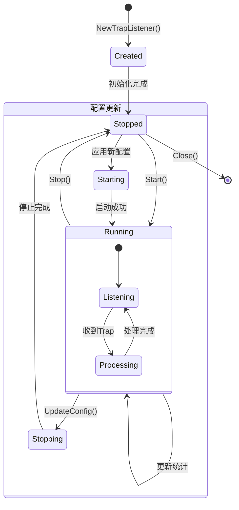
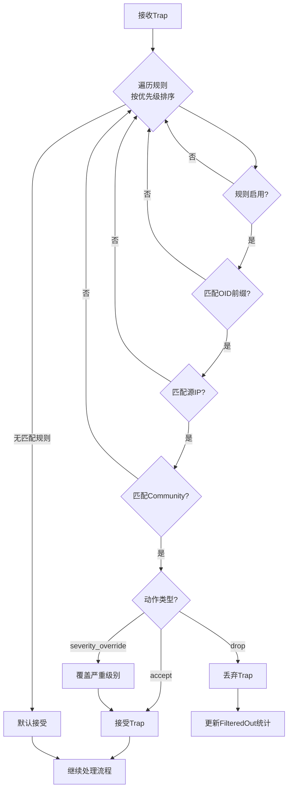
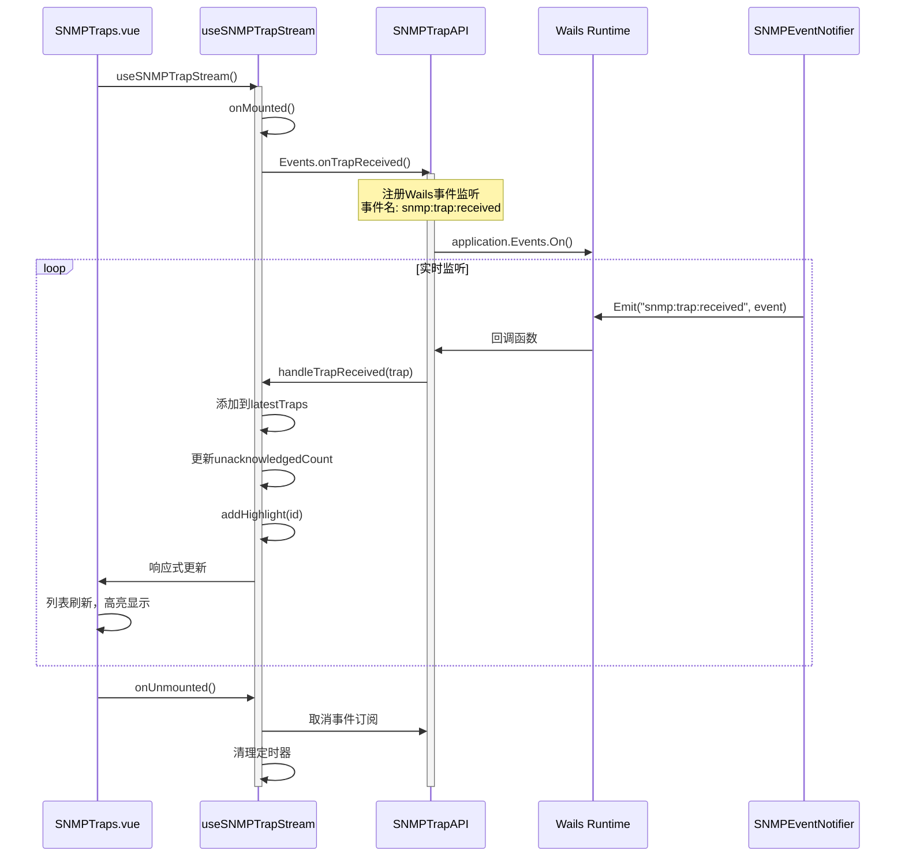
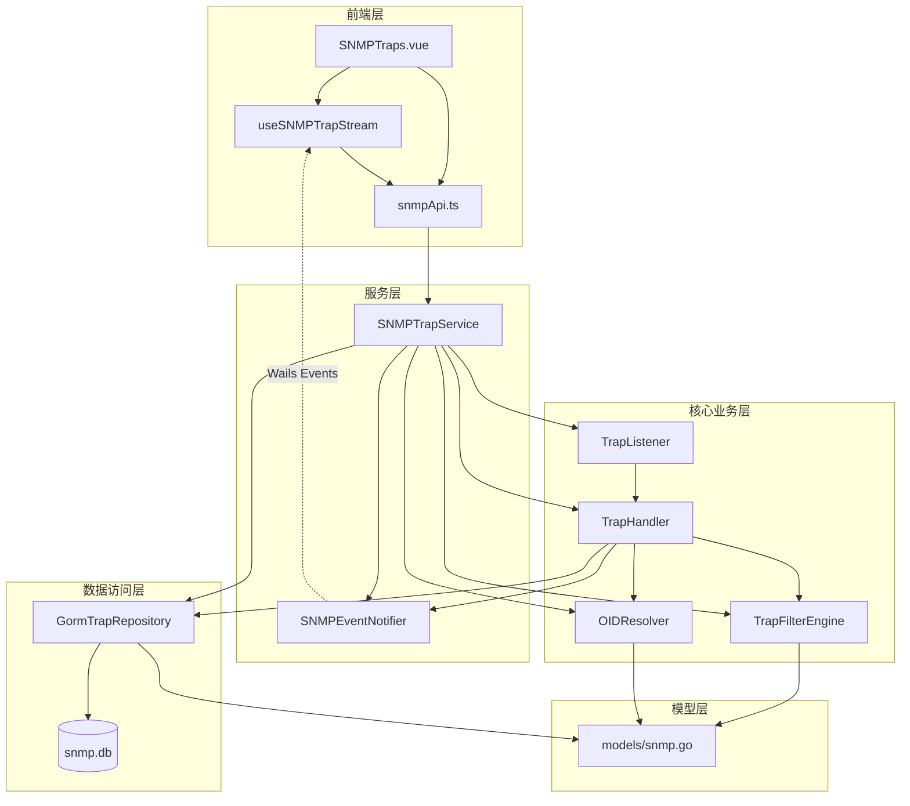

# SNMP Trap模块功能和逻辑说明书

## 1. 模块概述

### 1.1 整体架构

SNMP Trap模块采用分层架构设计，负责SNMP Trap消息的接收、解析、过滤、存储和实时展示功能：

```
┌─────────────────────────────────────────────────────────────────────┐
│                      UI Layer (frontend/src)                         │
│  ┌───────────────────────────────────────────────────────────────┐  │
│  │ SNMPTraps.vue (主视图)                                          │  │
│  │ - 三栏布局：过滤面板 | Trap列表 | 详情面板                        │  │
│  │ - 监听器状态监控和启停控制                                        │  │
│  │ - 实时Trap推送和高亮显示                                         │  │
│  │ - 过滤规则管理                                                   │  │
│  └───────────────────────────────────────────────────────────────┘  │
│                              │                                       │
│        ┌─────────────────────┼─────────────────────┐                │
│        ▼                     ▼                     ▼                │
│  ┌───────────┐    ┌───────────────────┐    ┌───────────────┐        │
│  │ Components│    │ Composables        │    │ Services/API  │        │
│  │ (子组件)   │    │ useSNMPTrapStream  │    │ snmpApi       │        │
│  └───────────┘    └───────────────────┘    └───────────────┘        │
└─────────────────────────────────────────────────────────────────────┘
                                │
                                ▼
┌─────────────────────────────────────────────────────────────────────┐
│                 Service Layer (internal/ui)                          │
│  ┌───────────────────────────────────────────────────────────────┐  │
│  │ SNMPTrapService                                                │  │
│  │ - 监听器生命周期管理                                            │  │
│  │ - Trap记录 CRUD 操作                                           │  │
│  │ - 过滤规则管理                                                  │  │
│  │ - 服务器配置管理                                                │  │
│  │ - v3 用户管理                                                   │  │
│  │ - 数据清理调度                                                  │  │
│  └───────────────────────────────────────────────────────────────┘  │
│  ┌───────────────────────────────────────────────────────────────┐  │
│  │ SNMPEventNotifier                                              │  │
│  │ - Wails Events 事件推送                                         │  │
│  │ - 实时Trap通知                                                  │  │
│  │ - 监听器状态变更通知                                             │  │
│  └───────────────────────────────────────────────────────────────┘  │
└─────────────────────────────────────────────────────────────────────┘
                                │
                                ▼
┌─────────────────────────────────────────────────────────────────────┐
│               Core Business Layer (internal/snmp)                    │
│  ┌─────────────────┐  ┌─────────────────┐  ┌─────────────────────┐ │
│  │ TrapListener    │  │ TrapHandler     │  │ TrapFilterEngine    │ │
│  │ - UDP监听       │  │ - Trap解析      │  │ - 规则匹配          │ │
│  │ - v1/v2c/v3支持 │  │ - OID解析       │  │ - OID前缀匹配       │ │
│  │ - 配置热更新    │  │ - VarBinds处理  │  │ - CIDR IP匹配       │ │
│  │ - 统计收集      │  │ - 严重级别推断  │  │ - 严重级别覆盖      │ │
│  └─────────────────┘  └─────────────────┘  └─────────────────────┘ │
│  ┌─────────────────────────────────────────────────────────────────┐│
│  │ OIDResolver                                                      ││
│  │ - OID ↔ 名称双向解析                                             ││
│  │ - LRU缓存优化                                                    ││
│  └─────────────────────────────────────────────────────────────────┘│
└─────────────────────────────────────────────────────────────────────┘
                                │
                                ▼
┌─────────────────────────────────────────────────────────────────────┐
│              Repository Layer (internal/repository)                   │
│  ┌───────────────────────────────────────────────────────────────┐  │
│  │ GormTrapRepository                                              │  │
│  │ - Trap记录 CRUD（分页、筛选）                                    │  │
│  │ - 过滤规则 CRUD                                                 │  │
│  │ - 服务器配置管理                                                 │  │
│  │ - 统计信息查询                                                   │  │
│  │ - 批量操作优化                                                   │  │
│  └───────────────────────────────────────────────────────────────┘  │
└─────────────────────────────────────────────────────────────────────┘
                                │
                                ▼
┌─────────────────────────────────────────────────────────────────────┐
│                 Model Layer (internal/models)                        │
│  ┌───────────────────────────────────────────────────────────────┐  │
│  │ SNMPServerConfig / SNMPTrapRecord / SNMPTrapFilterRule         │  │
│  └───────────────────────────────────────────────────────────────┘  │
└─────────────────────────────────────────────────────────────────────┘
```

### 1.2 核心数据流说明

SNMP Trap模块的数据流遵循以下原则：

1. **接收流程**：网络设备发送Trap → UDP监听器接收 → 解析SNMP数据包 → 应用过滤规则 → OID名称解析 → 存储数据库 → 实时推送前端
2. **查询流程**：用户设置过滤条件 → 分页查询 → 展示列表 → 点击查看详情
3. **实时推送流程**：Trap存储完成 → EventNotifier发送Wails事件 → 前端监听事件 → 更新列表和高亮显示
4. **配置更新流程**：用户修改配置 → 停止监听器（如运行中）→ 应用新配置 → 重启监听器

### 1.3 模块职责划分

| 模块 | 路径 | 主要职责 |
|------|------|----------|
| **主视图** | `frontend/src/views/SNMP/SNMPTraps.vue` | 三栏布局、状态管理、事件协调 |
| **Composables** | `frontend/src/composables/useSNMPTrapStream.ts` | 实时事件监听、状态同步、通知管理 |
| **Service** | `internal/ui/snmp_trap_service.go` | Wails API绑定、业务协调、配置管理 |
| **EventNotifier** | `internal/ui/snmp_event_notifier.go` | Wails Events事件推送、前后端通信 |
| **TrapListener** | `internal/snmp/trap_listener.go` | UDP监听、v1/v2c/v3支持、生命周期管理 |
| **TrapHandler** | `internal/snmp/trap_handler.go` | Trap解析、OID解析、存储协调 |
| **TrapFilterEngine** | `internal/snmp/trap_filter.go` | 规则匹配、OID前缀匹配、CIDR匹配 |
| **OIDResolver** | `internal/snmp/oid_resolver.go` | OID双向解析、缓存优化 |
| **Repository** | `internal/repository/trap_repository.go` | 数据持久化、批量操作 |
| **Models** | `internal/models/snmp.go` | 数据结构定义 |

---

## 2. 核心数据结构

### 2.1 后端数据模型

#### 2.1.1 SNMPServerConfig - SNMP服务器配置

```go
// 文件: internal/models/snmp.go
type SNMPServerConfig struct {
    ID   uint      `json:"id" gorm:"primaryKey"`
    TrapEnabled      bool   `json:"trapEnabled"`          // Trap 监听开关
    TrapPort         int    `json:"trapPort"`             // Trap 监听端口（默认 1162）
    TrapCommunity    string `json:"trapCommunity"`        // v1/v2c Community 过滤（空=接受所有）
    V3Enabled        bool   `json:"v3Enabled"`            // SNMPv3 开关
    V3Username       string `json:"v3Username"`
    V3AuthProtocol   string `json:"v3AuthProtocol"`       // MD5/SHA
    V3AuthPassword   string `json:"v3AuthPassword"`       // 加密存储
    V3PrivProtocol   string `json:"v3PrivProtocol"`       // DES/AES
    V3PrivPassword   string `json:"v3PrivPassword"`       // 加密存储
    V3EngineID       string `json:"v3EngineID"`
    MaxStorageDays   int    `json:"maxStorageDays"`       // 告警最大保留天数（0=永久）
    PollingEnabled   bool   `json:"pollingEnabled"`       // 轮询调度总开关
    MaxPollingWorkers int   `json:"maxPollingWorkers"`    // 最大并发轮询数（默认 10）
    PollingResultRetentionDays int `json:"pollingResultRetentionDays"` // 轮询数据保留天数（默认 7）
    CreatedAt        time.Time `json:"createdAt"`
    UpdatedAt        time.Time `json:"updatedAt"`
}
```

**字段详解**：

| 字段 | 类型 | 说明 | 数据库约束 |
|------|------|------|-----------|
| `ID` | uint | 主键 | 自增 |
| `TrapEnabled` | bool | Trap监听开关 | 默认false |
| `TrapPort` | int | 监听端口 | 默认1162（非特权端口） |
| `TrapCommunity` | string | Community过滤 | 空表示接受所有 |
| `V3Enabled` | bool | SNMPv3开关 | 阶段4实现 |
| `V3Username` | string | v3用户名 | - |
| `V3AuthProtocol` | string | 认证协议 | MD5/SHA |
| `V3AuthPassword` | string | 认证密码 | AES-256加密存储 |
| `V3PrivProtocol` | string | 加密协议 | DES/AES |
| `V3PrivPassword` | string | 加密密码 | AES-256加密存储 |
| `V3EngineID` | string | 引擎ID | - |
| `MaxStorageDays` | int | 数据保留天数 | 0=永久保留 |
| `PollingEnabled` | bool | 轮询开关 | 默认false |
| `MaxPollingWorkers` | int | 最大并发数 | 默认10 |
| `PollingResultRetentionDays` | int | 轮询结果保留天数 | 默认7 |
| `CreatedAt` | time.Time | 创建时间 | 自动填充 |
| `UpdatedAt` | time.Time | 更新时间 | 自动更新 |

#### 2.1.2 SNMPTrapRecord - Trap告警记录

```go
// 文件: internal/models/snmp.go
type SNMPTrapRecord struct {
    ID             uint       `json:"id" gorm:"primaryKey;autoIncrement"`
    SourceIP       string     `json:"sourceIP" gorm:"column:source_ip;index"`
    SourcePort     int        `json:"sourcePort" gorm:"column:source_port"`
    Version        string     `json:"version" gorm:"column:version"`                 // v1/v2c/v3
    Community      string     `json:"community" gorm:"column:community"`
    TrapOID        string     `json:"trapOID" gorm:"column:trap_oid;index"`
    TrapName       string     `json:"trapName" gorm:"column:trap_name"`              // MIB 解析后名称
    Enterprise     string     `json:"enterprise" gorm:"column:enterprise"`           // Enterprise OID（v1）
    GenericTrap    int        `json:"genericTrap" gorm:"column:generic_trap"`        // Generic Trap 类型（v1）
    SpecificTrap   int        `json:"specificTrap" gorm:"column:specific_trap"`      // Specific Trap 类型（v1）
    Severity       string     `json:"severity" gorm:"column:severity;index"`         // critical/major/minor/info/unknown
    Variables      string     `json:"variables" gorm:"column:variables;type:text"`   // VarBinds JSON 序列化
    RawHex         string     `json:"rawHex" gorm:"column:raw_hex;type:text"`
    Acknowledged   bool       `json:"acknowledged" gorm:"column:acknowledged"`
    AcknowledgedAt *time.Time `json:"acknowledgedAt" gorm:"column:acknowledged_at"`
    ReceivedAt     time.Time  `json:"receivedAt" gorm:"column:received_at;index"`
    CreatedAt      time.Time  `json:"createdAt" gorm:"column:created_at"`
}
```

**字段详解**：

| 字段 | 类型 | 说明 | 数据库约束 |
|------|------|------|-----------|
| `ID` | uint | 主键 | 自增 |
| `SourceIP` | string | 来源IP地址 | 索引 |
| `SourcePort` | int | 来源端口 | - |
| `Version` | string | SNMP版本 | v1/v2c/v3 |
| `Community` | string | Community字符串 | - |
| `TrapOID` | string | Trap OID标识符 | 索引 |
| `TrapName` | string | MIB解析后的名称 | - |
| `Enterprise` | string | Enterprise OID | v1专用 |
| `GenericTrap` | int | 通用Trap类型 | 0-6 |
| `SpecificTrap` | int | 特定Trap类型 | v1专用 |
| `Severity` | string | 严重级别 | 索引，critical/major/minor/info/unknown |
| `Variables` | string | VarBinds JSON | TEXT类型 |
| `RawHex` | string | 原始十六进制 | TEXT类型 |
| `Acknowledged` | bool | 是否已确认 | 默认false |
| `AcknowledgedAt` | *time.Time | 确认时间 | 可空 |
| `ReceivedAt` | time.Time | 接收时间 | 索引 |
| `CreatedAt` | time.Time | 创建时间 | - |

#### 2.1.3 SNMPTrapFilterRule - 过滤规则

```go
// 文件: internal/models/snmp.go
type SNMPTrapFilterRule struct {
    ID               uint      `json:"id" gorm:"primaryKey;autoIncrement"`
    Name             string    `json:"name" gorm:"uniqueIndex;not null"`
    Enabled          bool      `json:"enabled"`
    Priority         int       `json:"priority"`             // 值越小越先匹配
    Action           string    `json:"action"`               // accept/drop/severity_override
    SourceIPPattern  string    `json:"sourceIPPattern"`      // 来源 IP（支持 CIDR）
    OIDPattern       string    `json:"oidPattern"`           // OID 前缀匹配
    CommunityPattern string    `json:"communityPattern"`
    OverrideSeverity string    `json:"overrideSeverity"`     // 覆盖严重级别
    Description      string    `json:"description"`
    CreatedAt        time.Time `json:"createdAt"`
    UpdatedAt        time.Time `json:"updatedAt"`
}
```

**字段详解**：

| 字段 | 类型 | 说明 | 数据库约束 |
|------|------|------|-----------|
| `ID` | uint | 主键 | 自增 |
| `Name` | string | 规则名称 | 唯一索引，非空 |
| `Enabled` | bool | 是否启用 | 默认true |
| `Priority` | int | 优先级 | 值越小越先匹配 |
| `Action` | string | 动作类型 | accept/drop/severity_override |
| `SourceIPPattern` | string | 源IP模式 | 支持CIDR格式 |
| `OIDPattern` | string | OID模式 | 前缀匹配 |
| `CommunityPattern` | string | Community模式 | 精确匹配 |
| `OverrideSeverity` | string | 覆盖严重级别 | 仅severity_override动作有效 |
| `Description` | string | 描述信息 | - |
| `CreatedAt` | time.Time | 创建时间 | - |
| `UpdatedAt` | time.Time | 更新时间 | - |

#### 2.1.4 V3UserConfig - SNMPv3用户配置

```go
// 文件: internal/snmp/trap_listener.go
type V3UserConfig struct {
    Username      string `json:"username"`
    AuthProtocol  string `json:"authProtocol"`  // MD5/SHA/SHA224/SHA256/SHA384/SHA512
    AuthKey       string `json:"authKey"`       // 认证密钥（明文，运行时使用）
    PrivProtocol  string `json:"privProtocol"`  // DES/AES/AES192/AES256/AES192C/AES256C
    PrivKey       string `json:"privKey"`       // 加密密钥（明文，运行时使用）
    SecurityLevel string `json:"securityLevel"` // noAuthNoPriv/authNoPriv/authPriv
}
```

**字段详解**：

| 字段 | 类型 | 说明 |
|------|------|------|
| `Username` | string | v3用户名 |
| `AuthProtocol` | string | 认证协议 |
| `AuthKey` | string | 认证密钥 |
| `PrivProtocol` | string | 加密协议 |
| `PrivKey` | string | 加密密钥 |
| `SecurityLevel` | string | 安全级别 |

### 2.2 前端数据模型

#### 2.2.1 TrapRecordVM - Trap记录视图模型

```typescript
// 文件: frontend/src/bindings/github.com/NetWeaverGo/core/internal/ui/models.ts
export interface TrapRecordVM {
    id: number
    sourceIP: string
    sourcePort: number
    version: string
    community: string
    trapOID: string
    trapName: string
    enterprise: string
    genericTrap: number
    specificTrap: number
    severity: string
    variables: string
    acknowledged: boolean
    acknowledgedAt: string
    receivedAt: string
}
```

#### 2.2.2 ListenerStatusVM - 监听器状态视图模型

```typescript
// 文件: frontend/src/bindings/github.com/NetWeaverGo/core/internal/ui/models.ts
export interface ListenerStatusVM {
    isRunning: boolean
    listenAddr: string
    totalTraps: number
    filteredOut: number
    lastTrapTime: string
    startTime: string
    handlerStats: HandlerStatsVM
}
```

#### 2.2.3 TrapStatsVM - 统计信息视图模型

```typescript
// 文件: frontend/src/bindings/github.com/NetWeaverGo/core/internal/ui/models.ts
export interface TrapStatsVM {
    totalCount: number
    unacknowledged: number
    criticalCount: number
    majorCount: number
    minorCount: number
    infoCount: number
    todayCount: number
    lastHourCount: number
}
```

#### 2.2.4 TrapEvent - 实时Trap事件

```typescript
// 文件: frontend/src/composables/useSNMPTrapStream.ts
export interface TrapEvent {
    sourceIP: string
    sourcePort: number
    trapOID: string
    trapName: string
    severity: string
    community: string
    version: string
    receivedAt: string
}
```

### 2.3 设计要点说明

1. **独立数据库存储**：SNMP相关数据存储在独立的`snmp.db`数据库中，与主库隔离
2. **索引优化**：对常用查询字段（SourceIP、TrapOID、Severity、ReceivedAt）建立索引
3. **JSON序列化**：VarBinds使用JSON格式存储，支持灵活的变量绑定数据
4. **软删除支持**：通过Acknowledged字段实现告警确认机制
5. **实时推送优化**：TrapEvent仅包含轻量级字段，减少事件传输开销

---

## 3. 工作流程

### 3.1 Trap接收和处理流程

```mermaid
sequenceDiagram
    participant Device as 网络设备
    participant Listener as TrapListener
    participant Handler as TrapHandler
    participant Filter as TrapFilterEngine
    participant Resolver as OIDResolver
    participant Repo as TrapRepository
    participant Notifier as EventNotifier
    participant Frontend as 前端UI

    Device->>Listener: 发送SNMP Trap (UDP)
    activate Listener
    
    Listener->>Listener: 更新统计 (TotalTraps++)
    Listener->>Handler: HandleTrap(packet, addr)
    activate Handler
    
    Handler->>Handler: parseTrap(packet, addr)
    Note over Handler: 解析SNMP版本<br/>提取Trap OID<br/>解析VarBinds
    
    Handler->>Filter: ApplyFilter(trap)
    activate Filter
    
    alt 规则动作 = drop
        Filter-->>Handler: FilterResult{action: "drop"}
        Handler->>Listener: 更新统计 (FilteredOut++)
        Handler-->>Listener: 返回（不存储）
    else 规则动作 = accept/severity_override
        Filter-->>Handler: FilterResult{action, overrideSeverity}
        
        if action == severity_override
            Handler->>Handler: trap.Severity = overrideSeverity
        end
        
        Handler->>Resolver: ResolveOID(trap.TrapOID)
        activate Resolver
        Resolver-->>Handler: ResolvedOID{Name, Found}
        deactivate Resolver
        
        if Found
            Handler->>Handler: trap.TrapName = resolved.Name
        end
        
        Handler->>Handler: resolveVarBinds(trap)
        
        Handler->>Repo: CreateTrap(ctx, trap)
        activate Repo
        Repo-->>Handler: 成功
        deactivate Repo
        
        Handler->>Handler: stats.TotalStored++
        
        Handler->>Notifier: NotifyTrapReceived(trapEvent)
        activate Notifier
        Notifier->>Frontend: Wails Event: snmp:trap:received
        deactivate Notifier
        
        Handler-->>Listener: 处理完成
    end
    deactivate Filter
    deactivate Handler
    deactivate Listener
    
    Frontend->>Frontend: 收到事件，更新列表
    Frontend->>Frontend: 高亮新Trap (5秒)
```

### 3.2 监听器生命周期管理



### 3.3 过滤规则匹配流程



### 3.4 前端实时事件监听流程



---

## 4. 模块间交互关系

### 4.1 依赖关系图



### 4.2 调用链示例

#### 4.2.1 启动监听器调用链

```
用户点击"启动"按钮
    │
    ▼
SNMPTraps.vue::startListener()
    │
    ▼
SNMPTrapAPI.startListener(config)  [frontend/src/services/snmpApi.ts]
    │
    ▼
Wails Runtime: 调用后端方法
    │
    ▼
SNMPTrapService.StartListener(ctx, config)  [internal/ui/snmp_trap_service.go:58]
    │
    ├── 转换 ViewModel → Model
    │
    ├── 检查监听器状态
    │   └── listener.IsRunning()
    │
    ├── 如运行中，先停止
    │   └── listener.Stop()
    │
    ├── 更新监听器配置
    │   └── listener.UpdateConfig(modelConfig)
    │
    └── 启动监听器
        └── listener.Start()  [internal/snmp/trap_listener.go:166]
            │
            ├── 创建gosnmp.TrapListener
            │
            ├── 设置Trap回调
            │   └── trapListener.OnNewTrap = func(p, addr)
            │
            └── 启动UDP监听
                └── trapListener.Listen(listenAddr)
```

#### 4.2.2 Trap处理调用链

```
网络设备发送Trap
    │
    ▼
gosnmp.TrapListener接收UDP包
    │
    ▼
TrapListener.OnNewTrap回调  [internal/snmp/trap_listener.go:189]
    │
    ├── 更新统计
    │   └── stats.TotalTraps++
    │
    └── 调用处理器
        └── handler.HandleTrap(packet, addr)  [internal/snmp/trap_handler.go:89]
            │
            ├── 解析Trap数据包
            │   └── parseTrap(packet, addr)  [:211]
            │       ├── 解析版本 (v1/v2c/v3)
            │       ├── 提取Trap OID
            │       └── 解析VarBinds
            │
            ├── 应用过滤规则
            │   └── filter.ApplyFilter(trap)  [internal/snmp/trap_filter.go:354]
            │       ├── 遍历规则（按优先级）
            │       ├── 匹配OID前缀
            │       ├── 匹配源IP（CIDR）
            │       └── 返回动作
            │
            ├── 如动作=drop，返回
            │
            ├── OID名称解析
            │   └── resolver.ResolveOID(trap.TrapOID)
            │
            ├── 存储到数据库
            │   └── repo.CreateTrap(ctx, trap)  [internal/repository/trap_repository.go]
            │
            └── 推送实时事件
                └── notifier.NotifyTrapReceived(event)  [internal/ui/snmp_event_notifier.go:125]
                    │
                    └── wailsApp.Emit("snmp:trap:received", event)
```

#### 4.2.3 前端实时更新调用链

```
后端发送Wails事件
    │
    ▼
Wails Runtime分发事件
    │
    ▼
SNMPTrapEvents.onTrapReceived回调  [frontend/src/services/snmpApi.ts]
    │
    ▼
useSNMPTrapStream.handleTrapReceived  [frontend/src/composables/useSNMPTrapStream.ts:170]
    │
    ├── 转换TrapEvent → TrapRecordVM
    │
    ├── 添加到latestTraps列表头部
    │   └── latestTraps.value.unshift(record)
    │
    ├── 限制缓存大小（100条）
    │   └── latestTraps.value.slice(0, MAX_LATEST_TRAPS)
    │
    ├── 添加高亮效果
    │   └── addHighlight(id)
    │       └── setTimeout(5000ms后移除高亮)
    │
    └── 更新未确认计数
        └── unacknowledgedCount.value++
```

---

## 5. 核心函数逻辑说明

### 5.1 TrapListener核心方法

#### 5.1.1 Start() - 启动监听

```go
// 文件: internal/snmp/trap_listener.go:166
func (l *TrapListener) Start() error {
    l.mu.Lock()
    defer l.mu.Unlock()
    
    // 1. 检查是否已在运行
    if l.running {
        return fmt.Errorf("监听器已在运行中")
    }
    
    // 2. 构建监听地址
    listenAddr := fmt.Sprintf("0.0.0.0:%d", l.config.TrapPort)
    
    // 3. 创建gosnmp监听器
    trapListener := gosnmp.NewTrapListener()
    
    // 4. 设置Trap处理回调
    trapListener.OnNewTrap = func(p *gosnmp.SnmpPacket, addr *net.UDPAddr) {
        // 更新统计
        l.mu.Lock()
        l.stats.TotalTraps++
        l.stats.LastTrapTime = time.Now()
        l.mu.Unlock()
        
        // 调用处理器
        if l.handler != nil {
            l.handler.HandleTrap(p, addr)
        }
    }
    
    // 5. 在独立goroutine中启动监听
    go func() {
        err := trapListener.Listen(listenAddr)
        if err != nil {
            select {
            case <-l.stopCh:
                // 正常停止
            default:
                logger.Error("监听器异常退出: %v", err)
                l.setRunning(false)
            }
        }
    }()
    
    // 6. 更新状态
    l.running = true
    l.stats.IsRunning = true
    l.stats.StartTime = time.Now()
    
    // 7. 通知状态变更
    if l.notifier != nil {
        l.notifier.NotifyListenerStatus(&l.stats)
    }
    
    return nil
}
```

#### 5.1.2 UpdateConfig() - 配置热更新

```go
// 文件: internal/snmp/trap_listener.go:302
func (l *TrapListener) UpdateConfig(config *models.SNMPServerConfig) {
    if config == nil {
        return
    }
    
    // 通过channel异步传递配置，避免死锁
    select {
    case l.configChan <- config:
        logger.Info("配置更新请求已提交: 端口=%d", config.TrapPort)
    default:
        // channel满时丢弃旧配置
        select {
        case <-l.configChan:
        default:
        }
        l.configChan <- config
    }
}

// 配置处理goroutine
func (l *TrapListener) configLoop() {
    for config := range l.configChan {
        l.applyConfig(config)
    }
}

func (l *TrapListener) applyConfig(config *models.SNMPServerConfig) {
    // 读取当前运行状态
    l.mu.Lock()
    wasRunning := l.running
    l.config = config
    l.mu.Unlock()
    
    // 如果正在运行，先停止再重启
    if wasRunning {
        l.Stop()
        l.Start()
    }
}
```

### 5.2 TrapHandler核心方法

#### 5.2.1 HandleTrap() - 处理Trap

```go
// 文件: internal/snmp/trap_handler.go:89
func (h *TrapHandler) HandleTrap(packet *gosnmp.SnmpPacket, addr *net.UDPAddr) error {
    // 1. 更新接收统计
    h.stats.TotalReceived++
    
    // 2. 解析Trap数据包
    trap, err := h.parseTrap(packet, addr)
    if err != nil {
        h.stats.TotalErrors++
        return err
    }
    
    // 3. 应用过滤规则
    if h.filter != nil {
        result := h.filter.ApplyFilter(trap)
        if result.Action == "drop" {
            h.stats.TotalFiltered++
            return nil
        }
        // 应用严重级别覆盖
        if result.Action == "severity_override" {
            trap.Severity = result.OverrideSeverity
        }
    }
    
    // 4. OID名称解析
    if h.resolver != nil {
        resolved, _ := h.resolver.ResolveOID(trap.TrapOID)
        if resolved.Found {
            trap.TrapName = resolved.Name
        }
        h.resolveVarBinds(trap)
    }
    
    // 5. 存储到数据库（带超时）
    ctx, cancel := context.WithTimeout(context.Background(), h.timeout)
    defer cancel()
    
    if err := h.repo.CreateTrap(ctx, trap); err != nil {
        h.stats.TotalErrors++
        return err
    }
    
    h.stats.TotalStored++
    
    // 6. 推送实时事件
    if h.notifier != nil {
        h.notifier.NotifyTrapReceived(TrapEvent{
            SourceIP:   trap.SourceIP,
            TrapOID:    trap.TrapOID,
            TrapName:   trap.TrapName,
            Severity:   trap.Severity,
            ReceivedAt: trap.ReceivedAt.UnixMilli(),
        })
    }
    
    return nil
}
```

#### 5.2.2 parseTrap() - 解析Trap数据包

```go
// 文件: internal/snmp/trap_handler.go:211
func (h *TrapHandler) parseTrap(packet *gosnmp.SnmpPacket, addr *net.UDPAddr) (*models.SNMPTrapRecord, error) {
    trap := &models.SNMPTrapRecord{
        SourceIP:   addr.IP.String(),
        SourcePort: addr.Port,
        Community:  string(packet.Community),
        ReceivedAt: time.Now(),
    }
    
    // 根据SNMP版本解析
    switch packet.Version {
    case gosnmp.Version1:
        trap.Version = "v1"
        h.parseV1Trap(packet, trap)
        // v1 Trap: 从Enterprise + GenericTrap/SpecificTrap推导OID
        
    case gosnmp.Version2c:
        trap.Version = "v2c"
        h.parseV2cTrap(packet, trap)
        // v2c Trap: 从snmpTrapOID.0 (1.3.6.1.6.3.1.1.4.1.0) 获取OID
        
    case gosnmp.Version3:
        trap.Version = "v3"
        h.parseV3Trap(packet, trap)
        // v3 Trap: 格式与v2c类似
    }
    
    // 解析VarBinds
    vars, rawHex := h.parseVarBinds(packet.Variables)
    trap.Variables = vars
    trap.RawHex = rawHex
    
    // 推断严重级别
    if trap.Severity == "" {
        trap.Severity = h.inferSeverity(trap)
    }
    
    return trap, nil
}
```

### 5.3 TrapFilterEngine核心方法

#### 5.3.1 ApplyFilter() - 应用过滤规则

```go
// 文件: internal/snmp/trap_filter.go:354
func (e *TrapFilterEngine) ApplyFilter(trap *models.SNMPTrapRecord) FilterResult {
    matched, rule, _ := e.Match(trap)
    
    if !matched || rule == nil {
        return FilterResult{Action: "accept"}
    }
    
    return FilterResult{
        Action:         rule.Action,
        OverrideSeverity: rule.OverrideSeverity,
        RuleID:         rule.ID,
        RuleName:       rule.Name,
    }
}

// Match - 规则匹配
func (e *TrapFilterEngine) Match(trap *models.SNMPTrapRecord) (bool, *models.SNMPTrapFilterRule, error) {
    e.mu.RLock()
    defer e.mu.RUnlock()
    
    for _, rule := range e.rules {
        if !rule.Enabled {
            continue
        }
        
        matched, _ := e.matchRule(trap, rule)
        if matched {
            return true, rule, nil
        }
    }
    
    return false, nil, nil
}
```

#### 5.3.2 matchRule() - 单规则匹配

```go
// 文件: internal/snmp/trap_filter.go:216
func (e *TrapFilterEngine) matchRule(trap *models.SNMPTrapRecord, rule *models.SNMPTrapFilterRule) (bool, error) {
    // 1. OID前缀匹配
    if rule.OIDPattern != "" {
        if !e.matchOIDPrefix(trap.TrapOID, rule.OIDPattern) {
            return false, nil
        }
    }
    
    // 2. 源IP匹配（支持CIDR）
    if rule.SourceIPPattern != "" {
        if !e.matchSourceIP(trap.SourceIP, rule) {
            return false, nil
        }
    }
    
    // 3. Community匹配
    if rule.CommunityPattern != "" {
        if !e.matchCommunity(trap.Community, rule.CommunityPattern) {
            return false, nil
        }
    }
    
    return true, nil
}
```

### 5.4 前端核心方法

#### 5.4.1 useSNMPTrapStream - 事件监听

```typescript
// 文件: frontend/src/composables/useSNMPTrapStream.ts:106
function startListening() {
    if (isConnected.value) return
    
    try {
        // 监听Trap接收事件
        const unsubTrap = SNMPTrapEvents.onTrapReceived((trap: unknown) => {
            const trapEvent = trap as TrapEvent
            handleTrapReceived(trapEvent)
        })
        unsubscribers.push(unsubTrap)
        
        // 监听监听器状态变更事件
        const unsubStatus = SNMPTrapEvents.onListenerStatusChanged((status: unknown) => {
            const statusVM = status as ListenerStatusVM
            listenerStatus.value = statusVM
        })
        unsubscribers.push(unsubStatus)
        
        // 监听统计更新事件
        const unsubStats = SNMPTrapEvents.onTrapStats((stats: unknown) => {
            const statsVM = stats as TrapStatsVM
            trapStats.value = statsVM
            unacknowledgedCount.value = statsVM.unacknowledged
        })
        unsubscribers.push(unsubStats)
        
        isConnected.value = true
    } catch (error) {
        logger.error('启动Trap事件监听失败', error)
        isConnected.value = false
    }
}
```

#### 5.4.2 handleTrapReceived - 处理接收到的Trap

```typescript
// 文件: frontend/src/composables/useSNMPTrapStream.ts:170
function handleTrapReceived(trap: TrapEvent) {
    // 转换为TrapRecordVM格式
    const record: Partial<TrapRecordVM> = {
        id: generateTempId(),
        sourceIP: trap.sourceIP,
        sourcePort: trap.sourcePort,
        version: trap.version,
        community: trap.community,
        trapOID: trap.trapOID,
        trapName: trap.trapName,
        severity: trap.severity,
        variables: '',
        acknowledged: false,
        acknowledgedAt: '',
        receivedAt: new Date(trap.receivedAt).toLocaleString('zh-CN'),
    }
    
    // 添加到最新列表头部
    latestTraps.value.unshift(record as TrapRecordVM)
    
    // 限制缓存大小
    if (latestTraps.value.length > MAX_LATEST_TRAPS) {
        latestTraps.value = latestTraps.value.slice(0, MAX_LATEST_TRAPS)
    }
    
    // 添加高亮效果
    addHighlight(record.id!)
    
    // 更新未确认计数
    unacknowledgedCount.value++
}
```

---

## 6. 总结表格

### 6.1 模块功能总结

| 模块 | 核心功能 | 关键技术点 |
|------|----------|-----------|
| **TrapListener** | UDP监听、生命周期管理 | gosnmp库、goroutine并发、channel配置热更新 |
| **TrapHandler** | Trap解析、存储协调 | SNMP协议解析、OID解析、超时控制 |
| **TrapFilterEngine** | 规则匹配、过滤动作 | OID前缀匹配、CIDR IP匹配、优先级排序 |
| **OIDResolver** | OID双向解析 | LRU缓存、数据库查询、优雅降级 |
| **SNMPTrapService** | Wails API绑定 | ViewModel转换、业务协调、配置管理 |
| **SNMPEventNotifier** | 实时事件推送 | Wails Events、前后端通信 |
| **SNMPTraps.vue** | 用户界面 | 三栏布局、实时更新、高亮效果 |
| **useSNMPTrapStream** | 实时状态管理 | 事件监听、响应式状态、通知管理 |

### 6.2 数据流总结

| 流程 | 起点 | 终点 | 关键节点 |
|------|------|------|----------|
| **Trap接收** | 网络设备 | 数据库 | UDP监听 → 解析 → 过滤 → 存储 → 推送 |
| **实时通知** | 后端存储完成 | 前端UI更新 | EventNotifier → Wails Events → Composable |
| **配置更新** | 前端配置修改 | 监听器重启 | Service → Listener.Stop/Start |
| **规则管理** | 前端CRUD操作 | 过滤引擎更新 | Service → FilterEngine.AddRule/UpdateRule |

### 6.3 性能优化要点

| 优化项 | 实现方式 | 效果 |
|--------|----------|------|
| **LRU缓存** | OIDResolver使用LRU缓存 | 减少数据库查询，提升解析速度 |
| **批量操作** | Repository批量插入 | 减少数据库连接开销 |
| **事件轻量化** | TrapEvent仅包含必要字段 | 减少事件传输开销 |
| **配置异步更新** | channel传递配置变更 | 避免死锁，非阻塞更新 |
| **前端缓存限制** | latestTraps限制100条 | 控制内存使用 |

### 6.4 扩展性设计

| 扩展点 | 当前实现 | 扩展方向 |
|--------|----------|----------|
| **SNMP版本** | v1/v2c完整支持，v3基础支持 | 完善v3认证加密机制 |
| **过滤规则** | OID前缀、IP CIDR、Community | 支持正则表达式、时间范围 |
| **通知方式** | 前端实时推送、声音提示 | 邮件、短信、Webhook通知 |
| **数据存储** | SQLite独立数据库 | 支持MySQL、PostgreSQL |
| **高可用** | 单实例监听 | 集群部署、负载均衡 |
