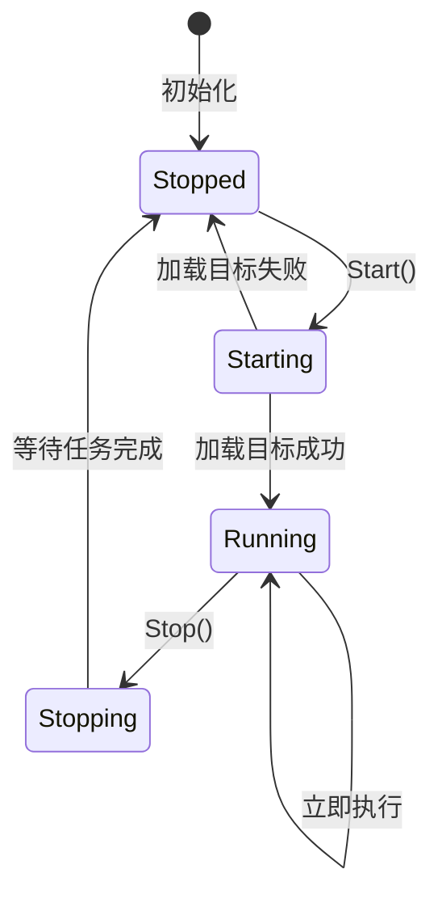
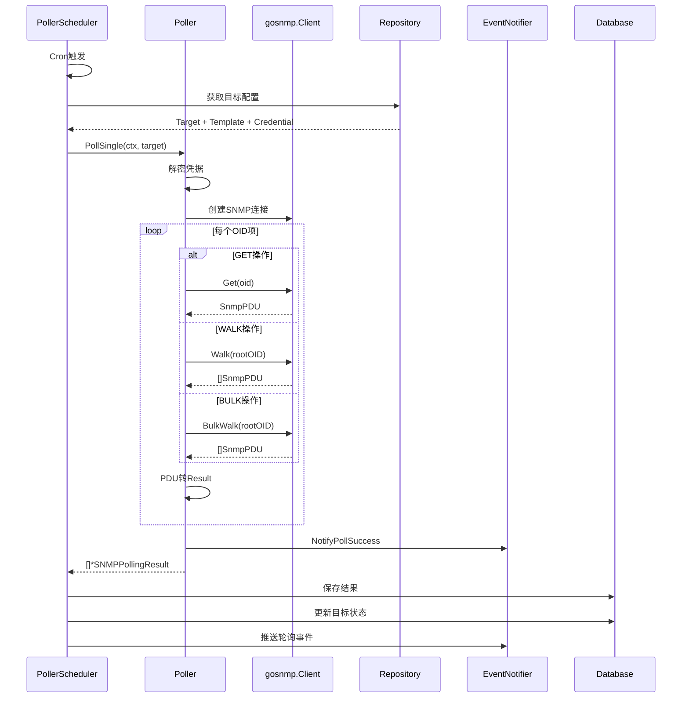
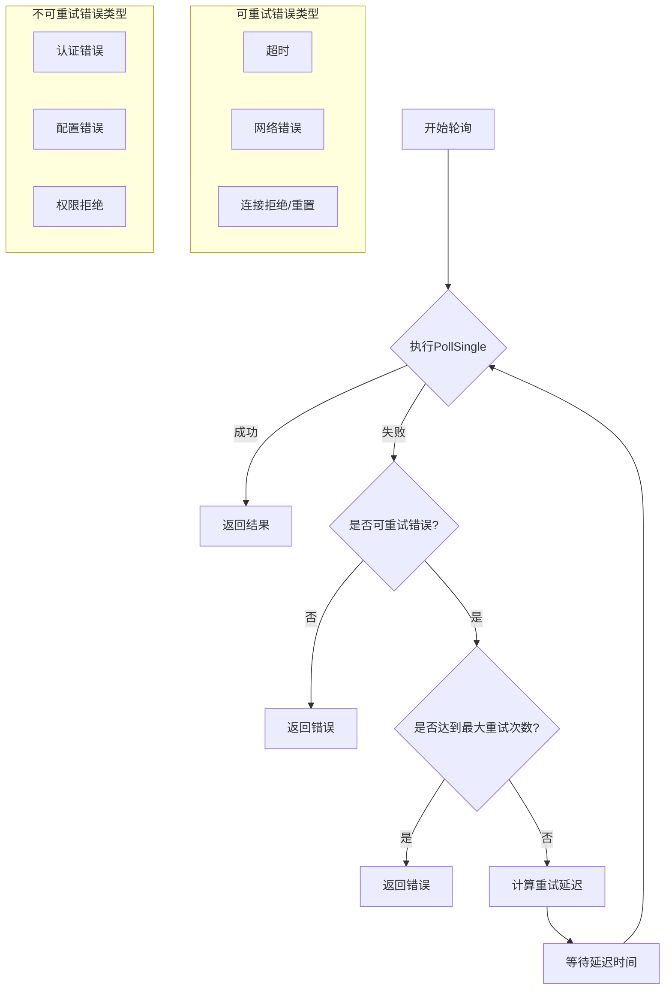
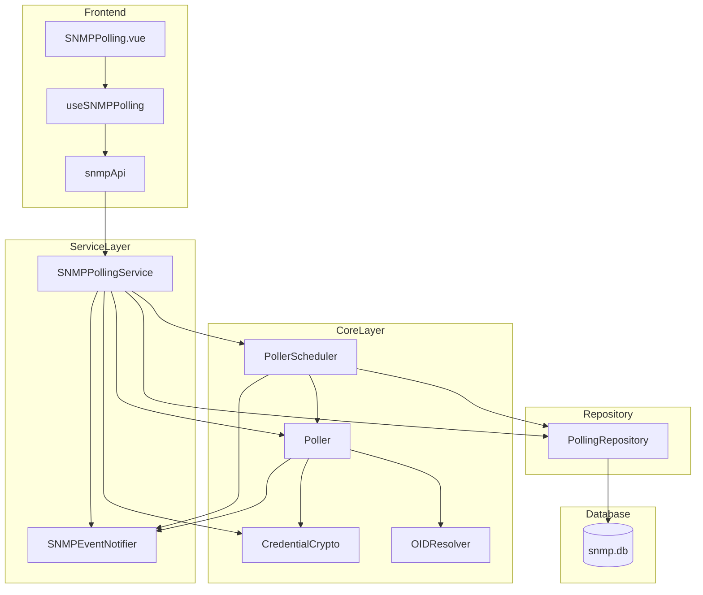
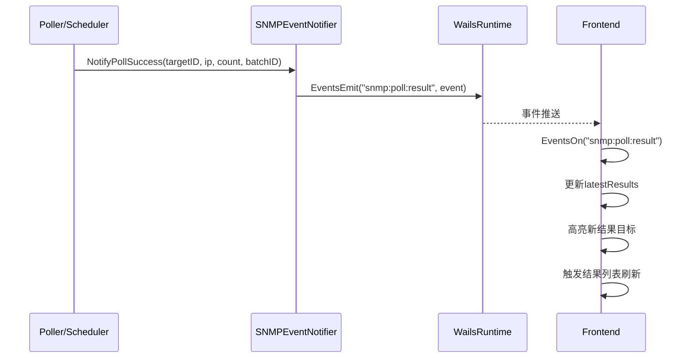

# SNMP轮询模块功能和逻辑说明书

## 1. 模块概述

### 1.1 整体架构

SNMP轮询模块采用分层架构设计，负责SNMP设备的定时轮询、数据采集和结果存储功能：

```
┌─────────────────────────────────────────────────────────────────────┐
│                      UI Layer (frontend/src)                         │
│  ┌───────────────────────────────────────────────────────────────┐  │
│  │ SNMPPolling.vue (主视图)                                       │  │
│  │ - 三栏布局：凭据/模板 | 目标列表 | 结果详情                      │  │
│  │ - 调度器状态监控和启停控制                                       │  │
│  │ - 实时轮询结果推送和高亮显示                                     │  │
│  └───────────────────────────────────────────────────────────────┘  │
│                              │                                       │
│        ┌─────────────────────┼─────────────────────┐                │
│        ▼                     ▼                     ▼                │
│  ┌───────────┐    ┌───────────────────┐    ┌───────────────┐        │
│  │ Components│    │ Composables        │    │ Services/API  │        │
│  │ (子组件)   │    │ useSNMPPolling     │    │ snmpApi       │        │
│  └───────────┘    └───────────────────┘    └───────────────┘        │
└─────────────────────────────────────────────────────────────────────┘
                               │
                               ▼
┌─────────────────────────────────────────────────────────────────────┐
│                 Service Layer (internal/ui)                          │
│  ┌───────────────────────────────────────────────────────────────┐  │
│  │ SNMPPollingService                                             │  │
│  │ - 凭据/模板/目标 CRUD 操作                                      │  │
│  │ - 调度器生命周期管理                                            │  │
│  │ - 轮询结果查询和分页                                            │  │
│  │ - 实时事件推送 (Wails Events)                                   │  │
│  └───────────────────────────────────────────────────────────────┘  │
└─────────────────────────────────────────────────────────────────────┘
                               │
                               ▼
┌─────────────────────────────────────────────────────────────────────┐
│               Core Business Layer (internal/snmp)                    │
│  ┌─────────────────┐  ┌─────────────────┐  ┌─────────────────────┐ │
│  │ Poller          │  │ PollerScheduler │  │ CredentialCrypto    │ │
│  │ - SNMP GET/WALK │  │ - Cron调度管理   │  │ - AES-256加密       │ │
│  │ - 并发控制      │  │ - 目标动态管理   │  │ - 凭据加解密        │ │
│  │ - 应用层重试    │  │ - 立即执行      │  │                     │ │
│  └─────────────────┘  └─────────────────┘  └─────────────────────┘ │
│  ┌─────────────────┐  ┌─────────────────┐                          │
│  │ OIDResolver     │  │ EventNotifier   │                          │
│  │ - OID名称解析   │  │ - 事件广播      │                          │
│  │ - 缓存优化      │  │ - 状态推送      │                          │
│  └─────────────────┘  └─────────────────┘                          │
└─────────────────────────────────────────────────────────────────────┘
                               │
                               ▼
┌─────────────────────────────────────────────────────────────────────┐
│              Repository Layer (internal/repository)                  │
│  ┌───────────────────────────────────────────────────────────────┐  │
│  │ GormPollingRepository                                          │  │
│  │ - 凭据/模板/目标/结果 CRUD                                      │  │
│  │ - 分页查询                                                      │  │
│  │ - 关联数据加载                                                  │  │
│  └───────────────────────────────────────────────────────────────┘  │
└─────────────────────────────────────────────────────────────────────┘
                               │
                               ▼
┌─────────────────────────────────────────────────────────────────────┐
│                 Model Layer (internal/models)                        │
│  ┌───────────────────────────────────────────────────────────────┐  │
│  │ SNMPCredential / SNMPPollingTemplate / SNMPPollingTarget       │  │
│  │ SNMPPollingResult / SNMPOIDItem                                │  │
│  └───────────────────────────────────────────────────────────────┘  │
└─────────────────────────────────────────────────────────────────────┘
```

### 1.2 核心数据流说明

SNMP轮询模块的数据流遵循以下原则：

1. **调度器启动流程**：用户启动调度器 → 加载所有已启用目标 → 注册Cron任务 → 启动定时轮询
2. **轮询执行流程**：Cron触发 → 获取目标配置 → 创建SNMP客户端 → 执行GET/WALK操作 → 保存结果 → 推送事件
3. **立即轮询流程**：用户触发 → 检查目标状态 → 执行轮询 → 保存结果 → 更新目标状态 → 推送事件
4. **结果查询流程**：用户选择目标 → 设置过滤条件 → 分页查询结果 → 展示详情
5. **凭据管理流程**：创建凭据 → AES-256加密存储 → 关联到轮询目标 → 轮询时解密使用

### 1.3 模块职责划分

| 模块 | 路径 | 主要职责 |
|------|------|----------|
| **主视图** | `frontend/src/views/SNMP/SNMPPolling.vue` | 三栏布局、状态管理、事件协调 |
| **Composables** | `frontend/src/composables/useSNMPPolling.ts` | 轮询状态管理、事件订阅、目标操作 |
| **Service** | `internal/ui/snmp_polling_service.go` | Wails API绑定、CRUD操作、事件推送 |
| **Poller** | `internal/snmp/poller.go` | SNMP协议操作、并发控制、应用层重试 |
| **PollerScheduler** | `internal/snmp/poller_scheduler.go` | Cron调度管理、目标动态管理、立即执行 |
| **CredentialCrypto** | `internal/snmp/credential_crypto.go` | 凭据AES-256加解密 |
| **OIDResolver** | `internal/snmp/oid_resolver.go` | OID名称双向解析 |
| **EventNotifier** | `internal/ui/snmp_event_notifier.go` | Wails事件广播 |
| **Repository** | `internal/repository/polling_repository.go` | 数据持久化、分页查询 |
| **Models** | `internal/models/snmp.go` | 数据结构定义 |

---

## 2. 核心数据结构

### 2.1 后端数据模型

#### 2.1.1 SNMPCredential - SNMP凭据

```go
// 文件: internal/models/snmp.go
type SNMPCredential struct {
    ID              uint      `json:"id" gorm:"primaryKey;autoIncrement"`
    Name            string    `json:"name" gorm:"uniqueIndex;not null"`
    Version         string    `json:"version"`               // v1/v2c/v3
    Community       string    `json:"community"`             // v1/v2c community string（AES-256 加密存储）
    SecurityLevel   string    `json:"securityLevel"`         // noAuthNoPriv/authNoPriv/authPriv
    Username        string    `json:"username"`
    AuthProtocol    string    `json:"authProtocol"`          // MD5/SHA/SHA224/SHA256/SHA384/SHA512
    AuthPassword    string    `json:"authPassword"`          // AES-256 加密存储
    PrivProtocol    string    `json:"privProtocol"`          // DES/AES/AES192/AES256/AES192C/AES256C
    PrivPassword    string    `json:"privPassword"`          // AES-256 加密存储
    ContextName     string    `json:"contextName"`
    ContextEngineID string    `json:"contextEngineId"`       // v3 上下文引擎 ID
    CreatedAt       time.Time `json:"createdAt"`
    UpdatedAt       time.Time `json:"updatedAt"`
}
```

**字段详解**：

| 字段 | 类型 | 说明 | 数据库约束 |
|------|------|------|-----------|
| `ID` | uint | 主键 | 自增 |
| `Name` | string | 凭据名称 | 唯一索引，非空 |
| `Version` | string | SNMP版本 | v1/v2c/v3 |
| `Community` | string | Community String | AES-256加密存储 |
| `SecurityLevel` | string | v3安全级别 | noAuthNoPriv/authNoPriv/authPriv |
| `Username` | string | v3用户名 | - |
| `AuthProtocol` | string | 认证协议 | MD5/SHA系列 |
| `AuthPassword` | string | 认证密码 | AES-256加密存储 |
| `PrivProtocol` | string | 加密协议 | DES/AES系列 |
| `PrivPassword` | string | 加密密码 | AES-256加密存储 |
| `ContextName` | string | v3上下文名 | - |
| `ContextEngineID` | string | v3上下文引擎ID | - |
| `CreatedAt` | time.Time | 创建时间 | 自动填充 |
| `UpdatedAt` | time.Time | 更新时间 | 自动更新 |

#### 2.1.2 SNMPPollingTemplate - 轮询模板

```go
// 文件: internal/models/snmp.go
type SNMPPollingTemplate struct {
    ID          uint          `json:"id" gorm:"primaryKey;autoIncrement"`
    Name        string        `json:"name" gorm:"uniqueIndex;not null"`
    Description string        `json:"description"`
    Category    string        `json:"category"`              // system/interface/cpu/memory/storage/custom
    OIDItems    []SNMPOIDItem `json:"oidItems" gorm:"serializer:json"`
    CreatedAt   time.Time     `json:"createdAt"`
    UpdatedAt   time.Time     `json:"updatedAt"`
}
```

**字段详解**：

| 字段 | 类型 | 说明 | 数据库约束 |
|------|------|------|-----------|
| `ID` | uint | 主键 | 自增 |
| `Name` | string | 模板名称 | 唯一索引，非空 |
| `Description` | string | 模板描述 | - |
| `Category` | string | 模板分类 | system/interface/cpu/memory/storage/custom |
| `OIDItems` | []SNMPOIDItem | OID采集项列表 | JSON序列化存储 |
| `CreatedAt` | time.Time | 创建时间 | 自动填充 |
| `UpdatedAt` | time.Time | 更新时间 | 自动更新 |

#### 2.1.3 SNMPOIDItem - OID采集项

```go
// 文件: internal/models/snmp.go
type SNMPOIDItem struct {
    OID         string `json:"oid"`          // 如 1.3.6.1.2.1.1.1.0
    Name        string `json:"name"`         // 如 sysDescr
    Type        string `json:"type"`         // string/integer/gauge/counter/timeticks
    Operation   string `json:"operation"`    // get/walk/bulk
    Description string `json:"description"`
}
```

**字段详解**：

| 字段 | 类型 | 说明 | 可选值 |
|------|------|------|--------|
| `OID` | string | OID标识符 | 如 1.3.6.1.2.1.1.1.0 |
| `Name` | string | OID名称 | 如 sysDescr |
| `Type` | string | 数据类型 | string/integer/gauge/counter/timeticks |
| `Operation` | string | 操作类型 | get/walk/bulk |
| `Description` | string | 描述信息 | - |

#### 2.1.4 SNMPPollingTarget - 轮询目标

```go
// 文件: internal/models/snmp.go
type SNMPPollingTarget struct {
    ID             uint       `json:"id" gorm:"primaryKey;autoIncrement"`
    TargetIP       string     `json:"targetIP" gorm:"index;not null"`
    TargetPort     int        `json:"targetPort"`                  // 默认 161
    DisplayName    string     `json:"displayName"`
    CredentialID   *uint      `json:"credentialId" gorm:"index;constraint:OnDelete:SET NULL"`
    TemplateID     *uint      `json:"templateId" gorm:"index;constraint:OnDelete:SET NULL"`
    PollInterval   int        `json:"pollInterval"`                // 轮询间隔（秒）
    Enabled        bool       `json:"enabled"`
    LastPollAt     *time.Time `json:"lastPollAt"`
    LastPollStatus string     `json:"lastPollStatus"`              // success/error/timeout
    LastPollError  string     `json:"lastPollError"`
    CreatedAt      time.Time  `json:"createdAt"`
    UpdatedAt      time.Time  `json:"updatedAt"`
}
```

**字段详解**：

| 字段 | 类型 | 说明 | 数据库约束 |
|------|------|------|-----------|
| `ID` | uint | 主键 | 自增 |
| `TargetIP` | string | 目标IP地址 | 索引，非空 |
| `TargetPort` | int | 目标端口 | 默认161 |
| `DisplayName` | string | 显示名称 | - |
| `CredentialID` | *uint | 关联凭据ID | 外键，SET NULL删除 |
| `TemplateID` | *uint | 关联模板ID | 外键，SET NULL删除 |
| `PollInterval` | int | 轮询间隔(秒) | - |
| `Enabled` | bool | 是否启用 | - |
| `LastPollAt` | *time.Time | 最后轮询时间 | - |
| `LastPollStatus` | string | 最后轮询状态 | success/error/timeout |
| `LastPollError` | string | 最后轮询错误 | - |
| `CreatedAt` | time.Time | 创建时间 | 自动填充 |
| `UpdatedAt` | time.Time | 更新时间 | 自动更新 |

#### 2.1.5 SNMPPollingResult - 轮询结果

```go
// 文件: internal/models/snmp.go
type SNMPPollingResult struct {
    ID        uint      `json:"id" gorm:"primaryKey;autoIncrement"`
    TargetID  uint      `json:"targetId" gorm:"index;index:idx_target_polltime,priority:1"`
    TargetIP  string    `json:"targetIP" gorm:"index"`
    BatchID   string    `json:"batchId" gorm:"index"`       // 同次轮询的所有结果共享同一 BatchID
    OID       string    `json:"oid"`
    OIDName   string    `json:"oidName"`
    Value     string    `json:"value"`
    ValueType string    `json:"valueType"`
    PollTime  time.Time `json:"pollTime" gorm:"index;index:idx_target_polltime,priority:2"`
    CreatedAt time.Time `json:"createdAt"`
}
```

**字段详解**：

| 字段 | 类型 | 说明 | 数据库约束 |
|------|------|------|-----------|
| `ID` | uint | 主键 | 自增 |
| `TargetID` | uint | 目标ID | 复合索引 |
| `TargetIP` | string | 目标IP | 索引 |
| `BatchID` | string | 批次ID | 索引，UUID格式 |
| `OID` | string | OID标识符 | - |
| `OIDName` | string | OID名称 | - |
| `Value` | string | 采集值 | - |
| `ValueType` | string | 值类型 | - |
| `PollTime` | time.Time | 轮询时间 | 复合索引 |
| `CreatedAt` | time.Time | 创建时间 | 自动填充 |

### 2.2 核心运行时结构

#### 2.2.1 PollerConfig - 轮询器配置

```go
// 文件: internal/snmp/poller.go
type PollerConfig struct {
    Timeout        time.Duration // SNMP 请求超时时间（默认 5s）
    Retries        int           // 协议层重试次数（默认 3，gosnmp 内置）
    MaxWorkers     int           // 最大并发轮询数（默认 10）
    MaxAppRetries  int           // 应用层重试次数（默认 3，用于网络不稳定场景）
    BaseRetryDelay time.Duration // 应用层重试基础延迟（默认 1s）
}
```

**设计要点**：
- **双层重试机制**：协议层重试由gosnmp库处理，应用层重试用于网络不稳定场景
- **指数退避+抖动**：应用层重试采用指数退避算法，避免惊群效应
- **并发控制**：通过信号量机制限制并发轮询数量

#### 2.2.2 PollTarget - 轮询目标封装

```go
// 文件: internal/snmp/poller.go
type PollTarget struct {
    Target   *models.SNMPPollingTarget
    Template *models.SNMPPollingTemplate
    Cred     *models.SNMPCredential
}
```

**设计要点**：
- 将目标、模板、凭据封装为单一结构，便于传递
- 支持模板为空时使用默认系统信息OID

#### 2.2.3 SchedulerStatus - 调度器状态

```go
// 文件: internal/snmp/poller_scheduler.go
type SchedulerStatus struct {
    IsRunning    bool      `json:"isRunning"`    // 是否运行中
    TargetCount  int       `json:"targetCount"`  // 已调度目标数
    TotalPolls   int64     `json:"totalPolls"`   // 总轮询次数
    LastPollTime time.Time `json:"lastPollTime"` // 最后轮询时间
    StartTime    time.Time `json:"startTime"`    // 调度器启动时间
}
```

### 2.3 前端数据模型

#### 2.3.1 View Models

```typescript
// 文件: frontend/src/bindings/github.com/NetWeaverGo/core/internal/ui/models

// 凭据 View Model
interface CredentialVM {
  id: number
  name: string
  version: string           // v1/v2c/v3
  community: string         // 已脱敏
  securityLevel: string
  username: string
  authProtocol: string
  hasAuthKey: boolean       // 是否已设置认证密钥
  privProtocol: string
  hasPrivKey: boolean       // 是否已设置加密密钥
  contextName: string
  contextEngineId: string
  createdAt: string
  updatedAt: string
}

// 轮询目标 View Model
interface PollingTargetVM {
  id: number
  targetIP: string
  targetPort: number
  displayName: string
  credentialId: number | null
  credentialName: string
  templateId: number | null
  templateName: string
  pollInterval: number
  enabled: boolean
  lastPollAt: string
  lastPollStatus: string
  lastPollError: string
  createdAt: string
  updatedAt: string
}

// 调度器状态 View Model
interface SchedulerStatusVM {
  isRunning: boolean
  targetCount: number
  totalPolls: number
  lastPollTime: string
  startTime: string
}
```

---

## 3. 工作流程

### 3.1 调度器生命周期



### 3.2 轮询执行时序图



### 3.3 应用层重试机制



### 3.4 核心函数逻辑说明

#### 3.4.1 [`PollSingle()`](internal/snmp/poller.go:249) - 单目标轮询

**功能**：执行单个目标的SNMP轮询操作

**处理流程**：
1. 验证目标参数有效性
2. 解密凭据获取Community String
3. 创建SNMP客户端连接（支持v1/v2c/v3）
4. 遍历模板OID项执行GET/WALK/BULK操作
5. 将PDU转换为轮询结果模型
6. 更新统计信息并发送成功通知

**关键代码**：
```go
func (p *Poller) PollSingle(ctx context.Context, target *PollTarget) ([]*models.SNMPPollingResult, error) {
    // 获取凭据（解密 community string）
    community, err := p.getCommunity(target.Cred)
    
    // 创建 SNMP 客户端
    client, err := p.createSNMPClient(addr, community, target.Cred)
    defer client.Conn.Close()
    
    // 按模板 OID 列表轮询
    for _, oidItem := range target.Template.OIDItems {
        oidResults, err := p.pollOID(ctx, client, target.Target, oidItem, batchID, pollTime)
        results = append(results, oidResults...)
    }
    
    return results, nil
}
```

#### 3.4.2 [`PollBatch()`](internal/snmp/poller.go:329) - 批量轮询

**功能**：并发执行多个目标的轮询操作

**处理流程**：
1. 初始化结果切片和等待组
2. 使用信号量控制并发数量
3. 为每个目标启动goroutine执行轮询
4. 使用应用层重试机制提高成功率
5. 等待所有goroutine完成

**关键代码**：
```go
func (p *Poller) PollBatch(ctx context.Context, targets []*PollTarget) [][]*models.SNMPPollingResult {
    results := make([][]*models.SNMPPollingResult, len(targets))
    var wg sync.WaitGroup
    
    for i, target := range targets {
        p.workerSem <- struct{}{} // 获取信号量
        
        wg.Add(1)
        go func(idx int, t *PollTarget) {
            defer wg.Done()
            defer func() { <-p.workerSem }() // 释放信号量
            
            result, err := p.pollWithRetry(ctx, t) // 带重试的轮询
            results[idx] = result
        }(i, target)
    }
    
    wg.Wait()
    return results
}
```

#### 3.4.3 [`pollWithRetry()`](internal/snmp/poller.go:126) - 带重试的轮询

**功能**：实现应用层重试机制，提高网络不稳定场景下的成功率

**重试策略**：
- 指数退避：`delay = baseDelay * 2^attempt`
- 随机抖动：`jitter = random(0-500ms)`
- 可重试错误：超时、网络错误、连接拒绝/重置
- 不可重试错误：认证错误、配置错误、权限拒绝

#### 3.4.4 [`Start()`](internal/snmp/poller_scheduler.go:105) - 启动调度器

**功能**：启动轮询调度器，加载所有已启用目标

**处理流程**：
1. 检查调度器是否已在运行
2. 从数据库加载所有已启用的轮询目标
3. 为每个目标注册Cron定时任务
4. 启动Cron调度器
5. 通知状态变更

#### 3.4.5 [`AddTarget()`](internal/snmp/poller_scheduler.go:206) - 添加轮询目标

**功能**：动态添加轮询目标到调度器

**处理流程**：
1. 检查目标是否已存在，存在则先移除
2. 检查目标是否启用，未启用则跳过
3. 生成Cron表达式（基于轮询间隔）
4. 注册Cron任务
5. 保存到任务映射

#### 3.4.6 [`RunNow()`](internal/snmp/poller_scheduler.go:302) - 立即执行

**功能**：立即执行指定目标的轮询

**处理流程**：
1. 检查目标是否在调度中
2. 不在调度中则从数据库加载
3. 执行轮询操作
4. 保存结果到数据库
5. 更新目标最后轮询状态

---

## 4. 模块间交互关系

### 4.1 依赖关系图



### 4.2 调用链示例

#### 4.2.1 启动调度器调用链

```
用户点击"启动调度器"
    ↓
SNMPPolling.vue: startScheduler()
    ↓
useSNMPPolling.ts: startScheduler()
    ↓
snmpApi.ts: SNMPPollingAPI.startScheduler()
    ↓
snmp_polling_service.go: StartScheduler()
    ↓
poller_scheduler.go: Start()
    ↓
    ├── repo.ListPollingTargets() // 加载已启用目标
    ├── scheduler.AddFunc()       // 注册Cron任务
    └── notifier.NotifySchedulerStatus() // 推送状态变更
```

#### 4.2.2 立即轮询调用链

```
用户点击"立即轮询"
    ↓
SNMPPolling.vue: handlePollNow()
    ↓
useSNMPPolling.ts: pollNow()
    ↓
snmpApi.ts: SNMPPollingAPI.pollNow()
    ↓
snmp_polling_service.go: PollNow()
    ↓
poller_scheduler.go: RunNow()
    ↓
    ├── repo.GetPollingTarget()   // 获取目标配置
    ├── poller.PollSingle()       // 执行轮询
    ├── repo.CreatePollingResults() // 保存结果
    └── notifier.NotifyPollResult() // 推送事件
```

#### 4.2.3 定时轮询调用链

```
Cron定时触发
    ↓
poller_scheduler.go: createPollFunc() 闭包
    ↓
    ├── poller.PollSingle()       // 执行轮询
    ├── repo.CreatePollingResults() // 保存结果
    ├── updateTargetPollStatus()  // 更新目标状态
    └── notifier.NotifyPollResult() // 推送事件
```

### 4.3 事件推送机制



**事件类型**：

| 事件名 | 触发时机 | 数据结构 |
|--------|----------|----------|
| `snmp:poll:result` | 轮询完成 | `{ targetId, targetIP, status, pollTime, oidCount, batchId, error }` |
| `snmp:scheduler:status` | 调度器状态变更 | `{ isRunning }` |

---

## 5. 总结表格

### 5.1 功能特性总结

| 功能模块 | 功能描述 | 实现位置 |
|----------|----------|----------|
| **凭据管理** | SNMP凭据CRUD，AES-256加密存储 | [`SNMPPollingService`](internal/ui/snmp_polling_service.go:225) |
| **模板管理** | 轮询模板CRUD，OID配置管理 | [`SNMPPollingService`](internal/ui/snmp_polling_service.go:225) |
| **目标管理** | 轮询目标CRUD，启用/禁用控制 | [`SNMPPollingService`](internal/ui/snmp_polling_service.go:225) |
| **调度器管理** | 启动/停止调度器，状态监控 | [`PollerScheduler`](internal/snmp/poller_scheduler.go:51) |
| **定时轮询** | Cron定时任务，自动轮询 | [`PollerScheduler`](internal/snmp/poller_scheduler.go:51) |
| **立即轮询** | 手动触发单目标/全部目标轮询 | [`PollerScheduler`](internal/snmp/poller_scheduler.go:51) |
| **并发控制** | 信号量限制并发数，防止资源耗尽 | [`Poller`](internal/snmp/poller.go:61) |
| **应用层重试** | 指数退避+抖动，提高成功率 | [`Poller`](internal/snmp/poller.go:61) |
| **结果存储** | 轮询结果持久化，支持分页查询 | [`PollingRepository`](internal/repository/polling_repository.go) |
| **实时推送** | Wails事件推送，前端实时更新 | [`SNMPEventNotifier`](internal/ui/snmp_event_notifier.go) |

### 5.2 技术实现总结

| 技术点 | 实现方案 | 优势 |
|--------|----------|------|
| **SNMP协议** | gosnmp库 | 支持v1/v2c/v3，GET/WALK/BULK操作 |
| **定时调度** | robfig/cron库 | 秒级精度，动态任务管理 |
| **并发控制** | 缓冲通道信号量 | 简单高效，避免goroutine泄漏 |
| **重试机制** | 指数退避+随机抖动 | 避免惊群效应，提高成功率 |
| **凭据加密** | AES-256-GCM | 安全存储敏感信息 |
| **事件推送** | Wails Events | 前后端实时通信 |
| **OID解析** | MIB库解析+缓存 | OID名称友好显示 |

### 5.3 配置参数总结

| 参数 | 默认值 | 说明 |
|------|--------|------|
| `Timeout` | 5s | SNMP请求超时时间 |
| `Retries` | 3 | 协议层重试次数 |
| `MaxWorkers` | 10 | 最大并发轮询数 |
| `MaxAppRetries` | 3 | 应用层重试次数 |
| `BaseRetryDelay` | 1s | 应用层重试基础延迟 |
| `DefaultPollTimeout` | 30s | 调度器轮询超时时间 |

### 5.4 数据库表总结

| 表名 | 说明 | 主要字段 |
|------|------|----------|
| `snmp_credentials` | SNMP凭据 | ID, Name, Version, Community(加密) |
| `snmp_polling_templates` | 轮询模板 | ID, Name, Category, OIDItems(JSON) |
| `snmp_polling_targets` | 轮询目标 | ID, TargetIP, CredentialID, TemplateID, PollInterval |
| `snmp_polling_results` | 轮询结果 | ID, TargetID, BatchID, OID, Value, PollTime |
