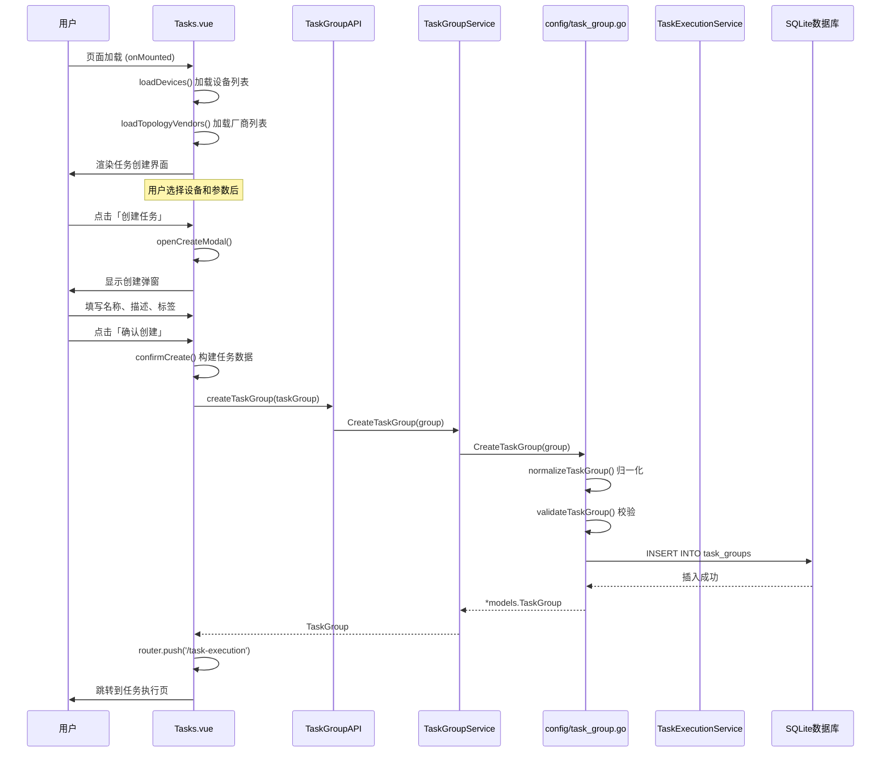
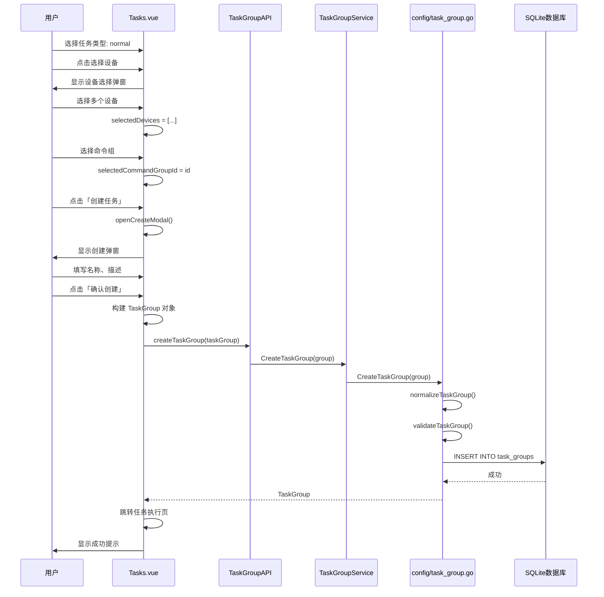
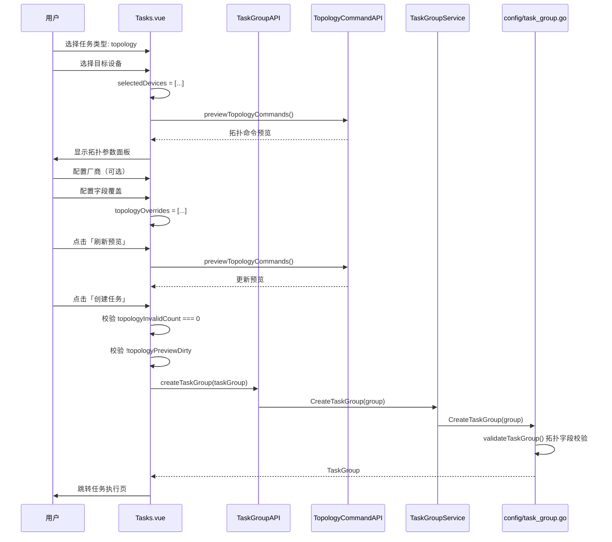
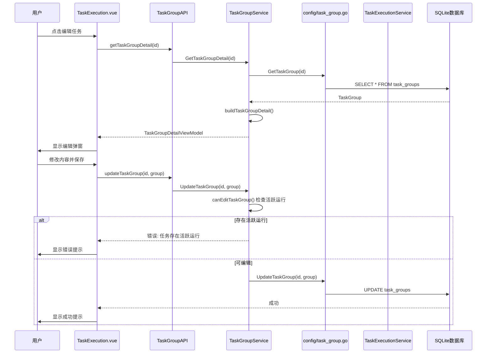
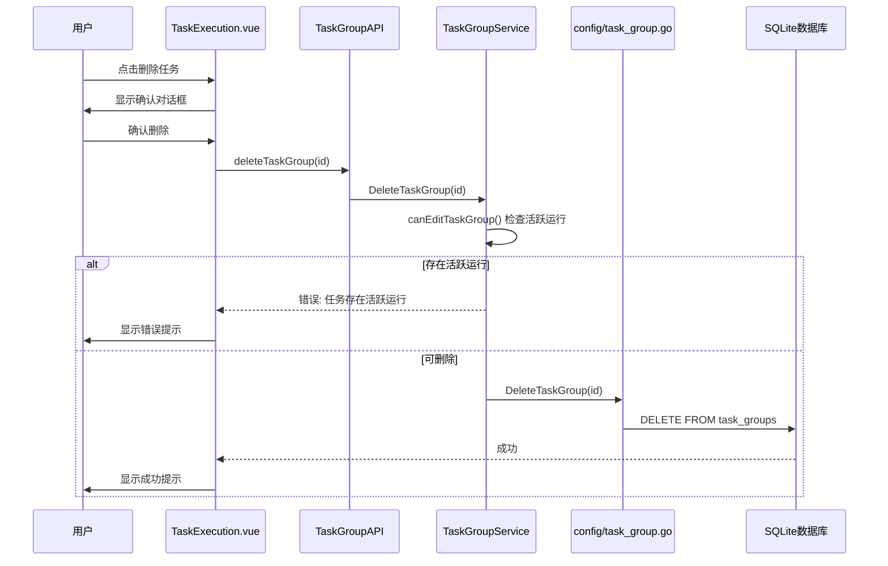
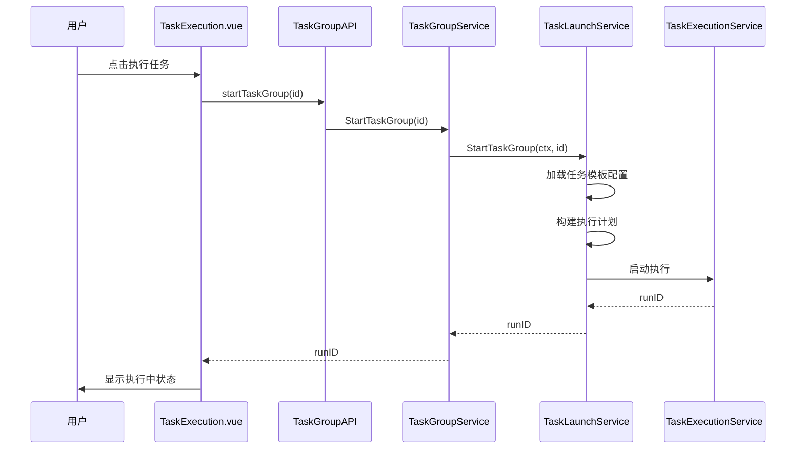

# 任务模板管理模块功能和逻辑说明书

## 1. 模块概述

### 1.1 整体架构

任务模板管理模块采用分层架构设计，主要包含以下三个层次：

```
┌─────────────────────────────────────────────────────────────────┐
│                      UI Layer (frontend/src)                     │
│  ┌─────────────────────────────────────────────────────────┐   │
│  │ Tasks.vue (主视图)                                       │   │
│  │ - 任务类型选择（普通/拓扑/备份）                           │   │
│  │ - 设备选择器集成                                         │   │
│  │ - 命令组选择器集成                                       │   │
│  │ - 拓扑参数配置面板                                       │   │
│  │ - 创建任务弹窗                                           │   │
│  └─────────────────────────────────────────────────────────┘   │
└─────────────────────────────────────────────────────────────────┘
                               │
                               ▼
┌─────────────────────────────────────────────────────────────────┐
│                 Service Layer (internal/ui)                      │
│  ┌─────────────────────────────────────────────────────────┐   │
│  │ TaskGroupService                                         │   │
│  │ - 任务模板 CRUD 操作                                     │   │
│  │ - 详情聚合与视图模型构建                                  │   │
│  │ - 执行状态关联查询                                       │   │
│  │ - 任务启动入口                                           │   │
│  └─────────────────────────────────────────────────────────┘   │
└─────────────────────────────────────────────────────────────────┘
                               │
                               ▼
┌─────────────────────────────────────────────────────────────────┐
│              Configuration Layer (internal/config)               │
│  ┌─────────────────────────────────────────────────────────┐   │
│  │ task_group.go                                            │   │
│  │ - 数据持久化 (GORM)                                       │   │
│  │ - 任务类型校验                                           │   │
│  │ - 拓扑字段覆盖验证                                       │   │
│  │ - 默认值归一化                                           │   │
│  └─────────────────────────────────────────────────────────┘   │
└─────────────────────────────────────────────────────────────────┘
                               │
                               ▼
┌─────────────────────────────────────────────────────────────────┐
│                 Model Layer (internal/models)                    │
│  ┌─────────────────────────────────────────────────────────┐   │
│  │ TaskGroup / TaskItem                                     │   │
│  │ - ID, Name, TaskType, Mode, Items, Tags                  │   │
│  │ - TopologyFieldOverrides, BackupConfig                   │   │
│  └─────────────────────────────────────────────────────────┘   │
└─────────────────────────────────────────────────────────────────┘
```

### 1.2 核心数据流说明

任务模板管理模块的数据流遵循单向数据流原则：

1. **查询流程**：页面加载 → 调用 [`ListTaskGroups()`](internal/ui/task_group_service.go:63) → 数据库查询 → 聚合执行状态 → 返回视图模型列表 → 前端渲染
2. **创建流程**：用户选择设备和命令组 → 配置任务参数 → 调用 [`CreateTaskGroup()`](internal/config/task_group.go:48) → 校验与归一化 → 写入数据库
3. **更新流程**：用户编辑任务 → 检查活跃运行状态 → 调用 [`UpdateTaskGroup()`](internal/config/task_group.go:74) → 校验更新
4. **删除流程**：用户确认删除 → 检查活跃运行状态 → 调用 [`DeleteTaskGroup()`](internal/config/task_group.go:100) → 执行删除
5. **启动流程**：用户点击执行 → 调用 [`StartTaskGroup()`](internal/ui/task_group_service.go:189) → 委托 TaskLaunchService 启动任务

### 1.3 模块职责划分

| 模块 | 路径 | 主要职责 |
|------|------|----------|
| **主视图** | `frontend/src/views/Tasks.vue` | 任务类型选择、设备/命令组选择、参数配置、创建任务 |
| **设备选择器** | `frontend/src/components/task/DeviceSelectorModal.vue` | 设备多选弹窗 |
| **命令组选择器** | `frontend/src/components/task/CommandGroupSelector.vue` | 命令组选择组件 |
| **Service** | `internal/ui/task_group_service.go` | Wails 服务注册、视图模型聚合、执行状态关联 |
| **Config** | `internal/config/task_group.go` | 数据访问、校验逻辑、归一化处理 |
| **Models** | `internal/models/models.go` | 数据结构定义、GORM 映射 |
| **ViewModels** | `internal/ui/view_models.go` | 视图模型定义、前端渲染数据结构 |

---

## 2. 核心数据结构

### 2.1 后端数据模型

#### 2.1.1 TaskGroup - 任务模板实体

```go
// 文件: internal/models/models.go
type TaskGroup struct {
    ID                     uint                        `json:"id" gorm:"primaryKey;autoIncrement"`
    Name                   string                      `json:"name" gorm:"uniqueIndex;not null"`
    Description            string                      `json:"description"`
    DeviceGroup            string                      `json:"deviceGroup"`
    CommandGroup           string                      `json:"commandGroup"`
    MaxWorkers             int                         `json:"maxWorkers"`
    Timeout                int                         `json:"timeout"`
    TaskType               string                      `json:"taskType"`       // "normal" | "topology" | "backup"
    TopologyVendor         string                      `json:"topologyVendor"` // 拓扑采集厂商
    TopologyFieldOverrides []TopologyTaskFieldOverride `json:"topologyFieldOverrides" gorm:"serializer:json"`
    AutoBuildTopology      bool                        `json:"autoBuildTopology"`
    Mode                   string                      `json:"mode"` // "group" 模式A | "binding" 模式B
    Items                  []TaskItem                  `json:"items" gorm:"serializer:json"`
    Status                 string                      `json:"status"`
    Tags                   []string                    `json:"tags" gorm:"serializer:json"`
    EnableRawLog           bool                        `json:"enableRawLog"`
    BackupSaveRootPath     string                      `json:"backupSaveRootPath"`
    BackupDirNamePattern   string                      `json:"backupDirNamePattern"`
    BackupFileNamePattern  string                      `json:"backupFileNamePattern"`
    BackupStartupCommand   string                      `json:"backupStartupCommand"`
    BackupSftpTimeoutSec   int                         `json:"backupSftpTimeoutSec"`
    CreatedAt              time.Time                   `json:"createdAt"`
    UpdatedAt              time.Time                   `json:"updatedAt"`
}
```

**字段详解**：

| 字段 | 类型 | 说明 | 数据库约束 |
|------|------|------|-----------|
| `ID` | uint | 主键 | 自增 |
| `Name` | string | 任务模板名称 | 唯一索引，非空 |
| `Description` | string | 描述信息 | 可选 |
| `TaskType` | string | 任务类型 | `normal`/`topology`/`backup` |
| `TopologyVendor` | string | 拓扑采集厂商 | 空表示自动识别 |
| `TopologyFieldOverrides` | []TopologyTaskFieldOverride | 拓扑字段覆盖配置 | JSON 序列化 |
| `AutoBuildTopology` | bool | 自动构建拓扑开关 | 默认 false |
| `Mode` | string | 任务模式 | `group`/`binding` |
| `Items` | []TaskItem | 任务项列表 | JSON 序列化 |
| `Tags` | []string | 标签列表 | JSON 序列化 |
| `EnableRawLog` | bool | 启用原始日志 | 默认 false |
| `BackupSftpTimeoutSec` | int | SFTP 下载超时 | 0 时使用命令超时 2 倍 |

**设计要点**：
- `Items` 使用 GORM 的 JSON 序列化器存储，支持灵活的任务项配置
- `TopologyFieldOverrides` 支持任务级别的拓扑命令覆盖
- `TaskType` 决定任务的执行逻辑和参数校验规则
- 表名为 `task_groups`，通过 [`TableName()`](internal/models/models.go:89) 方法指定

#### 2.1.2 TaskItem - 任务项

```go
// 文件: internal/models/models.go
type TaskItem struct {
    CommandGroupID string   `json:"commandGroupId"` // 命令组ID（模式A使用）
    Commands       []string `json:"commands"`       // 直接命令列表（模式B使用）
    DeviceIDs      []uint   `json:"deviceIDs"`      // 绑定的设备ID列表
}
```

**字段详解**：

| 字段 | 类型 | 说明 |
|------|------|------|
| `CommandGroupID` | string | 关联的命令组 ID，模式 A 使用 |
| `Commands` | []string | 直接命令列表，模式 B 使用 |
| `DeviceIDs` | []uint | 目标设备 ID 列表 |

### 2.2 视图模型

#### 2.2.1 TaskGroupListView - 列表视图模型

```go
// 文件: internal/ui/view_models.go
type TaskGroupListView struct {
    ID                  uint              `json:"id"`
    Name                string            `json:"name"`
    Description         string            `json:"description"`
    TaskType            string            `json:"taskType"`
    TopologyVendor      string            `json:"topologyVendor"`
    AutoBuildTopology   bool              `json:"autoBuildTopology"`
    Mode                string            `json:"mode"`
    Items               []models.TaskItem `json:"items"`
    Status              string            `json:"status"`              // 最近运行状态
    LatestRunID         string            `json:"latestRunId"`         // 最近运行ID
    LatestRunStatus     string            `json:"latestRunStatus"`     // 最近运行状态
    LatestRunStartedAt  string            `json:"latestRunStartedAt"`  // 最近运行开始时间
    LatestRunFinishedAt string            `json:"latestRunFinishedAt"` // 最近运行结束时间
    ActiveRunCount      int               `json:"activeRunCount"`      // 活跃运行数量
    CanEdit             bool              `json:"canEdit"`             // 是否可编辑
    Tags                []string          `json:"tags"`
    EnableRawLog        bool              `json:"enableRawLog"`
    CreatedAt           string            `json:"createdAt"`
    UpdatedAt           string            `json:"updatedAt"`
}
```

**设计要点**：
- `Status`、`LatestRunID` 等字段从最近一次运行记录派生
- `CanEdit` 根据活跃运行数量计算，存在活跃运行时禁止编辑
- `ActiveRunCount` 用于前端显示运行状态徽标

#### 2.2.2 TaskGroupDetailViewModel - 详情视图模型

```go
// 文件: internal/ui/view_models.go
type TaskGroupDetailViewModel struct {
    Task               models.TaskGroup               `json:"task"`
    ItemCount          int                            `json:"itemCount"`
    CanEdit            bool                           `json:"canEdit"`
    EditDisabledReason string                        `json:"editDisabledReason"`
    LatestRunID        string                         `json:"latestRunId"`
    LatestRunStatus    string                         `json:"latestRunStatus"`
    ActiveRunCount     int                            `json:"activeRunCount"`
    Items              []TaskGroupItemDetailViewModel `json:"items"`
    MissingDevices     []uint                         `json:"missingDevices"`
    MissingCommandIDs  []uint                         `json:"missingCommandIds"`
}
```

**设计要点**：
- 聚合设备资产和命令组信息，前端无需额外查询
- `MissingDevices` 和 `MissingCommandIDs` 标识引用缺失

### 2.3 前端数据结构

#### 2.3.1 任务类型选择状态

```typescript
// 文件: frontend/src/views/Tasks.vue
const selectedTaskType = ref<"normal" | "topology" | "backup">("normal");
const selectedDevices = ref<DeviceAsset[]>([]);
const selectedCommandGroupId = ref<number>(0);
const selectedCommandGroup = ref<CommandGroup | null>(null);
const topologyVendor = ref("");
const autoBuildTopology = ref(true);
const backupSftpTimeoutSec = ref(0);
```

#### 2.3.2 拓扑命令覆盖状态

```typescript
// 文件: frontend/src/views/Tasks.vue
const topologyOverrides = ref<TopologyTaskFieldOverride[]>([]);
const topologyPreview = ref<TopologyCommandPreviewView | null>(null);
const topologyPreviewLoading = ref(false);
const topologyPreviewError = ref("");
const topologyPreviewDirty = ref(false);
```

#### 2.3.3 创建任务弹窗状态

```typescript
// 文件: frontend/src/views/Tasks.vue
const createModal = ref({
  show: false,           // 弹窗显示状态
  name: "",              // 任务名称
  description: "",       // 描述
  tags: [] as string[],  // 标签数组
  newTag: "",            // 新标签输入
  enableRawLog: false,   // 启用原始日志
});
```

---

## 3. 工作流程

### 3.1 任务模板列表加载流程



### 3.2 任务模板创建流程（普通任务）



### 3.3 任务模板创建流程（拓扑任务）



### 3.4 任务模板更新流程



### 3.5 任务模板删除流程



### 3.6 任务启动流程



---

## 4. 模块间交互关系

### 4.1 依赖关系图

```
┌─────────────────────────────────────────────────────────────────┐
│                         前端层                                   │
│  ┌──────────────┐     ┌──────────────┐     ┌──────────────┐    │
│  │  Tasks.vue   │────▶│   api.ts     │────▶│  bindings    │    │
│  │ (任务创建)    │     │ (API封装)    │     │ (Wails生成)  │    │
│  └──────────────┘     └──────────────┘     └──────────────┘    │
│         │                                                       │
│         │ 使用                                                   │
│         ▼                                                       │
│  ┌──────────────┐     ┌──────────────┐                         │
│  │ DeviceSelector│    │CommandGroup  │                         │
│  │ Modal.vue    │    │ Selector.vue │                         │
│  └──────────────┘     └──────────────┘                         │
└─────────────────────────────────────────────────────────────────┘
                               │
                               │ Wails IPC
                               ▼
┌─────────────────────────────────────────────────────────────────┐
│                         后端层                                   │
│  ┌──────────────────────┐     ┌──────────────────────┐         │
│  │  TaskGroupService    │────▶│  config/             │         │
│  │ (Wails服务)          │     │  task_group.go       │         │
│  └──────────────────────┘     │  (数据访问层)         │         │
│         │                     └──────────────────────┘         │
│         │                              │                        │
│         │ 依赖                         ▼                        │
│         ▼                     ┌──────────────────────┐         │
│  ┌──────────────────────┐     │  models/             │         │
│  │ TaskExecutionService │     │  models.go           │         │
│  │ TaskLaunchService    │     │  (数据模型)          │         │
│  └──────────────────────┘     └──────────────────────┘         │
│         │                                                      │
│         │ 关联                                                  │
│         ▼                                                      │
│  ┌──────────────────────┐                                      │
│  │ DeviceRepository     │                                      │
│  │ (设备资产查询)        │                                      │
│  └──────────────────────┘                                      │
└─────────────────────────────────────────────────────────────────┘
                               │
                               ▼
┌─────────────────────────────────────────────────────────────────┐
│                       数据存储层                                 │
│  ┌──────────────────────────────────────────────────────────┐  │
│  │                    SQLite (task_groups)                   │  │
│  └──────────────────────────────────────────────────────────┘  │
└─────────────────────────────────────────────────────────────────┘
```

### 4.2 调用链示例

#### 4.2.1 创建任务模板调用链

```
用户操作
    │
    ▼
Tasks.vue:confirmCreate()
    │ 构建任务数据对象
    ▼
TaskGroupAPI.createTaskGroup(taskGroup)
    │ Wails 绑定调用
    ▼
TaskGroupService.CreateTaskGroup(group)
    │ 代理调用
    ▼
config.CreateTaskGroup(group)
    │ 归一化 + 校验 + 数据库操作
    ▼
GORM: DB.Create(&group)
    │
    ▼
SQLite: INSERT INTO task_groups
```

#### 4.2.2 获取任务详情调用链

```
用户操作
    │
    ▼
TaskExecution.vue:loadTaskDetail()
    │
    ▼
TaskGroupAPI.getTaskGroupDetail(id)
    │
    ▼
TaskGroupService.GetTaskGroupDetail(id)
    │ 聚合设备资产和命令组信息
    ▼
buildTaskGroupDetail()
    │ 查询设备资产
    ▼
DeviceRepository.FindAll()
    │ 查询命令组
    ▼
config.GetCommandGroup(id)
    │ 构建视图模型
    ▼
TaskGroupDetailViewModel
```

#### 4.2.3 启动任务调用链

```
用户操作
    │
    ▼
TaskExecution.vue:startTask()
    │
    ▼
TaskGroupAPI.startTaskGroup(id)
    │
    ▼
TaskGroupService.StartTaskGroup(id)
    │ 委托启动服务
    ▼
TaskLaunchService.StartTaskGroup(ctx, id)
    │ 加载任务配置
    ▼
config.GetTaskGroup(id)
    │ 构建执行计划
    ▼
TaskExecutionService.Start()
```

### 4.3 与其他模块的关系

| 关联模块 | 关系说明 | 交互方式 |
|----------|----------|----------|
| **设备管理** | 任务模板引用设备资产 | 通过 `DeviceIDs` 关联设备 ID |
| **命令组管理** | 普通任务引用命令组 | 通过 `CommandGroupID` 关联命令组 |
| **任务执行** | 任务模板启动执行 | 调用 [`StartTaskGroup()`](internal/ui/task_group_service.go:189) 启动 |
| **拓扑采集** | 拓扑任务配置采集参数 | 通过 `TopologyFieldOverrides` 配置 |
| **配置备份** | 备份任务配置备份参数 | 通过 `Backup*` 字段配置 |

---

## 5. 核心函数说明

### 5.1 后端核心函数

#### 5.1.1 ListTaskGroups - 获取任务模板列表

```go
// 文件: internal/ui/task_group_service.go:63
func (s *TaskGroupService) ListTaskGroups() ([]TaskGroupListView, error)
```

**功能**：查询所有任务模板并聚合执行状态

**逻辑**：
1. 调用 [`config.ListTaskGroups()`](internal/config/task_group.go:14) 查询数据库
2. 查询最近运行记录，按 taskGroupID 分组
3. 计算每个任务的活跃运行数量
4. 构建视图模型，填充状态字段
5. 按创建时间倒序排序返回

#### 5.1.2 CreateTaskGroup - 创建任务模板

```go
// 文件: internal/config/task_group.go:48
func CreateTaskGroup(group models.TaskGroup) (*models.TaskGroup, error)
```

**功能**：创建新的任务模板

**逻辑**：
1. 检查数据库连接
2. 调用 [`normalizeTaskGroup()`](internal/config/task_group.go:193) 归一化默认值
3. 调用 [`validateTaskGroup()`](internal/config/task_group.go:118) 校验数据
4. 执行数据库插入
5. 记录操作日志

#### 5.1.3 validateTaskGroup - 校验任务模板

```go
// 文件: internal/config/task_group.go:118
func validateTaskGroup(group *models.TaskGroup) error
```

**功能**：校验任务模板数据有效性

**逻辑**：
1. 校验名称非空
2. 拓扑任务校验：
   - 检查字段覆盖的 fieldKey 有效性
   - 检查字段覆盖无重复
   - 检查超时时间非负
   - 检查启用字段命令非空
   - 检查关键字段不被禁用
   - 检查至少保留一个启用字段

#### 5.1.4 normalizeTaskGroup - 归一化任务模板

```go
// 文件: internal/config/task_group.go:193
func normalizeTaskGroup(group *models.TaskGroup)
```

**功能**：填充默认值和规范化字段

**逻辑**：
1. `TaskType` 为空时设为 `normal`
2. 备份任务填充默认配置：
   - `BackupStartupCommand` = `display startup`
   - `BackupDirNamePattern` = `%Y-%M-%D`
   - `BackupFileNamePattern` = `%H_startup_%h%m%s.cfg`
3. `Mode` 为空时设为 `group`
4. 初始化空切片字段

#### 5.1.5 GetTaskGroupDetail - 获取任务详情

```go
// 文件: internal/ui/task_group_service.go:136
func (s *TaskGroupService) GetTaskGroupDetail(id uint) (*TaskGroupDetailViewModel, error)
```

**功能**：聚合任务详情信息

**逻辑**：
1. 查询任务模板
2. 查询所有设备资产，构建 ID 映射
3. 查询关联的命令组
4. 遍历 Items 构建详情视图
5. 标记缺失的设备和命令组
6. 计算编辑权限

#### 5.1.6 canEditTaskGroup - 检查编辑权限

```go
// 文件: internal/ui/task_group_service.go:196
func (s *TaskGroupService) canEditTaskGroup(taskGroupID uint) bool
```

**功能**：检查任务是否可编辑

**逻辑**：
1. 查询最近运行记录
2. 遍历检查是否有活跃运行（running/paused）
3. 存在活跃运行返回 false

### 5.2 前端核心函数

#### 5.2.1 confirmCreate - 确认创建任务

```typescript
// 文件: frontend/src/views/Tasks.vue:519
async function confirmCreate()
```

**功能**：创建任务模板并跳转执行页

**逻辑**：
1. 校验名称非空和 `canCreate` 条件
2. 拓扑任务校验覆盖项有效性
3. 构建任务数据对象：
   - 根据任务类型设置不同参数
   - 设置拓扑覆盖配置
   - 设置备份任务参数
4. 调用 API 创建任务
5. 跳转到任务执行页

#### 5.2.2 loadTopologyPreview - 加载拓扑命令预览

```typescript
// 文件: frontend/src/views/Tasks.vue:722
async function loadTopologyPreview()
```

**功能**：加载拓扑任务的命令预览

**逻辑**：
1. 检查任务类型为 topology
2. 调用 [`TopologyCommandAPI.previewTopologyCommands()`](frontend/src/views/Tasks.vue:729)
3. 更新预览状态和覆盖配置
4. 清除脏标记

#### 5.2.3 canCreate - 创建条件计算

```typescript
// 文件: frontend/src/views/Tasks.vue:464
const canCreate = computed(() => { ... })
```

**功能**：计算是否可创建任务

**逻辑**：
1. 拓扑任务：设备数量 > 0 且无效覆盖数 = 0
2. 备份任务：设备数量 > 0
3. 普通任务：设备数量 > 0 且已选命令组

#### 5.2.4 topologyOverrides 管理

```typescript
// 文件: frontend/src/views/Tasks.vue:617-720
function findTopologyOverride(fieldKey: string)
function ensureTopologyOverride(fieldKey: string)
function compactTopologyOverride(fieldKey: string)
function onTopologyCommandInput(fieldKey: string, value: string)
function onTopologyTimeoutInput(fieldKey: string, value: number)
function onTopologyEnabledChange(fieldKey: string, value: boolean)
function resetTopologyOverride(fieldKey: string)
```

**功能**：管理拓扑字段覆盖状态

**逻辑**：
- `findTopologyOverride`: 查找现有覆盖项
- `ensureTopologyOverride`: 确保覆盖项存在（不存在则创建）
- `compactTopologyOverride`: 压缩空覆盖项（无实际修改时移除）
- `onTopologyCommandInput`: 处理命令输入
- `onTopologyTimeoutInput`: 处理超时输入
- `onTopologyEnabledChange`: 处理启用状态变更
- `resetTopologyOverride`: 重置为继承默认值

---

## 6. 总结

### 6.1 模块特性总结

| 特性 | 说明 |
|------|------|
| **数据存储** | SQLite 数据库，GORM ORM 框架 |
| **任务类型** | 普通任务、拓扑采集任务、配置备份任务 |
| **任务模式** | group 模式（命令组绑定）、binding 模式（直接命令） |
| **状态管理** | 从执行记录派生，支持活跃运行检测 |
| **编辑保护** | 存在活跃运行时禁止编辑和删除 |
| **拓扑覆盖** | 任务级别覆盖拓扑命令配置 |
| **备份配置** | 可配置备份路径模式、文件名模式、超时等 |

### 6.2 设计亮点

1. **多任务类型支持**：统一的任务模板结构，通过 `TaskType` 区分不同执行逻辑
2. **执行状态聚合**：列表视图自动关联最近运行状态，前端无需额外查询
3. **编辑保护机制**：通过活跃运行检测防止误修改正在执行的任务
4. **拓扑命令覆盖**：支持任务级别的拓扑命令定制，灵活应对特殊场景
5. **详情聚合优化**：后端聚合设备资产和命令组信息，减少前端请求次数
6. **归一化处理**：自动填充默认值，简化前端数据构建逻辑

### 6.3 文件索引

| 文件路径 | 说明 |
|----------|------|
| [`frontend/src/views/Tasks.vue`](frontend/src/views/Tasks.vue) | 任务模板创建主视图 |
| [`frontend/src/components/task/DeviceSelectorModal.vue`](frontend/src/components/task/DeviceSelectorModal.vue) | 设备选择弹窗组件 |
| [`frontend/src/components/task/CommandGroupSelector.vue`](frontend/src/components/task/CommandGroupSelector.vue) | 命令组选择器组件 |
| [`internal/ui/task_group_service.go`](internal/ui/task_group_service.go) | 任务模板 Wails 服务层 |
| [`internal/config/task_group.go`](internal/config/task_group.go) | 任务模板数据访问和业务逻辑 |
| [`internal/models/models.go`](internal/models/models.go:164) | TaskGroup 数据模型定义 |
| [`internal/ui/view_models.go`](internal/ui/view_models.go:166) | 任务模板视图模型定义 |
