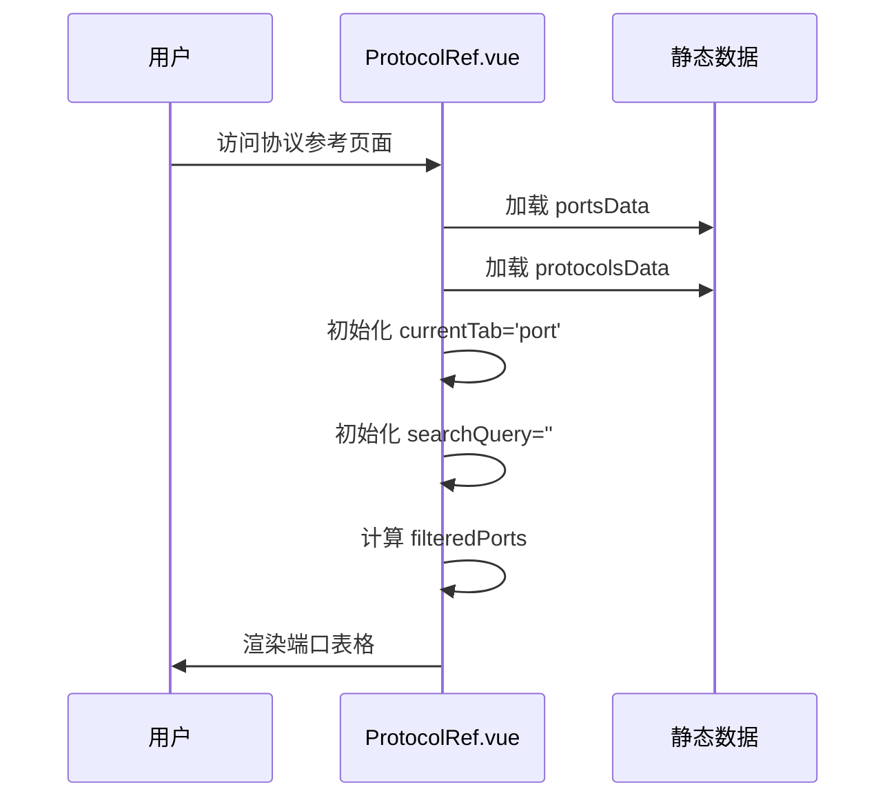
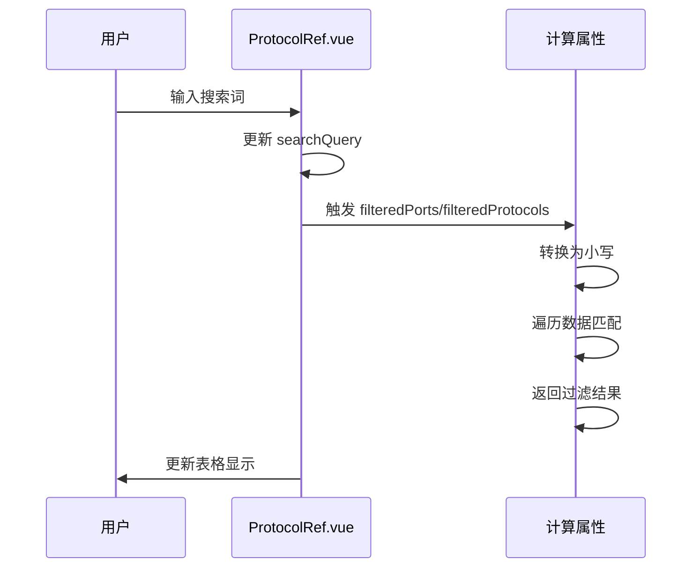
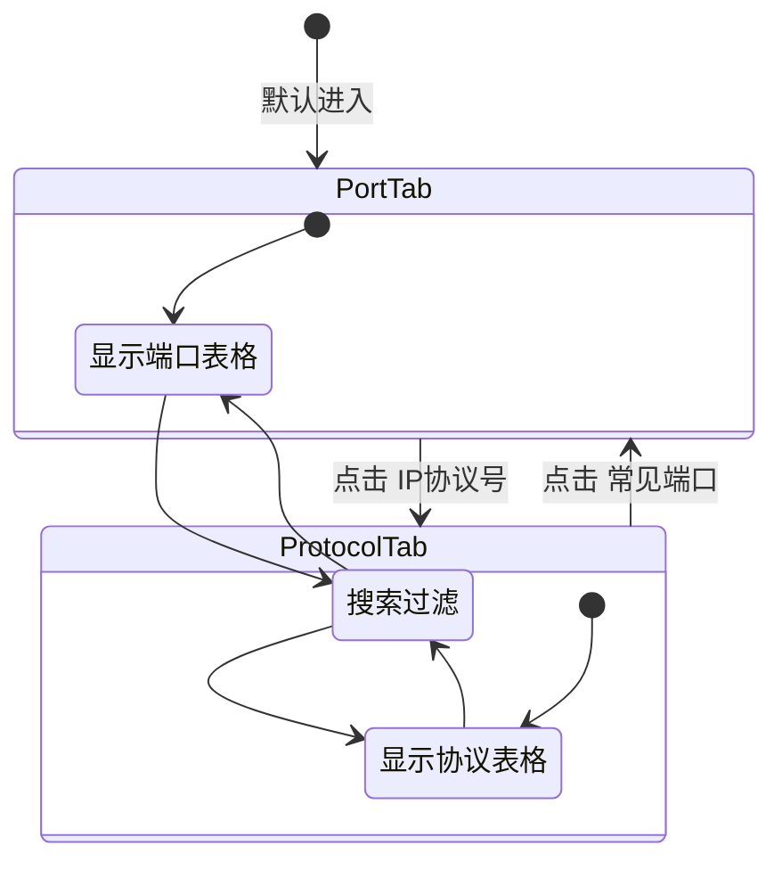
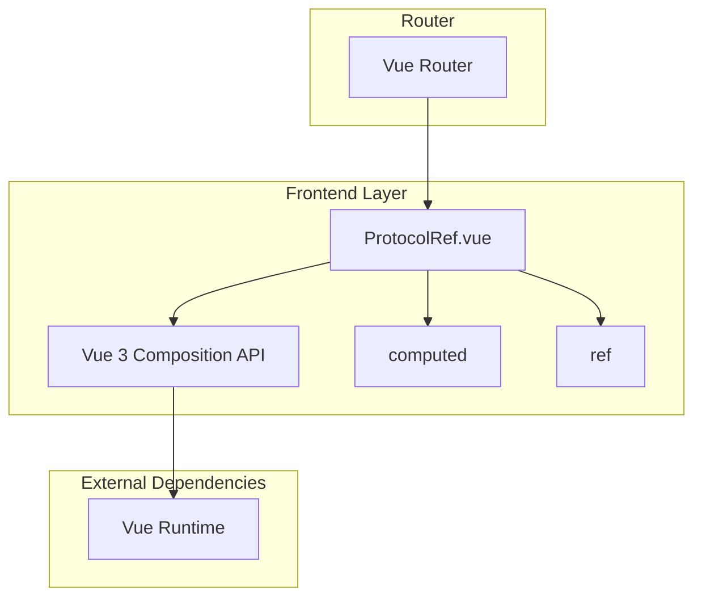

# 协议参考模块功能和逻辑说明书

## 1. 模块概述

### 1.1 整体架构

协议参考模块采用纯前端架构设计，提供网络协议和端口的快速参考查询能力，主要包含以下层次：

```
┌─────────────────────────────────────────────────────────────────┐
│                      UI Layer (frontend/src)                     │
│  ┌─────────────────────────────────────────────────────────┐   │
│  │ ProtocolRef.vue (主视图)                                 │   │
│  │ - 常见端口/IP协议号 Tab 切换                              │   │
│  │ - 全局搜索过滤功能                                        │   │
│  │ - 端口信息表格展示                                        │   │
│  │ - IP协议号表格展示                                        │   │
│  └─────────────────────────────────────────────────────────┘   │
└─────────────────────────────────────────────────────────────────┘
                                │
                                ▼
┌─────────────────────────────────────────────────────────────────┐
│                    Data Layer (静态数据)                          │
│  ┌─────────────────────────────────────────────────────────┐   │
│  │ portsData: PortItem[]                                    │   │
│  │ - 常见网络端口数据 (FTP/SSH/DNS/HTTP 等)                   │   │
│  │                                                          │   │
│  │ protocolsData: ProtocolItem[]                            │   │
│  │ - IP 协议号数据 (ICMP/TCP/UDP/OSPF 等)                     │   │
│  └─────────────────────────────────────────────────────────┘   │
└─────────────────────────────────────────────────────────────────┘
```

### 1.2 核心数据流说明

协议参考模块的数据流采用静态数据+实时过滤模式：

1. **数据加载流程**：组件初始化 → 加载静态端口/协议数据 → 渲染表格
2. **搜索过滤流程**：用户输入搜索词 → 计算属性实时过滤 → 更新表格显示
3. **Tab 切换流程**：点击 Tab → 切换当前视图 → 清空搜索条件 → 重新渲染

### 1.3 模块职责划分

| 模块 | 路径 | 主要职责 |
|------|------|----------|
| **主视图** | `frontend/src/views/Tools/ProtocolRef.vue` | Tab 切换、搜索过滤、数据展示 |

---

## 2. 核心数据结构

### 2.1 前端数据模型

#### 2.1.1 PortItem - 端口信息条目

```typescript
// 文件: frontend/src/views/Tools/ProtocolRef.vue
interface PortItem {
  port: string | number  // 端口号（支持范围如 "20/21"）
  protocol: string       // 传输层协议 (TCP/UDP/TCP/UDP)
  name: string          // 服务名称
  description: string   // 功能描述
}
```

**字段详解**：

| 字段 | 类型 | 说明 |
|------|------|------|
| `port` | string \| number | 端口号，支持单端口（如 `22`）或端口范围（如 `"20/21"`） |
| `protocol` | string | 传输层协议类型：`TCP`、`UDP` 或 `TCP/UDP` |
| `name` | string | 服务名称缩写，如 `SSH`、`HTTP`、`DNS` |
| `description` | string | 服务的中文功能描述 |

#### 2.1.2 ProtocolItem - IP 协议号条目

```typescript
// 文件: frontend/src/views/Tools/ProtocolRef.vue
interface ProtocolItem {
  number: number      // 协议号（十进制）
  hex: string         // 协议号（十六进制）
  name: string        // 协议名称
  description: string // 协议描述
}
```

**字段详解**：

| 字段 | 类型 | 说明 |
|------|------|------|
| `number` | number | IP 协议号（十进制），如 `1` 表示 ICMP |
| `hex` | string | IP 协议号（十六进制），如 `"01"` |
| `name` | string | 协议名称缩写，如 `ICMP`、`TCP`、`OSPF` |
| `description` | string | 协议的中文功能描述 |

### 2.2 静态数据内容

#### 2.2.1 常见端口数据 (portsData)

| 端口 | 协议 | 名称 | 描述 |
|------|------|------|------|
| 20/21 | TCP | FTP | 文件传输协议 (20 数据, 21 控制) |
| 22 | TCP | SSH | 安全外壳协议，用于安全远程登录 |
| 23 | TCP | Telnet | 不安全的远程登录协议 |
| 25 | TCP | SMTP | 简单邮件传输协议 (发送邮件) |
| 53 | TCP/UDP | DNS | 域名系统 (UDP 为主，TCP 用于区域传输) |
| 67/68 | UDP | DHCP | 动态主机配置协议 (67 服务端, 68 客户端) |
| 69 | UDP | TFTP | 简单文件传输协议 |
| 80 | TCP | HTTP | 超文本传输协议 |
| 110 | TCP | POP3 | 邮局协议版本3 (接收邮件) |
| 123 | UDP | NTP | 网络时间协议 |
| 143 | TCP | IMAP | 因特网信息访问协议 (接收邮件) |
| 161/162 | UDP | SNMP | 简单网络管理协议 (161 代理, 162 Trap) |
| 179 | TCP | BGP | 边界网关协议 |
| 443 | TCP | HTTPS | 安全的超文本传输协议 |
| 500 | UDP | ISAKMP | IPsec Internet 安全关联和密钥管理协议 |
| 514 | UDP | Syslog | 系统日志服务 |
| 520 | UDP | RIP | 路由信息协议 |
| 1812/1813 | UDP | RADIUS | 远程认证拨号用户服务 |
| 3389 | TCP | RDP | 远程桌面协议 (Windows) |
| 8080 | TCP | HTTP Proxy | 常见的备用 HTTP 端口或代理端口 |

#### 2.2.2 IP 协议号数据 (protocolsData)

| 协议号 | 十六进制 | 名称 | 描述 |
|--------|----------|------|------|
| 1 | 01 | ICMP | 互联网控制消息协议 |
| 2 | 02 | IGMP | 互联网组管理协议 |
| 4 | 04 | IPv4 | IPv4 封装 |
| 6 | 06 | TCP | 传输控制协议 |
| 17 | 11 | UDP | 用户数据报协议 |
| 41 | 29 | IPv6 | IPv6 封装 |
| 47 | 2F | GRE | 通用路由封装 |
| 50 | 32 | ESP | IPsec 封装安全有效载荷 |
| 51 | 33 | AH | IPsec 认证头 |
| 58 | 3A | IPv6-ICMP | ICMP for IPv6 |
| 88 | 58 | EIGRP | 增强型内部网关路由协议 |
| 89 | 59 | OSPF | 开放式最短路径优先 |
| 103 | 67 | PIM | 协议独立组播 |
| 112 | 70 | VRRP | 虚拟路由器冗余协议 |
| 115 | 73 | L2TP | 第二层隧道协议 |

---

## 3. 工作流程

### 3.1 模块初始化流程



### 3.2 搜索过滤流程



### 3.3 Tab 切换流程



### 3.4 核心函数逻辑说明

#### 3.4.1 [`filteredPorts`](frontend/src/views/Tools/ProtocolRef.vue:63) - 端口过滤计算属性

```typescript
const filteredPorts = computed(() => {
  const q = searchQuery.value.toLowerCase().trim()
  if (!q) return portsData
  return portsData.filter(item => 
    item.name.toLowerCase().includes(q) ||
    String(item.port).toLowerCase().includes(q) ||
    item.description.toLowerCase().includes(q) ||
    item.protocol.toLowerCase().includes(q)
  )
})
```

**过滤逻辑**：
- 搜索词转换为小写并去除首尾空格
- 空搜索词返回全部数据
- 同时匹配名称、端口、描述、协议四个字段

#### 3.4.2 [`filteredProtocols`](frontend/src/views/Tools/ProtocolRef.vue:74) - 协议过滤计算属性

```typescript
const filteredProtocols = computed(() => {
  const q = searchQuery.value.toLowerCase().trim()
  if (!q) return protocolsData
  return protocolsData.filter(item => 
    item.name.toLowerCase().includes(q) ||
    String(item.number).includes(q) ||
    item.hex.toLowerCase().includes(q) ||
    item.description.toLowerCase().includes(q)
  )
})
```

**过滤逻辑**：
- 同时匹配名称、协议号（十进制）、十六进制、描述四个字段
- 协议号匹配支持十进制和十六进制两种格式

#### 3.4.3 [`switchTab`](frontend/src/views/Tools/ProtocolRef.vue:85) - Tab 切换函数

```typescript
const switchTab = (tab: 'port' | 'protocol') => {
  currentTab.value = tab
  searchQuery.value = ''
}
```

**切换逻辑**：
- 更新当前 Tab 状态
- 清空搜索条件，避免切换后无结果

---

## 4. 模块间交互关系

### 4.1 依赖关系图



### 4.2 调用链示例

#### 4.2.1 页面访问调用链

```
用户访问 /tools/protocol-ref
    │
    ▼
Vue Router 解析路由
    │
    ▼
加载 ProtocolRef.vue 组件
    │
    ▼
setup() 执行
    │
    ├── ref('port') → currentTab
    ├── ref('') → searchQuery
    ├── portsData 静态数组初始化
    ├── protocolsData 静态数组初始化
    ├── computed → filteredPorts
    └── computed → filteredProtocols
    │
    ▼
渲染模板（表格视图）
```

#### 4.2.2 搜索操作调用链

```
用户输入搜索词
    │
    ▼
v-model 更新 searchQuery.value
    │
    ▼
Vue 响应式系统触发
    │
    ▼
computed 重新计算
    │
    ├── filteredPorts: filter(portsData)
    └── filteredProtocols: filter(protocolsData)
    │
    ▼
Vue 自动更新 DOM
    │
    ▼
表格显示过滤结果
```

### 4.3 与其他模块的关系

| 关联模块 | 关系类型 | 说明 |
|----------|----------|------|
| **路由模块** | 被调用 | 通过 Vue Router 注册在 `/tools/protocol-ref` 路径 |
| **布局组件** | 被包含 | 作为子路由内容嵌入主布局 |
| **主题系统** | 依赖 | 使用全局 CSS 变量实现主题适配 |

---

## 5. 总结

### 5.1 模块特性总结

| 特性 | 说明 |
|------|------|
| **架构模式** | 纯前端静态数据展示，无后端依赖 |
| **数据来源** | 组件内硬编码静态数据 |
| **搜索机制** | 前端实时过滤，支持多字段匹配 |
| **响应式设计** | 支持移动端和桌面端自适应布局 |
| **性能特点** | 轻量级，无网络请求，即时响应 |

### 5.2 设计优势

1. **零网络依赖**：所有数据内置，离线可用
2. **即时响应**：无网络延迟，搜索结果实时更新
3. **简洁架构**：单文件组件，无复杂状态管理
4. **易于维护**：数据与视图同文件，修改方便

### 5.3 扩展建议

| 扩展方向 | 建议方案 |
|----------|----------|
| **数据扩展** | 可考虑从后端加载更完整的端口/协议数据库 |
| **导出功能** | 添加 CSV/PDF 导出功能便于离线参考 |
| **收藏功能** | 允许用户收藏常用端口/协议 |
| **详情页** | 为每个端口/协议提供更详细的说明页面 |
