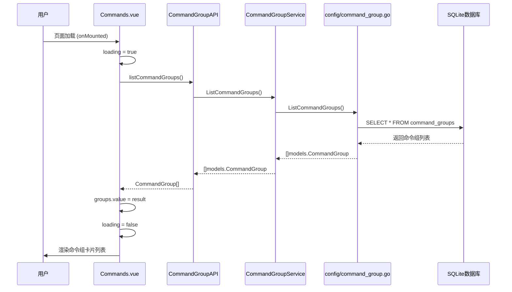
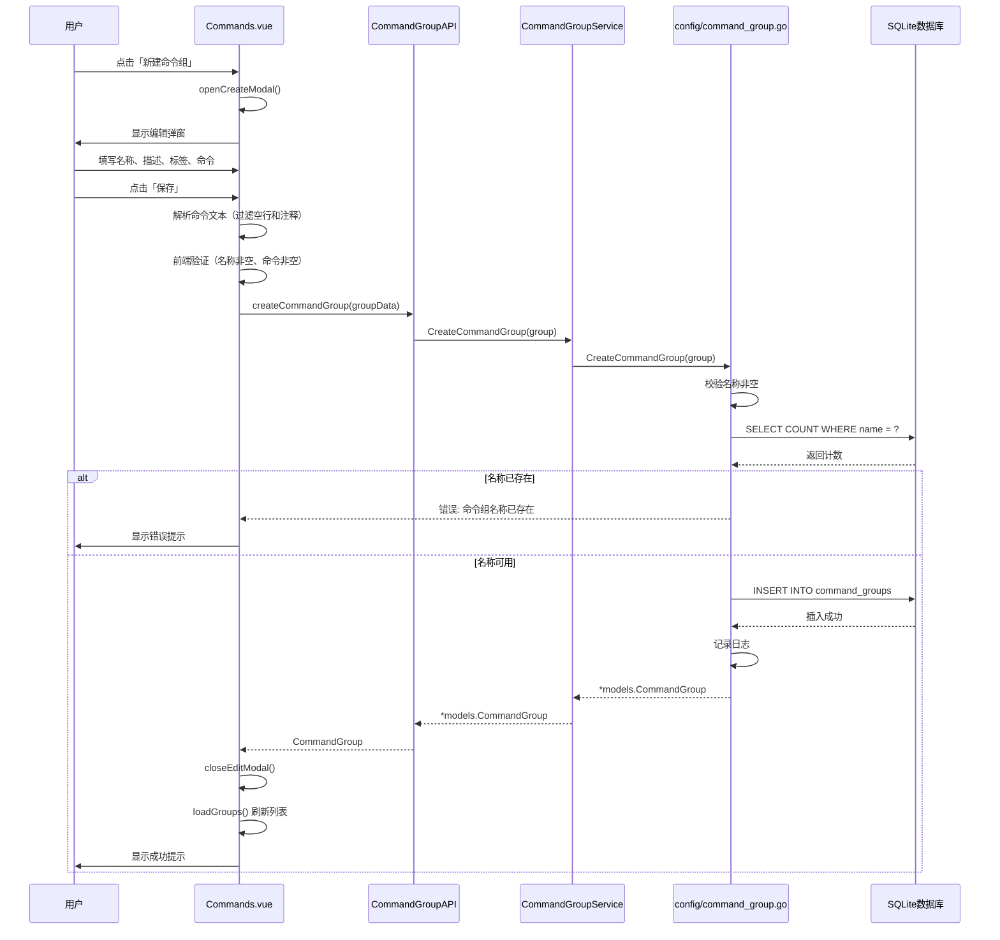
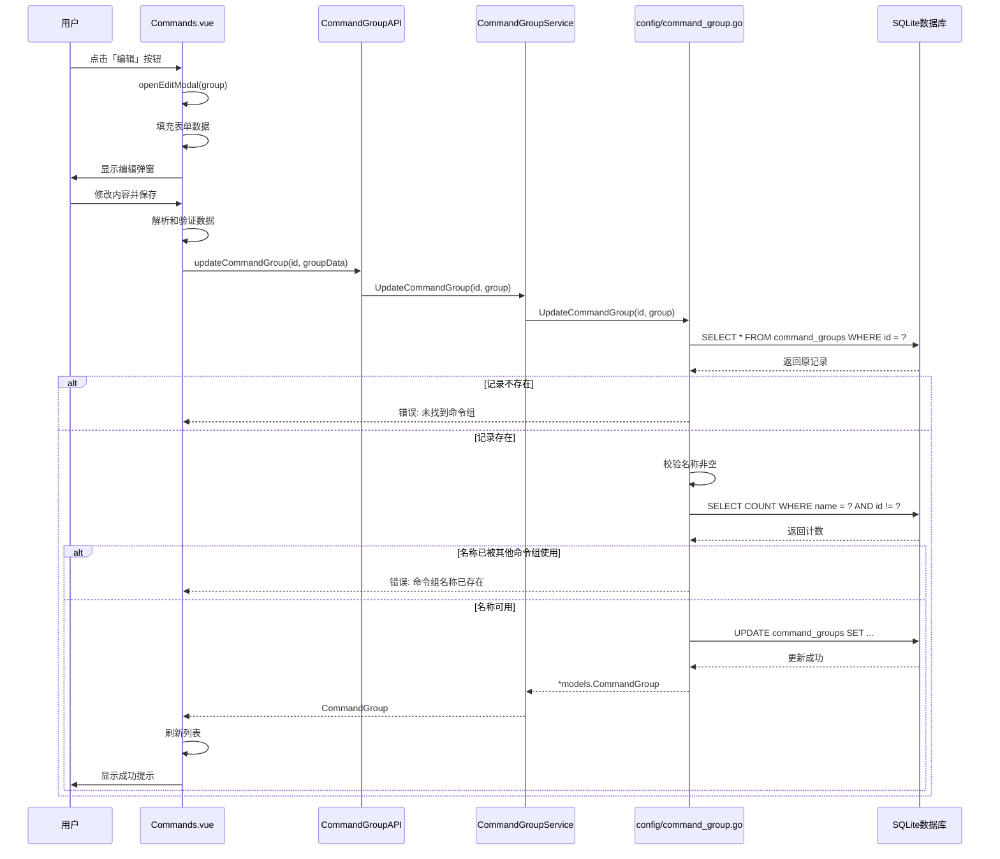
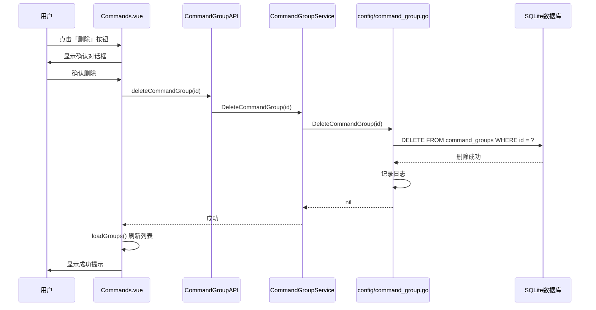
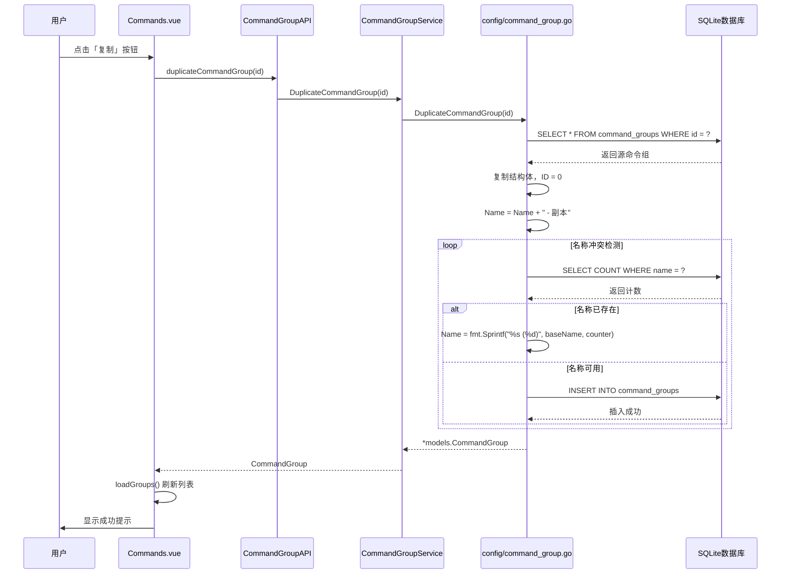
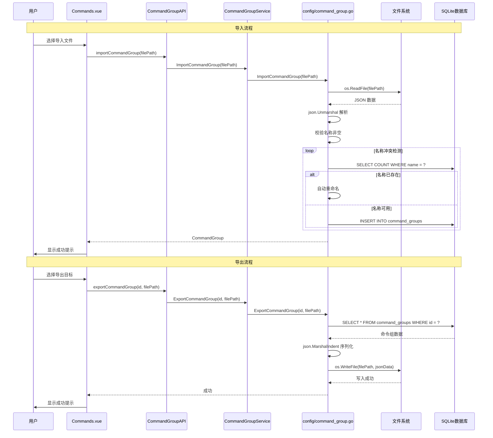

# 命令组管理模块功能和逻辑说明书

## 1. 模块概述

### 1.1 整体架构

命令组管理模块采用分层架构设计，主要包含以下三个层次：

```
┌─────────────────────────────────────────────────────────────────┐
│                      UI Layer (frontend/src)                     │
│  ┌─────────────────────────────────────────────────────────┐   │
│  │ Commands.vue (主视图)                                    │   │
│  │ - 命令组卡片列表展示                                      │   │
│  │ - 搜索和标签筛选                                         │   │
│  │ - 创建/编辑/删除/复制操作                                 │   │
│  │ - 命令预览弹窗                                           │   │
│  └─────────────────────────────────────────────────────────┘   │
└─────────────────────────────────────────────────────────────────┘
                               │
                               ▼
┌─────────────────────────────────────────────────────────────────┐
│                 Service Layer (internal/ui)                      │
│  ┌─────────────────────────────────────────────────────────┐   │
│  │ CommandGroupService                                      │   │
│  │ - 命令组 CRUD 操作代理                                    │   │
│  │ - Wails 服务生命周期管理                                  │   │
│  │ - 导入导出操作                                           │   │
│  └─────────────────────────────────────────────────────────┘   │
└─────────────────────────────────────────────────────────────────┘
                               │
                               ▼
┌─────────────────────────────────────────────────────────────────┐
│              Configuration Layer (internal/config)               │
│  ┌─────────────────────────────────────────────────────────┐   │
│  │ command_group.go                                         │   │
│  │ - 数据持久化 (GORM)                                       │   │
│  │ - 名称唯一性校验                                          │   │
│  │ - 复制/导入导出逻辑                                       │   │
│  │ - 自动重命名冲突处理                                      │   │
│  └─────────────────────────────────────────────────────────┘   │
└─────────────────────────────────────────────────────────────────┘
                               │
                               ▼
┌─────────────────────────────────────────────────────────────────┐
│                 Model Layer (internal/models)                    │
│  ┌─────────────────────────────────────────────────────────┐   │
│  │ CommandGroup                                             │   │
│  │ - ID, Name, Description, Commands, Tags                  │   │
│  │ - CreatedAt, UpdatedAt                                   │   │
│  └─────────────────────────────────────────────────────────┘   │
└─────────────────────────────────────────────────────────────────┘
```

### 1.2 核心数据流说明

命令组管理模块的数据流遵循单向数据流原则：

1. **查询流程**：页面加载 → 调用 [`ListCommandGroups()`](internal/ui/command_group_service.go:28) → 数据库查询 → 返回命令组列表 → 前端渲染卡片
2. **创建流程**：用户填写表单 → 前端解析命令文本 → 调用 [`CreateCommandGroup()`](internal/config/command_group.go:56) → 名称唯一性校验 → 写入数据库
3. **更新流程**：用户编辑表单 → 调用 [`UpdateCommandGroup()`](internal/config/command_group.go:81) → 校验名称唯一性 → 更新数据库
4. **删除流程**：用户确认删除 → 调用 [`DeleteCommandGroup()`](internal/config/command_group.go:112) → 执行删除 → 刷新列表
5. **复制流程**：用户点击复制 → 调用 [`DuplicateCommandGroup()`](internal/config/command_group.go:126) → 自动重命名 → 创建副本
6. **导入导出流程**：读取/写入 JSON 文件 → 名称冲突自动重命名 → 数据持久化

### 1.3 模块职责划分

| 模块 | 路径 | 主要职责 |
|------|------|----------|
| **主视图** | `frontend/src/views/Commands.vue` | 页面状态管理、卡片渲染、弹窗控制、用户交互 |
| **API 绑定** | `frontend/src/services/api.ts` | 后端服务调用封装、类型导出 |
| **Service** | `internal/ui/command_group_service.go` | Wails 服务注册、业务逻辑代理 |
| **Config** | `internal/config/command_group.go` | 数据访问、校验逻辑、导入导出 |
| **Models** | `internal/models/models.go` | 数据结构定义、GORM 映射 |

---

## 2. 核心数据结构

### 2.1 后端数据模型

#### 2.1.1 CommandGroup - 命令组实体

```go
// 文件: internal/models/models.go
type CommandGroup struct {
    ID          uint      `json:"id" gorm:"primaryKey;autoIncrement"`
    Name        string    `json:"name" gorm:"uniqueIndex;not null"`
    Description string    `json:"description"`
    Commands    []string  `json:"commands" gorm:"serializer:json"` // 命令列表
    Tags        []string  `json:"tags" gorm:"serializer:json"`     // 标签列表
    CreatedAt   time.Time `json:"createdAt"`
    UpdatedAt   time.Time `json:"updatedAt"`
}
```

**字段详解**：

| 字段 | 类型 | 说明 | 数据库约束 |
|------|------|------|-----------|
| `ID` | uint | 主键 | 自增 |
| `Name` | string | 命令组名称 | 唯一索引，非空 |
| `Description` | string | 描述信息 | 可选 |
| `Commands` | []string | 命令列表 | JSON 序列化存储 |
| `Tags` | []string | 标签列表 | JSON 序列化存储 |
| `CreatedAt` | time.Time | 创建时间 | 自动填充 |
| `UpdatedAt` | time.Time | 更新时间 | 自动更新 |

**设计要点**：
- `Commands` 和 `Tags` 使用 GORM 的 JSON 序列化器存储，支持复杂数据结构
- `Name` 字段设置唯一索引，确保命令组名称不重复
- 表名为 `command_groups`，通过 [`TableName()`](internal/models/models.go:89) 方法指定

### 2.2 前端数据结构

#### 2.2.1 CommandGroup 类型

```typescript
// 从后端 bindings 自动生成
// 文件: frontend/src/services/api.ts
export const CommandGroupAPI = {
  listCommandGroups: () => Promise<CommandGroup[]>,
  getCommandGroup: (id: number) => Promise<CommandGroup>,
  createCommandGroup: (group: CommandGroup) => Promise<CommandGroup>,
  updateCommandGroup: (id: number, group: CommandGroup) => Promise<CommandGroup>,
  deleteCommandGroup: (id: number) => Promise<void>,
  duplicateCommandGroup: (id: number) => Promise<CommandGroup>,
  importCommandGroup: (filePath: string) => Promise<CommandGroup>,
  exportCommandGroup: (id: number, filePath: string) => Promise<void>,
}
```

#### 2.2.2 编辑弹窗表单状态

```typescript
// 文件: frontend/src/views/Commands.vue
const editModal = ref({
  show: false,           // 弹窗显示状态
  isCreate: true,        // 是否为创建模式
  editingId: 0,          // 编辑时的命令组ID
  form: {
    name: '',            // 命令组名称
    description: '',     // 描述
    tags: [],            // 标签数组
    commandsText: ''     // 命令文本（每行一条）
  },
  saving: false          // 保存中状态
})
```

#### 2.2.3 预览弹窗状态

```typescript
// 文件: frontend/src/views/Commands.vue
const previewModal = ref({
  show: false,           // 弹窗显示状态
  group: null            // 当前预览的命令组
})
```

---

## 3. 工作流程

### 3.1 命令组列表加载流程



### 3.2 命令组创建流程



### 3.3 命令组更新流程



### 3.4 命令组删除流程



### 3.5 命令组复制流程



### 3.6 命令组导入导出流程



---

## 4. 模块间交互关系

### 4.1 依赖关系图

```
┌─────────────────────────────────────────────────────────────────┐
│                         前端层                                   │
│  ┌──────────────┐     ┌──────────────┐     ┌──────────────┐    │
│  │ Commands.vue │────▶│  api.ts      │────▶│  bindings    │    │
│  │ (主视图)      │     │ (API封装)    │     │ (Wails生成)  │    │
│  └──────────────┘     └──────────────┘     └──────────────┘    │
└─────────────────────────────────────────────────────────────────┘
                              │
                              │ Wails IPC
                              ▼
┌─────────────────────────────────────────────────────────────────┐
│                         后端层                                   │
│  ┌──────────────────────┐     ┌──────────────────────┐         │
│  │ CommandGroupService  │────▶│  config/             │         │
│  │ (Wails服务)          │     │  command_group.go    │         │
│  └──────────────────────┘     │  (数据访问层)         │         │
│                               └──────────────────────┘         │
│                                        │                        │
│                                        ▼                        │
│                               ┌──────────────────────┐         │
│                               │  models/             │         │
│                               │  models.go           │         │
│                               │  (数据模型)          │         │
│                               └──────────────────────┘         │
└─────────────────────────────────────────────────────────────────┘
                              │
                              ▼
┌─────────────────────────────────────────────────────────────────┐
│                       数据存储层                                 │
│  ┌──────────────────────────────────────────────────────────┐  │
│  │                    SQLite (command_groups)                │  │
│  └──────────────────────────────────────────────────────────┘  │
└─────────────────────────────────────────────────────────────────┘
```

### 4.2 调用链示例

#### 4.2.1 创建命令组调用链

```
用户操作
    │
    ▼
Commands.vue:saveGroup()
    │ 解析命令文本，构建 groupData
    ▼
CommandGroupAPI.createCommandGroup(groupData)
    │ Wails 绑定调用
    ▼
CommandGroupService.CreateCommandGroup(group)
    │ 代理调用
    ▼
config.CreateCommandGroup(group)
    │ 名称校验 + 数据库操作
    ▼
GORM: DB.Create(&group)
    │
    ▼
SQLite: INSERT INTO command_groups
```

#### 4.2.2 搜索过滤调用链

```
用户输入搜索关键词
    │
    ▼
Commands.vue:searchKeyword (ref)
    │ 触发 computed 重新计算
    ▼
filteredGroups (computed)
    │ 本地过滤逻辑
    ▼
渲染过滤后的卡片列表
```

**说明**：搜索和标签筛选在前端本地执行，无需调用后端 API，提升响应速度。

### 4.3 与其他模块的关系

| 关联模块 | 关系说明 | 交互方式 |
|----------|----------|----------|
| **任务组管理** | 任务组引用命令组作为执行内容 | 通过 `CommandGroup` 名称或 ID 关联 |
| **任务执行** | 执行时读取命令组的命令列表 | 调用 [`GetCommandGroup()`](internal/ui/command_group_service.go:33) 获取详情 |
| **拓扑采集** | 拓扑任务使用命令组定义采集命令 | 任务组配置中指定命令组 |
| **配置备份** | 备份任务使用命令组定义备份命令 | 任务组配置中指定命令组 |

---

## 5. 核心函数说明

### 5.1 后端核心函数

#### 5.1.1 ListCommandGroups - 获取命令组列表

```go
// 文件: internal/config/command_group.go:31
func ListCommandGroups() ([]models.CommandGroup, error)
```

**功能**：查询所有命令组记录

**逻辑**：
1. 检查数据库连接是否初始化
2. 执行 `DB.Find(&groups)` 查询所有记录
3. 返回命令组列表

#### 5.1.2 CreateCommandGroup - 创建命令组

```go
// 文件: internal/config/command_group.go:55
func CreateCommandGroup(group models.CommandGroup) (*models.CommandGroup, error)
```

**功能**：创建新的命令组

**逻辑**：
1. 检查数据库连接
2. 去除名称首尾空格
3. 校验名称非空
4. 查询名称是否已存在（唯一性校验）
5. 执行数据库插入
6. 记录操作日志
7. 返回创建的命令组

#### 5.1.3 UpdateCommandGroup - 更新命令组

```go
// 文件: internal/config/command_group.go:80
func UpdateCommandGroup(id uint, group models.CommandGroup) (*models.CommandGroup, error)
```

**功能**：更新指定 ID 的命令组

**逻辑**：
1. 检查数据库连接
2. 查询原记录是否存在
3. 设置 ID 和处理名称
4. 校验名称非空
5. 查询名称是否被其他命令组使用（排除自身）
6. 执行数据库更新
7. 记录操作日志

#### 5.1.4 DuplicateCommandGroup - 复制命令组

```go
// 文件: internal/config/command_group.go:125
func DuplicateCommandGroup(id uint) (*models.CommandGroup, error)
```

**功能**：复制指定命令组

**逻辑**：
1. 查询源命令组
2. 复制结构体，重置 ID 为 0
3. 设置名称为 "原名称 - 副本"
4. 循环检测名称冲突，自动追加序号
5. 插入新记录
6. 记录操作日志

#### 5.1.5 ImportCommandGroup - 导入命令组

```go
// 文件: internal/config/command_group.go:160
func ImportCommandGroup(filePath string) (*models.CommandGroup, error)
```

**功能**：从 JSON 文件导入命令组

**逻辑**：
1. 读取文件内容
2. JSON 反序列化
3. 校验名称非空
4. 自动处理名称冲突
5. 插入数据库
6. 记录操作日志

#### 5.1.6 ExportCommandGroup - 导出命令组

```go
// 文件: internal/config/command_group.go:201
func ExportCommandGroup(id uint, filePath string) error
```

**功能**：导出命令组到 JSON 文件

**逻辑**：
1. 查询命令组
2. JSON 格式化序列化
3. 创建目标目录
4. 写入文件
5. 记录操作日志

### 5.2 前端核心函数

#### 5.2.1 loadGroups - 加载命令组列表

```typescript
// 文件: frontend/src/views/Commands.vue:286
async function loadGroups()
```

**功能**：从后端加载命令组列表

**逻辑**：
1. 设置 loading 状态
2. 调用 `CommandGroupAPI.listCommandGroups()`
3. 更新 `groups` 响应式变量
4. 捕获错误并记录日志
5. 重置 loading 状态

#### 5.2.2 saveGroup - 保存命令组

```typescript
// 文件: frontend/src/views/Commands.vue:352
async function saveGroup()
```

**功能**：创建或更新命令组

**逻辑**：
1. 检查保存状态，防止重复提交
2. 验证名称非空
3. 解析命令文本（过滤空行和 `#` 注释）
4. 验证命令列表非空
5. 根据 `isCreate` 标志调用创建或更新 API
6. 关闭弹窗并刷新列表
7. 显示成功/失败提示

#### 5.2.3 filteredGroups - 过滤命令组列表

```typescript
// 文件: frontend/src/views/Commands.vue:249
const filteredGroups = computed(() => { ... })
```

**功能**：根据搜索关键词和标签过滤命令组

**逻辑**：
1. 获取原始命令组列表
2. 如果有搜索关键词，过滤名称和描述匹配的项
3. 如果有选中标签，过滤包含该标签的项
4. 返回过滤后的列表

---

## 6. 总结

### 6.1 模块特性总结

| 特性 | 说明 |
|------|------|
| **数据存储** | SQLite 数据库，GORM ORM 框架 |
| **API 设计** | RESTful 风格，Wails 自动绑定 |
| **前端交互** | 卡片式列表，弹窗编辑，实时搜索过滤 |
| **数据校验** | 名称唯一性校验，非空校验 |
| **冲突处理** | 复制/导入时自动重命名 |
| **导入导出** | JSON 格式，支持跨环境迁移 |

### 6.2 设计亮点

1. **简洁的分层架构**：Service 层仅作为代理，业务逻辑集中在 Config 层，降低耦合
2. **智能冲突处理**：复制和导入时自动检测名称冲突并追加序号，避免手动重命名
3. **前端本地过滤**：搜索和标签筛选在前端执行，减少网络请求，提升用户体验
4. **命令文本解析**：支持 `#` 注释行和空行过滤，提升命令编辑效率
5. **完整的导入导出**：JSON 格式便于版本控制和跨环境迁移

### 6.3 文件索引

| 文件路径 | 说明 |
|----------|------|
| [`frontend/src/views/Commands.vue`](frontend/src/views/Commands.vue) | 命令组管理主视图 |
| [`frontend/src/services/api.ts`](frontend/src/services/api.ts:64) | API 封装和类型导出 |
| [`internal/ui/command_group_service.go`](internal/ui/command_group_service.go) | Wails 服务层 |
| [`internal/config/command_group.go`](internal/config/command_group.go) | 数据访问和业务逻辑 |
| [`internal/models/models.go`](internal/models/models.go:144) | CommandGroup 数据模型定义 |
