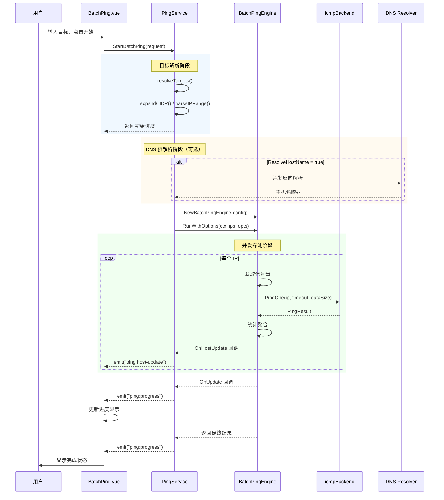
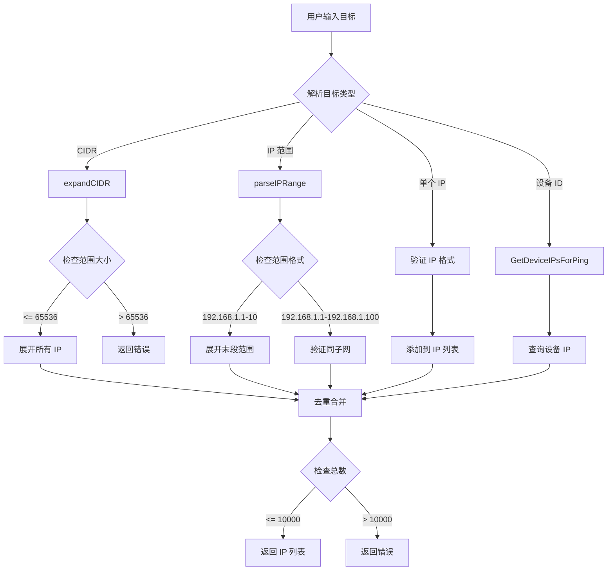
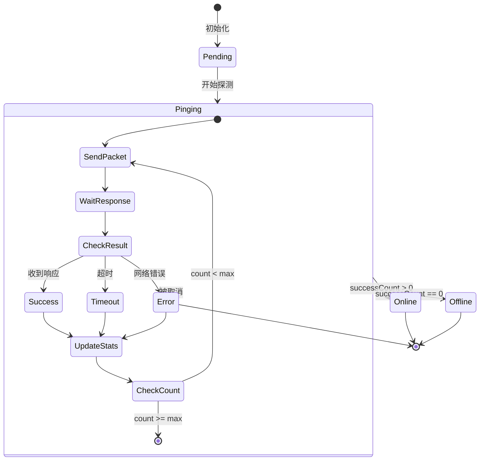
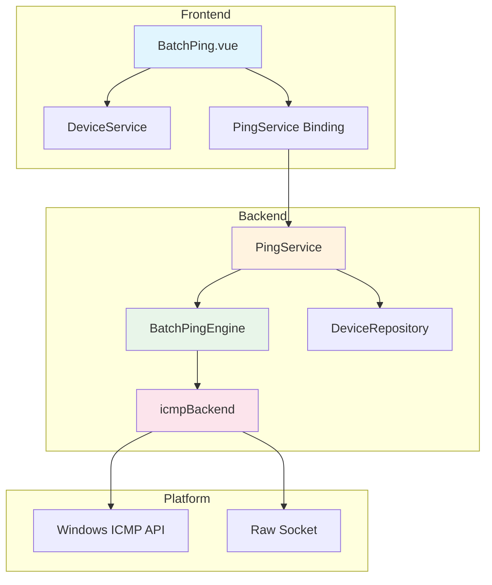

# 批量Ping模块功能和逻辑说明书

## 1. 模块概述

### 1.1 整体架构

批量Ping模块采用分层架构设计，主要包含以下四个层次：

```
┌─────────────────────────────────────────────────────────────────┐
│                      UI Layer (frontend/src)                     │
│  ┌─────────────────────────────────────────────────────────┐   │
│  │ BatchPing.vue (主视图)                                   │   │
│  │ - 目标输入与语法糖展开                                    │   │
│  │ - 实时进度展示与统计面板                                  │   │
│  │ - 设备导入与结果导出                                      │   │
│  │ - 列配置管理与状态持久化                                  │   │
│  └─────────────────────────────────────────────────────────┘   │
└─────────────────────────────────────────────────────────────────┘
                               │
                               ▼
┌─────────────────────────────────────────────────────────────────┐
│                 Service Layer (internal/ui)                      │
│  ┌─────────────────────────────────────────────────────────┐   │
│  │ PingService                                              │   │
│  │ - 目标解析（CIDR/范围/设备导入）                          │   │
│  │ - DNS 预解析与缓存                                       │   │
│  │ - 进度事件推送                                           │   │
│  │ - CSV 导出生成                                           │   │
│  └─────────────────────────────────────────────────────────┘   │
└─────────────────────────────────────────────────────────────────┘
                               │
                               ▼
┌─────────────────────────────────────────────────────────────────┐
│                 Engine Layer (internal/icmp)                     │
│  ┌─────────────────────────────────────────────────────────┐   │
│  │ BatchPingEngine                                          │   │
│  │ - 并发控制（信号量机制）                                  │   │
│  │ - 多次重试与统计聚合                                      │   │
│  │ - 实时状态回调                                           │   │
│  │ - 取消控制                                               │   │
│  └─────────────────────────────────────────────────────────┘   │
└─────────────────────────────────────────────────────────────────┘
                               │
                               ▼
┌─────────────────────────────────────────────────────────────────┐
│                 Backend Layer (internal/icmp)                    │
│  ┌─────────────────────────────────────────────────────────┐   │
│  │ icmpBackend (接口)                                       │   │
│  │ - Windows ICMP API 实现                                  │   │
│  │ - Raw Socket 实现（可选）                                │   │
│  │ - 错误降级处理                                           │   │
│  └─────────────────────────────────────────────────────────┘   │
└─────────────────────────────────────────────────────────────────┘
```

### 1.2 核心数据流说明

批量Ping模块的数据流遵循单向数据流原则：

1. **启动流程**：用户输入目标 → 目标解析（CIDR/范围展开）→ 创建引擎 → 后台执行 → 事件推送
2. **执行流程**：引擎并发调度 → ICMP 后端探测 → 统计聚合 → 进度回调 → 前端更新
3. **实时更新**：单次探测完成 → 主机状态更新事件 → 前端批处理合并 → UI 刷新
4. **停止流程**：用户取消 → Context 取消传播 → 引擎清理 → 最终状态同步

### 1.3 模块职责划分

| 模块 | 路径 | 主要职责 |
|------|------|----------|
| **主视图** | `frontend/src/views/Tools/BatchPing.vue` | UI 渲染、事件处理、状态管理 |
| **Service** | `internal/ui/ping_service.go` | 目标解析、DNS 预解析、事件推送、CSV 导出 |
| **Engine** | `internal/icmp/engine.go` | 并发控制、探测调度、统计聚合 |
| **Backend** | `internal/icmp/icmp_backend.go` | ICMP 后端抽象、平台适配 |
| **Types** | `internal/icmp/types.go` | 数据结构定义、进度管理 |

---

## 2. 核心数据结构

### 2.1 后端数据模型

#### 2.1.1 PingConfig - Ping 配置

```go
// 文件: internal/icmp/types.go
type PingConfig struct {
    Timeout     uint32 // 单次探测超时时间（毫秒）
    DataSize    uint16 // ICMP 数据包大小（字节）
    Count       int    // 每个 IP 的探测次数
    Interval    uint32 // 探测间隔（毫秒）
    Concurrency int    // 最大并发数（0 = 自动）
}
```

**字段详解**：

| 字段 | 类型 | 默认值 | 说明 |
|------|------|--------|------|
| `Timeout` | uint32 | 1000 | 单次 ICMP 探测超时，最大 30000ms |
| `DataSize` | uint16 | 32 | ICMP 载荷大小，最大 65500 字节 |
| `Count` | int | 3 | 重试次数，最大 1000 次 |
| `Interval` | uint32 | 1000 | 同一 IP 两次探测间隔，最大 5000ms |
| `Concurrency` | int | 0 | 并发数，0 表示自动（与目标数一致） |

#### 2.1.2 PingOptions - 扩展选项

```go
// 文件: internal/icmp/types.go
type PingOptions struct {
    ResolveHostName  bool          `json:"resolveHostName"`  // 是否解析主机名
    DNSTimeout       time.Duration `json:"dnsTimeout"`       // DNS 解析超时
    EnableRealtime   bool          `json:"enableRealtime"`   // 启用实时进度
    RealtimeThrottle time.Duration `json:"realtimeThrottle"` // 实时更新节流间隔
}
```

**设计要点**：
- `ResolveHostName`：启用后会在探测前进行反向 DNS 解析
- `EnableRealtime`：启用后会推送每个探测的中间状态
- `RealtimeThrottle`：防止高频更新导致前端性能问题

#### 2.1.3 PingHostResult - 单主机结果

```go
// 文件: internal/icmp/types.go
type PingHostResult struct {
    // === 基本信息 ===
    IP       string `json:"ip"`                 // 目标 IP 地址
    HostName string `json:"hostName,omitempty"` // 反向 DNS 解析的主机名

    // === 状态信息 ===
    Alive    bool   `json:"alive"`              // 是否在线
    Status   string `json:"status"`             // 状态: online/offline/error/pending
    ErrorMsg string `json:"errorMsg,omitempty"` // 错误信息

    // === 计数统计 ===
    SentCount   int `json:"sentCount"`   // 发送包数
    RecvCount   int `json:"recvCount"`   // 接收包数
    FailedCount int `json:"failedCount"` // 失败次数

    // === 丢包率 ===
    LossRate float64 `json:"lossRate"` // 丢包率 (0-100)

    // === RTT 统计 ===
    MinRtt  float64 `json:"minRtt"`            // 最小延迟 (ms), -1 表示无效
    MaxRtt  float64 `json:"maxRtt"`            // 最大延迟 (ms)
    AvgRtt  float64 `json:"avgRtt"`            // 平均延迟 (ms)
    LastRtt float64 `json:"lastRtt,omitempty"` // 最后一次延迟 (ms)

    // === TTL 信息 ===
    TTL uint8 `json:"ttl"` // 最后成功的 TTL

    // === 时间戳 ===
    LastSucceedAt int64 `json:"lastSucceedAt,omitempty"` // 最后成功时间
    LastFailedAt  int64 `json:"lastFailedAt,omitempty"`  // 最后失败时间
}
```

**状态值说明**：

| 状态 | 含义 | 判断条件 |
|------|------|----------|
| `pending` | 等待探测 | 初始状态 |
| `online` | 在线 | `RecvCount > 0` |
| `offline` | 离线 | `RecvCount == 0 && SentCount > 0` |
| `error` | 错误 | IP 无效或被取消 |

#### 2.1.4 BatchPingProgress - 批量探测进度

```go
// 文件: internal/icmp/types.go
type BatchPingProgress struct {
    TotalIPs     int              `json:"totalIPs"`     // 总 IP 数
    CompletedIPs int              `json:"completedIPs"` // 已完成数
    OnlineCount  int              `json:"onlineCount"`  // 在线数
    OfflineCount int              `json:"offlineCount"` // 离线数
    ErrorCount   int              `json:"errorCount"`   // 错误数
    Progress     float64          `json:"progress"`     // 进度百分比 (0-100)
    IsRunning    bool             `json:"isRunning"`    // 是否运行中
    StartTime    time.Time        `json:"startTime"`    // 开始时间
    ElapsedMs    int64            `json:"elapsedMs"`    // 已用时间 (ms)
    Results      []PingHostResult `json:"results"`      // 各 IP 结果
}
```

**设计要点**：
- `Results` 按输入顺序存储，通过索引直接访问
- 提供 [`SetResult()`](internal/icmp/types.go:167) 方法保证线程安全
- 提供 [`Clone()`](internal/icmp/types.go:200) 方法用于深拷贝

#### 2.1.5 HostPingUpdate - 主机中间状态更新

```go
// 文件: internal/icmp/types.go
type HostPingUpdate struct {
    IP           string       `json:"ip"`           // 目标 IP
    Index        int          `json:"index"`        // 在列表中的索引 (0-based)
    CurrentSeq   int          `json:"currentSeq"`   // 当前探测序号 (1-based)
    PartialStats PartialStats `json:"partialStats"` // 部分统计
    IsComplete   bool         `json:"isComplete"`   // 是否全部完成
    Timestamp    int64        `json:"timestamp"`    // 更新时间戳 (Unix ms)
}
```

**设计要点**：
- 用于实时推送探测中间状态
- `IsComplete=true` 时表示该 IP 所有探测已完成
- 前端通过 `Timestamp` 防止乱序更新

#### 2.1.6 PartialStats - 部分统计数据

```go
// 文件: internal/icmp/types.go
type PartialStats struct {
    SentCount     int     `json:"sentCount"`     // 已发送包数
    RecvCount     int     `json:"recvCount"`     // 已接收包数
    FailedCount   int     `json:"failedCount"`   // 失败次数
    LossRate      float64 `json:"lossRate"`      // 当前丢包率
    LastRtt       float64 `json:"lastRtt"`       // 最后延迟
    MinRtt        float64 `json:"minRtt"`        // 最小延迟
    MaxRtt        float64 `json:"maxRtt"`        // 最大延迟
    AvgRtt        float64 `json:"avgRtt"`        // 平均延迟
    ErrorMsg      string  `json:"errorMsg,omitempty"`      // 错误信息
    LastSucceedAt int64   `json:"lastSucceedAt,omitempty"` // 最后成功时间
    LastFailedAt  int64   `json:"lastFailedAt,omitempty"`  // 最后失败时间
    TTL           uint8   `json:"ttl"`                     // TTL
}
```

### 2.2 前端数据结构

#### 2.2.1 PingRequest - 请求参数

```typescript
// 文件: frontend/src/views/Tools/BatchPing.vue
interface PingRequest {
  targets: string         // IP 地址、CIDR 或范围（换行分隔）
  config: PingConfig      // Ping 配置
  deviceIds: number[]     // 设备 ID 列表（可选）
  options: PingOptions    // 扩展选项
}
```

#### 2.2.2 ColumnConfig - 列配置

```typescript
// 文件: frontend/src/views/Tools/BatchPing.vue
interface ColumnConfig {
  key: string       // 列标识
  label: string     // 列标题
  visible: boolean  // 是否显示
  width?: number    // 列宽度
}
```

**默认列配置**：

| key | label | 默认显示 |
|-----|-------|----------|
| `index` | # | 是 |
| `ip` | IP 地址 | 是 |
| `hostName` | 主机名 | 否 |
| `status` | 状态 | 是 |
| `successFailed` | 成功/失败 | 是 |
| `minLatency` | 最小延迟 | 是 |
| `maxLatency` | 最大延迟 | 是 |
| `avgLatency` | 平均延迟 | 是 |
| `lastLatency` | 最后延迟 | 是 |
| `ttl` | TTL | 是 |
| `lossRate` | 丢包率 | 是 |
| `lastSucceedAt` | 最后成功 | 否 |
| `lastFailedAt` | 最后失败 | 否 |
| `errorMsg` | 错误信息 | 是 |

#### 2.2.3 RealtimeOverlayItem - 实时覆盖层状态

```typescript
// 文件: frontend/src/views/Tools/BatchPing.vue
interface RealtimeOverlayItem {
  lastUpdateTimestamp: number      // 最后更新时间戳
  status: 'pinging' | 'completed'  // 状态
}
```

**设计要点**：
- 用于跟踪正在探测的主机
- 防止乱序更新覆盖最终状态

---

## 3. 工作流程

### 3.1 批量 Ping 执行时序图



### 3.2 目标解析流程



### 3.3 单主机探测流程



### 3.4 核心函数逻辑说明

#### 3.4.1 StartBatchPing - 启动批量探测

```go
// 文件: internal/ui/ping_service.go:122
func (s *PingService) StartBatchPing(req PingRequest) (*icmp.BatchPingProgress, error)
```

**执行步骤**：
1. **目标解析**：调用 [`resolveTargets()`](internal/ui/ping_service.go:513) 展开 CIDR 和 IP 范围
2. **参数校验**：检查 IP 数量限制（最大 10000）和数据包大小限制
3. **配置合并**：与默认配置合并，应用上限约束
4. **引擎创建**：创建 [`BatchPingEngine`](internal/icmp/engine.go:15) 实例
5. **后台执行**：启动 goroutine 执行探测
6. **DNS 预解析**：如果启用，并发执行反向 DNS 解析
7. **事件推送**：通过 Wails Event 推送进度更新

#### 3.4.2 RunWithOptions - 执行批量探测

```go
// 文件: internal/icmp/engine.go:73
func (e *BatchPingEngine) RunWithOptions(ctx context.Context, ips []string, opts RunOptions) *BatchPingProgress
```

**执行步骤**：
1. **创建 Context**：支持取消控制
2. **初始化进度**：创建 [`BatchPingProgress`](internal/icmp/types.go:117) 实例
3. **并发控制**：使用信号量限制并发数
4. **启动 Worker**：为每个 IP 启动 goroutine
5. **探测执行**：调用 [`pingHostWithOptions()`](internal/icmp/engine.go:221) 执行探测
6. **统计聚合**：收集结果并更新进度
7. **回调通知**：通过 `OnUpdate` 和 `OnHostUpdate` 回调

#### 3.4.3 pingHostWithOptions - 单主机探测

```go
// 文件: internal/icmp/engine.go:221
func (e *BatchPingEngine) pingHostWithOptions(ctx context.Context, ip net.IP, index int, onSinglePing func(SinglePingResult), onHostUpdate func(HostPingUpdate)) PingHostResult
```

**执行步骤**：
1. **初始化结果**：创建 [`PingHostResult`](internal/icmp/types.go:84) 实例
2. **循环探测**：执行 `Count` 次探测
3. **调用后端**：通过 [`PingOne()`](internal/icmp/icmp_backend.go:25) 发送 ICMP 包
4. **统计更新**：更新 RTT 统计（最小/最大/平均）
5. **中间回调**：每次探测后触发 `OnHostUpdate`
6. **间隔等待**：根据 `Interval` 配置等待
7. **最终状态**：根据成功次数设置 `online/offline` 状态

#### 3.4.4 StopBatchPing - 停止探测

```go
// 文件: internal/ui/ping_service.go:302
func (s *PingService) StopBatchPing() error
```

**执行步骤**：
1. **取消 DNS**：取消正在进行的 DNS 预解析
2. **调用引擎停止**：调用 [`engine.Stop()`](internal/icmp/engine.go:454)
3. **等待完成**：带超时等待引擎实际停止
4. **清理引用**：释放引擎实例

---

## 4. 模块间交互关系

### 4.1 依赖关系图



### 4.2 调用链示例

#### 4.2.1 启动批量 Ping

```
用户点击"开始"
    ↓
BatchPing.vue:startPing()
    ↓
PingService.StartBatchPing(request)
    ↓
PingService.resolveTargets()
    ├── expandCIDR()
    ├── parseIPRange()
    └── GetDeviceIPsForPing()
    ↓
icmp.NewBatchPingEngine(config)
    ↓
engine.RunWithOptions(ctx, ips, opts)
    ↓
    ├── goroutine: pingHostWithOptions()
    │       ↓
    │   PingOne() → icmpBackend.pingOne()
    │       ↓
    │   OnHostUpdate 回调
    │       ↓
    │   emitHostUpdate() → Event: "ping:host-update"
    │
    └── OnUpdate 回调
            ↓
        emitProgress() → Event: "ping:progress"
```

#### 4.2.2 实时进度更新

```
ICMP 探测完成
    ↓
pingHostWithOptions() 计算 PartialStats
    ↓
OnHostUpdate(HostPingUpdate)
    ↓
PingService.emitHostUpdate()
    ↓
Wails Event: "ping:host-update"
    ↓
BatchPing.vue:handleHostUpdateEvent()
    ↓
requestAnimationFrame 批处理
    ↓
applyHostUpdate() 更新本地状态
    ↓
Vue 响应式更新 UI
```

### 4.3 事件类型

| 事件名 | 数据类型 | 触发时机 |
|--------|----------|----------|
| `ping:progress` | `BatchPingProgress` | 整体进度更新、完成时 |
| `ping:host-update` | `HostPingUpdate` | 单个 IP 探测中间状态 |

---

## 5. 总结表格

### 5.1 功能特性

| 特性 | 说明 | 实现位置 |
|------|------|----------|
| **目标语法糖** | 支持 CIDR、IP 范围、设备导入 | [`resolveTargets()`](internal/ui/ping_service.go:513) |
| **并发控制** | 信号量机制，可配置并发数 | [`RunWithOptions()`](internal/icmp/engine.go:73) |
| **多次重试** | 每个 IP 多次探测，统计聚合 | [`pingHostWithOptions()`](internal/icmp/engine.go:221) |
| **实时进度** | 探测中间状态实时推送 | [`HostPingUpdate`](internal/icmp/types.go:241) |
| **DNS 解析** | 可选的反向 DNS 预解析 | [`resolveHostNames()`](internal/ui/ping_service.go:816) |
| **取消控制** | Context 传播，优雅停止 | [`Stop()`](internal/icmp/engine.go:454) |
| **CSV 导出** | UTF-8 BOM，Excel 兼容 | [`ExportPingResultCSV()`](internal/ui/ping_service.go:369) |
| **列配置** | 可自定义显示列，持久化存储 | [`ColumnConfig`](frontend/src/views/Tools/BatchPing.vue:42) |

### 5.2 配置参数

| 参数 | 默认值 | 范围 | 说明 |
|------|--------|------|------|
| `Timeout` | 1000ms | 0-30000ms | 单次探测超时 |
| `DataSize` | 32 | 0-65500 | ICMP 载荷大小 |
| `Count` | 3 | 0-1000 | 探测次数 |
| `Interval` | 1000ms | 0-5000ms | 探测间隔 |
| `Concurrency` | 0 (自动) | 0-无限制 | 并发数 |
| `DNSTimeout` | 2s | 0-30s | DNS 解析超时 |
| `RealtimeThrottle` | 100ms | 10ms+ | 实时更新节流 |

### 5.3 性能指标

| 指标 | 数值 | 说明 |
|------|------|------|
| 最大 IP 数 | 10000 | 单次探测上限 |
| 最大 CIDR | /16 | 65536 地址 |
| 最大并发 | 无硬限制 | 警告阈值 256 |
| DNS 缓存 TTL | 5 分钟 | 自动清理 |

### 5.4 错误处理

| 错误类型 | 处理方式 | 用户提示 |
|----------|----------|----------|
| IP 格式无效 | 跳过并记录 | "无效的 IP 地址" |
| CIDR 范围过大 | 拒绝执行 | "CIDR 范围过大" |
| 数据包超限 | 拒绝执行 | "数据包大小超过限制" |
| 探测超时 | 标记失败 | 统计为丢包 |
| 网络不可达 | 标记错误 | 显示错误信息 |
| 取消操作 | 标记取消 | 状态为 "error" |

---

## 6. 设计要点

### 6.1 并发安全

- **进度更新**：使用 `sync.Mutex` 保护 [`BatchPingProgress`](internal/icmp/types.go:117) 的写入
- **引擎状态**：使用 `sync.RWMutex` 保护 `running` 标志
- **DNS 缓存**：使用 `sync.RWMutex` 保护缓存读写

### 6.2 性能优化

- **自适应节流**：根据 IP 数量动态调整更新频率
- **批处理合并**：前端使用 `requestAnimationFrame` 合并更新
- **预分配内存**：`Results` 数组预分配固定大小

### 6.3 用户体验

- **实时反馈**：探测中间状态实时显示
- **进度可视化**：进度条、统计面板、状态图标
- **结果导出**：CSV 格式，Excel 兼容
- **列配置持久化**：LocalStorage 保存用户偏好
