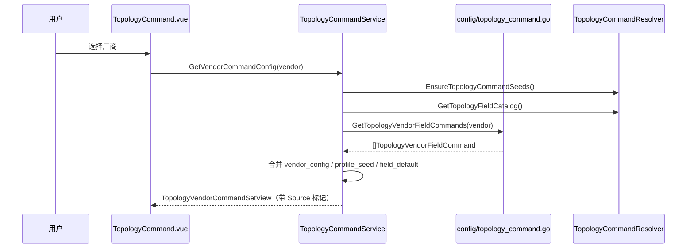
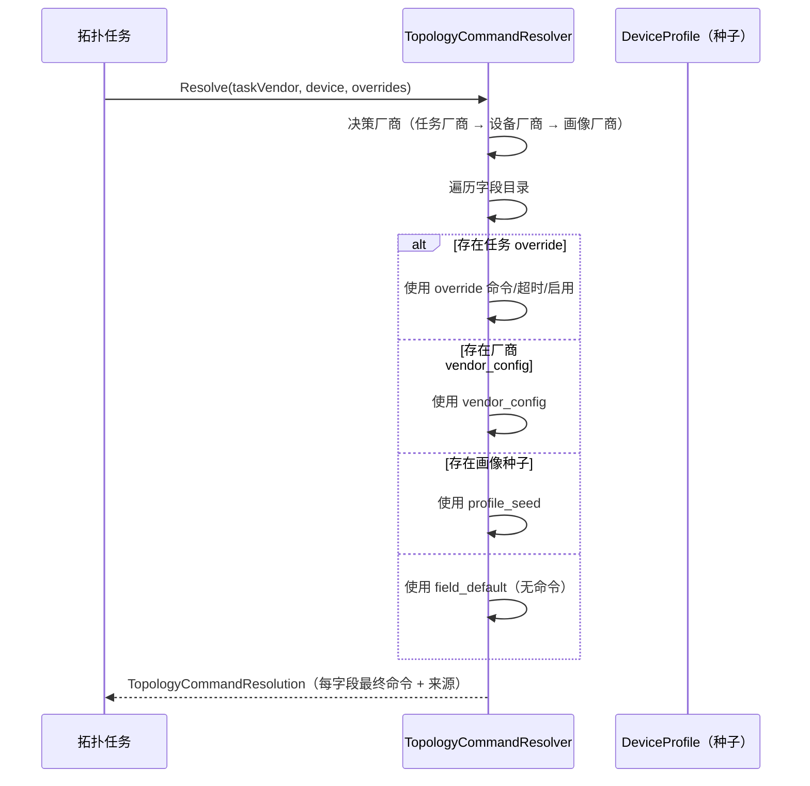

# 拓扑命令配置模块功能和逻辑说明书

> 本文档基于 `internal/ui/topology_command_service.go`、`internal/config/topology_command.go`、`internal/models/topology_command.go` 与 `internal/taskexec` 中的 `TopologyCommandResolver` 源码整理，描述拓扑采集的「字段 → 命令」映射配置体系。

## 1. 模块概述

拓扑命令配置模块用于**集中管理拓扑采集所需的字段与采集命令的映射关系**。拓扑还原任务在采集阶段需要根据设备厂商执行不同的命令（如 `display version`、`show version` 等），本模块按厂商维护「字段目录 → 采集命令 + 超时 + 是否启用」的配置，并在任务启动时解析出每台设备实际应执行的命令集。

### 1.1 整体架构

```
┌─────────────────────────────────────────────────────────────────┐
│                      UI Layer (frontend/src)                     │
│  ┌─────────────────────────────────────────────────────────┐   │
│  │ TopologyCommand.vue (或拓扑任务配置界面内嵌)              │   │
│  │ - 厂商命令配置（增删改、启用开关、超时设置）              │   │
│  │ - 命令预览（按厂商 + 设备解析实际命令集）                │   │
│  └─────────────────────────────────────────────────────────┘   │
└─────────────────────────────────────────────────────────────────┘
                               │
                               ▼
┌─────────────────────────────────────────────────────────────────┐
│                 Service Layer (internal/ui)                      │
│  ┌─────────────────────────────────────────────────────────┐   │
│  │ TopologyCommandService                                  │   │
│  │ - 厂商命令配置 CRUD                                     │   │
│  │ - 字段目录查询                                          │   │
│  │ - 命令解析与预览（委托 TopologyCommandResolver）         │   │
│  └─────────────────────────────────────────────────────────┘   │
└─────────────────────────────────────────────────────────────────┘
                               │
                               ▼
┌─────────────────────────────────────────────────────────────────┐
│              Config / Resolver Layer                              │
│  ┌─────────────────────────────────────────────────────────┐   │
│  │ config/topology_command.go                              │   │
│  │ - 厂商字段命令持久化（GORM）                            │   │
│  │ - 种子补齐（EnsureTopologyVendorCommandSeeds）          │   │
│  │ taskexec.TopologyCommandResolver                       │   │
│  │ - 厂商解析与命令决策（多来源合并）                      │   │
│  └─────────────────────────────────────────────────────────┘   │
└─────────────────────────────────────────────────────────────────┘
                               │
                               ▼
┌─────────────────────────────────────────────────────────────────┐
│                 Model Layer (internal/models)                    │
│  TopologyFieldSpec / TopologyVendorFieldCommand /               │
│  TopologyTaskFieldOverride                                      │
└─────────────────────────────────────────────────────────────────┘
```

### 1.2 核心数据流

1. **初始化**：应用启动后，设备画像（DeviceProfile）中内置的采集命令作为种子写入 `topology_vendor_field_commands` 的缺失项（`EnsureTopologyVendorCommandSeeds`）。
2. **配置流程**：用户在前端选择厂商 → 调用 `GetVendorCommandConfig` 加载当前配置 → 修改命令/超时/启用 → `SaveVendorCommandConfig` 覆盖保存。
3. **解析流程**：拓扑任务启动时，`TopologyCommandResolver.Resolve(taskVendor, *device, overrides)` 综合「厂商配置 / 设备画像种子 / 任务级 override」决策出最终命令集。
4. **预览流程**：`PreviewTopologyCommands` 在不真正执行的情况下，按厂商与具体设备解析出各自的命令清单，供用户确认。

### 1.3 模块职责划分

| 模块 | 路径 | 主要职责 |
|------|------|----------|
| **UI 服务** | `internal/ui/topology_command_service.go` | 厂商命令配置、字段目录、命令解析预览 |
| **配置持久化** | `internal/config/topology_command.go` | 厂商字段命令 CRUD、种子补齐 |
| **命令解析器** | `internal/taskexec`（`TopologyCommandResolver`） | 厂商解析、多来源命令合并 |
| **数据模型** | `internal/models/topology_command.go` | 字段目录、厂商命令、任务覆盖结构 |
| **设备画像种子** | `internal/config/device_profile.go` | 各厂商内置采集命令种子 |

---

## 2. 核心数据结构

### 2.1 后端数据模型

#### 2.1.1 TopologyFieldSpec - 拓扑字段目录（固定）

字段目录是**系统固定的采集字段集合**，定义拓扑还原需要采集哪些信息，每个字段绑定一个解析器（parserBinding）。

```go
// 文件: internal/models/topology_command.go
type TopologyFieldSpec struct {
    FieldKey       string `json:"fieldKey"`       // 字段键（唯一标识）
    Name           string `json:"name"`           // 中文显示名
    Phase          string `json:"phase"`          // 阶段（如 collect）
    Required       bool   `json:"required"`       // 是否必采
    ParserBinding  string `json:"parserBinding"`  // 关联的解析器键
    DefaultEnabled bool   `json:"defaultEnabled"` // 默认是否启用
    Description    string `json:"description"`    // 说明
}
```

**内置字段目录**（通过 `DefaultTopologyFieldCatalog()` 返回）：

| FieldKey | 名称 | 必采 | 解析器 | 说明 |
|----------|------|------|--------|------|
| `version` | 系统版本 | 是 | `version` | 采集设备版本与系统镜像信息 |
| `sysname` | 设备名称 | 是 | `sysname` | 采集设备 sysname / hostname |
| `interface_brief` | 接口概要 | 是 | `interface_brief` | 采集接口 up/down 与基础摘要 |
| `lldp_neighbor` | LLDP 邻居 | 是 | `lldp_neighbor` | 采集 LLDP 邻居发现结果 |
| `arp_all` | ARP 表 | 是 | `arp_all` | 采集 ARP 地址表 |
| `mac_address` | MAC 地址表 | 否 | `mac_address` | 采集 FDB/MAC 转发表，用于推断终端连接 |
| `eth_trunk` | 聚合链路 | 否 | `eth_trunk` | 采集 Eth-Trunk / Port-Channel 聚合信息 |

#### 2.1.2 TopologyVendorFieldCommand - 厂商字段命令映射（可持久化）

```go
// 文件: internal/models/topology_command.go
type TopologyVendorFieldCommand struct {
    ID         uint      `json:"id" gorm:"primaryKey;autoIncrement"`
    Vendor     string    `json:"vendor" gorm:"not null;index:idx_topology_vendor_field,unique"`
    FieldKey   string    `json:"fieldKey" gorm:"not null;index:idx_topology_vendor_field,unique"`
    Command    string    `json:"command"`    // 该厂商下采集该字段的命令
    TimeoutSec int       `json:"timeoutSec"` // 命令超时（秒）
    Enabled    bool      `json:"enabled"`    // 是否启用
    Notes      string    `json:"notes"`      // 备注
    CreatedAt  time.Time `json:"createdAt"`
    UpdatedAt  time.Time `json:"updatedAt"`
}
```

- **存储表**：`topology_vendor_field_commands`
- **唯一约束**：`(vendor, field_key)` 组合唯一，即每个厂商的每个字段仅一条命令配置。
- **默认超时**：常量 `defaultTopologyCommandTimeoutSec = 30`（秒），当记录或画像种子未提供正超时值时回退到此值（`clampTimeout`）。

#### 2.1.3 TopologyTaskFieldOverride - 任务级字段覆盖

```go
// 文件: internal/models/topology_command.go
type TopologyTaskFieldOverride struct {
    FieldKey   string `json:"fieldKey"`
    Command    string `json:"command"`
    TimeoutSec int    `json:"timeoutSec"`
    Enabled    *bool  `json:"enabled,omitempty"` // 指针，区分「未设置」与「显式 false」
}
```

用于在单个任务中临时覆盖某字段的命令/超时/启用状态，不影响厂商级默认配置。

### 2.2 配置的来源优先级（解析合并）

`getVendorCommandConfig` 与 `Resolve` 在合并字段命令时，按以下来源优先级（高 → 低）：

1. **vendor_config**：`topology_vendor_field_commands` 表中该厂商已保存的配置（`Source = "vendor_config"`）。
2. **profile_seed**：设备画像（DeviceProfile）内置的命令种子（`Source = "profile_seed"`，`Notes = "seeded_from_device_profile"`）。
3. **field_default**：固定字段目录的默认定义（`Source = "field_default"`，不携带具体命令）。

一条命令被视为「启用」需同时满足：对应来源启用 **且** 命令非空（`Enabled && Command != ""`）。

---

## 3. 工作流程

### 3.1 厂商命令配置加载时序



### 3.2 命令解析流程



---

## 4. 模块间交互关系

### 4.1 与其他模块的关系

| 关联模块 | 关系说明 |
|----------|----------|
| **设备画像模块** | 厂商默认命令种子来源于 `DeviceProfile`，是该模块的内置数据来源 |
| **设备管理模块** | `PreviewTopologyCommands` 按 `deviceIDs` 查询设备资产，结合设备厂商解析命令 |
| **拓扑还原模块** | 任务执行时通过 `TopologyCommandResolver` 获取实际采集命令集 |
| **数据访问层** | 厂商命令配置通过 GORM 持久化到 `topology_vendor_field_commands` 表 |

### 4.2 核心 API（Wails 服务暴露）

| 方法 | 说明 |
|------|------|
| `GetSupportedTopologyVendors()` | 返回系统支持的拓扑厂商（来自 resolver，回退 `huawei/h3c/cisco`） |
| `GetTopologyFieldCatalog()` | 返回固定字段目录 |
| `GetVendorCommandConfig(vendor)` | 获取某厂商的命令配置（三来源合并，带 `Source` 标记） |
| `SaveVendorCommandConfig(request)` | 保存厂商命令配置（覆盖写库，含校验） |
| `ResetVendorCommandConfig(vendor)` | 重置为系统种子（来自设备画像） |
| `PreviewTopologyCommands(taskVendor, deviceIDs, overrides)` | 命令预览，按厂商与设备解析实际命令集 |
| `GetTaskTopologyVendors()` | 任务可选厂商（系统支持 ∪ 资产厂商并集，保证含 `huawei`） |

---

## 5. 关键实现要点

1. **种子补齐策略**：`EnsureTopologyVendorCommandSeeds` 仅在 `(vendor, field_key)` 缺失时写入，不会覆盖用户已有的配置。
2. **保存校验**：`SaveVendorCommandConfig` 要求字段键必须存在于字段目录；启用字段的命令不可为空；超时必须大于 0，否则返回错误。
3. **厂商决策链路**：解析时优先使用任务指定的厂商，回退到设备资产厂商，再回退画像厂商，最终解析出 `ResolvedVendor` 与 `VendorSource`。
4. **默认超时 30s**：`defaultTopologyCommandTimeoutSec = 30`，空/非正超时自动回退到该值。
5. **任务级覆盖**：`TopologyTaskFieldOverride.Enabled` 使用 `*bool`，以区分「未设置」与「显式关闭」。
6. **并发安全**：配置读写基于数据库事务（`SaveTopologyVendorFieldCommands` 先删后插，保证厂商配置整体一致）。
