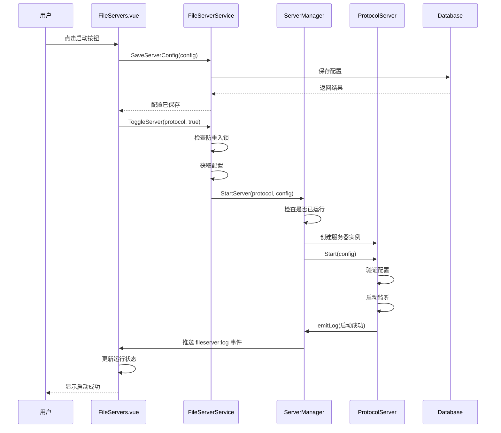
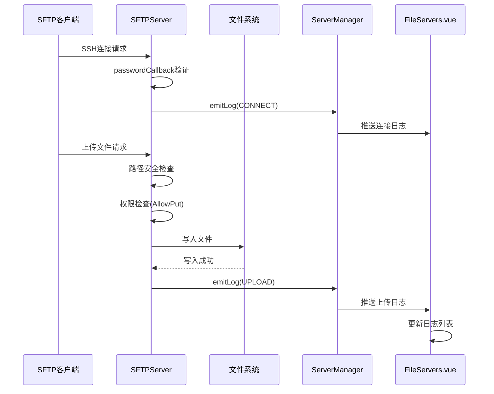
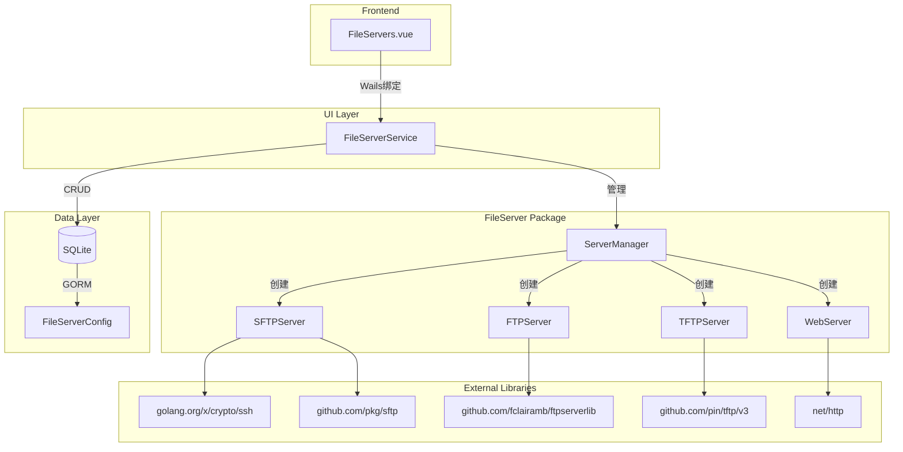
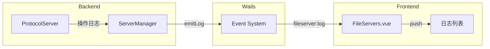

# 文件服务模块功能和逻辑说明书

## 1. 模块概述

### 1.1 整体架构

文件服务模块采用分层架构设计，提供四种文件传输协议的轻量级服务器实现：

```
┌─────────────────────────────────────────────────────────────────────┐
│                      UI Layer (frontend/src)                        │
│  ┌───────────────────────────────────────────────────────────────┐  │
│  │ FileServers.vue (主视图)                                       │  │
│  │ - 协议切换与配置管理                                            │  │
│  │ - 服务器启停控制                                                │  │
│  │ - 实时日志展示                                                  │  │
│  └───────────────────────────────────────────────────────────────┘  │
└─────────────────────────────────────────────────────────────────────┘
                               │
                               ▼
┌─────────────────────────────────────────────────────────────────────┐
│                 Service Layer (internal/ui)                          │
│  ┌───────────────────────────────────────────────────────────────┐  │
│  │ FileServerService                                              │  │
│  │ - 配置 CRUD 操作                                               │  │
│  │ - 服务器生命周期管理                                            │  │
│  │ - 防重入保护                                                    │  │
│  │ - 默认配置生成                                                  │  │
│  └───────────────────────────────────────────────────────────────┘  │
└─────────────────────────────────────────────────────────────────────┘
                               │
                               ▼
┌─────────────────────────────────────────────────────────────────────┐
│              Server Manager Layer (internal/fileserver)              │
│  ┌───────────────────────────────────────────────────────────────┐  │
│  │ ServerManager                                                  │  │
│  │ - 统一服务器管理接口                                            │  │
│  │ - 事件推送机制                                                  │  │
│  │ - Panic 恢复机制                                                │  │
│  └───────────────────────────────────────────────────────────────┘  │
│                               │                                      │
│    ┌──────────────┬───────────┼───────────┬──────────────┐          │
│    ▼              ▼           ▼           ▼              ▼          │
│ ┌──────┐    ┌─────────┐ ┌─────────┐ ┌─────────┐                   │
│ │SFTP  │    │FTP      │ │TFTP     │ │HTTP     │                   │
│ │Server│    │Server   │ │Server   │ │Server   │                   │
│ └──────┘    └─────────┘ └─────────┘ └─────────┘                   │
└─────────────────────────────────────────────────────────────────────┘
                               │
                               ▼
┌─────────────────────────────────────────────────────────────────────┐
│                 Model Layer (internal/models)                        │
│  ┌───────────────────────────────────────────────────────────────┐  │
│  │ FileServerConfig                                               │  │
│  │ - 协议配置持久化                                                 │  │
│  │ - 权限控制字段                                                  │  │
│  └───────────────────────────────────────────────────────────────┘  │
└─────────────────────────────────────────────────────────────────────┘
```

### 1.2 核心数据流说明

文件服务模块的数据流遵循请求-响应模式：

1. **启动流程**：用户配置参数 → 前端保存配置 → 调用 ToggleServer → ServerManager 创建服务器实例 → 启动监听 → 推送启动事件
2. **停止流程**：用户点击停止 → 调用 ToggleServer → ServerManager 停止服务器 → 关闭所有连接 → 推送停止事件
3. **日志流程**：客户端操作 → 服务器处理请求 → 发送日志事件 → ServerManager 推送到前端 → 实时显示
4. **配置流程**：用户修改配置 → 前端调用 SaveServerConfig → 数据库持久化 → 返回结果

### 1.3 模块职责划分

| 模块 | 路径 | 主要职责 |
|------|------|----------|
| **主视图** | `frontend/src/views/Tools/FileServers.vue` | 协议切换、配置表单、服务器控制、日志展示 |
| **UI服务** | `internal/ui/fileserver_service.go` | 配置管理、服务器生命周期、防重入保护 |
| **服务器管理器** | `internal/fileserver/server.go` | 统一管理接口、事件推送、Panic恢复 |
| **SFTP服务器** | `internal/fileserver/sftp_server.go` | SSH协议文件传输、认证处理 |
| **FTP服务器** | `internal/fileserver/ftp_server.go` | FTP协议文件传输、权限控制 |
| **TFTP服务器** | `internal/fileserver/tftp_server.go` | UDP协议简单文件传输 |
| **HTTP服务器** | `internal/fileserver/web_server.go` | HTTP文件服务、目录浏览、基本认证 |
| **数据模型** | `internal/models/models.go` | 配置结构定义、数据库映射 |

---

## 2. 核心数据结构

### 2.1 后端数据模型

#### 2.1.1 FileServerConfig - 文件服务器配置实体

```go
// 文件: internal/models/models.go
type FileServerConfig struct {
    ID        uint      `json:"id" gorm:"primaryKey;autoIncrement"`
    Protocol  string    `json:"protocol" gorm:"uniqueIndex;not null"` // sftp, ftp, tftp, http
    Enabled   bool      `json:"enabled"`                             // 是否开机自启
    Port      int       `json:"port"`                                // 监听端口
    HomeDir   string    `json:"homeDir"`                             // 根目录
    Username  string    `json:"username"`                            // 登录用户名
    Password  string    `json:"password" gorm:"column:password"`     // 登录密码
    CreatedAt time.Time `json:"createdAt"`
    UpdatedAt time.Time `json:"updatedAt"`

    // FTP 专用权限控制
    AllowGet    bool `json:"allowGet"`    // 允许下载
    AllowPut    bool `json:"allowPut"`    // 允许上传
    AllowDel    bool `json:"allowDel"`    // 允许删除
    AllowRename bool `json:"allowRename"` // 允许重命名
}
```

#### 2.1.2 字段详解表格

| 字段 | 类型 | 说明 | 默认值 |
|------|------|------|--------|
| `ID` | uint | 主键，自增 | 自动生成 |
| `Protocol` | string | 协议类型：sftp/ftp/tftp/http | 必填 |
| `Enabled` | bool | 是否开机自启 | false |
| `Port` | int | 监听端口 | SFTP:2222, FTP:2121, TFTP:6969, HTTP:8080 |
| `HomeDir` | string | 文件服务根目录 | 程序目录 |
| `Username` | string | 认证用户名 | admin |
| `Password` | string | 认证密码 | admin |
| `AllowGet` | bool | 允许下载文件 | true |
| `AllowPut` | bool | 允许上传文件 | true |
| `AllowDel` | bool | 允许删除文件 | true |
| `AllowRename` | bool | 允许重命名文件 | HTTP默认false |

#### 2.1.3 LogEvent - 日志事件结构

```go
// 文件: internal/fileserver/server.go
type LogEvent struct {
    Timestamp int64    `json:"timestamp"` // 毫秒级时间戳
    Level     LogLevel `json:"level"`     // info, warn, error, success
    Protocol  Protocol `json:"protocol"`  // sftp, ftp, tftp, http
    ClientIP  string   `json:"clientIp"`  // 客户端IP地址
    Action    Action   `json:"action"`    // 操作类型
    Message   string   `json:"message"`   // 日志消息
    File      string   `json:"file,omitempty"` // 相关文件路径
}
```

#### 2.1.4 协议与操作类型常量

```go
// 文件: internal/fileserver/server.go
type Protocol string

const (
    ProtocolSFTP Protocol = "sftp"
    ProtocolFTP  Protocol = "ftp"
    ProtocolTFTP Protocol = "tftp"
    ProtocolHTTP Protocol = "http"
)

type Action string

const (
    ActionConnect    Action = "CONNECT"    // 服务器启动/客户端连接
    ActionDisconnect Action = "DISCONNECT" // 服务器停止/客户端断开
    ActionUpload     Action = "UPLOAD"     // 文件上传
    ActionDownload   Action = "DOWNLOAD"   // 文件下载
    ActionDelete     Action = "DELETE"     // 文件删除
    ActionError      Action = "ERROR"      // 错误事件
    ActionBrowse     Action = "BROWSE"     // HTTP目录浏览
)
```

### 2.2 前端数据结构

#### 2.2.1 LogEvent 接口定义

```typescript
// 文件: frontend/src/views/Tools/FileServers.vue
interface LogEvent {
  timestamp: number
  level: string      // info, warn, error, success
  protocol: string   // sftp, ftp, tftp, http
  clientIp: string
  action: string     // CONNECT, DISCONNECT, UPLOAD, DOWNLOAD, DELETE, ERROR, BROWSE
  message: string
  file?: string
}
```

### 2.3 设计要点说明

1. **协议隔离**：每种协议独立实现 [`FileServer`](internal/fileserver/server.go:51) 接口，互不干扰
2. **配置持久化**：使用 GORM 将配置存储到 SQLite 数据库，支持应用重启后恢复
3. **事件驱动**：通过 Wails 事件系统实现后端到前端的实时日志推送
4. **安全防护**：
   - 路径穿越防护（所有协议）
   - SSH 主机密钥动态生成（SFTP）
   - 基本认证支持（HTTP）
5. **并发安全**：使用 `sync.RWMutex` 和 `sync.Map` 保护共享状态

---

## 3. 工作流程

### 3.1 服务器启动时序图



### 3.2 文件传输时序图（以SFTP上传为例）



### 3.3 核心函数逻辑说明

#### 3.3.1 ServerManager.StartServer

```go
// 文件: internal/fileserver/server.go
func (m *ServerManager) StartServer(protocol Protocol, config *models.FileServerConfig) error {
    m.mu.Lock()
    defer m.mu.Unlock()

    // 1. 检查是否已存在运行中的服务器
    if server, exists := m.servers[protocol]; exists && server.IsRunning() {
        return fmt.Errorf("%s 服务器已在运行中", protocol)
    }

    // 2. 创建新的服务器实例
    server, err := m.createServer(protocol)
    if err != nil {
        return err
    }

    // 3. 启动服务器
    if err := server.Start(config); err != nil {
        return err
    }

    // 4. 保存实例和配置
    m.servers[protocol] = server
    m.configs[protocol] = config

    // 5. 发送启动日志
    m.emitLog(LogEvent{
        Level:    LogLevelInfo,
        Protocol: protocol,
        Action:   ActionConnect,
        Message:  fmt.Sprintf("%s 服务器已启动，监听端口 %d", protocol, config.Port),
    })

    return nil
}
```

#### 3.3.2 FileServerService.ToggleServer

```go
// 文件: internal/ui/fileserver_service.go
func (s *FileServerService) ToggleServer(protocol string, start bool) error {
    // 1. 验证协议类型
    if !isValidProtocol(protocol) {
        return fmt.Errorf("无效的协议类型: %s", protocol)
    }

    // 2. 防重入保护（启动操作）
    if start {
        s.startingMu.Lock()
        if s.starting[protocol] {
            s.startingMu.Unlock()
            return fmt.Errorf("%s 服务器正在启动中，请稍候", protocol)
        }
        s.starting[protocol] = true
        s.startingMu.Unlock()

        defer func() {
            s.startingMu.Lock()
            delete(s.starting, protocol)
            s.startingMu.Unlock()
        }()
    }

    // 3. 获取配置
    cfg, err := s.GetServerConfig(protocol)
    if err != nil {
        return fmt.Errorf("获取配置失败: %v", err)
    }

    // 4. 执行启动/停止操作
    if start {
        err = s.manager.StartServer(fileserver.Protocol(protocol), cfg)
    } else {
        err = s.manager.StopServer(fileserver.Protocol(protocol))
    }

    return err
}
```

#### 3.3.3 safeGo Panic恢复机制

```go
// 文件: internal/fileserver/server.go
func safeGo(name string, fn func()) {
    go func() {
        defer func() {
            if r := recover(); r != nil {
                logger.Error("FileServer", "-", "[%s] Goroutine 发生 panic: %v", name, r)
                logger.Error("FileServer", "-", "[%s] Panic 堆栈:\n%s", name, string(debug.Stack()))

                // 尝试通知前端发生错误
                if manager := getGlobalManager(); manager != nil {
                    manager.emitLog(LogEvent{
                        Level:    LogLevelError,
                        Protocol: ProtocolFTP,
                        Action:   ActionError,
                        Message:  fmt.Sprintf("[%s] 内部错误: %v", name, r),
                    })
                }
            }
        }()
        fn()
    }()
}
```

---

## 4. 模块间交互关系

### 4.1 依赖关系图



### 4.2 调用链示例

#### 4.2.1 启动SFTP服务器调用链

```
用户点击启动
    ↓
FileServers.vue::toggleServer()
    ↓ (Wails绑定)
FileServerService::ToggleServer("sftp", true)
    ↓
FileServerService::GetServerConfig("sftp")
    ↓ (数据库查询)
ServerManager::StartServer(ProtocolSFTP, config)
    ↓
ServerManager::createServer(ProtocolSFTP)
    ↓
NewSFTPServer(manager)
    ↓
SFTPServer::Start(config)
    ├── generateHostKey() // 生成SSH主机密钥
    ├── net.Listen("tcp", ":2222")
    └── safeGo("SFTP-acceptConnections", acceptConnections)
```

#### 4.2.2 处理FTP上传请求调用链

```
FTP客户端连接
    ↓
FTPServer::ListenAndServe() (ftpserverlib)
    ↓
ftpDriver::NewClientDriver()
    ↓
ftpClientDriver::HandleUpload()
    ↓
ftpClientDriver::putFile()
    ├── 权限检查: config.AllowPut
    ├── 路径安全检查: safePath()
    └── 文件写入: afero.Fs.Create()
    ↓
ServerManager::emitLog(LogEvent{Action: ActionUpload})
    ↓ (Wails事件)
FileServers.vue::handleLogEvent()
```

### 4.3 事件推送机制



---

## 5. 各协议服务器特性

### 5.1 SFTP服务器

| 特性 | 说明 |
|------|------|
| **传输协议** | SSH协议（TCP） |
| **默认端口** | 2222 |
| **认证方式** | 用户名/密码 |
| **安全特性** | 动态生成RSA主机密钥（2048位） |
| **权限控制** | AllowGet, AllowPut, AllowDel, AllowRename |

**关键实现**：
- 使用 [`golang.org/x/crypto/ssh`](internal/fileserver/sftp_server.go:18) 构建SSH服务器
- 使用 [`github.com/pkg/sftp`](internal/fileserver/sftp_server.go:17) 提供SFTP协议支持
- 主机密钥存储在根目录下的 `.sftp_host_key` 文件

### 5.2 FTP服务器

| 特性 | 说明 |
|------|------|
| **传输协议** | FTP协议（TCP） |
| **默认端口** | 2121 |
| **认证方式** | 用户名/密码 |
| **文件系统** | afero虚拟文件系统 |
| **权限控制** | AllowGet, AllowPut, AllowDel, AllowRename |

**关键实现**：
- 使用 [`github.com/fclairamb/ftpserverlib`](internal/fileserver/ftp_server.go:14) 构建FTP服务器
- 通过 [`afero.Fs`](internal/fileserver/ftp_server.go:33) 实现文件系统抽象
- 支持被动模式和主动模式

### 5.3 TFTP服务器

| 特性 | 说明 |
|------|------|
| **传输协议** | TFTP协议（UDP） |
| **默认端口** | 6969 |
| **认证方式** | 无认证 |
| **安全特性** | 路径穿越防护 |
| **适用场景** | 网络设备固件升级、配置备份 |

**关键实现**：
- 使用 [`github.com/pin/tftp/v3`](internal/fileserver/tftp_server.go:14) 构建TFTP服务器
- 无状态协议，每个请求独立处理
- 支持 RRQ（读请求）和 WRQ（写请求）

### 5.4 HTTP服务器

| 特性 | 说明 |
|------|------|
| **传输协议** | HTTP协议（TCP） |
| **默认端口** | 8080 |
| **认证方式** | 可选基本认证（Basic Auth） |
| **功能特性** | 文件上传、下载、目录浏览 |
| **权限控制** | AllowGet, AllowPut, AllowDel（不支持Rename） |

**关键实现**：
- 使用标准库 [`net/http`](internal/fileserver/web_server.go:9) 构建
- 支持目录浏览（HTML格式）
- 可选的基本认证中间件
- 优雅关闭支持（5秒超时）

---

## 6. 总结表格

### 6.1 模块功能总结

| 功能模块 | 实现文件 | 核心功能 |
|----------|----------|----------|
| **服务器管理** | [`server.go`](internal/fileserver/server.go) | 统一管理接口、事件推送、Panic恢复 |
| **SFTP服务** | [`sftp_server.go`](internal/fileserver/sftp_server.go) | SSH文件传输、密钥认证 |
| **FTP服务** | [`ftp_server.go`](internal/fileserver/ftp_server.go) | FTP文件传输、权限控制 |
| **TFTP服务** | [`tftp_server.go`](internal/fileserver/tftp_server.go) | UDP简单文件传输 |
| **HTTP服务** | [`web_server.go`](internal/fileserver/web_server.go) | HTTP文件服务、目录浏览 |
| **UI服务** | [`fileserver_service.go`](internal/ui/fileserver_service.go) | 配置管理、生命周期控制 |
| **前端界面** | [`FileServers.vue`](frontend/src/views/Tools/FileServers.vue) | 配置表单、日志展示 |

### 6.2 协议对比表

| 协议 | 端口 | 认证 | 传输层 | 适用场景 |
|------|------|------|--------|----------|
| SFTP | 2222 | 必须 | TCP/SSH | 安全文件传输 |
| FTP | 2121 | 必须 | TCP | 通用文件传输 |
| TFTP | 6969 | 无 | UDP | 网络设备配置 |
| HTTP | 8080 | 可选 | TCP | Web文件访问 |

### 6.3 安全特性总结

| 安全措施 | 实现位置 | 说明 |
|----------|----------|------|
| 路径穿越防护 | 各Server的safePath方法 | 防止访问根目录外文件 |
| 认证机制 | SFTP/FTP/HTTP | 用户名密码验证 |
| SSH加密 | SFTP | 传输层数据加密 |
| Panic恢复 | [`safeGo`](internal/fileserver/server.go:139) | 防止goroutine崩溃影响主程序 |
| 防重入保护 | [`ToggleServer`](internal/ui/fileserver_service.go:104) | 防止重复启动请求 |
