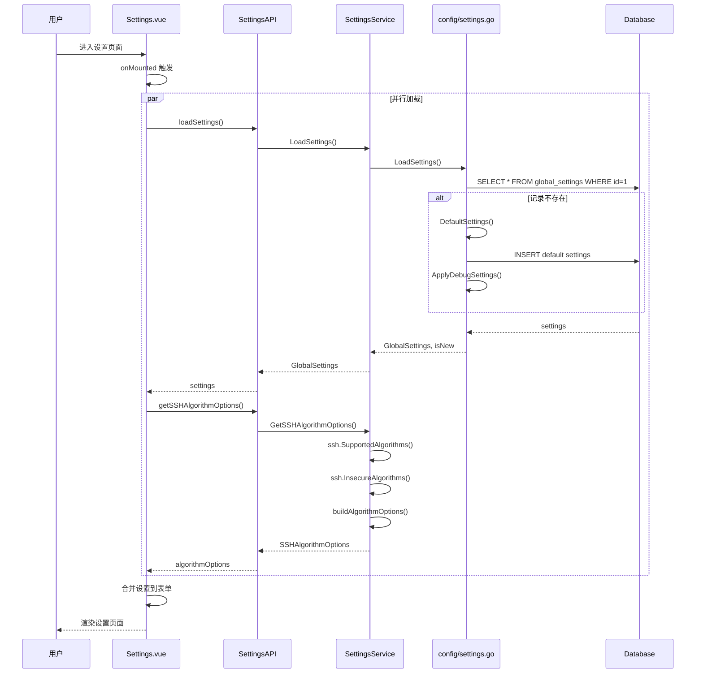
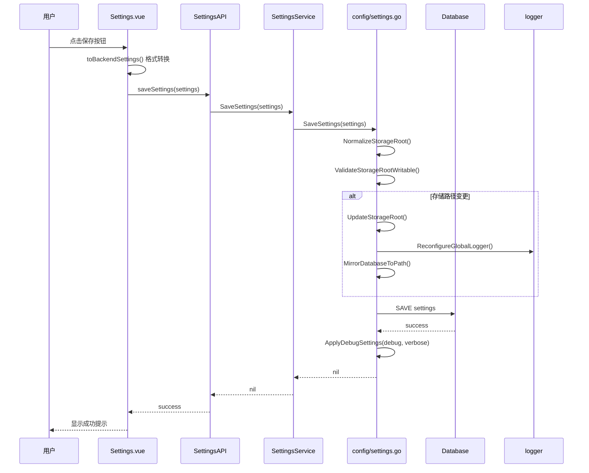
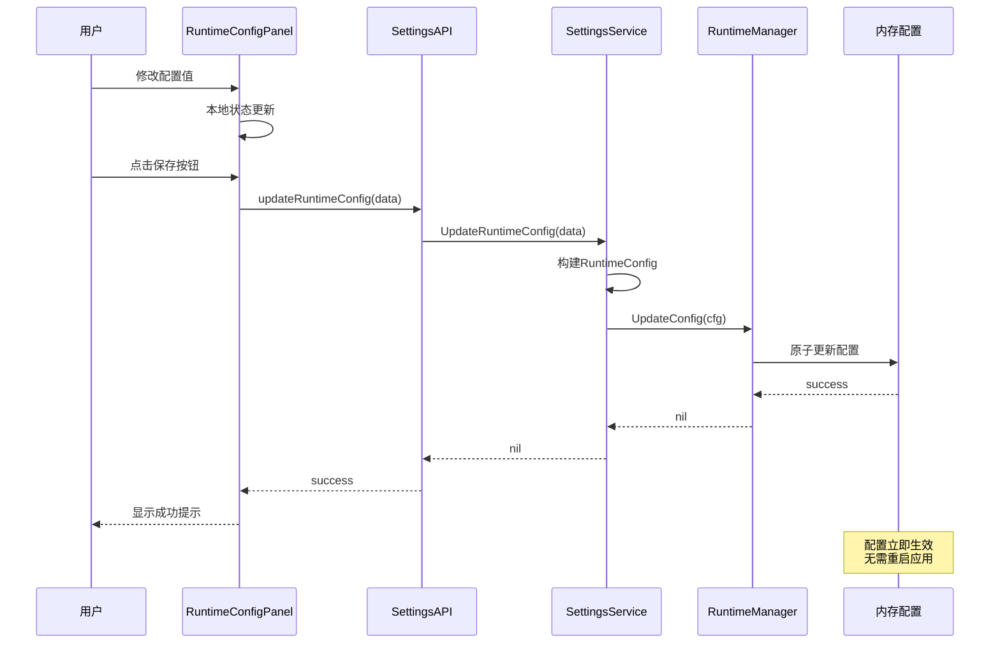
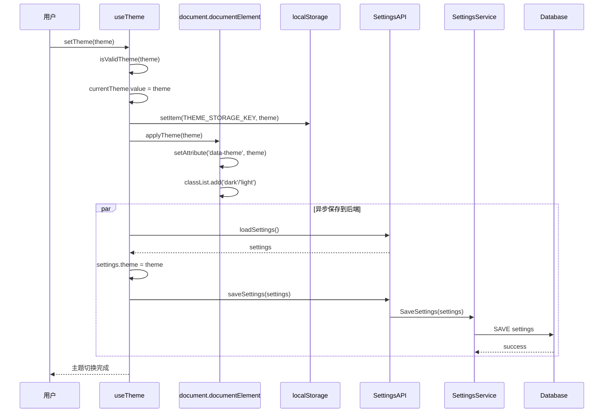
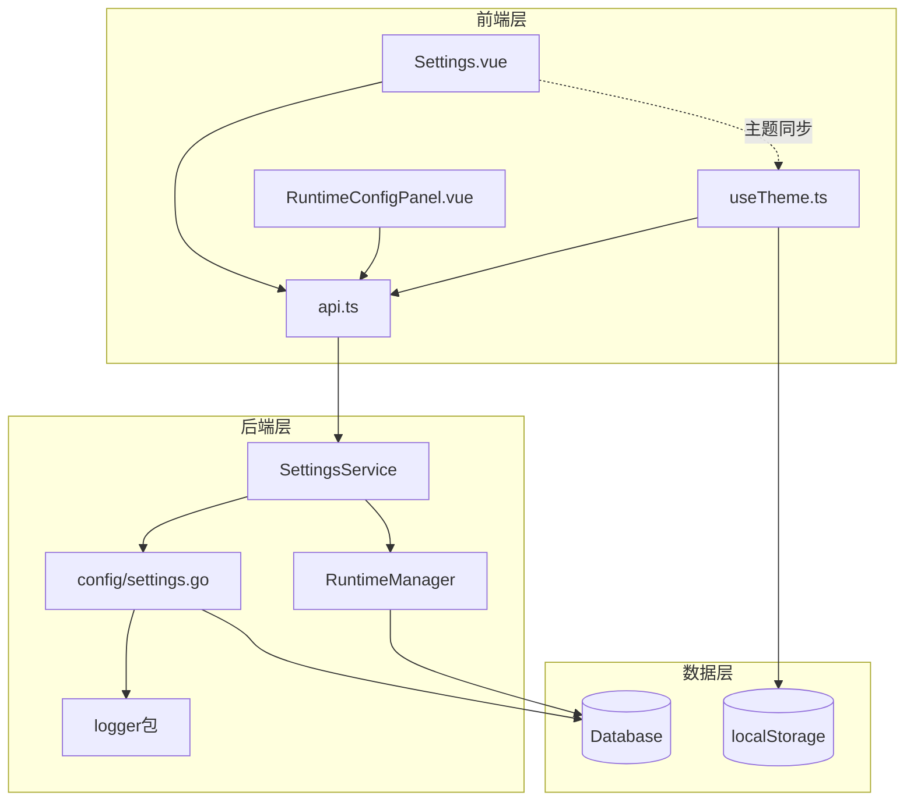

# 系统设置模块功能和逻辑说明书

## 1. 模块概述

### 1.1 整体架构

系统设置模块采用分层架构设计，管理应用的全局配置参数、日志策略、SSH安全策略、主题设置以及运行时配置。主要包含以下三个层次：

```
┌─────────────────────────────────────────────────────────────────┐
│                      UI Layer (frontend/src)                     │
│  ┌─────────────────────────────────────────────────────────┐   │
│  │ Settings.vue (主视图)                                     │   │
│  │ - 协调全局设置面板和运行时配置面板                          │   │
│  │ - 管理页面状态和生命周期                                    │   │
│  │ - SSH算法自定义对话框                                      │   │
│  └─────────────────────────────────────────────────────────┘   │
│                              │                                   │
│        ┌─────────────────────┼─────────────────────┐            │
│        ▼                     ▼                     ▼            │
│  ┌───────────┐    ┌───────────────────┐    ┌───────────────┐   │
│  │ Runtime   │    │ useTheme          │    │ Services/API  │   │
│  │ ConfigPanel│    │ (主题管理)        │    │ (API调用)     │   │
│  └───────────┘    └───────────────────┘    └───────────────┘   │
└─────────────────────────────────────────────────────────────────┘
                               │
                               ▼
┌─────────────────────────────────────────────────────────────────┐
│                 Service Layer (internal/ui)                      │
│  ┌─────────────────────────────────────────────────────────┐   │
│  │ SettingsService                                           │   │
│  │ - 全局设置 CRUD 操作                                       │   │
│  │ - SSH 算法候选列表获取                                      │   │
│  │ - 运行时配置管理（热更新）                                   │   │
│  │ - 前端日志代理                                             │   │
│  └─────────────────────────────────────────────────────────┘   │
└─────────────────────────────────────────────────────────────────┘
                               │
                               ▼
┌─────────────────────────────────────────────────────────────────┐
│              Config Layer (internal/config)                      │
│  ┌─────────────────────────────────────────────────────────┐   │
│  │ settings.go                                               │   │
│  │ - 默认设置定义                                             │   │
│  │ - 设置加载与保存                                           │   │
│  │ - 调试日志应用                                             │   │
│  │ - 存储路径管理                                             │   │
│  └─────────────────────────────────────────────────────────┘   │
└─────────────────────────────────────────────────────────────────┘
                               │
                               ▼
┌─────────────────────────────────────────────────────────────────┐
│                 Model Layer (internal/models)                    │
│  ┌─────────────────────────────────────────────────────────┐   │
│  │ GlobalSettings / SSHAlgorithmSettings                     │   │
│  └─────────────────────────────────────────────────────────┘   │
└─────────────────────────────────────────────────────────────────┘
```

### 1.2 核心数据流说明

系统设置模块的数据流遵循单向数据流原则：

1. **加载流程**：页面挂载 → 并行加载全局设置和SSH算法候选 → 合并默认值 → 渲染表单
2. **保存流程**：用户修改表单 → 前端格式转换 → 调用后端API → 校验存储路径 → 应用调试设置 → 持久化到数据库
3. **运行时配置流程**：用户修改配置 → 热更新到内存 → 立即生效（无需重启）
4. **主题切换流程**：用户切换主题 → 更新localStorage → 应用到DOM → 异步同步到后端数据库

### 1.3 模块职责划分

| 模块 | 路径 | 主要职责 |
|------|------|----------|
| **主视图** | `frontend/src/views/Settings.vue` | 全局设置页面状态管理、表单交互、SSH算法对话框 |
| **运行时面板** | `frontend/src/components/settings/RuntimeConfigPanel.vue` | 运行时配置热更新管理 |
| **主题管理** | `frontend/src/composables/useTheme.ts` | 主题初始化、切换、持久化、系统跟随 |
| **Service** | `internal/ui/settings_service.go` | 设置业务逻辑、运行时配置管理、SSH算法候选 |
| **Config** | `internal/config/settings.go` | 默认设置定义、加载保存、调试日志应用 |
| **Models** | `internal/models/models.go` | 数据结构定义 |

---

## 2. 核心数据结构

### 2.1 后端数据模型

#### 2.1.1 GlobalSettings - 全局运行参数

```go
// 文件: internal/models/models.go
type GlobalSettings struct {
    ID             uint   `json:"id" gorm:"primaryKey"`
    ConnectTimeout string `json:"connectTimeout"` // SSH/SFTP 连接超时 (如 "10s")
    CommandTimeout string `json:"commandTimeout"` // 单条命令默认超时 (如 "30s")
    StorageRoot    string `json:"storageRoot"`    // 统一数据根目录
    ErrorMode      string `json:"errorMode"`      // "pause" | "skip" | "abort"

    // 调试日志开关
    Debug   bool `json:"debug"`   // 启用 DEBUG 级别日志
    Verbose bool `json:"verbose"` // 启用 VERBOSE 级别日志（包含详细调试信息）

    // SSH算法配置
    SSHAlgorithms SSHAlgorithmSettings `json:"sshAlgorithms" gorm:"type:text;serializer:json"`
    // SSH主机密钥校验策略: strict / accept_new / insecure
    SSHHostKeyPolicy string `json:"sshHostKeyPolicy"`
    // known_hosts 文件路径（为空时使用默认路径）
    SSHKnownHostsPath string `json:"sshKnownHostsPath"`

    // UI 主题设置
    Theme string `json:"theme"` // 主题设置: "light" | "dark" | "system"
}
```

**字段详解**：

| 字段 | 类型 | 说明 | 默认值 |
|------|------|------|--------|
| `ID` | uint | 主键 | 自增 |
| `ConnectTimeout` | string | SSH/SFTP连接超时时间 | "10s" |
| `CommandTimeout` | string | 单条命令执行超时时间 | "30s" |
| `StorageRoot` | string | 统一数据根目录 | "./netWeaverGoData" |
| `ErrorMode` | string | 错误处理模式 | "pause" |
| `Debug` | bool | 启用DEBUG级别日志 | false |
| `Verbose` | bool | 启用VERBOSE级别日志 | false |
| `SSHAlgorithms` | SSHAlgorithmSettings | SSH算法配置 | secure模式 |
| `SSHHostKeyPolicy` | string | SSH主机密钥校验策略 | "accept_new" |
| `SSHKnownHostsPath` | string | known_hosts文件路径 | 默认路径 |
| `Theme` | string | UI主题设置 | "system" |

#### 2.1.2 SSHAlgorithmSettings - SSH算法配置

```go
// 文件: internal/models/models.go
type SSHAlgorithmSettings struct {
    // 加密算法 (Ciphers)
    Ciphers []string `json:"ciphers"`
    // 密钥交换算法
    KeyExchanges []string `json:"keyExchanges"`
    // 消息认证码
    MACs []string `json:"macs"`
    // 主机密钥算法
    HostKeyAlgorithms []string `json:"hostKeyAlgorithms"`

    // 预设模式: "secure" | "compatible" | "custom"
    PresetMode string `json:"presetMode"`
}
```

**预设模式说明**：

| 模式 | 说明 | 适用场景 |
|------|------|----------|
| `secure` | 仅使用现代安全算法（AEAD加密、椭圆曲线密钥交换、ED25519主机密钥） | 新设备、追求最高安全性 |
| `compatible` | 包含老旧设备支持的算法（CBC加密、SHA1密钥交换、RSA/DSA主机密钥） | 网络设备管理（推荐） |
| `custom` | 手动指定所有算法配置 | 特殊场景 |

#### 2.1.3 RuntimeConfigData - 运行时配置数据

```go
// 文件: internal/ui/settings_service.go
type RuntimeConfigData struct {
    Timeouts struct {
        Command    int `json:"command"`    // 命令执行超时（毫秒）
        Connection int `json:"connection"` // 连接超时（毫秒）
        Handshake  int `json:"handshake"`  // 握手超时（毫秒）
        ShortCmd   int `json:"shortCmd"`   // 短命令超时（毫秒）
        LongCmd    int `json:"longCmd"`    // 长命令超时（毫秒）
    } `json:"timeouts"`
    Limits struct {
        MaxLogsPerDevice     int `json:"maxLogsPerDevice"`     // 单设备最大日志数
        MaxLogLength         int `json:"maxLogLength"`         // 最大日志长度
        LogTruncateThreshold int `json:"logTruncateThreshold"` // 日志截断阈值
        MaxConcurrentDevices int `json:"maxConcurrentDevices"` // 最大并发设备数
    } `json:"limits"`
    Engine struct {
        WorkerCount     int `json:"workerCount"`     // 引擎工作协程数
        EventBufferSize int `json:"eventBufferSize"` // 事件缓冲大小
    } `json:"engine"`
    Discovery struct {
        WorkerCount      int `json:"workerCount"`      // 发现工作协程数
        PerDeviceTimeout int `json:"perDeviceTimeout"` // 单设备超时
        CommandTimeout   int `json:"commandTimeout"`   // 命令超时
    } `json:"discovery"`
    Topology struct {
        MaxInferenceCandidates int `json:"maxInferenceCandidates"` // 最大推理候选数
    } `json:"topology"`
    Buffers struct {
        DefaultSize int `json:"defaultSize"` // 默认缓冲大小
        SmallSize   int `json:"smallSize"`   // 小缓冲大小
        LargeSize   int `json:"largeSize"`   // 大缓冲大小
    } `json:"buffers"`
    Pagination struct {
        LineThreshold int `json:"lineThreshold"` // 分页行阈值
        CheckInterval int `json:"checkInterval"` // 检查间隔
    } `json:"pagination"`
}
```

### 2.2 前端数据结构

#### 2.2.1 GlobalSettings - 前端设置接口

```typescript
// 文件: frontend/src/views/Settings.vue
interface GlobalSettings {
  connectTimeout: string
  commandTimeout: string
  storageRoot: string
  errorMode: string
  debug: boolean
  verbose: boolean
  sshAlgorithms: SSHAlgorithmSettings
}
```

#### 2.2.2 SSHAlgorithmOption - SSH算法候选项

```typescript
// 文件: frontend/src/views/Settings.vue
interface SSHAlgorithmOption {
  name: string
  security: AlgorithmSecurity  // "secure" | "insecure" | "legacy"
  source: AlgorithmSource     // "supported" | "insecure" | "legacy"
}
```

#### 2.2.3 ThemeConfig - 主题配置

```typescript
// 文件: frontend/src/types/theme.ts
export interface ThemeConfig {
  name: ThemeName   // 'light' | 'dark' | string
  label: string     // 显示标签
  cssFile?: string  // 可选CSS文件路径
}

export const AVAILABLE_THEMES: ThemeConfig[] = [
  { name: 'light', label: '明亮模式' },
  { name: 'dark', label: '黑暗模式' },
]
```

### 2.3 设计要点说明

1. **设置持久化**：全局设置存储在数据库 `global_settings` 表中，ID固定为1
2. **运行时配置热更新**：运行时配置修改后立即生效，无需重启应用
3. **主题双重存储**：主题设置同时存储在 localStorage（快速加载）和后端数据库（跨设备同步）
4. **SSH算法安全标记**：算法候选项标记安全等级，帮助用户识别风险

---

## 3. 工作流程

### 3.1 设置加载流程



### 3.2 设置保存流程



### 3.3 运行时配置热更新流程



### 3.4 主题切换流程



### 3.5 核心函数逻辑说明

#### 3.5.1 LoadSettings - 加载设置

```go
// 文件: internal/config/settings.go
func LoadSettings() (*models.GlobalSettings, bool, error) {
    // 1. 从数据库查询设置记录
    // 2. 如果记录不存在，创建默认设置并保存
    // 3. 填充空字段的默认值（兼容旧数据）
    // 4. 应用调试日志设置到 logger 包
    // 5. 返回设置、是否新建标志、错误
}
```

#### 3.5.2 SaveSettings - 保存设置

```go
// 文件: internal/config/settings.go
func SaveSettings(settings models.GlobalSettings) error {
    // 1. 规范化存储路径
    // 2. 验证存储路径可写性
    // 3. 填充空字段的默认值
    // 4. 如果存储路径变更：
    //    - 更新路径管理器
    //    - 重新配置日志器
    //    - 迁移数据库文件
    // 5. 保存到数据库
    // 6. 应用调试日志设置
}
```

#### 3.5.3 GetSSHAlgorithmOptions - 获取SSH算法候选

```go
// 文件: internal/ui/settings_service.go
func (s *SettingsService) GetSSHAlgorithmOptions() SSHAlgorithmOptions {
    // 1. 调用 ssh.SupportedAlgorithms() 获取安全算法
    // 2. 调用 ssh.InsecureAlgorithms() 获取不安全算法
    // 3. 合并并标记安全等级
    // 4. 按安全等级和名称排序
    // 5. 返回结构化候选列表
}
```

#### 3.5.4 initTheme - 初始化主题

```typescript
// 文件: frontend/src/composables/useTheme.ts
async function initTheme(): Promise<void> {
    // 1. 从 localStorage 快速读取主题，立即应用（防止闪烁）
    // 2. 从后端加载权威主题值
    // 3. 如果后端值与当前值不同，更新并应用
    // 4. 同步到 localStorage
    // 5. 标记初始化完成
}
```

---

## 4. 模块间交互关系

### 4.1 依赖关系图



### 4.2 调用链示例

#### 4.2.1 保存全局设置调用链

```
用户点击保存
    ↓
Settings.vue:saveSettings()
    ↓
Settings.vue:toBackendSettings()  // 格式转换
    ↓
SettingsAPI.saveSettings(settings)
    ↓ (Wails绑定调用)
SettingsService.SaveSettings(settings)
    ↓
config.SaveSettings(settings)
    ↓
ValidateStorageRootWritable()  // 验证路径
    ↓
DB.Save(&settings)  // 持久化
    ↓
ApplyDebugSettings()  // 应用日志设置
```

#### 4.2.2 运行时配置热更新调用链

```
用户修改配置并保存
    ↓
RuntimeConfigPanel.vue:saveConfig()
    ↓
SettingsAPI.updateRuntimeConfig(data)
    ↓ (Wails绑定调用)
SettingsService.UpdateRuntimeConfig(data)
    ↓
RuntimeManager.UpdateConfig(cfg)  // 原子更新内存配置
    ↓
配置立即生效（无需重启）
```

#### 4.2.3 主题切换调用链

```
用户切换主题
    ↓
useTheme.ts:setTheme(theme)
    ↓
localStorage.setItem()  // 同步存储
    ↓
applyTheme(theme)  // 应用到DOM
    ↓ (异步)
SettingsAPI.loadSettings()
    ↓
SettingsAPI.saveSettings({ ...settings, theme })
    ↓
后端持久化主题设置
```

### 4.3 与其他模块的交互

| 交互模块 | 交互方式 | 说明 |
|----------|----------|------|
| **任务执行模块** | 读取全局设置 | 获取超时参数、错误处理模式 |
| **设备管理模块** | 读取SSH算法配置 | SSH连接时应用算法设置 |
| **日志模块** | 双向交互 | 接收调试开关、输出日志 |
| **文件服务模块** | 读取存储路径 | 获取数据根目录路径 |

---

## 5. 总结表格

### 5.1 功能清单

| 功能 | 前端入口 | 后端接口 | 说明 |
|------|----------|----------|------|
| 加载设置 | [`loadSettings()`](frontend/src/views/Settings.vue:583) | [`LoadSettings()`](internal/ui/settings_service.go:57) | 从数据库加载全局设置 |
| 保存设置 | [`saveSettings()`](frontend/src/views/Settings.vue:632) | [`SaveSettings()`](internal/ui/settings_service.go:73) | 保存全局设置到数据库 |
| 重置设置 | [`resetSettings()`](frontend/src/views/Settings.vue:647) | - | 重置为默认设置（前端） |
| SSH算法候选 | [`loadSSHAlgorithmOptions()`](frontend/src/views/Settings.vue:491) | [`GetSSHAlgorithmOptions()`](internal/ui/settings_service.go:124) | 获取Go SSH库支持的算法列表 |
| 运行时配置加载 | [`loadConfig()`](frontend/src/components/settings/RuntimeConfigPanel.vue:638) | [`GetRuntimeConfig()`](internal/ui/settings_service.go:225) | 获取运行时配置 |
| 运行时配置更新 | [`saveConfig()`](frontend/src/components/settings/RuntimeConfigPanel.vue:685) | [`UpdateRuntimeConfig()`](internal/ui/settings_service.go:270) | 热更新运行时配置 |
| 运行时配置重置 | [`resetConfig()`](frontend/src/components/settings/RuntimeConfigPanel.vue:716) | [`ResetRuntimeConfigToDefault()`](internal/ui/settings_service.go:318) | 重置运行时配置为默认值 |
| 主题初始化 | [`initTheme()`](frontend/src/composables/useTheme.ts:141) | - | 初始化主题设置 |
| 主题切换 | [`setTheme()`](frontend/src/composables/useTheme.ts:169) | - | 切换主题并同步 |

### 5.2 配置项清单

| 配置分类 | 配置项 | 类型 | 默认值 | 说明 |
|----------|--------|------|--------|------|
| **超时设置** | ConnectTimeout | string | "10s" | SSH连接超时 |
| | CommandTimeout | string | "30s" | 命令执行超时 |
| **存储设置** | StorageRoot | string | "./netWeaverGoData" | 数据根目录 |
| **执行设置** | ErrorMode | string | "pause" | 错误处理模式 |
| **日志设置** | Debug | bool | false | DEBUG级别日志 |
| | Verbose | bool | false | VERBOSE级别日志 |
| **SSH设置** | SSHAlgorithms.PresetMode | string | "secure" | SSH算法预设模式 |
| | SSHHostKeyPolicy | string | "accept_new" | 主机密钥校验策略 |
| **主题设置** | Theme | string | "system" | UI主题 |

### 5.3 关键设计决策

| 决策 | 原因 | 影响 |
|------|------|------|
| 设置存储在数据库而非配置文件 | 支持运行时修改、跨设备同步 | 需要数据库初始化后才能加载设置 |
| 运行时配置支持热更新 | 避免重启应用影响正在执行的任务 | 配置变更立即生效，需注意线程安全 |
| 主题双重存储 | localStorage快速加载防止闪烁，数据库跨设备同步 | 需要处理数据一致性 |
| SSH算法预设模式 | 简化用户配置，平衡安全性与兼容性 | 用户无需了解具体算法细节 |
| Verbose自动启用Debug | Verbose包含更详细的调试信息 | 减少用户配置步骤 |
