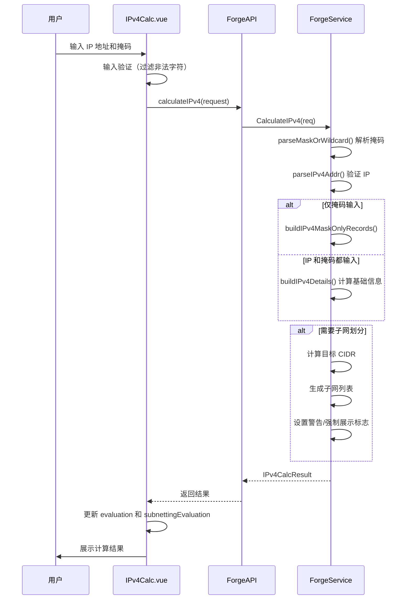
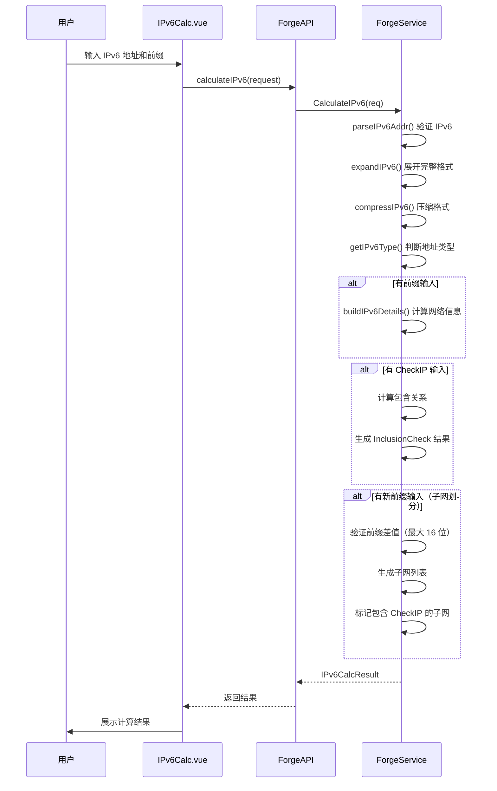
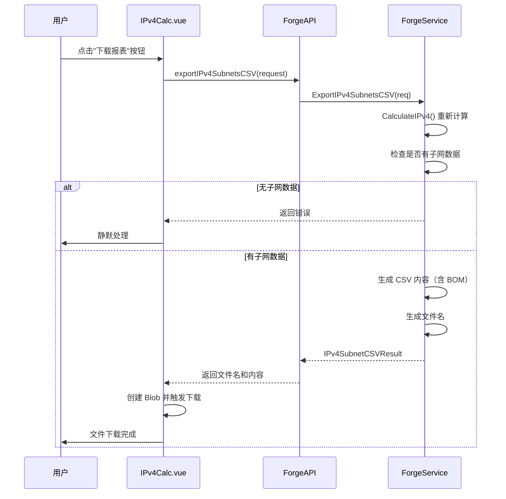
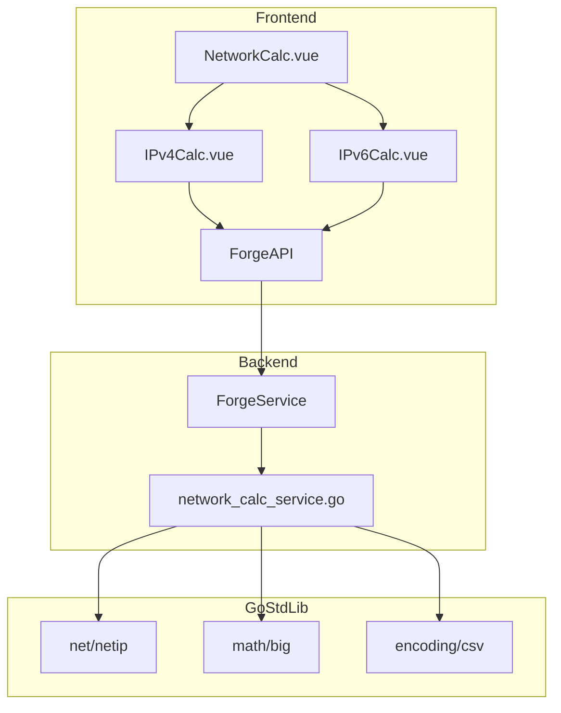

# 网络计算模块功能和逻辑说明书

## 1. 模块概述

### 1.1 整体架构

网络计算模块采用分层架构设计，提供 IPv4 和 IPv6 两种网络地址计算能力，主要包含以下三个层次：

```
┌─────────────────────────────────────────────────────────────────┐
│                      UI Layer (frontend/src)                     │
│  ┌─────────────────────────────────────────────────────────┐   │
│  │ NetworkCalc.vue (主视图)                                 │   │
│  │ - IPv4/IPv6 计算器切换                                   │   │
│  │ - 参数输入与实时计算                                      │   │
│  │ - 结果展示与导出功能                                      │   │
│  └─────────────────────────────────────────────────────────┘   │
│  ┌─────────────────────────────────────────────────────────┐   │
│  │ IPv4Calc.vue / IPv6Calc.vue (子组件)                     │   │
│  │ - 参数输入表单                                           │   │
│  │ - 基础信息展示                                           │   │
│  │ - 子网划分结果表格                                        │   │
│  │ - CSV 导出功能 (IPv4)                                    │   │
│  └─────────────────────────────────────────────────────────┘   │
└─────────────────────────────────────────────────────────────────┘
                               │
                               ▼
┌─────────────────────────────────────────────────────────────────┐
│                 Service Layer (internal/ui)                      │
│  ┌─────────────────────────────────────────────────────────┐   │
│  │ ForgeService                                             │   │
│  │ - CalculateIPv4(): IPv4 网络计算                         │   │
│  │ - CalculateIPv6(): IPv6 网络计算                         │   │
│  │ - ExportIPv4SubnetsCSV(): CSV 导出                       │   │
│  └─────────────────────────────────────────────────────────┘   │
└─────────────────────────────────────────────────────────────────┘
                               │
                               ▼
┌─────────────────────────────────────────────────────────────────┐
│                 Core Layer (Go 标准库)                           │
│  ┌─────────────────────────────────────────────────────────┐   │
│  │ net/netip: IP 地址解析与处理                              │   │
│  │ math/big: 大整数运算 (IPv6)                              │   │
│  │ encoding/csv: CSV 生成                                   │   │
│  └─────────────────────────────────────────────────────────┘   │
└─────────────────────────────────────────────────────────────────┘
```

### 1.2 核心数据流说明

网络计算模块的数据流遵循请求-响应模式：

1. **IPv4 计算流程**：用户输入 IP/掩码 → 后端解析验证 → 计算基础信息 → 子网划分计算 → 返回结果
2. **IPv6 计算流程**：用户输入 IPv6/前缀 → 后端解析验证 → 计算基础信息 → 包含关系检查 → 子网划分计算 → 返回结果
3. **CSV 导出流程**：前端请求导出 → 后端重新计算 → 生成 CSV 内容 → 返回文件名和内容 → 前端触发下载

### 1.3 模块职责划分

| 模块 | 路径 | 主要职责 |
|------|------|----------|
| **主视图** | `frontend/src/views/Tools/NetworkCalc.vue` | IPv4/IPv6 切换、子组件路由 |
| **IPv4 组件** | `frontend/src/components/network/IPv4Calc.vue` | IPv4 参数输入、结果展示、CSV 导出 |
| **IPv6 组件** | `frontend/src/components/network/IPv6Calc.vue` | IPv6 参数输入、结果展示、包含关系检查 |
| **后端服务** | `internal/ui/network_calc_service.go` | 网络计算核心逻辑、CSV 生成 |

---

## 2. 核心数据结构

### 2.1 后端数据模型

#### 2.1.1 NetworkRecord - 通用标签值记录

```go
// 文件: internal/ui/network_calc_service.go
type NetworkRecord struct {
    Label string `json:"label"` // 标签名称
    Value string `json:"value"` // 标签值
}
```

**设计要点**：
- 用于前端直接渲染的键值对结构
- 统一 IPv4 和 IPv6 基础信息展示格式

#### 2.1.2 IPv4CalcRequest - IPv4 计算请求

```go
// 文件: internal/ui/network_calc_service.go
type IPv4CalcRequest struct {
    IP                     string `json:"ip"`                     // IP 地址
    Mask                   string `json:"mask"`                   // 子网掩码 (CIDR/十进制/反掩码)
    HostCount              string `json:"hostCount"`              // 需划分的主机数
    SubnetCount            string `json:"subnetCount"`            // 需划分的子网数
    ForceDisplayAllSubnets bool   `json:"forceDisplayAllSubnets"` // 强制展示所有子网
}
```

**字段详解**：

| 字段 | 类型 | 说明 |
|------|------|------|
| `IP` | string | IPv4 地址，可选（仅输入掩码时只展示掩码信息） |
| `Mask` | string | 支持 CIDR（如 `24`）、子网掩码（如 `255.255.255.0`）、反掩码 |
| `HostCount` | string | 按主机数划分子网，与 `SubnetCount` 互斥 |
| `SubnetCount` | string | 按子网数划分子网，与 `HostCount` 互斥 |
| `ForceDisplayAllSubnets` | bool | 强制展示超过 256 个子网（最大 65535） |

#### 2.1.3 IPv4SubnetItem - IPv4 子网条目

```go
// 文件: internal/ui/network_calc_service.go
type IPv4SubnetItem struct {
    Index       int    `json:"index"`       // 序号 (1-based)
    Network     string `json:"network"`     // 网络地址
    Cidr        int    `json:"cidr"`        // CIDR 前缀长度
    FirstUsable string `json:"firstUsable"` // 首个可用 IP
    LastUsable  string `json:"lastUsable"`  // 最后可用 IP
    Broadcast   string `json:"broadcast"`   // 广播地址
    Mask        string `json:"mask"`        // 子网掩码
}
```

#### 2.1.4 IPv4CalcResult - IPv4 计算结果

```go
// 文件: internal/ui/network_calc_service.go
type IPv4CalcResult struct {
    BaseError       string           `json:"baseError"`       // 基础信息错误
    BaseRecords     []NetworkRecord  `json:"baseRecords"`     // 基础信息记录
    SubnetError     string           `json:"subnetError"`     // 子网划分错误
    SubnetWarning   string           `json:"subnetWarning"`   // 子网划分警告
    ShowForceButton bool             `json:"showForceButton"` // 是否显示强制展示按钮
    Subnets         []IPv4SubnetItem `json:"subnets"`         // 子网列表
    TotalSubnets    int              `json:"totalSubnets"`    // 子网总数
}
```

**设计要点**：
- `BaseError` 和 `SubnetError` 分离，允许基础信息正确但子网划分失败
- `ShowForceButton` 用于大数据量场景的性能保护

#### 2.1.5 IPv6CalcRequest - IPv6 计算请求

```go
// 文件: internal/ui/network_calc_service.go
type IPv6CalcRequest struct {
    IP        string `json:"ip"`        // IPv6 地址
    Prefix    string `json:"prefix"`    // 前缀长度
    CheckIP   string `json:"checkIp"`   // 待检查的 IPv6 地址
    NewPrefix string `json:"newPrefix"` // 新前缀长度（子网划分）
}
```

#### 2.1.6 IPv6InclusionResult - IPv6 包含关系检查结果

```go
// 文件: internal/ui/network_calc_service.go
type IPv6InclusionResult struct {
    IsIncluded bool   `json:"isIncluded"` // 是否包含在网段内
    Message    string `json:"message"`    // 检查结果描述
}
```

#### 2.1.7 IPv6SubnetItem - IPv6 子网条目

```go
// 文件: internal/ui/network_calc_service.go
type IPv6SubnetItem struct {
    Index      int    `json:"index"`      // 序号 (1-based)
    Network    string `json:"network"`    // 网络地址（压缩格式）
    Cidr       int    `json:"cidr"`       // CIDR 前缀长度
    IsIncluded bool   `json:"isIncluded"` // 是否包含 CheckIP
}
```

#### 2.1.8 IPv6CalcResult - IPv6 计算结果

```go
// 文件: internal/ui/network_calc_service.go
type IPv6CalcResult struct {
    BaseError      string               `json:"baseError"`                // 基础信息错误
    BaseRecords    []NetworkRecord      `json:"baseRecords"`              // 基础信息记录
    InclusionCheck *IPv6InclusionResult `json:"inclusionCheck,omitempty"` // 包含关系检查
    SubnetError    string               `json:"subnetError"`              // 子网划分错误
    SubnetWarning  string               `json:"subnetWarning"`            // 子网划分警告
    Subnets        []IPv6SubnetItem     `json:"subnets"`                  // 子网列表
    TotalSubnets   int                  `json:"totalSubnets"`             // 子网总数
}
```

#### 2.1.9 IPv4SubnetCSVResult - CSV 导出结果

```go
// 文件: internal/ui/network_calc_service.go
type IPv4SubnetCSVResult struct {
    FileName string `json:"fileName"` // 文件名
    Content  string `json:"content"`  // CSV 内容（含 BOM）
}
```

### 2.2 前端数据结构

#### 2.2.1 IPv4 组件状态

```typescript
// 文件: frontend/src/components/network/IPv4Calc.vue
type CalcRecord = { label: string; value: string };
type IPv4SubnetRow = {
  index: number;
  network: string;
  cidr: number;
  firstUsable: string;
  lastUsable: string;
  broadcast: string;
  mask: string;
};

// 输入状态
const ipStr = ref("");              // IP 地址
const maskStr = ref("");            // 子网掩码
const hostCountStr = ref("");       // 主机数
const subnetCountStr = ref("");     // 子网数
const forceDisplayAllSubnets = ref(false); // 强制展示

// 结果状态
const evaluation = ref<{ error: string | null; records: CalcRecord[] }>();
const subnettingEvaluation = ref<{
  error: string | null;
  warning: string | null;
  showForceButton: boolean;
  subnets: IPv4SubnetRow[];
  totalSubnets: number;
}>();
```

#### 2.2.2 IPv6 组件状态

```typescript
// 文件: frontend/src/components/network/IPv6Calc.vue
type InclusionState = { isIncluded: boolean; message: string } | null;
type IPv6SubnetRow = {
  index: number;
  network: string;
  cidr: number;
  isIncluded: boolean;
};

// 输入状态
const ipv6Str = ref("");         // IPv6 地址
const prefixStr = ref("");       // 前缀长度
const v6CheckIpStr = ref("");    // 待检查 IP
const v6NewPrefixStr = ref("");  // 新前缀长度

// 结果状态
const evaluation = ref<{ error: string | null; records: CalcRecord[] }>();
const inclusionCheck = ref<InclusionState>(null);
const v6SubnetEvaluation = ref<{
  error: string | null;
  warning: string | null;
  subnets: IPv6SubnetRow[];
  total: number;
}>();
```

---

## 3. 工作流程

### 3.1 IPv4 网络计算时序图



### 3.2 IPv6 网络计算时序图



### 3.3 IPv4 CSV 导出时序图



### 3.4 核心函数逻辑说明

#### 3.4.1 [`parseMaskOrWildcard()`](internal/ui/network_calc_service.go:420) - 掩码解析

该函数支持三种掩码格式解析：

1. **CIDR 格式**：直接解析为整数（如 `24`、`/24`）
2. **子网掩码**：验证连续 1 后接连续 0 的格式（如 `255.255.255.0`）
3. **反掩码**：验证连续 0 后接连续 1 的格式（如 `0.0.0.255`）

```go
func parseMaskOrWildcard(maskInput string) (int, bool) {
    // 1. 尝试解析为 CIDR
    if cidr, ok := parseStrictInt(cidrRaw, 0, 32); ok {
        return cidr, true
    }
    
    // 2. 尝试解析为子网掩码
    if ok, ones := isOnesThenZeros(maskLong); ok {
        return ones, true
    }
    
    // 3. 尝试解析为反掩码
    if ok, zeros := isZerosThenOnes(maskLong); ok {
        return zeros, true
    }
    
    return 0, false
}
```

#### 3.4.2 [`buildIPv4Details()`](internal/ui/network_calc_service.go:448) - IPv4 基础信息计算

生成 IPv4 网络的完整信息：

| 字段 | 计算方式 |
|------|----------|
| 网络地址 | `IP & Mask` |
| 广播地址 | `IP \| ~Mask` |
| 子网掩码 | 直接转换 |
| 反掩码 | `~Mask` |
| 可用主机数 | 根据 CIDR 特殊处理（/31、/32） |
| 首个可用 IP | 网络地址 + 1（/31、/32 特殊处理） |
| 最后可用 IP | 广播地址 - 1（/31、/32 特殊处理） |

#### 3.4.3 [`buildIPv6Details()`](internal/ui/network_calc_service.go:494) - IPv6 基础信息计算

使用 `math/big` 进行 128 位整数运算：

```go
func buildIPv6Details(ip netip.Addr, prefix int) []NetworkRecord {
    maskBig := ipv6Mask(prefix)           // 生成前缀掩码
    ipBig := addrToBigInt(ip)             // IP 转大整数
    networkBig := ipBig.And(ipBig, maskBig) // 网络地址
    hostMask := ipv6AllOnes().Xor(maskBig)  // 主机部分掩码
    endBig := networkBig.Or(networkBig, hostMask) // 结束地址
    
    // 返回完整/压缩格式、类型判断等
}
```

#### 3.4.4 [`getIPv6Type()`](internal/ui/network_calc_service.go:702) - IPv6 地址类型判断

根据地址前缀判断 IPv6 地址类型：

| 类型 | 判断条件 |
|------|----------|
| 未指定地址 | `::` |
| 环回地址 | `::1` |
| 组播地址 | `ff00::/8` |
| 链路本地单播 | `fe80::/10` |
| 站点本地单播（已废弃） | `fec0::/10` |
| 唯一本地地址 (ULA) | `fc00::/7` |
| 全球单播地址 | `2000::/3` |

---

## 4. 模块间交互关系

### 4.1 依赖关系图



### 4.2 API 调用链示例

#### IPv4 计算调用链

```
用户输入 → IPv4Calc.vue
    → ForgeAPI.calculateIPv4(request)
    → Wails 绑定调用
    → ForgeService.CalculateIPv4(req)
    → 返回 IPv4CalcResult
    → 前端更新状态
```

#### IPv6 计算调用链

```
用户输入 → IPv6Calc.vue
    → ForgeAPI.calculateIPv6(request)
    → Wails 绑定调用
    → ForgeService.CalculateIPv6(req)
    → 返回 IPv6CalcResult
    → 前端更新状态
```

---

## 5. 性能与安全保护机制

### 5.1 子网数量限制

| 场景 | 限制 | 说明 |
|------|------|------|
| IPv4 默认展示 | 256 个 | 保护浏览器性能 |
| IPv4 强制展示 | 65535 个 | 绝对上限 |
| IPv6 子网划分 | 16 位深度（65536 个） | 防止浏览器越界 |

### 5.2 输入验证

| 验证项 | 实现方式 |
|--------|----------|
| IP 格式 | `netip.ParseAddr()` |
| 掩码格式 | CIDR/子网掩码/反掩码 三重尝试 |
| 前缀范围 | `parseStrictInt()` 严格整数验证 |
| 主机数/子网数 | `parsePositiveUint()` 正整数验证 |

### 5.3 前端防抖机制

```typescript
// 使用 ticket 机制防止竞态条件
let calcTicket = 0;
const calculateFromBackend = async () => {
    const ticket = ++calcTicket;
    const result = await ForgeAPI.calculateIPv4(...);
    if (ticket !== calcTicket) return; // 丢弃过期结果
    // 更新状态
};
```

---

## 6. 总结

### 6.1 功能特性总结

| 特性 | IPv4 | IPv6 |
|------|------|------|
| 基础信息计算 | ✅ | ✅ |
| 多格式掩码支持 | ✅ (CIDR/掩码/反掩码) | ✅ (前缀长度) |
| 子网划分 | ✅ (按主机数/子网数) | ✅ (按新前缀) |
| 包含关系检查 | ❌ | ✅ |
| CSV 导出 | ✅ | ❌ |
| 地址类型判断 | ❌ | ✅ |
| 完整/压缩格式展示 | ❌ | ✅ |

### 6.2 技术亮点

1. **多格式掩码支持**：IPv4 支持 CIDR、子网掩码、反掩码三种格式输入
2. **大数运算**：IPv6 使用 `math/big` 进行 128 位精确计算
3. **性能保护**：子网数量限制和强制展示机制保护浏览器性能
4. **实时计算**：输入变化即时触发计算，无需手动提交
5. **CSV 导出**：支持带 BOM 的 UTF-8 编码，Excel 兼容
