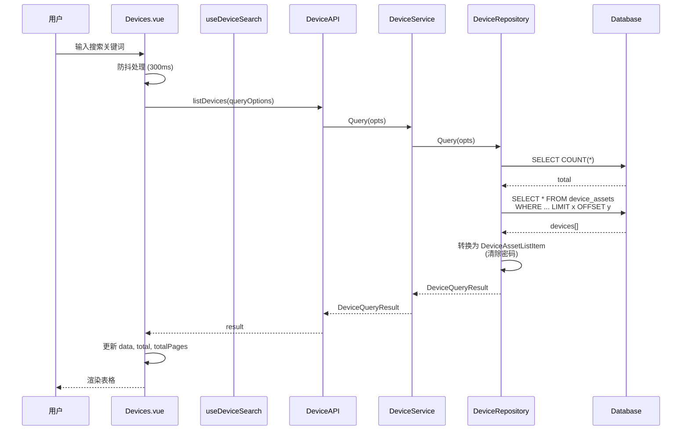
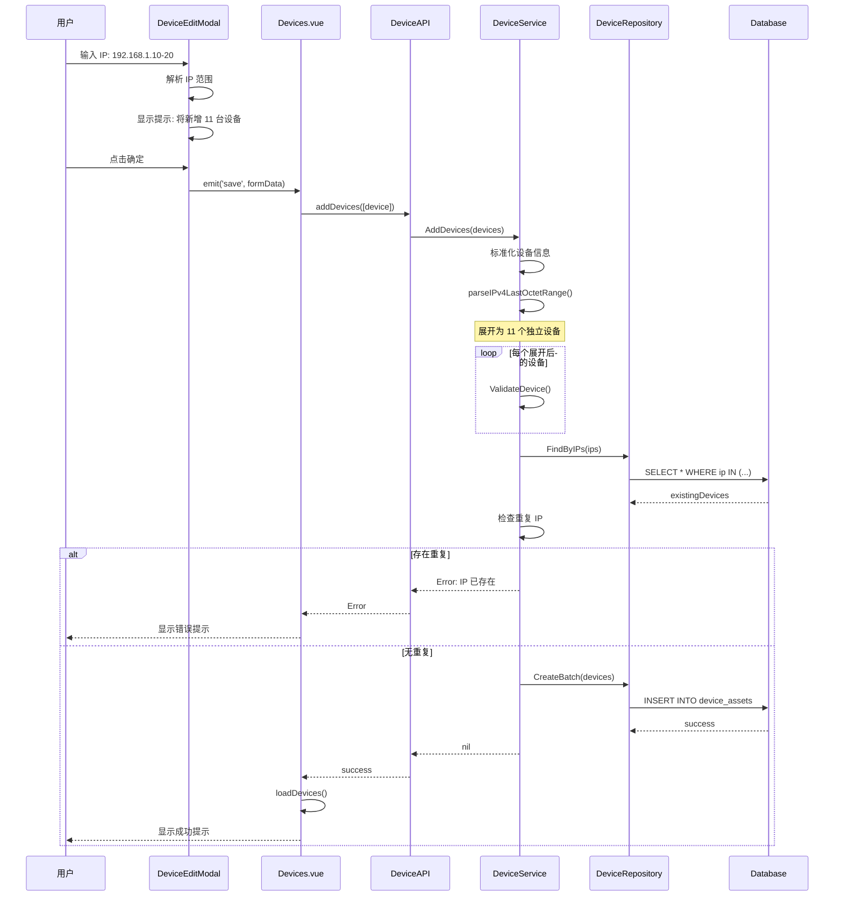
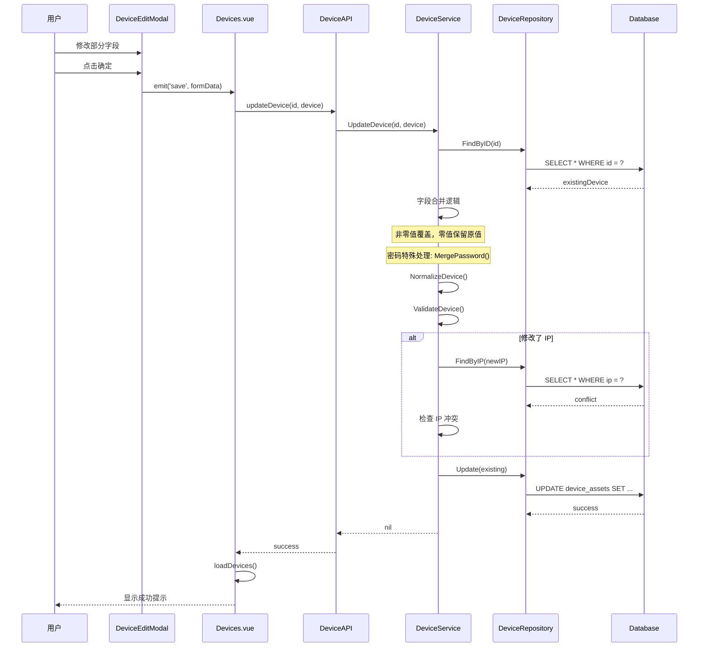
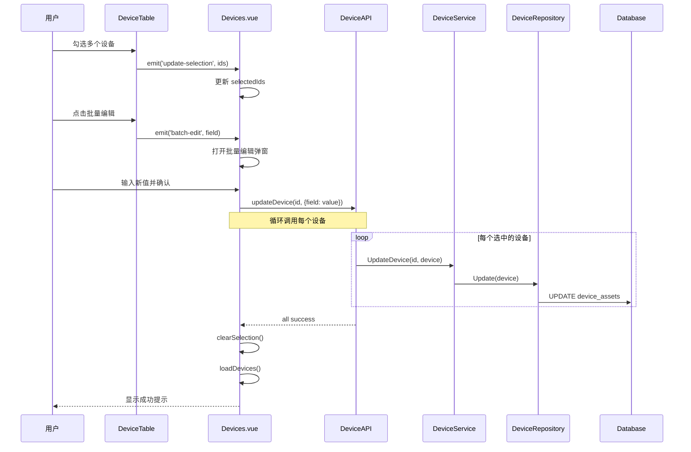
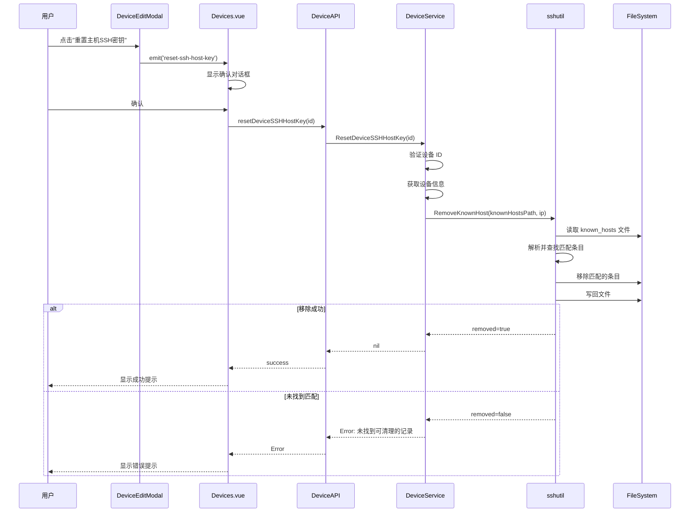
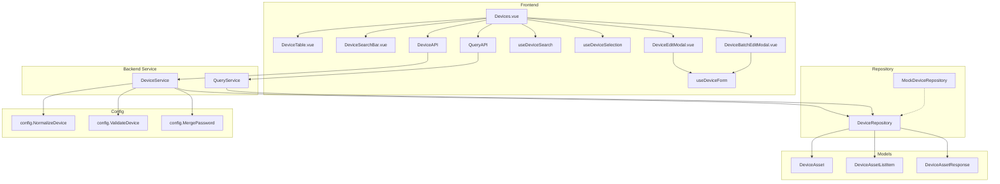

# 设备管理模块功能和逻辑说明书

## 1. 模块概述

### 1.1 整体架构

设备管理模块采用分层架构设计，主要包含以下三个层次：

```
┌─────────────────────────────────────────────────────────────────┐
│                      UI Layer (frontend/src)                     │
│  ┌─────────────────────────────────────────────────────────┐   │
│  │ Devices.vue (主视图)                                      │   │
│  │ - 协调子组件和 Composables                                 │   │
│  │ - 管理页面状态和生命周期                                    │   │
│  └─────────────────────────────────────────────────────────┘   │
│                              │                                   │
│        ┌─────────────────────┼─────────────────────┐            │
│        ▼                     ▼                     ▼            │
│  ┌───────────┐    ┌───────────────────┐    ┌───────────────┐   │
│  │ Components │    │ Composables        │    │ Services/API  │   │
│  │ (子组件)   │    │ (逻辑复用)         │    │ (API调用)     │   │
│  └───────────┘    └───────────────────┘    └───────────────┘   │
└─────────────────────────────────────────────────────────────────┘
                              │
                              ▼
┌─────────────────────────────────────────────────────────────────┐
│                 Service Layer (internal/ui)                      │
│  ┌─────────────────────────────────────────────────────────┐   │
│  │ DeviceService                                             │   │
│  │ - 设备 CRUD 操作                                          │   │
│  │ - IP 范围展开                                             │   │
│  │ - 数据校验与标准化                                         │   │
│  │ - SSH 主机密钥管理                                        │   │
│  └─────────────────────────────────────────────────────────┘   │
└─────────────────────────────────────────────────────────────────┘
                              │
                              ▼
┌─────────────────────────────────────────────────────────────────┐
│              Repository Layer (internal/repository)              │
│  ┌─────────────────────────────────────────────────────────┐   │
│  │ DeviceRepository                                          │   │
│  │ - 数据持久化 (GORM)                                       │   │
│  │ - 分页查询                                                │   │
│  │ - 条件过滤                                                │   │
│  │ - 聚合查询 (分组/标签去重)                                 │   │
│  └─────────────────────────────────────────────────────────┘   │
└─────────────────────────────────────────────────────────────────┘
                              │
                              ▼
┌─────────────────────────────────────────────────────────────────┐
│                 Model Layer (internal/models)                    │
│  ┌─────────────────────────────────────────────────────────┐   │
│  │ DeviceAsset / DeviceAssetListItem / DeviceAssetResponse  │   │
│  └─────────────────────────────────────────────────────────┘   │
└─────────────────────────────────────────────────────────────────┘
```

### 1.2 核心数据流说明

设备管理模块的数据流遵循单向数据流原则：

1. **查询流程**：用户触发搜索 → 前端防抖处理 → 调用后端 API → Repository 执行数据库查询 → 返回分页结果
2. **新增流程**：用户填写表单 → 前端验证（IP格式/范围语法）→ 后端展开IP范围 → 校验重复 → 批量写入数据库
3. **更新流程**：用户编辑表单 → 后端字段合并（非零值覆盖）→ 密码特殊处理 → 更新数据库
4. **删除流程**：用户确认 → 后端执行删除 → 返回结果

### 1.3 模块职责划分

| 模块 | 路径 | 主要职责 |
|------|------|----------|
| **主视图** | `frontend/src/views/Devices.vue` | 页面状态管理、组件协调、事件处理 |
| **子组件** | `frontend/src/components/device/` | UI 渲染、用户交互、表单验证 |
| **Composables** | `frontend/src/composables/` | 可复用逻辑（搜索、选择、表单） |
| **Service** | `internal/ui/device_service.go` | 业务逻辑、数据校验、IP范围展开 |
| **Repository** | `internal/repository/device_repository.go` | 数据访问、分页查询、持久化 |
| **Models** | `internal/models/models.go` | 数据结构定义、响应转换 |

---

## 2. 核心数据结构

### 2.1 后端数据模型

#### 2.1.1 DeviceAsset - 设备资产实体

```go
// 文件: internal/models/models.go
type DeviceAsset struct {
    ID          uint      `json:"id" gorm:"primaryKey;autoIncrement"`
    IP          string    `json:"ip" gorm:"uniqueIndex;not null"`
    Port        int       `json:"port"`
    Username    string    `json:"username"`
    Password    string    `json:"password" gorm:"column:password"`
    Protocol    string    `json:"protocol"`
    Group       string    `json:"group" gorm:"column:group_name"` // 映射到数据库的 group_name 列
    DisplayName string    `json:"displayName"`
    Vendor      string    `json:"vendor"`
    Role        string    `json:"role"`
    Site        string    `json:"site"`
    Description string    `json:"description"`
    Tags        []string  `json:"tags" gorm:"serializer:json"` // 标签列表
    LastSeen    time.Time `json:"lastSeen"`
    CreatedAt   time.Time `json:"createdAt"`
    UpdatedAt   time.Time `json:"updatedAt"`
}
```

**字段详解**：

| 字段 | 类型 | 说明 | 数据库约束 |
|------|------|------|-----------|
| `ID` | uint | 主键 | 自增 |
| `IP` | string | 设备IP地址 | 唯一索引，非空 |
| `Port` | int | 连接端口 | 默认根据协议自动填充 |
| `Username` | string | 登录用户名 | 可选 |
| `Password` | string | 登录密码 | 可选，加密存储 |
| `Protocol` | string | 连接协议 | SSH/SNMP/TELNET |
| `Group` | string | 设备分组 | 用于任务组绑定 |
| `DisplayName` | string | 显示名称 | 可选 |
| `Vendor` | string | 设备厂商 | 可选 |
| `Role` | string | 设备角色 | 可选 |
| `Site` | string | 站点位置 | 可选 |
| `Description` | string | 描述信息 | 可选 |
| `Tags` | []string | 标签列表 | JSON 序列化存储 |
| `LastSeen` | time.Time | 最后在线时间 | 自动更新 |
| `CreatedAt` | time.Time | 创建时间 | 自动填充 |
| `UpdatedAt` | time.Time | 更新时间 | 自动更新 |

#### 2.1.2 DeviceAssetListItem - 列表项（不含密码）

```go
// 文件: internal/models/models.go
type DeviceAssetListItem struct {
    ID          uint      `json:"id"`
    IP          string    `json:"ip"`
    Port        int       `json:"port"`
    Username    string    `json:"username"`
    Password    string    `json:"password"` // 列表场景始终为空字符串
    Protocol    string    `json:"protocol"`
    Group       string    `json:"group"`
    DisplayName string    `json:"displayName"`
    Vendor      string    `json:"vendor"`
    Role        string    `json:"role"`
    Site        string    `json:"site"`
    Description string    `json:"description"`
    Tags        []string  `json:"tags"`
    LastSeen    time.Time `json:"lastSeen"`
    CreatedAt   time.Time `json:"createdAt"`
    UpdatedAt   time.Time `json:"updatedAt"`
}
```

**设计要点**：
- 列表接口不返回密码字段，保护敏感信息
- 通过 [`ToListItem()`](internal/models/models.go:53) 方法转换

#### 2.1.3 DeviceAssetResponse - 详情响应（含密码）

```go
// 文件: internal/models/models.go
type DeviceAssetResponse struct {
    DeviceAsset
    Password string `json:"password,omitempty"`
}
```

**设计要点**：
- 仅在编辑场景返回解密后的密码
- 通过 [`ToResponse()`](internal/models/models.go:81) 方法转换

### 2.2 前端数据结构

#### 2.2.1 DeviceFormData - 表单数据

```typescript
// 文件: frontend/src/composables/useDeviceForm.ts
export interface DeviceFormData {
  ip: string
  port: number
  protocol: string
  username: string
  password: string
  group: string
  tags: string[]
  vendor: string
  role: string
  site: string
  displayName: string
  description: string
}
```

#### 2.2.2 IpRangeHint - IP范围提示

```typescript
// 文件: frontend/src/composables/useDeviceForm.ts
export interface IpRangeHint {
  count: number    // 展开后的设备数量
  start: string    // 起始IP
  end: string      // 结束IP
}
```

### 2.3 Repository 接口定义

```go
// 文件: internal/repository/interfaces.go
type DeviceRepository interface {
    // 查询操作
    FindAll() ([]models.DeviceAsset, error)
    FindByID(id uint) (*models.DeviceAsset, error)
    FindByIPs(ips []string) ([]models.DeviceAsset, error)
    FindByIP(ip string) (*models.DeviceAsset, error)
    Count() (int64, error)
    ExistsByIP(ip string) (bool, error)

    // 分页查询（支持条件过滤）
    Query(opts DeviceQueryOptions) (*DeviceQueryResult, error)

    // 写入操作
    Create(device *models.DeviceAsset) error
    CreateBatch(devices []models.DeviceAsset) error
    Update(device *models.DeviceAsset) error
    UpdateBatch(devices []models.DeviceAsset) error
    Delete(id uint) error
    DeleteBatch(ids []uint) error

    // 事务支持
    WithTx(tx *gorm.DB) DeviceRepository
    BeginTx() *gorm.DB

    // 聚合查询
    GetDistinctGroups() ([]string, error)
    GetDistinctTags() ([]string, error)
}
```

#### DeviceQueryOptions - 查询选项

```go
// 文件: internal/repository/interfaces.go
type DeviceQueryOptions struct {
    SearchQuery string   // 搜索关键词
    FilterField string   // 过滤字段 (如 group, ip, tag, protocol)
    FilterValue string   // 过滤值
    Page        int      // 页码 (1-based)
    PageSize    int      // 每页条数
    SortBy      string   // 排序字段
    SortOrder   string   // 排序方向: asc/desc
    IPFilter    []string // IP 过滤列表
    IDFilter    []uint   // ID 过滤列表
}
```

#### DeviceQueryResult - 查询结果

```go
// 文件: internal/repository/interfaces.go
type DeviceQueryResult struct {
    Data       []models.DeviceAssetListItem // 数据列表（不含密码）
    Total      int64                        // 总记录数
    Page       int                          // 当前页码
    PageSize   int                          // 每页条数
    TotalPages int                          // 总页数
}
```

---

## 3. 工作流程

### 3.1 设备列表查询流程



### 3.2 新增设备流程（含IP范围展开）



### 3.3 更新设备流程（字段合并）



### 3.4 批量操作流程



### 3.5 SSH 主机密钥重置流程



---

## 4. 模块间交互关系

### 4.1 依赖关系图



### 4.2 调用链示例

#### 4.2.1 设备列表查询调用链

```
Devices.vue:loadDevices()
  └─> QueryAPI.listDevices(opts)
       └─> QueryService.ListDevices()
            └─> DeviceRepository.Query(opts)
                 └─> GORM: SELECT * FROM device_assets WHERE ... LIMIT ? OFFSET ?
                      └─> DeviceAsset.ToListItem() // 清除密码
                           └─> return DeviceQueryResult
```

#### 4.2.2 新增设备调用链

```
Devices.vue:saveDevice(formData)
  └─> DeviceAPI.addDevices([device])
       └─> DeviceService.AddDevices(devices)
            ├─> config.NormalizeDevice(&device)      // 标准化
            ├─> parseIPv4LastOctetRange(device.IP)   // IP范围展开
            ├─> config.ValidateDevice(&device)       // 校验
            ├─> DeviceRepository.FindByIPs(ips)      // 检查重复
            └─> DeviceRepository.CreateBatch(devices) // 批量创建
                 └─> GORM: INSERT INTO device_assets VALUES (...)
```

#### 4.2.3 更新设备调用链

```
Devices.vue:saveDevice(formData)
  └─> DeviceAPI.updateDevice(id, device)
       └─> DeviceService.UpdateDevice(id, device)
            ├─> DeviceRepository.FindByID(id)        // 获取现有设备
            ├─> 字段合并逻辑                          // 非零值覆盖
            ├─> config.MergePassword()               // 密码特殊处理
            ├─> config.NormalizeDevice(existing)     // 标准化
            ├─> config.ValidateDevice(existing)      // 校验
            ├─> DeviceRepository.FindByIP(newIP)     // IP冲突检查
            └─> DeviceRepository.Update(existing)    // 更新
                 └─> GORM: UPDATE device_assets SET ... WHERE id = ?
```

---

## 5. 核心功能详解

### 5.1 IP 范围语法糖

设备管理模块支持 IP 范围语法，方便批量添加连续 IP 的设备。

**支持的格式**：
- `192.168.1.10-20`：使用连字符，表示 192.168.1.10 到 192.168.1.20
- `192.168.1.10~20`：使用波浪号，同上

**前端解析逻辑** ([`parseIpRange()`](frontend/src/composables/useDeviceForm.ts:112))：

```typescript
function parseIpRange(ip: string): IpRangeHint | null {
  const match = ip.match(/^(\d{1,3}\.\d{1,3}\.\d{1,3}\.)(\d{1,3})[-~](\d{1,3})$/)
  if (match) {
    const prefix = match[1]
    const start = parseInt(match[2], 10)
    const end = parseInt(match[3], 10)
    
    if (start <= end && start >= 0 && end <= 255) {
      return {
        count: end - start + 1,
        start: prefix + start,
        end: prefix + end,
      }
    }
  }
  return null
}
```

**后端展开逻辑** ([`parseIPv4LastOctetRange()`](internal/ui/device_service.go:121))：

```go
// 在 AddDevices 方法中调用
rangeResult, rangeErr := parseIPv4LastOctetRange(devices[i].IP)
if rangeResult != nil {
    for _, ip := range rangeResult.List {
        newDevice := devices[i]
        newDevice.IP = ip
        // 验证并添加到展开列表
        expandedDevices = append(expandedDevices, newDevice)
    }
}
```

### 5.2 密码安全处理

**设计原则**：
1. 列表接口不返回密码字段
2. 详情接口返回解密后的密码（用于编辑）
3. 更新时使用密码合并规则

**密码合并规则** ([`config.MergePassword()`](internal/config))：

| 场景 | 原密码 | 新密码 | 结果 |
|------|--------|--------|------|
| 保持原密码 | "abc" | "" | "abc" |
| 修改密码 | "abc" | "xyz" | "xyz" |
| 清空密码 | "abc" | " " (空格) | "" |

### 5.3 字段合并策略

更新设备时采用"非零值覆盖，零值保留原值"策略：

```go
// 文件: internal/ui/device_service.go
if device.IP != "" {
    existing.IP = device.IP
}
if device.Protocol != "" {
    existing.Protocol = device.Protocol
}
if device.Port != 0 {
    existing.Port = device.Port
}
// ... 其他字段
```

**例外处理**：
- `Tags`：直接覆盖（支持清空）
- `Password`：使用专门的合并函数

### 5.4 搜索过滤机制

**支持的搜索类型**：
- `group`：按分组名称搜索
- `ip`：按 IP 地址搜索
- `tag`：按标签搜索
- `protocol`：按协议搜索

**后端查询构建** ([`DeviceRepository.Query()`](internal/repository/device_repository.go:112))：

```go
if opts.SearchQuery != "" {
    searchPattern := "%" + strings.ToLower(opts.SearchQuery) + "%"
    switch filterField {
    case "group":
        query = query.Where("LOWER(group_name) LIKE ?", searchPattern)
    case "ip":
        query = query.Where("LOWER(ip) LIKE ?", searchPattern)
    case "tag":
        query = query.Where("LOWER(tags) LIKE ?", searchPattern)
    case "protocol":
        query = query.Where("LOWER(protocol) LIKE ?", searchPattern)
    default:
        // 默认搜索所有字段
        query = query.Where(
            "LOWER(ip) LIKE ? OR LOWER(group_name) LIKE ? OR LOWER(username) LIKE ? OR LOWER(tags) LIKE ?",
            searchPattern, searchPattern, searchPattern, searchPattern,
        )
    }
}
```

### 5.5 批量操作实现

**批量编辑**：
- 前端循环调用单个更新接口
- 支持字段：`group`, `protocol`, `port`, `username`, `password`, `tag`

**批量删除**：
- 后端提供 `DeleteBatch()` 方法
- 单次 SQL 执行删除

```go
// 文件: internal/repository/device_repository.go
func (r *deviceRepository) DeleteBatch(ids []uint) error {
    result := r.db.Where("id IN ?", ids).Delete(&models.DeviceAsset{})
    if result.Error != nil {
        return result.Error
    }
    if result.RowsAffected == 0 {
        return fmt.Errorf("未找到可删除的设备")
    }
    return nil
}
```

---

## 6. 前端组件架构

### 6.1 组件层次结构

```
Devices.vue (主视图)
├── DeviceSearchBar.vue (搜索栏)
│   ├── el-select (搜索类型选择)
│   └── el-input (搜索输入框)
├── DeviceTable.vue (数据表格)
│   ├── el-table (表格组件)
│   │   ├── el-table-column (选择列)
│   │   ├── el-table-column (分组列)
│   │   ├── el-table-column (IP列)
│   │   ├── el-table-column (协议列)
│   │   ├── el-table-column (端口列)
│   │   ├── el-table-column (用户名列)
│   │   ├── el-table-column (密码列)
│   │   ├── el-table-column (标签列)
│   │   └── el-table-column (操作列)
│   └── el-pagination (分页组件)
├── DeviceEditModal.vue (编辑弹窗)
│   └── el-form (表单组件)
└── DeviceBatchEditModal.vue (批量编辑弹窗)
    └── el-form (表单组件)
```

### 6.2 Composables 职责

| Composable | 文件 | 职责 |
|------------|------|------|
| [`useDeviceSearch`](frontend/src/composables/useDeviceSearch.ts) | 搜索逻辑 | 搜索类型、搜索关键词、重置搜索 |
| [`useDeviceSelection`](frontend/src/composables/useDeviceSelection.ts) | 选择逻辑 | 已选ID集合、全选/取消、选择计数 |
| [`useDeviceForm`](frontend/src/composables/useDeviceForm.ts) | 表单逻辑 | 表单数据、IP验证、标签管理 |

### 6.3 状态管理

**页面级状态** (Devices.vue)：
- `data`: 设备列表数据
- `total`: 总记录数
- `page`: 当前页码
- `pageSize`: 每页条数
- `loading`: 加载状态
- `showModal`: 编辑弹窗显示状态
- `isEditing`: 是否编辑模式
- `editingDeviceId`: 正在编辑的设备ID
- `showBatchModal`: 批量编辑弹窗显示状态
- `batchField`: 批量编辑的字段名

**搜索状态** (useDeviceSearch)：
- `searchQuery`: 搜索关键词
- `searchType`: 搜索类型

**选择状态** (useDeviceSelection)：
- `selectedIds`: 已选择的设备ID集合 (Set<number>)

---

## 7. API 接口清单

### 7.1 DeviceAPI 接口

| 方法 | 说明 | 参数 | 返回值 |
|------|------|------|--------|
| `listDevices` | 获取设备列表 | `QueryOptions` | `DeviceQueryResult` |
| `getDeviceById` | 获取设备详情 | `id: number` | `DeviceAssetResponse` |
| `addDevice` | 新增单个设备 | `device: DeviceAsset` | `void` |
| `addDevices` | 批量新增设备 | `devices: DeviceAsset[]` | `void` |
| `updateDevice` | 更新设备 | `id: number, device: DeviceAsset` | `void` |
| `updateDevices` | 批量更新设备 | `devices: DeviceAsset[]` | `void` |
| `deleteDevice` | 删除设备 | `id: number` | `void` |
| `deleteDevices` | 批量删除设备 | `ids: number[]` | `void` |
| `resetDeviceSSHHostKey` | 重置SSH主机密钥 | `id: number` | `void` |
| `getProtocolDefaultPorts` | 获取协议默认端口 | - | `Record<string, number>` |
| `getValidProtocols` | 获取有效协议列表 | - | `string[]` |

### 7.2 QueryAPI 接口

| 方法 | 说明 | 参数 | 返回值 |
|------|------|------|--------|
| `listDevices` | 分页查询设备 | `QueryOptions` | `DeviceQueryResult` |

---

## 8. 总结

### 8.1 模块特性总结

| 特性 | 说明 |
|------|------|
| **IP范围语法** | 支持 `192.168.1.10-20` 格式批量添加设备 |
| **密码安全** | 列表不返回密码，详情返回解密密码，更新时智能合并 |
| **字段合并** | 更新时非零值覆盖，零值保留原值 |
| **批量操作** | 支持批量编辑、批量删除 |
| **多维度搜索** | 支持按分组、标签、IP、协议搜索 |
| **SSH密钥管理** | 支持重置设备SSH主机密钥 |
| **分页查询** | 后端分页，支持排序 |

### 8.2 设计亮点

1. **分层架构清晰**：前端组件/Composables、后端Service/Repository 职责分明
2. **安全性考虑**：密码字段特殊处理，列表接口不暴露敏感信息
3. **用户体验优化**：IP范围语法糖、防抖搜索、实时验证提示
4. **可测试性**：Repository 接口抽象，支持 Mock 实现
5. **扩展性**：Composables 模式便于逻辑复用

### 8.3 文件索引

| 类型 | 文件路径 |
|------|----------|
| 主视图 | [`frontend/src/views/Devices.vue`](frontend/src/views/Devices.vue) |
| 表格组件 | [`frontend/src/components/device/DeviceTable.vue`](frontend/src/components/device/DeviceTable.vue) |
| 搜索组件 | [`frontend/src/components/device/DeviceSearchBar.vue`](frontend/src/components/device/DeviceSearchBar.vue) |
| 编辑弹窗 | [`frontend/src/components/device/DeviceEditModal.vue`](frontend/src/components/device/DeviceEditModal.vue) |
| 批量编辑弹窗 | [`frontend/src/components/device/DeviceBatchEditModal.vue`](frontend/src/components/device/DeviceBatchEditModal.vue) |
| 搜索逻辑 | [`frontend/src/composables/useDeviceSearch.ts`](frontend/src/composables/useDeviceSearch.ts) |
| 选择逻辑 | [`frontend/src/composables/useDeviceSelection.ts`](frontend/src/composables/useDeviceSelection.ts) |
| 表单逻辑 | [`frontend/src/composables/useDeviceForm.ts`](frontend/src/composables/useDeviceForm.ts) |
| 后端服务 | [`internal/ui/device_service.go`](internal/ui/device_service.go) |
| 数据仓储 | [`internal/repository/device_repository.go`](internal/repository/device_repository.go) |
| 仓储接口 | [`internal/repository/interfaces.go`](internal/repository/interfaces.go) |
| 数据模型 | [`internal/models/models.go`](internal/models/models.go) |
| API导出 | [`frontend/src/services/api.ts`](frontend/src/services/api.ts) |
