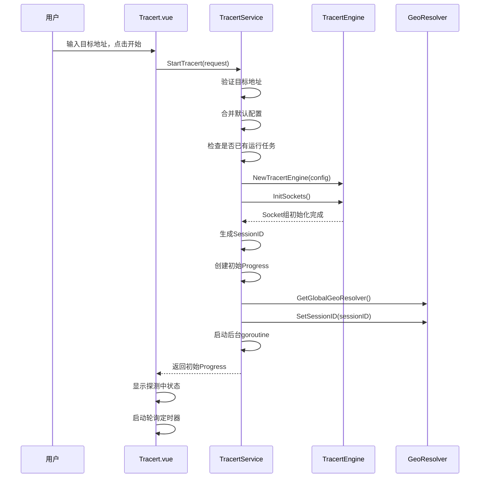
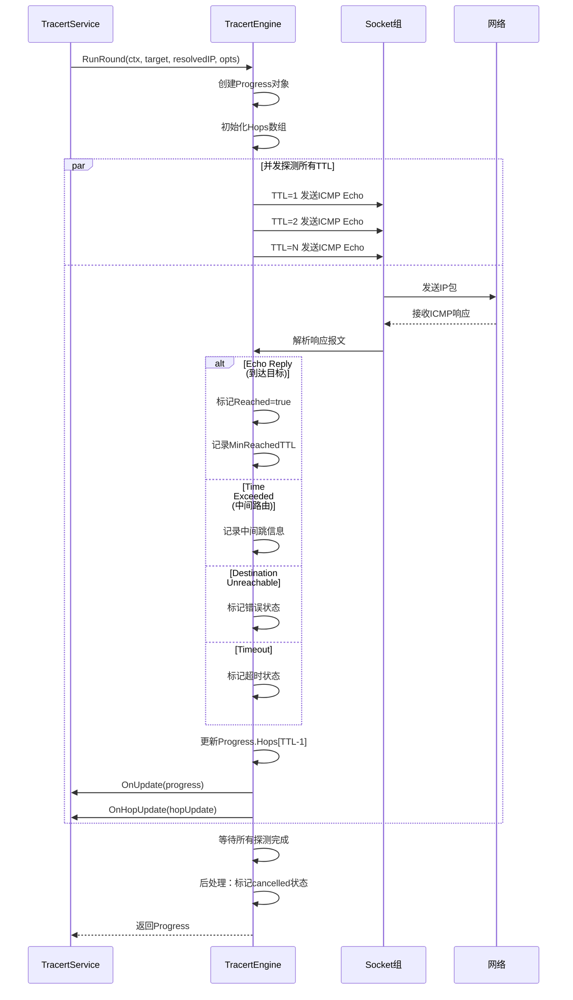
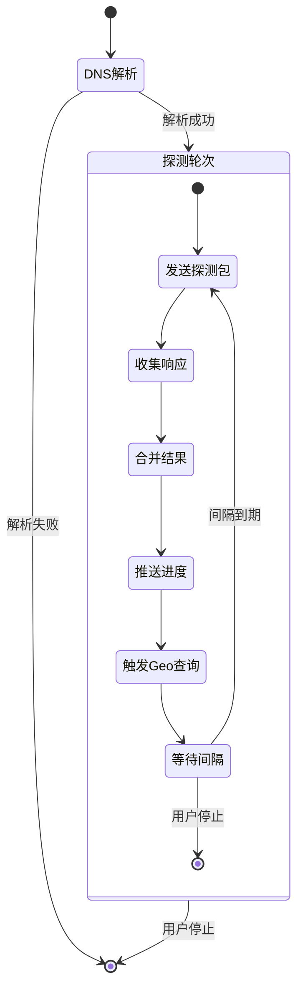
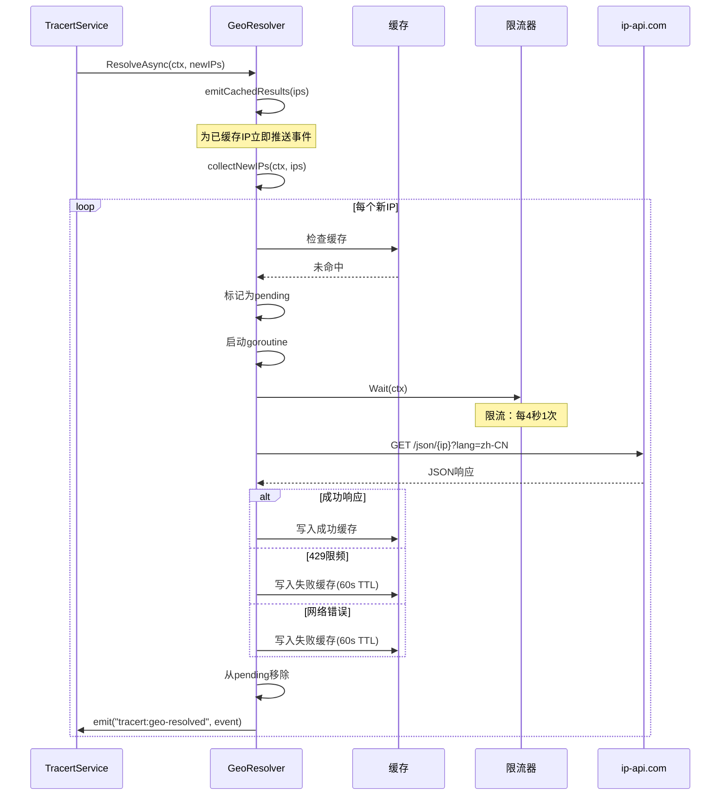

# 路由追踪模块功能和逻辑

## 1. 模块概述

### 1.1 整体架构概览

路由追踪模块（Tracert）是一个网络路径探测工具，用于探测从本机到目标主机之间的网络路径，获取每一跳路由器的IP地址、响应延迟和地理位置信息。模块采用分层架构设计，包含前端UI层、后端服务层、核心引擎层和地理位置解析层。

```
┌─────────────────────────────────────────────────────────────────────────────┐
│                              前端UI层 (Vue3)                                  │
│  ┌─────────────────────────────────────────────────────────────────────┐   │
│  │  Tracert.vue - 用户界面组件                                           │   │
│  │  • 目标地址输入与配置面板                                             │   │
│  │  • 实时探测结果表格展示                                               │   │
│  │  • 统计信息面板                                                       │   │
│  │  • 列配置与导出功能                                                   │   │
│  └─────────────────────────────────────────────────────────────────────┘   │
└─────────────────────────────────────────────────────────────────────────────┘
                                      │
                                      │ Wails Events (tracert:progress, hop-update, heartbeat, geo-resolved)
                                      ▼
┌─────────────────────────────────────────────────────────────────────────────┐
│                            后端服务层 (Go)                                    │
│  ┌─────────────────────────────────────────────────────────────────────┐   │
│  │  TracertService - 业务逻辑服务                                        │   │
│  │  • 启动/停止探测任务                                                 │   │
│  │  • 单轮/持续探测模式管理                                             │   │
│  │  • 探测结果累积与合并                                               │   │
│  │  • CSV/TXT导出功能                                                   │   │
│  │  • 事件推送与心跳维护                                               │   │
│  └─────────────────────────────────────────────────────────────────────┘   │
│                                      │                                       │
│                                      ▼                                       │
│  ┌─────────────────────────────────────────────────────────────────────┐   │
│  │  TracertGeoResolver - 地理位置解析服务                                │   │
│  │  • 异步IP地理位置查询                                               │   │
│  │  • 进程级缓存管理                                                   │   │
│  │  • API限流控制（4秒/次）                                            │   │
│  │  • 失败缓存与重试机制                                               │   │
│  └─────────────────────────────────────────────────────────────────────┘   │
└─────────────────────────────────────────────────────────────────────────────┘
                                      │
                                      ▼
┌─────────────────────────────────────────────────────────────────────────────┐
│                            核心引擎层 (Go)                                    │
│  ┌─────────────────────────────────────────────────────────────────────┐   │
│  │  TracertEngine - ICMP探测引擎                                        │   │
│  │  • 并发TTL探测                                                       │   │
│  │  • 专属Socket组管理                                                 │   │
│  │  • ICMP报文构造与解析                                               │   │
│  │  • 超时控制与取消处理                                               │   │
│  └─────────────────────────────────────────────────────────────────────┘   │
└─────────────────────────────────────────────────────────────────────────────┘
```

### 1.2 核心数据流说明

路由追踪模块的数据流遵循以下路径：

1. **用户输入阶段**：用户在前端输入目标地址（IP或域名），配置探测参数（最大跳数、超时时间、探测轮次等）
2. **任务启动阶段**：前端调用 `StartTracert` 方法，后端创建 `TracertEngine` 实例并初始化Socket组
3. **DNS解析阶段**：如果目标是域名，引擎执行DNS解析获取IPv4地址
4. **并发探测阶段**：引擎对所有TTL（1到MaxHops）并发发送ICMP Echo请求
5. **结果收集阶段**：引擎接收ICMP响应（Echo Reply、Time Exceeded、Destination Unreachable），实时推送单跳更新事件
6. **地理解析阶段**：服务层收集新发现的IP，异步触发地理位置查询
7. **结果展示阶段**：前端接收实时事件，更新探测结果表格和统计信息
8. **导出阶段**：用户可选择导出CSV或TXT格式的探测报告

### 1.3 模块职责划分

| 层级 | 组件 | 职责 | 关键文件 |
|------|------|------|----------|
| 前端UI层 | Tracert.vue | 用户交互、实时展示、配置管理 | [`frontend/src/views/Tools/Tracert.vue`](frontend/src/views/Tools/Tracert.vue:1) |
| 后端服务层 | TracertService | 任务管理、结果合并、事件推送、导出 | [`internal/ui/tracert_service.go`](internal/ui/tracert_service.go:1) |
| 地理解析层 | TracertGeoResolver | 异步Geo查询、缓存管理、限流控制 | [`internal/ui/tracert_geo_resolver.go`](internal/ui/tracert_geo_resolver.go:1) |
| 核心引擎层 | TracertEngine | ICMP探测、Socket管理、报文解析 | [`internal/icmp/tracert_engine.go`](internal/icmp/tracert_engine.go:1) |
| 数据模型层 | types.go | 数据结构定义 | [`internal/icmp/types.go`](internal/icmp/types.go:258) |

---

## 2. 核心数据结构

### 2.1 结构体定义

#### TracertConfig - 探测配置

```go
// 文件: internal/icmp/types.go:260-268
type TracertConfig struct {
    MaxHops     int    `json:"maxHops"`     // 最大跳数 (1-255, 默认 30)
    Timeout     uint32 `json:"timeout"`     // 每跳超时(ms) (默认 1500)
    DataSize    uint16 `json:"dataSize"`    // 数据包大小 (默认 32)
    Count       int    `json:"count"`       // 探测轮次 (1-1000000, 默认 1)
    Interval    uint32 `json:"interval"`    // 探测轮次间隔(ms) (1-60000, 默认 1000)
    Concurrency int    `json:"concurrency"` // TTL 并发数 (默认 0=全量并发)
}
```

#### TracertProgress - 探测进度

```go
// 文件: internal/icmp/types.go:313-329
type TracertProgress struct {
    Target         string             `json:"target"`         // 目标地址（用户输入）
    ResolvedIP     string             `json:"resolvedIP"`    // 解析后的 IP
    SessionID      string             `json:"sessionId"`      // 会话ID（用于前端区分不同探测会话）
    Round          int                `json:"round"`          // 当前第几轮探测
    TotalHops      int                `json:"totalHops"`      // 总跳数（配置的最大跳数）
    CompletedHops  int                `json:"completedHops"`  // 已完成跳数
    IsRunning      bool               `json:"isRunning"`      // 是否运行中
    IsContinuous   bool               `json:"isContinuous"`   // 是否持续模式
    IsResolvingGeo bool               `json:"isResolvingGeo"` // 是否正在解析地理位置
    StartTime      time.Time          `json:"startTime"`      // 开始时间
    ElapsedMs      int64              `json:"elapsedMs"`      // 已用时间(ms)
    Hops           []TracertHopResult `json:"hops"`           // 各跳结果
    ReachedDest    bool               `json:"reachedDest"`    // 是否到达目的地
    MinReachedTTL  int32              `json:"minReachedTtl"`  // 所有轮次中到达目标的最小 TTL
}
```

#### TracertHopResult - 单跳探测结果

```go
// 文件: internal/icmp/types.go:296-311
type TracertHopResult struct {
    TTL       int      `json:"ttl"`       // 第几跳
    IP        string    `json:"ip"`        // 响应 IP
    Geo       *GeoInfo  `json:"geo"`       // IP地理位置信息
    Status    string    `json:"status"`    // "success" / "timeout" / "error" / "pending" / "cancelled"
    SentCount int       `json:"sentCount"` // 发送报文数量
    RecvCount int       `json:"recvCount"` // 接收报文数量
    LossRate  float64   `json:"lossRate"`  // 丢包率 (0-100)
    MinRtt    float64   `json:"minRtt"`    // 最低延迟(ms), -1 表示无效
    MaxRtt    float64   `json:"maxRtt"`    // 最高延迟(ms)
    AvgRtt    float64   `json:"avgRtt"`    // 平均延迟(ms)
    LastRtt   float64   `json:"lastRtt"`   // 上次探测延迟(ms)
    Reached    bool      `json:"reached"`   // 是否到达目标
    ErrorMsg  string    `json:"errorMsg"`  // 错误信息
}
```

#### GeoInfo - 地理位置信息

```go
// 文件: internal/icmp/types.go:282-294
type GeoInfo struct {
    Status      string  `json:"status"`      // API查询状态: "success"/"fail"
    Country     string  `json:"country"`     // 国家
    CountryCode string  `json:"countryCode"` // 国家代码
    Region      string  `json:"region"`      // 省份代码
    RegionName  string  `json:"regionName"`  // 省份/地区
    City        string  `json:"city"`        // 城市
    ISP         string  `json:"isp"`         // 运营商
    AS          string  `json:"as"`          // AS号
    QueryIP     string  `json:"queryIp"`     // 查询的IP
    Message     string  `json:"message"`     // API错误信息（status=fail时）
}
```

#### TracertHopUpdate - 单跳实时更新事件

```go
// 文件: internal/icmp/types.go:447-456
type TracertHopUpdate struct {
    TTL        int     `json:"ttl"`        // 第几跳
    IP         string  `json:"ip"`         // 响应 IP
    CurrentSeq int     `json:"currentSeq"` // 当前探测序号 (1-based)
    Success    bool    `json:"success"`    // 本次是否成功
    RTT        float64 `json:"rtt"`        // 本次 RTT (ms)
    IsComplete bool    `json:"isComplete"` // 该跳是否全部完成
    Timestamp  int64   `json:"timestamp"`  // 更新时间戳 (Unix ms)
}
```

#### TracertHeartbeat - 心跳事件

```go
// 文件: internal/icmp/types.go:458-464
type TracertHeartbeat struct {
    Round          int64 `json:"round"`          // 当前轮次
    ElapsedMs      int64 `json:"elapsedMs"`      // 已用时间(毫秒)
    IsResolvingGeo bool  `json:"isResolvingGeo"` // 是否正在解析地理位置
    Timestamp      int64 `json:"timestamp"`      // 时间戳(Unix毫秒)
}
```

### 2.2 字段详解表格

#### TracertConfig 字段详解

| 字段 | 类型 | 默认值 | 有效范围 | 说明 |
|------|------|--------|----------|------|
| MaxHops | int | 30 | 1-255 | 最大探测跳数，决定Socket组大小 |
| Timeout | uint32 | 1500 | >0 | 每跳超时时间（毫秒） |
| DataSize | uint16 | 32 | >0 | ICMP数据包大小（字节） |
| Count | int | 1 | 1-1000000 | 探测轮次，每轮每个TTL发送1个包 |
| Interval | uint32 | 1000 | 1-60000 | 持续模式下轮次间隔（毫秒） |
| Concurrency | int | 0 | 0 | TTL并发数，0表示全量并发 |

#### TracertHopResult 字段详解

| 字段 | 类型 | 初始值 | 说明 |
|------|------|--------|------|
| TTL | int | - | 跳数序号（1-based） |
| IP | string | "" | 响应IP地址，超时为"*" |
| Geo | *GeoInfo | nil | 地理位置信息，异步查询填充 |
| Status | string | "pending" | 状态：pending/success/timeout/error/cancelled |
| SentCount | int | 0 | 累计发送报文数 |
| RecvCount | int | 0 | 累计接收报文数 |
| LossRate | float64 | 0 | 丢包率百分比（0-100） |
| MinRtt | float64 | -1 | 最低RTT，-1表示无效 |
| MaxRtt | float64 | 0 | 最高RTT |
| AvgRtt | float64 | 0 | 加权平均RTT |
| LastRtt | float64 | 0 | 最近一次RTT |
| Reached | bool | false | 是否到达目标主机 |
| ErrorMsg | string | "" | 错误描述信息 |

### 2.3 设计要点说明

1. **SessionID机制**：每次探测任务生成唯一SessionID（格式：`{target}-{timestamp}`），用于前端区分不同探测会话的事件，防止旧会话事件污染新会话。

2. **MinReachedTTL字段**：记录所有轮次中到达目标的最小TTL，用于前端过滤显示结果，避免显示超范围的探测数据。

3. **加权平均RTT**：多轮探测时使用加权平均计算AvgRtt，权重为各轮的RecvCount，确保统计准确性。

4. **Geo异步查询**：地理位置查询与探测任务解耦，探测完成后异步查询Geo信息，不阻塞探测流程。

5. **心跳机制**：探测过程中定期发送心跳事件，保持前端活跃状态，特别是在Geo查询期间。

---

## 3. 工作流程

### 3.1 探测任务启动时序



### 3.2 单轮探测执行流程



### 3.3 持续探测模式流程



### 3.4 地理位置查询流程



### 3.5 核心函数逻辑说明

#### [`runRound()`](internal/icmp/tracert_engine.go:73) - 执行单轮并发探测

该函数是探测引擎的核心，采用并发模式探测所有TTL：

1. **并发探测启动**：为每个TTL（1到MaxHops）启动独立goroutine
2. **取消检测**：在启动前和探测中检测context取消信号
3. **结果收集**：通过channel串行化收集所有TTL的探测结果
4. **实时更新**：每收到一个TTL结果立即调用OnUpdate和OnHopUpdate回调
5. **心跳维护**：在等待响应期间定期发送心跳更新
6. **到达检测**：使用原子操作记录最小到达TTL，避免竞态条件
7. **后处理**：探测完成后标记超范围TTL为cancelled状态

#### [`probeHop()`](internal/icmp/tracert_engine.go:326) - 探测单跳

该函数执行单个TTL的ICMP探测：

1. **Socket获取**：从预初始化的Socket组中获取对应TTL的连接
2. **报文构造**：构造ICMP Echo Request，设置ID和序列号
3. **发送数据包**：调用WriteTo发送ICMP包到目标IP
4. **接收响应**：循环读取响应报文，匹配ID和序列号
5. **响应处理**：
   - `Echo Reply`：到达目标，提取响应IP和RTT
   - `Time Exceeded`：中间路由，提取路由器IP和RTT
   - `Destination Unreachable`：目标不可达，标记错误
6. **超时处理**：超时后标记timeout状态

#### [`mergeHopResult()`](internal/icmp/tracert_engine.go:261) - 合并多轮探测结果

该函数实现多轮探测结果的累积统计：

1. **首轮赋值**：首轮探测直接赋值结果
2. **跳过cancelled**：后续轮次跳过cancelled状态的结果
3. **累积计数**：累加SentCount和RecvCount
4. **重算丢包率**：基于累积计数重新计算LossRate
5. **加权平均**：使用旧的RecvCount作为权重计算加权平均RTT
6. **更新极值**：更新MinRtt和MaxRtt的极值
7. **保留Geo**：保留已有的Geo信息不被覆盖

#### [`ResolveAsync()`](internal/ui/tracert_geo_resolver.go:168) - 异步地理查询

该函数管理IP地理位置的异步查询：

1. **缓存回填**：先为已缓存的IP推送事件，确保前端立即显示
2. **新IP收集**：过滤出未缓存且未在查询中的新IP
3. **标记pending**：将新IP加入pending集合
4. **并发查询**：为每个IP启动独立goroutine执行查询
5. **限流控制**：使用令牌桶限流器控制请求频率（每4秒1次）
6. **失败缓存**：对失败结果进行短期缓存，避免重复查询

---

## 4. 模块间交互关系

### 4.1 依赖关系图

```mermaid
graph TB
    subgraph Frontend["前端层"]
        Vue[Tracert.vue]
        SettingsModal[TracertSettingsModal.vue]
    end
    
    subgraph Service["服务层"]
        TracertService[TracertService]
        GeoResolver[TracertGeoResolver]
    end
    
    subgraph Core["核心层"]
        Engine[TracertEngine]
        ICMP[ICMP Socket]
    end
    
    subgraph External["外部依赖"]
        DNS[DNS Resolver]
        GeoAPI[ip-api.com]
    end
    
    Vue --> TracertService
    Vue --> SettingsModal
    SettingsModal --> Vue
    
    TracertService --> Engine
    TracertService --> GeoResolver
    TracertService --> Vue: Events
    
    Engine --> ICMP
    Engine --> DNS
    Engine --> TracertService: Callbacks
    
    GeoResolver --> GeoAPI
    GeoResolver --> TracertService: Events
```

### 4.2 调用链示例

#### 启动探测任务调用链

```
用户点击"开始"
    │
    ▼
Tracert.vue::startTracert()
    │
    ▼
TracertService.StartTracert(request)
    ├── 验证目标地址
    ├── 合并默认配置
    ├── 检查运行状态
    │
    ▼
NewTracertEngine(config)
    │
    ▼
TracertEngine.InitSockets()
    ├── 创建MaxHops个Socket
    └── 设置各Socket的TTL
    │
    ▼
TracertService.runSingle() / runContinuous()
    │
    ▼
TracertEngine.ResolveTarget(ctx, target)
    │
    ▼
TracertEngine.RunRound(ctx, target, resolvedIP, opts)
    ├── 并发探测所有TTL
    └── 实时回调OnUpdate/OnHopUpdate
```

#### 地理位置查询调用链

```
探测完成，发现新IP
    │
    ▼
TracertService.collectNewIPsFromHops()
    │
    ▼
TracertGeoResolver.ResolveAsync(ctx, newIPs)
    ├── emitCachedResults() - 推送已缓存结果
    └── collectNewIPs() - 过滤新IP
    │
    ▼
为每个新IP启动goroutine
    │
    ▼
TracertGeoResolver.resolveSingleIP(ctx, ip)
    ├── limiter.Wait(ctx) - 等待限流许可
    └── queryGeoInfo(ctx, ip)
        │
        ▼
    doQueryAttempt(ctx, url)
        ├── doSingleRequest() - HTTP GET
        └── JSON解析
    │
    ▼
更新缓存，推送tracert:geo-resolved事件
```

### 4.3 事件流说明

| 事件名称 | 方向 | 数据类型 | 触发时机 |
|----------|------|----------|----------|
| `tracert:progress` | Backend → Frontend | TracertProgress | 每个TTL探测完成、每轮探测完成 |
| `tracert:hop-update` | Backend → Frontend | TracertHopUpdate | 单个TTL探测完成（实时） |
| `tracert:heartbeat` | Backend → Frontend | TracertHeartbeat | 探测期间每500ms |
| `tracert:geo-resolved` | Backend → Frontend | TracertGeoResolvedEvent | IP地理位置查询完成 |

---

## 5. 总结表格

### 5.1 核心组件职责总结

| 组件 | 核心职责 | 关键方法 | 依赖 |
|------|----------|----------|------|
| Tracert.vue | 用户交互、实时展示 | startTracert, stopTracert, handleProgressEvent | TracertService, Events |
| TracertService | 任务管理、结果合并 | StartTracert, StopTracert, mergeRoundResult | TracertEngine, GeoResolver |
| TracertEngine | ICMP探测、报文解析 | RunRound, probeHop, InitSockets | icmp.PacketConn |
| TracertGeoResolver | 异步Geo查询、缓存管理 | ResolveAsync, queryGeoInfo | http.Client, rate.Limiter |

### 5.2 关键数据结构总结

| 结构体 | 用途 | 关键字段 |
|--------|------|----------|
| TracertConfig | 探测配置 | MaxHops, Timeout, Count, Interval |
| TracertProgress | 探测进度 | SessionID, Round, Hops, MinReachedTTL |
| TracertHopResult | 单跳结果 | TTL, IP, Geo, Status, RTT统计 |
| GeoInfo | 地理位置信息 | Country, RegionName, City, ISP, AS |

### 5.3 设计模式应用

| 模式 | 应用场景 | 实现位置 |
|------|----------|----------|
| 单例模式 | Geo解析器进程级共享 | [`GetGlobalGeoResolver()`](internal/ui/tracert_geo_resolver.go:122) |
| 回调模式 | 探测进度实时通知 | [`TracertRunOptions.OnUpdate`](internal/icmp/types.go:468) |
| 并发模式 | TTL并发探测 | [`runRound()`](internal/icmp/tracert_engine.go:73) goroutine |
| 限流模式 | API请求频率控制 | [`rate.NewLimiter()`](internal/ui/tracert_geo_resolver.go:131) |
| 缓存模式 | Geo查询结果缓存 | [`cache map[string]*GeoResolveResult`](internal/ui/tracert_geo_resolver.go:98) |

### 5.4 性能优化要点

| 优化点 | 实现方式 | 效果 |
|--------|----------|------|
| Socket预初始化 | 探测前创建所有Socket并设置TTL | 避免探测时重复创建开销 |
| 并发探测 | 所有TTL同时发送ICMP包 | 探测时间从O(n*timeout)降至O(timeout) |
| 浅响应式 | 使用shallowRef + triggerRef | 减少Vue深层响应式开销 |
| 批量事件 | hop-update使用微任务合并 | 减少前端渲染次数 |
| Geo异步 | 探测与Geo查询解耦 | 不阻塞探测流程 |
| 失败缓存 | 对失败结果短期缓存 | 避免重复查询失败IP |
