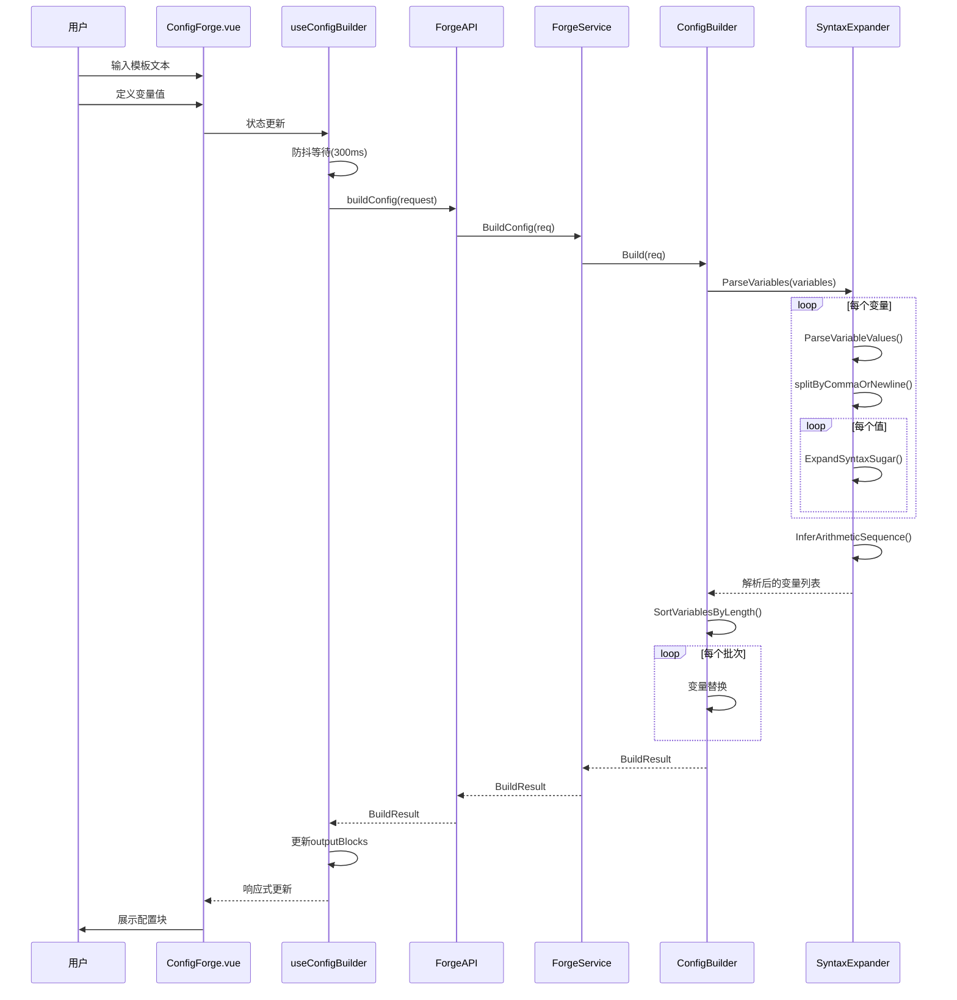
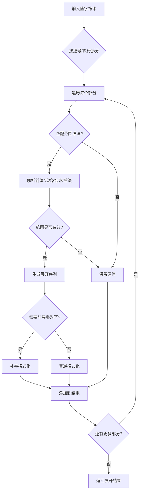
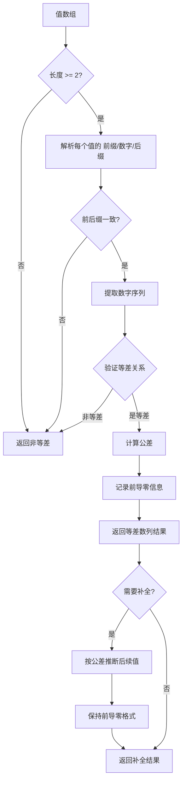
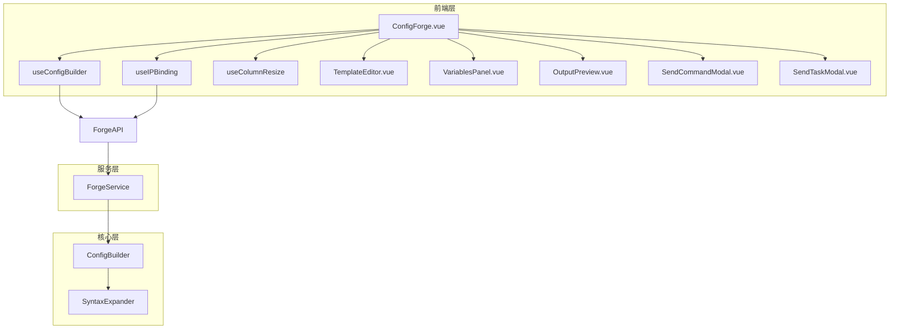

# 配置构建模块功能和逻辑说明书

## 1. 模块概述

### 1.1 整体架构

配置构建模块（ConfigForge）采用分层架构设计，主要包含以下三个层次：

```
┌─────────────────────────────────────────────────────────────────┐
│                      UI Layer (frontend/src)                     │
│  ┌─────────────────────────────────────────────────────────┐   │
│  │ ConfigForge.vue (主视图)                                  │   │
│  │ - 模板编辑器                                              │   │
│  │ - 变量面板管理                                            │   │
│  │ - 输出预览                                                │   │
│  │ - 语法帮助/使用帮助                                        │   │
│  │ - 发送命令/任务集成                                        │   │
│  │ - 下载功能（整体/分割）                                     │   │
│  └─────────────────────────────────────────────────────────┘   │
│  ┌─────────────────────────────────────────────────────────┐   │
│  │ Composables                                               │   │
│  │ - useConfigBuilder: 核心构建逻辑                           │   │
│  │ - useIPBinding: IP绑定模式                                 │   │
│  │ - useColumnResize: 列宽调整                                │   │
│  └─────────────────────────────────────────────────────────┘   │
└─────────────────────────────────────────────────────────────────┘
                               │
                               ▼
┌─────────────────────────────────────────────────────────────────┐
│                 Service Layer (internal/ui)                      │
│  ┌─────────────────────────────────────────────────────────┐   │
│  │ ForgeService                                              │   │
│  │ - Wails 服务接口封装                                       │   │
│  │ - IP验证与范围解析                                         │   │
│  │ - 绑定预览生成                                            │   │
│  └─────────────────────────────────────────────────────────┘   │
└─────────────────────────────────────────────────────────────────┘
                               │
                               ▼
┌─────────────────────────────────────────────────────────────────┐
│               Core Layer (internal/forge)                        │
│  ┌─────────────────────────────────────────────────────────┐   │
│  │ ConfigBuilder                                             │   │
│  │ - 配置构建核心逻辑                                         │   │
│  │ - 变量解析与替换                                           │   │
│  │ - 语法糖展开                                              │   │
│  └─────────────────────────────────────────────────────────┘   │
│  ┌─────────────────────────────────────────────────────────┐   │
│  │ SyntaxExpander                                            │   │
│  │ - 范围语法展开 (1-10)                                      │   │
│  │ - 等差数列检测与推断                                        │   │
│  │ - 变量值解析                                              │   │
│  └─────────────────────────────────────────────────────────┘   │
└─────────────────────────────────────────────────────────────────┘
```

### 1.2 核心数据流说明

配置构建模块的数据流遵循单向数据流原则：

1. **输入流程**：用户输入模板文本 → 定义变量（名称+值字符串） → 前端实时防抖构建
2. **构建流程**：模板+变量 → 后端解析变量值 → 语法糖展开 → 等差数列补全 → 变量替换 → 生成配置块
3. **输出流程**：构建结果 → 预览展示 → 复制/下载/发送命令/创建任务

### 1.3 模块职责划分

| 模块 | 路径 | 主要职责 |
|------|------|----------|
| **主视图** | `frontend/src/views/Tools/ConfigForge.vue` | 页面布局、状态管理、用户交互、模态框控制 |
| **构建Composable** | `frontend/src/composables/useConfigBuilder.ts` | 模板状态、变量管理、构建调用、防抖逻辑 |
| **UI服务** | `internal/ui/forge_service.go` | Wails服务接口、IP验证、范围解析、绑定预览 |
| **核心构建器** | `internal/forge/config_builder.go` | 配置构建主逻辑、变量替换、结果生成 |
| **语法展开器** | `internal/forge/syntax_expander.go` | 语法糖展开、等差数列推断、变量解析 |

---

## 2. 核心数据结构

### 2.1 后端数据模型

#### 2.1.1 BuildRequest - 构建请求

```go
// 文件: internal/forge/config_builder.go
type BuildRequest struct {
    Template  string     `json:"template"`  // 模板文本
    Variables []VarInput `json:"variables"` // 变量列表
}
```

**字段详解**：

| 字段 | 类型 | 说明 | 必填 |
|------|------|------|------|
| `Template` | string | 配置模板文本，包含变量占位符 | 是 |
| `Variables` | []VarInput | 变量输入列表 | 是 |

#### 2.1.2 VarInput - 变量输入

```go
// 文件: internal/forge/config_builder.go
type VarInput struct {
    Name        string `json:"name"`        // 变量名，如 "[A]", "[B]"
    ValueString string `json:"valueString"` // 值字符串（逗号/换行分隔）
}
```

**字段详解**：

| 字段 | 类型 | 说明 | 示例 |
|------|------|------|------|
| `Name` | string | 变量名，用于模板匹配 | `[A]`, `[B]`, `[IP]` |
| `ValueString` | string | 值字符串，支持逗号/换行分隔 | `1,2,3` 或 `vlan10-13` |

**设计要点**：
- 变量名必须使用方括号包裹，如 `[A]`、`[IP]`
- 值字符串支持多种分隔符（逗号、换行）
- 支持语法糖格式（如 `1-10`、`vlan10-13`）

#### 2.1.3 BuildResult - 构建结果

```go
// 文件: internal/forge/config_builder.go
type BuildResult struct {
    Blocks   []string `json:"blocks"`   // 生成的配置块
    Total    int      `json:"total"`    // 总数量
    Warnings []string `json:"warnings"` // 警告信息
}
```

**字段详解**：

| 字段 | 类型 | 说明 |
|------|------|------|
| `Blocks` | []string | 生成的配置块数组，每个元素对应一次变量替换结果 |
| `Total` | int | 生成的配置块总数 |
| `Warnings` | []string | 构建过程中的警告信息 |

#### 2.1.4 Variable - 变量定义（内部）

```go
// 文件: internal/forge/syntax_expander.go
type Variable struct {
    Name        string   // 变量名，如 "[A]", "[B]"
    ValueString string   // 原始值字符串
    Values      []string // 解析后的值数组
}
```

**字段详解**：

| 字段 | 类型 | 说明 | 用途 |
|------|------|------|------|
| `Name` | string | 变量名 | 模板匹配 |
| `ValueString` | string | 原始输入 | 记录/调试 |
| `Values` | []string | 解析后的值数组 | 实际替换使用 |

#### 2.1.5 ExpandRequest - 语法展开请求

```go
// 文件: internal/forge/config_builder.go
type ExpandRequest struct {
    ValueString string `json:"valueString"` // 值字符串
    MaxLen      int    `json:"maxLen"`      // 目标最大长度（用于等差数列补全）
}
```

**字段详解**：

| 字段 | 类型 | 说明 |
|------|------|------|
| `ValueString` | string | 待展开的值字符串 |
| `MaxLen` | int | 目标最大长度，用于等差数列补全推断 |

#### 2.1.6 ExpandResult - 语法展开结果

```go
// 文件: internal/forge/config_builder.go
type ExpandResult struct {
    Values      []string `json:"values"`      // 展开后的值数组
    OriginalLen int      `json:"originalLen"` // 原始长度
    ExpandedLen int      `json:"expandedLen"` // 展开后长度
    HasExpanded bool     `json:"hasExpanded"` // 是否发生了展开
    HasInferred bool     `json:"hasInferred"` // 是否进行了等差推断补全
    Warnings    []string `json:"warnings"`    // 警告信息
}
```

**字段详解**：

| 字段 | 类型 | 说明 |
|------|------|------|
| `Values` | []string | 展开后的值数组 |
| `OriginalLen` | int | 展开前的值数量 |
| `ExpandedLen` | int | 展开后的值数量 |
| `HasExpanded` | bool | 是否发生了语法糖展开 |
| `HasInferred` | bool | 是否进行了等差数列补全 |

#### 2.1.7 ArithmeticSequence - 等差数列检测结果

```go
// 文件: internal/forge/syntax_expander.go
type ArithmeticSequence struct {
    IsArithmetic   bool     // 是否为等差数列
    Prefix         string   // 公共前缀
    Suffix         string   // 公共后缀
    Numbers        []int    // 解析出的数字序列
    PadLen         int      // 数字部分填充长度
    HasLeadingZero bool     // 是否有前导零
    CommonDiff     int      // 公差
    Values         []string // 原始值数组
}
```

**字段详解**：

| 字段 | 类型 | 说明 | 用途 |
|------|------|------|------|
| `IsArithmetic` | bool | 是否为等差数列 | 判断结果 |
| `Prefix` | string | 公共前缀 | 如 `vlan`、`GE0/0/` |
| `Suffix` | string | 公共后缀 | 通常为空 |
| `Numbers` | []int | 数字序列 | 用于推断 |
| `PadLen` | int | 数字填充长度 | 前导零对齐 |
| `HasLeadingZero` | bool | 是否有前导零 | 格式保持 |
| `CommonDiff` | int | 公差 | 推断依据 |

### 2.2 前端数据模型

#### 2.2.1 VarInput - 变量输入（前端）

```typescript
// 文件: frontend/src/services/api.ts
interface VarInput {
  name: string        // 变量名，如 "[A]", "[B]"
  valueString: string // 值字符串
}
```

#### 2.2.2 BuildResult - 构建结果（前端）

```typescript
// 文件: frontend/src/services/api.ts
interface BuildResult {
  blocks: string[]    // 生成的配置块
  total: number       // 总数量
  warnings: string[]  // 警告信息
}
```

---

## 3. 工作流程

### 3.1 配置构建主流程



### 3.2 语法糖展开流程



### 3.3 等差数列推断流程



### 3.4 核心函数逻辑说明

#### 3.4.1 [`Build()`](internal/forge/config_builder.go:41) - 配置构建主函数

**功能**：执行配置构建的核心逻辑

**处理步骤**：
1. 转换变量输入格式（VarInput → Variable）
2. 调用 [`ParseVariables()`](internal/forge/syntax_expander.go:268) 解析变量并展开语法糖
3. 过滤掉没有输入值的变量
4. 确定生成批次（取最大值数量）
5. 按变量名长度降序排列（防止短变量误替换）
6. 循环执行精确变量替换
7. 返回构建结果

**关键代码**：
```go
// 按变量名长度降序排列，防止短变量优先匹配导致覆盖
sortedVars := SortVariablesByLength(activeVars)

// 精确替换循环
for i := 0; i < maxLen; i++ {
    currentBlock := req.Template
    for _, v := range sortedVars {
        valIndex := i
        if valIndex >= len(v.Values) {
            valIndex = len(v.Values) - 1 // 循环补齐
        }
        currentBlock = strings.ReplaceAll(currentBlock, v.Name, v.Values[valIndex])
    }
    blocks = append(blocks, strings.TrimSpace(currentBlock))
}
```

#### 3.4.2 [`ExpandSyntaxSugar()`](internal/forge/syntax_expander.go:17) - 语法糖展开

**功能**：展开范围语法糖

**支持格式**：
- `1-10` → `["1", "2", ..., "10"]`
- `vlan10-13` → `["vlan10", "vlan11", "vlan12", "vlan13"]`
- `192.168.1.1-3` → `["192.168.1.1", "192.168.1.2", "192.168.1.3"]`
- 支持 `-` 和 `~` 作为范围分隔符
- 支持前导零对齐（如 `01-03` → `["01", "02", "03"]`）

**正则表达式**：
```go
re := regexp.MustCompile(`^(.*?)(\d+)([-~])(\d+)(.*?)$`)
```

**安全限制**：最大支持 1000 级展开，防止性能问题

#### 3.4.3 [`DetectArithmeticSequence()`](internal/forge/syntax_expander.go:105) - 等差数列检测

**功能**：检测值数组是否构成等差数列

**检测条件**：
1. 至少有 2 个值
2. 每个值都符合 `前缀+数字+后缀` 的模式
3. 所有值的前后缀完全一致
4. 数字序列构成等差关系

**返回结果**：包含公差、前缀、后缀、前导零信息等

#### 3.4.4 [`InferArithmeticSequence()`](internal/forge/syntax_expander.go:176) - 等差数列补全

**功能**：根据等差数列规律补全到目标长度

**补全逻辑**：
1. 检测是否为等差数列
2. 如果是，按公差继续推断后续值
3. 保持前导零格式
4. 限制最大推断长度为 1000

#### 3.4.5 [`SortVariablesByLength()`](internal/forge/syntax_expander.go:308) - 变量排序

**功能**：按变量名长度降序排列

**目的**：防止短变量名误替换长变量名中的部分内容
- 例如：先替换 `[AA]` 再替换 `[A]`，避免 `[AA]` 被错误替换

---

## 4. 模块间交互关系

### 4.1 依赖关系图



### 4.2 调用链示例

#### 4.2.1 配置构建调用链

```
用户输入
    ↓
ConfigForge.vue (状态更新)
    ↓
useConfigBuilder.ts (防抖 300ms)
    ↓
ForgeAPI.buildConfig()
    ↓
ForgeService.BuildConfig() [Wails Binding]
    ↓
ConfigBuilder.Build()
    ↓
SyntaxExpander.ParseVariables()
    ↓
SyntaxExpander.ExpandSyntaxSugar() [循环]
    ↓
SyntaxExpander.InferArithmeticSequence() [可选]
    ↓
ConfigBuilder (变量替换循环)
    ↓
BuildResult 返回前端
    ↓
ConfigForge.vue (展示结果)
```

#### 4.2.2 语法糖展开调用链

```
用户点击"展开"按钮
    ↓
VariablesPanel.vue (事件触发)
    ↓
ConfigForge.vue (handleExpandSyntax)
    ↓
useConfigBuilder.ts (expandSyntaxSugar)
    ↓
ForgeAPI.expandValues()
    ↓
ForgeService.ExpandValues() [Wails Binding]
    ↓
ConfigBuilder.ExpandValues()
    ↓
SyntaxExpander.ParseVariableValues()
    ↓
SyntaxExpander.ExpandSyntaxSugar()
    ↓
SyntaxExpander.InferArithmeticSequence() [可选]
    ↓
ExpandResult 返回前端
    ↓
useConfigBuilder.ts (更新变量值)
```

#### 4.2.3 IP绑定预览调用链

```
用户开启IP绑定开关
    ↓
ConfigForge.vue (状态更新)
    ↓
useIPBinding.ts (watch 触发)
    ↓
ForgeAPI.generateBindingPreview()
    ↓
ForgeService.GenerateBindingPreview() [Wails Binding]
    ↓
ConfigBuilder.Build()
    ↓
ForgeService.ValidateIP() [循环验证]
    ↓
BindingPreview[] 返回前端
    ↓
useIPBinding.ts (更新绑定预览)
```

### 4.3 与其他模块的集成

| 集成模块 | 集成方式 | 功能说明 |
|----------|----------|----------|
| **命令组管理** | SendCommandModal | 将生成的配置发送到指定设备 |
| **任务模板管理** | SendTaskModal | 将生成的配置创建为任务模板 |
| **设备管理** | IP绑定模式 | 第一个变量作为IP列表，关联设备 |

---

## 5. 功能特性总结

### 5.1 核心功能

| 功能 | 说明 | 实现位置 |
|------|------|----------|
| **模板编辑** | 支持多行文本编辑，变量高亮显示 | TemplateEditor.vue |
| **变量管理** | 动态添加/删除变量，自动命名 | VariablesPanel.vue |
| **语法糖展开** | 范围语法自动展开，等差数列补全 | SyntaxExpander |
| **实时预览** | 防抖构建，实时展示结果 | useConfigBuilder |
| **IP绑定模式** | 第一个变量作为IP，关联设备命令 | useIPBinding |
| **多格式导出** | 整体下载、分割下载、复制到剪贴板 | ConfigForge.vue |
| **命令发送** | 直接发送到设备执行 | SendCommandModal |
| **任务创建** | 创建任务模板供后续使用 | SendTaskModal |

### 5.2 语法糖支持

| 语法格式 | 示例 | 展开结果 |
|----------|------|----------|
| 数字范围 | `1-5` | `1, 2, 3, 4, 5` |
| 带前缀范围 | `vlan10-13` | `vlan10, vlan11, vlan12, vlan13` |
| IP末段范围 | `192.168.1.1-3` | `192.168.1.1, 192.168.1.2, 192.168.1.3` |
| 波浪分隔符 | `1~10` | `1, 2, 3, ..., 10` |
| 前导零对齐 | `01-03` | `01, 02, 03` |
| 递减范围 | `10-1` | `10, 9, 8, ..., 1` |

### 5.3 安全限制

| 限制项 | 限制值 | 说明 |
|--------|--------|------|
| 语法糖展开上限 | 1000 | 防止范围过大导致性能问题 |
| 等差推断上限 | 1000 | 防止无限推断 |
| IP范围上限 | 1000 | 防止IP范围过大 |

### 5.4 设计亮点

1. **智能等差推断**：自动检测等差数列规律并补全，减少用户输入
2. **变量名长度排序**：防止短变量名误替换，确保精确匹配
3. **前导零保持**：自动识别并保持前导零格式
4. **实时防抖构建**：300ms 防抖，平衡响应速度和性能
5. **多变量循环补齐**：值数量不一致时，自动使用最后一个值补齐
6. **IP绑定模式**：支持将第一个变量作为IP列表，实现设备-命令绑定

---

## 6. 总结

配置构建模块（ConfigForge）是一个功能强大的配置批量生成工具，通过模板+变量的方式，结合语法糖展开和等差数列推断，大幅提升了网络设备配置的批量生成效率。模块采用清晰的分层架构，前后端职责分明，核心算法经过精心设计，确保了功能的正确性和性能的稳定性。
