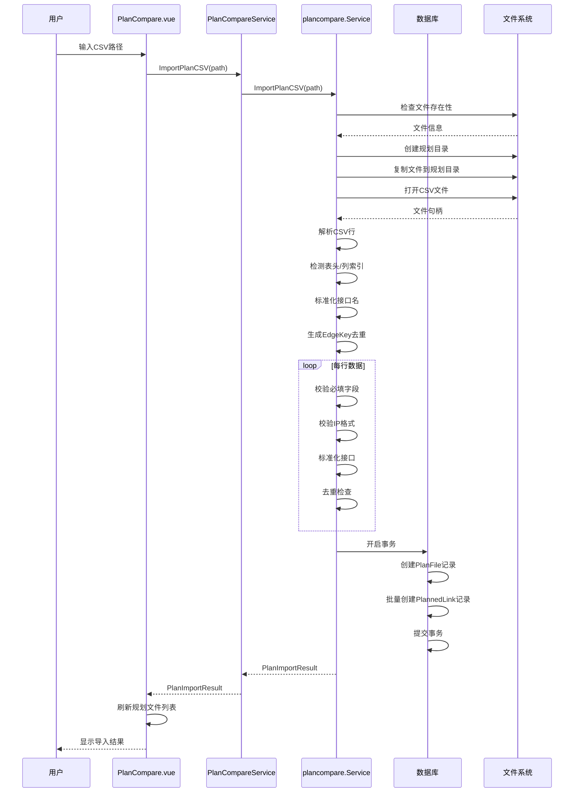
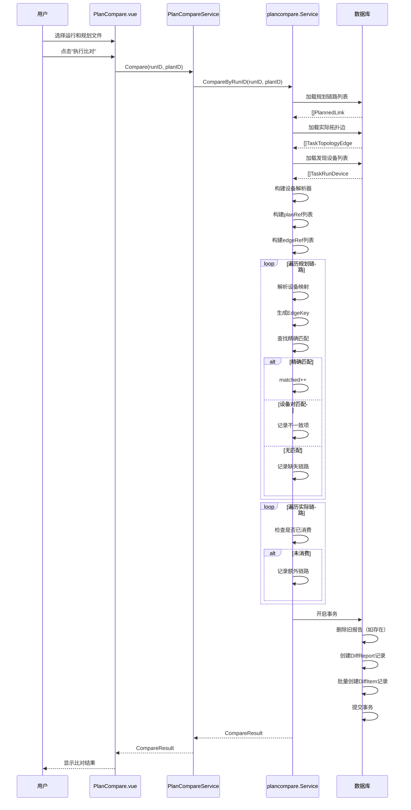
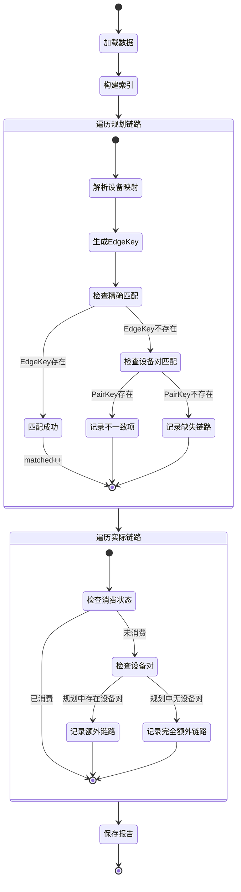
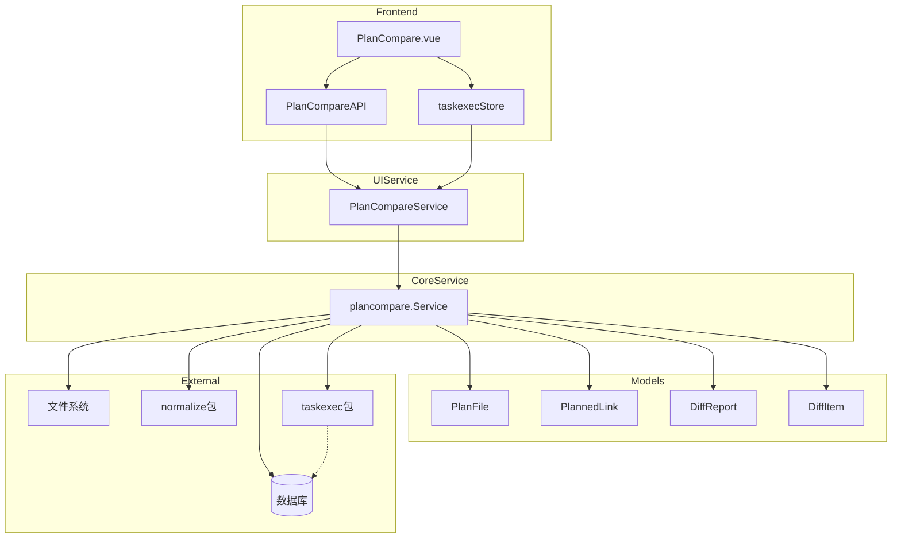

# 配置比对模块功能和逻辑说明书

## 1. 模块概述

### 1.1 整体架构

配置比对模块采用分层架构设计，主要包含以下三个层次：

```
┌─────────────────────────────────────────────────────────────────┐
│                      UI Layer (frontend/src)                     │
│  ┌─────────────────────────────────────────────────────────┐   │
│  │ PlanCompare.vue (主视图)                                  │   │
│  │ - 规划文件导入（CSV）                                      │   │
│  │ - 拓扑运行选择                                            │   │
│  │ - 规划文件选择                                            │   │
│  │ - 比对结果展示                                            │   │
│  │ - 报告导出（JSON/CSV/HTML）                                │   │
│  └─────────────────────────────────────────────────────────┘   │
└─────────────────────────────────────────────────────────────────┘
                               │
                               ▼
┌─────────────────────────────────────────────────────────────────┐
│                 Service Layer (internal/ui)                      │
│  ┌─────────────────────────────────────────────────────────┐   │
│  │ PlanCompareService                                        │   │
│  │ - Wails 服务接口封装                                       │   │
│  │ - 请求参数校验                                            │   │
│  │ - 响应数据转换                                            │   │
│  └─────────────────────────────────────────────────────────┘   │
└─────────────────────────────────────────────────────────────────┘
                               │
                               ▼
┌─────────────────────────────────────────────────────────────────┐
│              Core Layer (internal/plancompare)                    │
│  ┌─────────────────────────────────────────────────────────┐   │
│  │ Service                                                   │   │
│  │ - CSV 解析与标准化                                         │   │
│  │ - 设备映射解析                                            │   │
│  │ - 无向链路比对算法                                         │   │
│  │ - 差异分类与报告生成                                        │   │
│  └─────────────────────────────────────────────────────────┘   │
└─────────────────────────────────────────────────────────────────┘
                               │
                               ▼
┌─────────────────────────────────────────────────────────────────┐
│                 Model Layer (internal/models)                     │
│  ┌─────────────────────────────────────────────────────────┐   │
│  │ PlanFile / PlannedLink / DiffReport / DiffItem           │   │
│  │ PlanImportResult / CompareResult / DiffReportView        │   │
│  └─────────────────────────────────────────────────────────┘   │
└─────────────────────────────────────────────────────────────────┘
```

### 1.2 核心数据流说明

配置比对模块的数据流遵循单向数据流原则：

1. **导入流程**：用户输入CSV路径 → 文件复制到规划目录 → CSV解析 → 接口名标准化 → 去重处理 → 数据库持久化
2. **比对流程**：选择拓扑运行和规划文件 → 加载规划链路 → 加载实际拓扑边 → 设备映射解析 → 无向比对算法 → 差异分类 → 生成报告
3. **导出流程**：选择报告和格式 → 加载差异明细 → 格式化输出 → 返回文件路径

### 1.3 模块职责划分

| 模块 | 路径 | 主要职责 |
|------|------|----------|
| **主视图** | `frontend/src/views/PlanCompare.vue` | 页面状态管理、用户交互、结果展示 |
| **UI服务** | `internal/ui/plan_compare_service.go` | Wails服务接口、请求转发 |
| **核心服务** | `internal/plancompare/service.go` | CSV解析、比对算法、报告生成 |
| **数据模型** | `internal/models/plancompare.go` | 数据结构定义、GORM映射 |

---

## 2. 核心数据结构

### 2.1 后端数据模型

#### 2.1.1 PlanFile - 规划文件实体

```go
// 文件: internal/models/plancompare.go
type PlanFile struct {
    ID         uint      `json:"id" gorm:"primaryKey;autoIncrement"`
    FileName   string    `json:"fileName"`
    FilePath   string    `json:"filePath"`
    TotalLinks int       `json:"totalLinks"`
    Warnings   []string  `json:"warnings" gorm:"serializer:json"`
    ImportedAt time.Time `json:"importedAt"`
    CreatedAt  time.Time `json:"createdAt"`
    UpdatedAt  time.Time `json:"updatedAt"`
}
```

**字段详解**：

| 字段 | 类型 | 说明 | 数据库约束 |
|------|------|------|-----------|
| `ID` | uint | 主键 | 自增 |
| `FileName` | string | 文件名 | - |
| `FilePath` | string | 复制后的文件路径 | - |
| `TotalLinks` | int | 规划链路总数 | - |
| `Warnings` | []string | 导入警告列表 | JSON 序列化 |
| `ImportedAt` | time.Time | 导入时间 | - |

#### 2.1.2 PlannedLink - 规划链路实体

```go
// 文件: internal/models/plancompare.go
type PlannedLink struct {
    ID          uint      `json:"id" gorm:"primaryKey;autoIncrement"`
    PlanFileID  string    `json:"planFileId" gorm:"index;not null"`
    ADeviceName string    `json:"aDeviceName" gorm:"index"`
    AMgmtIP     string    `json:"aMgmtIp" gorm:"index"`
    AIf         string    `json:"aIf"`
    BDeviceName string    `json:"bDeviceName" gorm:"index"`
    BMgmtIP     string    `json:"bMgmtIp" gorm:"index"`
    BIf         string    `json:"bIf"`
    LinkType    string    `json:"linkType"` // physical / aggregate / trunk / access
    Remark      string    `json:"remark"`
    NormAIf     string    `json:"normAIf" gorm:"index"`
    NormBIf     string    `json:"normBIf" gorm:"index"`
    EdgeKey     string    `json:"edgeKey" gorm:"index"`
    CreatedAt   time.Time `json:"createdAt"`
    UpdatedAt   time.Time `json:"updatedAt"`
}
```

**字段详解**：

| 字段 | 类型 | 说明 | 用途 |
|------|------|------|------|
| `PlanFileID` | string | 所属规划文件ID | 关联查询 |
| `ADeviceName` | string | A端设备名 | 设备映射 |
| `AMgmtIP` | string | A端管理IP | 设备映射（优先） |
| `AIf` | string | A端接口（原始） | 显示 |
| `BDeviceName` | string | B端设备名 | 设备映射 |
| `BMgmtIP` | string | B端管理IP | 设备映射（优先） |
| `BIf` | string | B端接口（原始） | 显示 |
| `LinkType` | string | 链路类型 | 分类 |
| `NormAIf` | string | A端接口（标准化） | 比对匹配 |
| `NormBIf` | string | B端接口（标准化） | 比对匹配 |
| `EdgeKey` | string | 无向边唯一键 | 去重/匹配 |

**设计要点**：
- 接口名在导入时自动标准化（如 `GigabitEthernet0/1` → `GE0/1`）
- EdgeKey 采用无向设计，确保 `(A, B)` 和 `(B, A)` 生成相同键值
- 管理IP优先用于设备映射，设备名作为备选

#### 2.1.3 DiffReport - 差异报告实体

```go
// 文件: internal/models/plancompare.go
type DiffReport struct {
    ID                string    `json:"id" gorm:"primaryKey"`
    TaskID            string    `json:"taskId" gorm:"index;not null"`
    PlanFileID        string    `json:"planFileId" gorm:"index;not null"`
    TotalPlanned      int       `json:"totalPlanned"`
    TotalActual       int       `json:"totalActual"`
    Matched           int       `json:"matched"`
    MissingLinks      int       `json:"missingLinks"`
    UnexpectedLinks   int       `json:"unexpectedLinks"`
    InconsistentItems int       `json:"inconsistentItems"`
    CreatedAt         time.Time `json:"createdAt"`
    UpdatedAt         time.Time `json:"updatedAt"`
}
```

**字段详解**：

| 字段 | 类型 | 说明 |
|------|------|------|
| `ID` | string | 报告ID（格式：`diff_{UUID}`） |
| `TaskID` | string | 拓扑运行ID |
| `PlanFileID` | string | 规划文件ID |
| `TotalPlanned` | int | 规划链路总数 |
| `TotalActual` | int | 实际链路总数 |
| `Matched` | int | 完全匹配数 |
| `MissingLinks` | int | 缺失链路数 |
| `UnexpectedLinks` | int | 额外链路数 |
| `InconsistentItems` | int | 不一致项数 |

#### 2.1.4 DiffItem - 差异项实体

```go
// 文件: internal/models/plancompare.go
type DiffItem struct {
    ID          uint      `json:"id" gorm:"primaryKey;autoIncrement"`
    ReportID    string    `json:"reportId" gorm:"index;not null"`
    DiffType    string    `json:"diffType"` // missing_link / unexpected_link / interface_mismatch / ...
    ADeviceName string    `json:"aDeviceName"`
    AMgmtIP     string    `json:"aMgmtIp"`
    AIf         string    `json:"aIf"`
    BDeviceName string    `json:"bDeviceName"`
    BMgmtIP     string    `json:"bMgmtIp"`
    BIf         string    `json:"bIf"`
    ExpectedIf  string    `json:"expectedIf"`
    ActualIf    string    `json:"actualIf"`
    Reason      string    `json:"reason"`
    Evidence    []string  `json:"evidence" gorm:"serializer:json"`
    CreatedAt   time.Time `json:"createdAt"`
    UpdatedAt   time.Time `json:"updatedAt"`
}
```

**差异类型分类**：

| DiffType | 说明 | 严重程度 |
|----------|------|----------|
| `missing_link` | 规划中存在但实际拓扑中未发现 | 高 |
| `device_mismatch` | 设备无法唯一映射 | 高 |
| `unexpected_link` | 实际拓扑中存在但规划中未声明 | 中 |
| `one_side_only` | 单向发现的链路 | 中 |
| `interface_mismatch` | 设备对匹配但接口不一致 | 低 |
| `aggregate_mismatch` | 聚合口成员不一致 | 低 |

### 2.2 视图模型

#### 2.2.1 PlanImportResult - 导入结果

```go
// 文件: internal/models/plancompare.go
type PlanImportResult struct {
    PlanFileID string   `json:"planFileId"`
    TotalLinks int      `json:"totalLinks"`
    Warnings   []string `json:"warnings,omitempty"`
}
```

#### 2.2.2 CompareResult - 比对结果

```go
// 文件: internal/models/plancompare.go
type CompareResult struct {
    ReportID          string     `json:"reportId"`
    TotalPlanned      int        `json:"totalPlanned"`
    TotalActual       int        `json:"totalActual"`
    Matched           int        `json:"matched"`
    MissingLinks      []DiffItem `json:"missingLinks"`
    UnexpectedLinks   []DiffItem `json:"unexpectedLinks"`
    InconsistentItems []DiffItem `json:"inconsistentItems"`
}
```

### 2.3 前端数据结构

#### 2.3.1 组件状态

```typescript
// 文件: frontend/src/views/PlanCompare.vue
const importPath = ref("")           // CSV导入路径
const importing = ref(false)         // 导入中状态
const comparing = ref(false)          // 比对中状态
const selectedPlanID = ref("")        // 选中的规划文件ID
const selectedRunId = ref("")         // 选中的拓扑运行ID
const plans = ref<PlanUploadView[]>([])  // 规划文件列表
const compareResult = ref<CompareResult>({
  reportId: "",
  totalPlanned: 0,
  totalActual: 0,
  matched: 0,
  missingLinks: [],
  unexpectedLinks: [],
  inconsistentItems: [],
})
```

---

## 3. 工作流程

### 3.1 规划文件导入流程



### 3.2 比对执行流程



### 3.3 核心比对算法



### 3.4 核心函数逻辑说明

#### 3.4.1 CSV解析函数 [`parsePlanRows()`](internal/plancompare/service.go:576)

**功能**：解析CSV行数据为规划链路列表

**处理流程**：
1. 检测表头行，识别列索引（支持多种列名格式）
2. 遍历数据行，提取设备名、管理IP、接口等信息
3. 校验必填字段（设备名、接口）
4. 校验IP格式有效性
5. 标准化接口名（调用 [`normalize.NormalizeInterfaceName()`](internal/normalize/normalize.go)）
6. 生成无向EdgeKey进行去重
7. 返回链路列表和警告信息

**支持的列名格式**：
| 标准列名 | 支持的别名 |
|----------|-----------|
| 本端设备名 | 本端设备、A设备、A设备名 |
| 本端管理IP | 本端IP、A管理IP |
| 本端接口 | A接口 |
| 对端设备名 | 对端设备、B设备、B设备名 |
| 对端管理IP | 对端IP、B管理IP |
| 对端接口 | B接口 |

#### 3.4.2 设备解析器 [`deviceResolver`](internal/plancompare/service.go:710)

**功能**：将规划中的设备标识映射到实际发现的设备

**数据结构**：
```go
type deviceResolver struct {
    byMgmtIP map[string]TaskRunDevice  // 按管理IP索引
    byName   map[string][]TaskRunDevice // 按设备名索引（可能多个）
}
```

**解析逻辑** [`resolve()`](internal/plancompare/service.go:732)：
1. 优先使用管理IP精确匹配
2. 若IP无匹配，使用标准化设备名匹配
3. 返回设备ID、是否未解析、是否歧义

#### 3.4.3 无向键生成 [`makeUndirectedEndpointKey()`](internal/plancompare/service.go:833)

**功能**：生成无向边的唯一标识键

**算法**：
```
输入: aDevice, aIf, bDevice, bIf
1. 格式化端点: left = "{aDevice}:{aIf}", right = "{bDevice}:{bIf}"
2. 字典序排序: [left, right] -> sorted
3. 拼接: key = sorted[0] + "<->" + sorted[1]
输出: 无向EdgeKey
```

**示例**：
- 输入：`SW1:GE0/1`, `SW2:GE0/2`
- 输出：`SW1:GE0/1<->SW2:GE0/2`（与 `SW2:GE0/2<->SW1:GE0/1` 相同）

#### 3.4.4 比对主函数 [`CompareByRunID()`](internal/plancompare/service.go:141)

**核心逻辑**：

1. **数据加载**：
   - 加载规划链路（`planned_links` 表）
   - 加载实际拓扑边（`task_topology_edges` 表）
   - 加载发现设备（`task_run_devices` 表）

2. **索引构建**：
   - `plannedRefs`: 规划链路引用列表
   - `actualByKey`: 按EdgeKey索引的实际链路
   - `actualByPair`: 按设备对索引的实际链路
   - `plannedByPair`: 按设备对索引的规划链路

3. **匹配循环**：
   ```go
   for _, p := range plannedRefs {
       // 优先精确匹配
       if refs := actualByKey[p.EdgeKey]; len(refs) > 0 {
           matched++
           continue
       }
       // 次级设备对匹配
       if refs := actualByPair[p.PairKey]; len(refs) > 0 {
           // 寻找未消费的边
           // 记录不一致项
       }
       // 无匹配，记录缺失
   }
   ```

4. **额外链路检测**：
   ```go
   for _, a := range actualRefs {
       if _, used := usedActualKeys[a.EdgeKey]; used {
           continue
       }
       // 检查是否属于已规划设备对
       // 记录额外链路
   }
   ```

---

## 4. 模块间交互关系

### 4.1 依赖关系图



### 4.2 调用链示例

#### 4.2.1 导入规划文件

```
PlanCompare.vue:importPlan()
  └─> PlanCompareAPI.importPlanCSV(path)
        └─> PlanCompareService.ImportPlanCSV(ctx, path)
              └─> plancompare.Service.ImportPlanCSV(path)
                    ├─> os.Stat(path)                    // 检查文件
                    ├─> copyImportedFile(path)            // 复制文件
                    ├─> csv.NewReader(f).ReadAll()        // 读取CSV
                    ├─> parsePlanRows(rows)               // 解析行
                    │     ├─> detectPlanHeader()          // 检测表头
                    │     ├─> normalize.NormalizeInterfaceName()  // 标准化
                    │     └─> makeUndirectedEndpointKey() // 生成键
                    └─> db.Transaction()                  // 保存数据
                          ├─> tx.Create(&plan)
                          └─> tx.Create(&links)
```

#### 4.2.2 执行比对

```
PlanCompare.vue:compareNow()
  └─> PlanCompareAPI.compare(runId, planId)
        └─> PlanCompareService.Compare(ctx, runId, planId)
              └─> plancompare.Service.CompareByRunID(runId, planId)
                    ├─> db.Where("plan_file_id = ?", planId).Find(&plans)
                    ├─> db.Where("task_run_id = ?", runId).Find(&edges)
                    ├─> db.Where("task_run_id = ?", runId).Find(&devices)
                    ├─> newDeviceResolver(devices)
                    ├─> buildPlanRef() / buildEdgeRef()
                    ├─> 比对算法循环
                    └─> db.Transaction() 保存报告
                          ├─> tx.Create(&report)
                          └─> tx.Create(&items)
```

### 4.3 数据依赖

| 数据表 | 依赖模块 | 用途 |
|--------|----------|------|
| `plan_files` | 配置比对 | 存储导入的规划文件元数据 |
| `planned_links` | 配置比对 | 存储规划链路详情 |
| `diff_reports` | 配置比对 | 存储比对报告摘要 |
| `diff_items` | 配置比对 | 存储差异明细 |
| `task_topology_edges` | 任务执行 | 读取实际拓扑边 |
| `task_run_devices` | 任务执行 | 读取发现的设备信息 |
| `task_runs` | 任务执行 | 读取运行历史 |

---

## 5. 总结表格

### 5.1 功能清单

| 功能 | 入口函数 | 说明 |
|------|----------|------|
| 导入规划CSV | [`ImportPlanCSV()`](internal/plancompare/service.go:64) | 解析CSV、标准化、去重、持久化 |
| 列出规划文件 | [`ListPlanFiles()`](internal/plancompare/service.go:40) | 分页查询已导入文件 |
| 执行比对 | [`CompareByRunID()`](internal/plancompare/service.go:141) | 无向链路比对算法 |
| 获取报告摘要 | [`GetDiffReport()`](internal/plancompare/service.go:355) | 返回报告统计信息 |
| 获取报告明细 | [`GetCompareResult()`](internal/plancompare/service.go:384) | 返回完整差异列表 |
| 导出报告 | [`ExportDiffReport()`](internal/plancompare/service.go:414) | JSON/CSV/HTML格式导出 |

### 5.2 关键设计决策

| 决策点 | 选择 | 原因 |
|--------|------|------|
| 链路匹配策略 | 无向匹配 | 网络链路无方向性，规划中A-B与实际B-A应视为匹配 |
| 设备映射优先级 | 管理IP > 设备名 | 管理IP唯一性更强，设备名可能重复 |
| 接口标准化 | 导入时标准化 | 提前处理减少比对时计算量 |
| 去重策略 | EdgeKey去重 | 避免规划文件中重复链路干扰比对 |
| 报告存储 | 独立表存储 | 支持历史报告查询和对比分析 |

### 5.3 扩展点

| 扩展方向 | 当前实现 | 扩展建议 |
|----------|----------|----------|
| 导入格式 | 仅CSV | 可扩展支持Excel、JSON格式 |
| 比对维度 | 仅链路级 | 可扩展设备级、配置级比对 |
| 报告格式 | JSON/CSV/HTML | 可扩展PDF、Word格式 |
| 差异分析 | 静态报告 | 可扩展趋势分析、差异可视化 |
