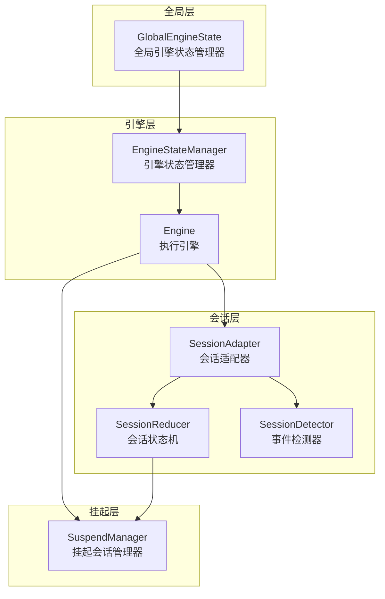
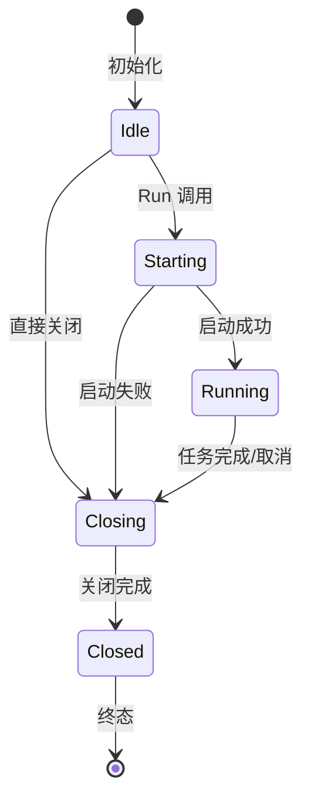
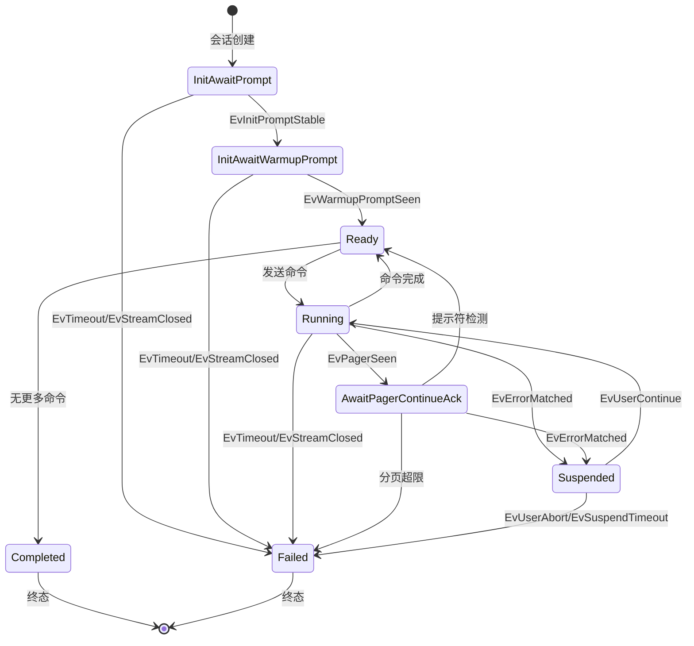
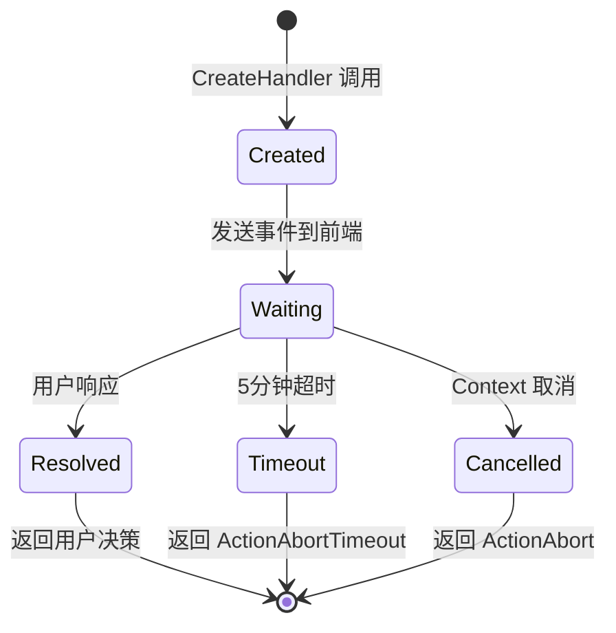
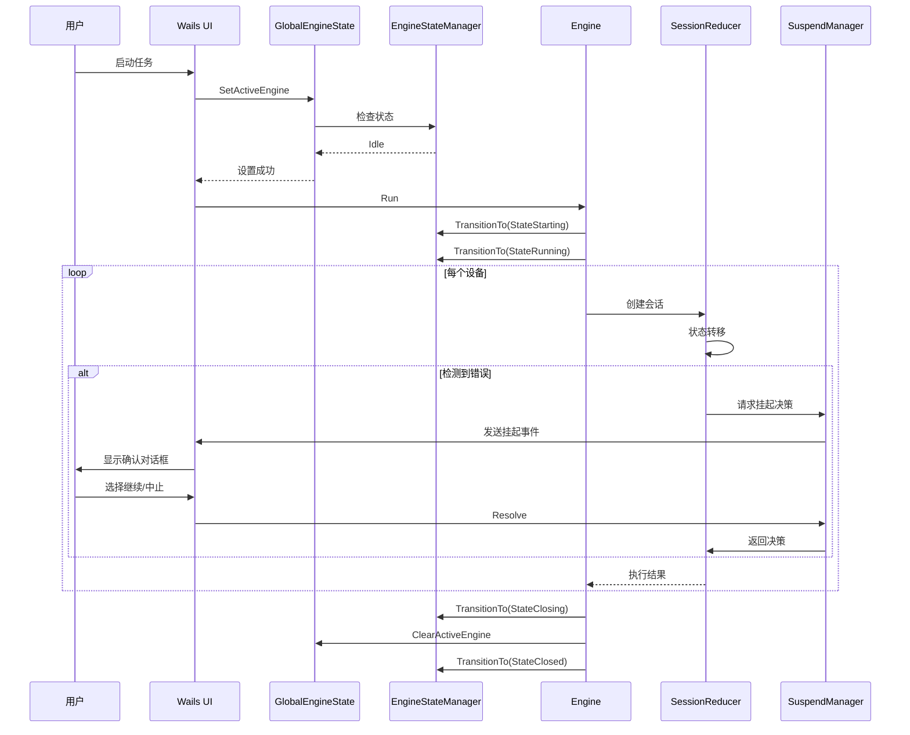

# NetWeaverGo 状态机运行逻辑检查指导书

## 文档概述

本文档用于指导检查 NetWeaverGo 项目中所有状态机在多种情况下是否能正常运行、闭环，避免状态机卡死、死锁的情况出现。

---

## 一、状态机架构总览

NetWeaverGo 项目包含 **4 个核心状态机组件**，它们协同工作以完成网络设备的自动化执行任务：



---

## 二、EngineStateManager 引擎状态管理器检查

### 2.1 状态定义

| 状态            | 名称   | 说明                   |
| --------------- | ------ | ---------------------- |
| `StateIdle`     | 空闲   | 引擎初始状态，未启动   |
| `StateStarting` | 启动中 | 引擎正在初始化         |
| `StateRunning`  | 运行中 | 引擎正在执行任务       |
| `StateClosing`  | 关闭中 | 引擎正在优雅关闭       |
| `StateClosed`   | 已关闭 | 引擎已完全关闭（终态） |

### 2.2 状态转移矩阵



**合法转移规则**（定义于 [`stateTransitionMatrix`](internal/engine/engine_state.go:39)）：

| From     | To       | 允许            |
| -------- | -------- | --------------- |
| Idle     | Starting | ✅              |
| Idle     | Closing  | ✅              |
| Starting | Running  | ✅              |
| Starting | Closing  | ✅              |
| Running  | Closing  | ✅              |
| Closing  | Closed   | ✅              |
| Closed   | \*       | ❌ 终态不可转移 |

### 2.3 检查清单

#### ✅ 状态转移闭环检查

| 检查项       | 预期结果                                     | 验证方法                                       |
| ------------ | -------------------------------------------- | ---------------------------------------------- |
| 正常启动路径 | Idle → Starting → Running → Closing → Closed | 运行 `TestEngineStateTransitionsWithoutPaused` |
| 异常启动路径 | Idle → Starting → Closing → Closed           | 模拟启动失败场景                               |
| 直接关闭路径 | Idle → Closing → Closed                      | 不启动直接关闭                                 |
| 终态不可转移 | Closed 状态下任何转移都返回错误              | 尝试从 Closed 转移到其他状态                   |

#### ✅ 并发安全检查

| 检查项       | 风险等级 | 验证方法                                   |
| ------------ | -------- | ------------------------------------------ |
| 状态读取竞态 | 低       | 使用 `sync.RWMutex` 保护，读操作用 `RLock` |
| 状态写入竞态 | 中       | 写操作用 `Lock`，确保原子性                |
| TOCTOU 问题  | 低       | `TransitionTo` 方法内持锁检查并转移        |

#### ✅ 潜在死锁场景

| 场景       | 风险 | 缓解措施                                     |
| ---------- | ---- | -------------------------------------------- |
| 重复关闭   | 低   | `closeOnce sync.Once` 保证只关闭一次         |
| 关闭时阻塞 | 中   | `emitWg.Wait()` 等待事件发送完成后再关闭通道 |

### 2.4 测试用例参考

```go
// 文件: internal/engine/engine_state_test.go

func TestEngineStateTransitionsWithoutPaused(t *testing.T) {
    sm := NewEngineStateManager()

    // 验证正常转移路径
    if err := sm.TransitionTo(StateStarting); err != nil {
        t.Fatalf("Idle -> Starting 应成功: %v", err)
    }
    if err := sm.TransitionTo(StateRunning); err != nil {
        t.Fatalf("Starting -> Running 应成功: %v", err)
    }
    if err := sm.TransitionTo(StateClosing); err != nil {
        t.Fatalf("Running -> Closing 应成功: %v", err)
    }
    if err := sm.TransitionTo(StateClosed); err != nil {
        t.Fatalf("Closing -> Closed 应成功: %v", err)
    }
}
```

---

## 三、SessionReducer 会话状态机检查

### 3.1 状态定义

| 状态                              | 名称               | 说明                       |
| --------------------------------- | ------------------ | -------------------------- |
| `NewStateInitAwaitPrompt`         | 等待初始提示符     | 会话刚建立，等待设备提示符 |
| `NewStateInitAwaitWarmupPrompt`   | 等待预热后提示符   | 已发送预热空行，等待提示符 |
| `NewStateReady`                   | 就绪               | 可以发送下一条命令         |
| `NewStateRunning`                 | 命令执行中         | 命令已发送，等待输出       |
| `NewStateAwaitPagerContinueAck`   | 等待分页续页确认   | 检测到分页符，已发送空格   |
| `NewStateAwaitFinalPromptConfirm` | 等待最终提示符确认 | 等待二次提示符确认         |
| `NewStateSuspended`               | 挂起               | 检测到错误，等待用户决策   |
| `NewStateCompleted`               | 完成               | 所有命令执行成功（终态）   |
| `NewStateFailed`                  | 失败               | 执行失败（终态）           |

### 3.2 状态转移图



### 3.3 事件类型

| 事件                 | 触发条件         | 产生动作                    |
| -------------------- | ---------------- | --------------------------- |
| `EvInitPromptStable` | 初始提示符稳定   | `ActSendWarmup`             |
| `EvWarmupPromptSeen` | 预热后提示符检测 | `ActSendCommand`            |
| `EvCommittedLine`    | 行提交           | 处理待处理行                |
| `EvPagerSeen`        | 分页符检测       | `ActSendPagerContinue`      |
| `EvActivePromptSeen` | 活动行提示符检测 | 完成当前命令                |
| `EvErrorMatched`     | 错误规则命中     | `ActRequestSuspendDecision` |
| `EvTimeout`          | 命令超时         | `ActAbortSession`           |
| `EvUserContinue`     | 用户选择继续     | `ActResetReadTimeout`       |
| `EvUserAbort`        | 用户选择中止     | `ActAbortSession`           |
| `EvSuspendTimeout`   | 挂起超时         | `ActAbortSession`           |
| `EvStreamClosed`     | 流关闭           | `ActAbortSession`           |

### 3.4 检查清单

#### ✅ 状态转移闭环检查

| 检查项       | 预期结果                                                    | 验证方法             |
| ------------ | ----------------------------------------------------------- | -------------------- |
| 正常执行路径 | InitAwaitPrompt → Ready → Running → Ready → ... → Completed | 模拟正常命令执行流程 |
| 分页处理路径 | Running → AwaitPagerContinueAck → Ready                     | 模拟分页输出         |
| 错误恢复路径 | Running → Suspended → Running                               | 模拟错误后用户继续   |
| 错误中止路径 | Running → Suspended → Failed                                | 模拟错误后用户中止   |
| 超时路径     | \* → Failed                                                 | 模拟超时场景         |
| 流关闭路径   | \* → Failed                                                 | 模拟 SSH 断开        |

#### ✅ 终态可达性检查

| 初始状态        | 终态      | 可达路径             |
| --------------- | --------- | -------------------- |
| InitAwaitPrompt | Completed | 正常执行所有命令     |
| InitAwaitPrompt | Failed    | 超时/错误中止/流关闭 |

#### ✅ 潜在卡死场景

| 场景              | 风险 | 缓解措施                             | 验证方法                   |
| ----------------- | ---- | ------------------------------------ | -------------------------- |
| 提示符未检测      | 高   | 超时机制 + 多种提示符匹配模式        | 模拟无提示符输出           |
| 分页无限循环      | 中   | `MaxPaginationCount` 限制（默认100） | 模拟无限分页输出           |
| 挂起无响应        | 高   | `SuspendManager` 5分钟超时           | 模拟用户不响应             |
| pendingLines 堆积 | 中   | 状态转移时消费待处理行               | 检查 `processPendingLines` |

#### ✅ 不变量检查

```go
// 关键不变量：pendingLines 非空时不发送命令
func (r *SessionReducer) trySendCommand() []SessionAction {
    if r.ctx.HasPendingLines() {
        logger.Debug("SessionReducer", "-", "防串台门禁：存在 %d 行未消费输出，禁止发送新命令", len(r.ctx.PendingLines))
        return nil
    }
    // ...
}
```

### 3.5 测试用例参考

```go
// 文件: internal/executor/session_reducer_test.go

func TestSessionReducer_NormalFlow(t *testing.T) {
    // 测试正常执行流程
    reducer := NewSessionReducer([]string{"display version"}, mockMatcher)

    // 初始状态
    if reducer.State() != NewStateInitAwaitPrompt {
        t.Fatalf("初始状态应为 InitAwaitPrompt")
    }

    // 模拟提示符稳定
    actions := reducer.Reduce(EvInitPromptStable{Prompt: "<switch>"})
    if reducer.State() != NewStateInitAwaitWarmupPrompt {
        t.Fatalf("应为 InitAwaitWarmupPrompt")
    }

    // ... 继续模拟
}

func TestSessionReducer_TimeoutPath(t *testing.T) {
    // 测试超时路径
    reducer := NewSessionReducer([]string{"display version"}, mockMatcher)
    reducer.state = NewStateRunning

    actions := reducer.Reduce(EvTimeout{CommandIndex: 0})
    if reducer.State() != NewStateFailed {
        t.Fatalf("超时应进入 Failed 状态")
    }
}
```

---

## 四、GlobalEngineState 全局状态管理检查

### 4.1 职责说明

`GlobalEngineState` 是全局单例，负责：

- 管理当前活动的 `Engine` 实例引用
- 防止多个任务同时运行引擎
- 提供运行状态查询接口

### 4.2 检查清单

#### ✅ 单例模式检查

| 检查项         | 预期结果                            | 验证方法         |
| -------------- | ----------------------------------- | ---------------- |
| 单例唯一性     | `GetGlobalState()` 始终返回同一实例 | 多次调用比较指针 |
| 线程安全初始化 | `sync.Once` 保证只初始化一次        | 并发调用测试     |

#### ✅ 引擎互斥检查

| 检查项     | 风险 | 验证方法                                          |
| ---------- | ---- | ------------------------------------------------- |
| 重复启动   | 中   | `SetActiveEngine` 检查 `activeEngine.IsRunning()` |
| 状态不一致 | 低   | 委托给 `Engine.State()` 获取实时状态              |

#### ✅ 潜在死锁场景

| 场景       | 风险 | 缓解措施                 |
| ---------- | ---- | ------------------------ |
| 锁嵌套     | 低   | 内部锁不调用外部锁       |
| 长时间持锁 | 低   | 只在必要时持锁，快速释放 |

### 4.3 状态查询 API

```go
// 获取全局状态
func GetGlobalState() *GlobalEngineState

// 设置活动引擎
func (g *GlobalEngineState) SetActiveEngine(engine *Engine, runnerSrc, runnerID string) error

// 清除活动引擎
func (g *GlobalEngineState) ClearActiveEngine()

// 检查是否运行中
func (g *GlobalEngineState) IsRunning() bool

// 获取引擎状态
func (g *GlobalEngineState) GetEngineState() EngineState

// 获取运行来源
func (g *GlobalEngineState) GetRunnerSource() string
```

---

## 五、SuspendManager 挂起会话管理检查

### 5.1 职责说明

`SuspendManager` 负责管理错误/超时挂起的会话：

- 创建挂起会话并等待用户决策
- 处理用户响应（继续/中止）
- 超时自动中止

### 5.2 挂起会话生命周期



### 5.3 检查清单

#### ✅ 会话生命周期检查

| 检查项     | 预期结果                     | 验证方法                                                     |
| ---------- | ---------------------------- | ------------------------------------------------------------ |
| 会话创建   | 正确记录 sessionID 和 IP     | 检查 `sessions` 和 `sessionsByIP` 映射                       |
| 会话清理   | defer 确保会话被清理         | 运行 `TestSuspendManager_ConcurrentFinishAndResolve_NoPanic` |
| 旧会话清理 | 同一 IP 新会话自动清理旧会话 | 模拟同一 IP 连续创建会话                                     |

#### ✅ 并发安全检查

| 检查项     | 风险 | 缓解措施                        | 验证方法                                               |
| ---------- | ---- | ------------------------------- | ------------------------------------------------------ |
| 重复响应   | 中   | `resolved atomic.Bool` 防止重复 | 运行 `TestSuspendManager_ResolveAfterFinish_IsIgnored` |
| 超时后响应 | 中   | `timedOut atomic.Bool` 防止     | 模拟超时后前端响应                                     |
| 结束后响应 | 中   | `finished atomic.Bool` 防止     | 模拟会话结束后响应                                     |

#### ✅ 超时机制检查

| 检查项       | 预期结果                               | 验证方法         |
| ------------ | -------------------------------------- | ---------------- |
| 5分钟超时    | 自动返回 `ActionAbortTimeout`          | 模拟长时间无响应 |
| 超时事件发送 | 前端收到 `engine:suspend_timeout` 事件 | 检查事件发送     |

### 5.4 测试用例参考

```go
// 文件: internal/ui/suspend_manager_test.go

func TestSuspendManager_ConcurrentFinishAndResolve_NoPanic(t *testing.T) {
    // 测试并发场景下不会 panic
    m := &SuspendManager{
        sessions:     make(map[string]*SuspendSession),
        sessionsByIP: make(map[string]string),
    }

    handler := m.CreateHandler()
    ctx, cancel := context.WithCancel(context.Background())
    defer cancel()

    // ... 并发测试逻辑
}

func TestSuspendManager_ResolveAfterFinish_IsIgnored(t *testing.T) {
    // 测试结束后响应被忽略
    session := &SuspendSession{
        ID:       "finished-session",
        IP:       "192.168.1.2",
        ActionCh: make(chan executor.ErrorAction, 1),
    }
    session.finished.Store(true)

    m.Resolve(session.ID, "C")

    select {
    case <-session.ActionCh:
        t.Fatal("finished 会话不应再收到动作")
    default:
    }
}
```

---

## 六、跨组件交互检查

### 6.1 组件交互流程



### 6.2 跨组件检查清单

#### ✅ 状态一致性检查

| 检查项                         | 风险 | 验证方法                         |
| ------------------------------ | ---- | -------------------------------- |
| GES 与 ESM 状态不一致          | 低   | GES 委托给 Engine.State()        |
| Engine 关闭时 Session 仍在运行 | 中   | Context 取消传播到所有 goroutine |
| SuspendManager 会话泄漏        | 中   | 检查会话清理逻辑                 |

#### ✅ Context 传播检查

| 检查项                            | 预期结果                      | 验证方法          |
| --------------------------------- | ----------------------------- | ----------------- |
| Engine 取消传播到 Worker          | 所有 Worker 收到取消信号      | 模拟 Engine 取消  |
| Worker 取消传播到 Session         | Session 正确处理 `ctx.Done()` | 模拟 Worker 取消  |
| Session 取消传播到 SuspendManager | 挂起会话返回 `ActionAbort`    | 模拟 Session 取消 |

#### ✅ 通道关闭顺序检查

| 顺序 | 操作                 | 说明             |
| ---- | -------------------- | ---------------- |
| 1    | `cancel()`           | 取消 Context     |
| 2    | `emitWg.Wait()`      | 等待事件发送完成 |
| 3    | `close(EventBus)`    | 关闭内部事件通道 |
| 4    | `close(FrontendBus)` | 关闭外部事件通道 |

---

## 七、常见问题诊断指南

### 7.1 状态机卡死诊断

| 症状                 | 可能原因       | 诊断方法                          | 解决方案                       |
| -------------------- | -------------- | --------------------------------- | ------------------------------ |
| 引擎一直显示 Running | 状态转移失败   | 检查 `EngineStateManager.State()` | 检查 `TransitionTo` 返回的错误 |
| 会话无响应           | 提示符未检测   | 检查 `SessionReducer.State()`     | 检查 matcher 配置              |
| 挂起无响应           | 用户决策未到达 | 检查 `SuspendManager.sessions`    | 检查前端事件处理               |

### 7.2 死锁诊断

| 症状               | 可能原因         | 诊断方法                | 解决方案             |
| ------------------ | ---------------- | ----------------------- | -------------------- |
| 程序完全无响应     | 锁嵌套           | 使用 pprof goroutine    | 检查锁调用链         |
| 通道阻塞           | 无消费者或通道满 | 检查通道缓冲区大小      | 增加缓冲区或添加超时 |
| WaitGroup 永远等待 | Done 未调用      | 检查 goroutine 退出路径 | 确保 defer wg.Done() |

### 7.3 状态泄漏诊断

| 症状           | 可能原因                 | 诊断方法                 | 解决方案             |
| -------------- | ------------------------ | ------------------------ | -------------------- |
| 挂起会话未清理 | defer 未执行             | 检查 `sessions` 映射大小 | 确保 defer 正确放置  |
| 引擎状态未重置 | ClearActiveEngine 未调用 | 检查 `GlobalEngineState` | 确保关闭路径调用清理 |

---

## 八、自动化测试建议

### 8.1 单元测试覆盖

```go
// 每个状态机应至少包含以下测试：

// 1. 正常状态转移测试
func TestXxx_NormalTransitions(t *testing.T)

// 2. 非法状态转移测试
func TestXxx_InvalidTransitions(t *testing.T)

// 3. 终态可达性测试
func TestXxx_TerminalStateReachable(t *testing.T)

// 4. 并发安全测试
func TestXxx_ConcurrentAccess(t *testing.T)

// 5. 超时处理测试
func TestXxx_TimeoutHandling(t *testing.T)
```

### 8.2 集成测试覆盖

```go
// 跨组件集成测试：

// 1. 完整执行流程测试
func TestIntegration_FullExecutionFlow(t *testing.T)

// 2. 错误恢复流程测试
func TestIntegration_ErrorRecoveryFlow(t *testing.T)

// 3. 取消传播测试
func TestIntegration_CancellationPropagation(t *testing.T)

// 4. 并发执行测试
func TestIntegration_ConcurrentExecution(t *testing.T)
```

### 8.3 压力测试

```go
// 压力测试场景：

// 1. 大量设备并发
func TestStress_ManyDevices(t *testing.T)

// 2. 大量命令执行
func TestStress_ManyCommands(t *testing.T)

// 3. 频繁挂起恢复
func TestStress_FrequentSuspend(t *testing.T)

// 4. 长时间运行
func TestStress_LongRunning(t *testing.T)
```

---

## 九、检查执行模板

### 9.1 日常检查清单

```markdown
## 状态机运行逻辑检查清单

日期：\_**\_年**月**日
检查人：**\_\_\_\_****

### EngineStateManager

- [ ] 正常启动路径测试通过
- [ ] 异常启动路径测试通过
- [ ] 终态不可转移验证通过
- [ ] 并发安全测试通过

### SessionReducer

- [ ] 正常执行路径测试通过
- [ ] 分页处理路径测试通过
- [ ] 错误恢复路径测试通过
- [ ] 超时路径测试通过
- [ ] 终态可达性验证通过

### GlobalEngineState

- [ ] 单例唯一性验证通过
- [ ] 引擎互斥验证通过
- [ ] 状态一致性验证通过

### SuspendManager

- [ ] 会话生命周期测试通过
- [ ] 并发安全测试通过
- [ ] 超时机制验证通过

### 跨组件交互

- [ ] Context 传播验证通过
- [ ] 通道关闭顺序验证通过
- [ ] 状态一致性验证通过

### 问题记录

| 问题描述 | 严重程度 | 状态 | 备注 |
| -------- | -------- | ---- | ---- |
|          |          |      |      |
```

### 9.2 版本发布前检查

在每次版本发布前，应执行以下完整检查：

1. **运行所有单元测试**

   ```bash
   go test ./internal/engine/... ./internal/executor/... ./internal/ui/... -v
   ```

2. **运行集成测试**

   ```bash
   go test ./... -tags=integration -v
   ```

3. **检查竞态条件**

   ```bash
   go test -race ./...
   ```

4. **检查代码覆盖率**
   ```bash
   go test -cover ./internal/engine/... ./internal/executor/...
   ```

---

## 十、附录

### A. 状态机代码位置索引

| 组件               | 文件路径                                | 关键结构/函数                                |
| ------------------ | --------------------------------------- | -------------------------------------------- |
| EngineStateManager | `internal/engine/engine_state.go`       | `EngineStateManager`, `TransitionTo`         |
| SessionReducer     | `internal/executor/session_reducer.go`  | `SessionReducer`, `Reduce`                   |
| SessionState       | `internal/executor/session_types.go`    | `NewSessionState`, `SessionEvent`            |
| SessionAdapter     | `internal/executor/session_adapter.go`  | `SessionAdapter`, `FeedSessionActions`       |
| SessionDetector    | `internal/executor/session_detector.go` | `SessionDetector`, `Detect`                  |
| GlobalEngineState  | `internal/engine/global_state.go`       | `GlobalEngineState`, `SetActiveEngine`       |
| SuspendManager     | `internal/ui/suspend_manager.go`        | `SuspendManager`, `CreateHandler`, `Resolve` |

### B. 相关测试文件索引

| 测试文件                                    | 测试内容                    |
| ------------------------------------------- | --------------------------- |
| `internal/engine/engine_state_test.go`      | EngineStateManager 状态转移 |
| `internal/executor/session_reducer_test.go` | SessionReducer 状态转移     |
| `internal/executor/session_adapter_test.go` | SessionAdapter 集成         |
| `internal/executor/stream_engine_test.go`   | StreamEngine 执行流程       |
| `internal/ui/suspend_manager_test.go`       | SuspendManager 并发安全     |

### C. 状态转移完整矩阵

#### EngineStateManager

```
           → Idle  Starting  Running  Closing  Closed
Idle        -       ✓         ✗        ✓        ✗
Starting    ✗       -         ✓        ✓        ✗
Running     ✗       ✗         -        ✓        ✗
Closing     ✗       ✗         ✗        -        ✓
Closed      ✗       ✗         ✗        ✗        -
```

#### SessionReducer

```
状态                      可转移目标
InitAwaitPrompt          → InitAwaitWarmupPrompt, Failed
InitAwaitWarmupPrompt    → Ready, Failed
Ready                    → Running, Completed
Running                  → Ready, AwaitPagerContinueAck, Suspended, Failed
AwaitPagerContinueAck    → Ready, Suspended, Failed
Suspended                → Running, Failed
Completed                → (终态)
Failed                   → (终态)
```

---

## 文档版本

| 版本 | 日期       | 作者      | 变更说明 |
| ---- | ---------- | --------- | -------- |
| 1.0  | 2026-03-23 | Architect | 初始版本 |

---

> **注意**：本文档应随状态机代码变更同步更新。每次修改状态机逻辑后，请检查相关检查项是否仍然适用。
