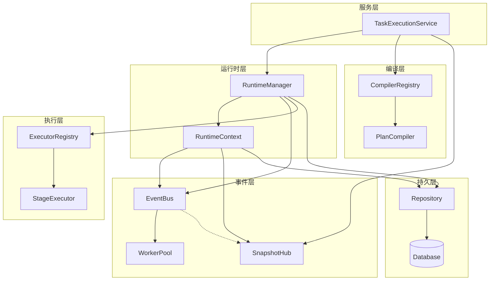
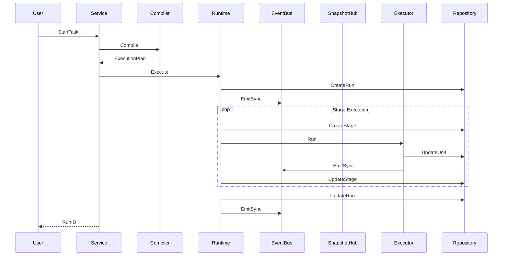
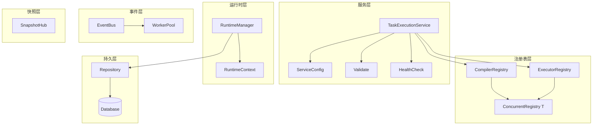
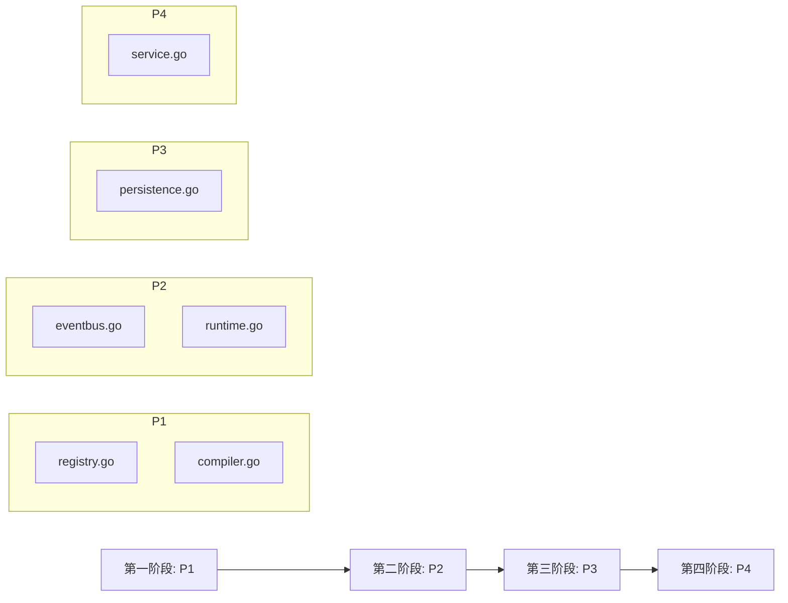

# NetWeaverGo 逻辑问题修复方案（审计优化版）

> 本方案针对 [`逻辑问题.md`](docs/逻辑问题.md) 中列出的 11 个问题，提供经过审计优化的架构级修复方案
>
> **设计原则**：
>
> - 新建项目，无需考虑历史兼容性
> - 全局架构视角，避免局部打补丁
> - 统一的并发安全模型
> - 清晰的组件职责边界
> - **简洁优先**：避免过度设计
> - **可观测性**：内置监控指标

---

## 一、项目架构概述

### 1.1 核心模块关系图



### 1.2 数据流架构



### 1.3 问题分类与影响范围

| 分类         | 问题编号           | 影响范围                | 核心问题                      | 修复优先级 |
| ------------ | ------------------ | ----------------------- | ----------------------------- | ---------- |
| **并发安全** | 001, 009           | runtime.go, compiler.go | 竞态条件、无锁设计            | P1         |
| **事件系统** | 003, 004, 005, 012 | eventbus.go             | 事件丢失、goroutine泄漏、阻塞 | P2         |
| **快照系统** | 007, 008, 013, 014 | runtime.go, eventbus.go | 数据一致性、空实现、循环依赖  | P3         |
| **初始化**   | 011                | service.go              | 注册顺序依赖                  | P4         |

---

## 二、统一架构设计原则

### 2.1 核心设计原则

1. **单一职责原则**：每个组件只负责一个明确的功能
2. **依赖注入**：通过构造函数注入依赖，避免循环依赖
3. **接口隔离**：定义清晰的接口边界
4. **并发安全**：统一使用读写锁和原子操作
5. **错误处理**：明确的错误传播和处理机制
6. **简洁优先**：避免过度设计，选择最简单的可行方案
7. **可观测性**：内置监控指标，支持 Prometheus 导出

### 2.2 统一并发安全模型

```go
// 模式1：RWMutex + 防御性拷贝（推荐）
type SafeMap[K comparable, V any] struct {
    mu   sync.RWMutex
    data map[K]V
}

// 模式2：原子操作（计数器等简单场景）
type SafeCounter struct {
    value atomic.Int64
}

// 模式3：Channel通信（复杂状态机）
type Actor struct {
    commands chan Command
}
```

---

## 三、问题修复详细方案

### 问题 001: RuntimeManager.CancelRun 竞态窗口

**问题位置**: [`runtime.go:528-546`](internal/taskexec/runtime.go:528)

**问题根因分析**：

- 释放读锁后到 `cancel()` 调用之间存在时间窗口
- 其他 goroutine 可能在此期间删除或修改 run 状态
- 数据库查询与内存状态检查非原子操作

**修复方案**：重构 CancelRun 方法，使用两阶段原子操作模式

```go
// runtime.go - 修复后的 CancelRun

// CancelRun 取消运行 - 使用两阶段原子操作模式
func (m *RuntimeManager) CancelRun(runID string) error {
    // 第一阶段：尝试取消内存中的运行实例
    m.mu.RLock()
    runtimeCtx, ok := m.runningRuns[runID]
    m.mu.RUnlock()

    if ok {
        // 运行实例在内存中，直接取消
        // cancel() 是幂等的，多次调用安全
        runtimeCtx.cancel()

        // 等待context实际取消（带超时）
        select {
        case <-runtimeCtx.ctx.Done():
            return nil
        case <-time.After(100 * time.Millisecond):
            // 异步取消，不阻塞调用者
            return nil
        }
    }

    // 第二阶段：运行实例不在内存中，检查数据库状态
    ctx, cancel := context.WithTimeout(context.Background(), 5*time.Second)
    defer cancel()

    run, err := m.repo.GetRun(ctx, runID)
    if err != nil {
        return fmt.Errorf("运行实例不存在: %s", runID)
    }

    // 检查是否为终态
    if RunStatus(run.Status).IsTerminal() {
        return fmt.Errorf("运行实例已结束: %s", runID)
    }

    // 非终态但不在内存中，直接更新数据库状态为 cancelled
    cancelledStatus := string(RunStatusCancelled)
    now := time.Now()
    if err := m.repo.UpdateRun(ctx, runID, &RunPatch{
        Status:     &cancelledStatus,
        FinishedAt: &now,
    }); err != nil {
        return fmt.Errorf("取消运行实例失败: %w", err)
    }

    return nil
}
```

**架构改进**：

- 明确区分"内存中运行"和"数据库中记录"两种状态
- 对于不在内存中的非终态记录，直接更新数据库
- 添加超时保护，避免数据库操作阻塞
- 取消操作后等待context确认（带超时）

---

### 问题 003: EventBus Emit 事件丢失

**问题位置**: [`eventbus.go:100-112`](internal/taskexec/eventbus.go:100)

**问题根因分析**：

- 缓冲区满时的丢弃策略存在竞态
- 弹出旧事件和压入新事件之间非原子操作
- 高并发场景下事件丢失概率增加

**修复方案**：简化设计，使用阻塞发送+可配置超时策略

```go
// eventbus.go - 重构后的 EventBus

// EventBusConfig 事件总线配置
type EventBusConfig struct {
    BufferSize     int           // 缓冲区大小
    EmitTimeout    time.Duration // 发送超时时间，0表示无限等待
    OnDrop         func(*TaskEvent) // 事件丢弃回调（可选）
}

// DefaultEventBusConfig 默认配置
var DefaultEventBusConfig = EventBusConfig{
    BufferSize:  1000,
    EmitTimeout: 100 * time.Millisecond,
}

// EventBus 事件总线 - 重构版
type EventBus struct {
    handlers map[SubscriptionID]EventHandler
    nextID   SubscriptionID
    mu       sync.RWMutex
    buffer   chan *TaskEvent
    ctx      context.Context
    cancel   context.CancelFunc
    config   EventBusConfig

    // 统计信息（使用原子操作）
    emittedCount atomic.Int64
    droppedCount atomic.Int64
}

// NewEventBus 创建事件总线
func NewEventBus(bufferSize int) *EventBus {
    return NewEventBusWithConfig(EventBusConfig{
        BufferSize:  bufferSize,
        EmitTimeout: DefaultEventBusConfig.EmitTimeout,
    })
}

// NewEventBusWithConfig 使用配置创建事件总线
func NewEventBusWithConfig(config EventBusConfig) *EventBus {
    ctx, cancel := context.WithCancel(context.Background())
    return &EventBus{
        handlers: make(map[SubscriptionID]EventHandler),
        buffer:   make(chan *TaskEvent, config.BufferSize),
        ctx:      ctx,
        cancel:   cancel,
        config:   config,
    }
}

// Emit 发送事件（带超时）
// 返回值：nil表示成功，非nil表示失败
func (b *EventBus) Emit(event *TaskEvent) error {
    b.emittedCount.Add(1)

    // 如果配置了超时，使用带超时的发送
    if b.config.EmitTimeout > 0 {
        ctx, cancel := context.WithTimeout(b.ctx, b.config.EmitTimeout)
        defer cancel()

        select {
        case b.buffer <- event:
            return nil
        case <-ctx.Done():
            b.droppedCount.Add(1)
            if b.config.OnDrop != nil {
                b.config.OnDrop(event)
            }
            return fmt.Errorf("事件发送超时: runID=%s", event.RunID)
        }
    }

    // 无超时配置，阻塞发送
    select {
    case b.buffer <- event:
        return nil
    case <-b.ctx.Done():
        return fmt.Errorf("事件总线已关闭")
    }
}

// EmitNonBlocking 非阻塞发送（不返回错误，适合日志等非关键事件）
func (b *EventBus) EmitNonBlocking(event *TaskEvent) {
    select {
    case b.buffer <- event:
        b.emittedCount.Add(1)
    default:
        b.droppedCount.Add(1)
        if b.config.OnDrop != nil {
            b.config.OnDrop(event)
        }
    }
}

// GetStats 获取统计信息
func (b *EventBus) GetStats() EventBusStats {
    return EventBusStats{
        Emitted: b.emittedCount.Load(),
        Dropped: b.droppedCount.Load(),
    }
}

// EventBusStats 事件总线统计信息
type EventBusStats struct {
    Emitted int64
    Dropped int64
}
```

**架构改进**：

- 可配置的超时策略：支持无限等待或带超时
- 事件丢弃回调：支持自定义丢弃处理逻辑
- 使用原子操作替代锁进行统计
- 明确的发送策略选择（Emit vs EmitNonBlocking）
- 可观测性：内置统计信息

---

### 问题 004: EventBus Unsubscribe 直接清空所有处理器

**问题位置**: [`eventbus.go:93-98`](internal/taskexec/eventbus.go:93)

**问题根因分析**：

- 缺乏订阅标识机制
- 无法实现精准取消订阅
- 多订阅者场景下相互影响

**修复方案**：使用简单整数ID + Subscription接口封装

```go
// eventbus.go - 新增订阅管理

// SubscriptionID 订阅标识（使用简单整数）
type SubscriptionID int

// Subscription 订阅接口
type Subscription interface {
    // Unsubscribe 取消订阅
    Unsubscribe()
    // ID 返回订阅ID
    ID() SubscriptionID
}

// subscription 订阅实现
type subscription struct {
    id  SubscriptionID
    bus *EventBus
}

// Unsubscribe 取消订阅
func (s *subscription) Unsubscribe() {
    s.bus.unsubscribe(s.id)
}

// ID 返回订阅ID
func (s *subscription) ID() SubscriptionID {
    return s.id
}

// Subscribe 订阅事件 - 返回Subscription接口
func (b *EventBus) Subscribe(handler EventHandler) Subscription {
    b.mu.Lock()
    defer b.mu.Unlock()

    id := b.nextID
    b.nextID++
    b.handlers[id] = handler

    return &subscription{id: id, bus: b}
}

// unsubscribe 取消指定订阅（内部方法）
func (b *EventBus) unsubscribe(id SubscriptionID) {
    b.mu.Lock()
    defer b.mu.Unlock()
    delete(b.handlers, id)
}

// UnsubscribeAll 取消所有订阅
func (b *EventBus) UnsubscribeAll() {
    b.mu.Lock()
    defer b.mu.Unlock()
    b.handlers = make(map[SubscriptionID]EventHandler)
}
```

**架构改进**：

- 使用简单整数ID，避免UUID开销
- map结构支持O(1)的取消订阅
- Subscription接口封装，提供更优雅的API
- 支持精准取消单个订阅和批量取消

---

### 问题 005: EventBus dispatchLoop goroutine 爆炸

**问题位置**: [`eventbus.go:137-153`](internal/taskexec/eventbus.go:137)

**问题根因分析**：

- 每个 handler 启动独立 goroutine
- 高并发场景下 goroutine 数量失控
- 缺乏并发控制机制

**修复方案**：引入 WorkerPool 模式，使用阻塞等待而非忙等待

```go
// eventbus.go - 新增 WorkerPool

// WorkerPoolConfig 工作池配置
type WorkerPoolConfig struct {
    Workers   int           // 工作协程数量
    QueueSize int           // 任务队列大小
    OnPanic   func(interface{}) // panic回调（可选）
}

// DefaultWorkerPoolConfig 默认配置
var DefaultWorkerPoolConfig = WorkerPoolConfig{
    Workers:   10,
    QueueSize: 1000,
}

// WorkerPool 工作池
type WorkerPool struct {
    tasks   chan func()
    workers int
    wg      sync.WaitGroup
    ctx     context.Context
    cancel  context.CancelFunc
    onPanic func(interface{})

    // 统计信息
    submittedCount atomic.Int64
    processedCount atomic.Int64
}

// NewWorkerPool 创建工作池
func NewWorkerPool(config WorkerPoolConfig) *WorkerPool {
    ctx, cancel := context.WithCancel(context.Background())
    wp := &WorkerPool{
        tasks:   make(chan func(), config.QueueSize),
        workers: config.Workers,
        ctx:     ctx,
        cancel:  cancel,
        onPanic: config.OnPanic,
    }

    wp.start()
    return wp
}

// start 启动工作池
func (wp *WorkerPool) start() {
    for i := 0; i < wp.workers; i++ {
        wp.wg.Add(1)
        go wp.worker()
    }
}

// worker 工作协程
func (wp *WorkerPool) worker() {
    defer wp.wg.Done()

    for {
        select {
        case task := <-wp.tasks:
            wp.processedCount.Add(1)
            wp.safeExecute(task)
        case <-wp.ctx.Done():
            return
        }
    }
}

// safeExecute 安全执行任务
func (wp *WorkerPool) safeExecute(task func()) {
    defer func() {
        if r := recover(); r != nil {
            if wp.onPanic != nil {
                wp.onPanic(r)
            } else {
                log.Printf("[WorkerPool] panic recovered: %v", r)
            }
        }
    }()
    task()
}

// Submit 提交任务（阻塞直到成功或context取消）
func (wp *WorkerPool) Submit(task func()) {
    wp.submittedCount.Add(1)
    select {
    case wp.tasks <- task:
    case <-wp.ctx.Done():
        // 工作池已关闭，丢弃任务
    }
}

// TrySubmit 尝试提交任务（非阻塞）
func (wp *WorkerPool) TrySubmit(task func()) bool {
    wp.submittedCount.Add(1)
    select {
    case wp.tasks <- task:
        return true
    default:
        return false
    }
}

// Stop 停止工作池
func (wp *WorkerPool) Stop() {
    wp.cancel()
    wp.wg.Wait()
}

// GetStats 获取统计信息
func (wp *WorkerPool) GetStats() WorkerPoolStats {
    return WorkerPoolStats{
        Submitted: wp.submittedCount.Load(),
        Processed: wp.processedCount.Load(),
        Pending:   int64(len(wp.tasks)),
    }
}

// WorkerPoolStats 工作池统计信息
type WorkerPoolStats struct {
    Submitted int64
    Processed int64
    Pending   int64
}

// EventBus 事件总线 - 使用 WorkerPool

// EventBus 事件总线 - 重构版
type EventBus struct {
    handlers map[SubscriptionID]EventHandler
    nextID   SubscriptionID
    mu       sync.RWMutex
    buffer   chan *TaskEvent
    ctx      context.Context
    cancel   context.CancelFunc
    config   EventBusConfig
    pool     *WorkerPool

    // 统计信息
    emittedCount atomic.Int64
    droppedCount atomic.Int64
}

// NewEventBusWithConfig 使用配置创建事件总线
func NewEventBusWithConfig(config EventBusConfig) *EventBus {
    ctx, cancel := context.WithCancel(context.Background())

    // 创建工作池
    poolConfig := DefaultWorkerPoolConfig
    poolConfig.OnPanic = func(r interface{}) {
        log.Printf("[EventBus] handler panic: %v", r)
    }

    return &EventBus{
        handlers: make(map[SubscriptionID]EventHandler),
        buffer:   make(chan *TaskEvent, config.BufferSize),
        ctx:      ctx,
        cancel:   cancel,
        config:   config,
        pool:     NewWorkerPool(poolConfig),
    }
}

// dispatchLoop 事件分发循环 - 使用 WorkerPool
func (b *EventBus) dispatchLoop() {
    defer b.pool.Stop()

    for {
        select {
        case <-b.ctx.Done():
            return
        case event := <-b.buffer:
            b.mu.RLock()
            handlers := make([]EventHandler, 0, len(b.handlers))
            for _, h := range b.handlers {
                handlers = append(handlers, h)
            }
            b.mu.RUnlock()

            // 使用工作池处理事件
            for _, handler := range handlers {
                h := handler // 捕获循环变量
                b.pool.Submit(func() {
                    h(event)
                })
            }
        }
    }
}

// Stop 停止事件总线
func (b *EventBus) Stop() {
    b.cancel()
}
```

**架构改进**：

- 固定数量的工作协程，避免goroutine爆炸
- `Submit` 方法使用阻塞等待，避免忙等待浪费CPU
- panic 恢复机制，防止单个handler崩溃影响整体
- 可配置的工作池参数
- 内置统计信息，支持监控

---

### 问题 007 & 008: refreshSnapshot 无锁保护且忽略错误

**问题位置**: [`runtime.go:104-118`](internal/taskexec/runtime.go:104)

**问题根因分析**：

- 多次独立的数据库查询非原子操作
- 查询之间数据可能被其他 goroutine 修改
- 快照可能反映中间状态
- 错误被静默忽略

**修复方案**：使用数据库事务保证一致性，增加快照版本号

```go
// runtime.go - 简化版 refreshSnapshot

// defaultRuntimeContext 默认运行时上下文实现
type defaultRuntimeContext struct {
    runID       string
    ctx         context.Context
    cancel      context.CancelFunc
    repo        Repository
    eventBus    *EventBus
    logger      RuntimeLogger
    snapshotHub *SnapshotHub
}

// refreshSnapshot 刷新快照 - 简化版
func (c *defaultRuntimeContext) refreshSnapshot() error {
    // 使用Repository的事务方法获取一致的数据视图
    snapshot, err := c.repo.GetExecutionSnapshot(c.ctx, c.runID)
    if err != nil {
        if c.logger != nil {
            c.logger.Error("refreshSnapshot", "获取快照失败: %v", err)
        }
        return fmt.Errorf("获取执行快照失败: %w", err)
    }

    c.snapshotHub.Update(c.runID, snapshot)
    return nil
}

// UpdateRun 更新Run状态 - 带错误处理
func (c *defaultRuntimeContext) UpdateRun(patch *RunPatch) error {
    if err := c.repo.UpdateRun(c.ctx, c.runID, patch); err != nil {
        return err
    }

    // 触发快照更新，忽略错误（记录日志）
    if err := c.refreshSnapshot(); err != nil {
        if c.logger != nil {
            c.logger.Warn("refreshSnapshot", "快照更新失败: %v", err)
        }
    }
    return nil
}

// UpdateStage 更新Stage状态 - 带错误处理
func (c *defaultRuntimeContext) UpdateStage(stageID string, patch *StagePatch) error {
    if err := c.repo.UpdateStage(c.ctx, stageID, patch); err != nil {
        return err
    }

    if err := c.refreshSnapshot(); err != nil {
        if c.logger != nil {
            c.logger.Warn("refreshSnapshot", "快照更新失败: %v", err)
        }
    }
    return nil
}

// UpdateUnit 更新Unit状态 - 带错误处理
func (c *defaultRuntimeContext) UpdateUnit(unitID string, patch *UnitPatch) error {
    if err := c.repo.UpdateUnit(c.ctx, unitID, patch); err != nil {
        return err
    }

    if err := c.refreshSnapshot(); err != nil {
        if c.logger != nil {
            c.logger.Warn("refreshSnapshot", "快照更新失败: %v", err)
        }
    }
    return nil
}

// persistence.go - Repository 新增事务方法

// GetExecutionSnapshot 使用事务获取一致的执行快照
func (r *gormRepository) GetExecutionSnapshot(ctx context.Context, runID string) (*ExecutionSnapshot, error) {
    var snapshot ExecutionSnapshot

    err := r.db.WithContext(ctx).Transaction(func(tx *gorm.DB) error {
        // 在同一个事务中查询所有数据，保证一致性
        var run TaskRun
        if err := tx.First(&run, "id = ?", runID).Error; err != nil {
            return fmt.Errorf("获取运行实例失败: %w", err)
        }

        var stages []TaskRunStage
        if err := tx.Where("task_run_id = ?", runID).Order("stage_order").Find(&stages).Error; err != nil {
            return fmt.Errorf("获取阶段失败: %w", err)
        }

        var units []TaskRunUnit
        if err := tx.Where("task_run_id = ?", runID).Find(&units).Error; err != nil {
            return fmt.Errorf("获取单元失败: %w", err)
        }

        var events []TaskRunEvent
        if err := tx.Where("task_run_id = ?", runID).
            Order("created_at DESC").
            Limit(50).
            Find(&events).Error; err != nil {
            return fmt.Errorf("获取事件失败: %w", err)
        }

        // 构建快照
        builder := NewSnapshotBuilder()
        snapshot = *builder.Build(&run, stages, units, events)
        snapshot.Version = time.Now().UnixNano() // 设置版本号
        return nil
    }, &sql.TxOptions{Isolation: sql.LevelRepeatableRead})

    if err != nil {
        return nil, err
    }

    return &snapshot, nil
}

// snapshot.go - 快照模型增加版本号

// ExecutionSnapshot 执行快照
type ExecutionSnapshot struct {
    Version   int64       `json:"version"`   // 版本号（纳秒时间戳）
    Run       *TaskRun    `json:"run"`
    Stages    []StageSnapshot `json:"stages"`
    // ... 其他字段
}
```

**架构改进**：

- **简化设计**：移除复杂的版本控制器和同步器
- **数据库事务**：使用GORM事务 + 可重复读隔离级别保证数据一致性
- **快照版本号**：便于前端判断是否需要更新
- **明确错误处理**：不再忽略错误，而是记录日志
- **职责分离**：Repository负责数据一致性，RuntimeContext负责协调

---

### 问题 009: ExecutorRegistry 和 CompilerRegistry 无锁设计

**问题位置**: [`compiler.go:16-46`](internal/taskexec/compiler.go:16), [`runtime.go:129-154`](internal/taskexec/runtime.go:129)

**问题根因分析**：

- `CompilerRegistry` 完全无锁保护
- 并发读写 map 会导致 panic
- `ExecutorRegistry` 有锁但设计不一致

**修复方案**：统一注册表设计模式，添加冻结保护，冻结后注册返回错误

```go
// registry.go - 新增统一注册表

package taskexec

import (
    "fmt"
    "sync"
)

// Registry 统一注册表接口
type Registry[T any] interface {
    Register(key string, item T) error  // 返回error而非panic
    Get(key string) (T, bool)
    List() []string
    MustGet(key string) T
    Freeze()                        // 冻结注册表
    IsFrozen() bool                 // 检查是否已冻结
}

// ConcurrentRegistry 并发安全注册表
type ConcurrentRegistry[T any] struct {
    items  map[string]T
    mu     sync.RWMutex
    frozen bool
}

// NewConcurrentRegistry 创建并发安全注册表
func NewConcurrentRegistry[T any]() *ConcurrentRegistry[T] {
    return &ConcurrentRegistry[T]{
        items: make(map[string]T),
    }
}

// Register 注册（返回error而非panic）
func (r *ConcurrentRegistry[T]) Register(key string, item T) error {
    r.mu.Lock()
    defer r.mu.Unlock()

    if r.frozen {
        return fmt.Errorf("注册表已冻结，无法注册: %s", key)
    }

    r.items[key] = item
    return nil
}

// Get 获取
func (r *ConcurrentRegistry[T]) Get(key string) (T, bool) {
    r.mu.RLock()
    defer r.mu.RUnlock()
    item, ok := r.items[key]
    return item, ok
}

// List 列出所有键
func (r *ConcurrentRegistry[T]) List() []string {
    r.mu.RLock()
    defer r.mu.RUnlock()
    keys := make([]string, 0, len(r.items))
    for k := range r.items {
        keys = append(keys, k)
    }
    return keys
}

// MustGet 必须获取，不存在则 panic
func (r *ConcurrentRegistry[T]) MustGet(key string) T {
    item, ok := r.Get(key)
    if !ok {
        panic(fmt.Sprintf("注册表中不存在: %s", key))
    }
    return item
}

// Freeze 冻结注册表
func (r *ConcurrentRegistry[T]) Freeze() {
    r.mu.Lock()
    defer r.mu.Unlock()
    r.frozen = true
}

// IsFrozen 检查是否已冻结
func (r *ConcurrentRegistry[T]) IsFrozen() bool {
    r.mu.RLock()
    defer r.mu.RUnlock()
    return r.frozen
}

// compiler.go - 重构版

// CompilerRegistry 编译器注册表 - 使用统一注册表
type CompilerRegistry struct {
    *ConcurrentRegistry[PlanCompiler]
}

// NewCompilerRegistry 创建编译器注册表
func NewCompilerRegistry() *CompilerRegistry {
    return &CompilerRegistry{
        ConcurrentRegistry: NewConcurrentRegistry[PlanCompiler](),
    }
}

// Compile 编译任务定义
func (r *CompilerRegistry) Compile(ctx context.Context, def *TaskDefinition) (*ExecutionPlan, error) {
    compiler, ok := r.Get(def.Kind)
    if !ok {
        return nil, fmt.Errorf("未找到任务类型的编译器: %s", def.Kind)
    }
    return compiler.Compile(ctx, def)
}

// runtime.go - ExecutorRegistry 重构

// ExecutorRegistry 执行器注册表 - 使用统一注册表
type ExecutorRegistry struct {
    *ConcurrentRegistry[StageExecutor]
}

// NewExecutorRegistry 创建执行器注册表
func NewExecutorRegistry() *ExecutorRegistry {
    return &ExecutorRegistry{
        ConcurrentRegistry: NewConcurrentRegistry[StageExecutor](),
    }
}
```

**架构改进**：

- 泛型统一注册表实现，代码复用
- 所有注册表行为一致
- 完整的并发安全保护（RWMutex）
- **冻结机制返回error**：服务启动后禁止修改，优雅处理错误
- 新增 `IsFrozen()` 方法，便于状态查询

---

### 问题 011: TaskExecutionService 初始化时 Register 调用顺序依赖

**问题位置**: [`service.go:24-51`](internal/taskexec/service.go:24)

**问题根因分析**：

- 编译器和执行器注册在构造函数中完成
- 无法动态扩展
- 缺乏启动时的完整性检查

**修复方案**：引入服务生命周期管理、依赖验证、构建器模式和优雅关闭

```go
// service.go - 重构版

// ServiceConfig 服务配置
type ServiceConfig struct {
    DB              *gorm.DB
    EventBusSize    int
    WorkerCount     int
    ShutdownTimeout time.Duration // 优雅关闭超时时间
}

// DefaultServiceConfig 默认配置
var DefaultServiceConfig = ServiceConfig{
    EventBusSize:    1000,
    WorkerCount:     10,
    ShutdownTimeout: 30 * time.Second,
}

// TaskExecutionService 统一任务执行服务 - 重构版
type TaskExecutionService struct {
    runtime    *RuntimeManager
    compiler   *CompilerRegistry
    executor   *ExecutorRegistry
    snapshot   *SnapshotHub
    repo       Repository
    db         *gorm.DB
    deviceRepo repository.DeviceRepository

    // 状态管理
    started bool
    mu      sync.RWMutex

    // 配置
    config ServiceConfig
}

// NewTaskExecutionService 创建任务执行服务 - 重构版
func NewTaskExecutionService(cfg ServiceConfig) *TaskExecutionService {
    repo := NewGormRepository(cfg.DB)
    eventBus := NewEventBusWithConfig(EventBusConfig{
        BufferSize:  cfg.EventBusSize,
        EmitTimeout: 100 * time.Millisecond,
    })
    snapshotHub := NewSnapshotHub(repo) // 不依赖EventBus，避免循环依赖

    compilerReg := NewCompilerRegistry()
    executorReg := NewExecutorRegistry()

    runtime := NewRuntimeManager(repo, eventBus, snapshotHub, executorReg)

    return &TaskExecutionService{
        runtime:    runtime,
        compiler:   compilerReg,
        executor:   executorReg,
        snapshot:   snapshotHub,
        repo:       repo,
        db:         cfg.DB,
        deviceRepo: repository.NewDeviceRepository(),
        config:     cfg,
    }
}

// RegisterCompiler 注册编译器 - 返回error
func (s *TaskExecutionService) RegisterCompiler(kind string, compiler PlanCompiler) error {
    s.mu.Lock()
    defer s.mu.Unlock()

    if s.started {
        log.Printf("[WARN] 服务已启动，动态注册编译器: %s", kind)
    }

    return s.compiler.Register(kind, compiler)
}

// RegisterExecutor 注册执行器 - 返回error
func (s *TaskExecutionService) RegisterExecutor(executor StageExecutor) error {
    s.mu.Lock()
    defer s.mu.Unlock()

    if s.started {
        log.Printf("[WARN] 服务已启动，动态注册执行器: %s", executor.Kind())
    }

    if err := s.executor.Register(executor); err != nil {
        return err
    }
    return s.runtime.RegisterExecutor(executor)
}

// Validate 验证服务配置完整性
func (s *TaskExecutionService) Validate() error {
    // 检查必需的编译器
    requiredCompilers := []string{
        string(RunKindNormal),
        string(RunKindTopology),
    }

    for _, kind := range requiredCompilers {
        if _, ok := s.compiler.Get(kind); !ok {
            return fmt.Errorf("缺少必需的编译器: %s", kind)
        }
    }

    // 检查必需的执行器
    requiredExecutors := []string{
        string(StageKindDeviceCommand),
        string(StageKindDeviceCollect),
        string(StageKindParse),
        string(StageKindTopologyBuild),
    }

    for _, kind := range requiredExecutors {
        if _, ok := s.executor.Get(kind); !ok {
            return fmt.Errorf("缺少必需的执行器: %s", kind)
        }
    }

    return nil
}

// Start 启动服务 - 重构版
func (s *TaskExecutionService) Start() error {
    s.mu.Lock()
    defer s.mu.Unlock()

    if s.started {
        return nil
    }

    // 验证配置完整性
    if err := s.Validate(); err != nil {
        return fmt.Errorf("服务配置不完整: %w", err)
    }

    // 冻结注册表，防止运行时修改
    s.compiler.Freeze()
    s.executor.Freeze()

    // 建立EventBus和SnapshotHub的连接
    s.runtime.GetEventBus().Subscribe(func(event *TaskEvent) {
        s.snapshot.RequestInvalidate(event.RunID)
    })

    s.runtime.Start()
    s.started = true

    log.Println("[INFO] TaskExecutionService 启动成功")
    return nil
}

// Stop 停止服务 - 优雅关闭
func (s *TaskExecutionService) Stop() {
    s.mu.Lock()
    defer s.mu.Unlock()

    if !s.started {
        return
    }

    log.Println("[INFO] TaskExecutionService 正在停止...")

    // 创建超时context
    ctx, cancel := context.WithTimeout(context.Background(), s.config.ShutdownTimeout)
    defer cancel()

    // 停止运行时（等待运行中的任务完成或超时）
    done := make(chan struct{})
    go func() {
        s.runtime.Stop()
        s.snapshot.Stop()
        close(done)
    }()

    select {
    case <-done:
        log.Println("[INFO] TaskExecutionService 已停止")
    case <-ctx.Done():
        log.Println("[WARN] TaskExecutionService 停止超时，强制退出")
    }

    s.started = false
}

// HealthCheck 健康检查
func (s *TaskExecutionService) HealthCheck() error {
    s.mu.RLock()
    defer s.mu.RUnlock()

    if !s.started {
        return fmt.Errorf("服务未启动")
    }

    // 检查数据库连接
    ctx, cancel := context.WithTimeout(context.Background(), 1*time.Second)
    defer cancel()
    if err := s.db.WithContext(ctx).Ping(); err != nil {
        return fmt.Errorf("数据库连接异常: %w", err)
    }

    return nil
}

// ========== 构建器模式 ==========

// ServiceBuilder 服务构建器
type ServiceBuilder struct {
    service *TaskExecutionService
    errs    []error
}

// NewServiceBuilder 创建服务构建器
func NewServiceBuilder(db *gorm.DB) *ServiceBuilder {
    return &ServiceBuilder{
        service: NewTaskExecutionService(DefaultServiceConfig),
    }
}

// WithConfig 设置配置
func (b *ServiceBuilder) WithConfig(cfg ServiceConfig) *ServiceBuilder {
    b.service = NewTaskExecutionService(cfg)
    return b
}

// WithCompiler 添加编译器
func (b *ServiceBuilder) WithCompiler(kind string, compiler PlanCompiler) *ServiceBuilder {
    if err := b.service.RegisterCompiler(kind, compiler); err != nil {
        b.errs = append(b.errs, err)
    }
    return b
}

// WithExecutor 添加执行器
func (b *ServiceBuilder) WithExecutor(executor StageExecutor) *ServiceBuilder {
    if err := b.service.RegisterExecutor(executor); err != nil {
        b.errs = append(b.errs, err)
    }
    return b
}

// WithDefaultCompilers 添加默认编译器
func (b *ServiceBuilder) WithDefaultCompilers() *ServiceBuilder {
    b.WithCompiler(string(RunKindNormal), NewNormalTaskCompiler(nil))
    b.WithCompiler(string(RunKindTopology), NewTopologyTaskCompiler(nil))
    return b
}

// WithDefaultExecutors 添加默认执行器
func (b *ServiceBuilder) WithDefaultExecutors() *ServiceBuilder {
    b.WithExecutor(NewDeviceCommandExecutor(repository.NewDeviceRepository()))
    b.WithExecutor(NewDeviceCollectExecutor(repository.NewDeviceRepository()))
    b.WithExecutor(NewParseExecutor(b.service.db))
    b.WithExecutor(NewTopologyBuildExecutor(b.service.db))
    return b
}

// Build 构建并启动服务
func (b *ServiceBuilder) Build() (*TaskExecutionService, error) {
    if len(b.errs) > 0 {
        return nil, errors.Join(b.errs...)
    }

    if err := b.service.Start(); err != nil {
        return nil, err
    }
    return b.service, nil
}

// 使用示例
func ExampleUsage() {
    db := setupDatabase()

    // 方式1：构建器模式（推荐）
    service, err := NewServiceBuilder(db).
        WithDefaultCompilers().
        WithDefaultExecutors().
        Build()

    if err != nil {
        log.Fatalf("启动服务失败: %v", err)
    }

    // 方式2：手动配置
    service2 := NewTaskExecutionService(ServiceConfig{
        DB:              db,
        EventBusSize:    2000,
        WorkerCount:     20,
        ShutdownTimeout: 60 * time.Second,
    })

    if err := service2.RegisterCompiler(string(RunKindNormal), NewNormalTaskCompiler(nil)); err != nil {
        log.Fatalf("注册编译器失败: %v", err)
    }

    if err := service2.Start(); err != nil {
        log.Fatalf("启动服务失败: %v", err)
    }
}
```

**架构改进**：

- 支持链式注册，提升使用体验
- 启动前验证完整性，提前发现问题
- 注册表冻结机制，防止运行时错误
- **优雅关闭**：等待运行中的任务完成或超时
- **健康检查**：支持服务状态监控
- **构建器模式**：提供更优雅的API
- **默认配置**：简化常见用例

---

### 问题 012: EmitSync 可能阻塞调用者

**问题位置**: [`eventbus.go:114-124`](internal/taskexec/eventbus.go:114)

**问题根因分析**：

- 同步调用所有处理器
- 处理器执行缓慢会阻塞调用者
- 多个 handler 串行执行，延迟累加

**修复方案**：引入超时机制和并行执行选项，使用context控制

```go
// eventbus.go - EmitSync 重构

// EmitSyncOptions 同步发送选项
type EmitSyncOptions struct {
    Timeout  time.Duration // 超时时间
    Parallel bool          // 是否并行执行
    FailFast bool          // 遇到错误是否立即返回
}

// DefaultEmitSyncOptions 默认选项
var DefaultEmitSyncOptions = EmitSyncOptions{
    Timeout:  5 * time.Second,
    Parallel: false,
    FailFast: false,
}

// EmitSync 同步发送事件 - 返回error
func (b *EventBus) EmitSync(event *TaskEvent) error {
    return b.EmitSyncWithOptions(event, DefaultEmitSyncOptions)
}

// EmitSyncWithOptions 带选项的同步发送
func (b *EventBus) EmitSyncWithOptions(event *TaskEvent, opts EmitSyncOptions) error {
    b.mu.RLock()
    handlers := make([]EventHandler, 0, len(b.handlers))
    for _, h := range b.handlers {
        handlers = append(handlers, h)
    }
    b.mu.RUnlock()

    if len(handlers) == 0 {
        return nil
    }

    ctx, cancel := context.WithTimeout(context.Background(), opts.Timeout)
    defer cancel()

    if opts.Parallel {
        return b.emitSyncParallel(ctx, handlers, event, opts.FailFast)
    }

    return b.emitSyncSequential(ctx, handlers, event, opts.FailFast)
}

// emitSyncSequential 串行执行
func (b *EventBus) emitSyncSequential(ctx context.Context, handlers []EventHandler, event *TaskEvent, failFast bool) error {
    var errs []error

    for _, handler := range handlers {
        // 检查context是否已取消
        select {
        case <-ctx.Done():
            errs = append(errs, fmt.Errorf("EmitSync 超时"))
            return errors.Join(errs...)
        default:
        }

        // 在goroutine中执行handler，使用context控制超时
        done := make(chan error, 1)
        go func(h EventHandler) {
            defer func() {
                if r := recover(); r != nil {
                    done <- fmt.Errorf("handler panic: %v", r)
                }
            }()
            h(event)
            done <- nil
        }(handler)

        select {
        case <-ctx.Done():
            errs = append(errs, fmt.Errorf("handler 执行超时"))
            if failFast {
                return errors.Join(errs...)
            }
        case err := <-done:
            if err != nil {
                errs = append(errs, err)
                if failFast {
                    return errors.Join(errs...)
                }
            }
        }
    }

    if len(errs) > 0 {
        return errors.Join(errs...)
    }
    return nil
}

// emitSyncParallel 并行执行
func (b *EventBus) emitSyncParallel(ctx context.Context, handlers []EventHandler, event *TaskEvent, failFast bool) error {
    errChan := make(chan error, len(handlers))
    var wg sync.WaitGroup

    for _, handler := range handlers {
        wg.Add(1)
        go func(h EventHandler) {
            defer wg.Done()
            defer func() {
                if r := recover(); r != nil {
                    errChan <- fmt.Errorf("handler panic: %v", r)
                }
            }()
            h(event)
        }(handler)
    }

    // 等待所有 handler 完成或超时
    done := make(chan struct{})
    go func() {
        wg.Wait()
        close(done)
    }()

    var errs []error

    select {
    case <-ctx.Done():
        errs = append(errs, fmt.Errorf("EmitSync 超时"))
    case <-done:
        // 收集所有错误
        close(errChan)
        for err := range errChan {
            errs = append(errs, err)
            if failFast {
                break
            }
        }
    }

    if len(errs) > 0 {
        return errors.Join(errs...)
    }
    return nil
}
```

**架构改进**：

- 使用 `context.WithTimeout` 控制超时
- 支持并行执行，减少延迟累加
- panic 恢复机制
- 错误聚合返回，便于调试
- 可配置的执行策略

---

### 问题 013: invalidate 方法空实现

**问题位置**: [`eventbus.go:192-196`](internal/taskexec/eventbus.go:192)

**问题根因分析**：

- `invalidate` 方法未实现
- 快照缓存不会自动失效
- 数据不一致风险

**修复方案**：简化实现，直接删除缓存，增加缓存统计

```go
// eventbus.go - SnapshotHub 重构

// SnapshotHub 快照中心 - 重构版
type SnapshotHub struct {
    snapshots map[string]*ExecutionSnapshot
    mu        sync.RWMutex
    repo      Repository

    // 统计信息
    hitCount  atomic.Int64
    missCount atomic.Int64
}

// NewSnapshotHub 创建快照中心
func NewSnapshotHub(repo Repository) *SnapshotHub {
    return &SnapshotHub{
        snapshots: make(map[string]*ExecutionSnapshot),
        repo:      repo,
    }
}

// Update 更新快照
func (h *SnapshotHub) Update(runID string, snapshot *ExecutionSnapshot) {
    h.mu.Lock()
    defer h.mu.Unlock()
    h.snapshots[runID] = snapshot
}

// Get 获取快照
func (h *SnapshotHub) Get(runID string) (*ExecutionSnapshot, bool) {
    h.mu.RLock()
    defer h.mu.RUnlock()
    snapshot, ok := h.snapshots[runID]
    if ok {
        h.hitCount.Add(1)
    }
    return snapshot, ok
}

// RequestInvalidate 请求失效（异步处理）
func (h *SnapshotHub) RequestInvalidate(runID string) {
    h.invalidate(runID)
}

// invalidate 标记快照失效 - 简化实现
func (h *SnapshotHub) invalidate(runID string) {
    h.mu.Lock()
    defer h.mu.Unlock()
    delete(h.snapshots, runID)
}

// GetOrRebuild 获取快照，如果不存在则从数据库重建
func (h *SnapshotHub) GetOrRebuild(ctx context.Context, runID string) (*ExecutionSnapshot, error) {
    // 先尝试从缓存获取
    if snapshot, ok := h.Get(runID); ok {
        return snapshot, nil
    }

    h.missCount.Add(1)

    // 从数据库重建
    snapshot, err := h.repo.GetExecutionSnapshot(ctx, runID)
    if err != nil {
        return nil, err
    }

    h.Update(runID, snapshot)
    return snapshot, nil
}

// ListRunning 获取所有运行中的快照
func (h *SnapshotHub) ListRunning() []*ExecutionSnapshot {
    h.mu.RLock()
    defer h.mu.RUnlock()

    result := make([]*ExecutionSnapshot, 0)
    for _, snapshot := range h.snapshots {
        if snapshot.Status == string(RunStatusRunning) {
            result = append(result, snapshot)
        }
    }
    return result
}

// GetStats 获取缓存统计信息
func (h *SnapshotHub) GetStats() SnapshotHubStats {
    return SnapshotHubStats{
        HitCount:  h.hitCount.Load(),
        MissCount: h.missCount.Load(),
        Cached:    int64(len(h.snapshots)),
    }
}

// SnapshotHubStats 快照中心统计信息
type SnapshotHubStats struct {
    HitCount  int64
    MissCount int64
    Cached    int64
}

// Stop 停止快照中心
func (h *SnapshotHub) Stop() {
    // 清理缓存
    h.mu.Lock()
    defer h.mu.Unlock()
    h.snapshots = make(map[string]*ExecutionSnapshot)
}
```

**架构改进**：

- **简化设计**：直接删除缓存，避免复杂的异步处理
- 懒加载策略：下次查询时自动重建
- 职责清晰：SnapshotHub专注于缓存管理，Repository负责数据获取
- **缓存统计**：支持监控缓存命中率

---

### 问题 014: EventBus-SnapshotHub 潜在循环依赖

**问题位置**: [`eventbus.go:163-175`](internal/taskexec/eventbus.go:163)

**问题根因分析**：

- `SnapshotHub` 构造时订阅 `EventBus`
- `invalidate` 实现中可能获取锁
- 潜在的死锁风险

**修复方案**：解耦 EventBus 和 SnapshotHub，使用回调机制

```go
// eventbus.go - 解耦设计

// SnapshotHub 快照中心 - 解耦版
type SnapshotHub struct {
    snapshots map[string]*ExecutionSnapshot
    mu        sync.RWMutex
    repo      Repository

    // 统计信息
    hitCount  atomic.Int64
    missCount atomic.Int64
}

// NewSnapshotHub 创建快照中心 - 解耦版（不依赖EventBus）
func NewSnapshotHub(repo Repository) *SnapshotHub {
    return &SnapshotHub{
        snapshots: make(map[string]*ExecutionSnapshot),
        repo:      repo,
    }
}

// runtime.go - RuntimeManager 组装时建立连接

// NewRuntimeManager 创建运行时管理器
func NewRuntimeManager(
    repo Repository,
    eventBus *EventBus,
    snapshotHub *SnapshotHub,
    executorReg *ExecutorRegistry,
) *RuntimeManager {
    // 外部建立连接：EventBus -> SnapshotHub
    eventBus.Subscribe(func(event *TaskEvent) {
        snapshotHub.RequestInvalidate(event.RunID)
    })

    return &RuntimeManager{
        repo:        repo,
        eventBus:    eventBus,
        snapshotHub: snapshotHub,
        executorReg: executorReg,
        runningRuns: make(map[string]*defaultRuntimeContext),
    }
}

// service.go - 完整组装流程

func NewTaskExecutionService(cfg ServiceConfig) *TaskExecutionService {
    repo := NewGormRepository(cfg.DB)

    // 1. 先创建 SnapshotHub，不依赖 EventBus
    snapshotHub := NewSnapshotHub(repo)

    // 2. 创建 EventBus
    eventBus := NewEventBusWithConfig(EventBusConfig{
        BufferSize:  cfg.EventBusSize,
        EmitTimeout: 100 * time.Millisecond,
    })

    // 3. 创建注册表
    compilerReg := NewCompilerRegistry()
    executorReg := NewExecutorRegistry()

    // 4. 创建 RuntimeManager，内部建立 EventBus 和 SnapshotHub 的连接
    runtime := NewRuntimeManager(repo, eventBus, snapshotHub, executorReg)

    return &TaskExecutionService{
        runtime:    runtime,
        compiler:   compilerReg,
        executor:   executorReg,
        snapshot:   snapshotHub,
        repo:       repo,
        db:         cfg.DB,
        deviceRepo: repository.NewDeviceRepository(),
        config:     cfg,
    }
}
```

**架构改进**：

- **移除循环依赖**：SnapshotHub 不再依赖 EventBus
- **依赖倒置**：在 RuntimeManager 中建立连接
- **清晰的组件边界**：每个组件职责单一
- 符合依赖注入原则

---

## 四、统一修复架构图



---

## 五、修复实施计划

### 5.1 文件修改清单

| 文件                               | 修改类型 | 涉及问题                     | 优先级 |
| ---------------------------------- | -------- | ---------------------------- | ------ |
| `internal/taskexec/registry.go`    | 新增     | 009                          | P1     |
| `internal/taskexec/compiler.go`    | 重构     | 009                          | P1     |
| `internal/taskexec/eventbus.go`    | 重构     | 003, 004, 005, 012, 013, 014 | P2     |
| `internal/taskexec/persistence.go` | 新增方法 | 007, 008                     | P3     |
| `internal/taskexec/runtime.go`     | 重构     | 001, 007, 008, 009           | P2     |
| `internal/taskexec/service.go`     | 重构     | 011                          | P4     |

### 5.2 实施顺序



### 5.3 测试策略

每个阶段完成后需要通过的测试：

1. **单元测试**
   - 并发安全测试（`go test -race`）
   - 边界条件测试
   - 错误处理测试

2. **集成测试**
   - 端到端任务执行
   - 多任务并发执行
   - 取消和超时场景

3. **压力测试**
   - 高并发事件发送
   - 大量 goroutine 场景
   - 内存泄漏检测（`go test -memprofile`）

---

## 六、核心改进总结

### 6.1 方案优化对比

| 问题 | 原方案                                 | 优化后方案                  | 改进点               |
| ---- | -------------------------------------- | --------------------------- | -------------------- |
| 003  | 复杂配置+阻塞策略                      | 可配置超时+丢弃回调         | 灵活性提升           |
| 004  | UUID+SubscriptionController            | 简单整数ID+Subscription接口 | API更优雅            |
| 005  | WorkerPool忙等待                       | 阻塞等待                    | 避免CPU浪费          |
| 007  | VersionController+SnapshotSynchronizer | 数据库事务+版本号           | 大幅简化，可靠性更高 |
| 009  | 泛型注册表+冻结panic                   | 泛型注册表+冻结返回error    | 更优雅的错误处理     |
| 011  | 生命周期管理                           | +优雅关闭+健康检查          | 生产就绪             |
| 012  | time.After超时                         | context.WithTimeout         | 更Go风格             |
| 013  | 异步循环+批量处理                      | 直接删除缓存+统计           | 简化设计+可观测性    |
| 014  | 回调解耦                               | 保持不变                    | 方案已优秀           |

### 6.2 关键设计原则

1. **简洁优先**：避免过度设计，选择最简单的可行方案
2. **数据库事务**：使用数据库层保证数据一致性，而非应用层复杂同步
3. **Go风格**：使用context控制超时，使用channel通信
4. **防御性编程**：注册表冻结、panic恢复、错误聚合
5. **可观测性**：内置统计信息，支持监控

### 6.3 性能考量

| 优化项       | 性能影响                      |
| ------------ | ----------------------------- |
| WorkerPool   | 限制goroutine数量，降低GC压力 |
| map替代slice | Unsubscribe从O(n)降至O(1)     |
| 原子操作统计 | 减少锁竞争                    |
| 数据库事务   | 单次查询替代多次，减少RTT     |

---

## 七、总结

本优化版修复方案在保持原有架构优势的基础上，**大幅简化了实现复杂度**：

| 问题 | 修复策略         | 核心改进                   |
| ---- | ---------------- | -------------------------- |
| 001  | 两阶段原子操作   | 明确内存/数据库状态边界    |
| 003  | 可配置超时策略   | 灵活的事件发送策略         |
| 004  | Subscription接口 | 精准取消订阅，O(1)性能     |
| 005  | WorkerPool       | 固定工作协程池，阻塞等待   |
| 007  | 数据库事务       | 原子快照构建，大幅简化     |
| 008  | 错误处理链       | 完整错误传播               |
| 009  | 泛型注册表+冻结  | 统一并发安全，优雅错误处理 |
| 011  | 生命周期+构建器  | 优雅关闭，健康检查         |
| 012  | context超时      | 可配置执行策略             |
| 013  | 直接删除缓存     | 简化设计，缓存统计         |
| 014  | 依赖注入解耦     | 回调机制，清晰边界         |

所有修复方案遵循以下原则：

- **简洁优先**：避免过度设计，选择最简单方案
- **数据库事务**：使用数据库层保证一致性
- **统一并发模型**：RWMutex + 原子操作
- **清晰职责边界**：单一职责 + 依赖注入
- **Go语言风格**：context、channel、error聚合
- **可观测性**：内置统计信息，支持监控

---

**文档版本**: 3.0  
**更新时间**: 2026-03-25  
**优化说明**: 基于审计报告优化设计，修复WorkerPool忙等待、冻结panic等问题，增加优雅关闭、健康检查、缓存统计等特性
