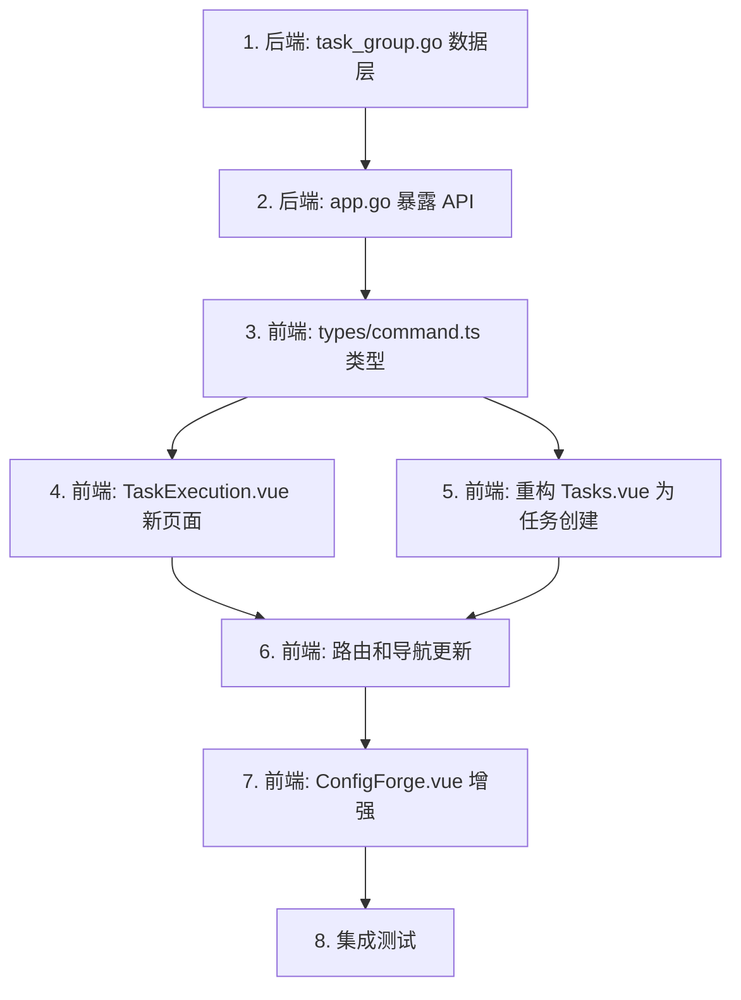

# 配置生成、命令和设备资产联动功能实施计划

## 项目架构分析

本项目 (NetWeaverGo) 是一个基于 **Wails3 (Go + Vue3)** 的桌面应用，用于网络设备批量命令下发和配置管理。

### 现有模块

| 模块 | 前端 | 后端 | 数据存储 |
|------|------|------|----------|
| 仪表盘 | [Dashboard.vue](file:///d:/Document/Code/NetWeaverGo/frontend/src/views/Dashboard.vue) | - | - |
| 设备资产 | [Devices.vue](file:///d:/Document/Code/NetWeaverGo/frontend/src/views/Devices.vue) | [config.go](file:///d:/Document/Code/NetWeaverGo/internal/config/config.go) → [DeviceAsset](file:///d:/Document/Code/NetWeaverGo/internal/config/config.go#15-24) | `inventory.csv` |
| 命令管理 | [Commands.vue](file:///d:/Document/Code/NetWeaverGo/frontend/src/views/Commands.vue) | [command_group.go](file:///d:/Document/Code/NetWeaverGo/internal/config/command_group.go) → [CommandGroup](file:///d:/Document/Code/NetWeaverGo/frontend/src/types/command.ts#2-11) | `commands/groups.json` |
| 任务执行 | [Tasks.vue](file:///d:/Document/Code/NetWeaverGo/frontend/src/views/Tasks.vue) | [app.go](file:///d:/Document/Code/NetWeaverGo/internal/ui/app.go) → [StartEngineWithSelection](file:///d:/Document/Code/NetWeaverGo/internal/ui/app.go#371-445) | 内存运行时 |
| 配置生成 | [ConfigForge.vue](file:///d:/Document/Code/NetWeaverGo/frontend/src/views/Tools/ConfigForge.vue) | 前端纯逻辑 + [CreateCommandGroup](file:///d:/Document/Code/NetWeaverGo/internal/ui/app.go#220-224) | - |

### 核心数据结构

```go
// 设备资产
type DeviceAsset struct {
    IP, Port, Protocol, Username, Password, Group, Tag
}

// 命令组
type CommandGroup struct {
    ID, Name, Description, Commands[], CreatedAt, UpdatedAt, Tags[]
}
```

### 当前 Tasks.vue 功能
- 步骤1：通过 `DeviceSelector` 选择目标设备（支持按组/标签/协议/手动筛选）
- 步骤2：通过 `CommandGroupSelector` 选择一个命令组
- 点击「开始下发命令」→ 调用 [StartEngineWithSelection(deviceIPs, commandGroupID)](file:///d:/Document/Code/NetWeaverGo/internal/ui/app.go#371-445) 直接执行
- 显示实时进度和每台设备的日志

---

## 功能需求总结

用户需要将 **配置生成**、**命令** 和 **设备资产** 三大模块进行联动，核心包含以下变更：

### 1. 任务创建页（重构当前 Tasks.vue）
- 将「任务执行」页面改名为「任务创建」
- 移除直接下发命令的功能（"开始下发命令"和"备份交换机配置"按钮）
- 添加「创建任务」按钮，将选择的命令组 + 设备绑定为一个任务项，保存到任务执行列表

### 2. 任务执行页（新页面）
- 展示所有已创建的任务绑定组合
- **模式A：一组命令 → 一个设备组**（相同命令下发到不同设备）
- **模式B：组合模式 → 一组命令对应一个设备集合**（每台设备有独立命令，通过 IP 绑定）
- 支持执行单个或批量任务
- 保留原有的实时进度和设备日志展示

### 3. ConfigForge 增强（BindingDeviceIP 功能）
- 用户可在配置模板首行输入 `[BindingDeviceIP]`
- 第一个变量自动变为绑定设备 IP 输入
- 当检测到 `[BindingDeviceIP]` 时，生成预览后显示「发送到任务执行」按钮
- 点击后弹窗让用户填写任务名称、标签等信息
- 以组合模式（模式B）发送到任务执行页

---

## 新增数据结构设计

### 后端 Go 数据结构

```go
// TaskItem 单个任务项（一组命令绑定一组设备）
type TaskItem struct {
    CommandGroupID string   `json:"commandGroupId"` // 命令组ID（模式A使用）
    Commands       []string `json:"commands"`        // 直接命令列表（模式B：每台设备独立命令时使用）
    DeviceIPs      []string `json:"deviceIPs"`       // 绑定的设备IP列表
}

// TaskGroup 任务组（任务执行页面的一条记录）
type TaskGroup struct {
    ID          string     `json:"id"`
    Name        string     `json:"name"`
    Description string     `json:"description"`
    Mode        string     `json:"mode"`        // "group" 模式A | "binding" 模式B
    Items       []TaskItem `json:"items"`        // 模式A: 1个item; 模式B: N个item(每个对应一台设备)
    Tags        []string   `json:"tags"`
    Status      string     `json:"status"`       // "pending" | "running" | "completed" | "failed"
    CreatedAt   string     `json:"createdAt"`
    UpdatedAt   string     `json:"updatedAt"`
}
```

> [!IMPORTANT]
> **模式A (group)**：`Items` 中只有 1 个 `TaskItem`，其中 `CommandGroupID` 指向一个命令组，`DeviceIPs` 包含所有目标设备。
>
> **模式B (binding)**：`Items` 中有 N 个 `TaskItem`，每个 `TaskItem` 对应一台设备（`DeviceIPs` 只有一个 IP），[Commands](file:///d:/Document/Code/NetWeaverGo/internal/ui/app.go#182-187) 是该设备专属的命令列表。

---

## User Review Required

> [!IMPORTANT]
> **导航结构变更**：侧边栏将从 8 个菜单项变为 9 个（新增「任务执行」，原「任务执行」改名为「任务创建」）。请确认这个导航布局是否可接受。

> [!WARNING]
> **模式B 的引擎调用方式**：当前 [StartEngineWithSelection](file:///d:/Document/Code/NetWeaverGo/internal/ui/app.go#371-445) 只支持一组命令对应多台设备。模式B（每台设备独立命令）需要新增后端 API：`StartEngineWithBindings`，用于逐台设备执行其各自的命令。这会涉及后端引擎逻辑的扩展。

> [!IMPORTANT]
> **任务数据持久化**：任务组数据建议存储在 `commands/tasks.json` 文件中，与命令组管理的存储方式保持一致。请确认是否同意这个存储位置。

---

## Proposed Changes

### 后端 - 任务组管理

#### [NEW] [task_group.go](file:///d:/Document/Code/NetWeaverGo/internal/config/task_group.go)

新增任务组相关的数据结构定义和 CRUD 操作：

- `TaskGroup` / `TaskItem` 结构体定义
- `TaskGroupsFile` 存储文件结构
- `ListTaskGroups()` - 获取所有任务组
- `GetTaskGroup(id)` - 根据 ID 获取任务组
- `CreateTaskGroup(group)` - 创建任务组
- `UpdateTaskGroup(id, group)` - 更新任务组
- `DeleteTaskGroup(id)` - 删除任务组
- `UpdateTaskGroupStatus(id, status)` - 更新任务状态
- 存储位置：`commands/tasks.json`

---

#### [MODIFY] [app.go](file:///d:/Document/Code/NetWeaverGo/internal/ui/app.go)

新增任务组管理 API 暴露给前端（约 100 行）：

- `ListTaskGroups()` → 前端获取任务列表
- `GetTaskGroup(id)` → 获取单个任务
- `CreateTaskGroup(group)` → 创建任务
- `UpdateTaskGroup(id, group)` → 更新任务
- `DeleteTaskGroup(id)` → 删除任务
- `StartTaskGroup(id)` → 启动任务组执行（核心方法）
  - 模式A：调用现有的 [StartEngineWithSelection](file:///d:/Document/Code/NetWeaverGo/internal/ui/app.go#371-445) 逻辑
  - 模式B：逐个 `TaskItem` 调用引擎，每台设备执行自己的命令

---

### 前端 - 路由与导航

#### [MODIFY] [index.ts](file:///d:/Document/Code/NetWeaverGo/frontend/src/router/index.ts)

- 原 `/tasks` 路由改名为 `TaskCreate`（任务创建）
- 新增 `/task-execution` 路由，指向新的 `TaskExecution.vue`

#### [MODIFY] [App.vue](file:///d:/Document/Code/NetWeaverGo/frontend/src/App.vue)

- 菜单项「任务执行」label 改为「任务创建」
- 新增「任务执行」菜单项（配适当图标）
- `titleMap` 中新增 `TaskExecution: "任务执行大屏"`，原 Tasks 改为 `"任务创建"`

---

### 前端 - 任务创建（重构 Tasks.vue）

#### [MODIFY] [Tasks.vue](file:///d:/Document/Code/NetWeaverGo/frontend/src/views/Tasks.vue)

**主要变更：**
- 移除「开始下发命令」和「备份交换机配置」按钮
- 新增「创建任务」按钮
- 点击「创建任务」时弹出命名弹窗：
  - 任务名称（自动填充 `Task_YYYYMMDD_HHmmss`）
  - 任务描述
  - 标签
- 确认后调用 `CreateTaskGroup()` 创建一个模式A 的任务组
- 创建成功后提示用户并提供「跳转到任务执行」的链接
- 移除所有引擎执行相关代码（进度条、设备卡片网格、日志显示、事件监听等）
- 移除 Suspend 弹窗（移到任务执行页）

---

### 前端 - 任务执行页（新页面）

#### [NEW] [TaskExecution.vue](file:///d:/Document/Code/NetWeaverGo/frontend/src/views/TaskExecution.vue)

**核心功能（约 600-800 行）：**

1. **任务列表区域**
   - 展示所有已创建的任务组（卡片布局）
   - 每个卡片显示：任务名称、模式（组/绑定）、设备数量、命令数量、标签、状态、创建时间
   - 支持搜索和按标签/状态筛选
   - 操作按钮：执行、编辑、删除

2. **任务详情查看**
   - 点击任务卡片展开详情
   - 模式A：显示命令组名称 + 设备 IP 列表
   - 模式B：显示每台设备对应的命令内容

3. **任务执行功能**
   - 点击执行后，进入执行视图（从 Tasks.vue 迁移过来的进度条、设备卡片网格、日志显示）
   - 复用现有的事件监听机制（`engine:finished`、`device:event`、`engine:suspend_required`）
   - Suspend 弹窗交互

4. **模式A & B 的可视化**
   - 模式A：显示为 `[命令组] → [设备1, 设备2, ...]`
   - 模式B：显示为每行一个设备 `设备IP → [命令1, 命令2, ...]`

---

### 前端 - 类型定义

#### [MODIFY] [command.ts](file:///d:/Document/Code/NetWeaverGo/frontend/src/types/command.ts)

新增任务组相关的 TypeScript 类型定义：

```typescript
export interface TaskItem {
  commandGroupId: string;
  commands: string[];
  deviceIPs: string[];
}

export interface TaskGroup {
  id: string;
  name: string;
  description: string;
  mode: 'group' | 'binding';
  items: TaskItem[];
  tags: string[];
  status: 'pending' | 'running' | 'completed' | 'failed';
  createdAt: string;
  updatedAt: string;
}
```

---

### 前端 - ConfigForge 增强

#### [MODIFY] [ConfigForge.vue](file:///d:/Document/Code/NetWeaverGo/frontend/src/views/Tools/ConfigForge.vue)

**新增 BindingDeviceIP 功能（约 200 行新增代码）：**

1. **检测逻辑**
   - 监听 `templateText` 变化
   - 检测第一行是否为 `[BindingDeviceIP]`
   - 如果是，自动将 `variables[0].name` 设为 `[BindingDeviceIP]`，锁定不可编辑
   - 添加 `isBindingMode` 计算属性

2. **UI 变化**
   - 当 `isBindingMode = true` 时：
     - 第一个变量输入框增加 IP 图标和提示文字
     - 变量列表第一项显示为"设备IP绑定"样式
   - 生成预览区域下方新增「发送到任务执行」按钮（仅在 binding 模式下显示）

3. **发送弹窗**
   - 复用并扩展现有的 `sendModal` 弹窗模式
   - 弹窗内容：
     - 任务名称（默认 `ConfigForge_YYYYMMDD_HHmmss`）
     - 任务描述
     - 标签管理
     - 绑定预览：显示每台设备及其对应的生成命令
   - 确认后调用 `CreateTaskGroup()` 创建模式B 的任务组：
     - 遍历 `variables[0]` 的每个 IP 值
     - 每个 IP 对应 `outputBlocks` 中的一段配置
     - 构建 `TaskItem` 数组

---

## 变更文件汇总

| 文件 | 操作 | 复杂度 |
|------|------|--------|
| `internal/config/task_group.go` | 新增 | 中 |
| [internal/ui/app.go](file:///d:/Document/Code/NetWeaverGo/internal/ui/app.go) | 修改 | 中 |
| [frontend/src/router/index.ts](file:///d:/Document/Code/NetWeaverGo/frontend/src/router/index.ts) | 修改 | 低 |
| [frontend/src/App.vue](file:///d:/Document/Code/NetWeaverGo/frontend/src/App.vue) | 修改 | 低 |
| [frontend/src/types/command.ts](file:///d:/Document/Code/NetWeaverGo/frontend/src/types/command.ts) | 修改 | 低 |
| [frontend/src/views/Tasks.vue](file:///d:/Document/Code/NetWeaverGo/frontend/src/views/Tasks.vue) | 重构 | 高 |
| `frontend/src/views/TaskExecution.vue` | 新增 | 高 |
| [frontend/src/views/Tools/ConfigForge.vue](file:///d:/Document/Code/NetWeaverGo/frontend/src/views/Tools/ConfigForge.vue) | 修改 | 中 |

---

## 实施顺序



---

## Verification Plan

### Manual Verification

本项目是 Wails 桌面应用，无自动化测试框架。需要通过以下手动步骤验证：

1. **编译验证**
   - 在项目根目录运行 `go build ./...` 确认后端无编译错误
   - 在 `frontend/` 目录运行 `npx vue-tsc --noEmit` 确认前端无类型错误（如可用）

2. **任务创建页验证**
   - 导航到「任务创建」页面
   - 确认页面标题已改为「任务创建」
   - 确认「开始下发命令」和「备份交换机配置」按钮已移除
   - 选择设备 + 命令组后，点击「创建任务」
   - 确认弹出命名弹窗，填写信息后成功创建任务

3. **任务执行页验证**
   - 导航到「任务执行」页面
   - 确认显示已创建的任务组列表
   - 查看模式A 任务的详情显示
   - 点击执行按钮，确认引擎正常启动，进度和日志正常显示

4. **ConfigForge BindingDeviceIP 功能验证**
   - 进入配置生成页面
   - 在模板首行输入 `[BindingDeviceIP]`
   - 确认第一个变量自动变为 `[BindingDeviceIP]` 且锁定
   - 在第一个变量输入多个 IP（如 `192.168.1.1, 192.168.1.2`）
   - 确认生成预览正常，且出现「发送到任务执行」按钮
   - 点击发送，填写任务信息后确认创建成功
   - 导航到任务执行页面，确认模式B 任务正确显示

5. **数据持久化验证**
   - 关闭并重新打开应用
   - 确认任务执行页的任务数据仍然存在
