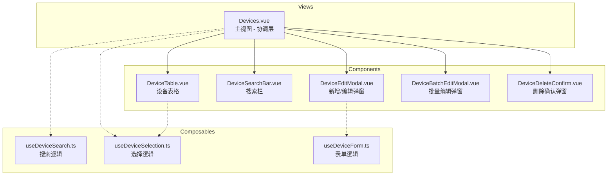

# Devices.vue 组件拆分方案

> 创建日期: 2026-03-19
> 目标: 将 1925 行的单文件组件拆分为可维护的模块化结构

---

## 1. 当前问题分析

### 1.1 文件结构概览

| 区域          | 行数        | 占比 |
| ------------- | ----------- | ---- |
| Template 部分 | ~1165 行    | 60%  |
| Script 部分   | ~760 行     | 40%  |
| **总计**      | **1925 行** | 100% |

### 1.2 主要问题

1. **单文件过大** - 难以维护和阅读
2. **职责混杂** - 表格、弹窗、搜索逻辑混在一起
3. **复用性差** - 弹窗组件无法在其他页面复用
4. **测试困难** - 难以对单个功能进行单元测试

---

## 2. 拆分策略

### 2.1 组件拆分架构图



### 2.2 拆分原则

1. **单一职责** - 每个组件只负责一个功能
2. **状态提升** - 共享状态提升到父组件或 composable
3. **事件驱动** - 子组件通过 emit 通知父组件
4. **渐进式拆分** - 优先拆分独立性强的组件

---

## 3. 新组件详细设计

### 3.1 DeviceSearchBar.vue

**职责**: 设备搜索栏组件

**预计行数**: ~80 行

**Props**:

```typescript
interface Props {
  searchType: "group" | "tag" | "ip";
  searchQuery: string;
  searchOptions: Array<{ label: string; value: string }>;
}
```

**Emits**:

```typescript
interface Emits {
  "update:searchType": [value: string];
  "update:searchQuery": [value: string];
  reset: [];
}
```

---

### 3.2 DeviceTable.vue

**职责**: 设备列表表格（含分页）

**预计行数**: ~400 行

**Props**:

```typescript
interface Props {
  devices: Device[];
  loading: boolean;
  selectedIds: Set<number>;
  page: number;
  totalPages: number;
  totalCount: number;
}
```

**Emits**:

```typescript
interface Emits {
  "toggle-select": [id: number];
  "toggle-select-all": [];
  edit: [device: Device];
  delete: [device: Device];
  "prev-page": [];
  "next-page": [];
  "jump-page": [page: number];
  "batch-edit": [field: string];
}
```

---

### 3.3 DeviceEditModal.vue

**职责**: 新增/编辑设备弹窗

**预计行数**: ~300 行

**Props**:

```typescript
interface Props {
  show: boolean;
  isEditing: boolean;
  device?: DeviceEditData; // 编辑时传入
}
```

**Emits**:

```typescript
interface Emits {
  close: [];
  save: [device: DeviceFormData];
}
```

**特性**:

- IP 范围语法糖提示
- 协议端口自动关联
- 密码显示/隐藏切换
- 标签管理

---

### 3.4 DeviceBatchEditModal.vue

**职责**: 批量编辑设备属性弹窗

**预计行数**: ~150 行

**Props**:

```typescript
interface Props {
  show: boolean;
  field: "group" | "protocol" | "port" | "username" | "password" | "tag" | null;
  selectedCount: number;
}
```

**Emits**:

```typescript
interface Emits {
  close: [];
  save: [field: string, value: string | number];
}
```

---

### 3.5 DeviceDeleteConfirm.vue

**职责**: 删除确认弹窗（支持单个和批量）

**预计行数**: ~100 行

**Props**:

```typescript
interface Props {
  show: boolean;
  isBatch: boolean;
  device?: Device; // 单个删除时传入
  selectedCount: number; // 批量删除时使用
}
```

**Emits**:

```typescript
interface Emits {
  close: [];
  confirm: [];
}
```

---

## 4. Composables 设计

### 4.1 useDeviceSearch.ts

**职责**: 搜索相关逻辑

```typescript
export function useDeviceSearch() {
  const searchQuery = ref("");
  const searchType = ref<"group" | "tag" | "ip">("group");
  const searchOptions = [
    { label: "分组", value: "group" },
    { label: "标签", value: "tag" },
    { label: "IP", value: "ip" },
  ];

  const currentSearchLabel = computed(
    () => searchOptions.find((o) => o.value === searchType.value)?.label || "",
  );

  const resetSearch = () => {
    searchQuery.value = "";
  };

  return {
    searchQuery,
    searchType,
    searchOptions,
    currentSearchLabel,
    resetSearch,
  };
}
```

---

### 4.2 useDeviceSelection.ts

**职责**: 设备选择相关逻辑

```typescript
export function useDeviceSelection() {
  const selectedIds = ref<Set<number>>(new Set());
  const isSelectingAll = ref(false);

  const selectedCount = computed(() => selectedIds.value.size);

  const toggleSelect = (id: number) => {
    const newSet = new Set(selectedIds.value);
    if (newSet.has(id)) {
      newSet.delete(id);
    } else {
      newSet.add(id);
    }
    selectedIds.value = newSet;
  };

  const toggleSelectAll = (allIds: number[]) => {
    if (selectedIds.value.size === allIds.length) {
      selectedIds.value = new Set();
    } else {
      selectedIds.value = new Set(allIds);
    }
  };

  const clearSelection = () => {
    selectedIds.value = new Set();
  };

  return {
    selectedIds,
    isSelectingAll,
    selectedCount,
    toggleSelect,
    toggleSelectAll,
    clearSelection,
  };
}
```

---

### 4.3 useDeviceForm.ts

**职责**: 设备表单相关逻辑

```typescript
export function useDeviceForm() {
  const form = ref<DeviceFormData>({
    ip: "",
    port: 22,
    protocol: "SSH",
    username: "",
    password: "",
    group: "",
    tags: [],
    vendor: "",
    role: "",
    site: "",
    displayName: "",
    description: "",
  });

  const showPassword = ref(false);
  const errorMessage = ref("");
  const ipValidationError = ref("");
  const ipRangeHint = ref<IpRangeHint | null>(null);

  const validProtocols = ["SSH", "Telnet"];

  const resetForm = () => {
    form.value = {
      /* 默认值 */
    };
    errorMessage.value = "";
    ipValidationError.value = "";
    ipRangeHint.value = null;
  };

  const onProtocolChange = () => {
    // 协议变更时自动更新端口
    if (form.value.protocol === "SSH") {
      form.value.port = 22;
    } else if (form.value.protocol === "Telnet") {
      form.value.port = 23;
    }
  };

  return {
    form,
    showPassword,
    errorMessage,
    ipValidationError,
    ipRangeHint,
    validProtocols,
    resetForm,
    onProtocolChange,
  };
}
```

---

## 5. 拆分后的 Devices.vue 结构

```vue
<template>
  <div class="animate-slide-in space-y-6">
    <!-- 搜索栏 -->
    <DeviceSearchBar
      v-model:search-type="searchType"
      v-model:search-query="searchQuery"
      :search-options="searchOptions"
      @reset="resetSearch"
    />

    <!-- 新增按钮 -->
    <div class="flex justify-end">
      <button @click="openAddModal" class="btn-primary">新增设备</button>
    </div>

    <!-- 数据表格 -->
    <DeviceTable
      :devices="data"
      :loading="loading"
      :selected-ids="selectedIds"
      :page="page"
      :total-pages="totalPages"
      :total-count="total"
      @toggle-select="toggleSelect"
      @toggle-select-all="toggleSelectAll"
      @edit="openEditModal"
      @delete="openDeleteConfirm"
      @prev-page="handlePrevPage"
      @next-page="handleNextPage"
      @jump-page="jumpToPage"
      @batch-edit="openBatchEditModal"
    />

    <!-- 新增/编辑弹窗 -->
    <DeviceEditModal
      :show="showModal"
      :is-editing="isEditing"
      :device="editingDevice"
      @close="closeModal"
      @save="saveDevice"
    />

    <!-- 批量编辑弹窗 -->
    <DeviceBatchEditModal
      :show="showBatchModal"
      :field="batchField"
      :selected-count="selectedCount"
      @close="closeBatchModal"
      @save="saveBatchEdit"
    />

    <!-- 删除确认弹窗 -->
    <DeviceDeleteConfirm
      :show="showDeleteConfirm"
      :is-batch="false"
      :device="deviceToDelete"
      @close="showDeleteConfirm = false"
      @confirm="deleteDevice"
    />

    <!-- 批量删除确认弹窗 -->
    <DeviceDeleteConfirm
      :show="showBatchDeleteConfirm"
      :is-batch="true"
      :selected-count="selectedCount"
      @close="showBatchDeleteConfirm = false"
      @confirm="batchDeleteDevices"
    />
  </div>
</template>

<script setup lang="ts">
// 组件导入
import DeviceSearchBar from "@/components/device/DeviceSearchBar.vue";
import DeviceTable from "@/components/device/DeviceTable.vue";
import DeviceEditModal from "@/components/device/DeviceEditModal.vue";
import DeviceBatchEditModal from "@/components/device/DeviceBatchEditModal.vue";
import DeviceDeleteConfirm from "@/components/device/DeviceDeleteConfirm.vue";

// Composables 导入
import { useDeviceSearch } from "@/composables/useDeviceSearch";
import { useDeviceSelection } from "@/composables/useDeviceSelection";

// API 导入
import { DeviceAPI, QueryAPI } from "@/services/api";

// 使用 composables
const { searchQuery, searchType, searchOptions, resetSearch } =
  useDeviceSearch();
const {
  selectedIds,
  selectedCount,
  toggleSelect,
  toggleSelectAll,
  clearSelection,
} = useDeviceSelection();

// 数据加载和操作逻辑
// ...约 200 行
</script>
```

**预计行数**: ~250 行（减少 87%）

---

## 6. 实施计划

### 阶段一：创建 Composables（优先级高）

| 步骤 | 任务                         | 预计产出     |
| ---- | ---------------------------- | ------------ |
| 1.1  | 创建 `useDeviceSearch.ts`    | 搜索逻辑抽离 |
| 1.2  | 创建 `useDeviceSelection.ts` | 选择逻辑抽离 |
| 1.3  | 创建 `useDeviceForm.ts`      | 表单逻辑抽离 |

### 阶段二：拆分弹窗组件（优先级高）

| 步骤 | 任务                            | 预计产出          |
| ---- | ------------------------------- | ----------------- |
| 2.1  | 创建 `DeviceEditModal.vue`      | 新增/编辑弹窗独立 |
| 2.2  | 创建 `DeviceBatchEditModal.vue` | 批量编辑弹窗独立  |
| 2.3  | 创建 `DeviceDeleteConfirm.vue`  | 删除确认弹窗独立  |

### 阶段三：拆分表格组件（优先级中）

| 步骤 | 任务                       | 预计产出     |
| ---- | -------------------------- | ------------ |
| 3.1  | 创建 `DeviceTable.vue`     | 表格组件独立 |
| 3.2  | 创建 `DeviceSearchBar.vue` | 搜索栏独立   |

### 阶段四：重构主组件（优先级中）

| 步骤 | 任务                          | 预计产出     |
| ---- | ----------------------------- | ------------ |
| 4.1  | 重构 `Devices.vue` 使用新组件 | 主组件精简   |
| 4.2  | 删除冗余代码                  | 代码清理     |
| 4.3  | 功能测试验证                  | 确保功能正常 |

---

## 7. 文件目录结构

```
frontend/src/
├── components/
│   └── device/                    # 新建目录
│       ├── DeviceSearchBar.vue    # 搜索栏组件
│       ├── DeviceTable.vue        # 表格组件
│       ├── DeviceEditModal.vue    # 编辑弹窗
│       ├── DeviceBatchEditModal.vue  # 批量编辑弹窗
│       └── DeviceDeleteConfirm.vue   # 删除确认弹窗
├── composables/
│   ├── useDeviceSearch.ts         # 新建
│   ├── useDeviceSelection.ts      # 新建
│   └── useDeviceForm.ts           # 新建
└── views/
    └── Devices.vue                # 重构后的主视图
```

---

## 8. 风险与注意事项

### 8.1 风险点

1. **状态同步** - 拆分后需确保状态在各组件间正确传递
2. **事件冒泡** - 需仔细处理事件传递链
3. **样式隔离** - 拆分后需确保样式正确应用

### 8.2 缓解措施

1. 使用 TypeScript 类型检查确保 Props/Emits 正确
2. 拆分前先编写功能测试用例
3. 采用渐进式拆分，每步验证功能

---

## 9. 预期收益

| 指标         | 拆分前  | 拆分后  | 改善     |
| ------------ | ------- | ------- | -------- |
| 主文件行数   | 1925 行 | ~250 行 | -87%     |
| 最大组件行数 | 1925 行 | ~400 行 | -79%     |
| 可复用组件   | 0       | 5       | +5       |
| Composables  | 0       | 3       | +3       |
| 可测试性     | 低      | 高      | 显著提升 |

---

## 10. 总结

本方案将 1925 行的 `Devices.vue` 拆分为：

- **5 个独立组件**：搜索栏、表格、编辑弹窗、批量编辑弹窗、删除确认弹窗
- **3 个 Composables**：搜索逻辑、选择逻辑、表单逻辑
- **主视图精简至 ~250 行**：仅负责协调和数据加载

拆分后代码结构清晰、职责分明、易于维护和测试。
