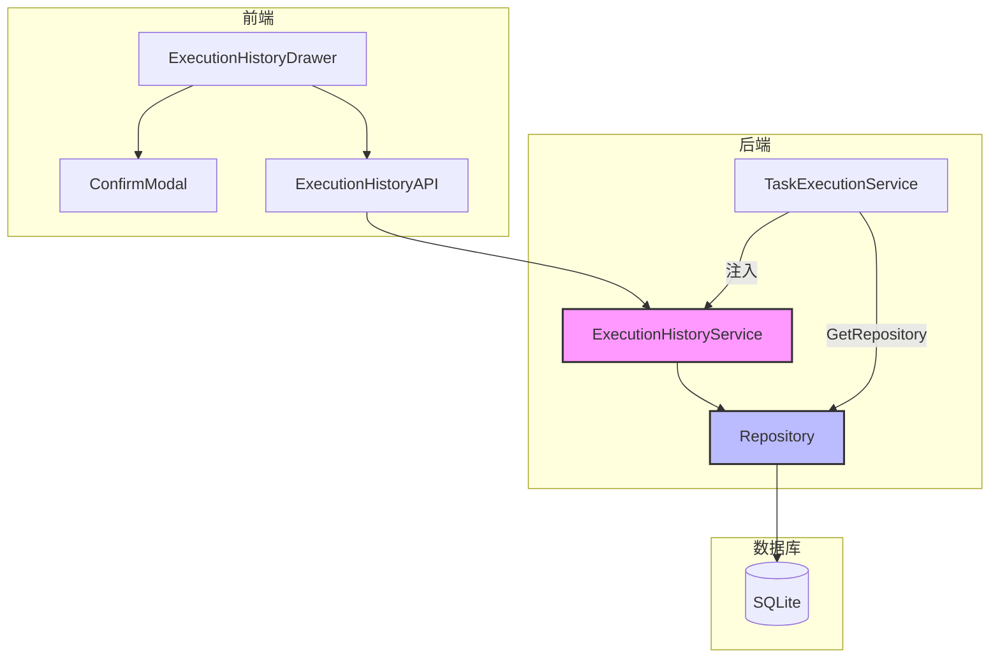

# 执行历史记录删除功能修复方案

## 问题分析

### 问题现象

用户在执行历史记录抽屉中点击"清空全部"按钮时，提示"删除失败"。

### 根本原因

通过分析代码和错误日志，发现以下问题：

#### 1. 后端 Repository 未注入（主要原因）

在 [`cmd/netweaver/main.go:70-71`](cmd/netweaver/main.go:70) 中：

```go
executionHistoryService := ui.NewExecutionHistoryService()
executionHistoryService.SetTaskExecutionService(taskExecutionService) // 设置统一运行时服务
```

`ExecutionHistoryService` 有两个字段需要初始化：

- `taskExecutionService` - 已通过 `SetTaskExecutionService` 设置
- `repo` - **未设置**，导致删除操作时返回 "仓库未初始化" 错误

查看 [`internal/ui/execution_history_service.go:163-166`](internal/ui/execution_history_service.go:163)：

```go
func (s *ExecutionHistoryService) DeleteRunRecord(runID string) (*DeleteRunRecordResponse, error) {
    if s.repo == nil {
        return nil, fmt.Errorf("仓库未初始化")
    }
    // ...
}
```

#### 2. 前端使用原生 confirm() 对话框

在 [`frontend/src/components/task/ExecutionHistoryDrawer.vue:249`](frontend/src/components/task/ExecutionHistoryDrawer.vue:249) 和 [`281`](frontend/src/components/task/ExecutionHistoryDrawer.vue:281)：

```typescript
// 删除单条记录
if (!confirm(`确定要删除记录 "${record.taskName}" 吗？\n此操作不可恢复。`)) {
  return;
}

// 删除全部记录
if (!confirm(`确定要删除全部 ${total.value} 条记录吗？\n此操作不可恢复。`)) {
  return;
}
```

原生 `confirm()` 对话框显示 "wails.localhost" 作为来源，与项目自定义 UI 风格不一致。

#### 3. 缺少调试日志

删除操作的关键步骤缺少 debug/verbose 日志，不利于问题排查。

---

## 修复方案

### 1. 后端修复：正确注入 Repository

#### 1.1 在 TaskExecutionService 中添加 GetRepository 方法

文件：[`internal/taskexec/service.go`](internal/taskexec/service.go)

```go
// GetRepository 获取仓库实例（供其他服务使用）
func (s *TaskExecutionService) GetRepository() Repository {
    return s.repo
}
```

#### 1.2 在 main.go 中注入 Repository

文件：[`cmd/netweaver/main.go`](cmd/netweaver/main.go)

```go
executionHistoryService := ui.NewExecutionHistoryService()
executionHistoryService.SetTaskExecutionService(taskExecutionService)
executionHistoryService.SetRepository(taskExecutionService.GetRepository()) // 新增：注入 Repository
```

### 2. 后端修复：添加调试日志

文件：[`internal/ui/execution_history_service.go`](internal/ui/execution_history_service.go)

在关键操作点添加日志：

```go
// DeleteRunRecord 删除单条运行记录
func (s *ExecutionHistoryService) DeleteRunRecord(runID string) (*DeleteRunRecordResponse, error) {
    logger.Debug("ExecutionHistoryService", "-", "开始删除运行记录: runID=%s", runID)

    if s.repo == nil {
        logger.Error("ExecutionHistoryService", "-", "仓库未初始化，无法删除记录")
        return nil, fmt.Errorf("仓库未初始化")
    }

    // ... 现有逻辑 ...

    logger.Verbose("ExecutionHistoryService", runID, "检查运行状态: status=%s", run.Status)
    logger.Debug("ExecutionHistoryService", runID, "获取关联数据: units=%d, artifacts=%d", len(units), len(artifacts))

    // 删除数据库记录
    if err := s.repo.DeleteRun(context.Background(), runID); err != nil {
        logger.Error("ExecutionHistoryService", runID, "删除数据库记录失败: %v", err)
        return &DeleteRunRecordResponse{Success: false, Message: fmt.Sprintf("删除失败: %v", err)}, nil
    }

    logger.Info("ExecutionHistoryService", runID, "运行记录删除成功")
    // ...
}

// DeleteAllRunRecords 删除所有运行记录
func (s *ExecutionHistoryService) DeleteAllRunRecords() (*DeleteRunRecordResponse, error) {
    logger.Debug("ExecutionHistoryService", "-", "开始删除所有运行记录")

    if s.repo == nil {
        logger.Error("ExecutionHistoryService", "-", "仓库未初始化，无法删除记录")
        return nil, fmt.Errorf("仓库未初始化")
    }

    // ... 现有逻辑 ...

    logger.Verbose("ExecutionHistoryService", "-", "检查运行中的任务: count=%d", len(running))
    logger.Debug("ExecutionHistoryService", "-", "获取所有运行记录: count=%d", len(runs))

    // ...
}
```

### 3. 前端修复：创建确认弹窗组件

#### 3.1 创建通用确认弹窗组件

文件：[`frontend/src/components/common/ConfirmModal.vue`](frontend/src/components/common/ConfirmModal.vue)

参考现有的 [`DeviceDeleteConfirm.vue`](frontend/src/components/device/DeviceDeleteConfirm.vue) 样式，创建一个通用的确认弹窗组件：

```vue
<template>
  <div v-if="show" class="fixed inset-0 z-50 flex items-center justify-center">
    <!-- 背景遮罩 -->
    <div
      class="absolute inset-0 bg-black/50 backdrop-blur-sm"
      @click="handleCancel"
    ></div>

    <!-- 弹窗内容 -->
    <div
      class="relative bg-bg-card border border-border rounded-xl shadow-2xl w-full max-w-sm mx-4 animate-slide-in"
    >
      <div class="p-6">
        <!-- 图标和标题 -->
        <div class="flex items-center gap-3 mb-4">
          <div :class="iconWrapperClass">
            <component :is="iconComponent" class="w-6 h-6" />
          </div>
          <div>
            <h3 class="text-lg font-semibold text-text-primary">{{ title }}</h3>
            <p v-if="subtitle" class="text-sm text-text-muted">
              {{ subtitle }}
            </p>
          </div>
        </div>

        <!-- 提示信息 -->
        <p class="text-sm text-text-secondary mb-6">
          <slot>{{ message }}</slot>
        </p>

        <!-- 操作按钮 -->
        <div class="flex items-center justify-end gap-3">
          <button
            @click="handleCancel"
            class="px-4 py-2 text-sm font-medium text-text-secondary bg-bg-panel border border-border rounded-lg hover:bg-bg-hover transition-colors"
          >
            {{ cancelText }}
          </button>
          <button
            @click="handleConfirm"
            :disabled="loading"
            :class="confirmButtonClass"
          >
            {{ loading ? loadingText : confirmText }}
          </button>
        </div>
      </div>
    </div>
  </div>
</template>
```

组件支持：

- 不同类型（danger/warning/info）
- 自定义标题、消息、按钮文本
- 加载状态
- 插槽支持自定义内容

#### 3.2 修改 ExecutionHistoryDrawer.vue

文件：[`frontend/src/components/task/ExecutionHistoryDrawer.vue`](frontend/src/components/task/ExecutionHistoryDrawer.vue)

```vue
<script setup lang="ts">
// 引入确认弹窗组件
import ConfirmModal from "../common/ConfirmModal.vue";

// 删除确认弹窗状态
const deleteConfirmModal = ref({
  show: false,
  isBatch: false,
  targetRecord: null as ExecutionHistoryRecord | null,
  deleting: false,
});

// 删除单条记录 - 打开确认弹窗
const confirmDeleteRecord = (record: ExecutionHistoryRecord, event: Event) => {
  event.stopPropagation();
  deleteConfirmModal.value = {
    show: true,
    isBatch: false,
    targetRecord: record,
    deleting: false,
  };
};

// 删除全部记录 - 打开确认弹窗
const confirmDeleteAll = () => {
  if (records.value.length === 0) {
    toast.warning("暂无记录可删除");
    return;
  }
  deleteConfirmModal.value = {
    show: true,
    isBatch: true,
    targetRecord: null,
    deleting: false,
  };
};

// 执行删除确认
const executeDelete = async () => {
  deleteConfirmModal.value.deleting = true;

  try {
    if (deleteConfirmModal.value.isBatch) {
      // 删除全部
      const result = await ExecutionHistoryAPI.deleteAllRunRecords();
      if (result?.success) {
        toast.success("删除成功");
        records.value = [];
        total.value = 0;
        taskexecStore.clearAllHistory();
        deleteConfirmModal.value.show = false;
      } else {
        toast.error(result?.message || "删除失败");
      }
    } else {
      // 删除单条
      const record = deleteConfirmModal.value.targetRecord;
      if (record) {
        const result = await ExecutionHistoryAPI.deleteRunRecord(record.id);
        if (result?.success) {
          toast.success("删除成功");
          const index = records.value.findIndex((r) => r.id === record.id);
          if (index !== -1) {
            records.value.splice(index, 1);
            total.value--;
          }
          taskexecStore.removeRunFromHistory(record.id);
          deleteConfirmModal.value.show = false;
        } else {
          toast.error(result?.message || "删除失败");
        }
      }
    }
  } catch (error) {
    console.error("删除记录失败:", error);
    toast.error("删除失败");
  } finally {
    deleteConfirmModal.value.deleting = false;
  }
};
</script>

<template>
  <!-- ... 现有内容 ... -->

  <!-- 删除确认弹窗 -->
  <ConfirmModal
    v-model="deleteConfirmModal.show"
    :type="deleteConfirmModal.isBatch ? 'danger' : 'warning'"
    :title="deleteConfirmModal.isBatch ? '清空全部记录' : '确认删除'"
    :message="
      deleteConfirmModal.isBatch
        ? `确定要删除全部 ${total} 条记录吗？此操作不可恢复。`
        : `确定要删除记录「${deleteConfirmModal.targetRecord?.taskName}」吗？此操作不可恢复。`
    "
    confirm-text="确认删除"
    :loading="deleteConfirmModal.deleting"
    @confirm="executeDelete"
  />
</template>
```

---

## 修改文件清单

| 文件路径                                                  | 修改类型 | 说明                                       |
| --------------------------------------------------------- | -------- | ------------------------------------------ |
| `internal/taskexec/service.go`                            | 新增方法 | 添加 `GetRepository()` 方法                |
| `cmd/netweaver/main.go`                                   | 修改     | 注入 Repository 到 ExecutionHistoryService |
| `internal/ui/execution_history_service.go`                | 修改     | 添加 debug/verbose 日志                    |
| `frontend/src/components/common/ConfirmModal.vue`         | 新建     | 通用确认弹窗组件                           |
| `frontend/src/components/task/ExecutionHistoryDrawer.vue` | 修改     | 替换 confirm() 为自定义弹窗                |

---

## 架构图



---

## 测试验证

1. **后端测试**
   - 启动应用，检查日志确认 Repository 注入成功
   - 执行删除单条记录操作，验证功能正常
   - 执行删除全部记录操作，验证功能正常

2. **前端测试**
   - 点击删除按钮，确认显示自定义弹窗（非原生 confirm）
   - 弹窗样式与项目整体风格一致
   - 取消操作正常关闭弹窗
   - 确认操作正确执行删除

3. **日志验证**
   - 检查 debug/verbose 日志正确输出
   - 错误场景有明确的错误日志
