# Tailwind CSS 样式完全重构方案

## 一、原报告准确性评估

### 1.1 报告正确的部分

| 结论 | 验证结果 |
|------|----------|
| 项目使用 Tailwind CSS v4 + `@theme` 扩展 | ✅ 正确 |
| 未引用任何 Tailwind 组件库 | ✅ 正确 |
| `_table.css`、`_tabs.css` 完全未使用 | ✅ 正确 |
| 布局文件 `_sidebar.css`、`_header.css`、`_page.css` 未使用 | ✅ 正确 - App.vue 已完全使用 Tailwind 工具类 |
| `button.css`、`card.css`、`input.css` 部分使用 | ✅ 正确但遗漏了使用范围 |
| 保留 `_tokens.css`、`_variables.css`、`_components.css` | ✅ 正确 |
| 保留 `_scrollbar.css`、`_glass.css` | ✅ 正确 |

### 1.2 报告遗漏和错误的部分

#### 遗漏 1：`modal.css` 被大量使用，报告仅标注"检查"

实际使用情况 - **5 个组件**依赖 `modal.css` 中的全局类：

| 组件 | 使用的类 |
|------|----------|
| `SendCommandModal.vue` | `modal-container`, `modal-active`, `modal-overlay`, `modal`, `modal-lg`, `modal-glass`, `modal-header`, `modal-header-title`, `modal-close`, `modal-body`, `modal-footer` |
| `SendTaskModal.vue` | 同上 |
| `SyntaxHelpModal.vue` | 同上 |
| `UsageHelpModal.vue` | 同上 |
| `ExecutionRecordDetail.vue` | `record-detail-modal`, `modal-content`, `modal-header`, `modal-title`, `btn-close`, `modal-body` |

#### 遗漏 2：`toast.css` 被 ConfigForge.vue 使用

`ConfigForge.vue` 中使用了 `toast-container`, `toast-container-top-center`, `toast`, `toast-success`, `toast-icon`, `toast-message`, `toast-visible`, `toast-content`, `toast-title`, `toast-link` 等类。

#### 遗漏 3：`badge.css` 的 `algo-badge-*` 类实际在 Settings.vue 的 scoped 样式中重新定义

Settings.vue 中的 `algo-badge`、`algo-badge-insecure`、`algo-badge-legacy`、`algo-badge-secure` 是 **scoped 样式**，并非来自全局 `badge.css`。全局 `badge.css` 中的 `.badge`、`.badge-primary` 等类实际上**未被任何模板使用**。

#### 遗漏 4：`_progress.css` 的 `progress-bar` 类被 DeviceExecutionProgressList.vue 使用

但该组件的 `device-progress-list`、`device-header`、`device-info`、`device-status-badge`、`progress-bar-container`、`progress-bar` 等类都在 **scoped 样式**中重新定义，全局 `_progress.css` 实际未被引用。

#### 遗漏 5：`_terminal.css` 组件类未被使用，但终端颜色变量通过 Tailwind 主题使用

模板中使用的是 `bg-terminal-bg`、`text-terminal-text` 等 Tailwind 主题类，而非 `.terminal`、`.terminal-body` 等 CSS 组件类。`_terminal.css` 中的组件类是死代码。

#### 遗漏 6：`_select.css` 和 `_page-header.css` 的类在 scoped 样式中重新定义

- `ExecutionHistoryDrawer.vue` 的 `filter-select` 是 scoped 样式
- `Settings.vue` 的 `settings-page-header` 是 scoped 样式
- 全局 `_select.css` 和 `_page-header.css` 中的类未被模板直接使用

#### 遗漏 7：29 个 Vue 组件包含 scoped 样式块

报告完全忽略了 Vue 组件内的 `<style scoped>` 块，这些 scoped 样式包含了大量与全局 CSS 重复或冲突的定义：

| 组件 | scoped 样式内容 |
|------|----------------|
| `Settings.vue` | `settings-page`, `settings-card`, `algo-*` 全套样式 |
| `ExecutionHistoryDrawer.vue` | `execution-history-drawer`, `drawer-*` 全套样式 |
| `DeviceExecutionProgressList.vue` | `device-progress-list`, `device-*`, `progress-bar-*` |
| `TitleBar.vue` | `titlebar`, `titlebar-btn`, `titlebar-controls` |
| `FileOperationButtons.vue` | `btn-file-op`, `btn-open`, `btn-folder` |
| `ConfigForge.vue` | `toast-container`, `toast`, `toast-*` |
| `ExecutionRecordDetail.vue` | `record-detail-modal`, `section`, `section-header` |
| `RuntimeConfigPanel.vue` | `runtime-config-panel`, `runtime-header` |
| `TopologyGraph.vue` | `topology-graph-container` |
| 其他 20 个组件 | 过渡动画、布局辅助等 |

#### 遗漏 8：`VariablesPanel.vue` 使用了 `input.css` 中的类

`VariablesPanel.vue` 使用了 `input`, `input-sm`, `input-mono`, `textarea` 等类，报告将 `input.css` 标记为"未使用"是不准确的。

---

## 二、当前样式架构问题全景

```mermaid
graph TD
    A[样式来源混乱] --> B[全局 CSS 组件类]
    A --> C[Tailwind 工具类]
    A --> D[Vue Scoped 样式]
    
    B --> B1[button.css - 6个组件使用]
    B --> B2[card.css - 3个组件使用]
    B --> B3[input.css - 1个组件使用]
    B --> B4[modal.css - 5个组件使用]
    B --> B5[toast.css - 1个组件使用]
    B --> B6[死代码: table/tabs/sidebar/header/page/terminal/select/progress/page-header/badge]
    
    C --> C1[App.vue - 完全使用 Tailwind]
    C --> C2[大部分视图 - 混合使用]
    
    D --> D1[Settings.vue - algo-* 重复 badge.css]
    D --> D2[ConfigForge.vue - toast-* 重复 toast.css]
    D --> D3[DeviceExecutionProgressList.vue - progress-* 重复 _progress.css]
    D --> D4[ExecutionHistoryDrawer.vue - drawer-* 独有]
    D --> D5[TitleBar.vue - titlebar-* 独有]
    D --> D6[29个组件的 scoped 样式]
    
    style B6 fill:#ff6b6b,color:#fff
    style D1 fill:#ffa502,color:#fff
    style D2 fill:#ffa502,color:#fff
    style D3 fill:#ffa502,color:#fff
```



### 核心问题总结

1. **三套样式系统并存**：全局 CSS 组件类 + Tailwind 工具类 + Vue Scoped 样式
2. **大量死代码**：11 个全局 CSS 文件定义的类从未被模板引用
3. **重复定义**：scoped 样式重新实现了全局 CSS 已有的功能（badge、toast、progress）
4. **不一致性**：同类组件使用不同样式方式（如 modal 用全局类，drawer 用 scoped）
5. **维护成本高**：修改一个视觉模式需要检查多个文件

---

## 三、目标架构设计

### 3.1 分层架构

```mermaid
graph TB
    subgraph Layer1[第1层: 设计令牌]
        T1[_tokens.css - 原始设计值]
        T2[_variables.css - 语义化主题变量]
        T3[_components.css - 组件级变量]
    end
    
    subgraph Layer2[第2层: Tailwind 主题映射]
        TW1[index.css @theme - 变量到 Tailwind 映射]
        TW2[@custom-variant dark - 暗黑模式]
    end
    
    subgraph Layer3[第3层: Tailwind 组件抽象]
        C1[button patterns - @apply 或模板工具类]
        C2[modal patterns]
        C3[card patterns]
        C4[input patterns]
        C5[toast patterns]
    end
    
    subgraph Layer4[第4层: 自定义工具]
        U1[_scrollbar.css - 滚动条]
        U2[_glass.css - 玻璃态]
        U3[_animations.css - 精简后保留]
    end
    
    subgraph Layer5[第5层: 组件 Scoped 样式]
        S1[仅限组件特有动画/过渡]
        S2[仅限无法用 Tailwind 表达的样式]
    end
    
    Layer1 --> Layer2 --> Layer3 --> Layer4 --> Layer5
```

### 3.2 目标目录结构

```
styles/
├── foundation/
│   ├── _tokens.css          # 保留 - 设计令牌原始值
│   └── _reset.css           # 保留 - 基础重置
├── themes/
│   ├── _variables.css       # 保留 - 语义化主题变量
│   └── _components.css      # 保留 - 组件级变量
├── utilities/
│   ├── _scrollbar.css       # 保留 - 自定义滚动条
│   ├── _glass.css           # 保留 - 玻璃态效果
│   └── _animations.css      # 精简 - 仅保留项目特有动画
└── index.css                # 重构 - 统一入口 + @theme + @layer components
```

**删除的目录/文件：**
- `styles/components/` 整个目录（所有组件 CSS 文件）
- `styles/layouts/` 整个目录（所有布局 CSS 文件）

### 3.3 组件样式策略决策

| 组件类型 | 样式策略 | 理由 |
|----------|----------|------|
| 按钮 `.btn-*` | Tailwind `@apply` 到 `@layer components` | 多处复用，需要统一变体管理 |
| 弹窗 `.modal-*` | Tailwind `@apply` 到 `@layer components` | 5 个组件复用，结构复杂 |
| 卡片 `.card-*` | 模板内 Tailwind 工具类 | 仅 3 个组件使用，结构简单 |
| 输入框 `.input-*` | 模板内 Tailwind 工具类 | 仅 1 个组件使用 |
| Toast `.toast-*` | 模板内 Tailwind 工具类 + scoped 过渡 | 仅 1 个组件使用 |
| Drawer | 模板内 Tailwind 工具类 + scoped 过渡 | 独有组件 |
| TitleBar | 模板内 Tailwind 工具类 + scoped | 独有组件 |
| 过渡动画 | Vue `<Transition>` + scoped | 组件特有 |

---

## 四、分阶段重构计划

### 阶段 1：删除确认未使用的全局 CSS 文件

**目标**：移除死代码，减少构建体积

| 操作 | 文件 | 原因 |
|------|------|------|
| 删除 | `components/_table.css` | 模板中无任何引用 |
| 删除 | `components/_tabs.css` | 模板中无任何引用 |
| 删除 | `components/_terminal.css` | 终端颜色通过 Tailwind 主题使用，组件类无引用 |
| 删除 | `components/_select.css` | 全局类无引用，select 样式在 scoped 中定义 |
| 删除 | `components/_progress.css` | 全局类无引用，progress 样式在 scoped 中定义 |
| 删除 | `components/_page-header.css` | 全局类无引用，page-header 在 scoped 中定义 |
| 删除 | `components/badge.css` | 全局 `.badge` 类无引用，Settings 用 scoped 重新定义 |
| 删除 | `layouts/_sidebar.css` | App.vue 完全使用 Tailwind |
| 删除 | `layouts/_header.css` | App.vue 完全使用 Tailwind |
| 删除 | `layouts/_page.css` | 模板中无任何引用 |
| 更新 | `components/index.css` | 移除已删除文件的 @import |
| 更新 | `index.css` | 移除 layouts 的 @import |

### 阶段 2：在 `index.css` 中建立 Tailwind 组件层

**目标**：用 `@layer components` + `@apply` 替代全局 CSS 组件类

在 `index.css` 中新增以下内容：

```css
@layer components {
  /* ===== 按钮组件 ===== */
  .btn {
    @apply inline-flex items-center justify-center gap-2 px-4 py-2 
           text-sm font-medium leading-none rounded-lg border 
           bg-bg-tertiary text-text-primary border-border 
           cursor-pointer transition-all duration-200 
           whitespace-nowrap select-none;
  }
  .btn:hover { @apply bg-bg-hover border-border; }
  .btn:active { @apply scale-[0.98]; }
  .btn:disabled { @apply opacity-50 cursor-not-allowed pointer-events-none; }
  
  .btn-primary {
    @apply bg-accent text-white border-accent border-none;
  }
  .btn-primary:hover { @apply bg-accent-secondary shadow-glow; }
  
  .btn-secondary {
    @apply bg-transparent text-text-primary border-border;
  }
  .btn-secondary:hover { @apply bg-bg-hover; }
  
  .btn-success {
    @apply bg-success text-white border-success;
  }
  .btn-success:hover { @apply shadow-[0_0_15px_rgba(34,197,94,0.4)]; }
  
  .btn-sm { @apply px-3 py-1 text-xs; }
  .btn-lg { @apply px-6 py-3 text-base; }
  .btn-icon { @apply p-2 aspect-square; }

  /* ===== 弹窗组件 ===== */
  .modal-overlay {
    @apply fixed inset-0 z-50 bg-black/50 backdrop-blur-[4px] 
           transition-opacity duration-200;
  }
  .modal-container {
    @apply fixed inset-0 z-51 flex items-center justify-center p-4 
           pointer-events-none;
  }
  .modal {
    @apply relative z-52 w-full max-w-[32rem] max-h-[90vh] overflow-hidden 
           bg-bg-secondary border border-border rounded-2xl shadow-xl 
           pointer-events-auto scale-95 opacity-0 
           transition-all duration-200;
  }
  .modal-active .modal { @apply scale-100 opacity-100; }
  .modal-lg { @apply max-w-[48rem]; }
  .modal-glass { @apply backdrop-blur-[20px]; }
  .modal-header {
    @apply flex items-center justify-between px-6 py-4 
           border-b border-border;
  }
  .modal-header-title {
    @apply flex items-center gap-2 text-lg font-semibold text-text-primary;
  }
  .modal-close {
    @apply flex items-center justify-center w-8 h-8 
           text-text-muted bg-transparent border-none rounded-md 
           cursor-pointer transition-all duration-150;
  }
  .modal-close:hover { @apply text-text-primary bg-bg-hover; }
  .modal-body { @apply p-6 overflow-y-auto max-h-[calc(90vh-140px)]; }
  .modal-footer {
    @apply flex items-center justify-end gap-3 px-6 py-4 
           border-t border-border bg-bg-tertiary;
  }

  /* ===== 卡片头部 ===== */
  .card-header {
    @apply flex items-center justify-between px-5 py-3 
           border-b border-border;
  }
  .card-header-title {
    @apply flex items-center gap-2 text-sm font-semibold text-text-primary;
  }
}
```

### 阶段 3：迁移使用全局 CSS 类的组件

#### 3.1 迁移 forge 组件（OutputPreview、TemplateEditor、VariablesPanel）

**OutputPreview.vue** - 当前使用 `card-header`, `card-header-title`, `btn`, `btn-sm`, `btn-secondary`, `btn-success`, `btn-primary`

迁移后这些类名保持不变（因为阶段 2 已在 `@layer components` 中用 `@apply` 重新定义），但需要验证视觉效果一致。

**SendCommandModal.vue / SendTaskModal.vue / SyntaxHelpModal.vue / UsageHelpModal.vue** - 使用 `modal-*`, `btn-*` 类

同上，类名不变，但底层实现从全局 CSS 变为 Tailwind `@apply`。

**VariablesPanel.vue** - 使用 `input`, `input-sm`, `input-mono`, `textarea`

需要将 `input` 类迁移为 Tailwind 工具类：
```vue
<!-- 之前 -->
<input class="input input-sm input-mono text-center tracking-wider" style="width: 150px" />

<!-- 之后 -->
<input class="w-full px-3 py-1.5 text-xs font-mono text-center tracking-wider 
               bg-bg-secondary border border-border rounded-lg 
               focus:outline-none focus:border-accent/50 transition-all" 
       style="width: 150px" />
```

#### 3.2 迁移 ConfigForge.vue 的 toast 样式

当前 `ConfigForge.vue` 在 scoped 样式中重新定义了 `toast-*` 类，与全局 `toast.css` 重复。

迁移策略：将 toast 改为 Tailwind 工具类实现：
```vue
<!-- 之前 -->
<div class="toast-container toast-container-top-center" :class="showToast ? 'visible' : 'invisible'">
  <div class="toast toast-success" :class="showToast ? 'toast-visible' : ''">

<!-- 之后 -->
<div class="fixed top-6 left-1/2 -translate-x-1/2 z-[100] flex flex-col gap-3 pointer-events-none"
     :class="showToast ? 'visible' : 'invisible'">
  <div class="flex items-center gap-3 min-w-[280px] max-w-[420px] px-5 py-3 
              bg-bg-secondary border border-border rounded-xl shadow-lg 
              border-l-4 border-l-success pointer-events-auto
              transition-all duration-200"
       :class="showToast ? 'translate-y-0 opacity-100' : '-translate-y-2.5 opacity-0'">
```

#### 3.3 迁移 ExecutionHistoryDrawer.vue

当前使用 scoped 样式定义 `drawer-*`、`record-*`、`btn-close`、`btn-delete`、`btn-delete-all`、`filter-select` 等类。

迁移策略：将布局类改为 Tailwind 工具类，仅保留过渡动画在 scoped 中：
```vue
<!-- 之前 -->
<div class="execution-history-drawer">
  <div class="drawer-overlay" />
  <div class="drawer-content">
    <div class="drawer-header">

<!-- 之后 -->
<div class="fixed inset-0 z-50">
  <Transition name="drawer">
    <div v-if="modelValue" class="flex h-full">
      <div class="flex-1 bg-black/50" @click="handleOverlayClick" />
      <div class="w-[420px] bg-bg-secondary border-l border-border flex flex-col shadow-2xl">
        <div class="flex items-center justify-between px-5 py-4 border-b border-border">
```

#### 3.4 迁移 ExecutionRecordDetail.vue

当前使用 `record-detail-modal`, `modal-content`, `modal-header`, `modal-title`, `btn-close`, `modal-body`, `section`, `section-header`, `btn-open` 等类。

迁移策略：使用阶段 2 定义的 `modal-*` 组件类 + Tailwind 工具类。

#### 3.5 迁移 DeviceExecutionProgressList.vue

当前使用 scoped 样式定义 `device-progress-list`, `device-header`, `device-info`, `device-status-badge`, `progress-bar-container`, `progress-bar` 等。

迁移策略：全部改为 Tailwind 工具类。

#### 3.6 迁移 TitleBar.vue

当前使用 scoped 样式定义 `titlebar`, `titlebar-controls`, `titlebar-btn`, `titlebar-btn-close`。

迁移策略：改为 Tailwind 工具类，仅保留窗口控制按钮的特殊 hover 效果在 scoped 中。

#### 3.7 迁移 FileOperationButtons.vue

当前使用 scoped 样式定义 `btn-file-op`, `btn-open`, `btn-folder`。

迁移策略：改为 Tailwind 工具类。

#### 3.8 迁移 Settings.vue

当前使用大量 scoped 样式：`settings-page`, `settings-card`, `settings-page-header`, `settings-page-badge`, `algo-*` 全套（约 20+ 个类）。

迁移策略：
- `settings-card` → Tailwind 工具类（已在模板中部分使用）
- `algo-*` → Tailwind 工具类 + 极少量 scoped 辅助类
- `settings-page-header` → Tailwind 工具类

### 阶段 4：删除已迁移的全局 CSS 文件

| 操作 | 文件 | 前置条件 |
|------|------|----------|
| 删除 | `components/button.css` | 阶段 2 完成 btn @apply 定义 + 阶段 3.1 验证 |
| 删除 | `components/card.css` | 阶段 2 完成 card @apply 定义 + 阶段 3.1 验证 |
| 删除 | `components/input.css` | 阶段 3.1 VariablesPanel 迁移完成 |
| 删除 | `components/modal.css` | 阶段 2 完成 modal @apply 定义 + 阶段 3.2-3.4 验证 |
| 删除 | `components/toast.css` | 阶段 3.2 ConfigForge 迁移完成 |
| 删除 | `components/index.css` | 所有组件文件删除后 |
| 删除 | `components/` 目录 | 清空后 |

### 阶段 5：精简工具类和动画

**`_animations.css` 精简：**

| 动画 | 操作 | 原因 |
|------|------|------|
| `fadeIn` / `fadeOut` | 删除 | Tailwind 内置 `animate-fade-in` 已通过 @theme 定义 |
| `slideIn` / `slideOut` | 删除 | 可用 Tailwind 过渡实现 |
| `scaleIn` / `scaleOut` | 删除 | 可用 Tailwind `scale-` 过渡实现 |
| `pulse` | 删除 | Tailwind 内置 `animate-pulse` |
| `spin` | 删除 | Tailwind 内置 `animate-spin` |
| `slideInDown` / `slideOutUp` | 保留 | 项目特有 |
| `bounceIn` / `bounceOut` | 保留 | 项目特有 |
| `shimmer` | 保留 | 项目特有加载效果 |
| `slide-up` | 保留 | 项目特有 |

**`_index.css`（utilities）精简：**

移除与 Tailwind 重复的工具类，保留：
- `truncate-2`、`truncate-3`（多行截断，Tailwind v4 需要插件或自定义）
- `gradient-accent`、`gradient-radial`（复杂渐变）
- `glass-panel`、`glass-card`（玻璃态辅助）

### 阶段 6：清理 Vue Scoped 样式

对 29 个包含 `<style scoped>` 的组件逐一审查：

| 策略 | 适用场景 | 示例 |
|------|----------|------|
| 删除 | 可完全用 Tailwind 替代 | 布局类、颜色类 |
| 保留 | Vue 过渡动画 | `.modal-enter-active`、`.drawer-enter-active` |
| 保留 | 伪元素/伪类特殊效果 | `::-webkit-scrollbar` 自定义 |
| 精简 | 混合场景 | 仅保留无法用 Tailwind 表达的部分 |

### 阶段 7：验证和收尾

- [ ] 全页面视觉回归测试（亮色/暗色主题）
- [ ] 验证所有弹窗组件功能正常
- [ ] 验证 Toast 通知功能正常
- [ ] 验证侧边栏折叠/展开正常
- [ ] 验证 Drawer 抽屉功能正常
- [ ] 验证终端/代码块样式正常
- [ ] 验证进度条样式正常
- [ ] 构建测试（`build.bat`）
- [ ] 检查最终 CSS 构建体积

---

## 五、重构后的样式架构

```mermaid
graph TB
    subgraph Foundation[基础层]
        TK[_tokens.css - 原始设计值]
        RS[_reset.css - 基础重置]
    end
    
    subgraph Theme[主题层]
        VR[_variables.css - 语义变量]
        CP[_components.css - 组件变量]
    end
    
    subgraph TailwindLayer[Tailwind 层]
        TH[index.css @theme - 主题映射]
        CL[@layer components - btn/modal/card 复用模式]
    end
    
    subgraph Utility[工具层]
        SB[_scrollbar.css - 滚动条]
        GL[_glass.css - 玻璃态]
        AN[_animations.css - 精简动画]
        UT[_index.css - 截断/渐变等工具]
    end
    
    subgraph Component[组件层]
        SC[Vue Scoped - 仅过渡动画和特殊效果]
    end
    
    Foundation --> Theme --> TailwindLayer --> Utility --> Component
    
    style Foundation fill:#4ecdc4,color:#fff
    style Theme fill:#45b7d1,color:#fff
    style TailwindLayer fill:#5f27cd,color:#fff
    style Utility fill:#f9ca24,color:#333
    style Component fill:#ff6348,color:#fff
```

### 最终文件清单

```
styles/
├── foundation/
│   ├── _tokens.css           # 保留不变
│   └── _reset.css            # 保留不变
├── themes/
│   ├── _variables.css        # 保留不变
│   └── _components.css       # 保留不变
├── utilities/
│   ├── _scrollbar.css        # 保留不变
│   ├── _glass.css            # 保留不变
│   ├── _animations.css       # 精简：删除与 Tailwind 重复的动画
│   └── _index.css            # 精简：删除重复工具类，更新导入
└── index.css                 # 重构：移除组件/布局导入，新增 @layer components
```

**从 22 个 CSS 文件精简到 8 个，减少 64%**

---

## 六、风险和注意事项

1. **`@apply` 与 CSS 变量的兼容性**：Tailwind v4 的 `@apply` 支持使用主题映射的工具类，需确保所有自定义颜色（如 `bg-accent`、`text-text-primary`）在 `@theme` 中正确注册
2. **`modal-container` 的 `z-index`**：Tailwind 默认 z-index 最大为 `z-50`，弹窗需要 `z-51`/`z-52`，需在 `@theme` 中扩展或使用任意值 `z-[51]`
3. **过渡动画**：Vue `<Transition>` 的 CSS 类名（如 `modal-enter-active`）必须保留在 scoped 样式中，不能迁移到 `@layer components`
4. **暗黑模式**：所有迁移后的样式必须验证 `.dark` 变体下的表现
5. **渐进式迁移**：建议按阶段逐步提交，每个阶段完成后验证，避免大规模一次性修改导致难以定位问题
