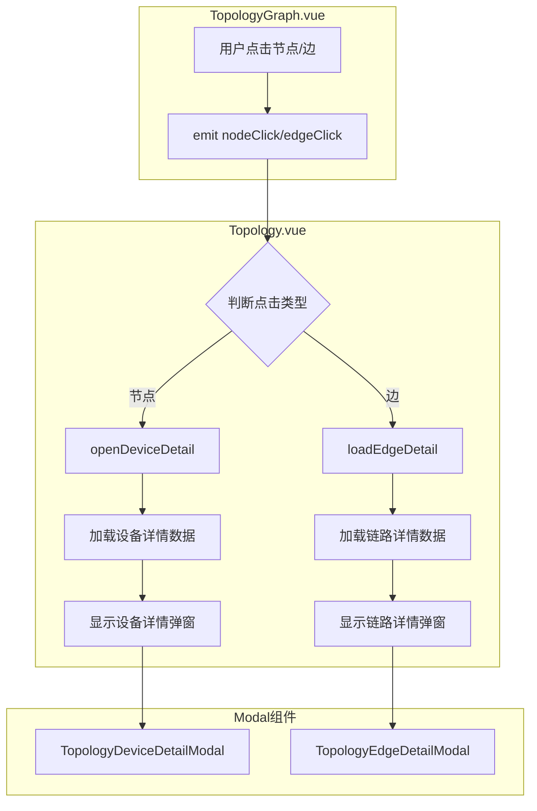

# 拓扑图形视图详情弹窗设计方案

## 问题描述

在拓扑图谱的图形视图中，点击链路和设备节点时，虽然事件正确触发并加载了数据，但界面上没有任何详情显示区域来展示这些信息。

### 根本原因

对比两种视图的实现：

| 视图类型 | 详情展示 | 代码位置 |
|---------|---------|---------|
| 表格视图 | ✅ 右侧面板显示"链路证据"和"设备详情" | Topology.vue 第 303-401 行 |
| 图形视图 | ❌ 仅有 TopologyGraph 组件，无详情展示区域 | Topology.vue 第 212-225 行 |

## 解决方案

采用 **浮动弹窗 (Modal)** 方案，点击设备/链路后以弹窗形式显示详细信息。

## 架构设计



## 组件设计

### 1. 设备详情弹窗 (TopologyDeviceDetailModal.vue)

**文件位置**: `frontend/src/components/topology/TopologyDeviceDetailModal.vue`

**Props 定义**:
```typescript
interface Props {
  show: boolean;                    // 是否显示弹窗
  loading: boolean;                 // 是否加载中
  deviceDetail: ParsedResult | null; // 设备详情数据
  nodeInfo: GraphNode | undefined;   // 图谱节点信息
  deviceId: string;                  // 设备ID
}
```

**Emits 定义**:
```typescript
interface Emits {
  'update:show': [value: boolean];  // 关闭弹窗
}
```

**UI 结构**:
```
┌─────────────────────────────────────────────────────┐
│ 设备详情                                        [X] │
├─────────────────────────────────────────────────────┤
│                                                     │
│  ┌─────────────────────────────────────────────┐   │
│  │ 设备图标   主机名 / 设备ID                   │   │
│  │            IP 地址                           │   │
│  └─────────────────────────────────────────────┘   │
│                                                     │
│  ┌─── 基本信息 ───────────────────────────────┐   │
│  │ 厂商: Huawei                               │   │
│  │ 型号: CE6880                               │   │
│  │ 版本: V200R019C10                          │   │
│  │ ESN: XXXXXXXX                              │   │
│  └─────────────────────────────────────────────┘   │
│                                                     │
│  ┌─── 统计信息 ───────────────────────────────┐   │
│  │ 接口: 24  |  LLDP邻居: 3  |  聚合口: 2     │   │
│  └─────────────────────────────────────────────┘   │
│                                                     │
│  ┌─── 推断节点提示 ───────────────────────────┐   │
│  │ ⚠️ 此设备通过FDB/ARP推断，未直接采集        │   │
│  │ MAC: xx:xx:xx:xx:xx:xx                     │   │
│  └─────────────────────────────────────────────┘   │
│                                                     │
├─────────────────────────────────────────────────────┤
│                              [ 关闭 ]               │
└─────────────────────────────────────────────────────┘
```

### 2. 链路详情弹窗 (TopologyEdgeDetailModal.vue)

**文件位置**: `frontend/src/components/topology/TopologyEdgeDetailModal.vue`

**Props 定义**:
```typescript
interface Props {
  show: boolean;                       // 是否显示弹窗
  edgeDetail: TopologyEdgeDetailView | null; // 链路详情数据
}
```

**Emits 定义**:
```typescript
interface Emits {
  'update:show': [value: boolean];     // 关闭弹窗
  'device-click': [deviceId: string];  // 点击设备名称
}
```

**UI 结构**:
```
┌─────────────────────────────────────────────────────┐
│ 链路详情                                        [X] │
├─────────────────────────────────────────────────────┤
│                                                     │
│  ┌─────────────────────────────────────────────┐   │
│  │  设备A:GE1/0/1  ←──────────→  设备B:GE1/0/2 │   │
│  │                                               │   │
│  │  类型: physical    状态: confirmed           │   │
│  │  置信度: 0.95                                │   │
│  └─────────────────────────────────────────────┘   │
│                                                     │
│  ┌─── 证据列表 ───────────────────────────────┐   │
│  │ ┌─────────────────────────────────────────┐ │   │
│  │ │ LLDP | 邻居发现                          │ │   │
│  │ │ device=192.168.1.1 cmd=display lldp ... │ │   │
│  │ │ 远端设备: SW-2  接口: GE1/0/2            │ │   │
│  │ └─────────────────────────────────────────┘ │   │
│  │ ┌─────────────────────────────────────────┐ │   │
│  │ │ FDB | MAC地址学习                        │ │   │
│  │ │ device=192.168.1.1 cmd=display fdb ...  │ │   │
│  │ │ MAC: aa:bb:cc:dd:ee:ff                  │ │   │
│  │ └─────────────────────────────────────────┘ │   │
│  └─────────────────────────────────────────────┘   │
│                                                     │
├─────────────────────────────────────────────────────┤
│                              [ 关闭 ]               │
└─────────────────────────────────────────────────────┘
```

## Topology.vue 修改方案

### 1. 新增状态变量

```typescript
// 设备详情弹窗状态
const showDeviceModal = ref(false);

// 链路详情弹窗状态  
const showEdgeModal = ref(false);
```

### 2. 修改事件处理函数

```typescript
async function openDeviceDetail(deviceID: string) {
  selectedDeviceID.value = deviceID;
  loadingDeviceDetail.value = true;
  showDeviceModal.value = true;  // 打开弹窗
  
  try {
    // ... 原有加载逻辑
  } finally {
    loadingDeviceDetail.value = false;
  }
}

async function loadEdgeDetail(edgeID: string) {
  if (!selectedRunId.value) return;
  showEdgeModal.value = true;  // 打开弹窗
  edgeDetail.value = await TaskExecutionAPI.getTopologyEdgeDetail(
    selectedRunId.value,
    edgeID,
  );
}
```

### 3. 模板修改

在图形视图区域添加弹窗组件：

```vue
<!-- 图形视图 -->
<div
  v-if="viewType === 'graph'"
  class="bg-bg-card border border-border rounded-xl overflow-hidden"
>
  <div class="h-[60vh]">
    <TopologyGraph
      :nodes="graphNodes"
      :edges="graphEdges"
      @node-click="openDeviceDetail"
      @edge-click="loadEdgeDetail"
    />
  </div>
</div>

<!-- 设备详情弹窗 -->
<TopologyDeviceDetailModal
  v-model:show="showDeviceModal"
  :loading="loadingDeviceDetail"
  :device-detail="deviceDetail"
  :node-info="nodeByID.get(selectedDeviceID)"
  :device-id="selectedDeviceID"
/>

<!-- 链路详情弹窗 -->
<TopologyEdgeDetailModal
  v-model:show="showEdgeModal"
  :edge-detail="edgeDetail"
  @device-click="openDeviceDetail"
/>
```

## 样式规范

遵循项目现有的 Modal 样式模式：

```css
/* 动画过渡 */
.modal-enter-active,
.modal-leave-active {
  transition: opacity 0.2s ease;
}

.modal-enter-from,
.modal-leave-to {
  opacity: 0;
}

/* 弹窗容器 */
.fixed.inset-0.z-50.flex.items-center.justify-center

/* 遮罩层 */
.absolute.inset-0.bg-black/60.backdrop-blur-sm

/* 弹窗内容 */
.relative.bg-bg-card.border.border-border.rounded-xl.shadow-2xl
```

## 文件清单

| 文件 | 操作 | 说明 |
|-----|------|------|
| `frontend/src/components/topology/TopologyDeviceDetailModal.vue` | 新建 | 设备详情弹窗组件 |
| `frontend/src/components/topology/TopologyEdgeDetailModal.vue` | 新建 | 链路详情弹窗组件 |
| `frontend/src/views/Topology.vue` | 修改 | 添加弹窗状态和组件引用 |

## 实施步骤

1. **创建设备详情弹窗组件**
   - 新建 `TopologyDeviceDetailModal.vue`
   - 实现设备基本信息展示
   - 实现推断节点特殊展示
   - 添加加载状态处理

2. **创建链路详情弹窗组件**
   - 新建 `TopologyEdgeDetailModal.vue`
   - 实现链路基本信息展示
   - 实现证据列表展示
   - 支持点击设备名称跳转

3. **修改 Topology.vue**
   - 导入新组件
   - 添加弹窗状态变量
   - 修改事件处理函数
   - 添加弹窗组件到模板

4. **测试验证**
   - 测试设备节点点击
   - 测试链路点击
   - 测试弹窗关闭
   - 测试推断节点展示
   - 测试链路证据展示

## 注意事项

1. **复用现有数据结构**: 直接使用 `deviceDetail` 和 `edgeDetail` 变量，无需修改 API 调用逻辑

2. **保持一致性**: 弹窗样式与项目中其他 Modal 保持一致

3. **推断节点处理**: 设备详情弹窗需要特殊处理推断节点（`nodeType === 'inferred'`）

4. **链路证据展示**: 链路详情弹窗需要展示完整的证据列表，包括远端设备信息

5. **设备跳转**: 链路详情弹窗中点击设备名称应能打开设备详情弹窗
