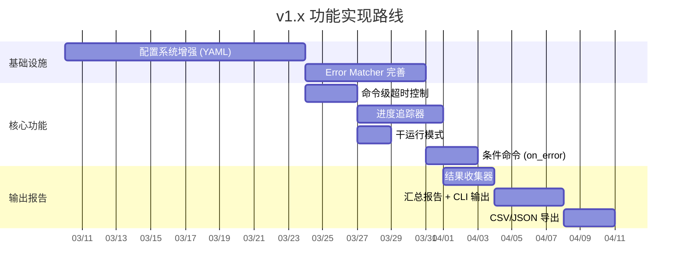

# NetWeaverGo v1.x 功能细化实现架构

基于对当前代码的深入分析，以下是 v1.x 四大功能模块的详细实现架构设计。每个功能都包含：改动范围、新增文件/结构体、关键代码流程、与现有模块的集成方式。

---

## 一、配置系统增强

### 1.1 目标

将当前硬编码的 `inventory.csv` + `config.txt` 升级为统一的 YAML 配置体系，支持设备分组、变量模板。

### 1.2 新增文件

```
internal/config/
├── config.go          [修改] 重构为统一入口，保留 CSV 兼容
├── schema.go          [新增] YAML 配置结构体定义
├── template.go        [新增] 变量模板引擎
├── loader.go          [新增] 多格式配置加载器（YAML / CSV 自动识别）
└── generator.go       [新增] 模板文件生成（从 config.go 中拆出）
```

### 1.3 核心结构体设计

```go
// schema.go - 统一配置文件结构

// ProjectConfig 顶层配置文件（netweaver.yaml）
type ProjectConfig struct {
    Version  string          `yaml:"version"`   // 配置格式版本
    Settings GlobalSettings  `yaml:"settings"`  // 全局运行参数
    Groups   []DeviceGroup   `yaml:"groups"`    // 设备分组
    Playbook []PlaybookEntry `yaml:"playbook"`  // 命令编排
}

// GlobalSettings 全局运行参数
type GlobalSettings struct {
    MaxWorkers     int           `yaml:"max_workers"`      // 并发数 (当前硬编码为 32)
    ConnectTimeout string        `yaml:"connect_timeout"`  // 连接超时 (如 "10s")
    CommandTimeout string        `yaml:"command_timeout"`  // 单条命令超时 (如 "30s")
    OutputDir      string        `yaml:"output_dir"`       // 回显输出目录
    LogDir         string        `yaml:"log_dir"`          // 日志目录
    ErrorMode      string        `yaml:"error_mode"`       // "pause" | "skip" | "abort"
}

// DeviceGroup 设备分组
type DeviceGroup struct {
    Name        string            `yaml:"name"`          // 分组名称 (如 "核心交换机")
    Tags        []string          `yaml:"tags"`          // 标签 (如 ["huawei", "datacenter-a"])
    Credentials *Credentials      `yaml:"credentials"`   // 组级凭据 (可覆盖设备级)
    Devices     []DeviceEntry     `yaml:"devices"`       // 设备清单
}

// Credentials 凭据信息（支持组级 + 设备级覆盖）
type Credentials struct {
    Username string `yaml:"username"`
    Password string `yaml:"password"`
    Port     int    `yaml:"port"`
}

// DeviceEntry 单台设备（只需 IP，其余继承组级凭据）
type DeviceEntry struct {
    IP       string       `yaml:"ip"`
    Port     int          `yaml:"port,omitempty"`       // 可选覆盖
    Username string       `yaml:"username,omitempty"`   // 可选覆盖
    Password string       `yaml:"password,omitempty"`   // 可选覆盖
    Vars     map[string]string `yaml:"vars,omitempty"`  // 设备级变量
}

// PlaybookEntry 命令编排条目
type PlaybookEntry struct {
    Command   string `yaml:"command"`             // 命令文本 (支持 {{var}} 模板)
    Timeout   string `yaml:"timeout,omitempty"`   // 单条命令超时覆盖
    OnError   string `yaml:"on_error,omitempty"`  // 本条的错误策略覆盖
    Condition string `yaml:"condition,omitempty"` // 条件表达式 (v1.x 预留)
}
```

### 1.4 YAML 配置文件范例

```yaml
# netweaver.yaml
version: "1.0"

settings:
  max_workers: 32
  connect_timeout: "10s"
  command_timeout: "30s"
  output_dir: "output"
  log_dir: "logs"
  error_mode: "pause" # pause / skip / abort

groups:
  - name: "核心交换机"
    tags: ["huawei", "core"]
    credentials:
      username: "admin"
      password: "Admin@123"
      port: 22
    devices:
      - ip: "192.168.1.1"
      - ip: "192.168.1.2"
        vars:
          hostname: "CORE-SW-02"

  - name: "接入交换机"
    tags: ["h3c", "access"]
    credentials:
      username: "root"
      password: "Root@456"
    devices:
      - ip: "10.0.1.1"
      - ip: "10.0.1.2"

playbook:
  - command: "system-view"
  - command: "sysname {{hostname}}" # 使用设备级变量
  - command: "display interface brief"
    timeout: "60s" # 本条单独超时
  - command: "quit"
```

### 1.5 变量模板引擎

```go
// template.go
// RenderCommand 将命令模板中的 {{key}} 替换为设备变量值
func RenderCommand(tmpl string, vars map[string]string) (string, error) {
    re := regexp.MustCompile(`\{\{(\w+)\}\}`)
    result := re.ReplaceAllStringFunc(tmpl, func(match string) string {
        key := strings.Trim(match, "{}")
        if val, ok := vars[key]; ok {
            return val
        }
        return match // 未定义则保留原文，不报错
    })
    return result, nil
}
```

### 1.6 加载流程（向后兼容）

```mermaid
flowchart TD
    A[程序启动] --> B{检查 netweaver.yaml 是否存在?}
    B -->|存在| C[解析 YAML → ProjectConfig]
    B -->|不存在| D{检查 inventory.csv 是否存在?}
    D -->|存在| E[兼容模式: 读取 CSV + TXT]
    D -->|不存在| F[生成 netweaver.yaml 模板]
    C --> G[展开凭据继承 + 变量合并]
    G --> H[返回 []DeviceAsset + []Command]
    E --> H
```

### 1.7 对现有模块的影响

| 模块                                                                  | 改动                                                                                                                                       |
| --------------------------------------------------------------------- | ------------------------------------------------------------------------------------------------------------------------------------------ |
| `config`                                                              | 重构为多格式 Loader，[DeviceAsset](file:///d:/Document/Code/NetWeaverGo/internal/config/config.go#13-19) 结构体增加 `Vars` 和 `Group` 字段 |
| `engine`                                                              | [NewEngine](file:///d:/Document/Code/NetWeaverGo/internal/engine/engine.go#33-41) 接收 `GlobalSettings` 控制并发数/超时，不再硬编码        |
| `executor`                                                            | 命令下发前调用 `RenderCommand()` 做变量替换                                                                                                |
| [main.go](file:///d:/Document/Code/NetWeaverGo/cmd/netweaver/main.go) | 统一调用 `config.Load()` 替代 [ParseOrGenerate()](file:///d:/Document/Code/NetWeaverGo/internal/config/config.go#25-62)                    |

---

## 二、Error Matcher 完善

### 2.1 目标

内置各厂商错误模式库，支持用户自定义规则，引入错误分级。

### 2.2 新增文件

```
internal/matcher/
├── matcher.go        [修改] 引入 ErrorRule 和分级系统
├── rules.go          [新增] 内置厂商错误规则库
└── loader.go         [新增] 从 YAML 配置加载自定义规则
```

### 2.3 核心结构体设计

```go
// matcher.go

// ErrorSeverity 错误严重程度分级
type ErrorSeverity int

const (
    SeverityWarning  ErrorSeverity = iota // 仅告警，不阻塞
    SeverityCritical                      // 严重错误，触发 SuspendHandler
)

// ErrorRule 一条错误匹配规则
type ErrorRule struct {
    Name     string         // 规则名称 (如 "华为配置冲突")
    Pattern  *regexp.Regexp // 正则表达式
    Severity ErrorSeverity  // 严重程度
    Vendor   string         // 适用厂商 (空 = 通用)
    Message  string         // 人类可读的错误说明
}

// MatchResult 匹配结果（替代原来的 bool 返回）
type MatchResult struct {
    Matched  bool
    Rule     *ErrorRule  // 命中的规则
    Line     string      // 原始行内容
}

// StreamMatcher 升级版匹配器
type StreamMatcher struct {
    Rules   []ErrorRule    // 替代原 ErrorPatterns
    Prompts []string
    mu      sync.RWMutex
}

// MatchError 升级后返回 MatchResult 代替 bool
func (m *StreamMatcher) MatchError(line string) *MatchResult {
    m.mu.RLock()
    defer m.mu.RUnlock()
    for _, rule := range m.Rules {
        if rule.Pattern.MatchString(line) {
            return &MatchResult{
                Matched: true,
                Rule:    &rule,
                Line:    line,
            }
        }
    }
    return &MatchResult{Matched: false}
}
```

### 2.4 内置厂商规则库

```go
// rules.go

// HuaweiRules 华为交换机常见错误
var HuaweiRules = []ErrorRule{
    {Name: "invalid-input",  Pattern: regexp.MustCompile(`(?i)Error:\s*Invalid input`),
     Severity: SeverityCritical, Vendor: "huawei", Message: "无效输入命令"},
    {Name: "incomplete-cmd",  Pattern: regexp.MustCompile(`(?i)Error:\s*Incomplete command`),
     Severity: SeverityCritical, Vendor: "huawei", Message: "命令不完整"},
    {Name: "unrecognized",   Pattern: regexp.MustCompile(`(?i)Error:\s*Unrecognized command`),
     Severity: SeverityCritical, Vendor: "huawei", Message: "无法识别的命令"},
    {Name: "config-conflict", Pattern: regexp.MustCompile(`(?i)Error:\s*The configuration.*conflict`),
     Severity: SeverityWarning,  Vendor: "huawei", Message: "配置冲突"},
}

// H3CRules 华三交换机常见错误
var H3CRules = []ErrorRule{
    {Name: "wrong-param",     Pattern: regexp.MustCompile(`(?i)% Wrong parameter`),
     Severity: SeverityCritical, Vendor: "h3c", Message: "参数错误"},
    {Name: "ambiguous-cmd",  Pattern: regexp.MustCompile(`(?i)% Ambiguous command`),
     Severity: SeverityCritical, Vendor: "h3c", Message: "命令歧义"},
}

// CiscoRules Cisco 设备常见错误
var CiscoRules = []ErrorRule{
    {Name: "invalid-input",   Pattern: regexp.MustCompile(`(?i)% Invalid input`),
     Severity: SeverityCritical, Vendor: "cisco", Message: "无效输入"},
    {Name: "incomplete-cmd",  Pattern: regexp.MustCompile(`(?i)% Incomplete command`),
     Severity: SeverityCritical, Vendor: "cisco", Message: "命令不完整"},
}

// RuijieRules 锐捷设备常见错误
var RuijieRules = []ErrorRule{
    {Name: "invalid-input",   Pattern: regexp.MustCompile(`(?i)% Invalid input`),
     Severity: SeverityCritical, Vendor: "ruijie", Message: "无效输入"},
}

// GenericRules 通用错误规则
var GenericRules = []ErrorRule{
    {Name: "permission-denied", Pattern: regexp.MustCompile(`(?i)(permission denied|access denied)`),
     Severity: SeverityCritical, Vendor: "", Message: "权限不足"},
    {Name: "connection-refused", Pattern: regexp.MustCompile(`(?i)connection refused`),
     Severity: SeverityCritical, Vendor: "", Message: "连接被拒绝"},
}

// AllBuiltinRules 合并所有内置规则
func AllBuiltinRules() []ErrorRule {
    var all []ErrorRule
    all = append(all, GenericRules...)
    all = append(all, HuaweiRules...)
    all = append(all, H3CRules...)
    all = append(all, CiscoRules...)
    all = append(all, RuijieRules...)
    return all
}
```

### 2.5 用户自定义规则（集成到 YAML 配置）

```yaml
# netweaver.yaml 新增 error_rules 段
error_rules:
  - name: "自定义-端口已占用"
    pattern: "port.*already.*in use"
    severity: "warning"
    message: "端口已被占用，可能是重复配置"

  - name: "自定义-VLAN不存在"
    pattern: "(?i)vlan.*does not exist"
    severity: "critical"
    message: "引用了不存在的 VLAN"
```

### 2.6 Executor 集成改动

```diff
 // executor.go - ExecutePlaybook 中的错误检测逻辑

- if e.Matcher.MatchError(line) {
-     logger.Warn("[%s] ====== [命中异常规则] 挂起当前设备执行 ======", e.IP)
+ result := e.Matcher.MatchError(line)
+ if result.Matched {
+     if result.Rule.Severity == matcher.SeverityWarning {
+         // Warning: 只记录日志，不阻塞
+         logger.Warn("[%s] [⚠ WARNING] %s: %s", e.IP, result.Rule.Name, result.Rule.Message)
+         continue
+     }
+     // Critical: 触发挂起
+     logger.Warn("[%s] [✖ CRITICAL] %s: %s", e.IP, result.Rule.Name, result.Rule.Message)
```

---

## 三、执行增强

### 3.1 目标

实现命令级超时、进度追踪、条件命令、干运行模式。

### 3.2 新增文件

```
internal/executor/
├── executor.go    [修改] 支持命令级超时 + 进度回调
├── progress.go    [新增] 执行进度追踪器
└── dryrun.go      [新增] 干运行模式逻辑
```

```
internal/engine/
└── engine.go      [修改] 集成进度汇总 + dry-run 开关
```

### 3.3 命令级超时控制

当前 executor 中存在一个全局的 `timeoutDuration = 30 * time.Second`，改为每条命令独立控制：

```go
// executor.go

// CommandEntry 替代原来的纯 string 命令
type CommandEntry struct {
    Raw       string        // 原始命令文本
    Timeout   time.Duration // 本条命令超时 (0 = 使用全局默认)
    OnError   string        // "pause" | "skip" | "abort" (空 = 全局)
    Condition string        // 条件表达式 (预留)
}

// ExecutePlaybook 签名变更
func (e *DeviceExecutor) ExecutePlaybook(
    ctx context.Context,
    commands []CommandEntry,   // 从 []string → []CommandEntry
    defaultTimeout time.Duration,
) error {
    // ...

    // 发送命令时：
    cmd := commands[currentCmdIndex]
    timeout := cmd.Timeout
    if timeout == 0 {
        timeout = defaultTimeout
    }
    timer.Reset(timeout) // 使用该命令的专属超时
}
```

### 3.4 执行进度追踪

```go
// progress.go

// ProgressEvent 进度事件推送（为未来 Wails 事件体系预留）
type ProgressEvent struct {
    DeviceIP     string        `json:"device_ip"`
    TotalCmds    int           `json:"total_cmds"`
    CurrentIndex int           `json:"current_index"`   // 当前执行到第几条 (0-based)
    CurrentCmd   string        `json:"current_cmd"`     // 当前命令文本
    Status       DeviceStatus  `json:"status"`          // 设备状态
    Error        string        `json:"error,omitempty"` // 错误信息
    StartedAt    time.Time     `json:"started_at"`
    Elapsed      time.Duration `json:"elapsed"`
}

type DeviceStatus string
const (
    StatusConnecting DeviceStatus = "connecting"
    StatusRunning    DeviceStatus = "running"
    StatusSuspended  DeviceStatus = "suspended"  // 等待用户决策
    StatusCompleted  DeviceStatus = "completed"
    StatusFailed     DeviceStatus = "failed"
)

// ProgressTracker 进度追踪器
type ProgressTracker struct {
    events   []ProgressEvent
    mu       sync.RWMutex
    callback func(ProgressEvent) // 事件回调 (CLI打印 / Wails推送)
}

func NewProgressTracker(cb func(ProgressEvent)) *ProgressTracker {
    return &ProgressTracker{callback: cb}
}

func (t *ProgressTracker) Emit(event ProgressEvent) {
    t.mu.Lock()
    t.events = append(t.events, event)
    t.mu.Unlock()
    if t.callback != nil {
        t.callback(event)
    }
}
```

CLI 模式下的进度展示效果：

```
[14:35:01] 总进度: 8/20 台设备完成 | 运行中: 10 | 挂起: 1 | 失败: 1
[192.168.1.1]  ████████░░ 4/5 cmds  [running]  display interface brief
[192.168.1.2]  ██████████ 5/5 cmds  [completed]
[10.0.1.1]     ██░░░░░░░░ 1/5 cmds  [suspended] ⚠ Error: Invalid input
```

### 3.5 条件命令

通过简单的前缀符号实现条件逻辑，保持对网络工程师友好：

```yaml
playbook:
  - command: "system-view"
  - command: "display vlan brief"
  - command: "vlan 100"
    on_error: "skip" # 如果 VLAN 100 已存在则跳过
  - command: "quit"
```

> [!NOTE]
> v1.x 阶段只实现 `on_error` 级别的条件（错误后跳过/继续/中止），更复杂的条件表达式（如基于上条输出内容的 if/else）推迟到 v2.x 的 Playbook 文件系统中。

### 3.6 干运行（Dry Run）模式

```go
// dryrun.go

// DryRunExecutor 模拟执行器 — 不建立真实 SSH 连接
type DryRunExecutor struct {
    IP       string
    Commands []CommandEntry
    Log      *logger.DeviceOutput
}

func (d *DryRunExecutor) Execute() {
    logger.Info("[DRY-RUN] 设备 %s - 将执行以下 %d 条命令:", d.IP, len(d.Commands))
    for i, cmd := range d.Commands {
        timeout := cmd.Timeout
        if timeout == 0 {
            timeout = 30 * time.Second
        }
        logger.Info("  [%d/%d] %s (超时: %v, 错误策略: %s)",
            i+1, len(d.Commands), cmd.Raw, timeout, cmd.OnError)
    }
}
```

```diff
 // main.go
+ isDryRun := flag.Bool("dry-run", false, "预览命令但不实际下发")
```

```diff
 // engine.go - Run 方法
+ if e.DryRun {
+     for _, dev := range e.Devices {
+         dry := &executor.DryRunExecutor{IP: dev.IP, Commands: e.Commands}
+         dry.Execute()
+     }
+     return
+ }
```

---

## 四、报告与输出

### 4.1 目标

生成结构化执行报告，支持输出解析和导出。

### 4.2 新增文件

```
internal/report/
├── collector.go    [新增] 执行结果收集器
├── summary.go      [新增] 汇总报告生成
├── exporter.go     [新增] CSV / JSON 导出
└── parser.go       [新增] 命令输出结构化解析 (后续逐步扩展)
```

### 4.3 核心结构体设计

```go
// collector.go

// DeviceResult 单台设备的完整执行结果
type DeviceResult struct {
    IP         string              `json:"ip"`
    Group      string              `json:"group"`
    Status     string              `json:"status"`    // "success" | "partial" | "failed" | "skipped"
    StartTime  time.Time           `json:"start_time"`
    EndTime    time.Time           `json:"end_time"`
    Duration   time.Duration       `json:"duration"`
    Commands   []CommandResult     `json:"commands"`
    ConnError  string              `json:"conn_error,omitempty"`
}

// CommandResult 单条命令的执行结果
type CommandResult struct {
    Index    int           `json:"index"`
    Command  string        `json:"command"`
    Output   string        `json:"output"`     // 命令回显
    Duration time.Duration `json:"duration"`
    Status   string        `json:"status"`     // "ok" | "error" | "timeout" | "skipped"
    Error    string        `json:"error,omitempty"`
}

// ResultCollector 线程安全的结果收集器
type ResultCollector struct {
    Results []DeviceResult
    mu      sync.Mutex
}

func (c *ResultCollector) Add(result DeviceResult) {
    c.mu.Lock()
    defer c.mu.Unlock()
    c.Results = append(c.Results, result)
}
```

### 4.4 汇总报告

```go
// summary.go

type Summary struct {
    TotalDevices   int           `json:"total_devices"`
    Succeeded      int           `json:"succeeded"`
    Failed         int           `json:"failed"`
    PartialFailed  int           `json:"partial_failed"`
    Skipped        int           `json:"skipped"`
    TotalCommands  int           `json:"total_commands"`
    TotalDuration  time.Duration `json:"total_duration"`
    FailedDevices  []FailedInfo  `json:"failed_devices"`
}

type FailedInfo struct {
    IP     string `json:"ip"`
    Reason string `json:"reason"`
}

func GenerateSummary(results []DeviceResult) *Summary { ... }
```

CLI 输出效果：

```
╔════════════════════════════════════════════════════╗
║             NetWeaverGo 执行报告                    ║
╠════════════════════════════════════════════════════╣
║  总设备数: 20    成功: 17    失败: 2    部分失败: 1   ║
║  总命令数: 100   总耗时: 2m35s                       ║
╠════════════════════════════════════════════════════╣
║  ✖ 失败设备:                                        ║
║    - 192.168.1.5  | SSH连接超时                     ║
║    - 10.0.1.3     | 命令执行错误: Invalid input      ║
║  ⚠ 部分失败:                                        ║
║    - 192.168.1.8  | 2/5 命令执行异常                  ║
╚════════════════════════════════════════════════════╝
```

### 4.5 CSV 导出

```go
// exporter.go

func ExportCSV(results []DeviceResult, filename string) error {
    // 列: IP, 分组, 状态, 命令总数, 成功数, 失败数, 耗时, 错误信息
    // ...
}

func ExportJSON(results []DeviceResult, filename string) error {
    // 完整 JSON 报告，包含每台设备每条命令的详细输出
    // ...
}
```

### 4.6 与 Engine 的集成

```diff
 // engine.go
 type Engine struct {
     Devices    []config.DeviceAsset
     Commands   []string
     MaxWorkers int
+    Collector  *report.ResultCollector  // 结果收集器
+    Tracker    *executor.ProgressTracker // 进度追踪器
     promptMu   sync.Mutex
 }

 // Run 尾部新增
 func (e *Engine) Run(ctx context.Context) {
     // ... 原有逻辑 ...
     wg.Wait()

+    // 生成执行报告
+    summary := report.GenerateSummary(e.Collector.Results)
+    report.PrintSummary(summary)
+
+    // 可选导出
+    reportName := fmt.Sprintf("report_%s", time.Now().Format("20060102_150405"))
+    report.ExportCSV(e.Collector.Results, filepath.Join("output", reportName+".csv"))
+    report.ExportJSON(e.Collector.Results, filepath.Join("output", reportName+".json"))
+
     logger.Info("[NetWeaverGo] 所有设备的通信投递线程均已结束。安全退出。")
 }
```

---

## 五、各功能实现优先级与依赖关系



### 依赖关系总结

| 功能          | 前置依赖                       | 影响模块                                                                                    |
| ------------- | ------------------------------ | ------------------------------------------------------------------------------------------- |
| YAML 配置     | 无                             | `config`、`engine`、[main.go](file:///d:/Document/Code/NetWeaverGo/cmd/netweaver/main.go)   |
| Error Matcher | YAML 配置（自定义规则段）      | `matcher`、`executor`                                                                       |
| 命令级超时    | YAML 配置（playbook 超时字段） | `executor`                                                                                  |
| 进度追踪      | 无                             | `executor`、`engine`                                                                        |
| Dry Run       | YAML 配置                      | `executor`、`engine`、[main.go](file:///d:/Document/Code/NetWeaverGo/cmd/netweaver/main.go) |
| 条件命令      | Error Matcher                  | `executor`                                                                                  |
| 报告系统      | 进度追踪                       | `engine`、新增 `report` 包                                                                  |

---

## 六、额外建议：接口抽象（为测试和扩展铺路）

在实现以上功能之前/同时，建议先为核心模块提取接口，便于单元测试和未来 Wails 集成：

```go
// internal/sshutil/interface.go
type Connector interface {
    SendCommand(cmd string) error
    Close() error
}

// internal/executor/interface.go
type Executor interface {
    Connect(ctx context.Context) error
    ExecutePlaybook(ctx context.Context, commands []CommandEntry, timeout time.Duration) error
    Close()
}

// internal/matcher/interface.go
type Matcher interface {
    MatchError(line string) *MatchResult
    IsPrompt(chunk string) bool
}
```

这样在测试中可以方便地 mock SSH 连接，无需真实设备即可验证命令执行逻辑。
